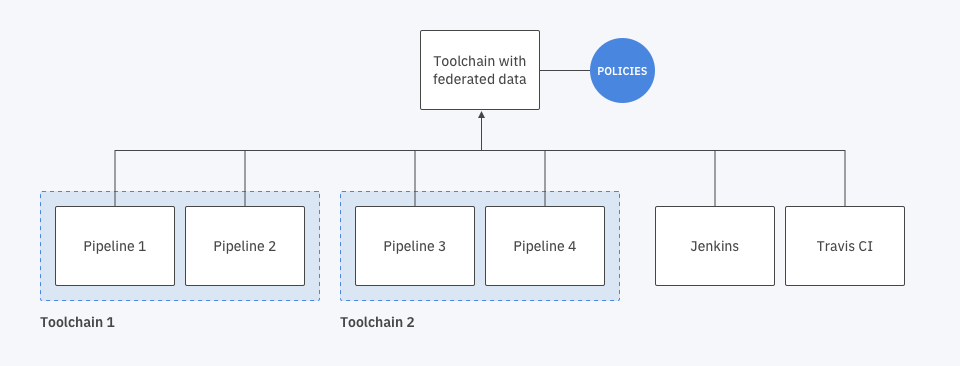

---

copyright:
  years: 2019, 2020
lastupdated: "2020-01-15"

keywords: devops insights, devops, insights, toolchain, aggregate, test, tests, gate, gate failing, app

subcollection: ContinuousDelivery

---

{:new_window: target="_blank"}
{:shortdesc: .shortdesc}
{:screen: .screen}
{:codeblock: .codeblock}
{:tip: .tip}
{:note: .note}
{:important: .important}
{:pre: .pre}
{:table: .aria-labeledby="caption"}

# Aggregating data from multiple sources into a single toolchain
{: #aggregating-multiple-sources}

By default, the data that is generated by your pipeline or other tools are aggregated to the toolchain that the tools are in. With {{site.data.keyword.DRA_full}}, you can aggregate quality data that is generated by {{site.data.keyword.contdelivery_full}} from multiple sources into a single toolchain. 
{:shortdesc}

 Figure 1. Information and data from multiple CI/CD tools are funneled into a central toolchain with specific policies


## Before you begin
{: #prereq-multiple-sources}

1. Configure your {{site.data.keyword.contdelivery_short}} pipeline to send build, test, and deployment records to {{site.data.keyword.DRA_short}}. The following links provide more information:

  * [Publishing a build record](/docs/ContinuousDelivery?topic=ContinuousDelivery-publish-build-cli)
  * [Publishing a deployment record](/docs/ContinuousDelivery?topic=ContinuousDelivery-publish-deploy-cli)
  * [Publishing test results](/docs/ContinuousDelivery?topic=ContinuousDelivery-publish-test-cli)

2. Define gate policies in the single toolchain that you want to use to aggregate gate reports. For more information, see [Defining policies and rules](/docs/ContinuousDelivery?topic=ContinuousDelivery-defining-policies-rules).


## Identifying your toolchain ID
{: #identifying-toolchain-ID}

You need to know your toolchain ID for integrating Jenkins, Travis CI, and other continuous integration and continuous delivery (CI/CD) tools with {{site.data.keyword.DRA_full}}. Your toolchain ID can also be used to configure the aggregation of data of [multiple sources into a single toolchain](/docs/ContinuousDelivery?topic=ContinuousDelivery-aggregating-multiple-sources). 

For more information about integrating Jenkins or other CI/CD tools with {{site.data.keyword.DRA_short}}, see [Integrating Jenkins with {{site.data.keyword.DRA_short}}](/docs/services/ContinuousDelivery?topic=ContinuousDelivery-publish-build-jenkins) or [Integrating other CI/Cd tools with {{site.data.keyword.DRA_short}}](/docs/ContinuousDelivery?topic=ContinuousDelivery-setting-values-cicd).  

### Finding your toolchain ID
{: #finding-toolchain-id}

Your toolchain ID is in the URL. To find your toolchain ID, use the following steps:

1. From the {{site.data.keyword.Bluemix}} console, click the menu icon , and select **DevOps**.
2. Select your toolchain. 
3. Select the **{{site.data.keyword.DRA_short}}** tile. 
4. In the url, select and copy everything after `?toolchainId=`. It's a string of 36 characters long, composed of alphanumeric characters and dashes. 

If you want to find the toolchain ID for Jenkins, select Jenkins from the toolchain instead of {{site.data.keyword.DRA_short}}. The toolchain ID is found in the same way in the URL. 
{: note} 

For example: `https://cloud.ibm.com/devops/insights/overview?toolchainid=99c643c3-23d9-4030-9b1f-3aadfd7f9d09`. The Toolchain ID is `99c643c3-23d9-4030-9b1f-3aadfd7f9d09`. 

The `API_KEY` used in the script to log in to the {{site.data.keyword.Bluemix_notm}} must have access to the new toolchain_id that is being provided. For more information about creating and managing API keys, see [Managing user API keys](/docs/services/iam?topic=iam-userapikey#userapikey)  


## Publishing records to a centralized target toolchain
{: #aggregate-centralized-toolchain}

To publish data to a single toolchain, you must modify the scripts of your pipeline stages, but must you modify the stages through which you are publishing data. You modify the stages only when you want to publish the data in a different toolchain. Not when you want to publish data to the current toolchain that the pipeline is in. 

To publish your records to a centralized toolchain, use the following steps:

1. Click the menu icon , and select **Resource List**.
2. Select your toolchain.
3. Select the **{{site.data.keyword.deliverypipeline}}** tile. 
4. Click the **Settings** icon  > **Configure Stage**. 
5. Make your changes in the script section. For each stage where you called commands to send build, test, and deployment records, set TOOLCHAIN_ID as the environment variable to the toolchain ID. Export the toolchain ID before the variables call the command. 
6. Call commands for gate decisions, or send build, test, deployment records to {{site.data.keyword.DRA_short}}. For more information, see [Setting consistent parameter values by using the {{site.data.keyword.Bluemix}} CLI](/docs/ContinuousDelivery?topic=ContinuousDelivery-setting-values-cli).  

You export TOOLCHAIN_ID as environment variable for stages of the pipeline where they are using the {{site.data.keyword.DRA_short}} CLI.
{: note}

Here is an example of how to send build records to {{site.data.keyword.DRA_short}} in another toolchain. You must overwrite the toolchain ID before you call the command to evaluate gate, publish build, test, or deployment records. 
```
#!/bin/bash

#install the latest version of {{site.data.keyword.DRA_short}} plugin
ibmcloud plugin install -f doi

# Login to IBMCloud if you are not already logged in.  Assumes that $API_KEY environment variable has been set as a secured property in environment variable
ibmcloud login --apikey $API_KEY --no-region

# Overwrite the default TOOLCHAIN_ID with the Toolchain ID of the {{site.data.keyword.DRA_short}} instance you would like to send data to
export TOOLCHAIN_ID="$DEVOPS_INSIGHTS_TOOLCHAIN_ID"

# $GIT_BRANCH, $GIT_URL, $GIT_COMMIT are environment variables made available by the {{site.data.keyword.contdelivery_short}} pipeline
# Assumes you have set $MY_APP_NAME and $MY_BUILD_NUMBER as described earlier

ibmcloud doi publishbuildrecord --logicalappname="$MY_APP_NAME" --buildnumber="$MY_BUILD_NUMBER" --branch $GIT_BRANCH --repositoryurl $GIT_URL --commitid $GIT_COMMIT --status pass
```
{:codeblock}
