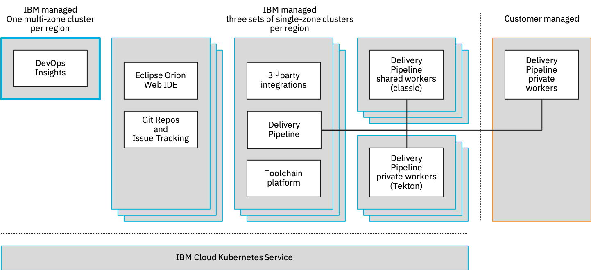
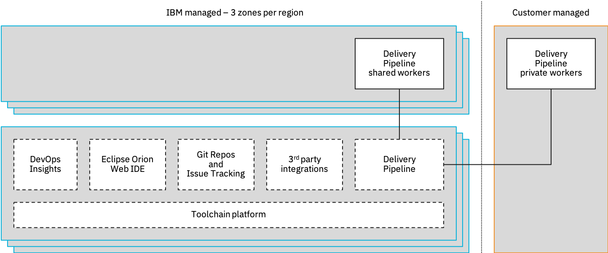
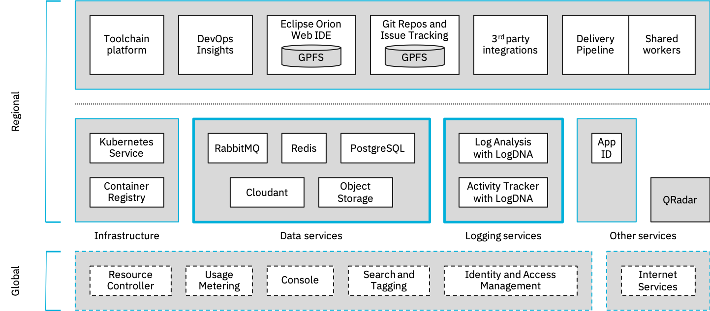

---

copyright:
  years: 2020
lastupdated: "2020-04-03"

keywords: public isolation for IBM Cloud Continuous Delivery, compute isolation for Continuous Delivery, Continuous Delivery architecture, workload isolation in Continuous Delivery

---

{:shortdesc: .shortdesc}
{:table: .aria-labeledby="caption"}
{:new_window: target="_blank"}
{:external: target="_blank" .external}
{:codeblock: .codeblock}
{:pre: .pre}
{:screen: .screen}
{:tip: .tip}
{:note: .note}
{:important: .important}
{:download: .download}
{:help: data-hd-content-type='help'}
{:support: data-reuse='support'}

# Learning about {{site.data.keyword.contdelivery_short}} and workload isolation
{: #cd-compute-isolation}

{{site.data.keyword.contdelivery_full}} is offered as a regional, shared, multi-tenant service with public endpoints. This service is composed of several major components. Most of these components are fully IBM-managed, and most support a shared compute, network, and physical storage model.
{: shortdesc}

The following table lists the major components of the {{site.data.keyword.contdelivery_short}} service, who manages each component, and the compute, network, and storage isolation characteristics of each component.

| Component | Manager | Isolation characteristics|
|:-----------------|:-----------------|:-----------------|
| Toolchain platform | IBM | Shared, compute, network, and storage |
| Third-party tool integrations | IBM | Shared, compute, network, and storage |
| Eclipse Orion {{site.data.keyword.webide}} | IBM | Shared, compute, network, and storage |
| {{site.data.keyword.gitrepos}} | IBM | Shared, compute, network, and storage |
| {{site.data.keyword.DRA_short}}| IBM | Shared, compute, network, and storage |
| {{site.data.keyword.deliverypipeline}} | IBM | Shared, compute, network, and storage |
| {{site.data.keyword.deliverypipeline}} shared workers | IBM | Each pipeline job or step runs in isolation, in its own container, on a pool of IBM-managed shared worker nodes with shared network and storage. |
| {{site.data.keyword.deliverypipeline}} private workers | You | Each pipeline job or step runs in isolation, in its own container on worker nodes that you manage, supported by network and storage that you define or manage. |
{: caption="Table 1. Service component management" caption-side="top"}

{{site.data.keyword.deliverypipeline}} jobs and steps run directly within containers on shared (IBM-managed) or private (customer-managed) Kubernetes worker nodes. All other components of the {{site.data.keyword.contdelivery_short}} service are deployed as microservices within IBM-managed Kubernetes clusters. These components are logically partitioned across a set of clusters. Except for {{site.data.keyword.DRA_short}}, each set of clusters is replicated across three zones in each region in which the {{site.data.keyword.contdelivery_short}} service is available. {{site.data.keyword.DRA_short}} runs in a single multi-zone cluster in each region.

The following diagram shows how the {{site.data.keyword.contdelivery_short}} service components are organized into clusters by using visual indicators for each element.

* Bold outline represents the IBM-managed cluster that is a multi-zone region cluster that runs {{site.data.keyword.DRA_short}} within a specific region
* All other IBM-managed components run within three single-zone clusters per region, with each cluster hosted within a distinct data center in the region.

 
 
For more information about availability, see [High availability and disaster recovery](/docs/ContinuousDelivery?topic=ContinuousDelivery-ha-dr).
 
All {{site.data.keyword.contdelivery_short}} service plans share management, isolation, and deployment characteristics. For more information about the {{site.data.keyword.contdelivery_short}} plans, see [Plan limitations and usage](/docs/ContinuousDelivery?topic=ContinuousDelivery-limitations_usage).
{: tip}

## {{site.data.keyword.contdelivery_short}} workload isolation
{: #cd-workload-isolation}

All IBM-managed components of the {{site.data.keyword.contdelivery_short}} service support shared compute workloads. Each {{site.data.keyword.deliverypipeline}} worker job or step, shared or private, runs in its own container.

The following diagram shows the management and isolation characteristics of the {{site.data.keyword.contdelivery_short}} service components by using visual indicators for each component.

* Solid outlines represent support for container-level compute workload isolation
* Dashed outlines represent support for shared compute workloads

 

## {{site.data.keyword.contdelivery_short}} dependencies
{: #cd-dependencies}

The {{site.data.keyword.contdelivery_short}} service depends on several {{site.data.keyword.cloud_notm}} Platform components and services that include, but are not limited to, the following tasks.

* Hosting the internal microservices of the {{site.data.keyword.contdelivery_short}} service
* Integrating into the {{site.data.keyword.cloud_notm}} Platform and user interface
* Storing service and customer-owned data
* Logging and auditing service events
* Backing up service and customer data regularly

The following table lists the main dependencies of the {{site.data.keyword.contdelivery_short}} service.

| Dependency | Type | Purpose|
|:-----------------|:-----------------|:-----------------|
| Console | Platform | Enables users to manage {{site.data.keyword.contdelivery_short}} service instances and toolchains by way of a web UI. Handles user login for most {{site.data.keyword.contdelivery_short}} service web pages. |
| Identity and Access Management (IAM) | Platform | Provides authorization checks to {{site.data.keyword.contdelivery_short}} and toolchain resources and actions. Generates and authenticates IAM API keys such as those that are used by the {{site.data.keyword.deliverypipeline}} component. |
| Search and tagging | Platform | Provides cached, high performance lookup of resources. |
| Resource controller | Platform | Coordinates the provisioning, updating, and de-provisioning of {{site.data.keyword.contdelivery_short}} and toolchain resources. |
| Usage metering| Platform | Receives usage metrics from the {{site.data.keyword.contdelivery_short}} service to report usage and compute bills for customer accounts. |
| {{site.data.keyword.containerlong}} | Service | Hosts clusters of containers in which the internal microservices of the {{site.data.keyword.contdelivery_short}} service run. |
| {{site.data.keyword.registrylong}} | Service | Stores container images that are used by {{site.data.keyword.deliverypipeline}} jobs and steps. |
| {{site.data.keyword.la_full}}  | Service | Collects internal log events from the {{site.data.keyword.contdelivery_short}} service for use by IBM specialists in maintaining and supporting the service. |
| {{site.data.keyword.at_full_notm}}  | Service | Collects action events from the {{site.data.keyword.contdelivery_short}} service so that customers can audit activities with the {{site.data.keyword.contdelivery_short}} service and its components. |
| {{site.data.keyword.appid_full}}  | Service | Manages conversions between IBM Cloud user IDs and user email addresses. |
| {{site.data.keyword.cis_full}} (CIS)  | Service | Provides domain name resolution and traffic routing for the {{site.data.keyword.contdelivery_short}} service. |
| {{site.data.keyword.cloudantfull}}  | Service | Serves as the primary database for all structured {{site.data.keyword.contdelivery_short}} service and customer-owned data. |
| {{site.data.keyword.databases-for-redis_full}}  | Service | Provides a shared in-memory cache service for high-speed data sharing among replicas of the microservices that make up the {{site.data.keyword.contdelivery_short}} service. |
| {{site.data.keyword.messages-for-rabbitmq_full}}  | Service | Provides reliable delivery of messages between components of the {{site.data.keyword.contdelivery_short}} service that include, but are not limited to, {{site.data.keyword.deliverypipeline}} triggers. |
| {{site.data.keyword.databases-for-postgresql_full}}  | Service | Serves as the database for {{site.data.keyword.deliverypipeline}} job and step logs. |
| {{site.data.keyword.cos_short}}  | Service | Stores artifacts that are produced by {{site.data.keyword.deliverypipeline}} jobs and steps. Stores backups of {{site.data.keyword.contdelivery_short}} data. |
| QRadar  | Service | Collects security events such as successful or failed login authorization attempts for use by IBM specialists who maintain and support the service. |
| General Parallel File System (GPFS)  | Storage | Provides secure, high-performance distributed file system storage of Eclipse Orion {{site.data.keyword.webide}} workspaces and {{site.data.keyword.gitrepos}} repositories. GPFS runs on nodes within the same clusters that host the Eclipse Orion {{site.data.keyword.webide}} and {{site.data.keyword.gitrepos}} components. |
{: caption="Table 2. {{site.data.keyword.contdelivery_short}} dependencies" caption-side="top"}

For more information about the key components of the {{site.data.keyword.cloud_notm}} Platform, see [What is the {{site.data.keyword.cloud_notm}} Platform?](/docs/overview?topic=overview-whatis-platform)

The following diagram shows the {{site.data.keyword.contdelivery_short}} dependencies by using visual indicators for each element.

* Dashed outlines represent global platform components or services
* Solid outlines represent regional services
* Bold outlines (data services and logging services) represent participation in the processing of customer-owned data on behalf of the {{site.data.keyword.contdelivery_short}} service

Excluding data backups, customer-owned data that is provided to the {{site.data.keyword.contdelivery_short}} service in a specific region is exchanged only with data and logging services in the same region. Data backups are stored in Cloud Object Storage cross-region buckets.

### Object storage location
{: #cd-object-storage}

The following table shows the cross-region location for Object Storage in which backup data is stored for each {{site.data.keyword.contdelivery_short}} service region.

|{{site.data.keyword.contdelivery_short}} service location |Object Storage backup service location	|
|:----------|:------------------------------|
| Dallas (us-south)		|US Cross Region (Dallas, Washington, San Jose) 		|
| Washington (us-east)		|US Cross Region (Dallas, Washington, San Jose)   |
| London (eu-gb)		|EU Cross Region (Amsterdam, Frankfurt, Milan)		|
| Frankfurt	(eu-de)	|EU Cross Region (Amsterdam, Frankfurt, Milan)		|
| Tokyo (jp-tok)		|AP Cross Region (Tokyo, Seoul, Hong Kong S.A.R. of the PRC)		|
{: caption="Table 3. Object Storage location" caption-side="top"}

For more information about Object Storage locations, see [Regional Endpoints](/docs/cloud-object-storage?topic=cloud-object-storage-endpoints#endpoints-region).

For more information about {{site.data.keyword.contdelivery_short}} disaster recovery, see [Disaster recovery](/docs/ContinuousDelivery?topic=ContinuousDelivery-responsibilities-cd#disaster-recovery).
