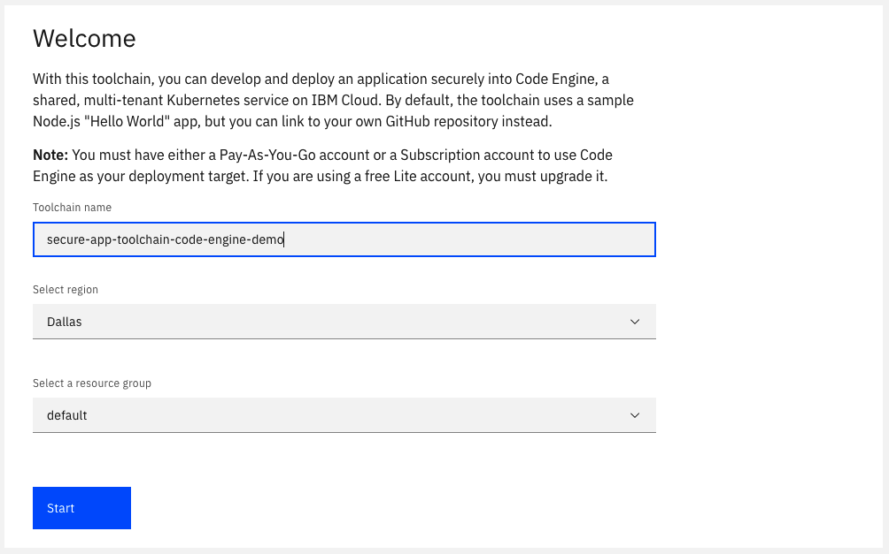
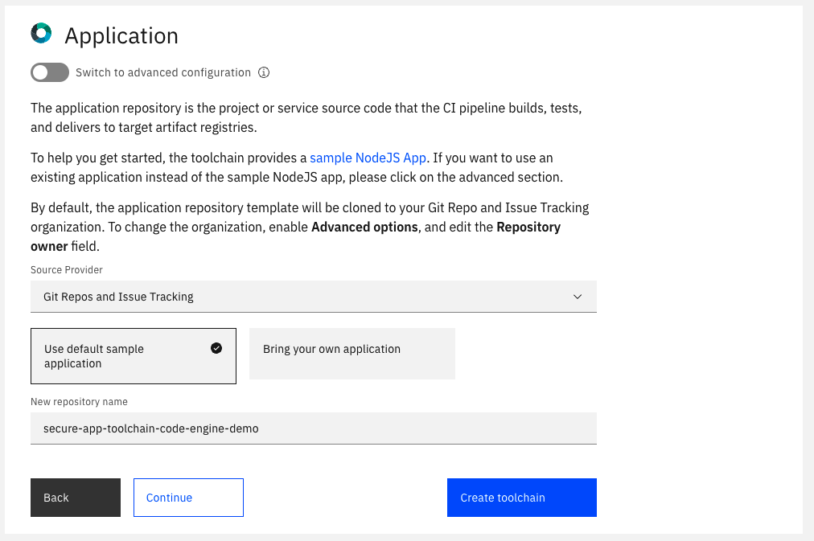
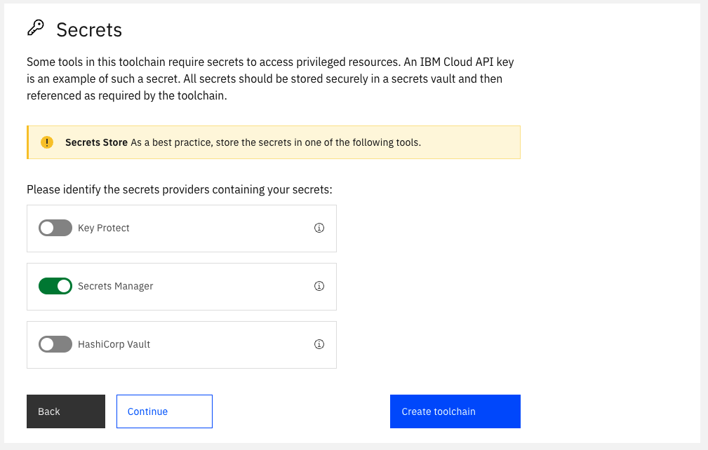
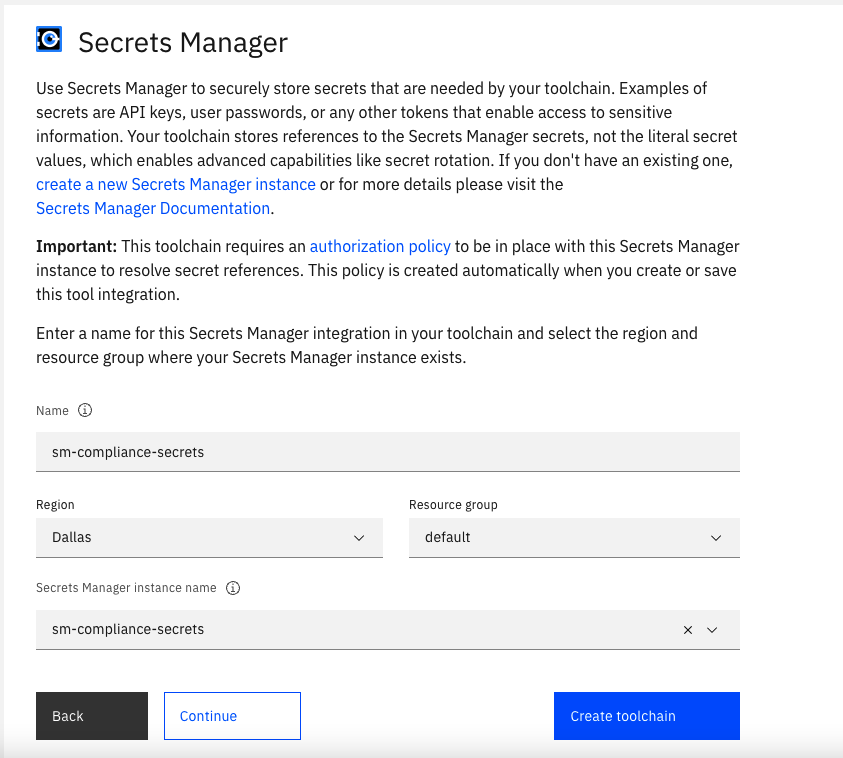
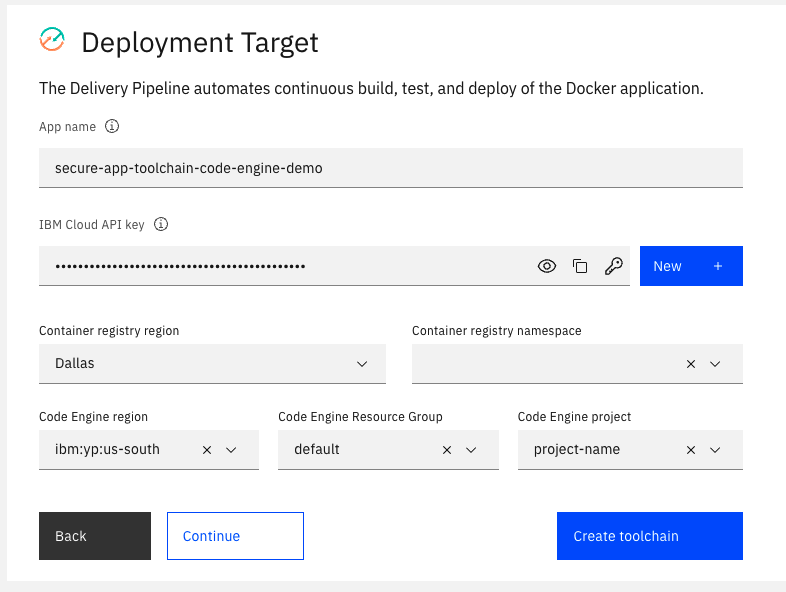
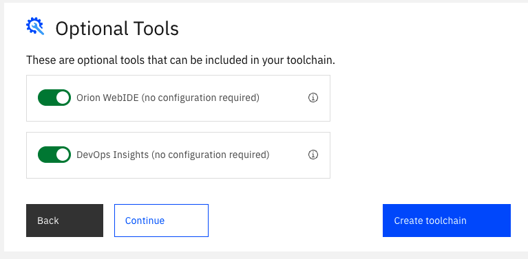
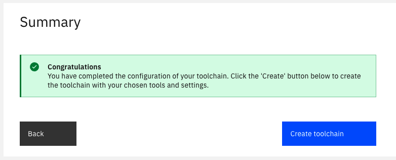
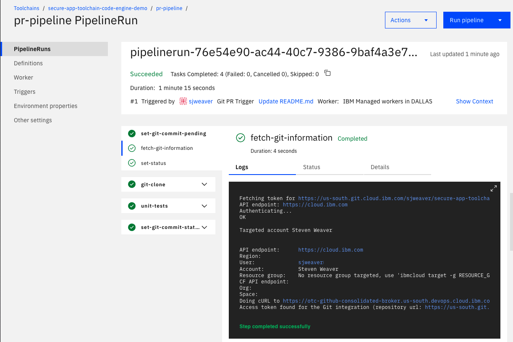
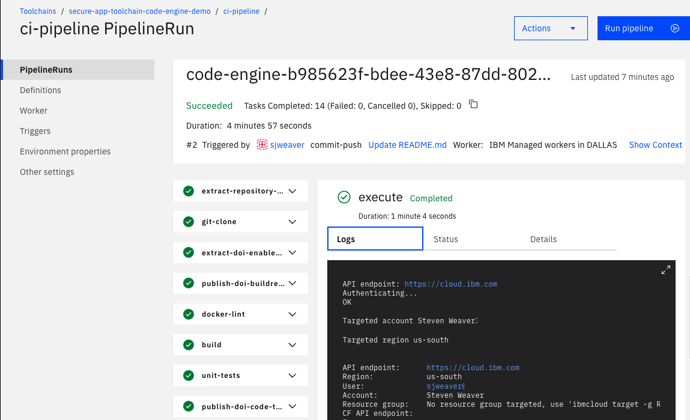

---

copyright:
   years: 2022
lastupdated: "2022-05-06"

keywords: deployment strategies, toolchain, CD, automate, automation, continuous delivery, continuous integration, DevOps, IBM Cloud

subcollection: ContinuousDelivery

content-type: tutorial
services: ContinuousDelivery
account-plan: paid
completion-time: 30m

---

{:step: data-tutorial-type='step'}
{:shortdesc: .shortdesc}
{:table: .aria-labeledby="caption"}
{:screen: .screen}  
{:codeblock: .codeblock}  
{:pre: .pre}
{:tip: .tip}
{:note: .note}
{:important: .important}
{:download: .download}
{:external: target="_blank" .external}


# Develop and deploy an app by using Code Engine
{: #tutorial-cd-code-engine}
{: toc-content-type="tutorial"}
{: toc-services="ContinuousDelivery"}
{: toc-account-plan="paid"}
{: toc-completion-time="30m"}

In this tutorial, you learn how to create an open toolchain by using {{site.data.keyword.contdelivery_full}} and deploy your app on [{{site.data.keyword.codeengineshort}}](/docs/codeengine?topic=codeengine-getting-started). You also learn how toolchains are implemented in the {{site.data.keyword.contdelivery_short}} service and how to develop and deploy a simple web application (app) by using toolchains.
{: shortdesc}

{{site.data.keyword.codeenginefull}} is a fully managed, serverless platform that runs your containerized workloads, including web apps, micro-services, event-driven functions, or batch jobs. {{site.data.keyword.codeengineshort}} even builds container images for you from your source code. Because these workloads are all hosted within the same Kubernetes infrastructure, all of them can seamlessly work together. The {{site.data.keyword.codeengineshort}} experience is designed so that you can focus on writing code and not on the infrastructure that is needed to host it. 

The toolchain that is used in this tutorial implements standard DevOps practices such as code scanning, acceptance tests, Git repos, and continuous integration and continuous delivery capabilities. After you create clusters and associate them with a {{site.data.keyword.contdelivery_short}} cluster group, you create a toolchain to change your app's code and push the change to the {{site.data.keyword.gitrepos}} repo. When you push changes to your repo, the Tekton-based delivery pipeline automatically builds and deploys the code.

[Tekton](https://www.ibm.com/cloud/blog/tekton-a-modern-approach-to-continuous-delivery){: external} is an open source, vendor-neutral, Kubernetes-native framework that you can use to build, test, and deploy apps. Tekton provides a set of shared components for building [continuous integration](https://www.ibm.com/garage/method/practices/code/practice_continuous_integration/){: external} and [continuous delivery](https://www.ibm.com/garage/method/practices/deliver/practice_continuous_delivery/){: external} systems. As an open source project, Tekton is managed by the [Continuous Delivery Foundation](https://cd.foundation/){: external}. The goal is to modernize continuous delivery by providing industry specifications for pipelines, workflows, and other building blocks. With Tekton, you can build, test, and deploy across cloud providers or on-premises systems by abstracting the underlying implementation details. Tekton pipelines are built into [{{site.data.keyword.contdelivery_short}}](https://www.ibm.com/cloud/blog/announcements/build-and-deliver-using-tekton-enabled-pipelines){: external}. For more information about the {{site.data.keyword.containerlong}}, see [{{site.data.keyword.containerlong}}](https://www.ibm.com/garage/method/practices/run/tool_ibm_container){: external}.

## Before you begin
{: #cd-code-engine-tutorial-prereqs}

Before you start this tutorial, make sure that you have the following resources in place:

* An [{{site.data.keyword.cloud_notm}} account](https://{DomainName}/registration){: external}. Depending on your {{site.data.keyword.cloud_notm}} account type, access to certain resources might be limited. Depending on your account plan limits, certain capabilities that are required by some of the deployment strategies might not be available. For more information about {{site.data.keyword.cloud_notm}} accounts, see [Setting up your {{site.data.keyword.cloud_notm}} account](/docs/account?topic=account-account-getting-started) and [Upgrading your account](/docs/account?topic=account-upgrading-account).

* A [Code Engine Project](/docs/codeengine?topic=codeengine-getting-started) and an API Key. You can create these resources by using either the UI or the CLI. For more information about Code Engine Projects, see [Code Engine Projects](/docs/codeengine?topic=codeengine-manage-project#create-a-project).

* An instance of the [{{site.data.keyword.contdelivery_short}}](/docs/ContinuousDelivery?topic=ContinuousDelivery-getting-started) service.

* Optional. Secrets that are stored in a secrets management vault and managed centrally from a single location. For more information about choosing from the various secrets management and data protection offerings, see [Managing {{site.data.keyword.cloud_notm}} secrets](/docs/secrets-manager?topic=secrets-manager-manage-secrets-ibm-cloud). If you don't already have an instance of the secrets management vault provider of your choice, create one.

* Optional. A namespace that is created by using the container registry command line. To create a namespace, type the following command from the command line:

   ```text
   ibmcloud cr namespace-add <my namespace>
   ```
   
   Alternatively, you can create a namespace on the [Container Registry](https://cloud.ibm.com/registry/namespaces) page. For more information about creating a namespace in this location, see [IBM Cloud Container Registry](https://cloud.ibm.com/docs/Registry?topic=Registry-getting-started#getting-started) service.


### Related content
{: #related-content}
{: step}

* [Getting started with {{site.data.keyword.contdelivery_short}}](/docs/ContinuousDelivery?topic=ContinuousDelivery-getting-started)
* [Getting started with toolchains](https://cloud.ibm.com/devops/getting-started){: external}
* [Getting started with {{site.data.keyword.codeenginefull}}](/docs/codeengine?topic=codeengine-getting-started)
* [Tutorials library for {{site.data.keyword.codeenginefull}}](/docs?tab=tutorials&tags=codeengine&page=1&pageSize=20)


## Create the toolchain
{: #cd-codeengine-toolchain-create}
{: step}

In this step, you create a **Develop a Code Engine App** toolchain. The target Code Engine project is configured during the toolchain setup by using your {{site.data.keyword.cloud_notm}} API key and your Code Engine project name. You can change these settings later by updating the {{site.data.keyword.deliverypipeline}} configuration. Any code that is merged into the target Git repo branch is automatically built, validated, and deployed into the Code Engine project.

To create a **Develop a Code Engine App** toolchain, click

[](https://cloud.ibm.com/devops/setup/deploy?repository=https://github.ibm.com/open-toolchain/code-engine-toolchain&env_id=ibm:yp:us-south){: external}

Alternatively, from the {{site.data.keyword.cloud_notm}} console, click the menu icon , and select **DevOps**. On the **Toolchains** page, click **Create a Toolchain**. On the **Create a Toolchain** page, click **Develop a Code Engine App**.
{: tip}


### Configure the toolchain name and region
{: #codeengine-toolchain-name-region}

1. On the Welcome screen, review the default information for the toolchain settings. The toolchain's name identifies it in {{site.data.keyword.cloud_notm}}. Make sure that the toolchain's name is unique within your toolchains for the same region and resource group in {{site.data.keyword.cloud_notm}}.

   The toolchain region can differ from the cluster and registry region.
   {: tip}

   {: caption="Figure 1. Code Engine secure app toolchain name and region" caption-side="bottom"}

1. Click **Start**.

### Configure the application source code repo
{: #codeengine-tool-integration-application}

1. In the Application step, the recommended options for the application source code repo are displayed by default. To view all of the available options for the underlying Git integration, click **Advanced Options**. By default, the toolchain uses the default sample that clones the sample app as an IBM-hosted {{site.data.keyword.gitrepos}} repo.

   {: caption="Figure 2. Code Engine secure app repo" caption-side="bottom"}

   You can change the name of the app repo. The region of the repo remains the same as the region of the toolchain.
   {: tip}

1. Optional. The toolchain template provides a [Sample Hello World Application](https://us-south.git.cloud.ibm.com/open-toolchain/hello-helm) app. If you want to link an existing Application repo for the toolchain, select **Bring your own app** and specify the URL for the repo. The toolchain supports linking only to existing {{site.data.keyword.gitrepos}} repos.

1. Click **Continue**.

By default, the Application repo template is cloned to your {{site.data.keyword.gitrepos}} org. To change the org, enable **Advanced options** and specify the repo owner.
{: tip}

### Securely store secrets
{: #codeengine-tool-integration-secrets}
{: step}

Several tools within this toolchain require secrets, such as an {{site.data.keyword.cloud_notm}} API key. You must securely store all secrets in a secrets vault and reference them as required by the toolchain.

1. Using {{site.data.keyword.cloud_notm}}, you can choose from various secrets management and data protection offerings that help you to protect your sensitive data and centralize your secret. In the Secrets step, you can specify which secret vault integrations to add or remove from your toolchain. For more information about adding and removing vault integrations, including prerequisites and by using hints, see [Managing {{site.data.keyword.cloud_notm}} secrets](/docs/secrets-manager?topic=secrets-manager-manage-secrets-ibm-cloud). 

   By using hints within a template, a toolchain is automatically populated with preconfigured secrets; you don't need to manually select secrets from vault integrations that are attached to the toolchain.
   {: tip}

   This tutorial uses the [IBM Secrets Manager](/docs/secrets-manager?topic=secrets-manager-getting-started) as the secrets vault.

   {: caption="Figure 3. Code Engine secure app secrets options" caption-side="bottom"}

   IBM Secrets Manager securely stores and applies secrets such as API keys, Image Signature, or HashiCorp credentials that are part of your toolchain.

   {: caption="Figure 4. Code Engine Secrets Manager options" caption-side="bottom"}

1. Click **Continue**.

For more information about managing your secrets in IBM Key Protect or HashiCorp, see [IBM Key Protect](/docs/devsecops?topic=devsecops-cd-devsecops-tekton-ci-compliance#cd-devsecops-key-protect-ci) or [HashiCorp](/docs/devsecops?topic=devsecops-cd-devsecops-tekton-ci-compliance#cd-devsecops-vault-ci).

## Configure the deployment target
{: #codeengine-deployment-target}
{: step}

Configure the target Code Engine project to deploy the app to. After the app passes the build, test, and scan phase, the pipeline deploys the built app image to the target Code Engine project. This deployment is now ready for acceptance testing or integration testing.

1. If the API key has the required access, the following fields automatically load by using the API key that is either created, retrieved from a vault, or manually specified. If the API key is valid, values for the Container registry region and namespace Cluster region, name, namespace, and Resource group are automatically populated. You can update any of these fields to match your configuration.

   * **App name:** The name of the app. The default app name is the same as your toolchain name.

   * **IBM Cloud API Key:** The API key that is used to interact with the `ibmcloud` CLI tool in several tasks. Use one of the following methods to specify the API key that you want to use:

     * Click the key icon to import an existing API key from a secrets vault of your choice.
     * Copy and paste an existing API key.
     * Click **New** to create an API key.
     * Generate a new `api-key` if you don’t have an existing API key.

     You can immediately save the generated API key to an existing secrets vault of your choice.
     {: tip}

   * **Container registry region:** The Container Registry region in which your container namespace is located.

   * **Container registry namespace:** Select from the list of container namespaces in the associated Container Registry region.

   * **Code Engine region:** The region in which your Code Engine project is located.

   * **Code Engine Resource Group:** The Resource Group where your Code Engine project was created.

   * **Code Engine project:** The name of the project that was created in {{site.data.keyword.codeengineshort}}. Your app is deployed to this project.

   {: caption="Figure 5. Code Engine secure app rolling deployment target details" caption-side="bottom"}

1. Click **Continue**.

## Add optional tool integrations
{: #codeengine-optional-tools}
{: step}

You can add the Eclipse Orion {{site.data.keyword.webide}} and {{site.data.keyword.DRA_short}} tool integrations to your toolchain without any additional configuration. 

### Eclipse Orion {{site.data.keyword.webide}}
{: #web-ide-optional}

The [Eclipse Orion {{site.data.keyword.webide}}](/docs/ContinuousDelivery?topic=ContinuousDelivery-web_ide) is a browser-based development environment where you can develop for the web in JavaScript, HTML, and CSS with the help of content assist, code completion, and error checking. No additional configuration is required to use this tool.

### {{site.data.keyword.DRA_short}}
{: #devops-insights-optional}

[{{site.data.keyword.DRA_full}}](/docs/ContinuousDelivery?topic=ContinuousDelivery-di_working) is included in the created toolchain. You do not need to provide any configuration steps for {{site.data.keyword.DRA_short}}. The continuous integration pipeline automatically uses the {{site.data.keyword.DRA_short}} instance that is included in the toolchain. {{site.data.keyword.DRA_short}} aggregates code, test, build, and deployment data to provide visibility into the velocity and quality of all of your teams and releases.

{: caption="Figure 6. Code Engine secure app optional tools" caption-side="bottom"}

Click **Continue**.

## Complete the toolchain setup
{: #code-engine-toolchain-summary}
{: step}

On the Summary page, click **Create toolchain**. Several steps run automatically to set up your toolchain.

You can configure the individual toolchain integrations after the pipeline is created.
{: tip}

{: caption="Figure 7. Code Engine secure app toolchain summary" caption-side="bottom"}

## Explore your new toolchain
{: #cd-explore-codeengine-toolchain}
{: step}

After you create your toolchain, it shows each of the tool integrations that are part of the toolchain in a diagram.

### Explore the pipelines
{: #cd-code-engine-pipelines}

You can explore the pipelines to understand the toolchain flow and the different operations that run within each pipeline. The toolchain that you created contains the following pipelines:

* **Pull request pipeline:** Runs when a developer merges changes from their development branch to the master branch, or to any other branch in the repo. The pull request pipeline runs the Unit Test and Static Scans on the Application Source Code.
* **Continuous integration pipeline:** Runs when you merge a change into the master branch of the Application Source Code repo. The continuous integration pipeline runs the Unit Test, Code Coverage, and Static Scans on the Application Source Code, CIS check, and Bill Of Materials (BOM) check. The continuous delivery pipeline also generates the binary build artifacts and uploads them to the {{site.data.keyword.containerlong}}, as configured in the toolchain. And the continuous integration pipeline generates the metadata of the build artifacts and stores it in the Inventory repo. 


### Run the pull request and continuous integration pipelines
{: #cd-pr-ci-pipelinerun}

To start the pull request pipeline, create a merge request in your app repo:

1. On the Toolchain's Overview page, on the **Repositories** card, click the `secure-app-toolchain-code-engine-demo` app repo.
1. From the master repo, create a branch.
1. Update some code in the sample node app or readme file and save these changes.
1. Submit the merge request.
1. On the Toolchain's Overview page, on the **Delivery pipelines** card, click the `pr-pipeline` pipeline to open the pull request pipeline dashboard. The corresponding merge request in your app repo remains in the pending state until all of the stages of the pull request pipeline successfully complete.
1. After the pull request pipeline run succeeds, you can select it to explore the completed steps.

{: caption="Figure 8. Pull request pipeline success" caption-side="bottom"}

To start the continuous integration pipeline, merge the continuous integration merge request in your app repo:

1. Go to the merge request.
1. Merge the request so that your changes are copied to the master branch of your app repo. The continuous integration pipeline is automatically triggered.
1. On the continuous integration Toolchain Overview page, on the **Delivery pipelines** card, click the `ci-pipeline` pipeline to open the continuous integration pipeline dashboard.
1. After the continuous integration pipeline run succeeds, you can click the pipeline run to explore the completed steps.

   {: caption="Figure 9. Continuous integration pipeline success" caption-side="bottom"}

1. Expand the `deploy-application` task and click the `execute` step. Select the `Logs` tab, and scroll to the end of the log. Click the link to your deployed Code Engine app to view the running app.

## Next steps
{: #next-steps}

If you want to remove the sample app that is running on {{site.data.keyword.codeengineshort}}, follow these steps: 

1. Go to the {{site.data.keyword.codeengineshort}} [Projects](https://cloud.ibm.com/codeengine/projects){: external} page.

1. Click the project where your sample app is running.

1. Select **Applications**, and then select the check box for your sample app.

1. Click **Delete**.

## Looking for help?
{: #cd-tutorial-help}

Get help from the {{site.data.keyword.contdelivery_full}} development teams by joining us on [Slack](https://ic-devops-slack-invite.us-south.devops.cloud.ibm.com/){: external}.

For more support options, see [Getting help and support for {{site.data.keyword.contdelivery_short}}](/docs/ContinuousDelivery?topic=ContinuousDelivery-gettinghelp).
