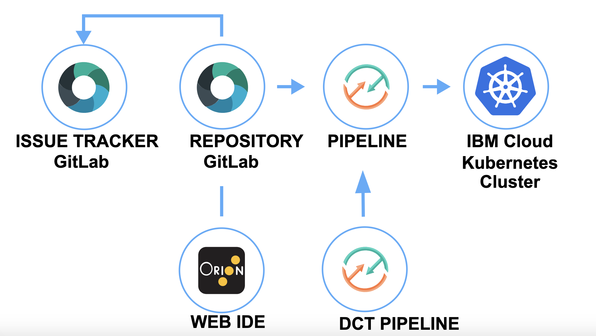

---

copyright:
   years: 2020, 2021
lastupdated: "2021-05-10"

keywords: image signing, secure, Kubernetes, Kube, cluster, Docker image

subcollection: ContinuousDelivery

content-type: tutorial
account-plan: lite
completion-time: 30m

---

{:shortdesc: .shortdesc}
{:screen: .screen}  
{:codeblock: .codeblock}  
{:pre: .pre}
{:tip: .tip}
{:important: .important}
{:external: target="_blank" .external}
{:step: data-tutorial-type='step'}

# Develop a Kubernetes app with secure image signing
{: #tutorial-cd-kube-image-signing}
{: toc-content-type="tutorial"}
{: toc-completion-time="30m"}

In this tutorial, you learn how to use Docker image signing to validate image integrity as part of your {{site.data.keyword.contdelivery_full}} toolchain.
{: shortdesc}

The Develop a Kubernetes app with secure image signing template expands on the [Develop a Kubernetes app with Tekton Pipelines tutorial](https://www.ibm.com/cloud/architecture/tutorials/use-develop-kubernetes-app-toolchain-with-tekton-pipelines){: external} by adding validation controls to the Docker image. Digital signatures are applied to the Docker image at specific validation stages. An image security enforcement policy is applied to the Kubernetes cluster that requires the digital signatures are applied before you can continue the deployment. 

This toolchain requires you to use a [Key Protect](/docs/key-protect) vault instance that is pre-populated with signing keys. 

The Hello World application (app) in this tutorial uses Docker with Node.js. It includes a DevOps toolchain that is preconfigured for continuous delivery with Vulnerability Advisor, Docker image signing checking, source control, issue tracking, and online editing. This app also includes deployment to the [{{site.data.keyword.containerlong}}](/docs/containers).

App code is stored in source control along with its Dockerfile and Kubernetes deployment script. The target cluster is configured during toolchain setup by using an {{site.data.keyword.cloud_notm}} API key and cluster name. You can change these values later by updating the {{site.data.keyword.deliverypipeline}} configuration. Any code changes to the Git repo are automatically built, validated, and deployed into the Kubernetes cluster.

The toolchain that you create in this tutorial includes the following tool integrations:

* {{site.data.keyword.gitrepos}} and a separate Git repo that contains your app source code, along with its Dockerfile and Kubernetes deployment script. And a second Git repo that contains the Razee configuration files.
* A {{site.data.keyword.deliverypipeline}} that is triggered when a change is merged to the master branch of the Application Source Code repo. The pipeline runs the Unit Test, Code Coverage, and Static Scans on the Application Source Code. The CI pipeline also generates the build artifacts and uploads them to the source repo. Finally, the pipeline updates the Razee configuration repo with information about the new build artifacts.
* A {{site.data.keyword.deliverypipeline}} that is used to initialize the Docker Content  Trust (DCT).
* A {{site.data.keyword.deliverypipeline}} that runs when a merge or pull request is created in the Application Source Code repo. Typically, this request is created by the application source code developer to merge changes from their development  branch to another branch, such as the master branch. The pull request pipeline runs the Unit Test and Static Scans on the Application Source Code.

{: figure caption="Figure 1. Secure image signing toolchain diagram"}

## Before you begin
{: #cd-kube-image-signing-prereqs}

* [Install the {{site.data.keyword.cloud_notm}} CLI](/docs/cli?topic=cloud-cli-getting-started).
* [Set up the {{site.data.keyword.cloud_notm}} Container Registry CLI and your registry namespace](/docs/Registry?topic=registry-registry_setup_cli_namespace). 
* [Understand the basics of Kubernetes](https://kubernetes.io/docs/tutorials/kubernetes-basics/){: external}.
* [Create an API Key](/docs/account?topic=account-userapikey#create_user_key).

### Related content
{: #cd-kube-image-signing-related-content}

* [Getting started with toolchains](https://cloud.ibm.com/devops/getting-started){: external}
* [Getting started with {{site.data.keyword.contdelivery_short}}](/docs/ContinuousDelivery?topic=ContinuousDelivery-getting-started)

## Create a development Kubernetes cluster
{: #cd-kube-image-signing-dev-cluster}
{: step}

To complete this tutorial, you need to set up a Kubernetes cluster on the {{site.data.keyword.containershort_notm}}. The {{site.data.keyword.containershort_notm}} delivers powerful tools by combining Docker and Kubernetes technologies, an intuitive user experience, and built-in security and isolation to automate the deployment, operation, scaling, and monitoring of containerized apps in a cluster of compute hosts.

1. In the {{site.data.keyword.cloud}} catalog, go to the [Kubernetes Service](/kubernetes/catalog/cluster/create).
1. Select **Standard** as the cluster type, and select **2 MB / 1 Worker** as the machine type. All other options can be left as default.  
1. Click **Create** to create your cluster. Check the status of your cluster and worker nodes until they're in the Ready state. Your workers must be ready before you can proceed to the next step.

## Create the toolchain
{: #cd-kube-image-signing-create-toolchain}
{: step}

1. To create your Kubernetes app with secure image signing toolchain, click

 {: external}

 Alternatively, from the {{site.data.keyword.cloud_notm}} console, click the menu icon , and select **DevOps**. On the **Toolchains** page, click **Create a Toolchain**. On the **Create a Toolchain** page, click **Develop a Kubernetes app with secure image signing**.

2. On the Develop a Kubernetes app with secure image signing page, in the **About** tab, review the toolchain diagram. The diagram shows each tool integration in its lifecycle phase within the toolchain.

3. In the **Create** tab, review the default information for the toolchain settings, and enter a name for your toolchain. The toolchain's name identifies it in {{site.data.keyword.cloud_notm}}. Because the toolchain's name is used to construct the URL that is used to access your app, it must be unique within {{site.data.keyword.cloud_notm}}.

4. Each toolchain is associated with a specific region and resource group. Select the region and resource group where you want to create the toolchain. You can have up to 200 toolchains per resource group.
   
 If you have more than one account, you can click your account name in the {{site.data.keyword.cloud_notm}} console menu bar to select another account that you can access. 
 {: tip}

5. Review your {{site.data.keyword.gitrepos}} settings and, if required, update them. Although each toolchain contains a sample app, you can choose to use a different repo. By default, an empty configuration repo is created, but you can choose to point to an existing configuration repo that is in the same region. To create your source repo in a different Git repo provider than the default {{site.data.keyword.gitrepos}}, select the Git repo that you want to use. For more information about changing the Git provider for your toolchain, see the [Change Git provider in a toolchain tutorial](/cloud/architecture/tutorials/change-git-provider-in-a-toolchain){: external}.

 Access to {{site.data.keyword.gitrepos}} repos is region-specific. If the template for the toolchain that you're creating keeps the source code for the app in a private repo in one region and you're trying to create a toolchain in another region, the toolchain can't clone the source code into your repo. For more information about how to handle this scenario, see [Why can't I create a toolchain from a template that uses a private repo in a different region?](/docs/ContinuousDelivery?topic=ContinuousDelivery-troubleshoot-git#why-can-t-i-use-the-git-repos-and-issue-tracking-tool-integration-in-my-toolchain-from-one-region-in-a-toolchain-within-a-different-region).
 {: important}
 
 6. Next, create a Key Protect vault instance.

### Create a Key Protect vault instance
{: #cd-kube-image-signing-create-vault}
{: step}

In this step, you create signing key pairs that you can share across your pipelines. By using the toolchain template, you can create a [Key Protect](https://cloud.ibm.com/catalog/services/key-protect#about){: external} instance or use one to store private and public RSA/X.509 key pairs. You can create or delete keys that you can use across your toolchains.

1. Click **Delivery Pipeline**. If required, update the app name and click **New** to create an {{site.data.keyword.cloud_notm}} API key if you don't already have one, and then click **OK**. If the API key is valid, the fields for the container registry region, container registry namespace, cluster region, cluster name, cluster namespace, and resource group are automatically populated. You can update the values for any of these fields to match your configuration.

 The namespace must be 4 - 30 characters in length and can include only lowercase letters, numbers, or underscore characters.
 {: important}

2. Specify a name for the Key Protect vault instance. If you don't already have a vault set up, one is created for you. Save a copy of the Key Project vault instance name for later use. Default key names are also provided. You can change those names, but make sure you remember the names for use later in the tutorial. 
   
3. Click **Create** to set up your toolchain.

4. On the Toolchains page, click the **{{site.data.keyword.deliverypipeline}}** card to open your pipeline. 

5. Click the arrow icon for the **Create Build Signer Key** and the **Create Validation Signer Key** stages to create the image signing keys that are required for the tutorial. To delete your keys after you use them, run the `Delete Build Signer Key` and `Delete Validation Signer Key` stages.

6. To verify that your keys are created correctly, go to the [Resource list](https://cloud.ibm.com/resources){: external} for your {{site.data.keyword.cloud_notm}} account and view your Key Protect vault instance name in the **Services** section. To view details about the created keys, click the instance name.

## Explore the pipelines
{: #cd-kube-image-signing-explore}
{: step}

The toolchain creates three pipelines: ci-pipeline, dct init *namespace*, and pr-pipeline. 

1. Click the **{{site.data.keyword.deliverypipeline}}** card for dct init in your toolchain. With a Tekton-based delivery pipeline, you can automate the continuous building, testing, and deployment of your apps, along with many other processes. You can view the pipeline runs that are running or complete.

 The dct init dashboard displays an empty table until at least one Tekton pipeline runs. After a Tekton pipeline runs, either manually or because of external events, the table lists the run, its status, and the last updated time of the run definition. The following states are reported for pipeline runs:

 * **Pending**: The `PipelineRun` definition is queued and waiting to run.
 
 * **Running**: The `PipelineRun` definition is running in the cluster.

 * **Succeeded**: The `PipelineRun` definition completed in the cluster.

 * **Failed**: The `PipelineRun` definition run failed. Review the log file for the run to determine the cause of failure.

 The pipeline definition is stored in the `pipeline.yaml` file within the `.pipeline` folder of the image-signed-kube-toolchain Git repo that was added to your toolchain. This repo contains the template files. Each task is stored within a separate section of this file. 
      
2. Click **Run Pipeline**. Review the run parameters and click **Run**. The dct init pipeline starts the Docker Content Trust (DCT). For more information about the dct init run that you started, click the link in the **Name** column. You can view the task definition and the steps in each `PipelineRun` definition. You can also view the status, logs, and details of each task definition and step, and the overall status of the `PipelineRun` definition.

 * The **init-docker-content-trust** task starts DCT by using the information that you provided when you set up the Key Protect vault instance name and key names. The stage also allocates the keys and provisions them to be the delegation keys that are used to sign the Docker images. [Docker Content Trust](https://success.docker.com/article/introduction-to-docker-content-trust){: external} provides strong cryptographic guarantees over what code and what versions of software are run in your infrastructure. It integrates [The Update Framework (TUP)](https://theupdateframework.com/){: external} into Docker by using [Notary](https://youtu.be/at72dhg-SZY?t=4873){: external}, an open source tool that provides trust over any content.
      
 * When a publisher who is using Docker Content Trust pushes an image to a remote registry, Docker Engine locally signs the image with the publisher’s private key. When a user pulls this image, Docker Engine uses the publisher’s public key to verify that the image is exactly what the publisher created. It also ensures that the image wasn't tampered with and that it is up to date.
      
 Typically, this stage is run only once, but it can be run several times if the keys in the Key Protect vault change. For example, you might need to run the stage more than once as part of a key rotation policy that is required for compliance.
 {: tip}
 
 * The **apply-image-enforcement** task creates the image enforcement policy that is applied to your Kubernetes cluster. The stage also specifies that an image can't be deployed until the signatures are found and validated.

3. Return to the Toolchains page and click the **{{site.data.keyword.deliverypipeline}}** ci-pipeline card.

4. Click **Run Pipeline**. Review the run parameters and click **Run**. The ci-pipeline automates the continuous building, testing, and deployment of your app. For more information about the ci-pipeline run that you started, click the link in the **Name** column. You can view the task definition and the steps in each `PipelineRun` definition. You can also view the status, logs, and details of each task definition and step, and the overall status of the `PipelineRun` definition.

5. Review the following tasks:

 * **extract-repository-url**: This task includes the **extract-value-jq** step that extracts values from the wanted configmap with a `jq` expression (`jq` is a command line tool for parsing JSON). The URL of your Git repo is extracted.
 
 * **git-clone**: This task includes the **fetch-git-token** step that fetches the Git personal access token that is required to access your Git repo from the command line. This task also includes the **clone-repo** step that fetches the credentials that are required to perform Git operations on a repo that is integrated in a {{site.data.keyword.contdelivery_short}} toolchain. It uses these credentials to clone (or perform the appropriate check out if pull request parameters are given) the repo.
 
 * **extract-doi-enablement** and **publish-doi-buildrecord**: These tasks include the **extract-value-jq** and **publish-doi-buildrecord** steps. The **extract-value-jq** step extracts values from the wanted configmap with a `jq` expression (`jq` is a command line tool for parsing JSON). These values are used to set up [{{site.data.keyword.DRA_short}}](/docs/ContinuousDelivery?topic=ContinuousDelivery-publishing-test-data) for this pipeline. The **publish-build-record** step publishes build records to [{{site.data.keyword.DRA_short}}].
 
 * **cra-discovery-scan**, **code-vulnerability-scan**, **cra-cis-check**, and **cra-bom**: These tasks are included in the [Code Risk Analyzer](https://www.ibm.com/cloud/blog/announcements/find-source-code-vulnerabilities-with-code-risk-analyzer){: external} capability within {{site.data.keyword.contdelivery_short}}. Use Code Risk Analyzer to discover vulnerabilities in your Python, Node.js, and Java&reg; applications, and in your operating system stacks (base image). Code Risk Analyzer uses rich threat intelligence from [Snyk](https://snyk.io){: external} and [Clair](https://github.com/quay/clair){: external} and then provides fix recommendations. Code Risk Analyzer also integrates the comprehensive security coverage in Snyk to help you to automatically find, prioritize, and fix vulnerabilities in open source dependencies and containers early in your workflow. Complete the [Code Analyzer tutorial](https://www.ibm.com/cloud/architecture/tutorials/develop-kubernetes-app-with-code-risk-analyzer){: external} to try using the Code Risk Analyzer.
 
 * **docker-lint**: This task performs the **check-dockerfile** step that uses [Hadolint](https://hub.docker.com/r/hadolint/hadolint){: external} to lint the specified Dockerfile.
 
 * **unit-tests** and **publish-doi-code-tests**: These tasks run the **run-tests** and **publish-testrecord** steps. The **run-tests** step allows the pipeline to start a script that runs unit tests. No tests are run for this template. The **publish-testrecord** step publishes test records from Vulnerability Advisor to [{{site.data.keyword.DRA_short}}](/docs/ContinuousDelivery?topic=ContinuousDelivery-publishing-test-data).
 
 * **containerize**: This task runs the **check-registry**, **build-image**, and **process-build-log** steps. The **check-registry** step logs in to the container registry and ensures that the specified namespace is available. This step also exports the expected environment variables and creates a dry-run Kubernetes `docker-registry` secret to get the content of a Docker `config.json` file and access the target {{site.data.keyword.registrylong_notm}}. The **build-image** step builds and pushes an image to the [{{site.data.keyword.registrylong_notm}}](/docs/Registry?topic=registry-getting-started). The **process-build-log** step creates a build output properties file from the build image step for use in the pipeline and adds registry and image information.
      
 * **build-sign**: This task runs the **set-sign-context** and **sign-image** steps to access the specified Key Protect Vault Instance, retrieve the signing keys, and then sign the build with the build signer key.

 * **vulnerability-advisor** and **publish-doi-va-scan-record**: These tasks run the **run-vulnerability-advisor-scan** and **publish-testrecord** steps. The **run-vulnerability-advisor-scan** step runs [Vulnerability Advisor](/docs/Registry?topic=va-va_index) on the image to check for known vulnerabilities. If it finds a vulnerability, the job fails and prevents the image from being deployed. This safety feature prevents apps with security holes from being deployed. The image included in this tutorial no vulnerabilities, so it passes. In this tutorial template, the default configuration of the job is to not block on failure. The **publish-testrecord** step publishes test records from Vulnerability Advisor to [{{site.data.keyword.DRA_short}}](/docs/ContinuousDelivery?topic=ContinuousDelivery-publishing-test-data).

 * **validation-sign**: This task runs the **set-sign-context** and **sign-image** steps to access the specified Key Protect Vault instance, retrieve the signing keys, and signs the build with the validation signer key.

 * **deploy-to-kubernetes**: This task checks for cluster readiness and namespace existence, configures the cluster namespace, updates the `deployment.yml` manifest file, and grants access to the private image registry. The task also checks for two signatures before the deployment can continue. A signature check is also performed at the cluster level by using the image-enforcement policy that was set in the DCT initialization pipeline. This task also sets environment variables and uses the deployment manifest file to deploy the app into the Kubernetes cluster.

 * **publish-deployable-task**: This task creates or updates a toolchain deployable mapping for a {{site.data.keyword.contdelivery_short}} toolchain. This task relies on toolchain endpoints that are described in the [IBM Toolchain API](https://otc-swagger.us-south.devops.dev.cloud.ibm.com/swagger-ui?url=https://otc-api.us-south.devops.dev.cloud.ibm.com/spec/swagger.json#/toolchain_deployable_mappings){: external}.

 * **check-health**: This task makes sure that the app runs successfully.

6. In the **deploy-to-kubernetes** task, click the **execute** step and in the log file, locate the `DEPLOYMENT SUCCEEDED` message. Click the link to view the running application.

## Clean up
{: #cd-kube-image-signing-cleanup}
{: step}

Want to start fresh? Remove the following resources that you created as a part of this tutorial:

* Delete the Git repo.
* Delete the toolchain.
* Delete the cluster.
* Delete the Key Protect Vault Instance

## Next steps
{: #cd-kube-image-signing-step-next}

In this tutorial, you used Docker image signing to validate image integrity as part of your {{site.data.keyword.contdelivery_short}} toolchain.

Next, continue to explore toolchains and DevOps practices:

* Explore the [DevOps reference architecture](https://www.ibm.com/cloud/architecture/architectures/devOpsArchitecture){: external}.

* Learn more about what you can do with toolchains:

   * [Develop a Kubernetes App with Helm](https://www.ibm.com/cloud/architecture/tutorials/use-develop-kubernetes-app-helm-toolchain-with-tekton-pipelines){: external}.

   * [Work with Code Risk Analyzer](https://www.ibm.com/cloud/architecture/tutorials/develop-kubernetes-app-with-code-risk-analyzer){: external}.
