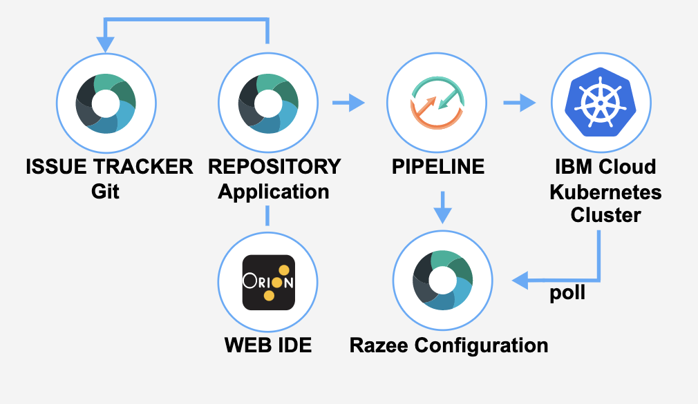

---

copyright:
   years: 2020, 2021
lastupdated: "2021-04-09"

keywords: Razee, Kubernetes, Kube, cluster

subcollection: ContinuousDelivery

content-type: tutorial
account-plan: lite
completion-time: 10m

---

{:shortdesc: .shortdesc}
{:screen: .screen}  
{:codeblock: .codeblock}  
{:pre: .pre}
{:tip: .tip}
{:important: .important}
{:external: target="_blank" .external}
{:step: data-tutorial-type='step'}

# Develop a Kubernetes app with Razee
{: #tutorial-cd-kube-razee}
{: toc-content-type="tutorial"}
{: toc-completion-time="10m"}

In this tutorial, you learn how to develop a simple Hello World web application (app) that you deploy to a Kubernetes cluster on {{site.data.keyword.cloud_notm}} by using Razee.
{: shortdesc}

You create an open toolchain and use that toolchain along with DevOps best practices to develop a simple Hello World web app. By using Razee, you can deploy the app to the [{{site.data.keyword.containerlong}}](/docs/containers) with a Kubernetes cluster.

[Razee](https://razee.io/){:external} is an open source project that automates and manages the deployment of Kubernetes resources across clusters, environments, and cloud providers. Razee also helps you to visualize deployment information for your resources so that you can monitor the roll-out process and find deployment issues more quickly. For more information about how to set up Razee in your cluster to automate your deployment process, see the [Razee documentation](https://github.com/razee-io/Razee){: external}.

The toolchain that you create in this tutorial includes the following tool integrations:

* [Vulnerability Advisor](/docs/va?topic=va-va_index#about) to provide a secure container. You can use the toolchain to scan for security issues and follow other DevOps practices, such as using a Git repository (repo) and a continuous build.
* {{site.data.keyword.gitrepos}} and two separate Git repos. One repo that contains your app source code, along with its Dockerfile and Kubernetes deployment script. And a second Git repo that contains the Razee configuration files.
* A {{site.data.keyword.deliverypipeline}} that runs when a change is merged to the master branch of the Application Source Code repo. This pipeline runs the Unit Test, Code Coverage, and Static Scans on  the Application Source Code. The continuous integration pipeline also generates the build artifacts and uploads them to the source repo. Finally, the pipeline updates the Razee configuration repo with information about the new build artifacts.
* A {{site.data.keyword.deliverypipeline}} that runs when a merge or pull request is created in the Application Source Code repo. Typically, this request is created by the application source code developer to merge changes from their development  branch to another branch, such as the master branch. The pull request pipeline runs the Unit Test and Static Scans on the Application Source Code.

{: figure caption="Figure 1. Razee toolchain diagram"}

After you create the cluster and the toolchain, you change your app's code and push the change to the {{site.data.keyword.gitrepos}} repo. When you push changes to your repo, the delivery pipeline automatically builds and deploys the code.

## Before you begin
{: #cd-kube-razee-prereqs}

* [Install the {{site.data.keyword.cloud_notm}} CLI](/docs/cli?topic=cloud-cli-getting-started).
* [Set up the {{site.data.keyword.cloud_notm}} Container Registry CLI and your registry namespace](/docs/services/Registry?topic=registry-registry_setup_cli_namespace). 
* [Understand the basics of Kubernetes](https://kubernetes.io/docs/tutorials/kubernetes-basics/).
* [Create an API Key](https://cloud.ibm.com/docs/account?topic=account-userapikey#create_user_key).

### Related content
{: #cd-kube-razee-related-content}

* [Getting started with toolchains](https://cloud.ibm.com/devops/getting-started){: external}
* [Getting started with {{site.data.keyword.contdelivery_short}}](/docs/ContinuousDelivery?topic=ContinuousDelivery-getting-started)

## Create a development Kubernetes cluster
{: #cd-kube-razee-dev-cluster}
{: step}

To complete this tutorial, you need to set up a Kubernetes cluster on the {{site.data.keyword.containershort_notm}} service. The {{site.data.keyword.containershort_notm}} delivers powerful tools by combining Docker and Kubernetes technologies, an intuitive user experience, and built-in security and isolation to automate the deployment, operation, scaling, and monitoring of containerized apps in a cluster of compute hosts.

1. In the {{site.data.keyword.cloud}} catalog, go to the [Kubernetes Service](/kubernetes/catalog/cluster/create).
1. Select **Standard** as the cluster type, and select **2 MB / 1 Worker** as the machine type. All other options can be left as default.  
1. Click **Create** to create your cluster. Check the status of your cluster and worker nodes until they're in the Ready state. Your workers must be ready before you can proceed to the next step.

## Create the toolchain
{: #cd-kube-razee-create}
{: step}

In this step, you create a Develop a Kubernetes app with Razee toolchain. Before you begin, make sure that you know the name of your Kubernetes cluster.

1. To create your Develop a Kubernetes app with Razee toolchain, click

 {: external}

 Alternatively, from the {{site.data.keyword.cloud_notm}} console, click the menu icon , and select **DevOps**. On the **Toolchains** page, click **Create a Toolchain**. On the **Create a Toolchain** page, click **Develop a Kubernetes app with Razee**. 

2. On the Develop a Kubernetes app with Razee page, in the **About** tab, review the toolchain diagram. The diagram shows each tool integration in its lifecycle phase within the toolchain.

3. In the **Create** tab, review the default information for the toolchain settings, and enter a name for your toolchain. Because the toolchain's name is used to construct the URL that is used to access your app, it must be unique within {{site.data.keyword.cloud_notm}}.

4. Review your {{site.data.keyword.gitrepos}} settings and, if required, update them. Although each toolchain contains a sample app, you can choose to use a different repo. By default, an empty configuration repo is created, but you can choose to point to an existing configuration repo that is in the same region. To create your source repo in a different Git repo provider than the default {{site.data.keyword.gitrepos}}, select the Git repo that you want to use.

 Access to {{site.data.keyword.gitrepos}} repos is region-specific. If the template for the toolchain that you're creating keeps the source code for the app in a private repo in one region and you're trying to create a toolchain in another region, the toolchain can't clone the source code into your repo. For more information about how to handle this scenario, see [Why can't I create a toolchain from a template that uses a private repo in a different region?](/docs/ContinuousDelivery?topic=ContinuousDelivery-troubleshoot-git#why-can-t-i-use-the-git-repos-and-issue-tracking-tool-integration-in-my-toolchain-from-one-region-in-a-toolchain-within-a-different-region).
 {: important}

5. Each toolchain is associated with a specific region and resource group. You can have up to 200 toolchains per resource group. For this tutorial, select **Dallas** to create the toolchain in that region. 

6. Click **Delivery Pipeline**. If required, update the app name and click **New** to create an {{site.data.keyword.cloud_notm}} API key if you don't already have one, and then click **OK**. If the API key is valid, the fields for the container registry region, container registry namespace, cluster region, cluster name, cluster namespace, and resource group are automatically populated. You can update the values for any of these fields to match your configuration.

 The namespace must be 4 - 30 characters in length and can include only lowercase letters, numbers, or underscore characters. If this is the first time that you're using Razee to deploy an app into your cluster, select the default Razee deployment option to install the Razee agent and register your app with the cluster.
 {: important}

8. Click **Create** to create the toolchain and open its Overview page.

## Explore the pipeline
{: #cd-kube-razee-explore}
{: step}

1. Click the **Delivery Pipeline** (ci-pipeline) card to view the running pipeline. With a Tekton-based delivery pipeline, you can automate the continuous building, testing, and deployment of your apps. When a toolchain is created from this template, the sample app in your Git repo is automatically built and deployed.

2. The ci-pipeline dashboard displays an empty table until at least one Tekton pipeline runs. After a Tekton pipeline runs, either manually or because of external Git events, the table lists the run, its status, and the last updated time of the run definition. The following states are reported for pipeline runs:

 * **Pending**: The PipelineRun definition is queued and waiting to run.
 
 * **Running**: The PipelineRun definition is running in the cluster.

 * **Succeeded**: The PipelineRun definition was completed in the cluster.

 * **Failed**: The PipelineRun definition run failed. Review the log file for the run to determine the cause of failure.

 For more information about the ci-pipeline run that you triggered, click the link in the **Name** column of the table. You can view the task definition and the steps in each `PipelineRun` definition. You can also view the status, logs, and details of each task definition and step, and the overall status of the `PipelineRun` definition. 
   
 The pipeline definition is stored in the `pipeline.yaml` file within the `.pipeline` folder of the kube-razee-toolchain Git repo that was added to your toolchain. This repo contains the template files. Each task is stored within a separate section of this file. 

3. Review the `extract-repository-url` task. This task includes the `extract-value-jq` step that extracts values from the selected config map with a specific `jq` expression. `jq` is a command-line tool that parses JSON. In this case, the URL of your Git repo is extracted.
   
4. Review the `git-clone` task. This task includes the `fetch-git-token` step that gets the Git personal access token that is required to access your Git repo from the command line. The task also includes the `clone-repo` step that fetches the credentials that are required to perform Git operations on a repo that is integrated in a {{site.data.keyword.contdelivery_short}} toolchain. These credentials are used to either clone the repo or check out the repo when pull request parameters are provided.

5. Review the `extract-doi-enablement` and `publish-doi-buildrecord` tasks.

   * The `extract-value-jq` step extracts values from the selected config map with a specific `jq` expression. `jq` is a command-line tool for parsing JSON. These values are used to set up {{site.data.keyword.DRA_short}} for this pipeline. [{{site.data.keyword.DRA_short}}](/docs//ContinuousDelivery?topic=ContinuousDelivery-publishing-test-data) allows developers to gain a holistic understanding of your app in a single dashboard, and view trend information about builds, deployments, and test results. {{site.data.keyword.DRA_short}} helps to ensure quality through automated enforcement of policies and gates based on quality metrics. 
  
   * The `publish-build-record` step publishes build records to [{{site.data.keyword.DRA_short}}](/docs//ContinuousDelivery?topic=ContinuousDelivery-publishing-test-data).

6. Review the `cra-discovery-scan`, `code-vulnerability-scan`, `cra-cis-check`, and `cra-bom` tasks. These tasks are all part of the [Code Risk Analyzer](https://www.ibm.com/cloud/blog/announcements/find-source-code-vulnerabilities-with-code-risk-analyzer){: external} capability in {{site.data.keyword.contdelivery_short}}. Developers use Code Risk Analyzer to discover vulnerabilities in their Python, Node.js, and Java&reg; applications, and in their operating system stacks (base image). It uses rich threat intelligence from [Snyk](https://snyk.io){: external} and [Clair](https://github.com/quay/clair){: external} and provides fix recommendations. Code Risk Analyzer integrates the comprehensive security coverage in Snyk to help developers automatically find, prioritize, and fix vulnerabilities in open source dependencies and containers early in their workflow. For more information about Code Risk analyzer, you can try the [Code Risk Analyzer tutorial](https://www.ibm.com/cloud/architecture/tutorials/develop-kubernetes-app-with-code-risk-analyzer){: external}.

7. Review the `docker-lint` task. This task runs the `check-dockerfile` step, which performs a lint on the specified Dockerfile by using [Hadolint](https://hub.docker.com/r/hadolint/hadolint){: external}.

8. Review the `unit-tests` and `publish-doi-code-tests` tasks. These tasks run the following steps:

   * `run-tests`:  Allows the pipeline to launch a script to run unit tests. No tests are run for this  template.

   * `publish-testrecord`: Publishes test records from Vulnerability Advisor to [{{site.data.keyword.DRA_short}}](/docs/ContinuousDelivery?topic=ContinuousDelivery-publishing-test-data).

9. Review the `containerize` task. This task runs the following steps:

   * `check-registry`: Logs in to the container registry  and makes sure that the specified namespace is available.  It also exports the expected environment variables and creates a dry-run Kubernetes `docker-registry` type secret to obtain the content of a docker `config.json` file to access the target {{site.data.keyword.cloud_notm}} Container Registry.

   * `build-image`: Builds and deploys an image to the [{{site.data.keyword.cloud_notm}} Container Registry](/docs/services/Registry?topic=registry-getting-started.)
   
   * `process-build-log`: Creates a build output properties file from the build image step to use in the pipeline, and adds registry and image information.

10. Review the `vulnerability-advisor` and `publish-doi-va-scan-record` tasks. These tasks run the following steps:

   * `run-vulnerability-advisor-scan`: Runs [Vulnerability Advisor](/docs/services/Registry?topic=va-va_index) on the image to check for known vulnerabilities. If it finds a vulnerability, the job fails and prevents the image from being deployed. This safety feature prevents apps with security holes from being deployed. The image in this tutorial doesn't contain vulnerabilities, so it passes. In this tutorial template, the default configuration of the job is to not block on failure.

   * `publish-testrecord`: Publishes test records from Vulnerability Advisor to [{{site.data.keyword.DRA_short}}](/docs/ContinuousDelivery?topic=ContinuousDelivery-publishing-test-data).

11. Review the `prepare-razee-deploy` task. This task updates the `deployment.yml` manifest file with details from the build artifacts and places those build artifacts and the `deployment.yml` file into the Razee configuration Git repo.

12. Review the `trigger-razee-deploy` task. This task creates or updates the `config.yml` file that Razee uses to deploy the app  into your Kubernetes container. If the pipeline is running for the first time without running the Setup Razee stage, the pipeline stops without deploying the app to Kubernetes. 

## Set up Razee
{: #cd-kube-razee-setup}
{: step}

1. Click **Run Pipeline**. 

2. Select the **Manual Install Razee** trigger and click **Run** to trigger a new `PipelineRun`. 

2. Click the link to view the `PipelineRun`.

3. Follow the tasks in the pipeline as they run. The following new tasks run in this pipeline:

   * `install-razee-agent`: Checks whether the Razee deployment agent is installed in the cluster that you previously specified in the setup, and if the Razee agent is registered. If the agent isn't installed, this task installs it into your cluster.
   
   * `register-app-with-razee`: Registers your app with the Razee agent in the cluster so that the agent checks for changes to the configuration repo and updates the app, if found. The agent looks for the `config.yml` file that the previous `PipelineRun` created with the app information. 
   
4. The pipeline checks for the `config.yml` file and deploys the app into the Kubernetes cluster. Click the **register-app-with-razee** task and then click the **execute** step.

5. In the **Logs** tab, locate the `DEPLOYMENT SUCCEEDED` message. 

6. Click the provided URL to view the running app.

## Modify the app code
{: #cd-kube-razee-modify}
{: step}

Modify the app and redeploy it to view how Razee picks up the changes in the `config.yml` file automatically, and then redeploys the app. 

1. On the toolchain's Overview page, click the **Git** card for your app.

 You can also use the built-in Eclipse Orion {{site.data.keyword.webide}}, a local IDE, or your favorite editor to change the files that are in your repo.
 {: tip}

2. In the Git repo, click the `utils.js` file.

3. Click **Edit** and update the code on line 4 to change the welcome message. 

4. Type a commit message and click **Commit changes** to push the change to the project's remote repo. 

5. On the toolchain's Overview page, click the **Delivery Pipeline** (ci-pipeline) card. Because your commit automatically started a build, the pipeline is running. Over the next few minutes, watch your change as it is built, tested, and deployed. 

 You don't need to run the Manual Install Razee pipeline again. The Razee agent that is running on your Kubernetes cluster automatically picks up the change to the `config.yml` file that was generated during the **trigger-razee-deploy** stage. After the **trigger-razee-deploy** stage is completed, wait a few minutes for the agent to pick up the change and then refresh your app URL to view the updated message.
 {: tip}

## Clean up your resources
{: #cd-kube-razee-clean}
{: step}

Want to start fresh? Remove the following resources that you created as a part of this tutorial:

* Delete the Git repo.
* Delete the toolchain.
* Delete the cluster.

## Next steps
{: #cd-kube-razee-step-next}

You created a toolchain that deploys a Hello World app to a secure container in a Kubernetes cluster by using Razee. You changed a message in the app and tested your change. When you pushed the change to the repo, the delivery pipeline automatically redeployed the app.

Next, you can continue to explore toolchains and DevOps practices:

* Explore the [DevOps reference architecture](https://www.ibm.com/cloud/architecture/architectures/devOpsArchitecture){: external}.

* Learn more about what you can do with toolchains:

   * [Develop a Kubernetes App with Helm](https://www.ibm.com/cloud/architecture/tutorials/use-develop-kubernetes-app-helm-toolchain-with-tekton-pipelines){: external}.

   * [Work with Code Risk Analyzer](https://www.ibm.com/cloud/architecture/tutorials/develop-kubernetes-app-with-code-risk-analyzer){: external}.
