---

copyright:
   years: 2022, 2024
lastupdated: "2024-04-16"

keywords: Satellite, satellite, tekton, pipeline, toolchain, CD, automate, automation, continuous delivery, DevOps, shift-left, shift left, secure DevOps, IBM Cloud

subcollection: ContinuousDelivery

content-type: tutorial
services: satellite, apps, openshift, containers, ContinuousDelivery
account-plan: paid
completion-time: 30m

---

{{site.data.keyword.attribute-definition-list}}


# Deploy Kubernetes resources to multiple clusters by using {{site.data.keyword.satellitelong_notm}} Config
{: #tutorial-cd-only-satellite}
{: toc-content-type="tutorial"}
{: toc-services="satellite, apps, openshift, containers, ContinuousDelivery"}
{: toc-account-plan="paid"}
{: toc-completion-time="30m"}

In this tutorial, you learn how to create an open toolchain by using {{site.data.keyword.contdelivery_full}} and deploy your application (app) by using [{{site.data.keyword.cloud_notm}} {{site.data.keyword.satelliteshort}}](/docs/satellite?topic=satellite-getting-started). You also learn how toolchains are implemented in the {{site.data.keyword.contdelivery_short}} service and how to deploy a simple web app by using a {{site.data.keyword.contdelivery_short}}-only toolchain template.
{: shortdesc}

{{site.data.keyword.satellitelong_notm}} brings public cloud services to any environment, allowing customers with stringent regulatory requirements to use the flexibility and agility of these services for their secure on-premises data center. {{site.data.keyword.contdelivery_short}} uses [{{site.data.keyword.satelliteshort}} Config](/docs/satellite?topic=satellite-cluster-config) to deploy an app across a group of clusters in {{site.data.keyword.satellitelong_notm}}. With {{site.data.keyword.satelliteshort}} Config, you create a configuration to specify which Kubernetes resources you want to deploy to a cluster group of Kubernetes or {{site.data.keyword.redhat_openshift_full}} clusters that are running in your {{site.data.keyword.satelliteshort}} location or in {{site.data.keyword.cloud_notm}}.

The toolchain that is used in this tutorial implements standard DevOps practices around continuous delivery capabilities. After you make sure that you meet all of the continuous integration requirements, this toolchain helps you to manage your deployments in {{site.data.keyword.cloud_notm}} {{site.data.keyword.satelliteshort}} locations. After you create clusters and associate them with a {{site.data.keyword.satelliteshort}} cluster group, you can create a toolchain to change your deployment source code and push the change to the GitHub repo. When you push changes to your repo, the Tekton-based delivery pipeline automatically deploys the code.

[Tekton](https://www.ibm.com/blog/tekton-a-modern-approach-to-continuous-delivery/){: external} is an open source, vendor-neutral, Kubernetes-native framework that you can use to build, test, and deploy apps. Tekton provides a set of shared components for implementing continuous delivery systems. As an open source project, Tekton is managed by the [Continuous Delivery Foundation](https://cd.foundation/){: external}. The goal is to modernize continuous delivery by providing industry specifications for pipelines, workflows, and other building blocks. With Tekton, you can build, test, and deploy across cloud providers or on-premises systems by abstracting the underlying implementation details. Tekton pipelines are built into [{{site.data.keyword.contdelivery_short}}](https://www.ibm.com/blog/announcement/build-and-deliver-using-tekton-enabled-pipelines/){: external}.

The template that is used in this tutorial works with the Standard plan for {{site.data.keyword.redhat_openshift_notm}}.
{: tip}

## Before you begin
{: #cd-only-satellite-tutorial-prereqs}

Before you start this tutorial, make sure that you have the following resources in place:

* An [{{site.data.keyword.cloud_notm}} account](https://{DomainName}/registration){: external}. Depending on your {{site.data.keyword.cloud_notm}} account type, access to certain resources might be limited. Depending on your account plan limits, certain capabilities that are required by some of the deployment strategies might not be available. For more information about {{site.data.keyword.cloud_notm}} accounts, see [Setting up your {{site.data.keyword.cloud_notm}} account](/docs/account?topic=account-account-getting-started) and [Upgrading your account](/docs/account?topic=account-upgrading-account).

* A [{{site.data.keyword.satelliteshort}} cluster group](/docs/satellite?topic=satellite-setup-clusters-satconfig) that contains the cluster that is required by the toolchain. The toolchain in this tutorial supports a {{site.data.keyword.satelliteshort}} cluster group that contains only {{site.data.keyword.redhat_openshift_notm}} clusters.

* Image Pull Secrets. Make sure that you configure the [image pull secrets](https://docs.openshift.com/container-platform/4.6/openshift_images/managing_images/using-image-pull-secrets.html){: external} that are required to deploy application images in your cluster namespace.

* An instance of the [{{site.data.keyword.contdelivery_short}}](/docs/ContinuousDelivery?topic=ContinuousDelivery-getting-started) service.

* **Optional**. Secrets that are stored in a secrets management vault and managed centrally from a single location. For more information about choosing from the various secrets management and data protection offerings, see [Managing {{site.data.keyword.cloud_notm}} secrets](/docs/secrets-manager?topic=secrets-manager-manage-secrets-ibm-cloud). If you don't already have an instance of the secrets management vault provider of your choice, create one.

* **Optional**. A namespace that is created by using the container registry command line. To create a namespace, type the following command from the command line:

   ```text
   ibmcloud cr namespace-add <my namespace>
   ```
   
   Alternatively, you can create a namespace on the [Container Registry](https://cloud.ibm.com/registry/namespaces) page. For more information about creating a namespace in this location, see [IBM Cloud Container Registry](https://cloud.ibm.com/docs/Registry?topic=Registry-getting-started#getting-started) service.
   
### Related content
{: #satellite-only-related-content}
{: step}

* [Getting started with {{site.data.keyword.contdelivery_short}}](/docs/ContinuousDelivery?topic=ContinuousDelivery-getting-started)
* [Getting started with clusters](/docs/containers?topic=containers-getting-started)
* [Getting started with toolchains](https://cloud.ibm.com/devops/getting-started){: external}
* [DevSecOps with {{site.data.keyword.contdelivery_short}}](/docs/devsecops?topic=devsecops-devsecops_intro)

## Create the toolchain
{: #cd-only-satellite-toolchain-create}
{: step}

In this step, you create a **Deploy your application to multiple clusters** toolchain. The target Kubernetes cluster is configured during the toolchain setup by using your {{site.data.keyword.cloud_notm}} API key and your Kubernetes cluster name. You can change these settings later by updating the {{site.data.keyword.deliverypipeline}} configuration. Any code that is merged into the target Git repo branch is automatically built, validated, and deployed into the Kubernetes cluster.

To create a **Deploy your application to multiple clusters** toolchain, click

[](https://cloud.ibm.com/devops/setup/deploy?repository=https%3A%2F%2Fus-south.git.cloud.ibm.com%2Fopen-toolchain%2Fsatellite-cd-toolchain&env_id=ibm:yp:us-south){: external} 


Alternatively, from the {{site.data.keyword.cloud_notm}} console, click the menu icon , and select **DevOps**. On the **Toolchains** page, click **Create a Toolchain**. On the **Create a Toolchain** page, click **Deploy your application to multiple clusters**.
{: tip}

### Review the Welcome page
{: #satellite-cd-only-welcome}

Before you start to set up your toolchain, review the prerequisites to discover what items you must first provision and configure. In the Description section, you can access an overview of the toolchain.

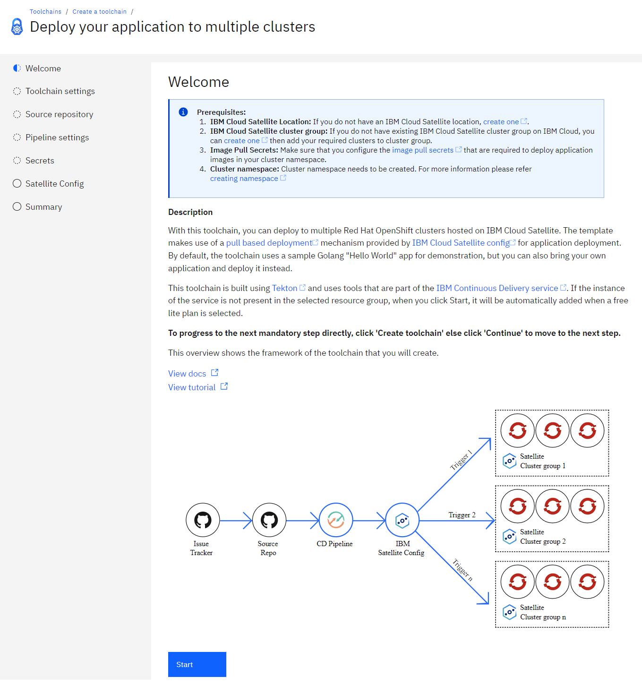{: caption="Figure 1. Welcome page" caption-side="bottom"}

After you review all of this information, click **Start**.

### Configure the toolchain name and region
{: #satellite-cd-only-toolchain-settings}

1. Review the default information for the toolchain settings. The toolchain's name identifies it in {{site.data.keyword.cloud_notm}}. Make sure that the toolchain's name is unique within your toolchains for the same region and resource group in {{site.data.keyword.cloud_notm}}.

   The toolchain region can differ from the cluster and registry region.
   {: tip}

   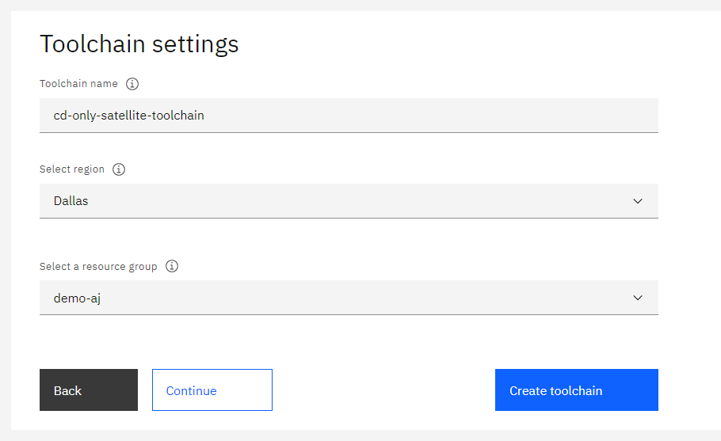{: caption="Figure 2. Toolchain name and region" caption-side="bottom"}

2. To proceed to the next step to configure your toolchain, click **Continue**. To create the toolchain by using the current settings, click **Create toolchain**.

### Configure the deployment source repo
{: #satellite-tool-integration-source-repo}

The deployment source repo contains all of the deployment source code that is required to deploy the app.

1. In the Source repository step, the default options for the deployment source repo are displayed. To view all of the available options for the underlying Source Provider, click **Switch to advanced configuration**. By default, the toolchain uses the sample that clones the sample deployment as an IBM-hosted {{site.data.keyword.gitrepos}} repo.

   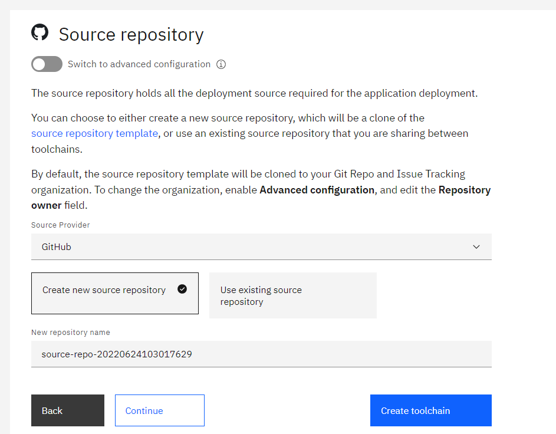{: caption="Figure 3. Deployment source repo" caption-side="bottom"}

2. Specify the name of the deployment source repo that you want to use. The region of the repo remains the same as the region of the toolchain.

   The toolchain template provides an [{{site.data.keyword.cloud_notm}} {{site.data.keyword.satelliteshort}} Config Sample application](https://github.com/IBM/satellite-config-example){: external}. To link an existing deployment source repo for the toolchain, click **Switch to advanced configuration** and specify the URL for the repo. The toolchain supports linking only to existing {{site.data.keyword.gitrepos}} repos.

By default, the deployment source repo template is cloned to your {{site.data.keyword.gitrepos}} org. To change the org, click **Switch to advanced configuration** and specify the repo owner.
{: tip}

## Configure the {{site.data.keyword.deliverypipeline}} name
{: #satellite-pipeline-settings}
{: step}

The {{site.data.keyword.contdelivery_short}} service uses Tekton-enabled [delivery pipelines](/docs/ContinuousDelivery?topic=ContinuousDelivery-tekton-pipelines).

A {{site.data.keyword.deliverypipeline}} automates the continuous deployment of a project. In a project's pipeline, sequences of stages retrieve input and run jobs, such as builds, tests, and deployments. Tekton resources are defined in YAML files that are managed within a code repo.

The toolchain creates a {{site.data.keyword.deliverypipeline}} to continuously deploy your app to multiple clusters within an {{site.data.keyword.cloud_notm}} {{site.data.keyword.satelliteshort}} cluster group. You must specify a name for the {{site.data.keyword.deliverypipeline}} that will be displayed in your toolchain after it is created.

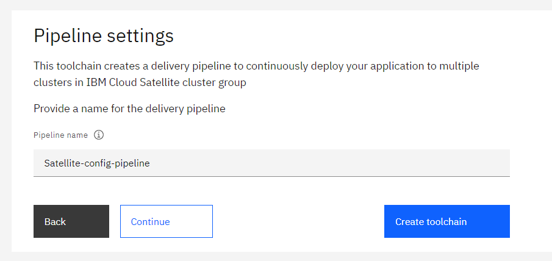{: caption="Figure 4. Delivery Pipeline name" caption-side="bottom"}

## Securely store secrets
{: #satellite-tool-integration-secrets}
{: step}

Several tools within this toolchain require secrets, such as an {{site.data.keyword.cloud_notm}} API key. You must securely store all secrets in a secrets vault and reference them as required by the toolchain.

Using {{site.data.keyword.cloud_notm}}, you can choose from various secrets management and data protection offerings that help you to protect your sensitive data and centralize your secret. In the Secrets step, you can specify which secret vault integrations to add or remove from your toolchain. For more information about adding and removing vault integrations, including prerequisites and by using hints, see [Managing {{site.data.keyword.cloud_notm}} secrets](/docs/secrets-manager?topic=secrets-manager-manage-secrets-ibm-cloud). 

By using hints within a template, a toolchain is automatically populated with preconfigured secrets; you don't need to manually select secrets from vault integrations that are attached to the toolchain.
{: tip}

This tutorial uses the [IBM Secrets Manager](/docs/secrets-manager?topic=secrets-manager-getting-started) as the secrets vault.

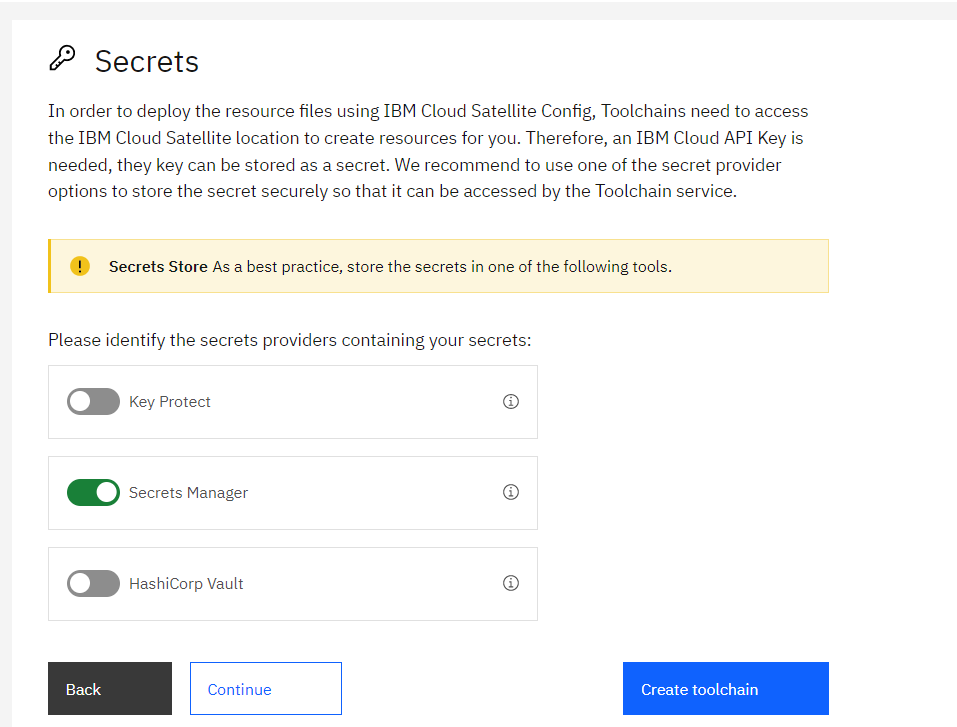{: caption="Figure 5. Secrets options" caption-side="bottom"}

IBM Secrets Manager securely stores and applies secrets such as API keys, Image Signature, or HashiCorp credentials that are part of your toolchain.

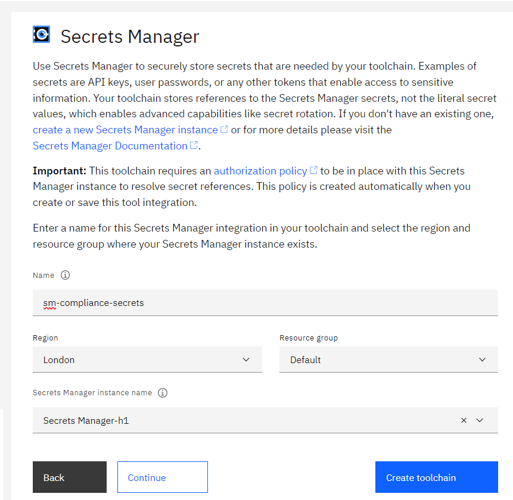{: caption="Figure 6. Secrets Manager details" caption-side="bottom"}

For more information about managing your secrets in IBM Key Protect or HashiCorp, see [IBM Key Protect](/docs/devsecops?topic=devsecops-cd-devsecops-tekton-ci-compliance#cd-devsecops-key-protect-ci) or [HashiCorp](/docs/devsecops?topic=devsecops-cd-devsecops-tekton-ci-compliance#cd-devsecops-vault-ci).

## Update the Satellite Config settings
{: #satellite-config}
{: step}

The {{site.data.keyword.cloud_notm}} {{site.data.keyword.satelliteshort}} Config tool delivers deployment configurations to specified cluster groups. The directory path of the source repo identifies which files to deploy to the provided cluster group.

### Configure the target {{site.data.keyword.redhat_openshift_notm}} cluster to deploy the app to
{: #satellite-config-cluster}

If the API key has the required access, the following fields automatically load by using the API key that is either created, retrieved from a vault, or manually specified. If the API key is valid, values for the Branch name and Cluster group are automatically populated. You can update any of these fields to match your configuration.

* **IBM Cloud API Key:** The API key that is used to interact with the `ibmcloud` CLI tool in several tasks. Use one of the following methods to specify the API key that you want to use:

   * Click the key icon to import an existing API key from a secret vault of your choice.
   * Copy and paste an existing API key.
   * Click **New** to create an API key.
   * Generate a new `api-key` if you don’t have an existing API key.

   You can immediately save the generated API key to an existing secrets vault of your choice.
   {: tip}

* **Cluster namespace:** Specify a name for the [cluster namespace](https://access.redhat.com/support/policy/updates/openshift/online#dev-guide-projects){: external} that you want to deploy the app to.

* **Branch:** Specify the Git branch of your source repo.

* **Path:** Specify the directory path of your source repo.

* **Cluster group:** Select the {{site.data.keyword.cloud_notm}} {{site.data.keyword.satelliteshort}} cluster group where you want to deploy your app.

* **Configuration name:** Specify the name for the {{site.data.keyword.satelliteshort}} config. This name is used to create {{site.data.keyword.satelliteshort}} config versions that are used to create {{site.data.keyword.satelliteshort}} subscriptions.

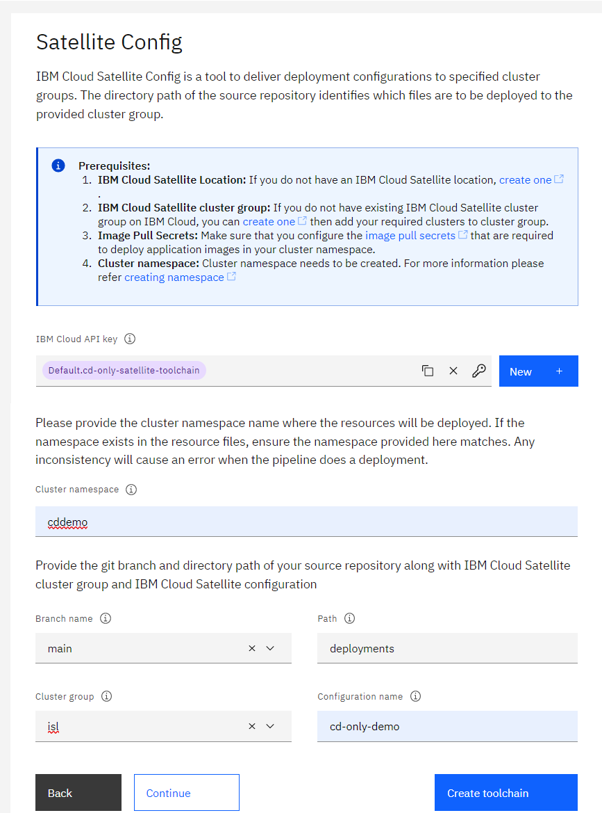{: caption="Figure 7. {{site.data.keyword.cloud_notm}} {{site.data.keyword.satelliteshort}} Config details" caption-side="bottom"}

Click **Continue**.

## Complete the toolchain setup
{: #cd-only-satellite-toolchain-summary}
{: step}

On the Summary page, click **Create toolchain**. Several steps run automatically to set up your toolchain.

You can configure more toolchain integrations after the pipeline is created.
{: tip}

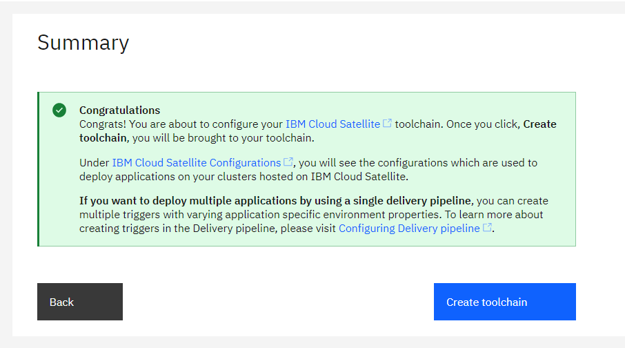{: caption="Figure 8. Toolchain summary" caption-side="bottom"}


## Explore your new toolchain
{: #cd-only-explore-satellite-toolchain}
{: step}

After you create your toolchain, each of the tool integrations that you specified during the setup are displayed.

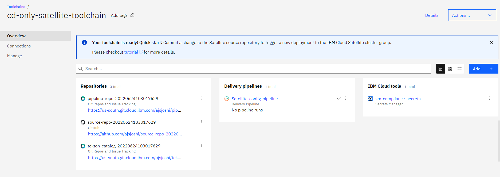{: caption="Figure 9. Example toolchain" caption-side="bottom"}

### Explore the {{site.data.keyword.deliverypipeline}}
{: #cd-only-satellite-delivery-pipeline}

You can explore the {{site.data.keyword.deliverypipeline}} to understand the toolchain flow and the different operations that run within the pipeline. The pipeline deploys build artifacts to the deployment environment. The pipeline also verifies the successful deployment of the app by running the health check.

You can start the delivery pipeline in either of the following ways:

* Trigger the delivery pipeline manually.
* Push a commit to the deployment source repo.

#### Run the pipeline by using a manual trigger
{: #cd-only-satellite-run-pipeline}

1. On the Toolchain's Overview page, click the {{site.data.keyword.deliverypipeline}} that you want to run.
2. Click the **Run pipeline** icon and then select the `manual-run` trigger.

   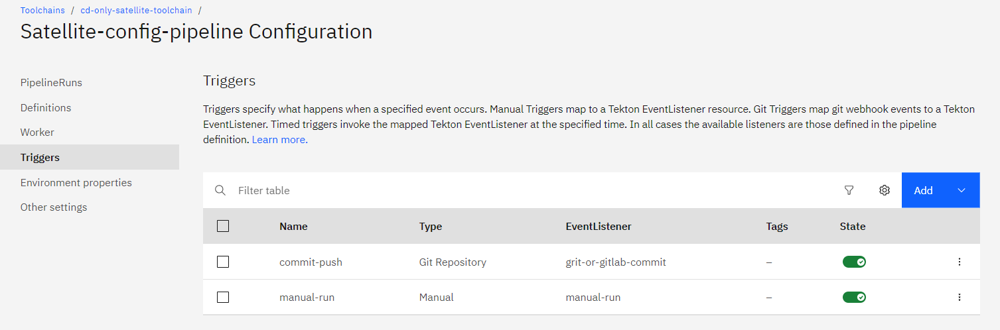{: caption="Figure 10. Delivery pipeline triggers" caption-side="bottom"}

3. Review the trigger properties to make sure that they match your configuration.
4. Click **Run**.
  
   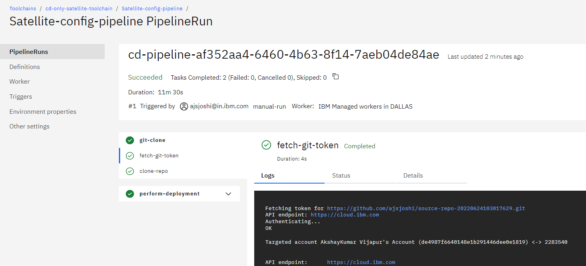{: caption="Figure 11. Successful pipeline run" caption-side="bottom"}

### Verify that the sample app is running
{: #cd-only-satellite-check-pipeline}

After your toolchain is set up and the {{site.data.keyword.deliverypipeline}} successfully completes, run the following steps to check your app:

* From the [Clusters](https://cloud.ibm.com/kubernetes/clusters){: external} home page, click the {{site.data.keyword.redhat_openshift_notm}} cluster that you used to deploy your app.
* Click **OpenShift web console**.
* In the **Workloads** > **Pod** section, filter by the project or the cluster namespace, and verify that the pods are running.
* In the **Networking** > **Routes** section, filter by the project or the cluster namespace, and locate the app URL.
* Verify that the app is running.

## Looking for help?
{: #cd-satelliteonly-tutorial-help}

Get help from the {{site.data.keyword.contdelivery_full}} development teams by joining us on [Slack](https://ic-devops-slack-invite.us-south.devops.cloud.ibm.com/){: external}.

For more support options, see [Getting help and support for {{site.data.keyword.contdelivery_short}}](/docs/ContinuousDelivery?topic=ContinuousDelivery-help-and-support).
