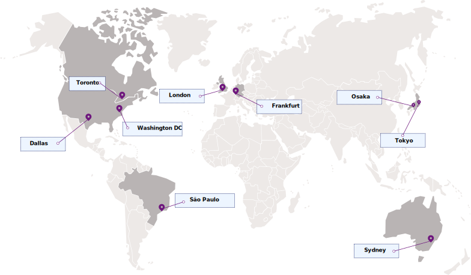

---

copyright:
  years: 2023
lastupdated: "2023-03-02"

keywords: Continuous Delivery endpoints, available regions, locations

subcollection: ContinuousDelivery

---

{{site.data.keyword.attribute-definition-list}}

# Regions and endpoints
{: #regions}

Review region and connectivity options for interacting with {{site.data.keyword.contdelivery_full}}.
{: shortdesc}

## Available regions
{: #available-regions}

{{site.data.keyword.contdelivery_short}} is available in the following regions (borders and geographic features in the illustration are artistic representations):

{: caption="Figure 1. Displays the regions where you can create and manage {{site.data.keyword.contdelivery_short}} resources." caption-side="bottom"}
 
You can create {{site.data.keyword.contdelivery_short}} resources, including toolchains, in one of the supported {{site.data.keyword.cloud_notm}} regions, which represent the
geographic area where your {{site.data.keyword.contdelivery_short}} requests are handled and processed. To learn more, see [{{site.data.keyword.contdelivery_short}} high availability and disaster recovery](/docs/ContinuousDelivery?topic=ContinuousDelivery-ha-dr).

## Service endpoints
{: #service-endpoints}

{{site.data.keyword.contdelivery_short}} offers two connectivity options for interacting with its service APIs: public endpoints (available in all regions) and private endpoints (available in selected regions).

### Public endpoints
{: #public-endpoints}

By default, you can connect to resources in your account over the {{site.data.keyword.cloud_notm}} public network. Your data is encrypted in transit by using supported ciphers of the Transport Security Layer (TLS) 1.2 and 1.3 protocol. For more information about TLS and these ciphers, see [Securing your data in {{site.data.keyword.contdelivery_short}}](/docs/ContinuousDelivery?topic=ContinuousDelivery-cd_data_security).

Review the following table to determine the public API endpoints to use when you connect to the [{{site.data.keyword.contdelivery_short}} API](https://cloud.ibm.com/docs?tab=api-docs&category=devops&subCategory=ContinuousDelivery){: external}.

| Region           | Public endpoints                |
| ---------------- | ------------------------------- |
| Dallas           | `us-south.devops.cloud.ibm.com` |
| Washington DC    | `us-east.devops.cloud.ibm.com`  |
| London           | `eu-gb.devops.cloud.ibm.com`    |
| Frankfurt        | `eu-de.devops.cloud.ibm.com`    |
| Sydney           | `au-syd.devops.cloud.ibm.com`   |
| Tokyo            | `jp-tok.devops.cloud.ibm.com`   |
| Osaka            | `jp-osa.devops.cloud.ibm.com`   |
| Toronto          | `ca-tor.devops.cloud.ibm.com`   |
| S&atilde;o-Paulo | `br-sao.devops.cloud.ibm.com`   |
{: caption="Table 1. Public endpoints for interacting with {{site.data.keyword.contdelivery_short}} APIs over IBM Cloud's public network" caption-side="top"}

### Private endpoints
{: #private-endpoints}

You can also enable [virtual routing and forwarding (VRF) and service endpoints](/docs/account?topic=account-vrf-service-endpoint) for your infrastructure account. When you enable VRF for your account, you can connect to {{site.data.keyword.contdelivery_short}} in selected regions by using a private IP address that is accessible only by using the {{site.data.keyword.cloud_notm}} private network.

To learn more about VRF, see
[Virtual routing and forwarding on {{site.data.keyword.cloud_notm}}](/docs/dl?topic=dl-overview-of-virtual-routing-and-forwarding-vrf-on-ibm-cloud).

To learn how to configure Delivery Pipeline Private Workers to connect to {{site.data.keyword.contdelivery_short}} by using private endpoints, see [Configuring the Delivery Pipeline Private Worker to use private endpoints](/docs/ContinuousDelivery?topic=ContinuousDelivery-install-private-workers#install_pw_agent_pse).

Review the following table to determine the private API endpoints to use when you connect to the [{{site.data.keyword.contdelivery_short}} API](https://cloud.ibm.com/docs?tab=api-docs&category=devops&subCategory=ContinuousDelivery){: external}.

| Region           | Private endpoints                       |
| ---------------- | --------------------------------------- |
| Dallas           | `private.us-south.devops.cloud.ibm.com` |
| Washington DC    | `private.us-east.devops.cloud.ibm.com`  |
| London           | `private.eu-gb.devops.cloud.ibm.com`    |
| Frankfurt        | `private.eu-de.devops.cloud.ibm.com`    |
{: caption="Table 2. Private endpoints for interacting with {{site.data.keyword.contdelivery_short}} APIs over IBM Cloud's private network" caption-side="top"}
