---

copyright:
   years: 2021
lastupdated: "2021-12-07"

keywords: deployment strategies, tekton, pipeline, toolchain, CD, CI, automate, automation, continuous delivery, continuous integration, DevOps, shift-left, shift left, secure DevOps, IBM Cloud

subcollection: ContinuousDelivery

content-type: tutorial
services: apps, openshift, containers, ContinuousDelivery
account-plan: paid
completion-time: 30m

---

{:shortdesc: .shortdesc}
{:table: .aria-labeledby="caption"}
{:screen: .screen}  
{:codeblock: .codeblock}  
{:pre: .pre}
{:tip: .tip}
{:important: .important}
{:download: .download}
{:external: target="_blank" .external}
{:step: data-tutorial-type='step'}

# Develop and deploy an app on Virtual Private Cloud by using deployment strategies
{: #tutorial-cd-vpc}
{: toc-content-type="tutorial"}
{: toc-services="apps, openshift, containers, ContinuousDelivery"}
{: toc-account-plan="paid"}
{: toc-completion-time="30m"}

In this tutorial, you learn how to create an open toolchain by using different deployment strategies. You also learn how toolchains are implemented in the {{site.data.keyword.contdelivery_full}} service and how to develop and deploy a simple web application (app) by using toolchains.
{: shortdesc}

This tutorial uses deployment strategies that use {{site.data.keyword.vpc_full}} (VPC) as the deployment target. The toolchain that is used in this tutorial implements standard DevOps practices such as code scanning, acceptance tests, Git repos, and continuous integration and continuous delivery capabilities. After you create a virtual machine and a toolchain, you change your app's code and push the change to the {{site.data.keyword.gitrepos}} repo. When you push changes to your repo, the Tekton-based delivery pipeline automatically builds and deploys the code.

[Tekton](https://www.ibm.com/cloud/blog/tekton-a-modern-approach-to-continuous-delivery){: external} is an open source, vendor-neutral, Kubernetes-native framework that you can use to build, test, and deploy apps. Tekton provides a set of shared components for building [continuous integration](https://www.ibm.com/garage/method/practices/code/practice_continuous_integration/){: external} and [continuous delivery](https://www.ibm.com/garage/method/practices/deliver/practice_continuous_delivery/){: external} systems. As an open source project, Tekton is managed by the [Continuous Delivery Foundation](https://cd.foundation/){: external}. The goal is to modernize continuous delivery by providing industry specifications for pipelines, workflows, and other building blocks. With Tekton, you can build, test, and deploy across cloud providers or on-premises systems by abstracting the underlying implementation details. Tekton pipelines are built into [{{site.data.keyword.contdelivery_short}}](https://www.ibm.com/cloud/blog/announcements/build-and-deliver-using-tekton-enabled-pipelines){: external}. For more information about the {{site.data.keyword.containerlong}}, see [{{site.data.keyword.containerlong}}](https://www.ibm.com/garage/method/practices/run/tool_ibm_container){: external}.

The template that is used in this tutorial works with the Standard plan for a set of virtual machines.
{: tip}

You can use a deployment strategy to update an application in a production environment, in a controlled manner. Using a deployment strategy can provide the following benefits:

* Avoid application downtime.
* Enable production testing of new functions without impacting customers.
* Limit the impact of production issues to a subset of users.
* Enable rapid rollback to the previous version if issues are found.

Many possible deployment strategies are available. In general, they depend on running multiple instances of the application and managing how the various instances are updated. You can pre-configure the following common deployment strategies in {{site.data.keyword.contdelivery_short}}:

Basic
:   Deploys the new release by stopping and updating all of the running instances simultaneously, causing downtime. For rollback, you must deploy the previous version again, which causes extra downtime. Although this strategy is simple, fast, and has low runtime resource requirements, it is the riskiest and causes downtime. The Basic deployment strategy is not recommended for critical apps that must be highly available.

Rolling update
:   Similar to the Basic strategy, this deployment strategy is simple, fast, and has low runtime resource requirements. However, because each running instance is taken down and updated individually, avoiding downtime, rollback requires you to deploy the previous release again. This time consuming approach might cause issues if the current version of the app in production is broken.

Blue-Green deployment
:   Creates two separate, permanent production environments (blue and green), and only one of those environments receives traffic at a time. The current release is always deployed to the idle environment and traffic is switched to it after deployment completes, with no downtime. Because you need to switch only the traffic to the unchanged environment, rollback does not cause downtime. Because this strategy requires two full production environments, the resource requirements are higher. However, this strategy enables powerful Developer flows, such as the ability to test new app versions in the production environment before it allows customer traffic. Blue-Green deployment also supports fast rollback.

Canary release
:   Deploys a new release in parallel with the original production environment (similar to Blue-Green), with no downtime. The amount of traffic that is sent to both the updated and original instances is managed so that the new version is available to a controlled subset of users while the deployment proceeds. Over time, the traffic that is sent to the new version is increased until all of the traffic is sent there, at which point you can stop the old production environment. For rapid rollback while deployment is in progress, you can route all of the traffic to the original production environment. Since this strategy requires two full production environments only during deployment, the overall resource usage is lower than for the Blue-Green deployment. The Canary release deployment strategy is the slowest to move from a previous release to a current release of the software that is being deployed. Canary deployments allow organizations to test two different software versions side by side in production.

## Before you begin
{: #cd-tutorial-prereqs}

Before you start this tutorial, make sure that you have the following resources in place:

* An [{{site.data.keyword.cloud_notm}} account](https://{DomainName}/registration){: external}, with a Standard plan. For more information about working with your {{site.data.keyword.cloud_notm}} account, see [Setting up your {{site.data.keyword.cloud_notm}} account](/docs/account?topic=account-account-getting-started) and [Upgrading your account](/docs/account?topic=account-upgrading-account).

* A provisioned VPC infrastructure. Based on the type of deployment strategy that you want to use, click one of the following links to create an {{site.data.keyword.bplong}} workspace. This workspace generates and applies the Terraform plan to create the VPC, the virtual server instances, and the Load Balancer that are required to run and access the app.

   {: external}
   {: external}
   {: external}

* An instance of the [{{site.data.keyword.contdelivery_short}}](/docs/ContinuousDelivery?topic=ContinuousDelivery-getting-started) service.

* Optional. A set of secrets that are stored in a secrets management vault and managed centrally from a single location. For more information about selecting a secrets management and data protection offering, see [Managing {{site.data.keyword.cloud_notm}} secrets](/docs/secrets-manager?topic=secrets-manager-manage-secrets-ibm-cloud). If you don't already have an instance of the secrets management vault provider of your choice, create one.

### Related content
{: #related-content}
{: step}

* [Getting started with {{site.data.keyword.contdelivery_short}}](/docs/ContinuousDelivery?topic=ContinuousDelivery-getting-started)
* [Getting started with clusters](/docs/containers?topic=containers-getting-started)
* [Getting started with toolchains](https://cloud.ibm.com/devops/getting-started){: external}

## Create the toolchain
{: #cd-vm-toolchain-create}
{: step}

In this step, you create a **Develop and Deploy application to VPC using deployment strategies** toolchain. The target virtual machines are configured during the toolchain setup by using your SSH keys. You can change these settings later by updating the {{site.data.keyword.deliverypipeline}} configuration. Any code that is merged into the target Git repo branch is automatically built, validated, and deployed into the virtual machines.

To create a **Develop and Deploy application to VPC using deployment strategies** toolchain, click

{: external}

Alternatively, from the {{site.data.keyword.cloud_notm}} console, click the menu icon , and select **DevOps**. On the **Toolchains** page, click **Create a Toolchain**. On the **Create a Toolchain** page, click **Develop and Deploy application to VPC with multiple deployment strategies**.
{: tip}

### Configure the toolchain name and region
{: #kubernetes-toolchain-name-region}

Review the default information for the toolchain settings. The toolchain's name identifies it in {{site.data.keyword.cloud_notm}}. Make sure that the toolchain's name is unique within your toolchains for the same region and resource group in {{site.data.keyword.cloud_notm}}.

The toolchain region can differ from the cluster and registry region.
{: tip}

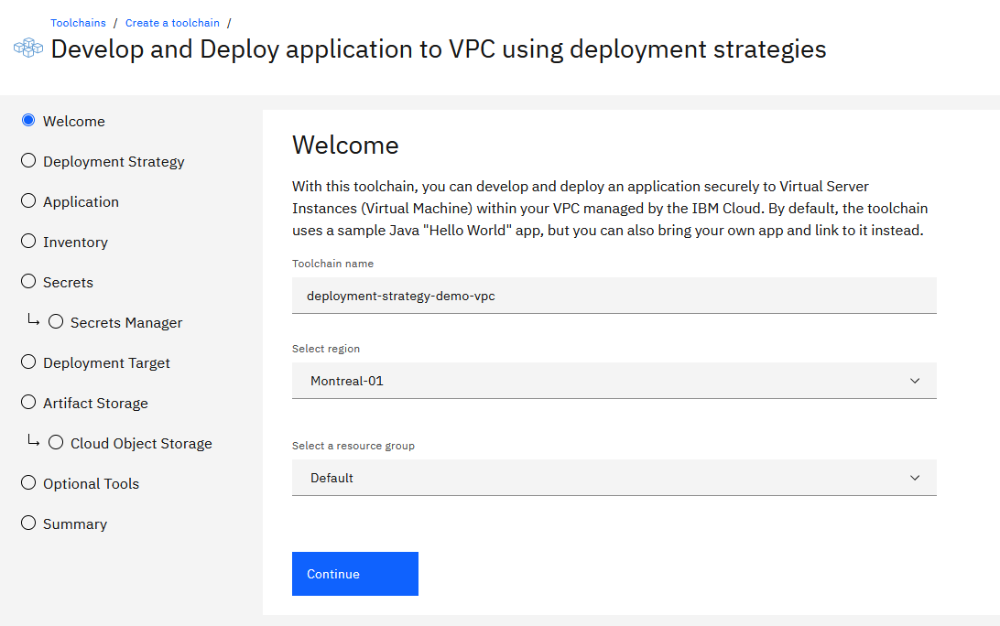{: caption="Figure 1. VM secure app toolchain name and region" caption-side="bottom"}

### Select the deployment strategy
{: #vm-toolchain-select-strategy}

The toolchain creates a Continuous Deployment Pipeline to deploy the application Docker image on the {{site.data.keyword.containerlong}}. Select the deployment strategy that you want to use. Based on which deployment strategy you choose (Rolling, Blue-Green, or Canary), you must provide more details.

1. Click the deployment strategy that you want to use for your toolchain.

   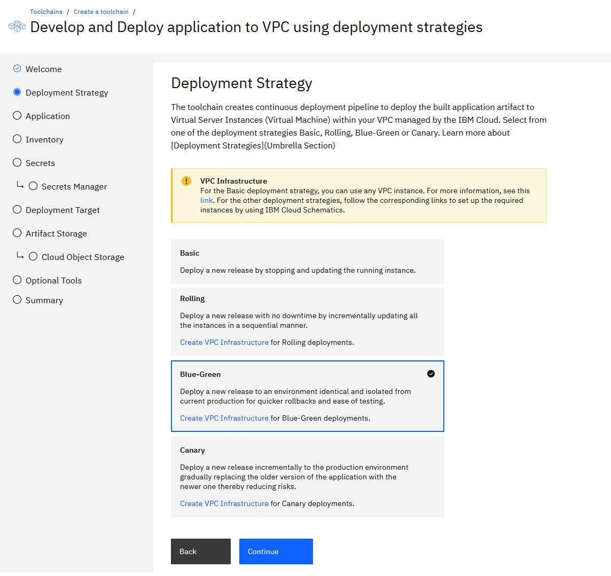{: caption="Figure 2. Deployment strategies" caption-side="bottom"}
   
1. Click **Continue**.

### Configure the application source code repo
{: #tool-integration-application}

In the Application step, the recommended options for the application source code repo are displayed by default. To view all of the available options for the underlying Git integration, click **Advanced Options**. By default, the toolchain uses the default sample that clones the sample app as an IBM-hosted {{site.data.keyword.gitrepos}} repo.

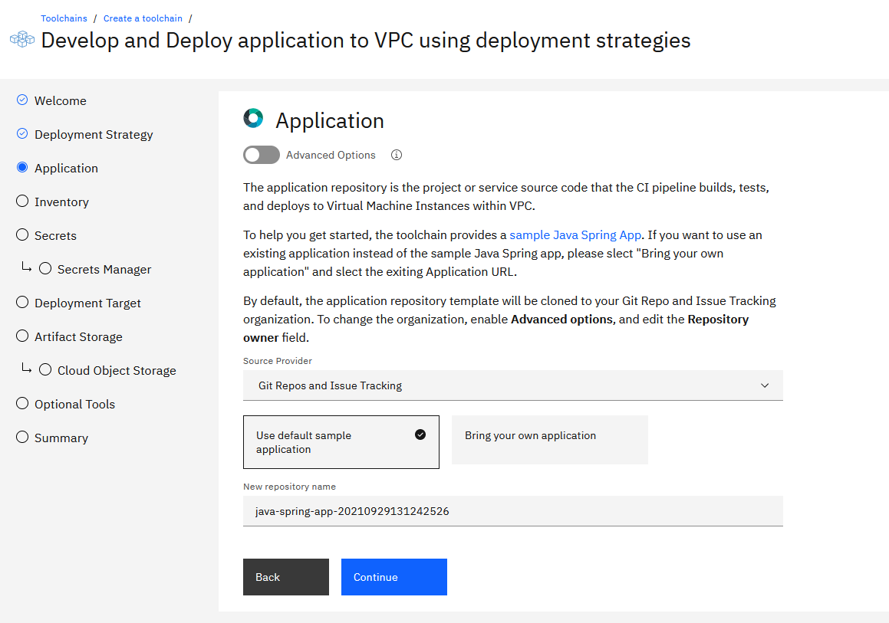{: caption="Figure 3. VPC secure app repo" caption-side="bottom"}

You can change the name of the app repo. The region of the repo remains the same as the region of the toolchain.

The toolchain template provides a sample [Java&trade; Spring App](https://us-south.git.cloud.ibm.com/open-toolchain/java-spring-app){: external} that uses a Maven build. If you want to link an existing Application repo for the toolchain, select **Bring your own app** and specify the URL for the repo. The toolchain supports linking only to existing {{site.data.keyword.gitrepos}} repos.

By default, the application repo template is cloned to your {{site.data.keyword.gitrepos}} org. To change the org, enable **Advanced options** and specify the repo owner.
{: tip}

### Configure the inventory repo
{: #tool-integration-inventory}

The inventory repo records the details of the artifacts that are built by the continuous integration toolchains. You can either create a new inventory repo that is a clone of the [inventory repo template](https://us-south.git.cloud.ibm.com/open-toolchain/compliance-inventory){: external} or use an existing inventory repo that you share between toolchains.

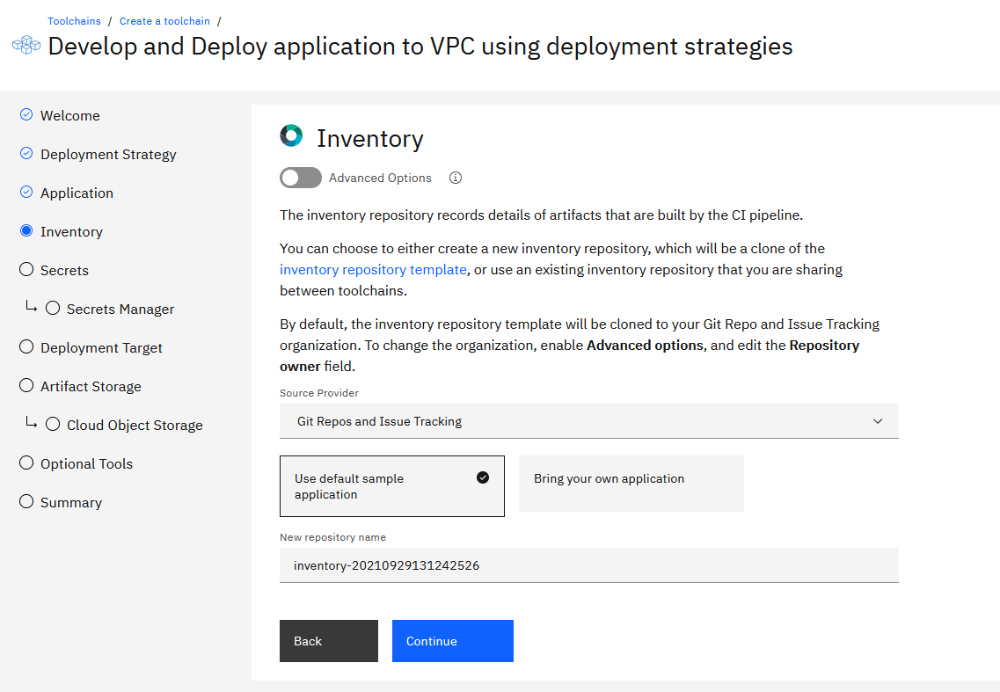{: caption="Figure 4. VPC secure app inventory repo" caption-side="bottom"}

By default, the inventory repo template is cloned to your {{site.data.keyword.gitrepos}} org. To change the org, select **Advanced options** and specify the repo owner.
{: tip}

### Securely store secrets
{: #tool-integration-secrets}
{: step}

Several tools within this toolchain require secrets, such as an {{site.data.keyword.cloud_notm}} API key. You must securely store all secrets in a secrets vault and reference them as required by the toolchain.

Using {{site.data.keyword.cloud_notm}}, you can choose from various secrets management and data protection offerings that help you to protect your sensitive data and centralize your secret. In the Secrets step, you can specify which secret vault integrations to add or remove from your toolchain. For more information about adding and removing vault integrations, including prerequisites and by using hints, see [Managing {{site.data.keyword.cloud_notm}} secrets](/docs/secrets-manager?topic=secrets-manager-manage-secrets-ibm-cloud). 

By using hints within a template, a toolchain is automatically populated with preconfigured secrets; you don't need to manually select secrets from vault integrations that are attached to the toolchain.
{: tip}

This tutorial uses the [IBM Secrets Manager](/docs/secrets-manager?topic=secrets-manager-getting-started) as the secrets vault.

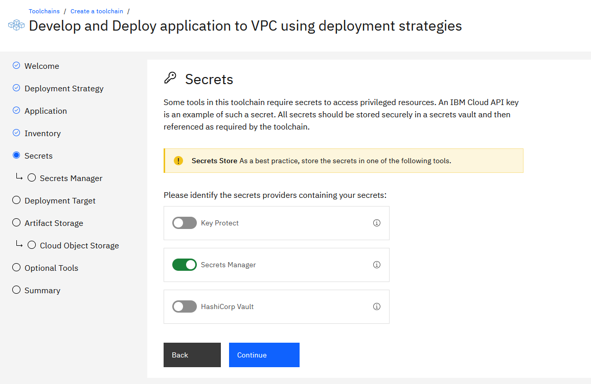{: caption="Figure 5. VPC secure app secrets options" caption-side="bottom"}

IBM Secrets Manager securely stores and applies secrets such as API keys, Image Signature, or HashiCorp credentials that are part of your toolchain.

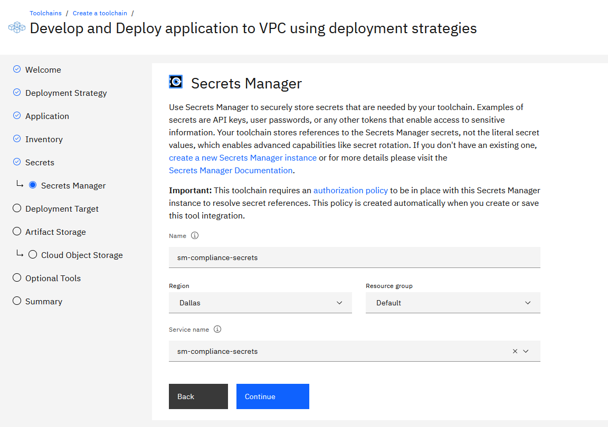{: caption="Figure 6. Secrets Manager options" caption-side="bottom"}

For more information about managing your secrets in IBM Key Protect or HashiCorp, see [IBM Key Protect](/docs/devsecops?topic=devsecops-cd-devsecops-tekton-ci-compliance#cd-devsecops-key-protect-ci) or [HashiCorp](/docs/devsecops?topic=devsecops-cd-devsecops-tekton-ci-compliance#cd-devsecops-vault-ci).

## Configure the deployment target
{: #deployment-target}
{: step}

Configure the deployment target for the toolchain by specifying details for the VPC, Bastion Host, Load Balancer, and Artifact Store. This tutorial uses the Blue-Green deployment strategy.

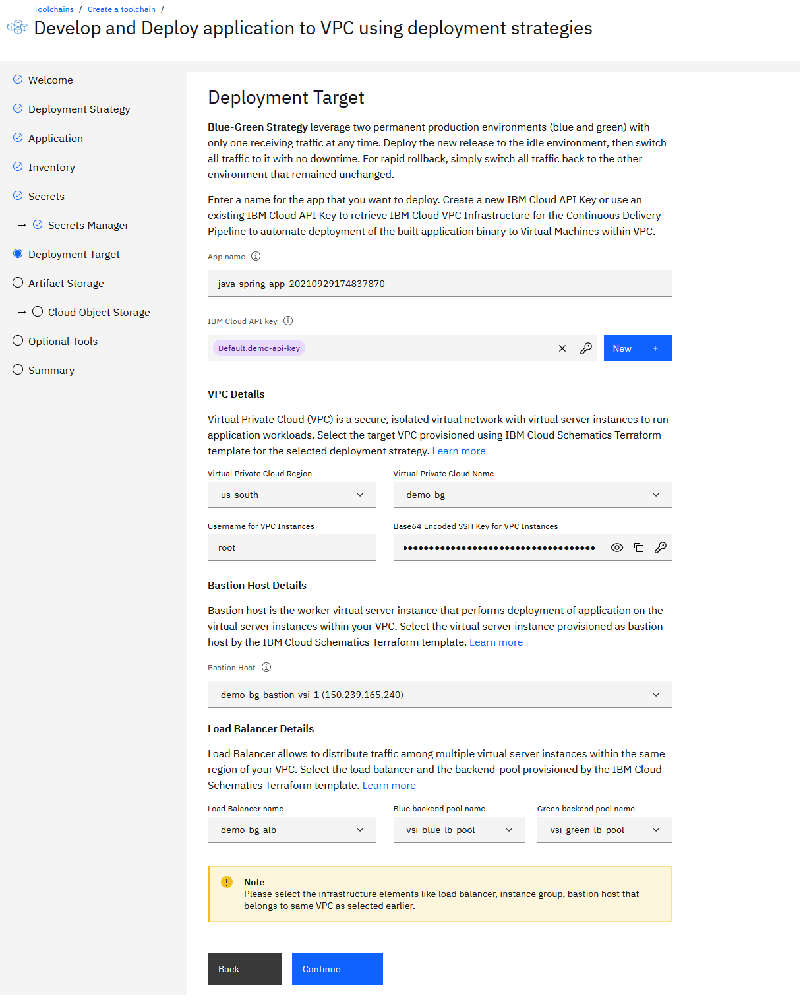{: caption="Figure 7. Deployment target Blue-Green strategy" caption-side="bottom"}

### Configure VPC details
{: #vpc-deployment-details}

Configure the toolchain by specifying information about the VPC and Virtual Server Instances (VSI).

You provisioned the VPC and VSI by using {{site.data.keyword.bplong}} and Terraform when you selected the deployment strategy to use.
{: tip}

* **Virtual Private Cloud Region**: Select the region in which you provisioned the VPC.
* **Virtual Private Cloud Name**: Select the VPC that you provisioned by using the Terraform template. Options include all of the available VPCs in the selected region.
* **Username for VPC Instances**: Specify the username that you configured when you provisioned the VPC instance. All of the VSIs in your VPC require a username and an SSH key to log in and deploy that instance.
* **Base64 Encoded SSH Key for VPC Instances**: Specify the private SSH key in base64-encoded form for the public SSH key that you configured when you provisioned the VPC instances.         

### Configure Bastion host details
{: #bastion-deployment-details}

The Terraform template also creates a VSI for use as a Bastion host. A Bastion host provides a secure way to connect to the VSIs within your VPC to complete deployment and maintenance tasks. The Bastion host connects to the VSIs over SSH by using the credentials (username and SSH key) that you configured in the VPC details.

The toolchain requires that you to log in to the VSIs within the VPC to deploy the app binary, start and stop the app, and download the third-party dependency to run the app. All of these tasks are achieved by using SSH-Tunneling with the Bastion host. The toolchain uses the same credentials to log in to the Bastion host that are used by the Bastion host to connect to the VSIs. 

* **Bastion Host**: Select the VSI that is provisioned as a Bastion host by the Terraform template. 

### Configure Load Balancer details
{: #load-balancer-deployment-details}

The sample app that is deployed on the VSIs in your VPC displays a simple web page on port 8080. To make the app available over the Internet by using a DNS name, and to load balance the traffic between multiple VSIs that run the app, the Terraform template provisions an Application Load Balancer. All of the VSIs that run the app form the backend pool of servers for the Load Balancer.

The toolchain uses the details for the Load Balancer and two backend pools to configure and redirect the live app traffic during the blue-green deployment process. The blue backend pool and the green backend pool contain the same number of VSIs. At any time, only one of the pools actively serves the live traffic while the other remains idle by running an older version of the app. The Load Balancer swaps or toggles the backend pool that serves live traffic with each deployment. While the blue backend pool is active currently, the next deployment deploys the app on VSIs in the green backend pool and makes it active while the blue backend pool is passive.

Configure the toolchain by specifying information about the Load Balancer:

* **Load Balancer name**: Select the application load balancer that is provisioned by the Terraform template.
* **Blue Backend pool name**: Select the Blue Backend pool that the Terraform template provisions for the Load Balancer.
* **Green Backend pool name**: Select the Green Backend pool that the Terraform template provisions for the Load Balancer.

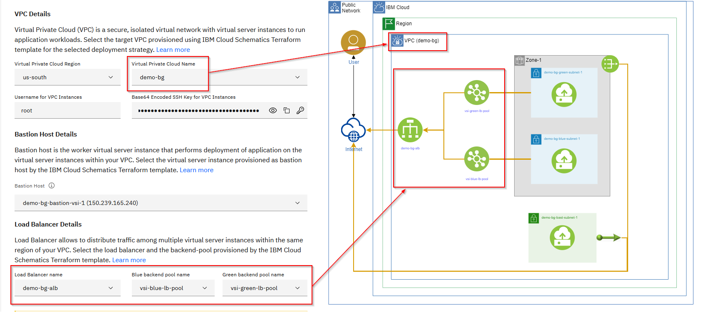{: caption="Figure 8. Blue-Green deployment target strategy" caption-side="bottom"}

After the details for the `deployment target` steps are populated, proceed to the next step.

### Configure Artifact Storage
{: #configure-artifact-storage}
{: step}

Any change to the source triggers the continuous integration pipeline. When a continuous integration run succeeds, a build or binary artifact is created and saved in transient storage, and then deployed to the target VSIs. 

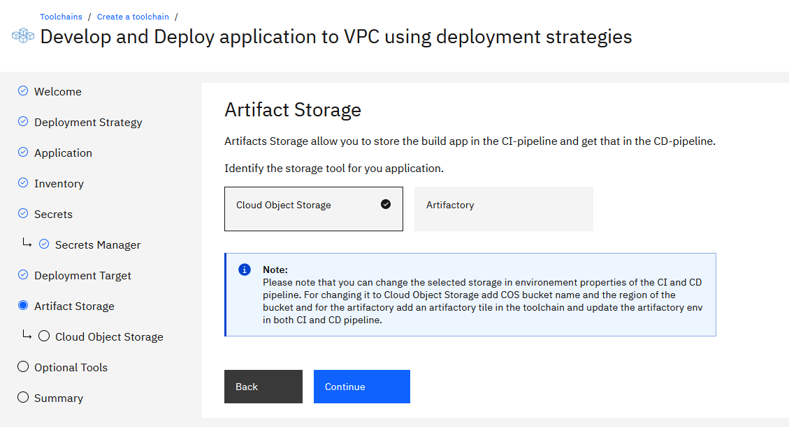{: caption="Figure 9. VPC artifact storage" caption-side="bottom"}

You can use {{site.data.keyword.cos_full_notm}} to store transient build artifacts within the toolchain. The continuous integration pipeline builds the executable `.jar` file  for the sample Spring Java App.

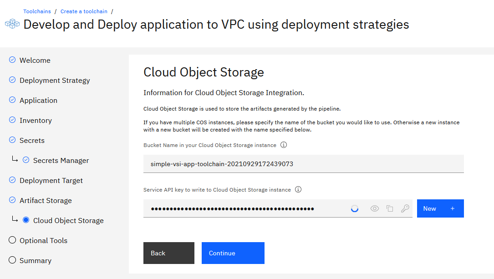{: caption="Figure 10. VPC artifact storage Cloud Object Storage" caption-side="bottom"}

Alternatively, you can use Artifactory if you have an Artifactory instance of your own.
{: tip}

## Add optional tool integrations
{: #optional-tools}
{: step}

You can add the Eclipse Orion {{site.data.keyword.webide}} and {{site.data.keyword.DRA_short}} tool integrations to your toolchain without any additional configuration. 

### Eclipse Orion {{site.data.keyword.webide}}
{: #web-ide-optional}

The [Eclipse Orion {{site.data.keyword.webide}}](/docs/ContinuousDelivery?topic=ContinuousDelivery-web_ide) is a browser-based development environment where you can develop for the web in JavaScript, HTML, and CSS with the help of content assist, code completion, and error checking. No additional configuration is required to use this tool.

### {{site.data.keyword.DRA_short}}
{: #devops-insights-optional}

[{{site.data.keyword.DRA_full}}](/docs/ContinuousDelivery?topic=ContinuousDelivery-di_working) is included in the created toolchain. You do not need to provide any configuration steps for {{site.data.keyword.DRA_short}}. The continuous integration pipeline automatically uses the {{site.data.keyword.DRA_short}} instance that is included in the toolchain. {{site.data.keyword.DRA_short}} aggregates code, test, build, and deployment data to provide visibility into the velocity and quality of all of your teams and releases.

{: caption="Figure 11. VPC secure app optional tools" caption-side="bottom"}

## Complete the toolchain setup
{: #toolchain-summary}
{: step}

On the Summary page, click **Create**. Several steps run automatically to set up your toolchain.

You can configure the individual toolchain integrations after the pipeline is created.
{: tip}

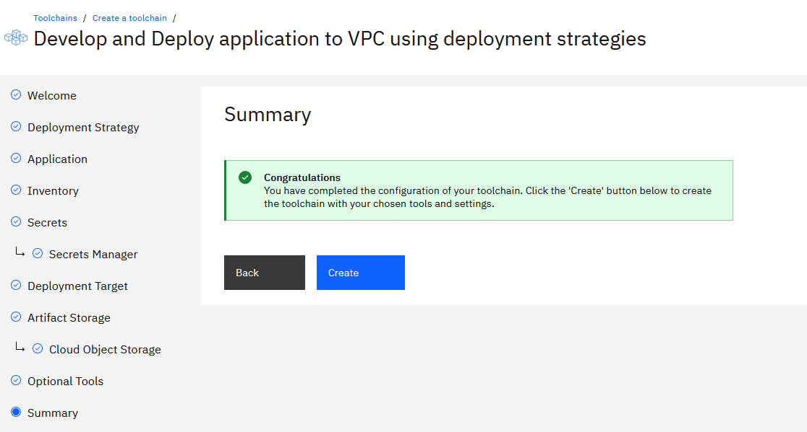{: caption="Figure 12. VPC secure app toolchain summary" caption-side="bottom"}

## Explore your new toolchain
{: #cd-explore-toolchain}
{: step}

After you create your toolchain, it shows each of the tool integrations that are part of the toolchain in a diagram. The diagram in the following image is an example. The diagram that you view for your toolchains might show different tool integrations or different data for those integrations.

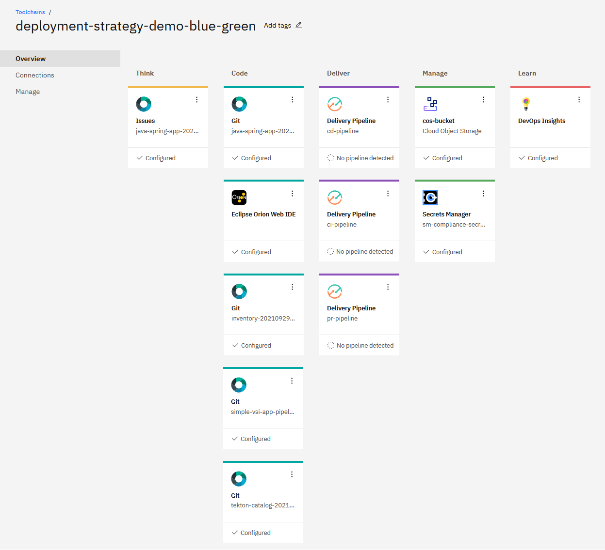{: caption="Figure 13. New toolchain" caption-side="bottom"}

### Explore the pipelines
{: #cd-pipelines}

You can explore the pipelines to understand the toolchain flow and the different operations that run within each pipeline. The toolchain that you just created contains three pipelines:

* **Pull request pipeline:** Runs when a developer merges changes from their development branch to the master branch, or to any other branch in the repo. The pull request pipeline runs the Unit Test and Static Scans on the Application Source Code.
* **Continuous integration pipeline:** Runs when you merge a change into the master branch of the Application Source Code repo. The continuous integration pipeline runs the Unit Test, Code Coverage, and Static Scans on the Application Source Code, CIS check, and Bill Of Materials (BOM) check. The continuous delivery pipeline also generates the binary build artifacts and uploads them to the {{site.data.keyword.containerlong}}, as configured in the toolchain. And the continuous integration pipeline generates the metadata of the build artifacts and stores it in the Inventory repo. 
* **Continuous deployment pipeline:** Deploys build artifacts to the deployment environment. The pipeline verifies the successful deployment of the app by running the health check. You must manually trigger this pipeline after the continuous integration pipeline successfully completes. Depending on the deployment strategy that you selected, more triggers are added to the continuous delivery pipeline.

### Run the pull request and continuous integration pipelines
{: #cd-pr-ci-pipeline-run}

To start the pull request pipeline, create a merge request in your app repo:

1. On the toolchain page, click the app repo card. By default, the app repo is named `compliance-app-<timestamp>`.
1. From the master repo, create a branch.
1. Update some code in the sample node app or readme file and save these changes.
1. Submit the merge request.
1. On the toolchain page, click the `pr-pipeline` card to start the pull request pipeline. The corresponding merge request in your app repo remains in the pending state until all of the stages of the pull request pipeline successfully complete.
1. After the pull request pipeline run succeeds, you can select it to explore the completed steps.

To start the continuous integration pipeline, merge the continuous integration merge request in your app repo:

1. Go to the merge request.
1. Merge the request so that your changes are copied to the master branch of your app repo. The continuous integration pipeline is automatically triggered.
1. On the continuous integration toolchain page, click the `ci-pipeline` card to start the continuous integration pipeline.
1. After the continuous integration pipeline run succeeds, you can click the pipeline run to explore the completed steps.

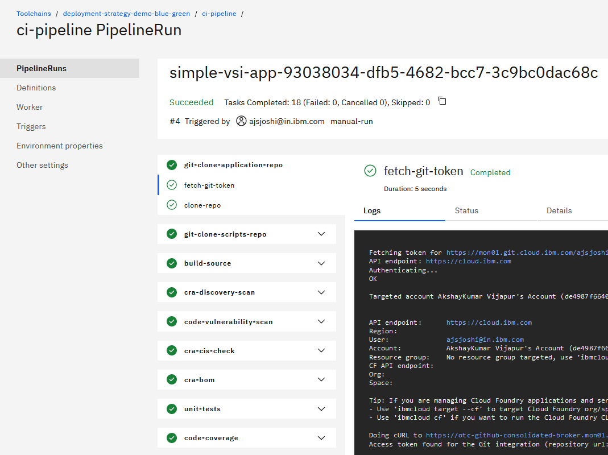{: caption="Figure 14. Continuous integration pipeline success" caption-side="bottom"}

To evaluate if you have any failures in your pipeline run, check the final step of your pipeline, which has a pipeline evaluator.
{: tip}

### Explore the continuous delivery pipeline
{: #explore-cd-pipeline}

The pull request and continuous integration pipelines are common across all of the deployment strategies. The continuous delivery pipeline design and implementation changes are based on the deployment strategy that you previously selected in this tutorial.

This tutorial demonstrates how the Blue-Green deployment strategy works by using the sample app.

#### Explore the Blue-Green deployment
{: #explore-blue-green-deployment}

The blue-green deployment strategy that is used in this tutorial demonstrates how you can use a deployment strategy with the {{site.data.keyword.contdelivery_short}} Service to run your production workloads on VPC. The continuous delivery pipeline provides three triggers for the blue-green deployment. You can start a continuous delivery pipeline in any of the following ways:

* Trigger the continuous delivery pipeline manually.
* Automatically trigger the continuous delivery pipeline after each `Merge` action in the Inventory repo. After the merge, you must manually trigger the continuous delivery pipeline run.
* Switch between blue and green deployments for an automated rollback.

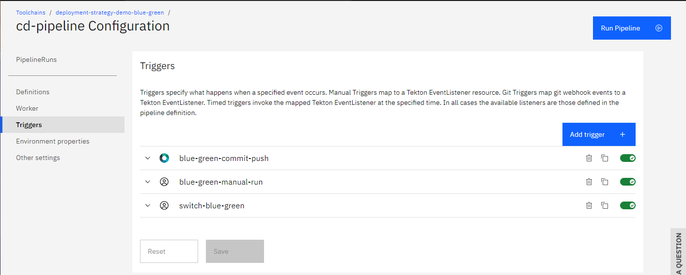{: caption="Figure 15. Continuous delivery pipeline triggers for Blue-Green deployment" caption-side="bottom"}

This tutorial shows how the Blue-Green deployment strategy works by using the sample app.

1. Run the manual trigger from the continuous delivery pipeline to deploy the first version of the app.

   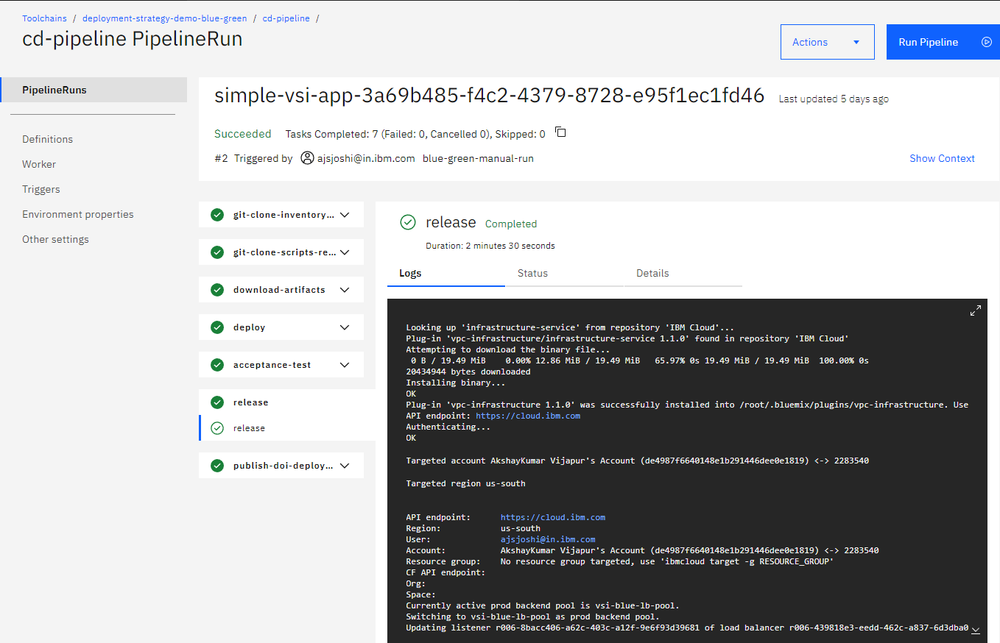{: caption="Figure 16. Continuous delivery pipeline manual run" caption-side="bottom"}

1. Locate the app URL within the `release` step of the continuous delivery pipeline and click the URL to verify that the app is running.

   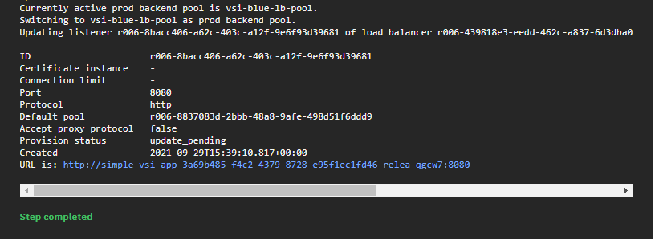{: caption="Figure 17. App URL location" caption-side="bottom"}

1. Update the app code and commit your changes. For the sample app, update the welcome message:

   a. Go to the sample app repo card on the toolchain page.

   b. Update the welcome message in the `utils.js` file.

   c. Wait until the continuous integration pipeline run completes successfully.

1. Run the manual trigger from the continuous delivery pipeline and wait until the continuous delivery pipeline run completes successfully.

1. Check the app URL again to confirm that the updated app is deployed. Both of the app versions are running simultaneously. All of the network traffic is flowing to the updated app.

1. Test the rollback by running the `switch-blue-green` trigger from the continuous delivery pipeline.  Wait until  the switch trigger pipeline run completes successfully. 

   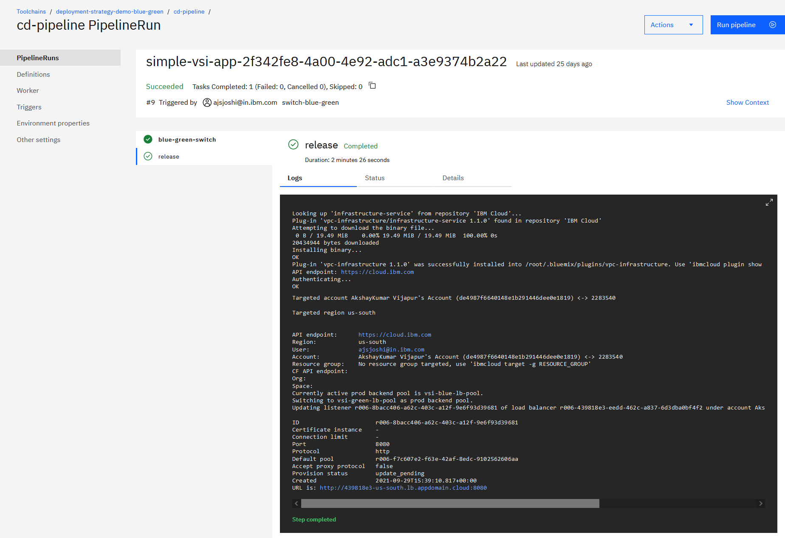{: caption="Figure 18. Successful continuous delivery pipeline switch trigger" caption-side="bottom"}

1. Check the app URL again to confirm that the previous version of the app is displayed.

You can run the switch trigger multiple times to alternate between the previous and latest versions of the app.
{: tip}

## Looking for help?
{: #cd-tutorial-help}

Get help from the {{site.data.keyword.contdelivery_full}} development teams by joining us on [Slack](https://ic-devops-slack-invite.us-south.devops.cloud.ibm.com/){: external}.

For more support options, see [Getting help and support for {{site.data.keyword.contdelivery_short}}](/docs/ContinuousDelivery?topic=ContinuousDelivery-gettinghelp).
