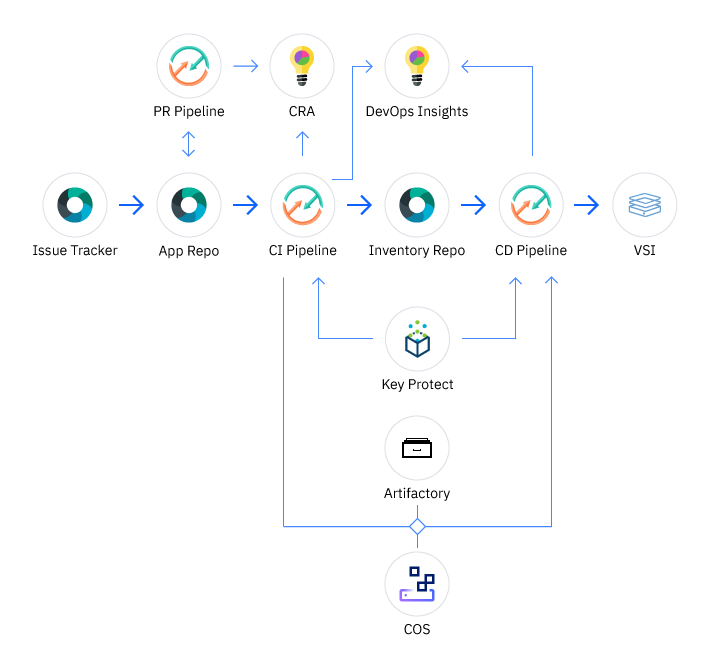
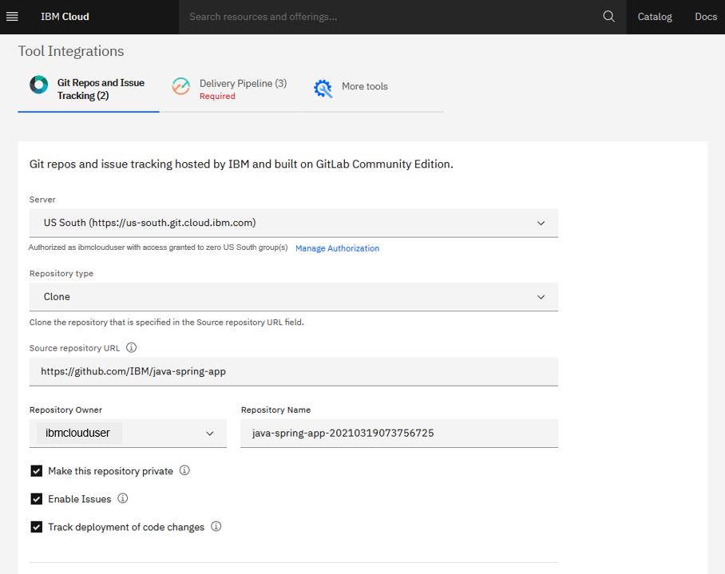
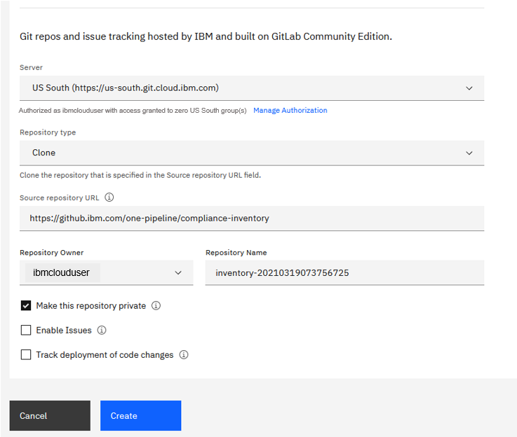
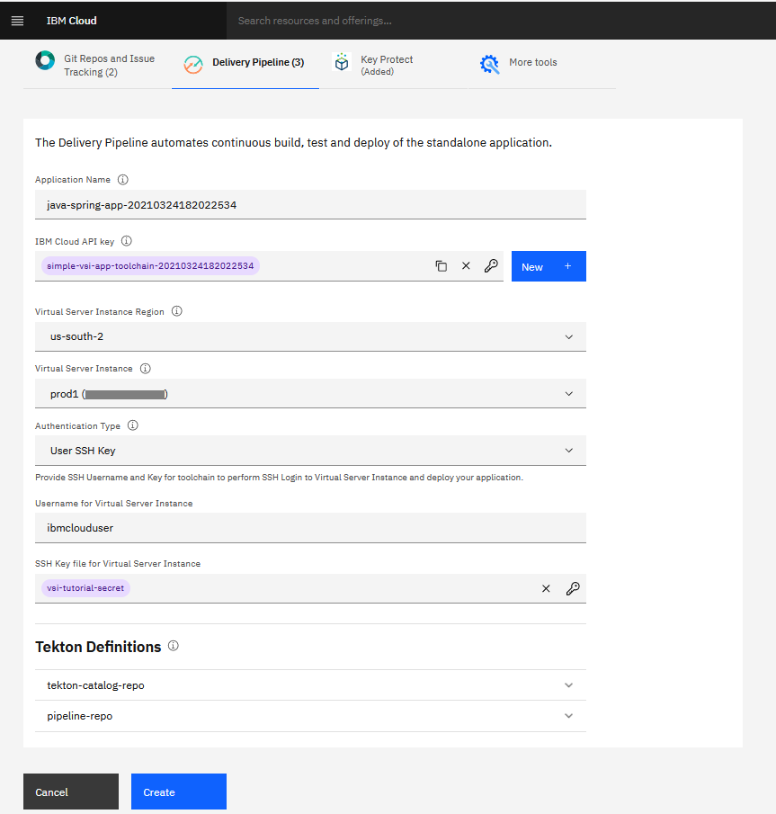
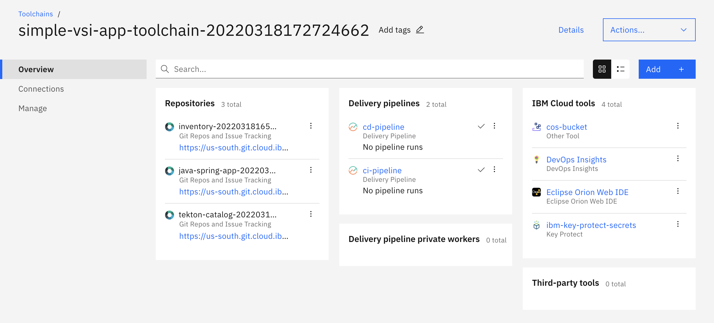
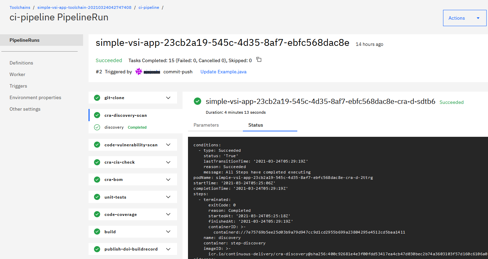
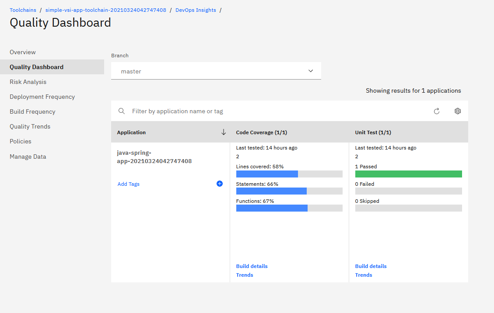
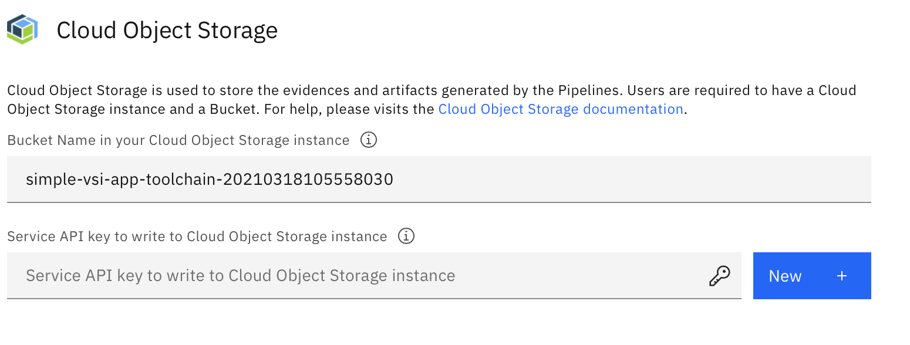

---

copyright:
   years: 2021
lastupdated: "2021-08-25"
lasttested: "2021-05-13"

keywords: Virtual Server Instance, code repositories, DevOps Insights, non-containerized, java application, vsi, gitops, toolchain, pipeline, Virtual Machine, vm

subcollection: ContinuousDelivery

content-type: tutorial
account-plan: paid
completion-time: 40m

---

{:shortdesc: .shortdesc}
{:screen: .screen}  
{:codeblock: .codeblock}  
{:pre: .pre}
{:tip: .tip}
{:external: target="_blank" .external}
{:step: data-tutorial-type='step'}

# Develop and deploy an application to a Virtual Machine
{: #tutorial-cd-vsi}
{: toc-content-type="tutorial"}
{: toc-services=""}
{: toc-completion-time="40m"}

This tutorial demonstrates how to set up a {{site.data.keyword.contdelivery_short}} toolchain and deliver a simple application (app) to a Virtual Machine. You can set up source control, and then build, test, and deploy the code to different deployment stages.
{: shortdesc}

By default, the toolchain uses a sample Maven-based Java Hello World app, but you can also bring your own app and link to it instead. This toolchain is configured with pipelines for continuous integration and continuous delivery with [Code Risk Analyzer (CRA)](/docs/ContinuousDelivery?topic=ContinuousDelivery-cd-configure-cra-repos), source control, issue tracking, and online editing.

The application code is stored in the application source control repository (repo). The build and deploy scripts are stored in the pipeline source control repository. You can customize the build and deploy scripts to meet the development requirements for the app.

The toolchain in this tutorial implements the following best practices:

* Builds an application binary on every Git commit, and sets a tag based on build number, timestamp, and commit ID for traceability.
* Inserts the built binary into the deployment manifest automatically.
* Creates a {{site.data.keyword.cos_short}} instance and Bucket to store the transient binary files that are built out-of-box. For advanced users, an existing Artifactory repo can be configured and integrated with the toolchain to support the versioning of build artifacts for traceability and compliance purposes.

The toolchain implements three pipelines to build and deploy app code to a Virtual Machine.

* **Continuous Integration (CI) Pipeline**: This pipeline is triggered when a change is merged to the master branch of the Application Source Code repo. The CI Pipeline runs the Unit Test, Code Coverage, and Static Scans on the Application Source Code. The CI Pipeline also generates the binary build artifact and uploads it to the {{site.data.keyword.cos_short}} Bucket or Artifactory, as configured in the toolchain. And the CI Pipeline generates the metadata of the build artifacts and stores it in the Inventory repo.

* **Continuous Deployment (CD) Pipeline**: This pipeline is triggered by a successful CI Pipeline run. The CD Pipeline is responsible for deploying the build artifacts to the deployment environment. The pipeline verifies the successful deployment of the application by running the health check and rolls back the changes if the deployment is unsuccessful.

* **Pull Request (PR) Pipeline**: This pipeline is triggered when a merge or pull request is created in the Application Source Code Repository. Typically, this request is manually created by the application source code developer to merge changes from their development branch to the master branch or any other branch. The PR Pipeline runs the Unit Test and Static Scans on the Application Source Code.


{: figure caption="Figure 1. Toolchain architecture"}

## Before you begin
{: #cd-vsi-prereqs}

Set up and configure the Virtual Server Instance for the toolchain to deploy the app to the Virtual Server Instance. You can use an existing Virtual Server Instance or set up a new one that conforms to the following requirements:

1. [Set up the Virtual Server Instance on IBM Cloud](/docs/vpc?topic=vpc-creating-virtual-servers).
2. [Reserve a floating IP address](/docs/vpc?topic=vpc-creating-a-vpc-using-the-ibm-cloud-console#reserving-a-floating-ip-address) to make the Virtual Server Instance accessible over the public internet. Alternatively, you can use the available DNS entry. This tutorial uses a floating IP address.
3. Create the user (preferably non-privileged) and [SSH keys](/docs/vpc-on-classic-vsi?topic=vpc-on-classic-vsi-ssh-keys#ssh-keys) for the Virtual Server Instance.
4. Configure [Security Groups](/docs/security-groups?topic=security-groups-getting-started) for the Virtual Server Instance. Enable the toolchain to perform health checks on the deployed app by adding an inbound rule for `TCP` to allow port `8080` so that it can access the app endpoint. For more information about adding an inbound rule, see [Managing security groups](/docs/security-groups?topic=security-groups-managing-sg).
5. Ensure that Java&trade; SDK is installed on your VM or use the following command to install it: `yum install -y tar java`.
6. Optional. If you need to store secrets in `Key Protect`, perform base64 encoding of the value. For more information about the required command details, see [Image signing: generating a GPG key](/docs/ContinuousDelivery?topic=ContinuousDelivery-cd-devsecops-image-signing#cd-devsecops-gpg-private-key).

### Related content
{: #cd-vsi-related-content}

* [Getting started with toolchains](https://cloud.ibm.com/devops/getting-started)
* [Getting started with Continuous Delivery](/docs/ContinuousDelivery?topic=ContinuousDelivery-getting-started)

## Create the toolchain
{: #cd-vsi-create-toolchain}
{: step}

To create a **Develop an application for a Virtual Machine** toolchain, click

[](https://cloud.ibm.com/devops/setup/deploy?repository=https%3A%2F%2Fgithub.com%2Fopen-toolchain%2Fsimple-vsi-toolchain&env_id=ibm:yp:us-south){: external}

Alternatively, from the {{site.data.keyword.cloud_notm}} console, click the menu icon , and select **DevOps**. On the **Toolchains** page, click **Create a Toolchain**. On the **Create a Toolchain** page, click **Develop an application for a Virtual Machine**.
{: tip}

### Configure the simple Virtual Server Instance
{: #cd-vsi-config-vsi}

1. In the **Create** tab, review the default settings.

 

2. The toolchain's name identifies it in {{site.data.keyword.cloud_notm}}. If you want to use a different name, change the toolchain's name. Because the toolchain name is used to construct the URL that is used to access your app, make sure to specify a unique name.
3. By default, the toolchain creates the source repo in {{site.data.keyword.gitrepos}}. To use a different provider for your Git source repo, such as GitHub or GitLab, select it from the list of available repos.

This toolchain uses tools that are included in the {{site.data.keyword.contdelivery_short}} service. If an instance of that service isn't already in the selected resource group or organization (org), it is added automatically with the free Lite plan when you click **Create** to create the toolchain.
{: tip}

### Configure the App repo
{: #cd-vsi-config-apprepo}

1. In the **{{site.data.keyword.gitrepos}}** tab, review the default setting that specifies the location of your app's source code. 
2. By default, the toolchain uses a sample Maven-based Java Hello World app. You can update the location setting to link to your own app instead.

 
 
### Configure the Inventory repo
{: #cd-vsi-config-inventoryapp}

The Inventory Repository stores the metadata for builds and artifacts. To trigger the pipeline to deploy the artifacts that are described in the commit to the Virtual Server Instance, commit to the Inventory Repository, and then run the acceptance tasks.

 

### Configure the Delivery Pipeline
{: #cd-vsi-config-pipeline}

1. Go to the **Delivery Pipeline** tab.

 

2. Specify an existing IBM Cloud API Key or create a key. The toolchain uses this key to interact with other Cloud Services that are integrated into the toolchain.
3. Specify the region where the Virtual Server Instance is running, such as `us-south`.
4. Specify the floating IP address of the Virtual Server Instance by using the `aaa.bbb.ccc.ddd` format.
5. Select `SSH Key` Authentication Type and specify the following credentials:

   * User Name: The username of the Virtual Server Instance user with permissions to deploy and run the application.
   * SSH Key: The user's private SSH Key for running and deploying the application.

6. Run the following commands to create a new key-pair on the Virtual Server Instance for the user with permissions to deploy and run the applications.

```
        # Create the SSH key
            `ssh-keygen -C cloud.ibm.com`
        # copy public key to the VSI
            `ssh-copy-id -i .ssh/id_rsa.pub <UserName>@<xx.yy.zz.aa>`
```
{: codeblock}

### Optional. Create transient storage configuration
{: #cd-vsi-create-storage}

Any change to the source triggers the continuous integration pipeline. When a continuous integration run succeeds, a build or binary artifact is created and saved in transient storage, and then deployed to the target Virtual Server Instance.

1. From the **More Tools** tab within your toolchain, you can choose to use either {{site.data.keyword.cos_short}} or Artifactory as transient storage to save the build binary files.
2. If your account doesn’t contain any instances of {{site.data.keyword.cos_short}}, the toolchain creates a new {{site.data.keyword.cos_short}} instance in the default resource group. Next, the toolchain creates a bucket that uses the same name as the toolchain within the new {{site.data.keyword.cos_short}} instance.
3.  If your account already contains {{site.data.keyword.cos_short}} instances, the toolchain uses one of those instances to store transient build artifacts.
4. To configure {{site.data.keyword.cos_short}} or Artifactory details, see the [Configuring advanced user options](#cd-vsi-config-advanced) section.
5. Click **Create** to create the toolchain.

## Explore your new toolchain
{: #cd-vsi-explore-toolchain}
{: step}

After you create your toolchain, it shows each of the tool integrations that are part of the toolchain in a diagram. 
The diagram in the following image is an example. The diagram that you view for your toolchains might show different tool integrations or different data for those integrations.



### Explore the pipelines
{: #cd-vsi-explore-pipelines}

You can explore the pipelines to understand the toolchain flow and the different operations that run within each pipeline.
For example, to view multiple steps such as `cra-discovery-scan` and the details for Parameter and Status, click the CI Pipeline tool integration, and then click **Succeeded PipelineRuns**.



### Explore {{site.data.keyword.DRA_short}}
{: #cd-vsi-explore-dra}

[{{site.data.keyword.DRA_short}}](/docs/ContinuousDelivery?topic=ContinuousDelivery-di_working) aggregates data from your toolchain so that you can track and improve your end-to-end DevOps processes. View quality metrics, track build and deployment jobs, view policies and more.

If your code does not meet or exceed a policy, the deployment is halted, preventing risks from being released. You can use DevOps Insights as a safety net for your continuous delivery environment or as a way to implement and improve quality standards.

The following image shows the Quality Dashboard that provides quality data sets such as unit tests, code coverage, functional verification tests, and static security scans for each application. 



### Explore GitOps
{: #cd-vsi-explore-gitops}

GitOps is a set of practices and tools that puts Git at the center of the DevOps toolchain and as the source of truth for what to deploy on the Virtual Server Instance. With GitOps, developers and operators use familiar Git workflows to define, review, approve, and audit changes to their infrastructure and applications. Automated tools take care of synchronizing the live state of their targets with the wanted state that is described in Git.

By using the toolchain in this tutorial, you can control deployments to multiple environments by creating one branch for each environment. The following example workflow triggers a {{site.data.keyword.contdelivery_short}} pipeline when a pull request or a commit is made to a specific branch of the Inventory repo.

1. Create a toolchain for Virtual Server Instance on IBM Cloud by providing details for the Virtual Server Instance such as the Application repo and {{site.data.keyword.cos_short}}. Do not specify any details for the Inventory repo.
2. After the toolchain is created, from the Inventory repo create multiple branches such as `Dev`, `Staging`, and `Prod`.
3. Click the {{site.data.keyword.contdelivery_short}} Pipeline and go to the triggers. Add a trigger source as an Inventory repo with the branch that you want to trigger the CD-Pipeline (Master).
4. Modify your Continuous Integration pipeline to commit to respective Inventory repos after successful integration.
5. After enough commits are available in the Inventory repo, merge the pull request in the repo to master to start a {{site.data.keyword.contdelivery_short}} build.

By using GitOps, you can control deployments to multiple environments by creating one branch for each environment.

## Configure advanced user options
{: #cd-vsi-config-advanced}
{: step}

To access the advanced user options, go to the **More Tools** tab.

* Specify an existing Cloud Object Storage instance to store transient build artifacts:

    * Specify the name of the bucket in your {{site.data.keyword.cos_short}} instance where you want to store the transient build artifacts. To upload objects to the bucket, it must reside in the same region where the toolchain is created.

    * Select the API Key that has read and write access to the bucket that you specified.


* To use an Artifactory account to store transient build artifacts, specify details for your Artifactory instance:

   * Artifactory Server URL: HTTPS URL of the Artifactory Server 
   * Type: Choose from npm, maven, or docker
   * Artifactory UserID: User ID to log in to the Artifactory Server, in the `xxx.xxx@xxx.com` format
   * Artifactory APIKey: APIKey generated by the User (Existing or New)
   * Release URL:  Release URL for the Artifactory repo where artifacts are stored

Some fields in the Artifactory are mandatory only when you use the Artifactory configuration.

{: tip}

Click **Create** to create the toolchain. This process might take several minutes to complete.

## Optional. Roll back to the previous version of the deployed application
{: #cd-vsi-rollback-app}
{: step}

You might want to roll back the deployed code because of test results, code quality issues, and other issues. You can use the Inventory Repository to roll back to the previous version of the application.

1. Type `git clone <inventory-repo-url>` to clone and download the Inventory Git repo from your pipeline. The {{site.data.keyword.contdelivery_short}} pipeline listens to the master branch of the Inventory repo.
2. Type `git log` to view the list of commits completed by the Continuous Integration pipeline.
3. Type `git checkout master` to check out the master branch.
4. Type `lastCommitID=$(git log --format="%H" -n 1)` to retrieve the last commit ID for the repo.
5. Type  `git revert $lastCommitID` to create a new commit by reverting the current change. Make sure that you provide a commit message for this revert.
6. Type `git push` to push the change to the Inventory repo and start the {{site.data.keyword.contdelivery_short}} pipeline for application deployment.

## Next steps
{: #cd-vsi-next-steps}

Although this tutorial used an example Java app, you can also deploy other language-based apps on a Virtual Server Instance. To deploy a different language-based app to a Virtual Server Instance, delete both the toolchain and the Virtual Server Instance that you created for this tutorial.
