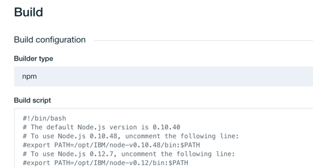
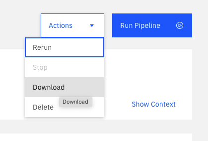

---

copyright:
  years: 2018, 2023
lastupdated: "2023-06-27"

keywords: IBM Cloud account, personal data, personal accounts, corporate accounts, access, Git Repos and Issue Tracking, pipeline data, toolchains, tool integrations

subcollection: ContinuousDelivery

---

{{site.data.keyword.attribute-definition-list}}

# Managing personal data for {{site.data.keyword.contdelivery_short}}
{: #cd_personal_data}

You can modify, export, or delete personal data from {{site.data.keyword.contdelivery_full}}.
{: shortdesc}

Personal data is any information that relates to or identifies a natural person. For example, personal data can be a name, email address, avatar, token, or any number of identifiers that are used with {{site.data.keyword.contdelivery_short}}. The following {{site.data.keyword.contdelivery_short}} components contain personal data:

* {{site.data.keyword.gitrepos}}
* {{site.data.keyword.contdelivery_short}} Pipelines
* Toolchains and tool integrations
* [{{site.data.keyword.DRA_full}}](/docs/ContinuousDelivery?topic=ContinuousDelivery-deleting_data)
 
IBM does not manage data in the {{site.data.keyword.contdelivery_short}} service. Before you leave the {{site.data.keyword.contdelivery_short}} service that is hosted in {{site.data.keyword.cloud_notm}} Public, you must delete your own data.
{: important}

{{site.data.keyword.contdelivery_short}} provides the appropriate permissions to manage data within a resource group. Your company might have policies that limit these permissions. If you don't have the appropriate permissions, contact the administrator for your {{site.data.keyword.cloud_notm}} account.

To manage your personal data, you must understand {{site.data.keyword.cloud_notm}} accounts, how these accounts are used, and their associated access rights.
 
## Accounts and access rights
{: #accounts_access_rights}

To work in {{site.data.keyword.cloud_notm}}, you must log in with a username and password. When you log in, {{site.data.keyword.cloud_notm}} associates at least one {{site.data.keyword.cloud_notm}} account with your user credentials. When you create resources such as resource groups, toolchains, and {{site.data.keyword.contdelivery_short}} objects, they are associated with an {{site.data.keyword.cloud_notm}} account.

The {{site.data.keyword.cloud_notm}} login structure provides you with the option to work in different accounts. Using the {{site.data.keyword.cloud_notm}} user interface, you can switch from one account to another. When you log in, any of the following types of accounts might be associated with your user credentials: 

* Personal account
* Corporate account
* Corporate individual account

### Personal accounts
{: #personal_accounts}

Typically, each user has their own account that is their personal account. You can easily identify your personal account because it usually contains your name, for example, *John Smith's Account*. 

You have full rights over all objects that are created in your personal account. You can invite other users to join your account, assign them rights over objects that you create, and assign them rights to create objects in your account. Because of these rights, the personal data of other users might be in your account, and your personal data might be in other user's accounts. 

If you have permission to create an object in an account, you also have the right to modify and delete it, regardless of which account the object is stored in. When two users collaborate, they often share a personal account.

### Corporate accounts
{: #corp_accounts}

A corporate account is set up by your company. Typically, you are added automatically to the account, rather than being invited. Although corporate accounts provide users with a place to work, communicate, and share resources and charging, this set up is just a convention. A corporate account is really no different than a personal account. Objects that are created in a corporate account are associated with the account and users can be invited to the account.

Teams of people who work for a corporation often collaborate by using a corporate account.

### Corporate individual accounts
{: #corp_individual_accounts}

When you work for a corporation, the work in your account might be legally owned by the corporation. Many users who work for a corporation have a corporate individual account. If you log in to your account by using credentials that contain your corporation's name and also have what appears to be a personal account, the work within your personal account might belong to the corporation.

A corporate individual account is no different from any other account. You can invite users to a corporate individual account and objects that are created in a corporate individual account are owned by the account.

If you work for a corporation that owns your work, a personal account that usually contains your name is considered a corporate individual account. 

## Modifying, exporting, and deleting personal data
{: #managing_personal_data}

Regardless of what type of {{site.data.keyword.cloud_notm}} account is used, if you have rights to the objects in the account, you can modify, export, and delete them. Before you make changes, coordinate with other users to make sure that you don't unnecessarily modify or delete data.

Before you delete data from an account, determine whether it is a personal account or a corporate individual account.

### Personal account
{: #personal_data_account}

If you own a personal account, you can make changes and delete your data. If you share your account with another user, you own the data, but you might want to contact them about the shared work. 

If you can't log in to your {{site.data.keyword.cloud_notm}} account, [contact IBM Support](https://www.ibm.com/cloud/support){: external}.
 
### Corporate individual account
{: #corp_individual_account}

If you own a corporate individual account, you must coordinate any changes with both your corporation and other members of your team. Delete your personal data regardless of whether it is stored in a corporate account or a corporate individual account. Make sure that you don't delete work that you shared with other users.

Before you start to manage your personal data for the {{site.data.keyword.contdelivery_short}} components, make sure that you are working in your {{site.data.keyword.cloud_notm}} account. To view the {{site.data.keyword.cloud_notm}} account that you are currently working in, on the menu bar, click your profile avatar. 

If you can't log in to your {{site.data.keyword.cloud_notm}} account, contact your corporation, and work with them to delete your personal data.

If you want to delete all of your personal data from {{site.data.keyword.contdelivery_short}}, the order in which you delete that data is important. First, delete your {{site.data.keyword.gitrepos}} data, and then delete your {{site.data.keyword.gitrepos}} account. Finally, delete your delivery pipelines, tool integrations, and toolchains.
{: tip}

## Modifying, exporting, and deleting {{site.data.keyword.gitrepos}} data
{: #managing_grit_data}

{{site.data.keyword.gitrepos}} provides a hosted Git service in the cloud. A single sign-on mechanism is used to associate your {{site.data.keyword.cloud_notm}} account with a Git account. A full name and a short name are created for you in your Git account. Other users can use your short name to refer to you in a comment within a Git issue. You can customize your Git account and add personal data such as a description of yourself or an image. 

{{site.data.keyword.gitrepos}} provides a powerful, but complex social coding environment in which users contribute to different projects and objects are shared. This environment can make it difficult to locate and delete your personal data.

Your account profiles and settings, personal projects, groups, and snippets are associated with your Git account. If you delete your Git account, these objects are deleted. To delete personal data in another project, go to the project, and then modify it to remove your personal data, or delete the project entirely. Make sure that you coordinate with other members of your team before you delete shared projects.

Before you delete your Git account, delete your personal data from other projects. After you delete your Git account, it might be difficult, or impossible to find all of the projects that you contributed to.
{: tip}

### Personal and shared projects
{: #personal_shared_proj}

You can invite other users to collaborate in projects. Git projects that you create inside your account are called personal projects. You can also create Git groups in which projects can be owned by multiple Git owners. You can create new projects for the group or transfer ownership of personal projects to the group. A Git group is often used to represent an {{site.data.keyword.cloud_notm}} corporate account to indicate ownership of projects by the corporation.

### Exporting a {{site.data.keyword.gitrepos}} project
{: #export_grit_proj}

Before you delete a {{site.data.keyword.gitrepos}} project, you can export the project to archive it. 

1. Click the **Settings** icon  in the navigation sidebar.
1. Click **General**.
1. Click **Expand** to expand the Export project section.
1. Click **Export project**.

After the project is archived, you can import it into another GitLab instance. 

### Deleting your {{site.data.keyword.gitrepos}} account
{: #delete_grit_account}

You can delete your {{site.data.keyword.gitrepos}} account and most of the things that are owned by that account.

1. On the {{site.data.keyword.gitrepos}} User Settings dashboard, on the [Account page](https://us-south.git.cloud.ibm.com/profile/account){: external}, in the Delete account section, click **Delete account**.
1. All Git projects, including repositories and issues are deleted. You are also removed from any {{site.data.keyword.gitrepos}} groups that you belong to.

After your account is deleted, some content will remain. This content is assigned to a system-wide Ghost User. For example, comments that you added to an issue remain, but they are attributed to the Ghost User. To delete all of the content that you authored, contact [IBM Support](https://www.ibm.com/cloud/support){: external}

{{site.data.keyword.gitrepos}} uses a single sign-on mechanism that automatically creates a corresponding Git account for your {{site.data.keyword.cloud_notm}} account the first time that you access the tool integration. After you delete your account, do not access {{site.data.keyword.gitrepos}}. If you access {{site.data.keyword.gitrepos}} again, a new account is automatically created that you must delete.
{: important}

## Modifying, exporting, and deleting {{site.data.keyword.contdelivery_short}} pipeline data
{: #managing_pipeline_data}

{{site.data.keyword.contdelivery_short}} provides two different types of pipelines: Classic and Tekton. These pipelines run scripts to build, test, and deploy your application to the {{site.data.keyword.cloud_notm}} by providing stages and tasks, jobs and steps, environment variables, and other objects that might contain personal data. You can delete these objects individually or you can delete an entire pipeline.

Make sure that you coordinate with other members of your team before you delete shared objects or pipelines. Deleting shared objects might cause a pipeline to fail.

A pipeline cannot exist outside of a toolchain. If you delete a toolchain, all of the pipelines that are associated with the toolchain are also deleted. If you plan to delete an entire toolchain, you do not need to delete each pipeline individually. Instead, go to the "Modifying and deleting toolchains and tool integrations" section, and follow the steps to delete a toolchain.
{: important}

## Classic pipelines
{: #pipeline_classic}

Classic pipeline stages might include personal data such as credentials in the form of environment properties, and a pipeline definition that shows the current state of the pipeline. Stages might also include scripts inside jobs that you want to modify or delete, and artifacts and logs for the most recent pipeline runs that you want to export. Use the Configure Stage or Delete Stage actions to modify or delete a stage. Use the Download action to export artifacts or logs from a stage.
   
{: caption="Figure 1. Stages menu" caption-side="bottom"}

### Modifying a Classic pipeline stage
{: #modifying_pipeline_classic_stage}

To modify a pipeline stage:

1. On the Pipeline page, click the **Settings** icon.
1. Click **Configure Stage**.
1. On the **ENVIRONMENT PROPERTIES** tab, edit or delete properties.
1. Modify a job script within the pipeline stage. Select the job and change the values that are part of the Build, Deploy, or Test Configuration.
   
   {: caption="Figure 2. Modify job script" caption-side="bottom"}
  
1. Delete a job from the pipeline stage. On the **JOBS** tab, select the job that you want to delete and click **Remove**.
 
### Exporting a Classic pipeline stage
{: #exporting_pipeline_classic_stage}

To export the definition for an entire pipeline, append `/yaml` to the pipeline URL:

`https://cloud.ibm.com/devops/pipelines/<pipeline id>/yaml?env_id=<region id>`

Where `<pipeline id>` and `<region id>` are the values that are displayed in the pipeline page URL.

The resulting yaml file includes definitions of all of the pipeline stages.

To export artifacts and logs for a pipeline stage:

1. On the Pipeline page, click **View logs and history**.
1. Click the build number that you want to export artifacts and logs for.
1. Click **DOWNLOAD** > **Artifacts** to export the artifacts for the selected build.
1. Click **DOWNLOAD** > **Logs** to export the logs for the selected build.  

### Deleting a Classic pipeline stage
{: #deleting_pipeline_classic_stage}

To delete a pipeline stage:

1. On the Pipeline page, click the **Settings** icon.
1. Click **Delete Stage**.

## Tekton pipelines
{: #pipeline_tekton}

Tekton pipelines might include personal data such as credentials in the form of environment properties or pipeline runs details. You can delete these runs, which removes the associated run details and logs. Use the Download action to export all of the data that is associated with the selected pipeline run.

{: caption="Figure 3. Run actions" caption-side="bottom"}

### Modifying a Tekton Pipeline
{: #modifying_pipeline_tekton}

To modify a Tekton Pipeline definition:

1. On the Pipeline Overview page, click **Settings**, and then click **Definitions**.
1. Click **Add** to add a Git repo that was already added to the toolchain.
1. Click the menu to access the options and click **Edit** or **Remove** to edit or remove an existing Git repo definition.

To modify the worker to use to run the Tekton Pipeline:

1. On the Pipeline Overview page, click **Settings**, and then click **Worker**.
1. Select any worker that was added to the toolchain or the public managed workers.

To modify the environment properties used by the tekton pipeline:

1. On the Pipeline Overview page, click **Settings**, and then click **Environment properties**.
1. Edit, add, or remove properties from the page.

For more information about modifying Tekton Pipelines, see [Working with Tekton pipelines](/docs/ContinuousDelivery?topic=ContinuousDelivery-tekton-pipelines).

### Deleting a Tekton Pipeline
{: #deleting_pipeline_tekton}

To delete a Tekton Pipeline:

1. From your toolchain's Overview page, on the **Delivery pipelines** card, go to your Tekton pipeline instance.
1. Click the menu on your Tekton pipeline to access the configuration options and click **Delete**.

For more information about deleting Tekton pipelines, see the following topics:

* [Deleting a {{site.data.keyword.deliverypipeline}} with the API](/docs/ContinuousDelivery?topic=ContinuousDelivery-tekton-pipelines&interface=api#deleting-pipeline-api)
* [Deleting a {{site.data.keyword.deliverypipeline}} with Terraform](/docs/ContinuousDelivery?topic=ContinuousDelivery-tekton-pipelines&interface=terraform#deleting-pipeline-terraform)

## Modifying and deleting toolchains and tool integrations
{: #managing_toolchains}

By using toolchains, teams can collaborate and share different tool integrations. 

It is recommended that you configure all {{site.data.keyword.contdelivery_short}} integrations by using data that is associated with your team or company, rather than data that is associated with you. However, in some instances your personal data might be inadvertently used instead. In such instances, you must identify all of the data that you own and delete it.

When a tool integration is created, {{site.data.keyword.contdelivery_short}} cannot record the origin of all of the data. For example, another team member might create a tool integration for you by using personal data that you provide in an email. You must understand which data you own and make sure that it is deleted.

Coordinate with other members of your team before you delete shared tool integrations or toolchains.

### Modifying and deleting tool integrations
{: #mod_delete_tool}

When you create a tool integration, you must provide user credentials and other account information that pertains to the integration. If you used your own personal credentials and account information, replace this information with different values, or delete the tool integration.

For more information about modifying tool integrations, see the following documentation:

* [Updating a tool integration by using the console](/docs/ContinuousDelivery?topic=ContinuousDelivery-integrations&interface=ui#update_integration_ui)
* [Updating a tool integration with the API](/docs/ContinuousDelivery?topic=ContinuousDelivery-integrations&interface=api#update_integration_api)
* [Updating a tool integration with Terraform](/docs/ContinuousDelivery?topic=ContinuousDelivery-integrations&interface=terraform#update_integration_terraform)

For more information about deleting tool integrations, see the following documentation:

* [Deleting a tool integration by using the console](/docs/ContinuousDelivery?topic=ContinuousDelivery-integrations&interface=ui#delete_integration_ui)
* [Deleting a tool integration with the API](/docs/ContinuousDelivery?topic=ContinuousDelivery-integrations&interface=api#delete_integration_api)
* [Deleting a tool integration with Terraform](/docs/ContinuousDelivery?topic=ContinuousDelivery-integrations&interface=terraform#delete_integration_terraform)

### Deleting toolchains
{: #data_delete_toolchains}

When you delete a toolchain, the deletion cannot be undone. Deleting a toolchain removes all of its tool integrations, including pipelines, which might delete resources that are managed by those tool integrations.

For more information about deleting toolchains, see the following documentation:

* [Deleting a toolchain by using the console](/docs/ContinuousDelivery?topic=ContinuousDelivery-toolchains-using&interface=ui#deleting_a_toolchain_ui)
* [Deleting a toolchain from the CLI (Beta)](/docs/ContinuousDelivery?topic=ContinuousDelivery-toolchains-using&interface=cli#deleting_a_toolchain_cli)
* [Deleting a toolchain from the API](/docs/ContinuousDelivery?topic=ContinuousDelivery-toolchains-using&interface=api#deleting_a_toolchain_api)
* [Deleting a toolchain from Terraform](/docs/ContinuousDelivery?topic=ContinuousDelivery-toolchains-using&interface=terraform#deleting_a_toolchain_terraform)

### Deleting all toolchains
{: #delete_all_toolchains}

When you work by using the console, you cannot delete all of the toolchains within a resource group at the same time. You must delete each toolchain, one at a time.

By using the API, CLI, or Terraform, you can more readily delete multiple toolchains. For example, you can write a program or a script that iterates over a set of toolchains and deletes them by repeatedly calling the API or by running the `ibmcloud dev toolchain-delete` command. If you defined multiple toolchains in Terraform, you can delete the `ibm_cd_toolchain` resource blocks and run `terraform apply`, or you can use the `terraform destroy` command to delete the toolchain resources.

Toolchains are scoped by {{site.data.keyword.cloud_notm}} region and resource group. Make sure that you target each region and resource group in an account to delete every toolchain that you created in that account.
{: tip}

