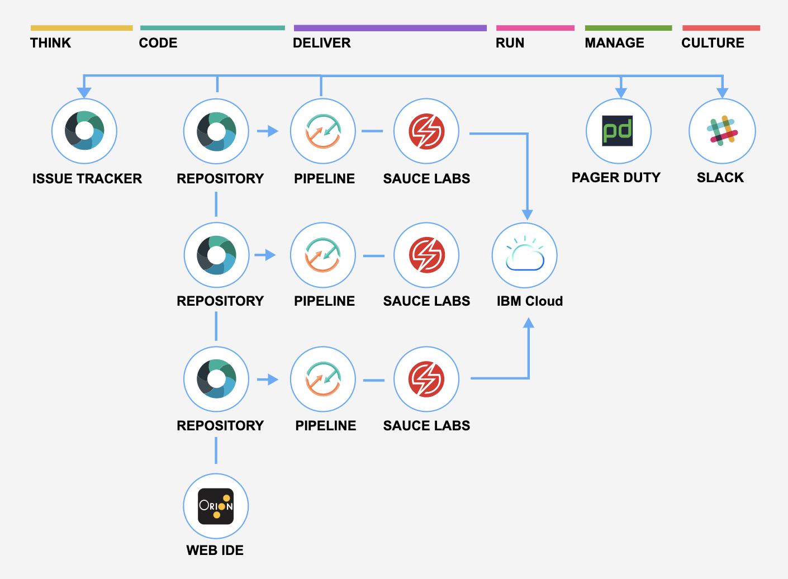

---

copyright:
  years: 2015, 2018
lastupdated: "2018-8-15"

---

{:shortdesc: .shortdesc}
{:new_window: target="_blank"}
{:codeblock: .codeblock}
{:pre: .pre}
{:screen: .screen}
{:tip: .tip}
{:download: .download}

# Getting started tutorial
{: #cd_getting_started}

Adopt a DevOps approach by using {{site.data.keyword.contdelivery_full}}, which includes open toolchains that automate the building and deployment of applications. You can get started by creating a simple deployment toolchain that supports development, deployment, and operations tasks. 
{: shortdesc}

##Prerequisites
{: #cd_prereqs}

Before you can create a continuous delivery toolchain from a template, you must create an instance of {{site.data.keyword.contdelivery_short}} by selecting it from the {{site.data.keyword.Bluemix_notm}} catalog. The toolchain integrates tools for planning, developing, deploying pipelines, and managing your applications. You can always add or remove tools from your toolchains. If you already have toolchains, you can [view existing toolchains](/docs/services/ContinuousDelivery/toolchains_working.html#viewing_a_toolchain){: new_window}. For more information about working with toolchains, see [Using toolchains](/docs/services/ContinuousDelivery/toolchains_using.html){: new_window}.

If you aleady have an instance of {{site.data.keyword.contdelivery_short}}, you can [create a toolchain ](https://console.bluemix.net/devops/create){: new_window} or [view existing toolchains](/docs/services/ContinuousDelivery/toolchains_working.html#viewing_a_toolchain){: new_window}.
{: tip}

##Step 1: Select a toolchain template
{: #select_a_toolchain_template}

1. On the **Create a Toolchain** page, click a [toolchain template ](https://console.bluemix.net/devops/create){: new_window}.
1. Review the diagram of the toolchain that you are about to create. The diagram shows each tool integration in its lifecycle phase in the toolchain.

 A few of the toolchain templates have multiple instances of a tool integration. For example, the Microservices toolchain template on {{site.data.keyword.Bluemix_notm}} Public contains three instances of GitHub and three instances of Delivery Pipeline, one for each of the three microservices.
 {: tip}

 The diagram in the following image is an example. When you create a toolchain, the diagram shows each tool integration that is part of the toolchain.
 
 
##Step 2: Create a toolchain 
{: #create_a_toolchain}
 
1. Review the default information for the toolchain settings:

 * The toolchain's name identifies it in {{site.data.keyword.Bluemix_notm}}. If you want to use a different name, change the toolchain's name.
 * The region to create the toolchain in. If you want to use a different region, select it from the list of available regions.
 * The resource group or organization to create the toolchain in. Click the link to switch between selecting resource groups and orgs. If you want to use a different resource group or org, select it from the list of available resource groups or orgs.
 
   Resource groups are available only in the US South region.
   {: tip}
 
1. In the Tool Integrations section, select each tool integration that you want to configure for your toolchain. A few of the tool integrations do not require configuration. For information about configuring the tool integrations, see [Configuring tool integrations](/docs/services/ContinuousDelivery/toolchains_integrations.html){: new_window}.
1. Click **Create**. Several steps run automatically to set up your toolchain. The tool integrations that are set up are different depending on which toolchain template you selected and whether you are using {{site.data.keyword.Bluemix_notm}} Public or {{site.data.keyword.Bluemix_notm}} Dedicated. For example, when you create a Microservices toolchain on {{site.data.keyword.Bluemix_notm}} Public, these steps are run:

 * The toolchain is created.
 * If you configured Delivery Pipeline, the pipelines are created and run.
 * If you configured Sauce Labs, the toolchain is set up to add Sauce Labs test jobs to the pipelines.
 * If you configured PagerDuty, the toolchain is set up to send alert notifications to the PagerDuty service that you specified.
 * If you configured Slack, the toolchain is set up to send notifications about deployment status to the Slack channel that you specified.
 * If you configured a source code tool integration such as GitHub, the sample GitHub repo is cloned into your GitHub account.

##Next steps
{: #next_steps}

Check out one of these tutorials on the [IBM&reg; Cloud Garage Method ](https://www.ibm.com/cloud/garage){:new_window}:

  * [Create and use your first toolchain by using the "Develop a Cloud Foundry app" toolchain ](https://www.ibm.com/cloud/garage/tutorials/introduce-develop-cloud-foundry-app-toolchain){:new_window}.

  * [Add a toolchain to an app ](https://www.ibm.com/cloud/garage/tutorials/add-a-toolchain-to-an-app?task=2){:new_window}.
