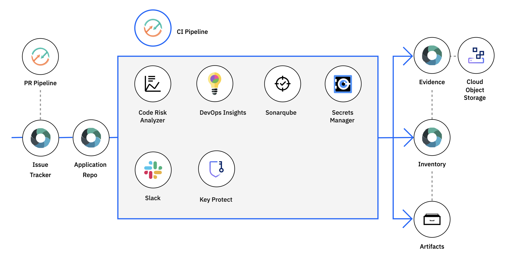

---

copyright:
  years: 2015, 2023
lastupdated: "2023-02-01"

keywords: IBM Cloud Continuous Delivery, getting started, tutorial, create a toolchain, tool integration, toolchain template, DevOps toolchains, Terraform

subcollection: ContinuousDelivery

---

{{site.data.keyword.attribute-definition-list}}

# Getting started with Continuous Delivery
{: #getting-started}
{: support}

Adopt a DevOps or DevSecOps approach by using {{site.data.keyword.contdelivery_full}}, which includes open toolchains that automate the building and deployment of applications. You can get started by creating a simple deployment toolchain that supports development, deployment, and operations tasks. 
{: shortdesc}

Although the {{site.data.keyword.contdelivery_short}} and Toolchain services are designated as [{{site.data.keyword.cloud_notm}} for Financial Services Validated](/docs/framework-financial-services), this designation does not apply to all of the tools that you can integrate into toolchains. For more information about which tool integrations and tools are designated as {{site.data.keyword.cloud_notm}} for Financial Services Validated when they are used with {{site.data.keyword.contdelivery_short}} toolchains, see [Understanding tool integrations with IBM Cloud for Financial Services](/docs/ContinuousDelivery?topic=ContinuousDelivery-integrations).
{: important}

If you already have an instance of {{site.data.keyword.contdelivery_short}}, you can [create a toolchain](https://cloud.ibm.com/devops/create){: external} or [view existing toolchains](https://cloud.ibm.com/devops/toolchains){: external}.
{: tip}

## Prerequisites
{: #cd_prereqs}

Before you can create a continuous delivery toolchain from a template, you must create an instance of {{site.data.keyword.contdelivery_short}} by selecting it from the {{site.data.keyword.cloud_notm}} catalog. The toolchain integrates tools for planning, developing, deploying pipelines, and managing your applications. You can always add or remove tools from your toolchains. If you already have toolchains, you can [view existing toolchains](/docs/ContinuousDelivery?topic=ContinuousDelivery-toolchains_getting_started#viewing_a_toolchain). For more information about working with toolchains, see [Using toolchains](/docs/ContinuousDelivery?topic=ContinuousDelivery-toolchains-using).

## Step 1: Select a toolchain template
{: #select_a_toolchain_template}

To quickly find the toolchain template that addresses your specific requirements, select the appropriate checkboxes to filter by deployment target, tools, and practices.
{: tip}

1. On the **Create a Toolchain** page, click a [toolchain template](https://cloud.ibm.com/devops/create){: external}.
1. Review the description of the toolchain that you are about to create. Depending on the type of template that you select, you can review this information on the Welcome page or from the About tab. Some templates provide a diagram that shows how each tool is connected to perform the template's objective.

   The diagram in the following image is an example. When you create a toolchain, the diagram shows each tool integration that is part of the toolchain.

   {: caption="Figure 1. Toolchain diagram" caption-side="bottom"}
 
## Step 2: Create a toolchain 
{: #create_a_toolchain}
 
1. Review the default information for the toolchain settings:

   * The toolchain's name identifies it in {{site.data.keyword.cloud_notm}}. If you want to use a different name, change the toolchain's name.
   * The region to create the toolchain in. If you want to use a different region, select it from the list of available regions.
   * The resource group to create the toolchain in. If you want to use a different resource group, select it from the list of available resource groups.
 
1. Enter the requested information in each section of the template, as required. For more information about configuring the tool integrations, see [Configuring tool integrations](/docs/ContinuousDelivery?topic=ContinuousDelivery-integrations).
1. Click **Create**. Several steps run automatically to set up your toolchain. The tool integrations that are set up are different depending on which toolchain template you selected. For example, when you create a DevSecOps Continuous Integration (CI) toolchain, these steps are run:

   * The toolchain is created.
   * Delivery Pipelines are created and configured based on the information that you provided.
   * Source control repositories (repos) are configured for your inventory, compliance evidence, issue tracking, and a sample application for you to get started.
   * {{site.data.keyword.DRA_short}} and SonarQube are configured to run automatically in your pipeline.
   * If you configured a secrets management tool such as {{site.data.keyword.keymanagementservicefull}}, {{site.data.keyword.secrets-manager_full}}, or HashiCorp Vault, secrets such as API keys are securely stored and retrieved by your pipeline.
   * If you configured Slack, the toolchain is set up to send notifications about deployment status to the Slack channel that you specified.

After the toolchain is created, a notification appears that provides a link to a tutorial to learn more about how to use the template.

## Next steps
{: #next_steps}

Check out the available [toolchain templates and tutorials](/docs/ContinuousDelivery?topic=ContinuousDelivery-cd_about).

### Terraform resources and data sources, Go SDKs, and HTTP APIs
{: #terraform}

You can use Terraform to create and manage toolchains, tool integrations, and Tekton delivery pipelines *as code*. For more information about using Terraform with {{site.data.keyword.contdelivery_short}}, see [Setting up Terraform for {{site.data.keyword.contdelivery_short}}](/docs/ContinuousDelivery?topic=ContinuousDelivery-terraform-setup) and try the Terraform toolchain template to [Develop a Kubernetes app with Helm toolchain](https://github.com/IBM-Cloud/terraform-provider-ibm/tree/master/examples/ibm-cd-toolchain-simple-helm){: external}.

You can use HTTP APIs and programming language SDKs to create, read, update, delete, and more against toolchains, tool integrations, and Tekton delivery pipelines. For more information about these APIs and SDKs, see [{{site.data.keyword.contdelivery_short}} Toolchain v2](https://cloud.ibm.com/apidocs/toolchain){: external} and [{{site.data.keyword.contdelivery_short}} Tekton Pipeline v2](https://cloud.ibm.com/apidocs/tekton-pipeline){: external} in the [API & SDK reference library](https://cloud.ibm.com/docs?tab=api-docs){: external}.
