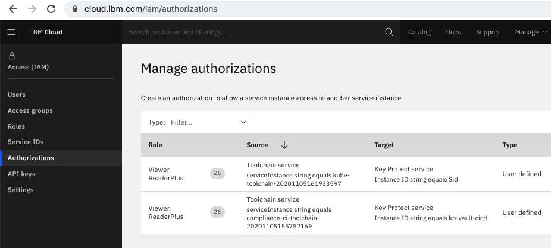

---

copyright:
  years: 2015, 2020
lastupdated: "2020-11-13"

keywords: tool integrations, IBM Cloud Public, IBM Cloud Dedicated, Key Protect

subcollection: ContinuousDelivery

---

{:shortdesc: .shortdesc}
{:external: target="_blank" .external}
{:codeblock: .codeblock}
{:pre: .pre}
{:screen: .screen}
{:tip: .tip}
{:note: .note}
{:important: .important}
{:deprecated: .deprecated}
{:download: .download}   

# Configuring {{site.data.keyword.keymanagementserviceshort}}
{: #keyprotect}

{{site.data.keyword.keymanagementservicefull}} helps you to securely store and apply secrets for apps across {{site.data.keyword.cloud_notm}} services.
{: shortdesc}

A *secret* is anything that provides access to sensitive information, such as an [API key](/docs/account?topic=account-manapikey). If you store secrets as standard keys in {{site.data.keyword.keymanagementserviceshort}}, you can use this tool integration to access secrets wherever they are needed in the toolchain workflow. To learn more about standard keys in {{site.data.keyword.keymanagementserviceshort}}, see [Key types](/docs/key-protect?topic=key-protect-envelope-encryption#key-types).

Before you configure a {{site.data.keyword.keymanagementserviceshort}} tool integration, make sure that you have an instance of the {{site.data.keyword.keymanagementserviceshort}} service provisioned in the region and resource group that you want to create the tool integration in. In certain scenarios, a {{site.data.keyword.keymanagementserviceshort}} service instance can be automatically generated. For example, if you are minting a new API key and choose to store it as a secret for later use, you automatically generate the {{site.data.keyword.keymanagementserviceshort}} service instance. For instructions to provision an instance of the {{site.data.keyword.keymanagementserviceshort}} service, see [Provisioning the service](/docs/services/key-protect?topic=key-protect-provision).
{: important}

Configure {{site.data.keyword.keymanagementserviceshort}} to securely manage secrets that are part of your toolchain:

1. If you are configuring this tool integration as you are creating the toolchain, in the Configurable Integrations section, click **{{site.data.keyword.keymanagementserviceshort}}**. If {{site.data.keyword.keymanagementserviceshort}} is defined as an optional tool integration, it is located under **More Tools**.
1. If you have a toolchain and are adding this tool integration to it, from the {{site.data.keyword.cloud_notm}} console, click the menu icon  and select **DevOps**. On the Toolchains page, click the toolchain to open its Overview page. Alternatively, on your app's Overview page, on the {{site.data.keyword.contdelivery_short}} card, click **View toolchain**. Then, click **Overview**.  

   a. Click **Add tool**.

   b. In the Tool Integrations section, click **{{site.data.keyword.keymanagementserviceshort}}**.

1. Specify a name for this instance of the {{site.data.keyword.keymanagementserviceshort}} tool integration to use in your toolchain. The name that you specify is used in the UI tools that select **{{site.data.keyword.keymanagementserviceshort}}** secrets. It is also used as part of the reference that resolves the secret values when the toolchain runs. This instance name is also displayed on the {{site.data.keyword.keymanagementserviceshort}} tool integration tile within the toolchain workspace.
1. Review the default values for **Region** and **Resource-Group** and update, if required.
1. Select the instance of the **{{site.data.keyword.keymanagementserviceshort}}** service that you want to use.
1. Click **Create Integration**.
1. From your toolchain, click **{{site.data.keyword.keymanagementserviceshort}}**.

## Applying secrets
{: #apply_secrets}

After your {{site.data.keyword.keymanagementserviceshort}} tool integration is configured, you can use it to apply secrets anywhere that they are needed by the toolchain. The following example applies a secret that is stored in {{site.data.keyword.keymanagementserviceshort}} to an {{site.data.keyword.cloud_notm}} API key that is required by the [Pipeline tool integration](https://cloud.ibm.com/docs/ContinuousDelivery?topic=ContinuousDelivery-deliverypipeline). You can follow the same steps to apply secrets to any of the {{site.data.keyword.contdelivery_short}} tool integrations that require secret values.

You must save third-party secrets, such as a Slack webhook or an Artifactory API token, in {{site.data.keyword.keymanagementserviceshort}} *before* you create a new toolchain. You can mint and store only IBM-managed secrets such as {{site.data.keyword.cloud_notm}} API keys in Key Protect while you work with your toolchain.
{: important}

1. Click the key icon to retrieve secrets from secure stores such as {{site.data.keyword.keymanagementserviceshort}} for the {{site.data.keyword.cloud_notm}} API key.

1. In the **Provider** field, specify the provider and the name of the {{site.data.keyword.keymanagementserviceshort}} tool integration that you use to manage your toolchain secrets. For example, to use the Key Protect tool integration, select `Key Project: ibm-keyprotect-secrets-1`. You can use other providers to manage your toolchain secrets, such as [Hashicorp Vault](/docs/ContinuousDelivery?topic=ContinuousDelivery-hashicorpvault).

1. Select a secret name and click **OK** to apply the stored secret to the field that is associated with it.

{: caption="Figure 1. Secret reference to a vault" caption-side="bottom"}

The name of the secret that you select appears in capsule form. You cannot edit the secret name inline, but you can click  to delete the name. You can also replace the secret name by using the Secrets Picker control again. If you manually type or paste a secret name into the Secrets field, it is displayed in a different format:

{: caption="Figure 2. Secret value" caption-side="bottom"}

The format that the secret is displayed in indicates whether the value references a secret that is stored in a backend vault or is a secret that is stored in your toolchain. By using references to secrets that are managed by secret providers such as  {{site.data.keyword.keymanagementserviceshort}}, your secret values are centralized and stored securely in a single location. This approach resolves secrets sprawl and proliferation, and means that you can update secrets without updating your toolchain. When you use secret references, the actual secret value is resolved when the toolchain runs by dynamically retrieving it from {{site.data.keyword.keymanagementserviceshort}}. This approach is useful when you must rotate the value of your toolchain secrets periodically.

## Adding a {{site.data.keyword.keymanagementserviceshort}} tool integration to your toolchain template
{: #add_toolchain_template}

You can add a {{site.data.keyword.keymanagementserviceshort}} tool integration to your toolchain template by adding a service definition to the toolchain.yml file in your template repo. This file is the design blueprint for your toolchain and includes all of the tool integrations that are available when you create a toolchain instance based on that template. To customize an existing toolchain template to include a {{site.data.keyword.keymanagementserviceshort}} tool integration, insert a YAML definition. 

```yaml
  kp-tool:
    service_id: keyprotect
    parameters:
      name: kp-compliance-secrets
      region: us-south
      resource-group: default
      instance-name: ffs-secrets
```

For more information about customizing toolchain templates, see [Create a template for a custom toolchain](https://www.ibm.com/cloud/architecture/tutorials/create-a-template-for-a-custom-toolchain){: external}.

In certain scenarios, you can add a {{site.data.keyword.keymanagementserviceshort}} tool integration dynamically while creating a toolchain. For example, if you click **New** to mint a new API key, you can select the **Save this key in a secrets store for reuse** checkbox to save the API key in a {{site.data.keyword.keymanagementserviceshort}} instance to use it again later. If you do not already have a {{site.data.keyword.keymanagementserviceshort}} instance, a new instance is created for you.
{: tip}

## Authorizing your toolchain to access secrets
{: #authorize_secrets}

References to secrets that are stored in {{site.data.keyword.keymanagementserviceshort}} are dynamically resolved when the toolchain runs. To access the required secrets, you must authorize your toolchain to access the {{site.data.keyword.keymanagementserviceshort}} instance. If you create a toolchain that has a valid {{site.data.keyword.keymanagementserviceshort}} tool integration, or add this tool integration to an existing toolchain, a request is automatically made to create the necessary authorization.

To view your authorizations in {{site.data.keyword.cloud_notm}}, complete the following steps:

1. From the {{site.data.keyword.cloud_notm}} console, click **Manage** > **Access (IAM)**.
1. Click **Authorizations**.

You can also access your authorizations on the [Manage authorizations](https://cloud.ibm.com/iam/authorizations){: external} page. 
{: tip}

{: caption="Figure 3. Toolchain authorizations for Key Protect" caption-side="bottom"}

You can create the authorization manually, if required. To successfully resolve the secret references, your toolchain instance must have both `Viewer` and `ReaderPlus` access to the correct {{site.data.keyword.keymanagementserviceshort}} service instance.

## Learn more about {{site.data.keyword.keymanagementserviceshort}}
{: #keyprotect_learn_more}

To learn more about {{site.data.keyword.keymanagementserviceshort}}, see [Service overview](/docs/services/key-protect?topic=key-protect-about).
