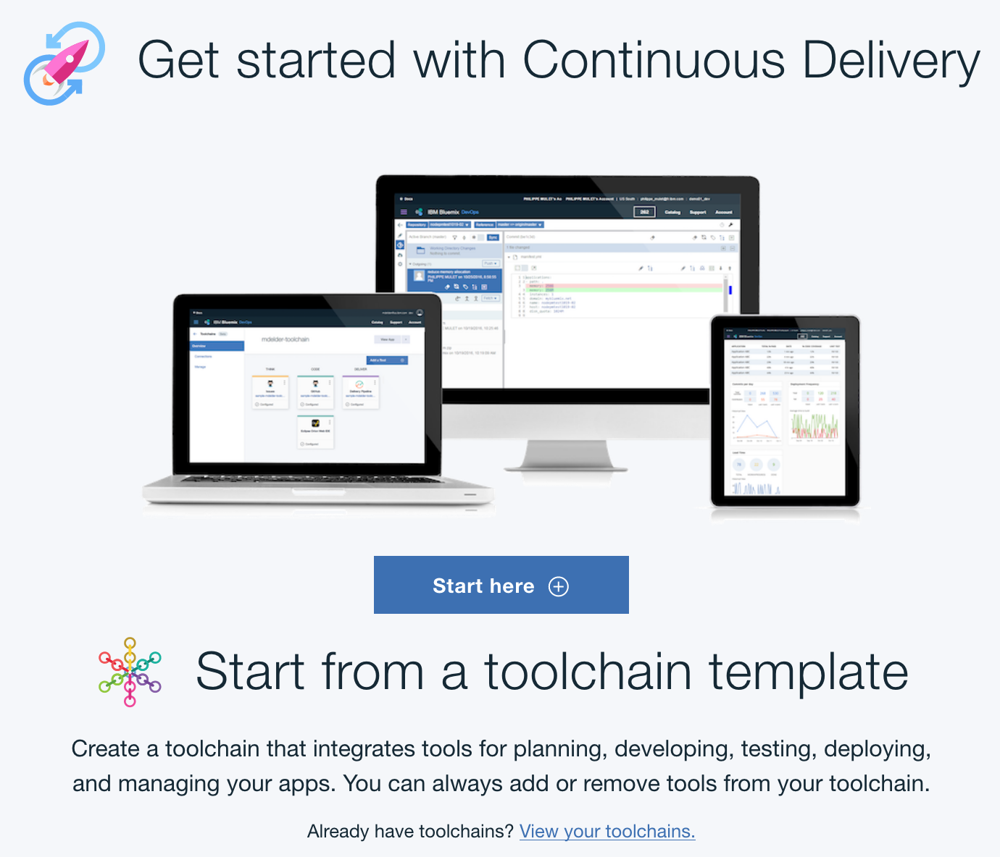

---

copyright:
  years: 2015, 2018
lastupdated: "2018-1-15"

---

{:shortdesc: .shortdesc}
{:new_window: target="_blank"}

# Einführung in Continuous Delivery
{: #cd_getting_started}

Nutzen Sie DevOps-Verfahren durch Verwendung von {{site.data.keyword.contdelivery_full}}, das offene Toolchains zur Automatisierung der Erstellung und Bereitstellung von Anwendungen enthält. Beginnen Sie mit der Erstellung einer einfachen Toolchain für die Bereitstellung, die Entwicklungs-, Bereitstellungs- und Operationstasks unterstützt.
{: shortdesc}

Nachdem Sie eine Instanz von {{site.data.keyword.contdelivery_short}} erstellt haben, indem Sie das Element im {{site.data.keyword.Bluemix_notm}}-Katalog ausgewählt haben, können Sie über eine Vorlage eine Continuous Delivery-Toolchain erstellen oder mit vorhandenen Toolchains arbeiten.
 

* Um über eine Vorlage eine Continuous Delivery-Toolchain zu erstellen und zu konfigurieren, klicken Sie auf **[Hier starten](#starting_from_a_toolchain_template)**. Die Toolchain integriert Tools für Planung, Entwicklung und Bereitstellung von Pipelines sowie für die Verwaltung Ihrer Anwendungen. Tools können jederzeit in eine Toolchain eingefügt oder daraus entfernt werden.
* Wenn Sie bereits über Toolchains verfügen, klicken Sie im Abschnitt 'Mit einer Toolchain-Vorlage beginnen' auf **Zeigen Sie Ihre Toolchains an**. Weitere Informationen zum Arbeiten mit Toolchains enthält [Toolchains verwenden](/docs/services/ContinuousDelivery/toolchains_using.html){: new_window}.

##Übersicht über {{site.data.keyword.contdelivery_short}}
{: #cd_overview}

Mit {{site.data.keyword.contdelivery_short}} können Anwendungen unter Verwendung bewährter DevOps-Verfahren und branchenführender Tools erstellt, getestet und bereitgestellt werden.
{:shortdesc}

Der {{site.data.keyword.contdelivery_short}}-Service unterstützt Ihre DevOps-Workflows:

 * Sie können integrierte offene DevOps-[Toolchains](/docs/services/ContinuousDelivery/toolchains_about.html){: new_window} erstellen, um Toolintegrationen zu aktivieren, die Ihre Entwicklungs-, Bereitstellungs- und Betriebstasks unterstützen.

  Eine Toolchain ist eine integrierte Gruppe von Tools für das gemeinsame Entwickeln, Erstellen, Bereitstellen, Testen und Verwalten von Anwendungen. Diese Tools haben darüber hinaus die Aufgabe, die Wiederholbarkeit von Operationen sicherzustellen und die Verwaltung von Operationen zu vereinfachen. Toolchains können Open-Source-Tools, {{site.data.keyword.Bluemix_notm}}-Services wie [{{site.data.keyword.DRA_full}}](/docs/services/ContinuousDelivery/di_working.html){: new_window} und Tools von anderen Anbietern wie GitHub, PagerDuty und Slack enthalten. 
  
  **Hinweis**: {{site.data.keyword.DRA_short}} ist nur in der Region 'Vereinigte Staaten (Süden)' verfügbar.

 * Die Verwendung automatisierter [Pipelines](/docs/services/ContinuousDelivery/pipeline_about.html){: new_window} ermöglicht die fortlaufende Bereitstellung.

  Sie können beispielsweise Builds, Komponententests und Bereitstellungen automatisieren. Builds, Tests und Bereitstellungen sind reproduzierbar und erfordern nur geringe manuelle Eingriffen. Seien Sie jederzeit bereit für eine Produktionsfreigabe.

 * Mithilfe der [webbasierten IDE](/docs/services/ContinuousDelivery/web_ide.html){: new_window} kann Code überall bearbeitet und mit Push-Operation übertragen werden.

  In GitHub können Quellcodeverwaltungstasks erstellt, bearbeitet, ausgeführt und korrigiert werden. Sie können nahtlos von der Codebearbeitung zur Bereitstellung in der Produktion übergehen. 
  
 * Arbeiten Sie mit Ihrem Team zusammen und verwalten Sie Ihren Quellcode mit einem [Git-Repository- und Problemtracker](/docs/services/ContinuousDelivery/git_working.html#git_working){: new_window}, der von IBM gehostet wird und auf GitLab Community Edition basiert.

  Verwalten Sie Git-Repositorys mittels differenzierter Zugriffssteuerungsmechanismen, durch die der Code geschützt bleibt. Überprüfen Sie den Code und verbessern Sie die Zusammenarbeit durch Zusammenführungsanforderungen (Merge). Verfolgen Sie Probleme und teilen Sie Ihre Ideen mittels Problemtracker mit anderen. Dokumentieren Sie Projekte auf dem Wiki-System.

##Mit einer Toolchain-Vorlage beginnen
{: #starting_from_a_toolchain_template}

Gehen Sie zum Erstellen und Konfigurieren einer Continuous Delivery-Toolchain anhand einer [Vorlage ](https://console.bluemix.net/devops/create){: new_window} wie folgt vor:

1. Klicken Sie auf der Seite **Toolchain erstellen** auf eine Toolchain-Vorlage.
1. Überprüfen Sie das Diagramm der Toolchain, die Sie gerade erstellen. In dem Diagramm wird jede Toolintegration in ihrer aktuellen Lebenszyklusphase in der Toolchain angezeigt.

 **Tipp**: Für einige der Toolchain-Vorlagen sind mehrere Instanzen einer Toolintegration vorhanden. Die Vorlage für die Microservice-Toolchain unter {{site.data.keyword.Bluemix_notm}} Public enthält beispielsweise drei Instanzen von GitHub und drei Instanzen von Delivery Pipeline - jeweils eine Instanz für jeden der drei Microservices.

 Das Diagramm in der folgenden Abbildung ist ein Beispiel. Wenn Sie eine Toolchain erstellen, zeigt das Diagramm jede Toolintegration an, die Teil der Toolchain ist.
 
1. Überprüfen Sie die Standardinformationen für die Toolchain-Einstellungen:

 * Der Name der Toolchain macht sie in {{site.data.keyword.Bluemix_notm}} identifizierbar. Wenn Sie einen anderen Namen verwenden möchten, ändern Sie den Namen der Toolchain.
 * Die Region, in der die Toolchain erstellt wird. Wenn Sie eine andere Region verwenden möchten, wählen Sie eine Region aus der Liste verfügbarer Regionen aus.
 * Die Organisation, in der die Toolchain erstellt wird. Wenn Sie eine andere Organisation verwenden möchten, wählen Sie eine Organisation aus der Liste verfügbarer Organisationen aus.
 
1. Wählen Sie im Abschnitt mit den Toolintegrationen jede Toolintegration aus, die Sie für Ihre Toolchain konfigurieren möchten. Einige Toolintegrationen erfordern keine Konfiguration. Informationen zum Konfigurieren der Toolintegrationen finden Sie unter [Toolintegrationen konfigurieren](/docs/services/ContinuousDelivery/toolchains_integrations.html){: new_window}.
1. Klicken Sie auf **Erstellen**. Zum Einrichten Ihrer Toolchain werden mehrere verschiedene Schritte automatisch ausgeführt. Die Toolintegrationen, die eingerichtet werden, unterscheiden sich voneinander, je nachdem, welche Toolchain-Vorlage Sie ausgewählt haben und ob Sie {{site.data.keyword.Bluemix_notm}} Public oder {{site.data.keyword.Bluemix_notm}} Dedicated verwenden. Wenn Sie eine Microservice-Toolchain unter {{site.data.keyword.Bluemix_notm}} Public erstellen, werden zum Beispiel die folgenden Schritte ausgeführt:

 * Die Toolchain wird erstellt.
 * Wenn Sie Delivery Pipeline konfiguriert haben, werden die Pipelines erstellt und ausgeführt.
 * Wenn Sie Sauce Labs konfiguriert haben, wird die Toolchain so eingerichtet, dass Sauce Labs-Testjobs zu den Pipelines hinzugefügt werden.
 * Wenn Sie PagerDuty konfiguriert haben, wird die Toolchain so eingerichtet, dass sie Alertbenachrichtigungen an den von Ihnen angegebenen PagerDuty-Service sendet.
 * Wenn Sie Slack konfiguriert haben, wird die Toolchain so konfiguriert, dass sie Benachrichtigungen zum Bereitstellungsstatus an den von Ihnen angegebenen Kanal sendet.
 * Wenn Sie eine Quellcode-Toolintegration wie GitHub konfiguriert haben, wird das GitHub-Beispielrepository in Ihr GitHub-Konto geklont.
