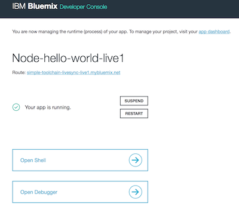

---


copyright:
  years: 2015，2018
lastupdated: "2018-8-2"

---

{:shortdesc: .shortdesc}
{:new_window: target="_blank"}
{:codeblock: .codeblock}
{:pre: .pre}
{:screen: .screen}
{:tip: .tip}
{:download: .download}

# {{site.data.keyword.Bluemix_notm}} Live Sync
{: #live-sync}


Si está creando una aplicación Node.js, puede utilizar {{site.data.keyword.Bluemix}} Live Sync para actualizar rápidamente la instancia de aplicación en {{site.data.keyword.Bluemix_notm}} y desarrollar sin redesplegar manualmente.   
{: shortdesc}

Cuando realice un cambio, puede verlo de inmediato en la aplicación de {{site.data.keyword.Bluemix_notm}} en ejecución. {{site.data.keyword.Bluemix_notm}} Live Sync funciona
<!--from both the command line and -->
en Eclipse Orion Web IDE (Web IDE). Puede depurar aplicaciones que están escritas en Node.js utilizando {{site.data.keyword.Bluemix_notm}} Live Sync.  

{{site.data.keyword.Bluemix_notm}} Live Sync consta de dos características.
<!--three -->

<!--
**Desktop Sync**  

You can synchronize any desktop directory tree with a cloud-based project workspace similar to the way Dropbox works. The Web IDE directly edits the same cloud-based workspace, so both stay in sync. Desktop Sync works for any kind of application. To use Desktop Sync, you need to download and install the BL command line interface.  
-->

**Edición en directo**

Puede editar una aplicación Node.js que se ejecuta en {{site.data.keyword.Bluemix_notm}} y probarla en el navegador inmediatamente. Los cambios que realice en Web IDE se propagarán inmediatamente al sistema de archivos de la aplicación.  

**Depurar**  

Mientras una aplicación Node.js está en la modalidad de edición en directo puede aplicarle un shell y depurarla. Puede editar código dinámicamente, insertar puntos de interrupción, recorrer el código, reiniciar el tiempo de ejecución, entre otras características, utilizando el depurador del inspector de nodos.  


##Edición en directo
{: #live-edit}

Si está creando una aplicación Node.js que se ejecuta en {{site.data.keyword.Bluemix_notm}}, la característica Edición en directo de {{site.data.keyword.Bluemix_notm}} Live Sync puede actualizar rápidamente la instancia de aplicación. La característica Edición en directo solo está disponible en Web IDE. La edición en directo le permite desarrollar como lo haría en el escritorio sin tener que volver a desplegar.

La característica Edición en directo solo se admite en las aplicaciones Node.js.

En Eclipse Orion Web IDE (Web IDE), en la barra de ejecución, pulse **Edición en directo**.


Edición en directo le permite obtener una vista previa rápida de los cambios en las aplicaciones Node.js que se ejecutan en {{site.data.keyword.Bluemix_notm}}. Al actualizar
el código con la característica Edición en directo activada, puede renovar la ventana del navegador de su aplicación web
para ver dichos cambios reflejados pocos segundos después de efectuarlos.

Para ver un tutorial sobre cómo utilizar la característica Edición en directo de {{site.data.keyword.Bluemix_notm}} Live Sync, consulte [Utilice {{site.data.keyword.Bluemix_notm}} Live Sync para desarrollar, depurar y desplegar la app ](https://www.ibm.com/cloud/garage/tutorials/use-live-sync-to-develop-debug-and-deploy-your-app){:new_window}.

Cuando modifique los archivos en Web IDE, se redesplegarán automáticamente a su instancia de aplicación en {{site.data.keyword.Bluemix_notm}}. Si tiene que reiniciar la aplicación Node, pulse el botón **Reiniciar** de la barra de ejecución.

Para obtener una experiencia más coherente al utilizar la característica de Live Edit de {{site.data.keyword.Bluemix_notm}} Live Sync, se necesitan 256 MB de memoria adicional y se añade.
{: tip}

## {{site.data.keyword.Bluemix_notm}} Live Debug
{: #live-debug}

{{site.data.keyword.Bluemix_notm}} Live Sync Debug utiliza
[Inspector de nodos ](https://github.com/node-inspector/node-inspector){:new_window}
para proporcionar características de depuración. Debe utilizar la versión 4 de Nodo para que el depurador esté disponible desde versiones posteriores de Node.js que no incluyan el Inspector de nodos.

Puede acceder a {{site.data.keyword.Bluemix_notm}} Live Debug cuando esté habilitado {{site.data.keyword.Bluemix_notm}} Live Edit para la app Node.js.  

Con la característica debug, puede editar código, insertar puntos de interrupción, recorrer el código,
reiniciar el tiempo de ejecución de forma dinámica, entre otras características, mientras la app está en servicio en {{site.data.keyword.Bluemix_notm}}. Puede desarrollar la app de forma incremental con agilidad mientras elige entre una larga lista de servicios de {{site.data.keyword.Bluemix_notm}}.

{{site.data.keyword.Bluemix_notm}} Live Debug incluye las siguientes características:

* Control del tiempo de ejecución de la aplicación
* Depuración mediante [Inspector de nodos ](https://github.com/node-inspector/node-inspector){:new_window}
* Acceso a shell

### Control del tiempo de ejecución de la aplicación {: #app-runtime}

Con el control del tiempo de ejecución de la aplicación, puede utilizar Debug
para inspeccionar el estado de la app en el momento inicial. Esta función resulta útil para solucionar los problemas de una app que falla al iniciarse.

Mientras esté desarrollando la app, puede elegir entre las siguientes acciones:

* Realizar un reinicio rápido de la app
* Suspender la app antes de que se ejecute ningún código de la app

Después de iniciar la sesión, se abrirá la página {{site.data.keyword.Bluemix_notm}} Live Debug.




### Debug {: #debug}

**Restricción:** Se necesita Google Chrome y Node 4.

Debug incluye las siguientes funciones:  
* Establecer puntos de interrupción en el código de la app para detener la ejecución en una línea específica.
  Los puntos de interrupción no están soportados en el programa principal, pero están soportados en puntos de entrada.
  {: tip}
* Editar las condiciones de los puntos de interrupción cuando se cumplan ciertos criterios.
* Inspeccionar el estado de las variables locales y los campos.
* Visualizar la salida de la depuración de manera inmediata desde las llamadas `console.log()`. Esta opción es más rápida que la supervisión de registros cf.
* Utilizar el editor de código fuente incorporado para introducir cambios inmediatos (aunque temporales) al código de la app en ejecución.

### Shell {: #shell}

Esta herramienta le da acceso de shell al contenedor en el que se ejecuta la app. Con el uso de este terminal puede ejecutar, de manera remota, mandatos de diagnóstico de shell para administrar la app. Todas las versiones de Node.js dan soporte a la característica Shell.

Supervise el uso de la memoria y de la CPU en la instancia que utiliza mandatos estándares de Linux, como por ejemplo **top**, **ps** y **kill**.

### Configuración de una app para habilitar {{site.data.keyword.Bluemix_notm}} Live
Debug {: #configure_app_debug}

1. {{site.data.keyword.Bluemix_notm}} Live Debugger utiliza Node Inspector. Debe utilizar la versión de Nodo 4. También necesita permitir el paquete de compilación para detectar el mandato de inicio de la app. El mandato de inicio debe detectarlo automáticamente el paquete de compilación, no definido en el archivo manifest.yml.

   Un archivo `package.json` que da soporte a {{site.data.keyword.Bluemix_notm}} Live Debug es:

  ```
  {
      "scripts": {
         "start": "node app.js"
      },
      "engines": {
         "node": "4"
      }
  }
  ```

2. Aumente la memoria.  

    a. En el archivo `manifest.yml` de la app, añada 128 MB o más al valor especificado para el atributo memory.

Una vez instalado {{site.data.keyword.Bluemix_notm}} Live
Debug, puede utilizar las herramientas de depuración.

Envíe la app y luego vaya a `https://_app-host.mybluemix.net_/bluemix-debug/manage` para acceder a la interfaz de usuario de depuración de {{site.data.keyword.Bluemix_notm}}. Cuando se le solicite que se autentique, especifique su nombre de usuario y contraseña del ID de IBM o un código de acceso puntual.    

El depurador puede tardar aproximadamente un minuto en inicializarse.
{: tip}

### Restauración de configuraciones de app e inhabilitación de {{site.data.keyword.Bluemix_notm}} Live Debug {: #restore_live_debug}

1. Restaurar la versión original de la app Node.js, del mandato de inicio del valor de memoria.

2. Envíe la app por push.

### Para obtener más información

* Consulte [Herramientas de Eclipse para {{site.data.keyword.Bluemix_notm}} ](https://www.bluemix.net/docs/manageapps/eclipsetools/eclipsetools.html){:new_window}
