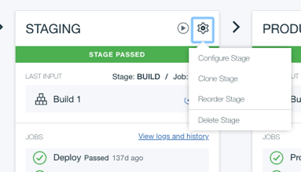

---

copyright:
  years: 2018, 2019
lastupdated: "2019-06-20"

keywords: IBM Cloud account, personal data, IBM Cloud Continuous Delivery

subcollection: ContinuousDelivery

---

{:shortdesc: .shortdesc}
{:new_window: target="_blank"}
{:external: target="_blank" .external}
{:codeblock: .codeblock}
{:pre: .pre}
{:screen: .screen}
{:tip: .tip}
{:note: .note}
{:important: .important}
{:download: .download}

# Gestión de datos personales en Continuous Delivery
{: #cd_personal_data}

Puede modificar, exportar o suprimir datos personales de {{site.data.keyword.contdelivery_full}}.
{: shortdesc}

Los datos personales son cualquier información relacionada con una persona física o su identificación. Por ejemplo, los datos personales pueden ser un nombre, una dirección de correo electrónico, un avatar, una señal o cualquier número de identificadores que se utilicen con {{site.data.keyword.contdelivery_short}}. Los siguientes componentes de {{site.data.keyword.contdelivery_short}} contienen datos personales:

 * Eclipse Orion {{site.data.keyword.webide}}
 * {{site.data.keyword.gitrepos}}
 * Conductos de {{site.data.keyword.contdelivery_short}}
 * Cadenas de herramientas e integraciones de herramientas
 * [GitHub Enterprise on IBM Cloud](/docs/services/ghededicated?topic=ghededicated-ghe_personal_data)
 * [{{site.data.keyword.DRA_full}}](/docs/services/DevOpsInsights?topic=DevOpsInsights-deleting_data)
 
IBM no gestiona los datos del servicio {{site.data.keyword.contdelivery_short}}. Antes de dejar el servicio {{site.data.keyword.contdelivery_short}} que se aloja en {{site.data.keyword.Bluemix_notm}} Público, debe suprimir sus propios datos.
{: important}

{{site.data.keyword.contdelivery_short}} proporciona los permisos adecuados para gestionar datos dentro de un grupo de recursos o una organización de Cloud Foundry. La empresa puede tener políticas que limitan estos permisos. Si no tiene los permisos adecuados, póngase en contacto con el administrador de la cuenta de {{site.data.keyword.Bluemix_notm}}.

Para gestionar los datos personales, debe conocer las cuentas de IBM Cloud, cómo se utilizan estas cuentas y sus derechos de acceso asociados.
 
## Cuentas y derechos de acceso
{: #accounts_access_rights}

Para trabajar en IBM Cloud, debe iniciar sesión con un nombre de usuario y una contraseña. Cuando inicia la sesión, IBM Cloud asocia al menos una cuenta de IBM Cloud con las credenciales de usuario. Cuando crea recursos como organizaciones de Cloud Foundry, grupos de recursos, cadenas de herramientas y objetos de {{site.data.keyword.contdelivery_short}}, estos se asocian con una cuenta de IBM Cloud.

La estructura de inicio de sesión de IBM Cloud le proporciona la opción de trabajar en cuentas diferentes. Mediante la interfaz de usuario de IBM Cloud, puede cambiar de una cuenta a otra. Cuando inicia la sesión, cualquiera de los siguientes tipos de cuenta puede asociarse con sus credenciales de usuario: 

 * Cuenta personal
 * Cuenta corporativa
 * Cuenta corporativa individual

### Cuentas personales

Normalmente, cada usuario tiene su propia cuenta, que es su cuenta personal. Puede identificar fácilmente su cuenta personal porque normalmente contiene su nombre, por ejemplo, *Cuenta de John Smith*. 

Debe tener todos los derechos sobre todos los objetos que se crean en su cuenta personal. Puede invitar a otros usuarios a unirse a su cuenta, asignarles derechos sobre los objetos que cree y asignarles derechos para crear objetos en su cuenta. Esto significa que los datos personales de otros usuarios pueden estar en su cuenta, y sus datos personales pueden estar en las cuentas de otros usuarios. 

Si tiene permiso para crear un objeto en una cuenta, también tiene derecho para modificarlo y suprimirlo, independientemente de la cuenta en la que esté almacenado el objeto. Cuando dos usuarios colaboran, suelen compartir una cuenta personal.

### Cuentas corporativas

Las cuentas corporativas las configura la empresa. Normalmente, se le añade automáticamente a la cuenta, en lugar de invitarle. Las cuentas corporativas proporcionan a los usuarios un lugar para trabajar, comunicarse y compartir recursos y cargos; sin embargo, se trata sólo de una convención. Las cuentas corporativas no difieren apenas de las cuentas personales. Los objetos que se crean en una cuenta corporativa están asociados con la cuenta, y se pueden invitar usuarios a la cuenta.

Los equipos de personas que trabajan para una empresa suelen colaborar mediante una cuenta corporativa.

### Cuentas corporativas individuales

Cuando trabaja para una empresa, puede que, legalmente, el trabajo incluido en su cuenta sea propiedad de la empresa. Muchos usuarios que trabajan para una empresa tienen una cuenta individual corporativa. Si inicia la sesión en su cuenta utilizando unas credenciales que contienen el nombre de su empresa y también lo que parece ser una cuenta personal, puede que el trabajo incluido en su cuenta pertenezca a la empresa.

Las cuentas individuales corporativas no son diferentes a las demás cuentas. Puede invitar a usuarios a una cuenta corporativa individual. Los objetos que se crean en una cuenta corporativa individual son propiedad de la cuenta.

Si trabaja en una empresa que posee su trabajo, una cuenta personal que normalmente contiene su nombre se considera una cuenta corporativa individual. 

## Modificación, exportación y supresión de datos personales
{: #managing_personal_data}

Independientemente del tipo de cuenta de IBM Cloud que se utiliza, si tiene derechos sobre los objetos de la cuenta, puede modificarlos, exportarlos y suprimirlos. Antes de realizar cambios, coordínese con otros usuarios para asegurarse de que no modifica o suprime datos de forma innecesaria.

Antes de suprimir datos de una cuenta, determine si se trata de una cuenta personal o de una cuenta corporativa individual.

### Cuenta personal

Si tiene una cuenta personal, puede hacer cambios y suprimir los datos. Si comparte la cuenta con otro usuario, es el propietario de los datos, pero es posible que desee ponerse en contacto con él en referencia al trabajo compartido. 

Si no puede iniciar sesión en su cuenta de IBM Cloud, [póngase en contacto con el soporte de IBM](https://www.ibm.com/cloud/support){: external}.
 
### Cuenta corporativa individual

Si tiene una cuenta corporativa individual, debe coordinar los cambios con la empresa y con los demás miembros del equipo. Suprima los datos personales tanto si están almacenados en una cuenta corporativa como si lo están en una cuenta corporativa individual. No suprima el trabajo que ha compartido con otros usuarios.

Antes de empezar a gestionar los datos personales para los componentes de {{site.data.keyword.contdelivery_short}}, asegúrese de que está trabajando en su cuenta de IBM Cloud. Para ver la cuenta de IBM Cloud en la que está trabajando actualmente, pulse su avatar de perfil en la barra de menús. 

Si no puede iniciar sesión en la cuenta de IBM Cloud, póngase en contacto con su empresa y colabore con ellos para suprimir sus datos personales.

Si desea suprimir todos los datos personales de {{site.data.keyword.contdelivery_short}}, es importante el orden en el que suprimen los datos. Primero, suprima todos sus espacios de trabajo de {{site.data.keyword.webide}}. A continuación, suprima sus datos de {{site.data.keyword.gitrepos}}, y luego su cuenta de {{site.data.keyword.gitrepos}}. Finalmente, suprima los conductos de entrega, las integraciones de herramientas y las cadenas de herramientas.
{: tip}

## Exportación y supresión de datos de Web IDE
{: #managing_web_ide_data}

{{site.data.keyword.webide}} proporciona un espacio de trabajo personal en la nube. Puede utilizar {{site.data.keyword.webide}} para clonar repositorios Git y editar archivos. Usted es el propietario de su espacio de trabajo de {{site.data.keyword.webide}}; no se comparte con ninguna otra cuenta.

Antes de suprimir los datos de {{site.data.keyword.webide}}, quizá desee exportar su trabajo. Después de suprimir los espacios de trabajo, se eliminan de {{site.data.keyword.contdelivery_short}} y todos los archivos se suprimen.
{: important}

### Exportación de un espacio de trabajo de Web IDE

Para exportar un espacio de trabajo de {{site.data.keyword.webide}}:

1. Seleccione **Archivo > Exportar > Zip**.
1. Repita este paso en cada espacio de trabajo que desee exportar.

### Supresión de sus espacios de trabajo de Web IDE

Para suprimir sus espacios de trabajo de {{site.data.keyword.webide}}, incluidos todos los datos personales:

1. Desde cualquier cadena de herramientas, navegue a {{site.data.keyword.webide}}.
1. Pulse el icono **Valores**  en la barra lateral de navegación de la izquierda.
1. Pulse **PERFIL DE USUARIO**.
1. Pulse **Suprimir** para eliminar todos los datos de {{site.data.keyword.webide}}.

{{site.data.keyword.webide}} utiliza un mecanismo de inicio de sesión único. La primera vez que accede a esta integración de herramientas, se crea una cuenta de {{site.data.keyword.webide}} correspondiente, pero oculta, de la cuenta de IBM Cloud. Después de suprimir todos los espacios de trabajo, no acceda a {{site.data.keyword.webide}}. Si accede a {{site.data.keyword.webide}} de nuevo, se crea automáticamente una nueva cuenta que debe suprimir.
{: important}

## Modificación, exportación y supresión de datos de Git Repos and Issue Tracking
{: #managing_grit_data}

{{site.data.keyword.gitrepos}} proporciona un servicio Git alojado en la nube. Se utiliza un mecanismo de inicio de sesión único para asociar su cuenta de IBM Cloud con una cuenta de Git. Se crean un nombre completo y un nombre abreviado para usted en la cuenta de Git. Otros usuarios pueden utilizar su nombre abreviado para referirse a usted en un comentario dentro de un problema de Git. Puede personalizar su cuenta de Git y añadir datos personales, como una descripción de sí mismo o una imagen. 

{{site.data.keyword.gitrepos}} proporciona un entorno de codificación social potente pero complejo de codificación en el que los usuarios contribuyen a diferentes proyectos y los objetos se comparten. En este entorno, puede resultar difícil localizar y suprimir sus datos personales.

Los perfiles y valores de cuenta, los proyectos personales, los grupos y los fragmentos de código están asociados con su cuenta de Git. Si suprime la cuenta de Git, estos objetos se suprimen. Para suprimir datos personales en otro proyecto, vaya al proyecto y luego modifíquelo para eliminar sus datos personales, o suprima todo el proyecto. Coordínese con los demás miembros del equipo antes de suprimir proyectos compartidos.

Antes de suprimir la cuenta de Git, suprima sus datos personales de otros proyectos. Después de suprimir la cuenta de Git, podría ser difícil o imposible encontrar todos los proyectos a los que ha contribuido.
{: tip}

### Proyectos personales y compartidos

Puede invitar a otros usuarios a colaborar en proyectos. Los proyectos de Git que crea dentro de la cuenta se denominan proyectos personales. También puede crear grupos de Git en los que los proyectos pueden ser propiedad de varios propietarios de Git. Puede crear nuevos proyectos para el grupo o transferir la propiedad de los proyectos personales al grupo. Un grupo de Git se suele utilizar para representar una cuenta corporativa de IBM Cloud para indicar que la empresa es la propietaria de los proyectos.

### Exportación de un proyecto de Git Repos and Issue Tracking

Antes de suprimir un proyecto de {{site.data.keyword.gitrepos}}, puede exportar el proyecto para archivarlo. 

1. Pulse el icono **Valores**  en la barra lateral de navegación de la izquierda.
1. Pulse **General**.
1. Pulse **Expandir** para expandir la sección Exportar proyecto.
1. Pulse **Exportar proyecto**.

Una vez que el proyecto esté archivado, puede importarlo en otra instancia de GitLab. 

### Supresión de la cuenta de Git Repos and Issue Tracking

Puede suprimir la cuenta de {{site.data.keyword.gitrepos}} y todo lo que posee dicha cuenta.

1. En el panel de control Valores de usuario de {{site.data.keyword.gitrepos}}, en la
[página Cuenta](https://us-south.git.cloud.ibm.com/profile/account){: external}, en la sección Suprimir cuenta, pulse
**Suprimir cuenta**.
1. Se suprimen todos los proyectos de Git, incluidos los repositorios y los problemas. También se le elimina a usted de todos los grupos de {{site.data.keyword.gitrepos}} a los que pertenece.

Cuando se suprime la cuenta, algunos contenidos se mantienen. Este contenido se asigna a un usuario Ghost del sistema. Para obtener más información sobre cómo suprimir una cuenta de {{site.data.keyword.gitrepos}}, consulte
[Supresión de una cuenta de usuario](https://us-south.git.cloud.ibm.com/profile/account/delete_account#associated-records){: external}.
{: tip}

{{site.data.keyword.gitrepos}} utiliza un mecanismo de inicio de sesión único que crea automáticamente una cuenta de Git correspondiente a la cuenta de IBM Cloud la primera vez que accede a la integración de herramientas. Después de suprimir la cuenta, no acceda a {{site.data.keyword.gitrepos}}. Si accede a {{site.data.keyword.gitrepos}} de nuevo, se crea automáticamente una nueva cuenta que debe suprimir.
{: important}

## Modificación, exportación y supresión de los datos de conducto de Continuous Delivery
{: #managing_pipeline_data}

Los conductos de {{site.data.keyword.contdelivery_short}} ejecutan scripts para compilar, probar y desplegar su aplicación en IBM Cloud. Para ello, los conductos ofrecen etapas, trabajos, variables de entorno y otros objetos que pueden contener datos personales. Puede suprimir estos objetos individualmente o puede suprimir todo un conducto.

Coordínese con los demás miembros del equipo antes de suprimir conductos u objetos compartidos. Suprimir una etapa puede provocar que falle un conducto.

No puede existir un conducto fuera de una cadena de herramientas. Si suprime una cadena de herramientas, todos los conductos que están asociados con la cadena de herramientas también se suprimen. Si tiene previsto suprimir una cadena de herramientas completa, no es necesario suprimir individualmente cada conducto. En su lugar, vaya a la sección "Modificación y supresión de cadenas de herramientas e integraciones de herramientas" y siga los pasos para suprimir una cadena de herramientas.
{: important}

Las etapas de conducto pueden incluir datos personales, como credenciales, en forma de propiedades de entorno, y una definición de conducto que muestra el estado actual del conducto. Las etapas también pueden incluir scripts dentro de los trabajos que desee modificar o suprimir, así como artefactos y registros para las ejecuciones de conducto más recientes que desea exportar. Utilice las acciones Configurar etapa o Suprimir etapa para modificar o suprimir una etapa. Utilice la acción Descargar para exportar artefactos o registros desde una etapa.

  

### Modificación de una etapa de conducto

Para modificar una etapa de conducto:

1. En la página Conducto, pulse el icono **Valores**.
1. Pulse **Configurar etapa**.
1. En el separador **PROPIEDADES DE ENTORNO**, edite o suprima propiedades.
1. Modifique un script de trabajo dentro de la etapa de conducto. Seleccione el trabajo y modifique los valores que forman parte de la Configuración de compilación, despliegue o prueba.
   
   
  
1. Suprima un trabajo de la etapa de conducto. En el separador **TRABAJOS**, seleccione el trabajo que desea suprimir y pulse **Eliminar**.
 
### Exportación de una etapa de conducto

Para exportar la definición para todo un conducto, añada `/yaml` al URL del conducto:

`https://cloud.ibm.com/devops/pipelines/<pipeline id>/yaml?env_id=<region id>`

Donde `<pipeline id>` y `<region id>` son los valores que se muestran en el URL de página de conducto.

El archivo yaml resultante incluye definiciones de todas las etapas de conducto.

Para exportar artefactos y registros para una etapa de conducto:

1. En la página Conducto, pulse **Ver registros e historial**.
1. Pulse el número de compilación para el que desea exportar artefactos y registros.
1. Pulse **DESCARGAR** > **Artefactos** para exportar los artefactos para la compilación seleccionada.
1. Pulse **DESCARGAR** > **Registros** para exportar los registros para la compilación seleccionada.  

### Supresión de una etapa de conducto

Para suprimir una etapa de conducto:

1. En la página Conducto, pulse el icono **Valores**.
1. Pulse **Suprimir etapa**.

## Modificación y supresión de cadenas de herramientas e integraciones de herramientas
{: #managing_toolchains}

Mediante el uso de cadenas de herramientas, los equipos pueden colaborar y compartir diferentes integraciones de herramientas. 

Se recomienda que configure todas las integraciones de {{site.data.keyword.contdelivery_short}} utilizando datos asociados con el equipo o la empresa, en lugar de datos que se asocian con usted. Sin embargo, en algunos casos, puede que se utilicen los datos personales de forma involuntaria. En tales casos, debe identificar todos los datos que posee y suprimirlos.

Cuando se crea una integración de herramientas, {{site.data.keyword.contdelivery_short}} no puede registrar el origen de todos los datos. Por ejemplo, otro miembro del equipo puede crear una integración de herramientas para usted utilizando datos personales que usted proporcione en un correo electrónico. Debe ser consciente de los datos que posee y asegurarse de que se suprimen.

Coordínese con los demás miembros del equipo antes de suprimir cadenas de herramientas o integraciones de herramientas compartidas.

### Modificación y supresión de integraciones de herramientas

Cuando se crea una integración de herramientas, es necesario proporcionar credenciales de usuario y otra información de cuenta que pertenece a la integración. Si ha utilizado sus propias credenciales personales e información de cuenta, sustituya esta información con valores diferentes, o suprima la integración de herramientas.

Para modificar una integración de herramientas:

1. En la tarjeta de la herramienta, pulse el menú para acceder a las opciones de configuración.

  

1. Cuando haya terminado de configurar los ajustes, pulse **Guardar integración**.

Para suprimir una integración de herramientas:

1. Para suprimir una integración de herramienta de su cadena de herramientas, pulse **Suprimir**.
1. Confirme la acción pulsando **Suprimir**.

### Supresión de cadenas de herramientas

Al suprimir una cadena de herramientas, la supresión no se podrá deshacer.

1. En el panel de control de DevOps, en la página **Cadenas de herramientas**, pulse sobre la cadena de herramientas que desea suprimir. Como alternativa, en la página Visión general de la app, en la tarjeta de Entrega continua, pulse **Ver cadena de herramientas**.
1. Pulse el menú **Más acciones**, que se encuentra junto a **Ver app**.
1. Pulse **Suprimir**. Cuando se suprime una cadena de herramientas, también se suprimen todas sus integraciones de herramienta, incluidos los conductos, lo que podría dar lugar a la supresión de los recursos que dichas integraciones gestionan.
1. Para confirmar la supresión, escriba el nombre de la cadena de herramientas y pulse **Suprimir**. 

Al suprimir una cadena de herramientas, los repositorios de {{site.data.keyword.gitrepos}} asociados no se suprimirán. Los usuarios que tienen acceso a esos repositorios pueden tener copias de los datos si han realizado un `git clone` o han creado un espacio de trabajo de {{site.data.keyword.webide}}. Para asegurarse de que se suprimen todos los datos, debe solicitar que dichos usuarios supriman sus copias de los datos.
{: tip}

### Supresión de todas las cadenas de herramientas

No puede suprimir todas las cadenas de herramientas de una organización o grupo de recursos al mismo tiempo. Debe suprimir las cadenas de herramientas una por una.

Las cadenas de herramientas están delimitadas por la región de IBM Cloud y por el grupo de recursos u organización de Cloud Foundry. Asegúrese de seleccionar todas las regiones y el grupo de recursos u organización de cada región para suprimir las cadenas de herramientas que ha creado.
{: tip}
