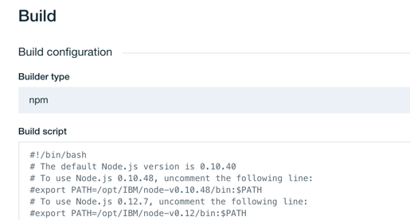

---

copyright:
  years: 2018, 2019
lastupdated: "2019-06-20"

keywords: IBM Cloud account, personal data, IBM Cloud Continuous Delivery

subcollection: ContinuousDelivery

---

{:shortdesc: .shortdesc}
{:new_window: target="_blank"}
{:external: target="_blank" .external}
{:codeblock: .codeblock}
{:pre: .pre}
{:screen: .screen}
{:tip: .tip}
{:note: .note}
{:important: .important}
{:download: .download}

# Continuous Delivery での個人データの管理
{: #cd_personal_data}

個人データは、{{site.data.keyword.contdelivery_full}} から変更、エクスポート、または削除できます。
{: shortdesc}

個人データは、個人に関連する情報、または個人を識別する情報です。 例えば、個人データには、{{site.data.keyword.contdelivery_short}} で使用される、名前、E メール・アドレス、アバター、トークン、およびさまざまな ID などがあります。 以下の {{site.data.keyword.contdelivery_short}} コンポーネントには、個人データが含まれています。

 * Eclipse Orion {{site.data.keyword.webide}}
 * {{site.data.keyword.gitrepos}}
 * {{site.data.keyword.contdelivery_short}} Pipeline
 * ツールチェーンおよびツール統合
 * [GitHub Enterprise on IBM Cloud](/docs/services/ghededicated?topic=ghededicated-ghe_personal_data)
 * [{{site.data.keyword.DRA_full}}](/docs/services/DevOpsInsights?topic=DevOpsInsights-deleting_data)
 
IBM は、{{site.data.keyword.contdelivery_short}} サービスのデータを管理しません。 {{site.data.keyword.Bluemix_notm}} Public でホストされる {{site.data.keyword.contdelivery_short}} サービスの利用を停止する前に、お客様はご自分のデータを削除する必要があります。
{: important}

{{site.data.keyword.contdelivery_short}} は、リソース・グループまたは Cloud Foundry 組織内のデータを管理するための適切な権限を提供します。 企業によっては、これらの権限を制限するポリシーがあります。 適切な権限がない場合は、{{site.data.keyword.Bluemix_notm}} アカウントの管理者に連絡してください。

個人データを管理するには、IBM Cloud アカウント、これらのアカウントの使用方法、およびそれらに関連するアクセス権限について理解する必要があります。
 
## アカウントおよびアクセス権限
{: #accounts_access_rights}

IBM Cloud で作業するには、ユーザー名とパスワードを使用してログインする必要があります。 ログインすると、IBM Cloud は少なくとも 1 つの IBM Cloud アカウントをユーザー資格情報に関連付けます。 Cloud Foundry 組織、リソース・グループ、ツールチェーン、および {{site.data.keyword.contdelivery_short}} オブジェクトなどのリソースを作成すると、それらは IBM Cloud アカウントに関連付けられます。

IBM Cloud ログイン構造には、さまざまなアカウントで作業するためのオプションが用意されています。 IBM Cloud ユーザー・インターフェースを使用して、あるアカウントから別のアカウントに切り替えることができます。 ログイン時にユーザー資格情報に関連付けられるのは、次のタイプのアカウントです。 

 * 個人アカウント
 * 企業アカウント
 * 企業個人アカウント

### 個人アカウント

通常、ユーザーは各自が自分のアカウントを持っています。それを個人アカウントと言います。 個人アカウントには普通、名前が含まれているため (例: *John Smith のアカウント*)、自分の個人アカウントは簡単に識別できます。 

ユーザーは、自分の個人アカウントで作成されたすべてのオブジェクトに対する全権限を持ちます。 他のユーザーに対して、自分のアカウントに招待すること、作成したオブジェクトに対する権限を割り当てること、アカウント内にオブジェクトを作成する権限を割り当てることができます。 これは、他のユーザーの個人データがユーザーのアカウント内に存在したり、ユーザーの個人データが他のユーザーのアカウント内に存在したりする可能性があることを意味します。 

どのアカウントにオブジェクトを保存する場合でも、アカウントにオブジェクトを作成する権限があれば、そのオブジェクトを変更および削除する権限もあることになります。 2 人のユーザーが共同作業を行うときは、多くの場合、個人アカウントが共有されます。

### 企業アカウント

企業アカウントは、ユーザーの企業によってセットアップされます。 通常、ユーザーは招待されるのではなく、アカウントに自動的に追加されます。 企業アカウントは、作業、交流、およびリソースの共有や課金を行うための場所をユーザーに提供しますが、これは慣例に過ぎません。 企業アカウントは、実際には個人アカウントと異なりません。 企業アカウントで作成されたオブジェクトはそのアカウントに関連付けられます。そのアカウントにはユーザーを招待することができます。

企業で働く人々のチームは、多くの場合、企業アカウントを使用して共同作業を行います。

### 企業個人アカウント

企業で働く人のアカウント内の作業は、法的には企業が所有している場合があります。 企業で働く人の多くは、企業個人アカウントを所持しています。 アカウントへのログインに使用している資格情報に企業名が含まれ、同時に、個人アカウントであることを表す要素も含まれている場合、その個人アカウント内の作業は企業に属している可能性があります。

企業個人アカウントは、他のすべてのアカウントと同じです。 企業個人アカウントにはユーザーを招待することができます。企業個人アカウントで作成されたオブジェクトは、そのアカウントによって所有されます。

ユーザーが企業に勤めていてその企業がユーザーの作業を所有している場合、個人アカウント (通常はユーザーの名前が含まれる) は、企業個人アカウントと見なされます。 

## 個人データの変更、エクスポート、および削除
{: #managing_personal_data}

使用されている IBM Cloud アカウントのタイプに関係なく、アカウント内のオブジェクトに対する権限があれば、それらを変更、エクスポート、および削除できます。 変更を行う前に、他のユーザーと連絡を取って、データを不必要に変更または削除しないようにしてください。

アカウントからデータを削除する前に、そのアカウントが個人アカウントであるか企業個人アカウントであるかを判別します。

### 個人アカウント

自分の所有する個人アカウントのデータは、自分で変更したり削除したりすることができます。 自分のアカウントを他のユーザーと共有している場合、そのデータの所有者は自分ですが、共有作業について他のユーザーと連絡を取り合うことをお勧めします。 

IBM Cloud アカウントにログインできない場合は、[IBM Cloud サポート](https://www.ibm.com/cloud/support){: external} にお問い合わせください。
 
### 企業個人アカウント

企業個人アカウントを所有している場合、変更を行う場合は、企業およびチームの他のメンバーと連携して行う必要があります。 企業アカウントまたは企業個人アカウントのどちらに保管されているものでも、個人データは削除してください。 他のユーザーと共有している作業は削除しないようにしてください。

{{site.data.keyword.contdelivery_short}} コンポーネントの個人データの管理を開始する前に、IBM Cloud アカウントで作業していることを確認してください。 現在作業している IBM Cloud アカウントを表示するには、メニュー・バーでプロファイル・アバターをクリックします。 

IBM Cloud アカウントにログインできない場合は、企業に連絡し、その協力のもとに個人データを削除してください。

{{site.data.keyword.contdelivery_short}} からすべての個人データを削除する場合は、そのデータを削除する順序が重要になります。 最初に、すべての {{site.data.keyword.webide}} ワークスペースを削除します。 次に、{{site.data.keyword.gitrepos}} データを削除してから、{{site.data.keyword.gitrepos}} アカウントを削除します。 最後に、デリバリー・パイプライン、ツール統合、およびツールチェーンを削除します。
{: tip}

## Web IDE データのエクスポートおよび削除
{: #managing_web_ide_data}

{{site.data.keyword.webide}} は、クラウド内に個人用ワークスペースを提供します。 {{site.data.keyword.webide}} を使用して Git リポジトリーを複製し、ファイルを編集できます。 ユーザーは自分の {{site.data.keyword.webide}} ワークスペースを所有しています。それは他のアカウントとは共有されません。

{{site.data.keyword.webide}}データを削除する前に、作業をエクスポートすることをお勧めします。 ワークスペースを削除すると、それらは {{site.data.keyword.contdelivery_short}} から除去されて、すべてのファイルが削除されます。
{: important}

### Web IDE ワークスペースのエクスポート

{{site.data.keyword.webide}} ワークスペースをエクスポートするには、以下のようにします。

1. **「ファイル」>「エクスポート」>「Zip」**と選択します。
1. これをエクスポートするワークスペースごとに繰り返します。

### Web IDE ワークスペースの削除

すべての個人データを含めて {{site.data.keyword.webide}} ワークスペースを削除するには、次のようにします。

1. 任意のツールチェーンから {{site.data.keyword.webide}} にナビゲートします。
1. 左側のナビゲーション・サイドバーにある**設定**アイコン  をクリックします。
1. **「ユーザー・プロファイル」**をクリックします。
1. **「削除」**をクリックして、{{site.data.keyword.webide}} からすべてのデータを削除します。

{{site.data.keyword.webide}} はシングル・サインオン・メカニズムを使用します。 このツール統合に初めてアクセスすると、表示はされませんがその裏で、IBM Cloud アカウントに対応する {{site.data.keyword.webide}} アカウントが作成されます。 すべてのワークスペースを削除した後は、{{site.data.keyword.webide}} にアクセスしないでください。 {{site.data.keyword.webide}} に再度アクセスすると、新しいアカウントが自動的に作成されますが、そのアカウントは削除する必要があります。
{: important}

## Git Repos and Issue Tracking のデータの変更、エクスポート、および削除
{: #managing_grit_data}

{{site.data.keyword.gitrepos}} は、クラウド内でホストされた Git サービスを提供します。 IBM Cloud アカウントを Git アカウントに関連付けるために、シングル・サインオン・メカニズムが使用されます。 ユーザーのフルネームと短縮名が Git アカウントに作成されます。 Git の問題の中のコメントで、他のユーザーがこのユーザーを参照するときは、このショート・ネームを使用することができます。 Git アカウントをカスタマイズして、自分自身の説明や画像などの個人データを追加できます。 

{{site.data.keyword.gitrepos}} は、ユーザーがさまざまなプロジェクトに貢献し、オブジェクトが共有される、強力であるが複雑なソーシャル・コーディング環境を提供します。 この環境では、個人データの検索や削除が困難になることがあります。

アカウントのプロファイルと設定、個人用プロジェクト、グループ、およびスニペットが、Git アカウントに関連付けられます。 Git アカウントを削除すると、これらのオブジェクトも削除されます。 別のプロジェクト内の個人データを削除するには、プロジェクトにナビゲートし、これを変更して個人データを削除するか、あるいはそのプロジェクト全体を削除します。 共有プロジェクトを削除する場合は、その前にまずチームの他のメンバーに確認を取ってください。

Git アカウントを削除する前に、他のプロジェクトからも個人データを削除してください。 Git アカウントを削除すると、貢献したすべてのプロジェクトを見つけることが困難または不可能になる場合があります。
{: tip}

### 個人用プロジェクトおよび共有プロジェクト

プロジェクトで共同作業を行うように他のユーザーを招待できます。 アカウント内に作成する Git プロジェクトは、個人用プロジェクトと呼ばれます。 また、Git グループを作成し、このグループ内の複数の Git 所有者でプロジェクトを所有することもできます。 グループに新規プロジェクトを作成することも、個人用プロジェクトの所有権をグループに移転することもできます。 Git グループは多くの場合、企業がプロジェクトの所有権を示す目的で、IBM Cloud の企業アカウントを表すために使用します。

### Git Repos and Issue Tracking のプロジェクトのエクスポート

{{site.data.keyword.gitrepos}} のプロジェクトを削除する前に、そのプロジェクトをエクスポートしてアーカイブすることができます。 

1. 左側のナビゲーション・サイドバーにある**設定**アイコン  をクリックします。
1. **「一般」**をクリックします。
1. **「展開」**  をクリックして、「プロジェクトのエクスポート (Export project)」セクションを展開します。
1. **「プロジェクトのエクスポート (Export project)」**をクリックします。

プロジェクトがアーカイブされた後、それを別の GitLab インスタンスにインポートできます。 

### Git Repos and Issue Tracking のアカウントの削除

{{site.data.keyword.gitrepos}} のアカウントおよびそのアカウントによって所有されているすべてのものを削除できます。

1. {{site.data.keyword.gitrepos}}「ユーザー設定」ダッシュボードの[「アカウント」ページ](https://us-south.git.cloud.ibm.com/profile/account){: external} の「アカウントの削除」セクションで、**「アカウントの削除」**をクリックします。
1. リポジトリーや問題を含め、すべての Git プロジェクトが削除されます。 また、自分が属している {{site.data.keyword.gitrepos}} グループからも削除されます。

アカウントを削除した後も、一部のコンテンツは残ります。 このコンテンツは、システム全体の Ghost ユーザーに割り当てられます。 {{site.data.keyword.gitrepos}} のアカウントの削除方法について詳しくは、[Deleting a user account](https://us-south.git.cloud.ibm.com/profile/account/delete_account#associated-records){: external} を参照してください。
{: tip}

{{site.data.keyword.gitrepos}} は、シングル・サインオン・メカニズムを使用するので、初めてツール統合にアクセスするときには IBM Cloud アカウントに対応する Git アカウントが自動的に作成されます。 アカウントを削除した後は、{{site.data.keyword.gitrepos}} にアクセスしないでください。 {{site.data.keyword.gitrepos}} に再度アクセスすると、新しいアカウントが自動的に作成されますが、そのアカウントは削除する必要があります。
{: important}

## Continuous Delivery パイプラインのデータの変更、エクスポート、および削除
{: #managing_pipeline_data}

{{site.data.keyword.contdelivery_short}} パイプラインは、アプリケーションをビルド、テスト、および IBM Cloud にデプロイするためのスクリプトを実行します。 これを行うために、パイプラインは、ステージ、ジョブ、環境変数、およびその他のオブジェクトを提供します。これらには、個人データが含まれることがあります。 これらのオブジェクトを個別に削除することも、パイプライン全体を削除することもできます。

共有オブジェクトまたはパイプラインを削除する場合は、その前にまずチームの他のメンバーに確認を取ってください。 ステージを削除すると、パイプラインが失敗する可能性があります。

パイプラインは、ツールチェーンの外部に存在することはできません。 ツールチェーンを削除すると、そのツールチェーンに関連付けられているすべてのパイプラインも削除されます。 ツールチェーン全体を削除する予定の場合は、各パイプラインを個別に削除する必要はありません。 『ツールチェーンおよびツール統合の変更と削除』セクションにスキップし、ステップに従ってツールチェーンを削除してください。
{: important}

パイプラインのステージには、環境プロパティーの形式による個人データ (資格情報など) と、パイプラインの現在の状態を示すパイプライン定義が含まれることがあります。 またステージでは、変更または削除したいスクリプトがジョブに含まれていたり、エクスポートしたい直近のパイプライン実行のログと成果物が含まれていたりすることもあります。 ステージを変更または削除するには、「ステージの構成」アクションまたは「ステージの削除 (Delete Stage)」アクションを使用します。 ステージから成果物またはログをエクスポートするには、「ダウンロード」アクションを使用します。

  

### パイプライン・ステージの変更

パイプラインのステージを変更するには、次のようにします。

1. 「パイプライン」ページで、**「設定」**アイコンをクリックします。
1. **「ステージの構成」**をクリックします。
1. **「環境プロパティー (ENVIRONMENT PROPERTIES)」**タブで、プロパティーを編集または削除します。
1. パイプライン・ステージ内のジョブ・スクリプトを変更します。 ジョブを選択し、「ビルド」、「デプロイ」、または「テスト構成」に含まれる値を変更します。
   
   
  
1. パイプライン・ステージからジョブを削除します。 **「ジョブ」**タブで、削除するジョブを選択し、**「削除」**をクリックします。
 
### パイプライン・ステージのエクスポート

パイプライン全体の定義をエクスポートするには、パイプライン URL に `/yaml` を追加します。

`https://cloud.ibm.com/devops/pipelines/<pipeline id>/yaml?env_id=<region id>`

ここで、`<pipeline id>` と `<region id>` は、パイプライン・ページの URL に表示される値です。

結果として生成される yaml ファイルには、すべてのパイプライン・ステージの定義が含まれます。

パイプライン・ステージの成果物とログをエクスポートするには、以下のようにします。

1. 「パイプライン」ページで、**「ログおよび履歴の表示」**をクリックします。
1. 成果物とログをエクスポートする対象のビルド番号をクリックします。
1. **「ダウンロード」**>**「成果物」**をクリックして、選択したビルドの成果物をエクスポートします。
1. **「ダウンロード」**>**「ログ」**をクリックして、選択したビルドのログをエクスポートします。  

### パイプライン・ステージの削除

パイプラインのステージを削除するには、以下のようにします。

1. 「パイプライン」ページで、**「設定」**アイコンをクリックします。
1. **「ステージの削除 (Delete Stage)」**をクリックします。

## ツールチェーンおよびツール統合の変更と削除
{: #managing_toolchains}

ツールチェーンを使用することで、チームは共同作業を行い、さまざまなツール統合を共有することができます。 

すべての {{site.data.keyword.contdelivery_short}} 統合を、ユーザー個人に関連付けられているデータではなく、チームまたは会社に関連付けられているデータを使用して構成することをお勧めします。 しかし、ユーザー個人のデータが誤って使用されている場合もあるものです。 そのような場合は、ユーザー個人が所有するすべてのデータを識別して、削除する必要があります。

ツール統合の作成時に {{site.data.keyword.contdelivery_short}} ですべてのデータの出所を記録できるわけではありません。 例えば、ユーザーが E メールで提供した個人データを使用して、別のチーム・メンバーが、そのユーザーに代わってツール統合を作成する場合があります。 ユーザー自身が自分の所有データを把握し、そのデータが削除されるようにする必要があります。

共有されているツール統合やツールチェーンを削除する場合は、その前にチームの他のメンバーと確認を取ってください。

### ツール統合の変更および削除

ツール統合を作成するときには、統合に関するユーザー資格情報や他のアカウント情報を指定する必要があります。 所有する個人の資格情報とアカウント情報を使用した場合は、この情報を別の値に置き換えるか、そのツール統合を削除してください。

ツールの統合を変更するには、以下のようにします。

1. ツールのカードで、メニューをクリックして構成オプションにアクセスします。

  

1. 設定の更新が完了したら、**「統合の保存」**をクリックします。

ツール統合を削除するには、以下のようにします。

1. ツールチェーンからツール統合を削除するには、**「削除」**をクリックします。
1. **「削除」**をクリックして確認します。

### ツールチェーンの削除

ツールチェーンを削除すると、削除を取り消すことはできません。

1. DevOps ダッシュボードの**「ツールチェーン」**ページで、削除するツールチェーンをクリックします。 あるいは、アプリの「概要」ページの「継続的デリバリー」カードで、**「ツールチェーンの表示」**をクリックします。
1. **「アプリの表示」**の横にある**「その他のアクション」**メニューをクリックします。
1. **「削除」**をクリックします。 ツールチェーンを削除すると、パイプラインなど、そのツールチェーンのツール統合がすべて削除されます。結果として、その統合で管理されていたリソースが削除される可能性があります。
1. ツールチェーンの名前を入力し、**「削除」**をクリックして、削除を確認します。 

ツールチェーンを削除するとき、関連付けられた {{site.data.keyword.gitrepos}} リポジトリーは削除されません。 それらのリポジトリーに対するアクセス権限を持つユーザーは、`git clone` を実行したり、{{site.data.keyword.webide}} ワークスペースを作成したりしたことがある場合、データのコピーを所有している可能性があります。 すべてのデータを確実に削除するため、それらのユーザーにデータのコピーを削除するよう要請する必要があります。
{: tip}

### すべてのツールチェーンの削除

リソース・グループ内または組織内のすべてのツールチェーンを同時に削除することはできません。 各ツールチェーンを一度に 1 つずつ削除する必要があります。

ツールチェーンは、IBM Cloud の地域とリソース・グループまたは Cloud Foundry 組織によってスコープ設定されます。 各地域およびリソース・グループまたは地域内の組織を選択して、作成したすべてのツールチェーンを削除してください。
{: tip}
