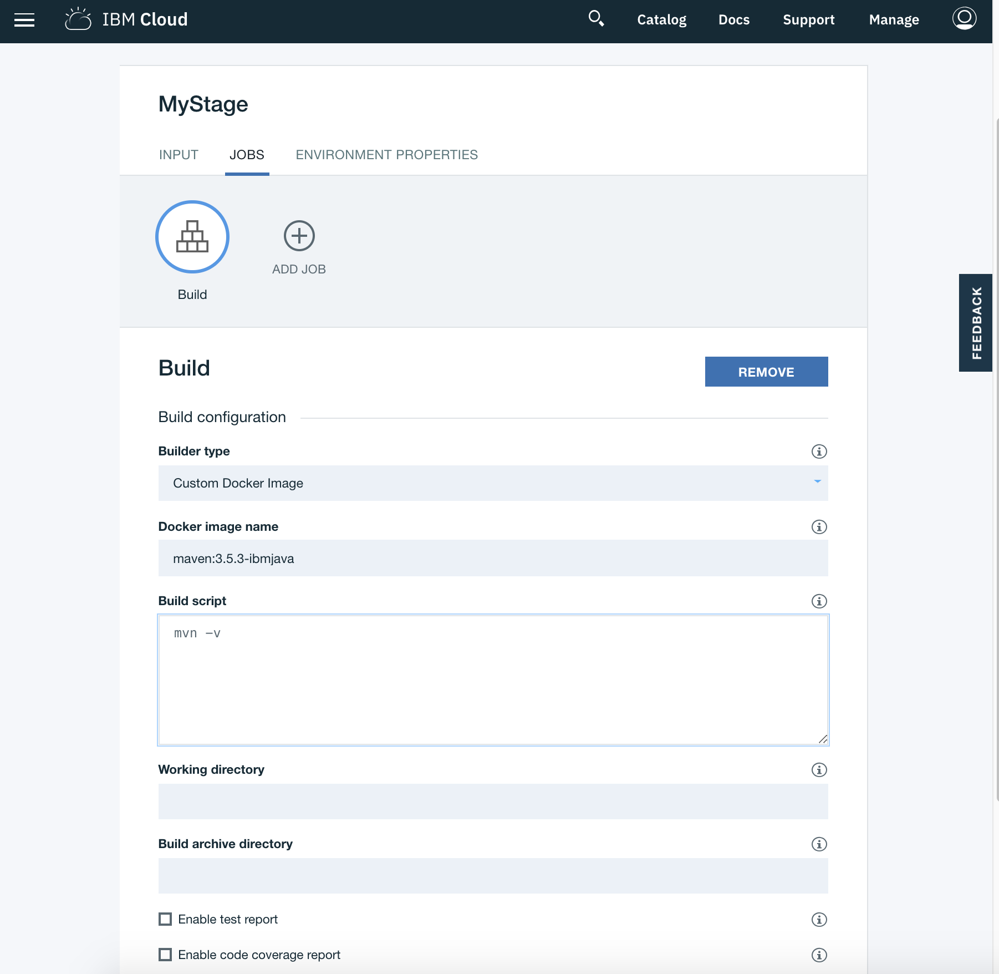
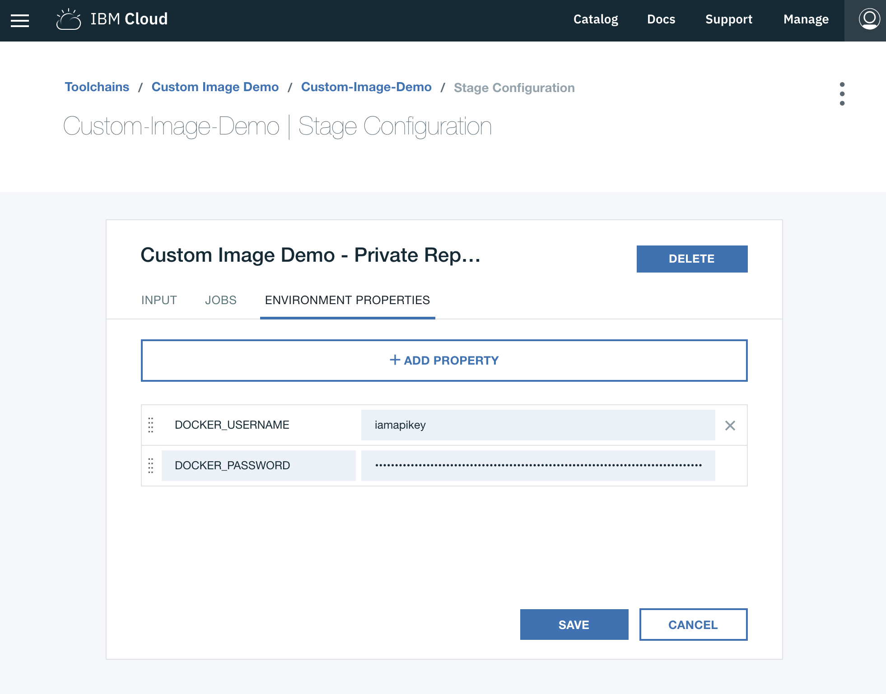

---

Copyright:
  years: 2018, 2019
lastupdated: "2019-06-19"

keywords: pipeline base image, custom Docker, IBM Cloud team uses

subcollection: ContinuousDelivery

---

{:shortdesc: .shortdesc}
{:new_window: target="_blank"}
{:external: target="_blank" .external}
{:codeblock: .codeblock}
{:pre: .pre}
{:screen: .screen}
{:tip: .tip}
{:note: .note}
{:important: .important}
{:download: .download}

# カスタム Docker イメージの操作
{: #custom_docker_images}

パイプライン基本イメージは、すべてのビルドの要件をサポートしていないことがあります。 例えば、node、Java、またはその他のツールのバージョンを細かく制御する必要がある場合があります。 この問題に対処するには、一連の新規パッケージをインストールして、環境変数 (`PATH` など) を慎重に構成して環境をセットアップする最初のステップをパイプライン・ジョブに組み込みます。 しかし、さらに優れた方法は、ジョブの基礎として「カスタム Docker イメージ」を実行するためにパイプラインのサポートを使用することです。

ビルド、テスト、またはデプロイのいずれのジョブ・タイプを使用する場合でも、「カスタム Docker イメージ」サブタイプを選択して、使用する Docker イメージ名を指定し、実行するスクリプトを指定できます。 例えば、Maven 3.5.3 および IBM Java を使用してビルド・ジョブを実行するには、以下のオプションを使用します。

 

## Docker イメージ名の指定
{: #docker_image_name}

カスタム Docker イメージ・ジョブの Docker イメージ名の動作は、Docker CLI でのイメージ名の動作と同様に設計されています。 Docker イメージ名の形式は、`[repository][:][tag]` です。 例えば、`docker run maven:3.5.3-ibmjava` の場合、Docker イメージ名は `maven:3.5.3-ibmjava` です。ここで、`maven` はリポジトリー、`3.5.3-ibmjava` はタグです。 使用できる Docker イメージ名に制限はありません。有効な Docker イメージはすべて機能します。

**「Docker イメージ名」**フィールドが入力されていない場合は、標準のパイプライン基本イメージが使用されます。 
{: tip}

デフォルトでは、[Docker Hub](https://hub.docker.com/){: external} 上のリポジトリーが検索されます。{{site.data.keyword.registrylong}} などの別の Docker レジストリーを使用する場合は、完全な DNS 名を使用できます。 また、Docker Hub 上のイメージの完全修飾名を使用することもできます。 例えば、`registry.hub.docker.com/library/maven:3.5.3-ibmjava` です。

Docker イメージの`「タグ」`はオプションです。 タグを指定しない場合、デフォルトで`「最新 (latest)」` に設定されます。 デフォルト値の`「最新 (latest)」`は、リポジトリー所有者が管理する必要があるタグ名です。 これは、この Docker イメージが発生順で最新のイメージであることを意味するものではありません。

Docker Hub には、リポジトリーの大規模なコミュニティーがあります。 IBM は、[https://hub.docker.com/u/ibmcom/](https://hub.docker.com/u/ibmcom/){: external} で、IBM Cloud チームが使用する多数のパブリック・リポジトリーをホストしています。`ibmcom/ibmjava` リポジトリーと `ibmcom/ibmnode` リポジトリーは、ビルドに役立ちます。 

## プライベート・イメージ・レジストリーの使用
{: #private_image_registry}

認証を必要とするプライベート・レジストリーを使用している場合は、さらに 2 つのステージ環境プロパティー `DOCKER_USERNAME` および `DOCKER_PASSWORD` を設定する必要があります。 セキュア・プロパティーを使用して、`DOCKER_PASSWORD` をマスクできます。 イメージがプルされる前に、カスタム Docker イメージ・ジョブはユーザー名とパスワードの資格情報を使用して `Docker ログイン`を実行します。

ほとんどのレジストリーでは、提供されたユーザー名とパスワードを使用できます。 {{site.data.keyword.registrylong_notm}} を使用してプライベート・イメージを保管する場合は、認証にプラットフォーム API キーを使用する必要があります。 

1. [プラットフォーム API キーを要求](https://cloud.ibm.com/iam/#/apikeys){: external}し、鍵を保存したことを確認します。 
1. `DOCKER_USERNAME` に `iamapikey` を使用し、また、`DOCKER_USERNAME` に保存したプラットフォーム API キーを使用して、2 つのステージ環境プロパティーを作成します。

 

## スクリプトの指定
{: #specify_script}

カスタム Docker イメージ・ジョブで **script** ブロックを使用して、通常のパイプライン・ジョブの動作と類似した方法でタスク・フォルダー内で実行されるスクリプト・ファイルを作成できます。 

ご使用の Docker イメージの Dockerfile の `ENTRYPOINT` と `CMD` はオーバーライドされ、呼び出されません。 このため、場合によっては、初期化ステップをスクリプトに追加する必要があります。
{: tip}

カスタム Docker イメージ・ジョブを使用すると、スクリプトをより柔軟に実行できるようになります。具体的には、コマンド・インタープリターを制御できます。 通常、スクリプトの最初の行の先頭が `#!` とコマンド・インタープリターの名前である場合、そのエントリーを使用してジョブ内のコマンドが実行されます。 コマンド・インタープリターを指定しない場合は、Docker イメージのデフォルト・シェルが使用されます。 通常、`#!/bin/bash` または `#!/bin/sh` が使用されます。適切な Docker イメージを指定すれば、`awk`、`node`、`ruby` のイメージ・コマンド・インタープリターも機能します。
