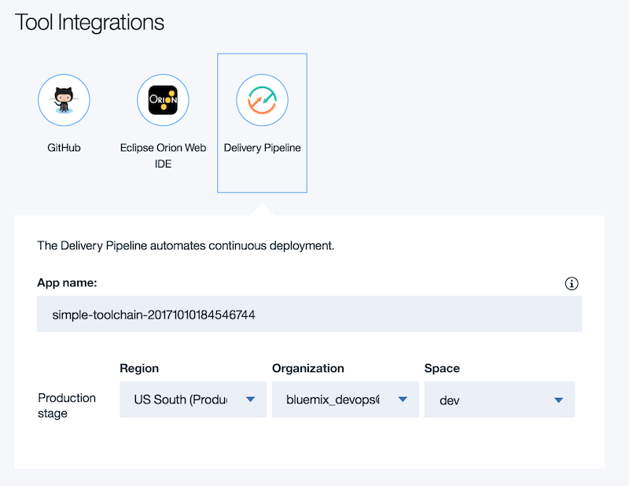

---

copyright:
  years: 2017, 2018
lastupdated: "2018-2-26"

---
{:new_window: target="_blank"}
{:shortdesc: .shortdesc}
{:screen: .screen}
{:codeblock: .codeblock}
{:pre: .pre}


# カスタム・ツールチェーン・テンプレートの作成
{: #toolchains_custom}

カスタム・ツールチェーン・テンプレートを作成して DevOps ワークフローを改善します。 既存のツールチェーン・テンプレートを使用してすぐに始めるか、必要な統合のみを組み込んだツールチェーン・テンプレートを作成できます。 ツールチェーンの統合はいつでも追加したり削除したりできます。
{:shortdesc}

[ツールチェーンを作成](/docs/services/ContinuousDelivery/toolchains_working.html#toolchains_getting_started){: new_window}するには、いくつかの方法を使用できます。 カスタム・ツールチェーン・テンプレートを作成したら、[「{{site.data.keyword.Bluemix_notm}} にデプロイ」ボタンを作成](/docs/services/ContinuousDelivery/deploy_button.html#deploy-button){: new_window}してこれを共有できます。ツールチェーン・テンプレート SDK の詳細については、[Open Toolchain Templates SDK](https://github.com/open-toolchain/sdk/wiki/){:new_window} を参照してください。ステップバイステップのチュートリアルについては、[Garage Method サイト](https://www.ibm.com/cloud/garage/tutorials/create-a-template-for-a-custom-toolchain/){:new_window}を参照してください。


## 概説
{: #toolchains_custom_gettingstarted}

カスタム・ツールチェーン・テンプレートを作成するには、まず Simple Cloud Foundry ツールチェーン・テンプレートのクローン作成から開始します。 既存のテンプレートのクローン作成は、カスタマイズしたツールチェーンの開始点となります。

1. 選択した Git クライアントを使用して、次のコマンドを入力し、GitHub の[シンプルなツールチェーン](https://github.com/open-toolchain/simple-toolchain){: new_window}のテンプレートのクローンを作成します。

 ```
 git clone https://github.com/open-toolchain/simple-toolchain.git
 ```
 {: pre}

 このテンプレートは、基本的な Hello World アプリケーションを単一の GitHub リポジトリーからデプロイします。このテンプレートには、継続的デリバリー、ソース管理、問題のトラッキング、オンライン編集のための構成があらかじめ行われたシンプルなツールチェーンが含まれています。

2. さらに複雑なツールチェーン・テンプレートから開始する場合は、[マイクロサービス用のクラウド・ネイティブのツールチェーン](https://github.com/open-toolchain/toolchain-demo){: new_window}のクローンを作成することから始めることができます。

 ```
 git clone https://github.com/open-toolchain/toolchain-demo.git
 ```
 {: pre}

マイクロサービス・テンプレートは、3 つのマイクロサービス (それぞれ独自の GitHub リポジトリーに含まれる) で構成されるオンライン・ストアをデプロイします。 また、これは、次の項目用に事前構成された、より複雑なツールチェーンでもあります。
* 継続的デリバリー
* ソース管理
* Blue-green デプロイメント
* 機能テスト
* 問題のトラッキング
* オンライン編集
* メッセージング

いずれのテンプレートを選択するかに関係なく、作成するツールチェーンのカスタマイズ・プロセスは一般的に同じです。

テンプレートのクローンを作成すると、Readme ファイルと `.bluemix` ディレクトリーを含んだ基本的な GitHub リポジトリーが作成されます。 このディレクトリーには、ツールチェーンの動作に必要なすべての構成ファイルが含まれます。 `.bluemix` ディレクトリーには、少なくとも次のファイルが含まれている必要があります。

* `toolchain.yml`
* `deploy.json`
* `pipeline.yml`


これらの各ファイルについては、以降のセクションで説明します。 各セクションには、ツールチェーンの展開に合わせて確認できる構成情報が含まれます。
YAML は、JSON の厳密なスーパーセットに、構文的に有意な改行と字下げが追加された、データ・シリアライゼーション言語です。しかし、YAML ではリテラルのタブ文字は一切使用できません。

## 構成ファイルについて
{: #toolchains_custom_config_files}


ツールチェーン・テンプレートの構成ファイルは、主に YAML 形式のファイルで構成されます。 各ファイルには、ツールチェーンの様々な側面を記述するメタデータが含まれます。 メタデータには次の情報が含まれます
* ツールチェーンとリポジトリーに関する情報。
* コードのビルドとデプロイ方法に関する詳細。
* ツールチェーンに含まれるツールの構成プロパティー。

ツールチェーンが複雑になると、構成ファイルも同様に複雑になることがあります。

YAML ファイルで作業する際に注意すべきガイドラインは次のとおりです。

* スペースにはスペースだけを使用します。 タブは許可されません。
* すべてのプロパティーとリストは、1 つ以上のスペースでインデントする必要があります。
* すべてのキーとプロパティーは大/小文字が区別されます。

YAML ファイルのフォーマットに細心の注意を払い、エラーが発生する可能性を低くします。
エラーを確認するには、[このパーサー](http://wiki.ess3.net/yaml/){: new_window}のようなシンプルなバリデーターを使用できます。
{: tip}

## サービス・セクションの計画
各サービス・サブセクションには以下の情報が含まれています。

* name - 現行ファイルのコンテキスト内でのこのサービスの識別に使用されるユーザー生成ストリング。必要に応じて、この名前を使用してサービスにマークを付けることができます。

* service_id - サービスを識別する固有のストリング。このストリングの直接のソースは[サービス・カタログ](https://github.com/open-toolchain/sdk/wiki/services.md){: new_window}です。

* parameters - サービスのゼロ個以上の構成パラメーター。これらのパラメーターはサービスによって異なります。ユーザーは、カタログを調べて、特定のサービスにとって必要なパラメーターを確かめる必要があります。

### 他のファイルからのテキストの組み込み

ツールチェーンに関するすべての情報を `toolchain.yml` ファイルに組み込むことができます。しかし、`$text` を使用して、ツール統合 UI ごとに別個のファイルを作成することもできます。こうすると、ツールチェーンの保守が容易になり、構成ファイルの編集に費やす時間を最小限に抑えることができます。`toolchain.yml` の以下のサンプル・スニペットは、`pipeline.yml` ファイルの内容を `content` の値として使用する方法を示しています。

```
  configuration:
    content:
      $text: pipeline.yml
```

### ツールチェーン・テンプレートのローカライズ

`nls` ディレクトリー内の UI ストリングを外部化して、ツールチェーンをローカライズし、ツールチェーン内のストリングをユーザーの優先言語で表示できます。
`toolchain.yml` ファイルに `$i18n` 参照を組み込む必要があります。  
以下の例は、`messages.yml` ファイルに対する `$i18n` 参照を示しています。

```
messages:
  $i18n: messages.yml
```

  英語のストリングは `messages.yml` 内にあり、その他の言語は `messages_de.yml` などの言語コードを使用します。言語コードのリストについては、[言語を識別するためのタグ](https://tools.ietf.org/html/rfc5646){: new_window} を参照してください。

   外部化されたストリングを参照するには、`$ref` を使用してストリングを取り出します。以下に例を示します。

```
  template:
    name:
      $ref: "#/messages/template.name"
```

  外部化されたストリングを使用しない場合は、以下を使用できます。

```
  template:
    name: my_template
```

詳しくは、[Open Toolchain SDK のメッセージのセクション](https://github.com/open-toolchain/sdk/wiki/Template-File-Format#messages-section){: new_window}を参照してください。

## ツールチェーン・ファイルの構成
{: #toolchains_custom_toolchain_yml}

`toolchain.yml` ファイルは、ツールチェーンの中核です。 プルするリポジトリー、含めるサービス、ビルドの詳細などのツールチェーンの仕様が、すべてこのファイルに記述されます。 内容を分かりやすくするために、いくつかのセクションに分割することができます。

1\. **ツールチェーンの情報の概要**

 ファイルのこのセクションでは、ツールチェーンの作成ページでユーザーに表示されるツールチェーンのシンプルな詳細情報が提供されます。 ツールチェーンの名前とともに、ツールチェーンの目的についての説明を含めます。 ロゴやツールチェーンを視覚的に表したイメージを含めることもできます。

 ツールチェーンの概要のコンテンツを提供することに加えて、このセクションには、ツールチェーンを構成するツールを定義する `required` という名前のキーも含まれます。 ツールチェーンの作成者は、テンプレートからツールチェーンを作成する際に、これらのツールを構成します。 ツールチェーンの作成ページで構成できるツールごとに、`toolchain.yml` ファイルで `required` キーのプロパティーとして定義されているツールの親キーを追加します。

 次のスニペットは、このセクションの例を示しています。

 ```
 ---
template
  name: "Simple Toolchain"
  description: "This Hello World application uses Node.js and includes a toolchain that is preconfigured for continuous delivery, source control, issue tracking, and online editing.\n\nTo get started, click **Create**."
  header: ''
  icon: icon.svg
  required:
   - sample-build
   - sample-repo
  info:
    git url: >-
      [https://github.com/my-toolchain/simple-toolchain](https://github.com/open-toolchain/simple-toolchain)
    git branch: >-
      [master](https://github.com/my-toolchain/simple-toolchain/tree/master)
  ```
 {: codeblock}

この例の Git URL と Git ブランチは、新規ツールチェーン・テンプレートのものです。

2\. **リポジトリーの定義**

 ツールチェーンは、GitHub、GitHub Enterprise、Git Repos and Issue Tracking、GitLab などの任意の数の GitHub リポジトリーに継続的デリバリーを提供できます。`toolchain.yml` ファイルのこのセクションで、各リポジトリーが定義されます。

 ツールチェーンに追加されるリポジトリーそれぞれについて、リポジトリーの名前を表す親キーを次のプロパティーとともに追加します。

| アイテム | キー/プロパティー | 値 | 説明 |
|------|--------------|-------|-------------|
| repo-name | キー |  | リポジトリー名。 このキーは名前 (sample-repo) に一致します |
| service_id | プロパティー | <`githubpublic`、`githubprivate`、`hostedgit`、`gitlab`> | リポジトリーのタイプ |
| パラメーター: | キー |  |  |
| repo_name | プロパティー |  | repo-name のパターン。 以下の例では、リポジトリー名としてツールチェーン名が使用されています |
| repo_url | プロパティー |  | リポジトリーの URL |
| タイプ | プロパティー | <`new`、`fork`、`clone`、`link`> | 新規リポジトリーの作成方法 |
| has_issues | プロパティー | <`true`、`false`> | Issue の使用 |
| enable_traceability | properties |  <`true`、`false`> | コミット、プル要求、参照される問題に対するタグ、ラベル、コメントを作成することによって、コード変更のデプロイメントをトラッキングするかどかを判断します。|

 **注意:** 複数のリポジトリーを定義して `has_issues: true` として構成すると、GitHub Issue トラッカーの単一のインスタンスがツールチェーンに追加されます。トラッカーは、`true` に設定されているすべてのリポジトリーの問題をフォローします。

 次のスニペットは、このセクションの例を示しています。

 ```
 # Github repos
 services:
  sample-repo:
    service_id: githubpublic
    parameters:
      repo_name: '{{toolchain.name}}'
      repo_url: 'https://github.com/open-toolchain/node-hello-world'
      type: clone
      has_issues: true
      enable_traceability: true
 ```
 {: codeblock}

3\. **パイプラインの情報:**

 パイプラインを使用してプロジェクトを継続的にデリバリーできます。 ファイルのこのセクションでは、各 GitHub と Git Repo and Issue Tracking リポジトリーでコードをビルドしてデプロイするために使用される構成の詳細を定義します。

 まず、ツールチェーンで定義されたリポジトリーごとに、そのパイプラインの名前を表す親キーを追加します。 このキーは、GitHub または Git Repo and Issue Tracking リポジトリーの名前に基づいたものにすることを検討していください。 次のプロパティーを追加します。

| アイテム | キー/プロパティー | 値 | 説明 |
|------|--------------|-------|-------------|
| pipeline-name | キー |  | パイプラインの名前 (sample-build) |
| service_id | プロパティー | <`pipeline`> | 使用するサービスの名前 |
| パラメーター | キー |  |  |
| 名前 | プロパティー | <`repo_name`> | リポジトリーのセクションで定義される名前と同じです |
| ui-pipeline | プロパティー | <`true`、`false`> |このパイプラインがデプロイするアプリケーションがツールチェーン・ページ上の**「アプリの表示」**メニュー内に表示される場合は true  |
| 構成 | キー |  |  |
| コンテンツ | プロパティー | <`$ref(pipeline.yml)`> | パイプラインを定義するファイル |
| env | キー |  |  |
| SAMPLE_REPO | キー | <`repo-name-key`> | リポジトリーの親キーと同じ名前 |
| CF_APP_NAME |  プロパティー | <`'{{form.pipeline.parameters.prod-app-name}}'`> | Cloud Foundry で使用する名前。 このプロパティーにリポジトリーの親キー名を組み込むことを検討してください。 |
| PROD_SPACE_NAME | プロパティー | <`'{{form.pipeline.parameters.prod-space}}'`> | デプロイ先の {{site.data.keyword.Bluemix_notm}} スペースの名前 |
| PROD_ORG_NAME | プロパティー | <`'{{form.pipeline.parameters.prod-organization}}'`> | デプロイ先の {{site.data.keyword.Bluemix_notm}} の組織の名前 |
| PROD_REGION_ID | プロパティー | <`'{{form.pipeline.parameters.prod-region}}'`> | デプロイ先の {{site.data.keyword.Bluemix_notm}} の地域の名前 |
| execute | プロパティー | <`true`、`false`> | 作成後にパイプラインを開始します |

<!--| services | property | <`repo-name-key`> |  GitHub repository parent key |
| hidden | property | <`[form, description]`> |  |
-->

 `pipeline.yml` ファイルの作成については、[後続のセクション](#toolchains_custom_pipeline_yml)を参照してください。

 次のスニペットは、ファイルのこのセクションの例を示しています。

 ```
 # Pipelines
  sample-build:
    service_id: pipeline
    parameters:
      services:
        - sample-repo
      name: '{{services.sample-repo.parameters.repo_name}}'
      ui-pipeline: true
      configuration:
        content:
          $ref: pipeline.yml
        env:
          SAMPLE_REPO: sample-repo
          CF_APP_NAME: '{{form.pipeline.parameters.prod-app-name}}'
          PROD_SPACE_NAME: '{{form.pipeline.parameters.prod-space}}'
          PROD_ORG_NAME: '{{form.pipeline.parameters.prod-organization}}'
          PROD_REGION_ID: '{{form.pipeline.parameters.prod-region}}'
       execute: true
 ```      
 {: codeblock}

4\. **デプロイメントの詳細:
**

 継続的デリバリー・プロセスの一部として、ユーザーがアクセスできる任意の {{site.data.keyword.Bluemix_notm}} の地域、組織、またはスペースにアプリケーションをデプロイするようにツールチェーンを構成できます。 アプリケーションをデプロイする場所の具体的な詳細を、ツールチェーンの作成ページから選択できます。

 

 `toolchain.yml` ファイルのこのセクションでは、ツールチェーンの作成ページから構成できるパイプラインのステージを定義します。

 まず、親キー `deploy` を使用して、デプロイメントの構成プロパティーを特定します。 このセクションを構成するその他のプロパティーは次のとおりです。

| アイテム | キー/プロパティー | 値 | 説明 |
|------|--------------|-------|-------------|
| deploy | キー |  | デプロイメント・セクションの名前 |
| schema | プロパティー | <`deploy.json`> | デプロイメントの詳細を構成するための UI のレイアウトを定義するファイル |
| service-category | プロパティー | <`pipeline`> | デプロイメントの構成を使用するサービス |
| パラメーター | キー |  |  |
| prod-region | プロパティー | <`"{{region}}"`> | 実動ステージの {{site.data.keyword.Bluemix_notm}} の地域を定義します |
| prod-organization | プロパティー | <`"{{organization}}"`> | 実動ステージの {{site.data.keyword.Bluemix_notm}} の組織を定義します |
| prod-space | プロパティー | <`prod`> | 実動ステージの {{site.data.keyword.Bluemix_notm}} スペースを定義します |
| github-repo-name | プロパティー | <`"{{repo-name-key.parameters.repo_name}}"`> | ツールチェーンの作成ページに GitHub リポジトリーの名前を渡す変数 |

`deploy.json` ファイルの作成について詳しくは、[このセクション](#toolchains_custom_deploy_json) を参照してください。

 次の例では、実稼働環境にデプロイする単一のステージを定義しています。

 ```
 ## Configuring a deployment stage
 deploy:
   schema: deploy.json
   service-category: pipeline
   parameters:
 	prod-region: "{{region}}"
 	prod-organization: "{{organization}}"
 	prod-space: prod
 	hello-world-name: "{{hello-world-repo.parameters.repo_name}}"
 ```
 {: codeblock}

 このサンプル・コードは、ほとんどの部分をそのまま使用することができますが、わずかな点だけを変更する必要があります。 このセクションをカスタマイズするには、リポジトリーの名前に合うように `github-repo-name` を設定します。 [`deploy.json`](#toolchains_custom_deploy_json) ファイル内の詳細を更新する必要もあります。

 開発、QA、実動ステージを含むより複雑なパイプラインを作成する場合は、`parameters` キーの次のプロパティーを置き換えます。

 ```
   parameters:
 	dev-region: "{{region}}"
 	qa-region: "{{region}}"
 	prod-region: "{{region}}"
 	dev-organization: "{{organization}}"
 	qa-organization: "{{organization}}"
 	prod-organization: "{{organization}}"
 	dev-space: dev
 	qa-space: qa
 	prod-space: prod
 ```
 {: codeblock}

 ## パイプラインの構成
 {: #toolchains_custom_pipeline_yml}

 `pipeline.yml` ファイルには、パイプラインのステージの構成の詳細がすべて含まれます。 既存の pipeline.yml から開始して、ニーズに合わせてこれをカスタマイズできます。

 ツールチェーンに複数のパイプラインが含まれている場合、`pipeline.yml` ファイルごとに固有の名前を指定します。

 以下は `pipeline.yml` ファイルの例です。

 ```
 ---
stages:
- name: BUILD
  inputs:
  - type: git
    branch: master
    service: ${SAMPLE_REPO}
  triggers:
  - type: commit
  jobs:
  - name: Build
    type: builder
- name: DEPLOY
  inputs:
  - type: job
    stage: BUILD
    job: Build
  triggers:
  - type: stage
  properties:
  - name: CF_APP_NAME
    value: undefined
    type: text
  - name: APP_URL
    value: undefined
    type: text
  jobs:
  - name: Blue-Green Deploy
    type: deployer
    target:
      region_id: ${PROD_REGION_ID}
      organization: ${PROD_ORG_NAME}
      space: ${PROD_SPACE_NAME}
      application: ${CF_APP_NAME}
    script: |
      #!/bin/bash
      # Push app
      if ! cf app $CF_APP; then  
        cf push $CF_APP
      else
        OLD_CF_APP=${CF_APP}-OLD-$(date +"%s")
        rollback() {
          set +e  
          if cf app $OLD_CF_APP; then
            cf logs $CF_APP --recent
            cf delete $CF_APP -f
            cf rename $OLD_CF_APP $CF_APP
          fi
          exit 1
        }
        set -e
        trap rollback ERR
        cf rename $CF_APP $OLD_CF_APP
        cf push $CF_APP
        cf delete $OLD_CF_APP -f
      fi
      # Export app name and URL for use in later Pipeline jobs
      export CF_APP_NAME="$CF_APP"
      export APP_URL=http://$(cf app $CF_APP_NAME | grep urls: | awk '{print $2}')
      # View logs
      #cf logs "${CF_APP}" --recent
 ```
 {: codeblock}		


 ## パイプライン・インターフェースの構成
 {: #toolchains_custom_deploy_json}

 ツールチェーンの作成ページで、「構成可能な統合 (Configurable Integrations)」セクションから「Delivery Pipeline」を選択すると、セクションが展開されて、次のアイテムが表示されます。

 	* アプリケーションの名前。
 	* パイプラインのステージのデプロイ先の地域、組織、スペース。

ツールごとにこれらのアイテムを構成できます。

 

 UI のこのセクションのレイアウトは、`deploy.json` スキーマによって定義されます。

 スキーマ内で、アプリケーションの詳細と一致するように、次のプロパティーが更新されます。

 	* Title
 	* Description
 	* LongDescription
 	* `hello-world-name` のすべてのインスタンスと関連情報を、アプリケーションに合わせて変更する必要があります。

 以下のスニペットは `deploy.json` ファイルの例です。

 ```
 {
    "$schema": "http://json-schema.org/draft-04/schema#",
    "messages": {
        "$i18n": "locales.yml"
    },
    "title": {
        "$ref": "#/messages/deploy.title"
    },
    "description": {
        "$ref": "#/messages/deploy.description"
    },
    "longDescription": {
        "$ref": "#/messages/deploy.longDescription"
    },
    "type": "object",
    "properties": {
        "prod-region": {
            "description": "The {{site.data.keyword.Bluemix_notm}} region",
            "type": "string"
        },
        "prod-organization": {
            "description": "The {{site.data.keyword.Bluemix_notm}} org",
            "type": "string"
        },
       "prod-space": {
            "description": "The {{site.data.keyword.Bluemix_notm}} space",
            "type": "string"
        },
        "prod-app-name": {
            "description": {
                "$ref": "#/messages/deploy.appDescription"
            },
            "type": "string",
            "pattern": "\\S"
        }
    },
    "required": [
        "prod-region",
        "prod-organization",
        "prod-space",
        "prod-app-name"
    ],
    "form": [
        {
            "type": "validator",
          "url": "/devops/setup/bm-helper/helper.html"
        },
        {
            "type": "text",
            "readonly": false,
            "title": {
                "$ref": "#/messages/deploy.appName"
            },
            "key": "prod-app-name"
        },
        {
            "type": "table",
            "columnCount": 4,
            "widths": [
                "15%",
                "28%",
                "28%",
                "28%"
            ],
            "items": [
                {
                    "type": "label",
                  "title": ""
                },
                {
                    "type": "label",
                    "title": {
                        "$ref": "#/messages/region"
                    }
                },
                {
                    "type": "label",
                    "title": {
                        "$ref": "#/messages/organization"
                    }
                },
                {
                    "type": "label",
                    "title": {
                        "$ref": "#/messages/space"
                    }
                },
                {
                    "type": "label",
                    "title": {
                        "$ref": "#/messages/prodStage"
                    }
                },
                {
                    "type": "select",
                  "key": "prod-region"
                },
                {
                    "type": "select",
                  "key": "prod-organization"
                },
                {
                    "type": "select",
                  "key": "prod-space",
                  "readonly": false
                }
            ]
        }
    ]
}
 ```
 {: codeblock}


## 他のツール構成

 ツールチェーンの中核となるコンポーネントを構成したら、ツールチェーンにさらに機能を追加する他のツール統合を組み込むことができます。追加するすべてのツールについて、`toolchain.yml` ファイルに独自のエントリーが必要です。 一部のツールの場合は、`.bluemix` ディレクトリーに個別の YAML 構成ファイルを追加することも必要になります。

 

使用可能なツール統合のリストについては、<a href="https://github.com/open-toolchain/sdk/wiki/services.md" target="_blank">ツールチェーン・テンプレートで使用可能なサービス</a>を参照してください。 次の例に、ツールチェーンの YAML ファイルに追加をフォーマットする方法を示します。

### **Slack**

#### toolchain.yml
{: #slack_toolchain_yaml}

```
messaging:
  service_id: slack
  $ref: slack.yml
```
{: codeblock}

#### slack.yml
{: #slack_slack_yaml}

```
---YAML
parameters:
  api_token: ""
  channel_name: ""
```
{: codeblock}

### **Sauce Labs**

#### toolchain.yml
{: #sauce_toolchain_yaml}

```YAML
test:
  service_id: saucelabs
  $ref: saucelabs.yml
```
{: codeblock}

#### saucelabs.yml
{: #sauce_slack_yaml}

```YAML
---
parameters:
  username: ""
  key: ""
```
{: codeblock}

### **Eclipse Orion Web IDE**

####	toolchain.yml
{: #eclipse_toolchain_yaml}

```YAML
webide:
  service_id: orion
```
{: codeblock}
