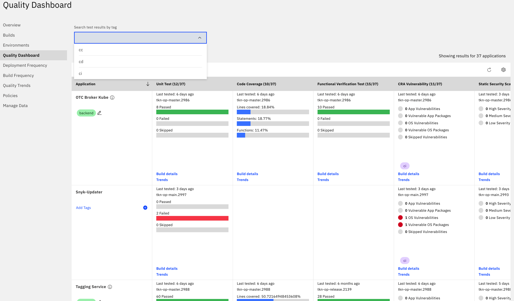

---

copyright:
  years: 2019, 2022
lastupdated: "2022-06-28"

keywords: devops insights, quality, dashboard, code coverage, test, tests, verification, app

subcollection: ContinuousDelivery

---

{:shortdesc: .shortdesc}
{:screen: .screen}
{:codeblock: .codeblock}
{:tip: .tip}
{:note: .note}
{:important: .important}
{:pre: .pre}

# DevOps data aggregation in the Insights quality dashboard
{: #devops-data-aggregation}

The quality dashboard provides quality data sets such as unit tests, code coverage, functional verification tests, and static security scans for each application. The Quality Dashboard page works with {{site.data.keyword.deliverypipelinelong}}, Jenkins, Travis, and other continuous integration and continuous delivery (CI/CD) tools. You can also aggregate quality data for applications that run in multiple clouds or on-premises environments into a single instance of {{site.data.keyword.DRA_full}}. Each category provides more details about specific tests and to identify trends. You can specify the types of tests you want to represent in the dashboard. For more information about data sets, see [Managing data sets](/docs/ContinuousDelivery?topic=ContinuousDelivery-adding-data-sets). 
{: shortdesc}

{: caption="Figure 1. Quality dashboard" caption-side="bottom"}

The Quality Dashboard page shows rows of information for each app that is associated with {{site.data.keyword.DRA_full}}. All of the information about successes and failures for each test for each app is available on one screen. The Quality Dashboard page also displays the tags that are associated with the tests at the time of upload. By selecting a tag from the menu, you can limit the information that is shown on the page to that tag. By default, the page displays all of the tags that are associated with the tests.

You can find the Quality Dashboard page in the {{site.data.keyword.DRA_short}} dashboard. 

1. From the {{site.data.keyword.cloud_notm}} console, click the menu icon , and select **DevOps**.
1. On the Toolchains page, click your toolchain to open its Overview page.
1. On the **IBM Cloud tools** card, click the {{site.data.keyword.DRA_short}} tool integration.
1. From the menu, select **Quality Dashboard**. 
