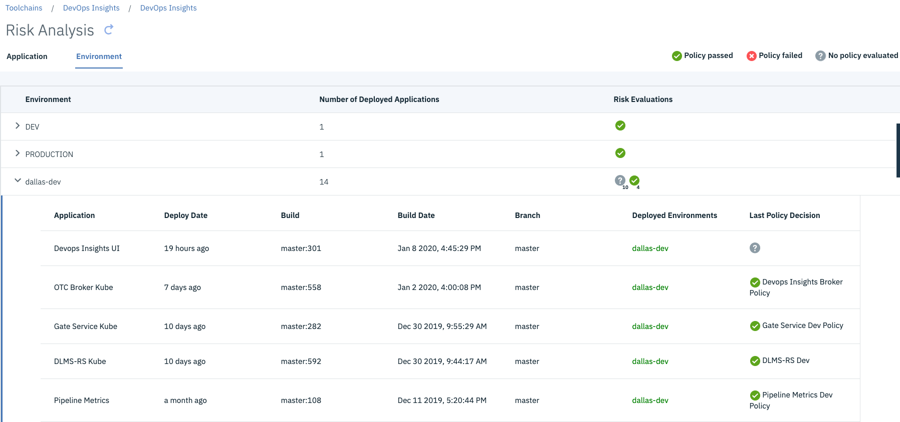

---

copyright:
  years: 2019, 2026
lastupdated: "2026-03-30"

keywords: devops insights, risk, analysis, application, environment, app, dashboard

subcollection: ContinuousDelivery

---

{{site.data.keyword.attribute-definition-list}}

# Analyzing risks for your deployment environments
{: #deployment-environment}

{{site.data.keyword.contdelivery_short}} will be discontinued in the following regions on 10 April 2026: **eu-es** and **jp-osa**.
This discontinuation also applies to any features provided within the service, including Code Risk Analyzer and {{site.data.keyword.DRA_short}}.
[Learn more](/docs/ContinuousDelivery?topic=ContinuousDelivery-faq_region_feature_consolidation)
{: important}

{{site.data.keyword.contdelivery_short}} will be discontinued in the following regions on 12 February 2027: **au-syd**, **ca-mon**, **ca-tor**, **us-east**. Code Risk Analyzer and {{site.data.keyword.DRA_short}} will also be deprecated in all regions on that date. However, if a region has no active usage of these features, the features in that region may be discontinued earlier and stop accepting new instances. [Learn more](/docs/ContinuousDelivery?topic=ContinuousDelivery-faq_region_feature_consolidation)
{: important}

Risk analysis is useful for customers that deploy to several environments. You can view all of your apps deployments and deployment environments. With risk analysis, you get an overview of the risks that are associated with your applications from all of your environments. The Risk Analysis page is automatically populated with the most recent information that is sent from your continuous integration and continuous delivery (CI/CD) tools.
{: shortdesc}

{: caption="Risk Analysis page" caption-side="bottom"}

Within the Risk Analysis dashboard you can select from two tabs: **Application** and **Environment**. Within the **Application** tab, you can see the number of active builds and risk evaluations for each of your apps. In the **Environment** tab, you can view the location of the app, the number of deployed applications, and the risk evaluations associated with the environment.

To view the Risk Analysis page, complete the following steps:

1. From the {{site.data.keyword.cloud_notm}} console, click the **Menu** icon  > **Platform Automation** > **Toolchains**.
1. On the Toolchains page, click your toolchain to open its Overview page.
1. On the **IBM Cloud tools** card, click the {{site.data.keyword.DRA_short}} tool integration.
1. From the menu, select **Risk Analysis**.
