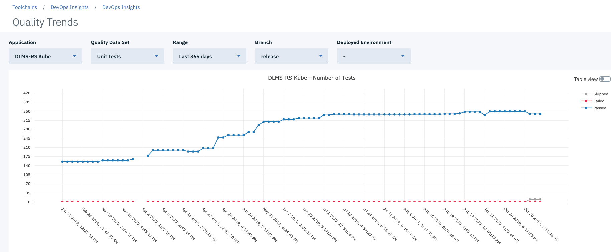

---

copyright:
  years: 2019, 2026
lastupdated: "2026-02-12"

keywords: devops insights, observe trends, quality trends, trends, code coverage, test, tests, verification, app, sonarqube, dashboard

subcollection: ContinuousDelivery

---

{{site.data.keyword.attribute-definition-list}}

# Observing trends over time
{: #observe-trends}

{{site.data.keyword.contdelivery_short}} will be discontinued in the following regions on 12 February 2027: **au-syd**, **ca-mon**, **ca-tor**, **eu-es**, **jp-osa**, **us-east**. Code Risk Analyzer and {{site.data.keyword.DRA_short}} will also be deprecated in all regions on that date. However, if a region has no active usage of these features, the features in that region may be discontinued earlier and stop accepting new instances. [Learn more](/docs/ContinuousDelivery?topic=ContinuousDelivery-faq_region_feature_consolidation)
{: important}

The Quality Trends page shows the number of test cases that are passed or failed for a particular build. You can view trends for quality data sets such as unit tests, functional verification tests, code coverages, SonarQube scans, and security scans for builds.
{: shortdesc}

For more information about data sets, see [Managing data sets](/docs/ContinuousDelivery?topic=ContinuousDelivery-adding-data-sets).

The following figure shows unit test trends for builds from the master branch, and the number of passed and failed test cases for the build.

{: caption="Quality Trends page" caption-side="bottom"}

The Quality Trends graph correlates with the Quality dashboard, and it is a good reference for noticing patterns in your builds. You can view trends for all of the test data in your Quality Trends dashboard.

1. From the {{site.data.keyword.cloud_notm}} console, click the **Menu** icon  > **Platform Automation** > **Toolchains**.
1. On the Toolchains page, click your toolchain to open its Overview page.
1. On the **IBM Cloud tools** card, click the {{site.data.keyword.DRA_short}} tool integration.
1. From the menu, select **Quality Trends**.

Click the dots within the graph to find out why there are dips in quality.
{: tip}
