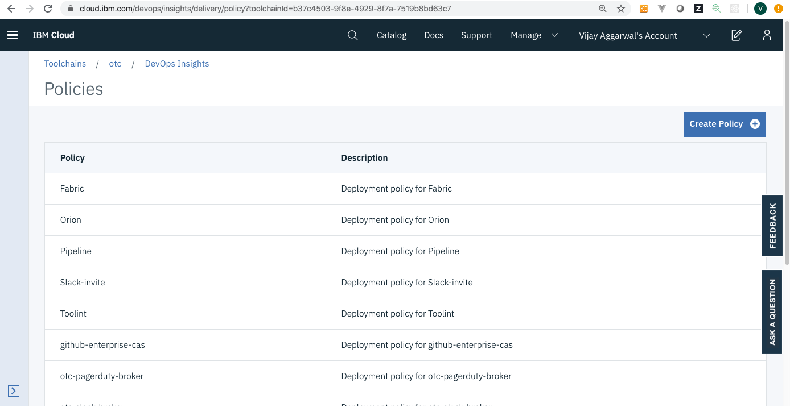
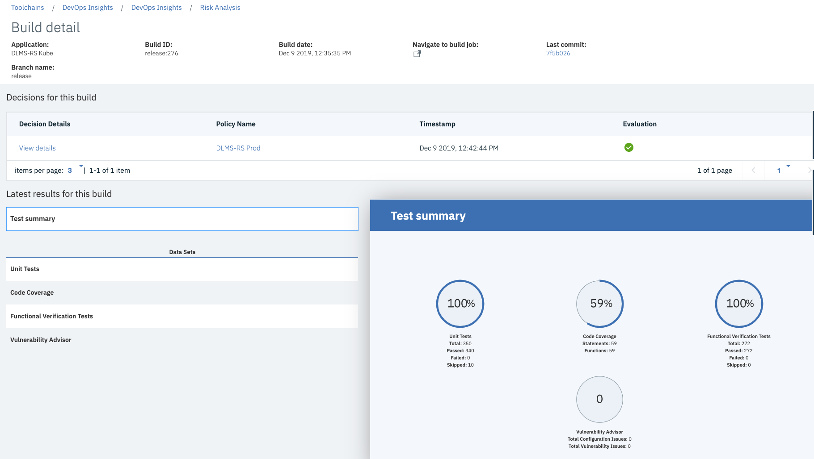

---

copyright:
  years: 2016, 2023
lastupdated: "2023-05-25"

keywords: devops insights, create, policy, rule, gate, code coverage, test, tests, gate failing, verification, app, dashboard

subcollection: ContinuousDelivery

---

{{site.data.keyword.attribute-definition-list}}

# Gate to ensure quality
{: #gate-ensure-quality}

A gate policy is a set of rules that can be used to ensure that a build meets certain quality criteria before being deployed to your chosen environment. Gates check if your test results comply with a defined policy. If the policy is not met, the {{site.data.keyword.DRA_short}} gate fails by default and the build will not deploy. You can also configure gates to act in an advisory role to allow pipeline progression even after failure. 
{: shortdesc}

{{site.data.keyword.DRA_full}} supports many popular formats for test data like unit tests, functional verification tests, and custom data sets, {{site.data.keyword.DRA_short}} supports JUnit or XUnit, and Mocha. For code coverage and custom data sets, {{site.data.keyword.DRA_short}} supports Cobertura, lcov, and JaCoCo. You can use any tool within your toolchain to run your unit tests, code coverage tests, functional verification tests, and then capture your test results in any one of the supported formats.  

For more information about policies, see [Defining policies and rules](/docs/ContinuousDelivery?topic=ContinuousDelivery-defining-policies-rules).

For more information about toolchains, see [Creating a toolchain from an app](/docs/ContinuousDelivery?topic=ContinuousDelivery-toolchains_getting_started#creating_a_toolchain_from_an_app).

For more information about data sets, see [Managing data sets](/docs/ContinuousDelivery?topic=ContinuousDelivery-adding-data-sets).

{: caption="Policy and rules page" caption-side="bottom"}

To go to the Policy Rules page within {{site.data.keyword.DRA_short}}, complete the following steps:

1. From the {{site.data.keyword.cloud_notm}} console, click the **Menu** icon  > **DevOps**.
1. On the Toolchains page, click your toolchain to open its Overview page.
1. On the **IBM Cloud tools** card, click the {{site.data.keyword.DRA_short}} tool integration.
1. From the menu, select **Policies** and then select a policy.

## Gate decisions
{: #gate-decisions}

In your pipeline, you can enter a command by using the {{site.data.keyword.Bluemix_notm}} CLI to check the quality of a build against a predefined policy. When the policy is evaluated, you can check the decision in the {{site.data.keyword.DRA_short}} tool.

### Build detail page
{: #build_detail_page}

{: caption="Build detail" caption-side="bottom"}

From the Risk Analysis page, you can view gate decision reports on the Build detail page. The Build detail page has information about your latest report.

1. From the {{site.data.keyword.cloud_notm}} console, click the **Menu** icon  > **DevOps**.
1. On the Toolchains page, click your toolchain to open its Overview page.
1. On the **IBM Cloud tools** card, click the {{site.data.keyword.DRA_short}} tool integration.
1. From the menu, select **Risk Analysis** and then click the **Application** tab.
1. From the table, select the application that you want to view and then select the build.

### Decision report
{: #decision_report}

You can also view data for particular decisions based on the policy assigned to a build. From the Build detail page, navigate to the Decision report page. Select **View details** from the Decisions for this build table for the policiy decision you want to view. 
