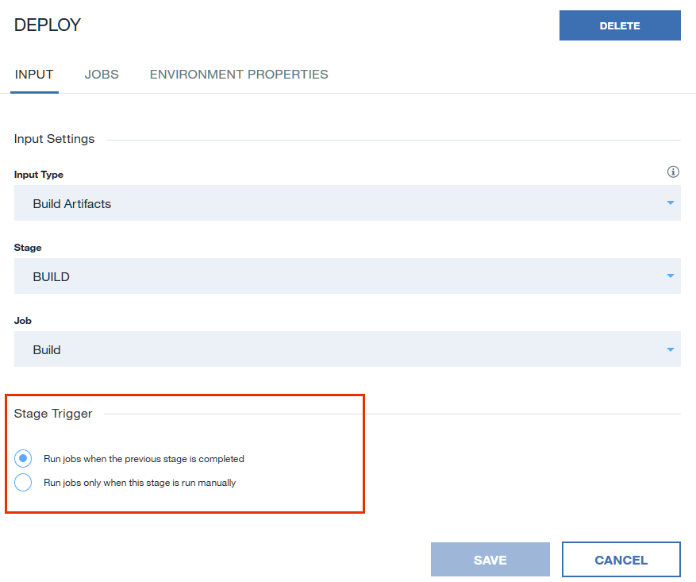
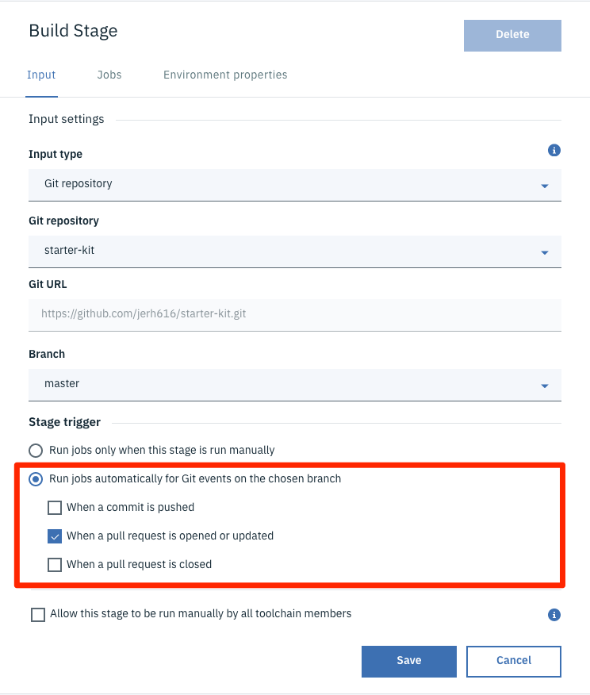
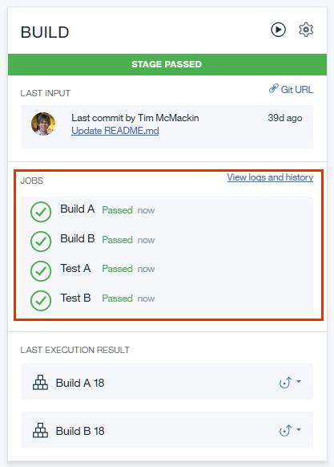
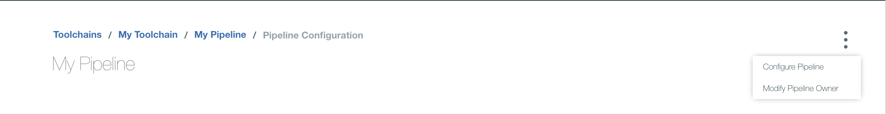
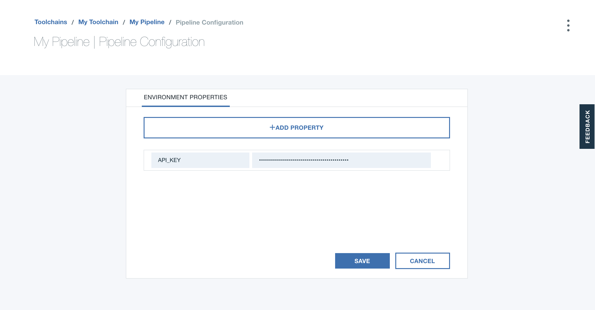
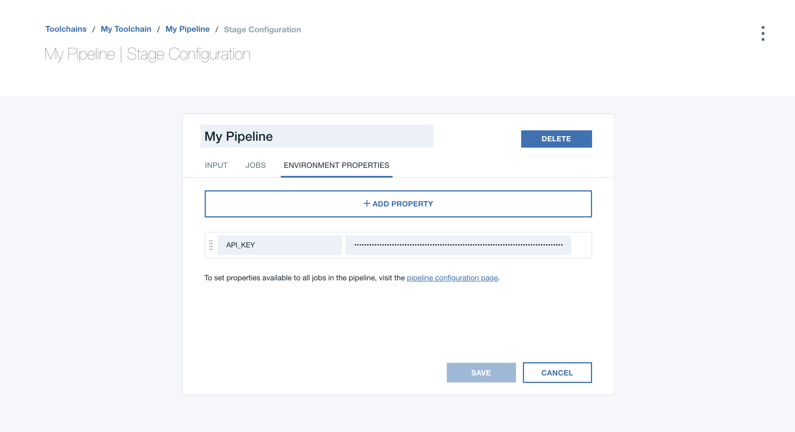
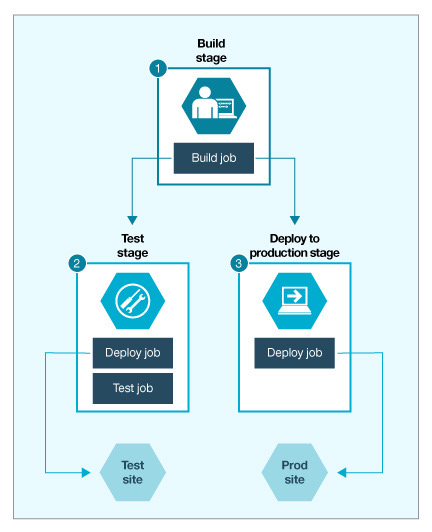

---

copyright:
  years: 2016, 2024
lastupdated: "2024-04-18"

keywords: run jobs, sequences of stages, job types, Delivery Pipeline, Classic

subcollection: ContinuousDelivery

---

{{site.data.keyword.attribute-definition-list}}


# Classic Delivery Pipeline overview
{: #deliverypipeline_about}

{{site.data.keyword.contdelivery_full}} includes the Classic Delivery Pipeline to build, test, and deploy in a repeatable way with minimal human intervention. In a pipeline, sequences of stages retrieve input and run jobs, such as builds, tests, and deployments.
{: shortdesc}

You can work with both Classic and Tekton delivery pipelines by using the browser, or by using the [{{site.data.keyword.cloud_notm}} CLI Developer Tools (`ibmcloud dev`) commands](/docs/cli?topic=cli-idt-cli). You can also work with Tekton delivery pipelines by using the [Tekton pipeline HTTP API and SDKs](https://cloud.ibm.com/apidocs/tekton-pipeline){: external}, or by using the [{{site.data.keyword.cloud_notm}} Terraform Provider](/docs/ContinuousDelivery?topic=ContinuousDelivery-terraform-setup). For more information about Tekton delivery pipelines, see [Working with Tekton pipelines](/docs/ContinuousDelivery?topic=ContinuousDelivery-tekton-pipelines#configure_tekton_pipeline).
{: tip}

Your permissions to view, modify, or run a pipeline are based on the access control for the toolchain that owns the pipeline. For more information about access control for toolchains, see [Managing access to toolchains in resource groups](/docs/ContinuousDelivery?topic=ContinuousDelivery-toolchains-iam-security).
{: important}

You can specify the scripts to run in many of the job types that are provided by the pipeline, giving you direct control over what is run by the job. These scripts run in a Docker image that contains a number of standard development tools, including tools that are required for interacting with the {{site.data.keyword.cloud_notm}} runtimes. For more information about what the standard Docker image contains, see [Preinstalled resources](/docs/ContinuousDelivery?topic=ContinuousDelivery-deliverypipeline_environment#deliverypipeline_environment). If your job requires development tools that are not available in the standard image, or you need different versions of those tools, you can use a custom image. For more information about custom images, see [Working with custom Docker images](/docs/ContinuousDelivery?topic=ContinuousDelivery-custom_docker_images#custom_docker_images).

When the pipeline runs scripts, properties that describe the context where the job is running are passed to the script by using environment variables. For example, the URL of the repo that is the input to the stage, the name of the stage and the job that is being run, the parameters specified by the job type, and so on. To view a list of the available environment variables, see [Preinstalled resources](/docs/ContinuousDelivery?topic=ContinuousDelivery-deliverypipeline_environment#deliverypipeline_environment).

You can define properties at both the pipeline level and the stage level. Pipeline properties are shared across all stages and jobs in a pipeline. Stage properties are unique to a particular stage, and shared across all jobs in that stage. For more information about properties, see [Environment properties (Environment variables)](/docs/ContinuousDelivery?topic=ContinuousDelivery-deliverypipeline_about#environment_properties).

## Stages
{: #deliverypipeline_stages}

Stages organize input and jobs as your code is built, deployed, and tested. Stages accept input from either source control repositories (SCM repositories) or build jobs in other stages. For SCM repositories, the input is the contents of a particular branch in the repository; for build jobs, the input is the artifacts that are produced by the job. When you create your first stage, the **INPUT** tab contains default settings.

When a stage runs, the stage’s input is passed to each of the jobs in the stage. Each job is given a clean container to run in. As a result, jobs within a stage cannot pass artifacts to each other. To pass artifacts within jobs, separate the jobs into two stages, and use the output from the job in the first stage as input to the second stage. Any build job can be passed as input to any other job in another stage. By default, the output is created in the `./` folder. If you don’t want output from a build job, configure a folder as output and don’t send any output to that folder.
{: tip}

Similar to how you can define pipeline properties, you can also define stage properties for use in all of the jobs in a particular stage. For example, you might define a `TEST_URL` property that passes a URL to the deploy and test jobs in a stage. The deploy job deploys to that URL and the test job tests the running app at the URL. Stage properties are also passed to job scripts by using environment variables. If the same property is defined at both the pipeline level and the stage level, the value of the stage property is used.

By default in a stage, builds and deployments are run automatically every time that changes are delivered to a project's SCM repository. Stages and jobs run serially; they enable flow control for your work. For example, you might place a test stage before a deployment stage. If the tests in the test stage fail, the deployment stage does not run.

The {{site.data.keyword.deliverypipeline}} uses public and private workers to run the jobs in a stage. By default, pipeline jobs are run by using public workers on IBM-managed public shared infrastructure. 

In certain scenarios, your {{site.data.keyword.deliverypipeline}} might require access to internal or on-premises resources. In these situations, you can connect to and integrate a {{site.data.keyword.deliverypipeline}} Private Worker to run on your own Kubernetes infrastructure. 

You might want tighter control of a specific stage. If you do not want a stage to run every time that a change occurs at its input, you can disable the capability. On the **INPUT** tab, in the Stage Trigger section, click **Run jobs only when this stage is run manually**.

{: caption="Input tab" caption-side="bottom"}

More stage trigger options are available for stages that use the Git repository input type. For example, you can choose to run jobs automatically for Git events on the chosen branch. When you choose this trigger type, you must select one or more of the following event types:

*	**When a commit is pushed** triggers when a push is made to the selected repo branch.
*	**When a pull/merge request is opened or updated** triggers when a pull request or merge request is opened or edited.
*	**When a pull/merge request is closed** triggers when a pull request or merge request is closed, even without an associated commit.

{: caption="Input tab triggers" caption-side="bottom"}

If you select the **When a pull/merge request is opened or updated** checkbox, the status of the pipeline is returned to the Git repo. When a pull request or merge request triggers your pipeline, an inline status check is displayed on the page. A status check is displayed for each of the stages that are run in your pipeline, and links to the logs and history for each stage are provided. As the status check runs, it updates from pending to either successful or failed. If your pipeline contains multiple stages, each stage reports its status in the check list.

This status feedback is also supported by the IBM hosted GitLab Community Edition tool for merge requests.
{: tip}

You can also restrict merging based on the results of the status checks by using Git branch protection rules. After a branch protection rule is created, all merging is blocked until all of the required status checks are successful. 

### Bitbucket Cloud pull requests
{: #bitbucket_pull_request_limitations}

Bitbucket Cloud currently does not support repository references for pull requests, which is required by the {{site.data.keyword.contdelivery_short}} service. This feature allows pull requests to be sent to the repo that you want to access by using references in the following format: `refs/pull/123/…` 

You can [locally fetch and check out a pull request](https://confluence.atlassian.com/bbkb/how-to-locally-fetch-and-checkout-a-pull-request-724402529.html){: external} by using the source repo URL. However, if the source repo is a private forked repo, the {{site.data.keyword.contdelivery_short}} service does not have the access that is required to manage pull requests. To work around this limitation, you must explicitly provide the required access to the forked repo in the pipeline script. 

In the following sample bash pipeline script, two users are using Bitbucket Cloud and they each have a private fork of their main repo (bitbucket.org/userA/repo-forked-A and bitbucket.org/userB/repo-forked-B). The script is set up to check out the pull request when a build job is triggered by a pull request open event or update event from one of the two forked repos.

```text
case "$BITBUCKET_PR_SOURCE_HOST" in       #BITBUCKET_PR_SOURCE_HOST is an environment exported by pipeline if job is triggered by a bitbucket pull request
  *userA*)                                #userA should be replaced to anything to identify a forked repo's url
    url="https://$username:$password@$BITBUCKET_PR_SOURCE_HOST"    #you need to provide username and password for repo-forked-A
    ;;
  *userB/repo-forked-B*)                  #userB/repo-forked-B should be replaced to anything to identify a forked repo's url
    url="https://$username1:password1@$BITBUCKET_PR_SOURCE_HOST"   #you need to provide username1 and password1 for repo-forked-B
    ;;
esac
git fetch $url $BITBUCKET_PR_SOURCE_BRANCH   #BITBUCKET_PR_SOURCE_BRANCH is an environment exported by pipeline if job is triggered by a bitbucket pull request
git checkout FETCH_HEAD
```

### Build stage
{: #build_stage}

The build stage specifies a **Builder type** to indicate how to build the artifacts.  

Many of the fields that are available in Build jobs are common across multiple Builder types.
{: tip}

The following Builder types are available:

| Builder type | Description | Supported job types|
|:-----------------|:-----------------|:-----------------|
| Simple | Archives the current stage's input without modification for use by future stages. Typically, this builder type is useful only when the stage's input is from an SCM repository.  |**Pipeline image version**: Runs in a container by using a built-in docker image that provides various built-in commands. To adopt newer versions of those commands, use a newer image version. |
| Ant | Uses Apache Ant files to manage the build job. | **Pipeline image version**: Runs in a container by using a built-in docker image that provides various built-in commands. To adopt newer versions of those commands, use a newer image version.  \n  \n **Build script**: Runs in a new Ubuntu shell whenever the job runs. In the script field, enter a script or reference scripts that are stored in your project’s source control.  \n  \n **Working directory**: Specifies the directory where the script is run.  \n  \n **Build archive directory**: Specifies the directory that contains the job's output to archive for use by a subsequent stage.  \n  \n **Enable test report**: Select this checkbox to specify that the build job runs tests that produce result files in JUnit XML format. A report based on the result files is displayed on the Tests tab of the Job Results page. If any tests fail, the job is marked as failed.  \n  \n **Enable code coverage report**: Select this checkbox to show more fields that you can use for the code coverage report. You can specify the Coverage runner (such as JaCoCo, and Cobertura), the location of the Coverage result file, and the Coverage result directory, relative to the Working directory. |
| Container registry | Builds docker images and uploads them to the IBM Cloud Container Registry. | **Pipeline image version**: Runs in a container by using a built-in docker image that provides various built-in commands. To adopt newer versions of those commands, use a newer image version.  \n  \n **API key**: The IBM Cloud API key to use to provide permissions to account resources.  \n  \n **Container Registry namespace**: The namespace where you want to store your built image.  \n  \n **Docker image name**: The name of the image that this job builds and uploads to the IBM Cloud Container Registry.  \n  \n **Build script**: Runs in a new Ubuntu shell whenever the job runs. In the script field, enter a script or reference scripts that are stored in your project’s source control.  \n  \n **Working directory**: Specifies the directory where the script is run.  \n  \n **Build archive directory**: Specifies the directory that contains the job's output to archive for use by a subsequent stage.  \n  \n **Enable test report**: Select this checkbox to specify that the build job runs tests that produce result files in JUnit XML format. A report based on the result files is displayed on the Tests tab of the Job Results page. If any tests fail, the job is marked as failed.  \n  \n **Enable code coverage report**: Select this checkbox to show more fields that you can use for the code coverage report. You can specify the Coverage runner (such as JaCoCo, and Cobertura), the location of the Coverage result file, and the Coverage result directory, relative to the Working directory. |
| Custom Docker image | Builds by using your custom docker image with fine-grained control over the versions of node, Java&trade;, or other tools. | **Docker image name**: The name of the image that this job builds and uploads to the IBM Cloud Container Registry.  \n  \n **Build script**: Runs in a new Ubuntu shell whenever the job runs. In the script field, enter a script or reference scripts that are stored in your project’s source control.  \n  \n **Build archive directory**: Specifies the directory that contains the job's output to be archived for use by a subsequent stage.  \n  \n **Enable test report**: Select this checkbox to specify that the build job runs tests that produce result files in JUnit XML format. A report based on the result files is displayed on the Tests tab of the Job Results page. If any tests fail, the job is marked as failed.  \n  \n **Enable code coverage report**: Select this checkbox to show more fields that you can use for the code coverage report. You can specify the Coverage runner (such as JaCoCo, and Cobertura), the location of the Coverage result file, and the Coverage result directory, relative to the Working directory. |
| Gradle| Builds by using Gradle. | **Pipeline image version**: Runs in a container by using a built-in docker image, which provides various built-in commands. To adopt newer versions of those commands, use a newer image version.  \n  \n **Build script**: Runs in a new Ubuntu shell whenever the job runs. In the script field, enter a script or reference scripts that are stored in to your project’s source control.  \n  \n **Working directory**: Specifies the directory where the script is run.  \n  \n **Build archive directory** - Specifies the directory that contains the job's output to be archived for use by a subsequent stage.  \n  \n **Enable test report**: Select this checkbox to specify that the build job runs tests that produce result files in JUnit XML format. A report based on the result files is displayed on the Tests tab of the Job Results page. If any tests fail, the job is marked as failed.  \n  \n **Enable code coverage report**: Select this checkbox to show more fields that you can use for the code coverage report. You can specify the Coverage runner (such as JaCoCo, and Cobertura), the location of the Coverage result file, and the Coverage result directory, relative to the Working directory.|
| Grunt | Builds by using Grunt. | **Pipeline image version**: Runs in a container by using a built-in docker image that provides various built-in commands. To adopt newer versions of those commands, use a newer image version.  \n  \n **Build script**: Runs in a new Ubuntu shell whenever the job runs. In the script field, enter a script or reference scripts that are stored in to your project’s source control.  \n  \n **Working directory**: Specifies the directory where the script is run.  \n  \n **Build archive directory**: Specifies the directory that contains the job's output to archive for use by a subsequent stage.  \n  \n **Enable test report**: Select this checkbox to specify that the build job runs tests that produce result files in JUnit XML format. A report based on the result files is displayed on the Tests tab of the Job Results page. If any tests fail, the job is marked as failed.  \n  \n **Enable code coverage report**: Select this checkbox to show more fields that you can use for the code coverage report. You can specify the Coverage runner (such as JaCoCo, and Cobertura), the location of the Coverage result file, and the Coverage result directory, relative to the Working directory. |
| Maven | Builds by using Apache Maven. | **Pipeline image version**: Runs in a container by using a built-in docker image, which provides various built-in commands. To adopt newer versions of those commands, use a newer image version.  \n  \n **Build script**: Runs in a new Ubuntu shell whenever the job runs. In the script field, enter a script or reference scripts that are stored in to your project’s source control.  \n  \n **Working directory**: Specifies the directory where the script is run.  \n  \n **Build archive directory**: Specifies the directory that contains the job's output to archive for use by a subsequent stage.  \n  \n **Enable test report**: Select this checkbox to specify that the build job runs tests that produce result files in JUnit XML format. A report based on the result files is displayed on the Tests tab of the Job Results page. If any tests fail, the job is marked as failed.  \n  \n **Enable code coverage report**: Select this checkbox to show more fields that you can use for the code coverage report. You can specify the Coverage runner (such as JaCoCo, and Cobertura), the location of the Coverage result file, and the Coverage result directory, relative to the Working directory. |
| npm | Installs dependencies with the Node package manager.  | **Pipeline image version**: Runs in a container by using a built-in docker image, which provides various built-in commands. To adopt newer versions of those commands, use a newer image version.  \n  \n **Build script**: Runs in a new Ubuntu shell whenever the job runs. In the script field, enter a script or reference scripts that are stored in your project’s source control.  \n  \n **Working directory**: Specifies the directory where the script is run.  \n  \n **Build archive directory**: Specifies the directory that contains the job's output to archive for use by a subsequent stage.  \n  \n **Enable test report**: Select this checkbox to specify that the build job runs tests that produce result files in JUnit XML format. A report based on the result files is displayed on the Tests tab of the Job Results page. If any tests fail, the job is marked as failed.  \n  \n **Enable code coverage report**: Select this checkbox to show more fields that you can use for the code coverage report. You can specify the Coverage runner (such as JaCoCo, and Cobertura), the location of the Coverage result file, and the Coverage result directory, relative to the Working directory. |
| Shell script | Runs a UNIX shell script, such as Bash. | **Pipeline image version**: Runs in a container by using a built-in docker image, which provides various built-in commands. To adopt newer versions of those commands, use a newer image version.  \n  \n **Build script**: Runs in a new Ubuntu shell whenever the job runs. In the script field, enter a script or reference scripts that are stored in to your project’s source control.  \n  \n **Working directory**: Specifies the directory where the script is run.  \n  \n **Build archive directory**: Specifies the directory that contains the job's output to archive for use by a subsequent stage.  \n  \n **Enable test report**: Select this checkbox to specify that the build job runs tests that produce result files in JUnit XML format. A report based on the result files is displayed on the Tests tab of the Job Results page. If any tests fail, the job is marked as failed.  \n  \n **Enable code coverage report**: Select this checkbox to show more fields that you can use for the code coverage report. You can specify the Coverage runner (such as JaCoCo, and Cobertura), the location of the Coverage result file, and the Coverage result directory, relative to the Working directory. |
| Gradle (Artifactory, Nexus, or SonarQube) | Builds and deploys by using Gradle with a Nexus or Artifactory repository. Gradle also integrates with SonarQube. | **Pipeline image version**: Runs in a container by using a built-in docker image, which provides various built-in commands. To adopt newer versions of those commands, use a newer image version.  \n  \n **Repository tool integration instance**: The name of the repository tool integration instance to use with this build job.  \n  \n **Repository tool integration type**: The type of tool integration to get Gradle information from.  \n  \n **SonarQube integration instance**: The name of the SonarQube integration instance to use with this build job.  \n  \n **Build command**: The build command to run whenever the job runs. In the **Script** field, enter a script or reference scripts that are stored in your project’s source control.  \n  \n **Working directory**: Specifies the directory where the script is run.  \n  \n **Build archive directory**: Specifies the directory that contains the job's output to archive for use by a subsequent stage. |
| Maven (Artifactory, Nexus, or SonarQube) | Builds and deploys by using Maven with a Nexus or Artifactory repository. Maven also integrates with SonarQube. |   **Pipeline image version**: Runs in a container by using a built-in docker image, which provides various built-in commands. To adopt newer versions of those commands, use a newer image version.  \n  \n **Repository tool integration instance**: Name of the repository tool integration instance to use with this build job.  \n  \n **Repository tool integration type**: Type of tool integration to get Gradle information from.  \n  \n **SonarQube integration instance**: Name of the SonarQube integration instance to use with this build job.  \n  \n **Build command**: Build command to run whenever the job runs. In the script field, enter a script or reference scripts that are stored in your project’s source control.  \n  \n **Working directory**: Specifies the directory where the script is run.  \n  \n **Build archive directory**: Specifies the directory that contains the job's output to archive for use by a subsequent stage.|
| npm (Artifactory or Nexus) | Builds by using npm with a Nexus or Artifactory repository. | **Pipeline image version**: Runs in a container by using a built-in docker image, which provides various built-in commands. To adopt newer versions of those commands, use a newer image version.  \n  \n **Repository tool integration instance**: The name of the repository tool integration instance to use with this build job.  \n  \n **Repository tool integration type**: The type of tool integration to get Gradle information from.   \n  \n **SonarQube integration instance**: The name of the SonarQube integration instance to use with this build job.  \n  \n **Build command**: The build command to run whenever the job runs. In the **Script** field, enter a script or reference scripts that are stored in your project’s source control.  \n  \n **Increment snapshot module version**: Supports continuous delivery by incrementing the module version locally based on the contents of the `package.json` file and the current reported snapshot in the npm registry at the publish step.  \n  \n **Working directory**: Specifies the directory where the script is run.  \n  \n **Build archive directory**: Specifies the directory that contains the job's output to archive for use by a subsequent stage. |
{: caption="Builder types" caption-side="top"}


### Deploy stage
{: #deploy_stage}

The deploy stage specifies input from a Build stage. The jobs in the deploy stage specify a **Deployer type**. The following Deployer types are available:

| Deployer type | Description | Supported job types|
|:-----------------|:-----------------|:-----------------|
| Custom Docker image | Deploys by using your custom Docker image with fine-grained control over the versions of node, Java&trade;, or other tools. | **Pipeline image version**: Runs in a container by using a built-in docker image that provides various built-in commands. To adopt newer versions of those commands, use a newer image version.  \n  \n **API key**: The IBM Cloud API key to use to provide permissions to account resources.  \n  \n **Docker image name**: The name of the image that this job builds and uploads to the IBM Cloud Container Registry.  \n  \n **Deploy script**: Deploy command to run whenever the job runs. In the script field, enter a script or reference scripts that are stored in your project’s source control.|
| Kubernetes | Deploys applications to Kubernetes clusters, such as those found within the IBM Cloud Container Service. | **Pipeline image version**: Runs in a container by using a built-in docker image that provides various built-in commands. To adopt newer versions of those commands, use a newer image version.  \n  \n **API key**: The IBM Cloud API key to use to provide permissions to account resources.  \n  \n **Cluster name**: Name of the Kubernetes cluster; the platform that you deploy your Kubernetes components on.  \n  \n **Deploy script**: Deploy command to run whenever the job runs. In the script field, enter a script or reference scripts that are stored in your project’s source control.|
{: caption="Deployer types" caption-side="top"}


### Test stage
{: #test_stage}

The test stage specifies the test configuration. The jobs in the test stage specify a **Tester type**. The following Tester types are available:

| Tester type | Description | Supported job types|
|:-----------------|:-----------------|:-----------------|
| Simple | Launches a shell command to run the automated tests, with an optional test report.  | **Pipeline image version**: Not used.  \n  \n **Test script**: Test command to run whenever the job runs. In the script field, enter a script or reference scripts that are stored in your project’s source control.  \n  \n **Working directory**: The directory where the test script is run.  \n  \n **Enable test report**: Not used.  \n  \n **Enable code coverage report**: Not used. |
| Custom Docker image | Tests by using your custom Docker image with fine-grained control over the versions of node, Java&trade;, or other tools. | **Docker image name**: The name of the Docker image to run the job with. To make sure that your jobs run in a clean context, run them in Docker containers.  \n  \n **Test script**: Test command to run whenever the job runs. In the script field, enter a script or reference scripts that are stored in your project’s source control.  \n  \n **Working directory**: The directory where the test script is run.  \n  \n **Enable test report**: Not used.  \n  \n **Enable code coverage report**: Not used.|
| Vulnerability Advisor | Runs a compliance and vulnerability check against the specified image, and displays the results. If any issues are found, this stage fails. | **Pipeline image version**: Runs in a container by using a built-in docker image that provides various built-in commands. To adopt newer versions of those commands, use a newer image version.  \n  \n **API key**: The IBM Cloud API key to use to provide permissions to account resources.  \n  \n **Container Registry namespace**: The namespace where your built image is stored.  \n  \n **Docker image name**: The name of the Docker image to run the job with. To make sure that your jobs run in a clean context, run them in Docker containers.  \n  \n **Docker image tag**: A tag for the Docker image that is displayed in the IBM Cloud Container Registry.  \n  \n **Test script**: Test command to run whenever the job runs. In the script field, enter a script or reference scripts that are stored in your project’s source control.  \n  \n **Working directory**: The directory where the test script is run.  \n  \n **Enable test report**: Not used.  \n  \n **Enable code coverage report**: Not used.|
| Sauce Labs | Runs JavaScript, Node, or Java&trade; tests by using Sauce Labs. | **Pipeline image version**: Runs in a container by using a built-in docker image that provides various built-in commands. To adopt newer versions of those commands, use a newer image version.  \n  \n **Service instance**: Select a configuration instance or create one.|
{: caption="Tester types" caption-side="top"}


### Deprecated job types
{: #deprecated_job_types}

Several job types, such as the IBM Globalization Pipeline Build job, the Space Shell Test job, and the DevOps Insights Gate Test job are deprecated. Although these job types are deprecated, you might still be able to load them in the UI, with an indicator that the job type is deprecated. Alternatively, your job might revert to another job type that is still supported, with a warning notification.

If you need to use the configuration from a deprecated job type, use one of the following methods to access the pipeline configuration.

* Use the IBM Cloud Devtool:

   `ic dev pipeline-get 7325f511-492a-4c35-a388-5e499e65d6bb -output JSON`

* Use the {{site.data.keyword.deliverypipeline}} API:

   ```curl
   curl --location --request GET 'https://devops-api.us-south.devops.cloud.ibm.com/v1/pipeline/pipelines/7325f511-492a-4c35-a388-5e499e65d6bb/stages' \
   --header 'Authorization: Bearer <IAM Bearer token>
   ```

* From the **Network** tab of the {{site.data.keyword.deliverypipeline}} UI, filter by the pipeline ID to locate the pipeline that contains the deprecated job type data. 

### API keys
{: #api_keys}

Some of the standard pipeline jobs use {{site.data.keyword.cloud_notm}} API keys to access services, such as deploying to Kubernetes. The [{{site.data.keyword.cloud_notm}} Identity and Access Management (IAM)](/docs/account?topic=account-iamoverview) service provides two types of API keys:

* **user API keys**: These API keys provide full access to all of the services and resources that the user has access to.
* **service API keys**: You can configure service API keys to provide specific access to various services and resources.

Some services cannot use service ID API keys. In such cases, the pipeline user interface prompts you to specify a user API key.
{: tip}

Because pipeline jobs run user-created scripts that might use service API keys in arbitrary ways, the pipeline cannot determine the set of restrictions to apply to a particular key. In such cases, if you request that the pipeline creates an API key, it creates a user API key. To maintain strong security, instead use a service API key with access that is restricted to only the services and resources that you need in the script. In this instance, you must create the API key yourself. For more information about creating an API key, see [{{site.data.keyword.cloud_notm}} API keys](/docs/account?topic=account-userapikey&interface=ui).

## Jobs
{: #deliverypipeline_jobs}

A job is an execution unit within a stage. A stage can contain multiple jobs, and the jobs in a stage run sequentially. By default, if a job fails, subsequent jobs in the stage do not run.

{: caption="Build and test jobs within a stage" caption-side="bottom"}

Jobs run in discrete working directories within Docker containers that are created for each pipeline run. Before a job is run, its working directory is populated with input that is defined at the stage level. For example, you might have a stage that contains a test job and a deploy job. If you install dependencies on one job, they are not available to the other job. However, if you make the dependencies available in the stage's input, they are available to both jobs.

Except for Simple-type build jobs, when you configure a job, you can include UNIX shell scripts that include build, test, or deployment commands. Because jobs are run in ad hoc containers, the actions of one job cannot affect the run environments of other jobs, even if those jobs are part of the same stage.

Sample build and deploy scripts can be found in [https://github.com/open-toolchain/commons](https://github.com/open-toolchain/commons){: external}.

Additionally, pipeline jobs can run only the following commands as `sudo`:

* `/usr/sbin/service`
* `/usr/bin/apt-get`
* `/usr/bin/apt-key`
* `/usr/bin/dpkg`
* `/usr/bin/add-apt-repository`
* `/opt/IBM/node-v0.10.40-linux-x64/npm`
* `/opt/IBM/node-v0.12.7-linux-x64/npm`
* `/opt/IBM/node-v4.2.2-linux-x64/npm`
* `/usr/bin/Xvfb`
* `/usr/bin/pip`


After a job runs, the container that was created for it is discarded. The results of a job run can persist, but the environment in which it ran does not.

Jobs can run for up to 60 minutes. When jobs exceed that limit, they fail. If a job is exceeding the limit, break it into multiple jobs. For example, if a job performs three tasks, you might break it into three jobs: one for each task.
{: tip}

To learn how to add a job to a stage, see [Adding a job to a stage](/docs/ContinuousDelivery?topic=ContinuousDelivery-deliverypipeline_build_deploy#deliverypipeline_add_job).

### Build jobs
{: #build_jobs}

Build jobs compile your project in preparation for deployment. They generate artifacts that can be sent to a build archive directory, although by default, the artifacts are placed in the project's root directory.

Jobs that take input from build jobs must reference build artifacts in the same structure that they were created in. For example, if a build job archives build artifacts to an `output` directory, a deploy script would refer to the `output` directory rather than the project root directory to deploy the compiled project. You can specify the directory to archive by entering the directory name in the **Build Archive Directory** field. Leaving the field blank archives the root directory.

If you use the **Simple** builder type, your code is not compiled or built; it is packaged and made available for future stages.
{: tip}

### Deploy jobs
{: #deploy_jobs}

Deploy jobs upload your project to {{site.data.keyword.cloud_notm}} as an app and are accessible from a URL. After a project is deployed, you can find the deployed app on your {{site.data.keyword.cloud_notm}} dashboard.

Deploy jobs can deploy new apps or update existing apps. Even if you first deployed an app by using another method, you can update the app by using a deploy job. To update an app, in the deploy job, use that app's name.

You can deploy to one or many regions and services. For example, you can set up your {{site.data.keyword.deliverypipeline}} to use one or more services, test in one region, and deploy to production in multiple regions.

### Test jobs
{: #test_jobs}

If you want to require that conditions are met, include test jobs before or after your build and deploy jobs. You can customize test jobs to be as simple or complex as you need. For example, you might issue a cURL command and expect a particular response. You might also run a suite of unit tests or run functional tests with third-party test services, such as Sauce Labs.

If your tests produce result files in JUnit XML format, a report that is based on the result files is shown on the **Tests** tab of every test result page. If a test fails, the job also fails.

## Environment properties (Environment variables)
{: #environment_properties}

A set of predefined environment properties provides access to information about the job's execution environment. For a complete list of the predefined environment properties, see [Environment properties and resources](/docs/ContinuousDelivery?topic=ContinuousDelivery-deliverypipeline_environment).

You can also define your own environment properties. For example, you might define an `API_KEY` property that passes an API key that is used to access {{site.data.keyword.Bluemix_notm}} resources by all scripts in the pipeline.

You can add the following types of properties:

* **Text**: A property key with a single-line value.
* **Text Area**: A property key with a multi-line value. A base64 version of each text area property value is also available. You can access this version by using the property key name with a trailing `_base641` suffix. You can decode the base64 version of a Text Area property and echo it by typing `echo "$(echo $multi_base64 | base64 -d)"`, where `multi` is the property key name you defined and `multi_base64` is the additional property that is provided. The pipeline base image contains built in support to manage multi-line encoding transparently. However, if you use a custom image you must append the `_base64` suffix property to prevent issues where your value is truncated by a line-ending.
* **Secure**: A property key with a single-line value that is secured with AES-128 encryption. The value is displayed as asterisks.
* **Properties**: A file in the project's repository. This file can contain multiple properties. Each property must be on its own line. To separate key-value pairs, use the equals sign (=). Enclose all string values in quotation marks. For example, `MY_STRING="SOME STRING VALUE"`.

You can examine the environment properties for a pipeline job by running the `env` command in the job's script.
{: tip}

### Pipeline properties
{: #define_pipeline_properties}

To define pipeline properties, from the overflow menu on the Pipeline page, select **Configure Pipeline**.

{: caption="Pipeline overflow menu" caption-side="bottom"}

From the **ENVIRONMENT PROPERTIES** tab on the Pipeline configuration page, set the pipeline-level environment properties.

{: caption="Pipeline properties page" caption-side="bottom"}

### Stage properties
{: #pipeline_stage_properties}

To define stage properties, open the Stage configuration page and click the **ENVIRONMENT PROPERTIES** tab.

{: caption="Stage properties page" caption-side="bottom"}

You can define a stage property by using an initial value (or a blank value), and then overriding that value in a job by exporting an environment variable. By overriding the initial value, subsequent jobs in the stage can see the new value. For example, you can include the following command to set the `$API_KEY` property and make it available to another job within the stage: `export API_KEY=<insert API key here>`
{: tip}

### Computed properties
{: #computed_properties}

You can compute the environment property values that are shared across stages by creating a `build.properties` file while the stage is running, and then have the next stage run the file. For example, your build job might include the following command in the build script:

`echo "IMAGE_NAME=${FULL_REPOSITORY_NAME}" >> $ARCHIVE_DIR/build.properties`

All jobs start by running the `build.properties` file, if it exists.

## Creating and using artifacts
{: #artifacts}

Build jobs automatically fetch the content in the current folder where the user script is run.  If you do not need the entire git repo content for later deployment, it is preferable that you configure an explicit output directory and then copy or create the relevant artifacts there.  Job scripts are run in the build result (output directory).

Deploy jobs that deploy to the {{site.data.keyword.containerlong_notm}} need to specify the Platform API key of a user under whose authority jobs run, a Dockerfile, and optionally a Helm chart.  

The job script runs after the job has logged in to the target environment by using the Platform API key that is assigned to it (so that you can run `cf push`  or `kubectl` commands in the script).

## An example pipeline
{: #deliverypipeline_example}

A simple pipeline might contain three stages:

1. A Build stage that compiles and runs build processes on an app.
2. A Test stage that deploys an instance of the app and then runs tests on it.
3. A Prod stage that deploys a production instance of the tested app.

This pipeline is shown in the following conceptual diagram:

{: caption="Conceptual model of a three-stage pipeline" caption-side="bottom"}

Stages take their input from repositories and build jobs, and jobs within a stage run sequentially and independently of each other. In the example pipeline, the stages run sequentially, even though the Test and Prod stages both take the Build stage's output as their input.
