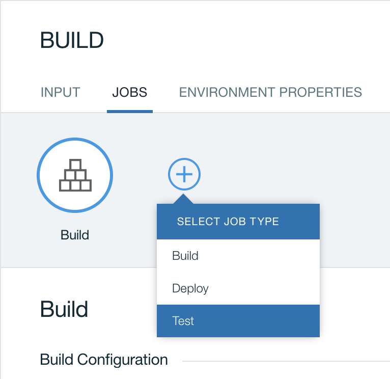
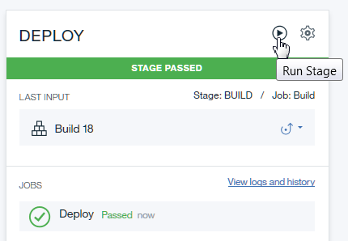
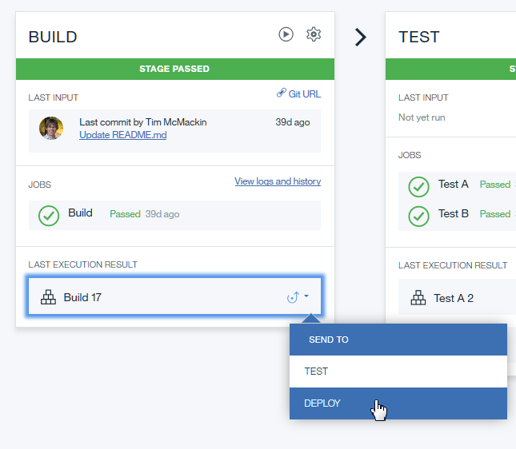

---

copyright:
  years: 2016, 2020
lastupdated: "2020-07-22"

keywords: ADD STAGE, Run Stage icon, JOBS tab, Delivery Pipeline

subcollection: ContinuousDelivery

---
<!-- Copyright info at top of file: REQUIRED
    The copyright info is YAML content that must occur at the top of the MD file, before attributes are listed.
    It must be surrounded by 3 dashes.
    The value "years" can contain just one year or a two years separated by a comma. (years: 2014, 2016)
    Indentation as per the previous template must be preserved.
-->

{:shortdesc: .shortdesc}
{:codeblock: .codeblock}
{:pre: .pre}
{:screen: .screen}
{:tip: .tip}
{:download: .download}

# Building and deploying
{: #deliverypipeline_build_deploy}

{{site.data.keyword.contdelivery_full}} includes Delivery Pipeline, which you can use to implement a repeatable continuous integration and continuous delivery process.
{:shortdesc}

Complete the following tasks to configure a pipeline.

## Adding a stage
{: #deliverypipeline_add_stage}

1. On the Pipeline page, click **ADD STAGE**. The Stage Configuration page opens.
2. Configure the stage.
  1. On the **INPUT** tab, select an input for the stage.  For Build stages, the input tab includes a **Branch** field to specify the branch in the repo to use for input.
  2. On the **JOBS** tab, add and configure at least one job. The first stage usually has at least a build job.
3. Click **SAVE**.

## Adding a job to a stage
{: #deliverypipeline_add_job}

1. On the stage, click the **Stage Configuration** icon, and then click **Configure Stage**.
2. Click the **JOBS** tab.
3. Click **ADD JOB**. Select the type of job to add.
4. Configure the job.
5. Click **SAVE**.



## Running a stage
{: #deliverypipeline_run_stage}

You can manually run a stage by clicking the **Run Stage** icon on the Pipeline page.



You can also request on-demand builds and deployments from the build history page in one of two ways:
* Drag a build to the box that is under a configured stage.
* In the LAST EXECUTION RESULT section, click the **Send to** icon and then select a space to deploy to.
  

To cancel a running stage, on the stage, click **View logs and history**. In the list of jobs, click the running job's number and then click **CANCEL**. You can also cancel jobs individually by clicking a job and then clicking **CANCEL**, or by clicking the **Stop** icon for a job on its stage.

## Deploying an app
{: #deliverypipeline_deploy}

A properly configured deploy job deploys your app to your target whenever the job is run. To manually run a deploy job, click the **Run Stage** icon of the stage that the job is in.

### Input revisions
{: #deliverypipeline_input_revisions}

When you run a stage manually, or if it runs because the stage before it is completed, the running stage selects its input revision. Usually, the input revision is a build number. To select the input revision, the stage follows these conditions:

* If a specific revision is selected, use it.
* If a specific revision is not specified, search previous stages until a stage is found that uses the same input. Find and use the last successfully run revision of that input.
* If a specific revision is not specified and no other stages use the specified source as input, use the latest revision of the input.

You can deploy a previous build. On the stage that contains the build, click **View logs and history**. On the page that opens, click to expand the run number and then click the build job. Click **SEND TO**, and select a target.
{: tip}

### Adding services to apps
{: #deliverypipeline_add_services}

You can add services to your apps and manage those services from your {{site.data.keyword.Bluemix_notm}} dashboard or the Cloud Foundry command line interface (CLI). You can also issue Cloud Foundry CLI commands in scripts for pipeline jobs. For example, you can add a service to an app in the script of a deploy job. For more information about adding services, see [Connecting services to external apps](/docs/account?topic=account-externalapp).

## Viewing logs
{: #deliverypipeline_view_logs}

You can view the logs for jobs and view stages as they are running on the Stage History page.

1. To view a job's log, click the job. Alternatively, on a stage, click **View logs and history**.

2. To view the runtime log of a deployed application, click **View runtime log**.

In addition to job logs, you can view unit test results, generated artifacts, and code changes for any build job.

You can also run, redeploy, cancel, or configure a stage from the Stage History page. Click **RUN** to run the stage, **REDEPLOY** to redeploy if it is a deployment job, or **CONFIGURE** to configure a stage. While a stage is running, you can cancel it by clicking the run number and then clicking **CANCEL**.

### Downloading logs from a script
{: #deliverypipeline_download_logs}

You can download the log file for a pipeline job from a script and save the `PIPELINE_LOG_URL` that is provided while the pipeline job is running. The following example shows the steps to upload the pipeline job's log file to a different system.


1. Set up a `JOB_LOG` environment property for your stage.

1. In your pipeline job, save the `PIPELINE_LOG_URL`.

   ```shell
   export JOB_LOG="$PIPELINE_LOG_URL"
   ```
1. Use the `PIPELINE_LOG_URL` in a later job within the same stage to download the log file to export it to a different system. Use an IBM Cloud bearer token to access the log file.

   ```shell
   ibmcloud login -a cloud.ibm.com \
     --apikey <INSERT API KEY HERE>

   BEARER=$( ibmcloud iam oauth-tokens | grep "IAM token" | sed 's/^.*Bearer //g' )

   curl -H "Authorization: Bearer $BEARER"  \
     -H "Accept: text/plain" \
     -D /tmp/headers.txt \
     -o job_log.txt \
     "$JOB_LOG"
   ```
1. Check the `X-More-Data` header. If the header is set to `true`, the log file is being generated or processed. If the header is set to `false`, the log file is ready for use.

   ```shell
   grep X-More-Data /tmp/headers.txt
   X-More-Data: false
   ```
1. Upload the log file to your system.

   ```shell
   scp job_log.txt user@example.org:/job1/logs
   ```


### Downloading artifacts from a script
{: #deliverypipeline_download_artifacts}

You can download the artifacts for a pipeline Build job from a script and save the `PIPELINE_ARTIFACT_URL` that is provided while the pipeline job is running. The following example shows the steps to upload the pipeline job's artifacts to a different system.


1. Set up a `JOB_ARTIFACT` environment property for your stage.

1. In your pipeline job, save the `PIPELINE_ARTIFACT_URL`.

   ```shell
   export JOB_ARTIFACT="$PIPELINE_ARTIFACT_URL"
   ```
   
1. Use the `PIPELINE_ARTIFACT_URL` in a later job within the same stage to download the artifacts to export them to a different system. Use an IBM Cloud bearer token to access the artifacts.

   ```shell
   ibmcloud login -a cloud.ibm.com \
     --apikey <INSERT API KEY HERE>

   BEARER=$( ibmcloud iam oauth-tokens | grep "IAM token" | sed 's/^.*Bearer //g' )

   DOWNLOAD_URL=$( curl -H "Authorization: Bearer $BEARER"  \
     "$JOB_ARTIFACT" )

   curl -O  "$DOWNLOAD_URL"
   ```
   
1. Upload the artifacts to your system.

   ```shell
   scp $(basename "$DOWNLOAD_URL") user@example.org:/job1/artifacts
   ```
