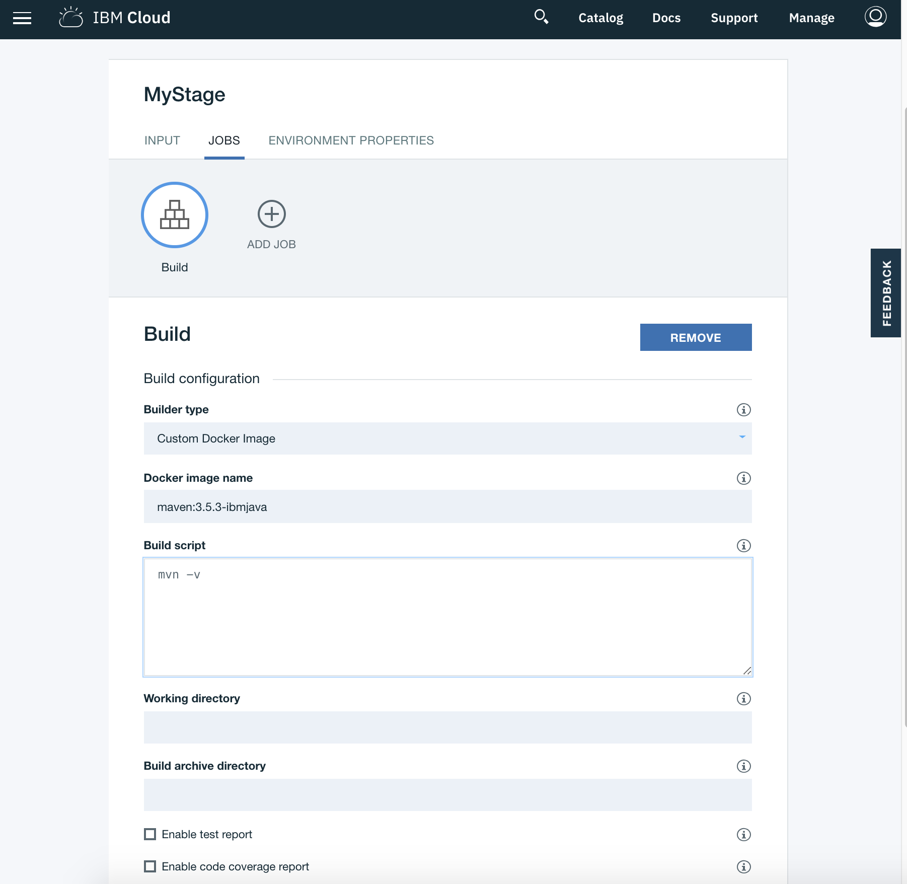
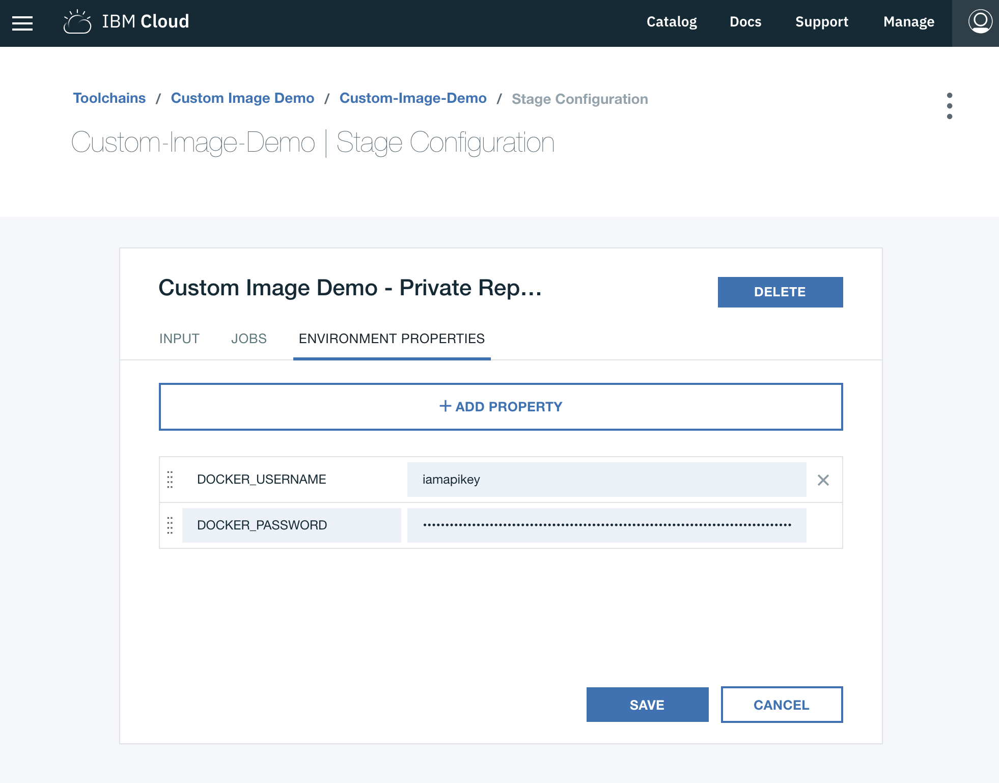

---

Copyright:
  years: 2018, 2021
lastupdated: "2021-02-24"

keywords: pipeline base image, custom Docker image, private image registry 

subcollection: ContinuousDelivery

---

{:shortdesc: .shortdesc}
{:external: target="_blank" .external}
{:codeblock: .codeblock}
{:pre: .pre}
{:screen: .screen}
{:tip: .tip}
{:note: .note}
{:important: .important}
{:download: .download}

# Working with custom Docker images
{: #custom_docker_images}

On 20 November 2020, Dockerhub introduced rate-limiting on anonymous image pulls. This change might impact users that are running jobs by using Dockerhub-hosted custom images.
{: important}

The pipeline base image might not support all of your build's requirements. For example, you might need more fine-grained control over the versions of node, java, or other tools. You can address this issue by including a first step in your pipeline jobs that installs a series of new packages and carefully configures environment variables, such as `PATH`, to set up your
environment. However, a better approach is to use the pipeline's support for running a "Custom Docker Image" as the basis for your job.

Custom Docker image support in the pipeline is used only to provide an image that a specific pipeline job uses while it is running. For example, you can provide an image that contains custom tools that are required by the script that the job runs. After the job completes, the container that it was running in is torn down.
{: important}

Whether you are using a Build, Test, or Deploy job type, you can select a Custom Docker Image subtype to provide the Docker image name to use and specify the script to run. For example, use the following options to run a Build job with Maven 3.5.3 and IBM Java:

 

## Specifying the Docker image name
{: #docker_image_name}

The Docker image name in custom Docker image jobs is designed to work in the same way that image names work with the Docker CLI. The format of a Docker image name is: `[repository][:][tag]`. For example, for `docker run maven:3.5.3-ibmjava`, the Docker image name is `maven:3.5.3-ibmjava`, where `maven` is the repository and `3.5.3-ibmjava` is the tag. There are no restrictions on the Docker image name that you can use; any valid docker image works.

If the **Docker image name** field is not completed, the standard pipeline base image is used. 
{: tip}

By default, your repository on [Docker Hub](https://hub.docker.com/){: external} is searched. If you use another Docker registry, such as {{site.data.keyword.registrylong}}, you can use the full DNS name. You can also use the fully qualified name for images on Docker Hub. For example, `registry.hub.docker.com/library/maven:3.5.3-ibmjava`.

The `tag` for a Docker image is optional. If you do not specify a tag, by default it is set to `latest`. A default value of `latest` is just a tag name that the repository owner must manage. It does not mean that chronologically this Docker image is the latest image.

You can find a large community of repositories at Docker Hub. IBM hosts a number of public repositories that the IBM Cloud team uses at [https://hub.docker.com/u/ibmcom/](https://hub.docker.com/u/ibmcom/){: external}. The `ibmcom/ibmjava` and `ibmcom/ibmnode` repositories are useful to build on. 

## Using a private image registry
{: #private_image_registry}

If you are using a private registry that requires authentication, you must set two extra stage environment properties: `DOCKER_USERNAME` and `DOCKER_PASSWORD`. You can use a secure property to mask your `DOCKER_PASSWORD`. Before your image is pulled, the custom Docker image job uses your user name and password credentials to complete a `docker login`.

For most registries, you can use the user name and password that were provided to you. If you use {{site.data.keyword.registrylong_notm}} to store your private images, you must use a platform API Key for authentication. 

1. [Request a platform API key](https://cloud.ibm.com/iam/#/apikeys){: external} and make sure that you save the key. 
1. Create the two stage environment properties by using `iamapikey` for your `DOCKER_USERNAME` and the platform API Key that you saved for the `DOCKER_PASSWORD`.

 

## Specifying the script
{: #specify_script}

You can use the **script** block in custom Docker image jobs to create a script file that runs in a task folder,
similar to how regular pipeline jobs work. 

`ENTRYPOINT` and `CMD` from your Docker image's Dockerfile are overridden and are not called. In some cases that might mean that you need to add initialization steps to your script.
{: tip}

Custom Docker image jobs give you greater flexibility over how to run your script; specifically, you can control the command interpreter. Typically, if the first line of the script begins with `#!` and the name of a command interpreter, that entry is used to run the commands in the job. If you do not specify a command interpreter, the default shell for the Docker image is used. Typically, `#!/bin/bash` or `#!/bin/sh` are used; image command interpreters for `awk`, `node`, and `ruby` also work if you specify an appropriate Docker image.
