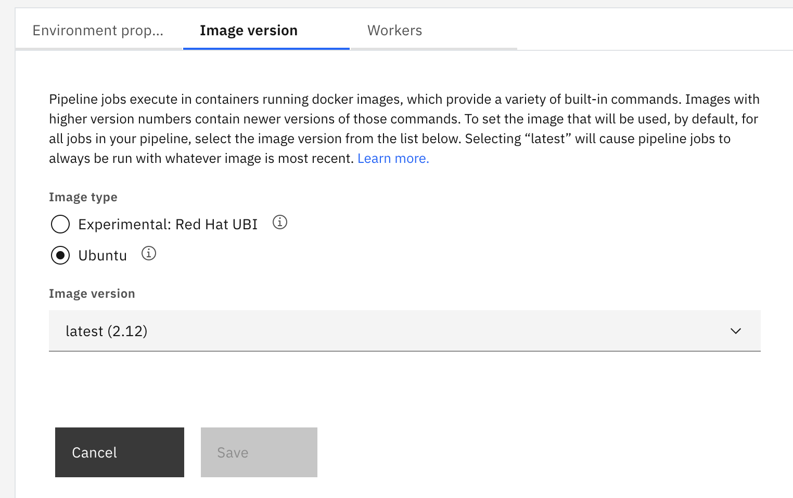

---

copyright:
  years: 2019, 2023
lastupdated: "2023-12-14"

keywords: pipeline versioned base image, image version, pipeline job

subcollection: ContinuousDelivery

---

{{site.data.keyword.attribute-definition-list}}

# Working with versioned base images
{: #pipeline_versioned_base_images}

When you develop applications for {{site.data.keyword.cloud_notm}}, you can use versioned base images to run pipeline jobs to make sure that you are using the current tools, libraries, and runtimes. Versioned base images help you to make sure that the bits that make up the application, and the environment that you deploy the application to, are consistent. You can control when the tools, libraries, or runtimes for your application change and update them when it makes sense during the development cycle.
{: shortdesc}

The existing CLI plug-in repository infrastructure for downloading and updating the CLI binary files and plug-ins is deprecated. As of 1 October, 2021, you must upgrade pipelines that use the provided pipeline base image for version 2.14 or earlier (Ubuntu) or version 3.2 or earlier (UBI) to use one of the current versioned base images. The current image for Ubuntu is version 2.15. The current image for UBI is version 3.3.
{: deprecated}

If you do not upgrade the base image that is used by your pipelines, you might receive the following error:

```text
Unable to fetch plug-ins from repository 'IBM Cloud':
invalid character '<' looking for beginning of value
```

On 16 March 2020, the {{site.data.keyword.containerlong}} released a new version 1.0 of the {{site.data.keyword.cloud_notm}} CLI plug-in. Because this version is not 100% compatible with earlier versions, you must upgrade your scripts after you start to use this version. For more information about this new version of the {{site.data.keyword.cloud_notm}} CLI plug-in, see [Big changes are coming to the {{site.data.keyword.containerlong_notm}} CLI plugin to change your experience for the better](https://www.ibm.com/cloud/blog/announcements/boost-your-productivity-with-a-new-cli-experience-for-the-ibm-cloud-kubernetes-service){: external}. To maintain compatibility with the current {{site.data.keyword.containerlong_notm}} runtimes after the new version 1.0 is available, {{site.data.keyword.contdelivery_short}} will update the current base image for the {{site.data.keyword.deliverypipeline}} to include this version. For production workloads, set any of your pipelines that are using the current base image to instead use version 2.6 until you can update your scripts to work with the new version.
{: important}

You can also use [custom Docker images](/docs/services/ContinuousDelivery?topic=ContinuousDelivery-custom_docker_images) to control both the tools and which versions of those tools are used to build and deploy applications. However, this method requires that you are familiar with Docker and you must maintain and update the image that you create.

On 20 November 2020, Dockerhub introduced rate-limiting on anonymous image pulls. This change might impact users that are running jobs by using Dockerhub-hosted custom images.
{: tip}

Pipeline base images are hosted in a global IBM Cloud Container Registry namespace. To list these images, run the `ibmcloud cr images --restrict continuous-delivery` command when you target the global IBM Cloud Container Registry.

## Specifying the image version
{: #specify_base_image_version}

1. On the Pipeline page, click **Actions...** to access the list of options.
2. Click **Configure Pipeline**.
3. In the **Image version** tab, select either the **Experimental: RedHat UBI** or the **Ubuntu** image type. Then, based on the selected image type, select the default image version to use for all jobs in your pipeline. You can also customize this setting for each job in each stage of your pipeline.

{: caption="Figure 1. Image version" caption-side="bottom"}

If you choose the `Latest` option, the pipeline jobs are run with the current image version. The current image version is displayed in brackets after the `Latest` option. When a new image version is available, the image that is used changes. You might need to modify your pipeline to support any newer tools that are included in the new image.
{: tip}

Ubuntu based versioned based images are tagged as 2.x versions. Red Hat UBI based versioned base images are tagged as 3.x versions.

To add tools in a Red Hat UBI-based image, you must use the `yum` command. `apt-get` or `apt` commands are exclusively reserved for Ubuntu images. Because of these command restrictions, you cannot update existing pipelines to use version 3.x images without modifying the scripts. {: important}
 
## Image version contents
{: #image_version_contents}
 
After version 2.0, images no longer include grunt or python. If these tools are required for your build, you can install them manually. To install grunt, run `npm install -g grunt-cli`. Make sure that you don't change the Node.js version after you install grunt. To install python on a 2.x vbi, run `apt-get -qq update && apt-get -qq install -y python`. If you are using a 3.x vbi, you can use `yum update -yq && yum install -yq python3-pip`.
{: important}

Images are available on the IBM Cloud Container Registry. To list these hosted images, run the `ibmcloud cr images --restrict continuous-delivery` command when you target the global IBM Cloud Container Registry.

| Base image version | IBM Cloud Container Registry version |sha256 value|Creation date|
| -------------------- | -------------------------------------- | -------------------------------------------------------------------------------------------------------------------------------------------------------------------------------------------------------------------------------------------------------- | ------------|
| 3.35 | `icr.io/continuous-delivery/pipeline/pipeline-base-ubi:3.35`| sha256:39c2461cefd1791bf578f6ba19648808916c48ab7767f1d88081994faf014d14|2023-12-12|
| 3.34 | `icr.io/continuous-delivery/pipeline/pipeline-base-ubi:3.33`| sha256:73e5545fdbb3da94d1d29a8d7ca38cfe7feb6da0ba63c7036a08b78cbc8531c1|2023-12-04|
| 3.33 | `icr.io/continuous-delivery/pipeline/pipeline-base-ubi:3.33`| sha256:18582e3d0d58ea5f07c809a210e7d5a9b2e2b99b85c93b72de4a5ed92d94511c|2023-11-16|
| 3.32 | `icr.io/continuous-delivery/pipeline/pipeline-base-ubi:3.32`| sha256:91fa57abe53a5c3f86a8c0358defc01111aab4ea69f59aaa852baae2d3432c69|2023-11-07|
| 3.31 | `icr.io/continuous-delivery/pipeline/pipeline-base-ubi:3.31`| sha256:98c9e91bfe7a5aa5b97267fad1a2ac4d01081f396bd03a2d4b9604a3487a07fe|2023-10-30|
| 3.30 | `icr.io/continuous-delivery/pipeline/pipeline-base-ubi:3.30`| sha256:b5d2f4026ee171a67edf24ab5e952f19f1ecebd1875e3da051d4d73bf398f0d9|2023-10-12|
| 3.29 | `icr.io/continuous-delivery/pipeline/pipeline-base-ubi:3.29`| sha256:36c8642cefc2182dfd283510319bf9741bc8c386c46364e3a391fe9797c3d79a|2023-09-29|
| 3.28 | `icr.io/continuous-delivery/pipeline/pipeline-base-ubi:3.28`| sha256:aa7f4f2e5bdd12ab0b59de1b8b031799e11d38aa45712424b3023c6e8471e8ba|2023-09-01|
| 3.27 | `icr.io/continuous-delivery/pipeline/pipeline-base-ubi:3.27`| sha256:70708bdc8bfb23bfda9fa5effc644901cdd9e7314c91ac6c1cbc62bfb9e0a1a2|2023-08-18|
| 3.26 | `icr.io/continuous-delivery/pipeline/pipeline-base-ubi:3.26`| sha256:de8ee389e3cb5818eb3c65a015b86c1042c2adf0bad64467cd3ccd3d8c66e26d|2023-08-02|
| 3.25 | `icr.io/continuous-delivery/pipeline/pipeline-base-ubi:3.25`| sha256:dd2000b525336acd00e9b95b74f15696797764725adbb25fa720e9431d558cbf|2023-07-05|
| 3.24 | `icr.io/continuous-delivery/pipeline/pipeline-base-ubi:3.24`| sha256:7a52b892ae7704a7b6c4cf03a292356240305c0d7bc9c275d10df19d12db99c5|2023-06-19|
| 3.23 | `icr.io/continuous-delivery/pipeline/pipeline-base-ubi:3.23`| sha256:e62fe158ebc7d875a0be5263da6872250fd8038b00cef0aada4b9f14f06dd827|2023-05-29|
| 3.21 | `icr.io/continuous-delivery/pipeline/pipeline-base-ubi:3.21`| sha256:94b77206bbc38a0d0ecd7006c00c9773d4ddd6e864525736b3bc4ca87c64b991|2023-04-17|
| 3.20 | `icr.io/continuous-delivery/pipeline/pipeline-base-ubi:3.20`| sha256:82e68006004eeca8bdf838e2756d6b7fbb787baa42817feba8e847d8b1a27106|2023-04-03|
| 3.19 | `icr.io/continuous-delivery/pipeline/pipeline-base-ubi:3.19`| sha256:ffb0bb00c37c4c2af01a53afc3597494275ed99a1e8ac3d4e653f105937509f0|2023-03-13|
| 3.18 | `icr.io/continuous-delivery/pipeline/pipeline-base-ubi:3.18`| sha256:ba072e693cd646664711f60c7d3b4c34a25b4578bdc445a2d6855eff595fe67c|2023-02-21|
| 3.17 | `icr.io/continuous-delivery/pipeline/pipeline-base-ubi:3.17`| sha256:3e2cbec3d0781b0e9ea9293d0a88e5b654635c065864718e74130a5124965197|2023-02-06|
| 3.16 | `icr.io/continuous-delivery/pipeline/pipeline-base-ubi:3.16`| sha256:a09c7918889289fa2106e54ba527793aad7152847a50e6584d59266ecc40d498|2023-01-24|
| 3.15 | `icr.io/continuous-delivery/pipeline/pipeline-base-ubi:3.15`| sha256:506e7b8e96ad40fbf098b6b0a337bca7c9d07fa5cf58058e857c38d9e7625497|2023-01-16|
| 3.14 | `icr.io/continuous-delivery/pipeline/pipeline-base-ubi:3.14`| sha256:b6f80270c9328c3014766fdb2dca9aea4f593f05c1bcaf5037d126bf042ebffe|2022-12-14|
| 3.13 | `icr.io/continuous-delivery/pipeline/pipeline-base-ubi:3.13`| sha256:ae7f9e80bcc7947ae4df8d94a326240ca648c807183a72e232ecb03043348f20|2022-11-28|
| 3.12 | `icr.io/continuous-delivery/pipeline/pipeline-base-ubi:3.12`| sha256:6f457e7ec323eac3ae05c6ca5bfaacee1ed669c50cdb5983c893c5351a184331|2022-11-10|
| 3.11 | `icr.io/continuous-delivery/pipeline/pipeline-base-ubi:3.11`| sha256:d4f4a2e59127ff11426789bf1d86c88fcac3e9746241755f6af7ff9e79fd62f1|2022-10-04|
| 3.10 | `icr.io/continuous-delivery/pipeline/pipeline-base-ubi:3.10`| sha256:8fae15566254a0300315e3c752021d6eabdea73aaa3372f86c6218579692eb67|2022-08-30|
| 3.9 | `icr.io/continuous-delivery/pipeline/pipeline-base-ubi:3.9`| sha256:d1d42755854accd4957979e974c620cf892e8d38b123e5eac06abf378b353879|2022-07-28|
| 3.8 | `icr.io/continuous-delivery/pipeline/pipeline-base-ubi:3.8`| sha256:8d0c33a4e5651a7d412ebfd751a45b613a6efde6167c70f1f1e8938d1bd8c613|2022-06-22|
| 3.7 | `icr.io/continuous-delivery/pipeline/pipeline-base-ubi:3.7`| sha256:0444aa3cc5032ba4d7f7a59a4177dd43dc1126ad902f09079b0a66156bbe4bcf|2022-04-20|
| 3.6 | `icr.io/continuous-delivery/pipeline/pipeline-base-ubi:3.6`| sha256:4bfa333cd47ee9d0e369edb147451ff008169f0dd84a115c16205b5cd0de64f6|2022-02-22|
| 3.5 | `icr.io/continuous-delivery/pipeline/pipeline-base-ubi:3.5`| sha256:543249c585e351c14d5b9f16664625236e20e4ba85098ac26adb0d8cecbbcc97|2022-01-18|
| 3.4 | `icr.io/continuous-delivery/pipeline/pipeline-base-ubi:3.4`| sha256:4aaabf49950796d9004f6e4f04ff53ab24dcd3fd29d8cc719a9b81f7546d31f2|2021-11-29|
| 3.3 | `icr.io/continuous-delivery/pipeline/pipeline-base-ubi:3.3`| sha256:5b8f7e1964c0a82995689d636b60a1761dd08ce422b9195aadc0249e5da90dae|2021-09-24|
| 3.2 | `icr.io/continuous-delivery/pipeline/pipeline-base-ubi:3.2`| sha256:d59863621d3ba1b9bd47f76950c751e842405f9c303d0d4d4298d964b664ee85|2021-09-02|
| 3.1 | `icr.io/continuous-delivery/pipeline/pipeline-base-ubi:3.1`| sha256:c2468d28f15fa6970f13510c01477326f91a043881c2b4cd8f2b1ff8ed8c22a1|2021-06-10|
| 3.0 | `icr.io/continuous-delivery/pipeline/pipeline-base-ubi:3.0`| sha256:42318979f165cc1ffd4d707022ceb5461360a9b6cd1216bc0c63391bdd042726|2021-04-07|
| 2.48 | `icr.io/continuous-delivery/pipeline/pipeline-base-image:2.48`| sha256:7abe5cb8f2bf8a2744f2ec94f63e59599272b9cc8b11f07c8b9e0ce4b9ed1dd7|2023-12-12|
| 2.47 | `icr.io/continuous-delivery/pipeline/pipeline-base-image:2.46`| sha256:672e066fb55e8f24cde117b8e004a8e22ab446a04ffc447754ad3211fbf09c3f|2023-12-04|
| 2.46 | `icr.io/continuous-delivery/pipeline/pipeline-base-image:2.46`| sha256:7e60e820e6e9922e6d51618d6daba7f78866028fd68a190ad01f532a8c203366|2023-11-16|
| 2.45 | `icr.io/continuous-delivery/pipeline/pipeline-base-image:2.45`| sha256:5eca901f0fc2206d4da3b1af155435e0adb53f66dd138c2cba8350f24469ff7b|2023-11-07|
| 2.44 | `icr.io/continuous-delivery/pipeline/pipeline-base-image:2.44`| sha256:39530628b7228175b372a0cfc7da1a03657e57c81f92a7e7f1665475f33f9937|2023-10-30|
| 2.43 | `icr.io/continuous-delivery/pipeline/pipeline-base-image:2.43`| sha256:7305777d729bf89e0fe33911b9b29e0d7f969e6d35207ecc2ea21b55f55cc6e6|2023-10-12|
| 2.42 | `icr.io/continuous-delivery/pipeline/pipeline-base-image:2.42`| sha256:0a479499f54b67a81a1959761105da7f19b6f4d314bd34881b6d7fedbcce9d4b|2023-09-29|
| 2.41 | `icr.io/continuous-delivery/pipeline/pipeline-base-image:2.41`| sha256:7bf1281cd55814485ad7ddbc90982e34046148abec3806fdb3e613c352a0d20e|2023-09-01|
| 2.40 | `icr.io/continuous-delivery/pipeline/pipeline-base-image:2.40`| sha256:8164d04f6c812be3a3a0790c541c72a9fd7ea65a8bc0a0264b8c4e82e0ed1868|2023-08-18|
| 2.39 | `icr.io/continuous-delivery/pipeline/pipeline-base-image:2.39`| sha256:499559f10a289300828536196947da164c09cece319e3ce3f30fd408cde55c5d|2023-08-02|
| 2.38 | `icr.io/continuous-delivery/pipeline/pipeline-base-image:2.38`| sha256:2f11f01c9710ec711a17a9269be04f584e173c89b27b116c27ec93ec31981c07|2023-07-05|
| 2.37 | `icr.io/continuous-delivery/pipeline/pipeline-base-image:2.37`| sha256:229503f75f9837a1fd0e8d38918d8904d3719eaeae84e8aaf94201e8409d78fd|2023-06-19|
| 2.36 | `icr.io/continuous-delivery/pipeline/pipeline-base-image:2.36`| sha256:caf29e1e2ce8e1df165c4eb7a3124ae17b6438e2b04b8766dd0dfad502a79350|2023-05-31|
| 2.35 | `icr.io/continuous-delivery/pipeline/pipeline-base-image:2.35`| sha256:f78e02d91386dbd9a2e1fb9686df130c36666ae67cfc0bc483f1f4ee34cdf9e2|2023-05-30|
| 2.33 | `icr.io/continuous-delivery/pipeline/pipeline-base-image:2.33`| sha256:dc3a6d2a352b0019f8ce7ea4c10afd4017e45c48cb22ca692ab0b02b028538cc|2023-04-17|
| 2.32 | `icr.io/continuous-delivery/pipeline/pipeline-base-image:2.32`| sha256:e66e380e37ad1f84891fbc9c708b7685356987895f2c397c20db0a5fae1efbed|2023-04-03|
| 2.31 | `icr.io/continuous-delivery/pipeline/pipeline-base-image:2.31`| sha256:24d3c769801314b7502390c5c7054b303c534c2b3eceee3b87f1cb35f10f3e26|2023-03-13|
| 2.30 | `icr.io/continuous-delivery/pipeline/pipeline-base-image:2.30`| sha256:2377117ad8e1305cd51e57aad59ca6bf7dedc028d128898df646f2854229a0de|2023-02-21|
| 2.29 | `icr.io/continuous-delivery/pipeline/pipeline-base-image:2.29`| sha256:9454cc4fc70a21a1f5b59ede38910b30d29db69e5331e9e37a4d3516427ce66d|2023-02-06|
| 2.28 | `icr.io/continuous-delivery/pipeline/pipeline-base-image:2.28`| sha256:5ce2b19d67e1e05bc70b0f5639ea7e7696cfac37aea62e9f2e75249f54d97c08|2023-01-24|
| 2.27 | `icr.io/continuous-delivery/pipeline/pipeline-base-image:2.27`| sha256:e212bfbfa48f88f7b12ac77aa21fdc41d8eccf9ff89a2405706430738d09e24b|2023-01-16|
| 2.26 | `icr.io/continuous-delivery/pipeline/pipeline-base-image:2.26`| sha256:31bd71102552d6d76b6660c4ca2cbae930367ff3d644acc0673e861085a23b12|2022-12-14|
| 2.25 | `icr.io/continuous-delivery/pipeline/pipeline-base-image:2.25`| sha256:31f01a325fcb53651742fbb4af1d9a3ec425fc9b2662e1894c01389ff37426bf|2022-11-28|
| 2.24 | `icr.io/continuous-delivery/pipeline/pipeline-base-image:2.24`| sha256:a97c10d27cdf8ee543cad4b29980ccdd5a697164f40ade7f399a0b7a3619f2ea|2022-11-10|
| 2.23 | `icr.io/continuous-delivery/pipeline/pipeline-base-image:2.23`| sha256:8582554fda2c36c0750d734c78b692b96ac0f983d4d2e11a186e224ec2fa554f|2022-10-04|
| 2.22 | `icr.io/continuous-delivery/pipeline/pipeline-base-image:2.22`| sha256:0653ba3abbdadf347fde238667b510757ecd9625dd7f7d53c512d7a5a2762612|2022-08-30|
| 2.21 | `icr.io/continuous-delivery/pipeline/pipeline-base-image:2.21`| sha256:4ce661dc331005bc3cb828a677c760b2dda3c2951415141a91aeb0c0b9a351da|2022-07-28|
| 2.20 | `icr.io/continuous-delivery/pipeline/pipeline-base-image:2.20`| sha256:655330f36771d274082b6c16a60620350597a9d6f2489a6246b9d2833d021211|2022-06-20|
| 2.19 | `icr.io/continuous-delivery/pipeline/pipeline-base-image:2.19`| sha256:482d28e51d5acc65471b366bbdcabc97f69e49da933337a7c42f45907cd63173|2022-04-20|
| 2.18 | `icr.io/continuous-delivery/pipeline/pipeline-base-image:2.18`| sha256:56cc0a6562e786f1b87b490e6a34ed655fa2c376ae3c8622690912dce7d9a608|2022-02-22|
| 2.17 | `icr.io/continuous-delivery/pipeline/pipeline-base-image:2.17`| sha256:c1e9d5a9674a093635c386f96d35781aea7cad6cc1da86991ee1a85c854216f8|2022-01-18|
| 2.16 | `icr.io/continuous-delivery/pipeline/pipeline-base-image:2.16`| sha256:3a3b5a981caed4238ef7297bb54b4a32b974b0499b12744347bc661d3f323916|2021-11-29|
| 2.15 | `icr.io/continuous-delivery/pipeline/pipeline-base-image:2.15`| sha256:f4bff8348fbfdb738c3c681cb6da04cb215f742abe5e09b5d2f5ef07dcfbf21b|2021-09-24|
| 2.14 | `icr.io/continuous-delivery/pipeline/pipeline-base-image:2.14`| sha256:7bad3379f15fce2d169ae066520b6bdfe719ee4fc8ae271988b4ca772ffb69d5|2021-09-02|
| 2.13 | `icr.io/continuous-delivery/pipeline/pipeline-base-image:2.13`| sha256:916d4a7cac5ee3102b5fbbbbda67387051a6f7a545353e4ba4bd489246ec8855|2021-06-10|
| 2.12 | `icr.io/continuous-delivery/pipeline/pipeline-base-image:2.12`| sha256:ff4053b0bca784d6d105fee1d008cfb20db206011453071e86b69ca3fde706a4|2021-04-07|
| 2.11 | `icr.io/continuous-delivery/pipeline/pipeline-base-image:2.11`| sha256:61d35cdad7e77dbcedbf6ab47591b38121b03c5a4f41041f2d628cb8485602e1|2021-01-08|
| 2.10 | `icr.io/continuous-delivery/pipeline/pipeline-base-image:2.10`| sha256:c59986a7a4e5931f1172ba3c6fc5f535edbbcc60daf6f3e092df9851283f8ceb|2020-12-11|
| 2.9 | `icr.io/continuous-delivery/pipeline/pipeline-base-image:2.9`| sha256:2976e1374e87f5cddabcf80179d9708868d52dbf656fdde60f803553be633db2|2020-09-21|
| 2.8 | `icr.io/continuous-delivery/pipeline/pipeline-base-image:2.8`| sha256:119e05bad27ccc899df5b895ccba41135fd5edbc5786a77c1c763621b00dee0f|2020-07-27|
| 2.7 | `icr.io/continuous-delivery/pipeline/pipeline-base-image:2.7`| sha256:282677e79ccb9d20c699d384a54093894de03675752cd848a3133266c898c14c|2020-05-20|
| 2.6 | `icr.io/continuous-delivery/pipeline/pipeline-base-image:2.6`| sha256:7f588468622a981f89cf5e1212aaf75fface9da6169b5345ca52ab63d8215907|2019-12-09|
| 2.5 | `icr.io/continuous-delivery/pipeline/pipeline-base-image:2.5`| sha256:90bdb361ba94b75dfd7feb7c6a2577ece9f91e0392f20a5b4e9808120041b3e2|2019-12-02|
| 2.4 | `icr.io/continuous-delivery/pipeline/pipeline-base-image:2.4.1`| sha256:ade4209bbc6923c02a3315c7e6dcc4376afc355db2765b792205be9b33f4243d|2019-10-01|
| 2.3 | `icr.io/continuous-delivery/pipeline/pipeline-base-image:2.3`| sha256:1451dab959183c6378a804ce0744913028623e10c401e5ebc1a1f88c82443ba4|2019-07-24|
| 2.2 | `icr.io/continuous-delivery/pipeline/pipeline-base-image:2.2`| sha256:2073c470e83418abf2c11ec92554c139aadd18f0c63fffb92c2c3f5e90c46ba6|2019-07-10|
| 2.1 | `icr.io/continuous-delivery/pipeline/pipeline-base-image:2.1`| sha256:b5be69c4ae42a7af28a9d7ad25df548c77959b006507367507c9ff0f992306f2|2019-06-17|
| 2.0 | `icr.io/continuous-delivery/pipeline/pipeline-base-image:2.0`| sha256:cc13eadecb8e99a7fe56a071427c2caa34149c31d1ad84f4f03c96f111dd0154|2019-05-08|
{: caption="Table 1. Mapping between versioned based images and IBM Cloud Registry versions with sha256 values" caption-side="top"}

The following available image versions are listed in descending order, starting with the current version.
 
The version of `yq` that is preinstalled in the images corresponds to the yq tool created by [Mike Farah](https://github.com/mikefarah/yq){: external}.
{: tip}


### Version 3.35
{: #version_3_35}
To view the contents of version 3.35, from the running image, type `default_versions.sh`. The `3.x` branch provides images with the current tool versions. The current Java&trade; version is Java&trade; 17. Node.js no longer uses `nvm` to manage different node.js versions. It does not provide the current LTS version of Node.js at the time that it was built as there is not ubi version of node.js `20.x` yet. It remains on node.js `18.x` for now. And it is based on `ubi8`.

This image also contains the Terraform command-line interface (CLI).

The {{site.data.keyword.cloud_notm}} CLI provides code risk analysis commands. You can use the {{site.data.keyword.cloud_notm}} CLI to analyze your code for vulnerabilities and compliance with certain rules. Code Risk Analyzer is available in all {{site.data.keyword.cloud_notm}} regions where toolchains are supported. For more information about Code Risk Analyzer, see [Code Risk Analyzer plug-in](/docs/code-risk-analyzer-cli-plugin).
{: tip}

The `cf install` command for the {{site.data.keyword.cloud_notm}} CLI is no longer available. The existing cf executable file is still available.
{: important}

This image includes the following tools:

```text
# node
v18.19.0

# npm
10.2.3

# jq
jq-1.7

# yq
yq (https://github.com/mikefarah/yq/) version v4.40.4

# kubectl
v1.27.6

# buildctl
buildctl github.com/moby/buildkit v0.12.4 833949d0f7908608b00ab6b93b8f92bdb147fcca

# helm
v3.13.2+g2a2fb3b

# ibmcloud
/usr/local/bin/ibmcloud version 2.21.0+c3b7075-2023-10-24T15:37:53+00:00

# ibmcloud plugins
Listing installed plug-ins...

Plugin Name                                     Version   Status             Private endpoints supported
cloud-functions[wsk/functions/fn]               1.0.76                       false
cloud-internet-services[cis]                    1.15.7                       true
code-engine[ce]                                 1.49.0                       true
container-registry[cr]                          1.3.4                        true
container-service[kubernetes-service/ks]        1.0.579                      false
cra                                             2.0.2                        false
doi                                             0.4.5                        false
schematics[sch]                                 1.12.12                      true
secrets-manager[sm]                             2.0.2                        true
sl                                              1.4.2                        false
vpc-infrastructure[infrastructure-service/is]   8.1.0                        true


# ibmcloud dev
3.1.1

# java
openjdk version "17.0.9" 2023-10-17
IBM Semeru Runtime Open Edition 17.0.9.0 (build 17.0.9+9)
Eclipse OpenJ9 VM 17.0.9.0 (build openj9-0.41.0, JRE 17 Linux amd64-64-Bit Compressed References 20231017_614 (JIT enabled, AOT enabled)
OpenJ9   - 461bf3c70
OMR      - 5eee6ad9d
JCL      - 3699725139c based on jdk-17.0.9+9)

# ant
Apache Ant(TM) version 1.10.14 compiled on August 16 2023

# mvn
Apache Maven 3.9.6 (bc0240f3c744dd6b6ec2920b3cd08dcc295161ae)
Maven home: /opt/IBM/maven
Java version: 17.0.9, vendor: IBM Corporation, runtime: /usr/local/jdk17
Default locale: en_US, platform encoding: ANSI_X3.4-1968
OS name: "linux", version: "6.6.3-200.fc39.aarch64", arch: "amd64", family: "unix"

# gradle

Welcome to Gradle 8.5!

Here are the highlights of this release:
 - Support for running on Java 21
 - Faster first use with Kotlin DSL
 - Improved error and warning messages

For more details see https://docs.gradle.org/8.5/release-notes.html


------------------------------------------------------------
Gradle 8.5
------------------------------------------------------------

Build time:   2023-11-29 14:08:57 UTC
Revision:     28aca86a7180baa17117e0e5ba01d8ea9feca598

Kotlin:       1.9.20
Groovy:       3.0.17
Ant:          Apache Ant(TM) version 1.10.13 compiled on January 4 2023
JVM:          17.0.9 (Eclipse OpenJ9 openj9-0.41.0)
OS:           Linux 6.6.3-200.fc39.aarch64 amd64


# oc
4.14.3

# zip
Copyright (c) 1990-2008 Info-ZIP - Type 'zip "-L"' for software license.
This is Zip 3.0 (July 5th 2008), by Info-ZIP.

# unzip
UnZip 6.00 of 20 April 2009, by Info-ZIP.  Maintained by C. Spieler.  Send

# git
git version 2.39.3

# curl
curl 7.61.1 (x86_64-redhat-linux-gnu) libcurl/7.61.1 OpenSSL/1.1.1k zlib/1.2.11 brotli/1.0.6 libidn2/2.2.0 libpsl/0.20.2 (+libidn2/2.2.0) libssh/0.9.6/openssl/zlib nghttp2/1.33.0

# wget
GNU Wget 1.19.5 built on linux-gnu.

# openssl
OpenSSL 1.1.1k  FIPS 25 Mar 2021

# make
GNU Make 4.2.1

# docker
23.0.6

# dc --version
dc (GNU bc 1.07.1) 1.4.1

# ed --version
GNU ed 1.14.2

# skopeo
skopeo version 1.13.3

# calicoctl
Client Version: v3.26.3 Git commit: bdb7878af

# terraform
Terraform v1.6.5
on linux_amd64
```
{: codeblock}

### Version 3.34
{: #version_3_34}
To view the contents of version 3.34, from the running image, type `default_versions.sh`. The `3.x` branch provides images with the current tool versions. The current Java&trade; version is Java&trade; 17. Node.js no longer uses `nvm` to manage different node.js versions. It does not provide the current LTS version of Node.js at the time that it was built as there is not ubi version of node.js `20.x` yet. It remains on node.js `18.x` for now. And it is based on `ubi8`.

This image also contains the Terraform command-line interface (CLI).

The {{site.data.keyword.cloud_notm}} CLI provides code risk analysis commands. You can use the {{site.data.keyword.cloud_notm}} CLI to analyze your code for vulnerabilities and compliance with certain rules. Code Risk Analyzer is available in all {{site.data.keyword.cloud_notm}} regions where toolchains are supported. For more information about Code Risk Analyzer, see [Code Risk Analyzer plug-in](/docs/code-risk-analyzer-cli-plugin).
{: tip}

The `cf install` command for the {{site.data.keyword.cloud_notm}} CLI is no longer available. The existing cf executable file is still available.
{: important}

This image includes the following tools:

```text
# node
v18.19.0

# npm
10.2.3

# jq
jq-1.7

# yq
yq (https://github.com/mikefarah/yq/) version v4.40.4

# kubectl
v1.27.6

# buildctl
buildctl github.com/moby/buildkit v0.12.4 833949d0f7908608b00ab6b93b8f92bdb147fcca

# helm
v3.13.2+g2a2fb3b

# ibmcloud
/usr/local/bin/ibmcloud version 2.21.0+c3b7075-2023-10-24T15:37:53+00:00

# ibmcloud plugins
Listing installed plug-ins...

Plugin Name                                     Version   Status             Private endpoints supported
cloud-functions[wsk/functions/fn]               1.0.76                       false
cloud-internet-services[cis]                    1.15.7                       true
code-engine[ce]                                 1.49.0                       true
container-registry[cr]                          1.3.4                        true
container-service[kubernetes-service/ks]        1.0.579                      false
cra                                             2.0.2                        false
doi                                             0.4.5                        false
schematics[sch]                                 1.12.12                      true
secrets-manager[sm]                             2.0.2                        true
sl                                              1.4.2                        false
vpc-infrastructure[infrastructure-service/is]   8.1.0                        true


# ibmcloud dev
3.1.1

# java
openjdk version "17.0.9" 2023-10-17
IBM Semeru Runtime Open Edition 17.0.9.0 (build 17.0.9+9)
Eclipse OpenJ9 VM 17.0.9.0 (build openj9-0.41.0, JRE 17 Linux amd64-64-Bit Compressed References 20231017_614 (JIT enabled, AOT enabled)
OpenJ9   - 461bf3c70
OMR      - 5eee6ad9d
JCL      - 3699725139c based on jdk-17.0.9+9)

# ant
Apache Ant(TM) version 1.10.14 compiled on August 16 2023

# mvn
Apache Maven 3.9.6 (bc0240f3c744dd6b6ec2920b3cd08dcc295161ae)
Maven home: /opt/IBM/maven
Java version: 17.0.9, vendor: IBM Corporation, runtime: /usr/local/jdk17
Default locale: en_US, platform encoding: ANSI_X3.4-1968
OS name: "linux", version: "6.6.3-200.fc39.aarch64", arch: "amd64", family: "unix"

# gradle

Welcome to Gradle 8.5!

Here are the highlights of this release:
 - Support for running on Java 21
 - Faster first use with Kotlin DSL
 - Improved error and warning messages

For more details see https://docs.gradle.org/8.5/release-notes.html


------------------------------------------------------------
Gradle 8.5
------------------------------------------------------------

Build time:   2023-11-29 14:08:57 UTC
Revision:     28aca86a7180baa17117e0e5ba01d8ea9feca598

Kotlin:       1.9.20
Groovy:       3.0.17
Ant:          Apache Ant(TM) version 1.10.13 compiled on January 4 2023
JVM:          17.0.9 (Eclipse OpenJ9 openj9-0.41.0)
OS:           Linux 6.6.3-200.fc39.aarch64 amd64


# oc
4.14.3

# zip
Copyright (c) 1990-2008 Info-ZIP - Type 'zip "-L"' for software license.
This is Zip 3.0 (July 5th 2008), by Info-ZIP.

# unzip
UnZip 6.00 of 20 April 2009, by Info-ZIP.  Maintained by C. Spieler.  Send

# git
git version 2.39.3

# curl
curl 7.61.1 (x86_64-redhat-linux-gnu) libcurl/7.61.1 OpenSSL/1.1.1k zlib/1.2.11 brotli/1.0.6 libidn2/2.2.0 libpsl/0.20.2 (+libidn2/2.2.0) libssh/0.9.6/openssl/zlib nghttp2/1.33.0

# wget
GNU Wget 1.19.5 built on linux-gnu.

# openssl
OpenSSL 1.1.1k  FIPS 25 Mar 2021

# make
GNU Make 4.2.1

# docker
23.0.6

# dc --version
dc (GNU bc 1.07.1) 1.4.1

# ed --version
GNU ed 1.14.2

# skopeo
skopeo version 1.13.3

# calicoctl
Client Version: v3.26.3 Git commit: bdb7878af

# terraform
Terraform v1.6.5
on linux_amd64
```
{: codeblock}

### Version 3.33
{: #version_3_33}
To view the contents of version 3.33, from the running image, type `default_versions.sh`. The `3.x` branch provides images with the current tool versions. The current Java&trade; version is Java&trade; 17. Node.js no longer uses `nvm` to manage different node.js versions. It does not provide the current LTS version of Node.js at the time that it was built as there is not ubi version of node.js `20.x` yet. It remains on node.js `18.x` for now. And it is based on `ubi8`.

This image also contains the Terraform command-line interface (CLI).

The {{site.data.keyword.cloud_notm}} CLI provides code risk analysis commands. You can use the {{site.data.keyword.cloud_notm}} CLI to analyze your code for vulnerabilities and compliance with certain rules. Code Risk Analyzer is available in all {{site.data.keyword.cloud_notm}} regions where toolchains are supported. For more information about Code Risk Analyzer, see [Code Risk Analyzer plug-in](/docs/code-risk-analyzer-cli-plugin).
{: tip}

The `cf install` command for the {{site.data.keyword.cloud_notm}} CLI is no longer available. The existing cf executable file is still available.
{: important}

This image includes the following tools:

```text
# node
v18.18.2

# npm
9.8.1

# jq
jq-1.7

# yq
yq (https://github.com/mikefarah/yq/) version v4.35.2

# kubectl
v1.27.6

# buildctl
buildctl github.com/moby/buildkit v0.12.3 438f47256f0decd64cc96084e22d3357da494c27

# helm
v3.13.2+g2a2fb3b

# ibmcloud
/usr/local/bin/ibmcloud version 2.21.0+c3b7075-2023-10-24T15:37:53+00:00

# ibmcloud plugins
Listing installed plug-ins...

Plugin Name                                Version   Status             Private endpoints supported
cloud-functions[wsk/functions/fn]          1.0.75                       false
cloud-internet-services[cis]               1.15.7                       true
code-engine[ce]                            1.48.0                       true
container-registry[cr]                     1.3.4                        true
container-service[kubernetes-service/ks]   1.0.579                      false
cra                                        2.0.2                        false
doi                                        0.4.5                        false
schematics[sch]                            1.12.12                      true
secrets-manager[sm]                        2.0.2                        true
sl                                         1.4.2                        false


# ibmcloud dev
3.1.1

# java
openjdk version "17.0.8.1" 2023-08-24
IBM Semeru Runtime Open Edition 17.0.8.1 (build 17.0.8.1+1)
Eclipse OpenJ9 VM 17.0.8.1 (build openj9-0.40.0, JRE 17 Linux amd64-64-Bit Compressed References 20230824_549 (JIT enabled, AOT enabled)
OpenJ9   - d12d10c9e
OMR      - e80bff83b
JCL      - 8ecf238a124 based on jdk-17.0.8.1+1)

# ant
Apache Ant(TM) version 1.10.14 compiled on August 16 2023

# mvn
Apache Maven 3.9.5 (57804ffe001d7215b5e7bcb531cf83df38f93546)
Maven home: /opt/IBM/maven
Java version: 17.0.8.1, vendor: IBM Corporation, runtime: /usr/local/jdk17
Default locale: en_US, platform encoding: ANSI_X3.4-1968
OS name: "linux", version: "6.6.3-200.fc39.aarch64", arch: "amd64", family: "unix"

# gradle

Welcome to Gradle 8.4!

Here are the highlights of this release:
 - Compiling and testing with Java 21
 - Faster Java compilation on Windows
 - Role focused dependency configurations creation

For more details see https://docs.gradle.org/8.4/release-notes.html


------------------------------------------------------------
Gradle 8.4
------------------------------------------------------------

Build time:   2023-10-04 20:52:13 UTC
Revision:     e9251e572c9bd1d01e503a0dfdf43aedaeecdc3f

Kotlin:       1.9.10
Groovy:       3.0.17
Ant:          Apache Ant(TM) version 1.10.13 compiled on January 4 2023
JVM:          17.0.8.1 (Eclipse OpenJ9 openj9-0.40.0)
OS:           Linux 6.6.3-200.fc39.aarch64 amd64


# oc
4.14.1

# zip
Copyright (c) 1990-2008 Info-ZIP - Type 'zip "-L"' for software license.
This is Zip 3.0 (July 5th 2008), by Info-ZIP.

# unzip
UnZip 6.00 of 20 April 2009, by Info-ZIP.  Maintained by C. Spieler.  Send

# git
git version 2.39.3

# curl
curl 7.61.1 (x86_64-redhat-linux-gnu) libcurl/7.61.1 OpenSSL/1.1.1k zlib/1.2.11 brotli/1.0.6 libidn2/2.2.0 libpsl/0.20.2 (+libidn2/2.2.0) libssh/0.9.6/openssl/zlib nghttp2/1.33.0

# wget
GNU Wget 1.19.5 built on linux-gnu.

# openssl
OpenSSL 1.1.1k  FIPS 25 Mar 2021

# make
GNU Make 4.2.1

# docker
23.0.6

# dc --version
dc (GNU bc 1.07.1) 1.4.1

# ed --version
GNU ed 1.14.2

# skopeo
skopeo version 1.13.3

# calicoctl
Client Version: v3.26.3 Git commit: bdb7878af

# terraform
Terraform v1.6.4
on linux_amd64
```
{: codeblock}

### Version 3.32
{: #version_3_32}
To view the contents of version 3.32, from the running image, type `default_versions.sh`. The `3.x` branch provides images with the current tool versions. The current Java&trade; version is Java&trade; 17. Node.js no longer uses `nvm` to manage different node.js versions. It does not provide the current LTS version of Node.js at the time that it was built as there is not ubi version of node.js `20.x` yet. It remains on node.js `18.x` for now. And it is based on `ubi8`.

This image also contains the Terraform command-line interface (CLI).

The {{site.data.keyword.cloud_notm}} CLI provides code risk analysis commands. You can use the {{site.data.keyword.cloud_notm}} CLI to analyze your code for vulnerabilities and compliance with certain rules. Code Risk Analyzer is available in all {{site.data.keyword.cloud_notm}} regions where toolchains are supported. For more information about Code Risk Analyzer, see [Code Risk Analyzer plug-in](/docs/code-risk-analyzer-cli-plugin).
{: tip}

The `cf install` command for the {{site.data.keyword.cloud_notm}} CLI is no longer available. The existing cf executable file is still available.
{: important}

This image includes the following tools:

```text
# node
v18.18.2

# npm
9.8.1

# jq
jq-1.7

# yq
yq (https://github.com/mikefarah/yq/) version v4.35.2

# kubectl
v1.27.6

# buildctl
buildctl github.com/moby/buildkit v0.12.3 438f47256f0decd64cc96084e22d3357da494c27

# helm
v3.13.1+g3547a4b

# ibmcloud
/usr/local/bin/ibmcloud version 2.21.0+c3b7075-2023-10-24T15:37:53+00:00

# ibmcloud plugins
Listing installed plug-ins...

Plugin Name                                Version   Status   Private endpoints supported
cloud-functions[wsk/functions/fn]          1.0.75             false
cloud-internet-services[cis]               1.15.6             true
code-engine[ce]                            1.47.1             true
container-registry[cr]                     1.3.1              true
container-service[kubernetes-service/ks]   1.0.568            false
cra                                        2.0.2              false
doi                                        0.4.5              false
schematics[sch]                            1.12.12            true
secrets-manager[sm]                        2.0.2              true
sl                                         1.4.2              false


# ibmcloud dev
3.1.1

# java
openjdk version "17.0.8.1" 2023-08-24
IBM Semeru Runtime Open Edition 17.0.8.1 (build 17.0.8.1+1)
Eclipse OpenJ9 VM 17.0.8.1 (build openj9-0.40.0, JRE 17 Linux amd64-64-Bit Compressed References 20230824_549 (JIT enabled, AOT enabled)
OpenJ9   - d12d10c9e
OMR      - e80bff83b
JCL      - 8ecf238a124 based on jdk-17.0.8.1+1)

# ant
Apache Ant(TM) version 1.10.14 compiled on August 16 2023

# mvn
Apache Maven 3.9.5 (57804ffe001d7215b5e7bcb531cf83df38f93546)
Maven home: /opt/IBM/maven
Java version: 17.0.8.1, vendor: IBM Corporation, runtime: /usr/local/jdk17
Default locale: en_US, platform encoding: ANSI_X3.4-1968
OS name: "linux", version: "6.5.8-200.fc38.aarch64", arch: "amd64", family: "unix"

# gradle

Welcome to Gradle 8.4!

Here are the highlights of this release:
 - Compiling and testing with Java 21
 - Faster Java compilation on Windows
 - Role focused dependency configurations creation

For more details see https://docs.gradle.org/8.4/release-notes.html


------------------------------------------------------------
Gradle 8.4
------------------------------------------------------------

Build time:   2023-10-04 20:52:13 UTC
Revision:     e9251e572c9bd1d01e503a0dfdf43aedaeecdc3f

Kotlin:       1.9.10
Groovy:       3.0.17
Ant:          Apache Ant(TM) version 1.10.13 compiled on January 4 2023
JVM:          17.0.8.1 (Eclipse OpenJ9 openj9-0.40.0)
OS:           Linux 6.5.8-200.fc38.aarch64 amd64


# oc
4.14.1

# zip
Copyright (c) 1990-2008 Info-ZIP - Type 'zip "-L"' for software license.
This is Zip 3.0 (July 5th 2008), by Info-ZIP.

# unzip
UnZip 6.00 of 20 April 2009, by Info-ZIP.  Maintained by C. Spieler.  Send

# git
git version 2.39.3

# curl
curl 7.61.1 (x86_64-redhat-linux-gnu) libcurl/7.61.1 OpenSSL/1.1.1k zlib/1.2.11 brotli/1.0.6 libidn2/2.2.0 libpsl/0.20.2 (+libidn2/2.2.0) libssh/0.9.6/openssl/zlib nghttp2/1.33.0

# wget
GNU Wget 1.19.5 built on linux-gnu.

# openssl
OpenSSL 1.1.1k  FIPS 25 Mar 2021

# make
GNU Make 4.2.1

# docker
23.0.6

# dc --version
dc (GNU bc 1.07.1) 1.4.1

# ed --version
GNU ed 1.14.2

# skopeo
skopeo version 1.11.2-dev

# terraform
Terraform v1.6.3
on linux_amd64
```
{: codeblock}

### Version 3.31
{: #version_3_31}
To view the contents of version 3.31, from the running image, type `default_versions.sh`. The `3.x` branch provides images with the current tool versions. The current Java&trade; version is Java&trade; 17. Node.js no longer uses `nvm` to manage different node.js versions. It does not provide the current LTS version of Node.js at the time that it was built as there is not ubi version of node.js `20.x` yet. It remains on node.js `18.x` for now. And it is based on `ubi8`.

This image also contains the Terraform command-line interface (CLI).

The {{site.data.keyword.cloud_notm}} CLI provides code risk analysis commands. You can use the {{site.data.keyword.cloud_notm}} CLI to analyze your code for vulnerabilities and compliance with certain rules. Code Risk Analyzer is available in all {{site.data.keyword.cloud_notm}} regions where toolchains are supported. For more information about Code Risk Analyzer, see [Code Risk Analyzer plug-in](/docs/code-risk-analyzer-cli-plugin).
{: tip}

The `cf install` command for the {{site.data.keyword.cloud_notm}} CLI is no longer available. The existing cf executable file is still available.
{: important}

This image includes the following tools:

```text
# node
v18.18.2

# npm
9.8.1

# jq
jq-1.7

# yq
yq (https://github.com/mikefarah/yq/) version v4.35.2

# kubectl
v1.27.6

# buildctl
buildctl github.com/moby/buildkit v0.12.3 438f47256f0decd64cc96084e22d3357da494c27

# helm
v3.13.1+g3547a4b

# ibmcloud
/usr/local/bin/ibmcloud version 2.21.0+c3b7075-2023-10-24T15:37:53+00:00

# ibmcloud plugins
Listing installed plug-ins...

Plugin Name                                Version   Status   Private endpoints supported
cloud-functions[wsk/functions/fn]          1.0.75             false
cloud-internet-services[cis]               1.15.6             true
code-engine[ce]                            1.47.1             true
container-registry[cr]                     1.3.1              true
container-service[kubernetes-service/ks]   1.0.568            false
cra                                        2.0.0              false
doi                                        0.4.3              false
schematics[sch]                            1.12.12            true
secrets-manager[sm]                        2.0.2              true
sl                                         1.4.1              false


# ibmcloud dev
3.1.1

# java
openjdk version "17.0.8.1" 2023-08-24
IBM Semeru Runtime Open Edition 17.0.8.1 (build 17.0.8.1+1)
Eclipse OpenJ9 VM 17.0.8.1 (build openj9-0.40.0, JRE 17 Linux amd64-64-Bit Compressed References 20230824_549 (JIT enabled, AOT enabled)
OpenJ9   - d12d10c9e
OMR      - e80bff83b
JCL      - 8ecf238a124 based on jdk-17.0.8.1+1)

# ant
Apache Ant(TM) version 1.10.14 compiled on August 16 2023

# mvn
Apache Maven 3.9.5 (57804ffe001d7215b5e7bcb531cf83df38f93546)
Maven home: /opt/IBM/maven
Java version: 17.0.8.1, vendor: IBM Corporation, runtime: /usr/local/jdk17
Default locale: en_US, platform encoding: ANSI_X3.4-1968
OS name: "linux", version: "6.5.6-200.fc38.aarch64", arch: "amd64", family: "unix"

# gradle

Welcome to Gradle 8.4!

Here are the highlights of this release:
 - Compiling and testing with Java 21
 - Faster Java compilation on Windows
 - Role focused dependency configurations creation

For more details see https://docs.gradle.org/8.4/release-notes.html


------------------------------------------------------------
Gradle 8.4
------------------------------------------------------------

Build time:   2023-10-04 20:52:13 UTC
Revision:     e9251e572c9bd1d01e503a0dfdf43aedaeecdc3f

Kotlin:       1.9.10
Groovy:       3.0.17
Ant:          Apache Ant(TM) version 1.10.13 compiled on January 4 2023
JVM:          17.0.8.1 (Eclipse OpenJ9 openj9-0.40.0)
OS:           Linux 6.5.6-200.fc38.aarch64 amd64


# oc
4.13.17

# zip
Copyright (c) 1990-2008 Info-ZIP - Type 'zip "-L"' for software license.
This is Zip 3.0 (July 5th 2008), by Info-ZIP.

# unzip
UnZip 6.00 of 20 April 2009, by Info-ZIP.  Maintained by C. Spieler.  Send

# git
git version 2.39.3

# curl
curl 7.61.1 (x86_64-redhat-linux-gnu) libcurl/7.61.1 OpenSSL/1.1.1k zlib/1.2.11 brotli/1.0.6 libidn2/2.2.0 libpsl/0.20.2 (+libidn2/2.2.0) libssh/0.9.6/openssl/zlib nghttp2/1.33.0

# wget
GNU Wget 1.19.5 built on linux-gnu.

# openssl
OpenSSL 1.1.1k  FIPS 25 Mar 2021

# make
GNU Make 4.2.1

# docker
23.0.6

# dc --version
dc (GNU bc 1.07.1) 1.4.1

# ed --version
GNU ed 1.14.2

# skopeo
skopeo version 1.11.2-dev

# terraform
Terraform v1.6.2
on linux_amd64
```
{: codeblock}

### Version 3.30
{: #version_3_30}
To view the contents of version 3.30, from the running image, type `default_versions.sh`. The `3.x` branch provides images with the current tool versions. The current Java&trade; version is Java&trade; 17. Node.js no longer uses `nvm` to manage different node.js versions. It provides the current LTS version of Node.js at the time that it was built. And it is based on `ubi8`.

This image also contains the Terraform command-line interface (CLI).

The {{site.data.keyword.cloud_notm}} CLI provides code risk analysis commands. You can use the {{site.data.keyword.cloud_notm}} CLI to analyze your code for vulnerabilities and compliance with certain rules. Code Risk Analyzer is available in all {{site.data.keyword.cloud_notm}} regions where toolchains are supported. For more information about Code Risk Analyzer, see [Code Risk Analyzer plug-in](/docs/code-risk-analyzer-cli-plugin).
{: tip}

The `cf install` command for the {{site.data.keyword.cloud_notm}} CLI is no longer available. The existing cf executable file is still available.
{: important}

This image includes the following tools:

```text
# node
v18.18.1

# npm
9.8.1

# jq
jq-1.6

# yq
yq (https://github.com/mikefarah/yq/) version v4.35.2

# kubectl
v1.27.6

# buildctl
buildctl github.com/moby/buildkit v0.12.2 567a99433ca23402d5e9b9f9124005d2e59b8861

# helm
v3.13.0+g825e86f

# ibmcloud
/usr/local/bin/ibmcloud version 2.20.0+f382323-2023-09-19T20:06:39+00:00

# ibmcloud plugins
Listing installed plug-ins...

Plugin Name                                Version   Status   Private endpoints supported
cloud-functions[wsk/functions/fn]          1.0.72             false
cloud-internet-services[cis]               1.15.5             true
code-engine[ce]                            1.46.1             true
container-registry[cr]                     1.3.1              true
container-service[kubernetes-service/ks]   1.0.568            false
cra                                        1.3.15             false
doi                                        0.4.3              false
schematics[sch]                            1.12.12            true
secrets-manager[sm]                        2.0.2              true
sl                                         1.4.1              false


# ibmcloud dev
3.1.1

# java
openjdk version "17.0.8.1" 2023-08-24
IBM Semeru Runtime Open Edition 17.0.8.1 (build 17.0.8.1+1)
Eclipse OpenJ9 VM 17.0.8.1 (build openj9-0.40.0, JRE 17 Linux amd64-64-Bit Compressed References 20230824_549 (JIT enabled, AOT enabled)
OpenJ9   - d12d10c9e
OMR      - e80bff83b
JCL      - 8ecf238a124 based on jdk-17.0.8.1+1)

# ant
Apache Ant(TM) version 1.10.14 compiled on August 16 2023

# mvn
Apache Maven 3.9.5 (57804ffe001d7215b5e7bcb531cf83df38f93546)
Maven home: /opt/IBM/maven
Java version: 17.0.8.1, vendor: IBM Corporation, runtime: /usr/local/jdk17
Default locale: en_US, platform encoding: ANSI_X3.4-1968
OS name: "linux", version: "6.5.5-200.fc38.aarch64", arch: "amd64", family: "unix"

# gradle

Welcome to Gradle 8.4!

Here are the highlights of this release:
 - Compiling and testing with Java 21
 - Faster Java compilation on Windows
 - Role focused dependency configurations creation

For more details see https://docs.gradle.org/8.4/release-notes.html


------------------------------------------------------------
Gradle 8.4
------------------------------------------------------------

Build time:   2023-10-04 20:52:13 UTC
Revision:     e9251e572c9bd1d01e503a0dfdf43aedaeecdc3f

Kotlin:       1.9.10
Groovy:       3.0.17
Ant:          Apache Ant(TM) version 1.10.13 compiled on January 4 2023
JVM:          17.0.8.1 (Eclipse OpenJ9 openj9-0.40.0)
OS:           Linux 6.5.5-200.fc38.aarch64 amd64


# oc
4.13.14

# zip
Copyright (c) 1990-2008 Info-ZIP - Type 'zip "-L"' for software license.
This is Zip 3.0 (July 5th 2008), by Info-ZIP.

# unzip
UnZip 6.00 of 20 April 2009, by Info-ZIP.  Maintained by C. Spieler.  Send

# git
git version 2.39.3

# curl
curl 7.61.1 (x86_64-redhat-linux-gnu) libcurl/7.61.1 OpenSSL/1.1.1k zlib/1.2.11 brotli/1.0.6 libidn2/2.2.0 libpsl/0.20.2 (+libidn2/2.2.0) libssh/0.9.6/openssl/zlib nghttp2/1.33.0

# wget
GNU Wget 1.19.5 built on linux-gnu.

# openssl
OpenSSL 1.1.1k  FIPS 25 Mar 2021

# make
GNU Make 4.2.1

# docker
23.0.6

# dc --version
dc (GNU bc 1.07.1) 1.4.1

# ed --version
GNU ed 1.14.2

# skopeo
skopeo version 1.11.2-dev

# terraform
Terraform v1.6.1
on linux_amd64
```
{: codeblock}

### Version 3.29
{: #version_3_29}
To view the contents of version 3.29, from the running image, type `default_versions.sh`. The `3.x` branch provides images with the current tool versions. The current Java&trade; version is Java&trade; 17. Node.js no longer uses `nvm` to manage different node.js versions. It provides the current LTS version of Node.js at the time that it was built. And it is based on `ubi8`. 

This image also contains the Terraform command-line interface (CLI).

The {{site.data.keyword.cloud_notm}} CLI provides code risk analysis commands. You can use the {{site.data.keyword.cloud_notm}} CLI to analyze your code for vulnerabilities and compliance with certain rules. Code Risk Analyzer is available in all {{site.data.keyword.cloud_notm}} regions where toolchains are supported. For more information about Code Risk Analyzer, see [Code Risk Analyzer plug-in](/docs/code-risk-analyzer-cli-plugin).
{: tip}

The `cf install` command for the {{site.data.keyword.cloud_notm}} CLI is no longer available. The existing cf executable file is still available.
{: important}

This image includes the following tools:

```text
# node
v18.17.1

# npm
9.6.7

# jq
jq-1.6

# yq
yq (https://github.com/mikefarah/yq/) version v4.35.2

# kubectl
v1.25.8

# buildctl
buildctl github.com/moby/buildkit v0.12.2 567a99433ca23402d5e9b9f9124005d2e59b8861

# helm
v3.13.0+g825e86f

# ibmcloud
/usr/local/bin/ibmcloud version 2.20.0+f382323-2023-09-19T20:06:39+00:00

# ibmcloud plugins
Listing installed plug-ins...

Plugin Name                                Version   Status             Private endpoints supported
cloud-functions[wsk/functions/fn]          1.0.71                       false
cloud-internet-services[cis]               1.15.5                       true
code-engine[ce]                            1.46.0                       true
container-registry[cr]                     1.3.1                        true
container-service[kubernetes-service/ks]   1.0.566                      false
cra                                        1.3.13                       false
doi                                        0.4.3                        false
schematics[sch]                            1.12.12                      true
secrets-manager[sm]                        2.0.2                        true
sl                                         1.4.1                        false


# ibmcloud dev
3.1.1

# java
openjdk version "17.0.8.1" 2023-08-24
IBM Semeru Runtime Open Edition 17.0.8.1 (build 17.0.8.1+1)
Eclipse OpenJ9 VM 17.0.8.1 (build openj9-0.40.0, JRE 17 Linux amd64-64-Bit Compressed References 20230824_549 (JIT enabled, AOT enabled)
OpenJ9   - d12d10c9e
OMR      - e80bff83b
JCL      - 8ecf238a124 based on jdk-17.0.8.1+1)

# ant
Apache Ant(TM) version 1.10.14 compiled on August 16 2023

# mvn
Apache Maven 3.9.4 (dfbb324ad4a7c8fb0bf182e6d91b0ae20e3d2dd9)
Maven home: /opt/IBM/maven
Java version: 17.0.8.1, vendor: IBM Corporation, runtime: /usr/local/jdk17
Default locale: en_US, platform encoding: ANSI_X3.4-1968
OS name: "linux", version: "6.4.15-200.fc38.aarch64", arch: "amd64", family: "unix"

# gradle

Welcome to Gradle 8.3!

Here are the highlights of this release:
 - Faster Java compilation
 - Reduced memory usage
 - Support for running on Java 20

For more details see https://docs.gradle.org/8.3/release-notes.html


------------------------------------------------------------
Gradle 8.3
------------------------------------------------------------

Build time:   2023-08-17 07:06:47 UTC
Revision:     8afbf24b469158b714b36e84c6f4d4976c86fcd5

Kotlin:       1.9.0
Groovy:       3.0.17
Ant:          Apache Ant(TM) version 1.10.13 compiled on January 4 2023
JVM:          17.0.8.1 (Eclipse OpenJ9 openj9-0.40.0)
OS:           Linux 6.4.15-200.fc38.aarch64 amd64


# oc
4.13.13

# zip
Copyright (c) 1990-2008 Info-ZIP - Type 'zip "-L"' for software license.
This is Zip 3.0 (July 5th 2008), by Info-ZIP.

# unzip
UnZip 6.00 of 20 April 2009, by Info-ZIP.  Maintained by C. Spieler.  Send

# git
git version 2.39.3

# curl
curl 7.61.1 (x86_64-redhat-linux-gnu) libcurl/7.61.1 OpenSSL/1.1.1k zlib/1.2.11 brotli/1.0.6 libidn2/2.2.0 libpsl/0.20.2 (+libidn2/2.2.0) libssh/0.9.6/openssl/zlib nghttp2/1.33.0

# wget
GNU Wget 1.19.5 built on linux-gnu.

# openssl
OpenSSL 1.1.1k  FIPS 25 Mar 2021

# make
GNU Make 4.2.1

# docker
23.0.6

# dc --version
dc (GNU bc 1.07.1) 1.4.1

# ed --version
GNU ed 1.14.2

# skopeo
skopeo version 1.11.2-dev

# terraform
Terraform v1.5.7
on linux_amd64
```
{: codeblock}

### Version 3.28
{: #version_3_28}

To view the contents of version 3.28, from the running image, type `default_versions.sh`. The `3.x` branch provides images with the current tool versions. The current Java&trade; version is Java&trade; 17. Node.js no longer uses `nvm` to manage different node.js versions. It provides the current LTS version of Node.js at the time that it was built. And it is based on `ubi8`. 

This image also contains the Terraform command-line interface (CLI).

The {{site.data.keyword.cloud_notm}} CLI provides code risk analysis commands. You can use the {{site.data.keyword.cloud_notm}} CLI to analyze your code for vulnerabilities and compliance with certain rules. Code Risk Analyzer is available in all {{site.data.keyword.cloud_notm}} regions where toolchains are supported. For more information about Code Risk Analyzer, see [Code Risk Analyzer plug-in](/docs/code-risk-analyzer-cli-plugin).
{: tip}

The `cf install` command for the {{site.data.keyword.cloud_notm}} CLI is no longer available. The existing cf executable file is still available.
{: important}

This image includes the following tools:

```text
# node
v18.17.1

# npm
9.6.7

# jq
jq-1.6

# yq
yq (https://github.com/mikefarah/yq/) version v4.35.1

# kubectl
v1.25.8

# buildctl
buildctl github.com/moby/buildkit v0.12.2 567a99433ca23402d5e9b9f9124005d2e59b8861

# helm
v3.12.3+g3a31588

# ibmcloud
/usr/local/bin/ibmcloud version 2.18.0+53c524b-2023-07-19T19:35:24+00:00

# ibmcloud plugins
Listing installed plug-ins...

Plugin Name                                Version   Status             Private endpoints supported
cloud-functions[wsk/functions/fn]          1.0.71                       false
cloud-internet-services[cis]               1.15.4                       true
code-engine[ce]                            1.45.3                       true
container-registry[cr]                     1.3.1                        true
container-service[kubernetes-service/ks]   1.0.540                      false
cra                                        1.3.11                       false
doi                                        0.4.3                        false
schematics[sch]                            1.12.10                      true
secrets-manager[sm]                        2.0.1                        true


# ibmcloud dev
3.1.0

# java
openjdk version "17.0.8.1" 2023-08-24
IBM Semeru Runtime Open Edition 17.0.8.1 (build 17.0.8.1+1)
Eclipse OpenJ9 VM 17.0.8.1 (build openj9-0.40.0, JRE 17 Linux amd64-64-Bit Compressed References 20230824_549 (JIT enabled, AOT enabled)
OpenJ9   - d12d10c9e
OMR      - e80bff83b
JCL      - 8ecf238a124 based on jdk-17.0.8.1+1)

# ant
Apache Ant(TM) version 1.10.14 compiled on August 16 2023

# mvn
Apache Maven 3.9.4 (dfbb324ad4a7c8fb0bf182e6d91b0ae20e3d2dd9)
Maven home: /opt/IBM/maven
Java version: 17.0.8.1, vendor: IBM Corporation, runtime: /usr/local/jdk17
Default locale: en_US, platform encoding: ANSI_X3.4-1968
OS name: "linux", version: "6.4.12-200.fc38.aarch64", arch: "amd64", family: "unix"

# gradle

Welcome to Gradle 8.3!

Here are the highlights of this release:
 - Faster Java compilation
 - Reduced memory usage
 - Support for running on Java 20

For more details see https://docs.gradle.org/8.3/release-notes.html


------------------------------------------------------------
Gradle 8.3
------------------------------------------------------------

Build time:   2023-08-17 07:06:47 UTC
Revision:     8afbf24b469158b714b36e84c6f4d4976c86fcd5

Kotlin:       1.9.0
Groovy:       3.0.17
Ant:          Apache Ant(TM) version 1.10.13 compiled on January 4 2023
JVM:          17.0.8.1 (Eclipse OpenJ9 openj9-0.40.0)
OS:           Linux 6.4.12-200.fc38.aarch64 amd64


# oc
4.13.9

# zip
Copyright (c) 1990-2008 Info-ZIP - Type 'zip "-L"' for software license.
This is Zip 3.0 (July 5th 2008), by Info-ZIP.

# unzip
UnZip 6.00 of 20 April 2009, by Info-ZIP.  Maintained by C. Spieler.  Send

# git
git version 2.39.3

# curl
curl 7.61.1 (x86_64-redhat-linux-gnu) libcurl/7.61.1 OpenSSL/1.1.1k zlib/1.2.11 brotli/1.0.6 libidn2/2.2.0 libpsl/0.20.2 (+libidn2/2.2.0) libssh/0.9.6/openssl/zlib nghttp2/1.33.0

# wget
GNU Wget 1.19.5 built on linux-gnu.

# openssl
OpenSSL 1.1.1k  FIPS 25 Mar 2021

# make
GNU Make 4.2.1

# docker
23.0.6

# dc --version
dc (GNU bc 1.07.1) 1.4.1

# ed --version
GNU ed 1.14.2

# skopeo
skopeo version 1.11.2-dev

# terraform
Terraform v1.5.6
on linux_amd64
```
{: codeblock}

### Version 3.27
{: #version_3_27}

To view the contents of version 3.27, from the running image, type `default_versions.sh`. The `3.x` branch provides images with the current tool versions. The current Java&trade; version is Java&trade; 17. Node.js no longer uses `nvm` to manage different node.js versions. It provides the current LTS version of Node.js at the time that it was built. And it is based on `ubi8`. 

This image also contains the Terraform command-line interface (CLI).

The {{site.data.keyword.cloud_notm}} CLI provides code risk analysis commands. You can use the {{site.data.keyword.cloud_notm}} CLI to analyze your code for vulnerabilities and compliance with certain rules. Code Risk Analyzer is available in all {{site.data.keyword.cloud_notm}} regions where toolchains are supported. For more information about Code Risk Analyzer, see [Code Risk Analyzer plug-in](/docs/code-risk-analyzer-cli-plugin).
{: tip}

The `cf install` command for the {{site.data.keyword.cloud_notm}} CLI is no longer available. The existing cf executable file is still available.
{: important}

This image includes the following tools:

```text
# node
v18.17.1

# npm
9.6.7

# jq
jq-1.6

# yq
yq (https://github.com/mikefarah/yq/) version v4.35.1

# kubectl
v1.25.8

# buildctl
buildctl github.com/moby/buildkit v0.12.1 bb857a0d49f45aa0ce9cd554b78d4075553e20f9

# helm
v3.12.3+g3a31588

# ibmcloud
/usr/local/bin/ibmcloud version 2.18.0+53c524b-2023-07-19T19:35:24+00:00

# ibmcloud plugins
Listing installed plug-ins...

Plug-in Name                                Version   Status             Private endpoints supported
cloud-functions[wsk/functions/fn]          1.0.70                       false
cloud-internet-services[cis]               1.15.3                       true
code-engine[ce]                            1.45.3                       true
container-registry[cr]                     1.2.2                        true
container-service[kubernetes-service/ks]   1.0.540                      false
cra                                        1.3.11                       false
doi                                        0.4.3                        false
schematics[sch]                            1.12.10                      true
secrets-manager[sm]                        2.0.1                        true


# ibmcloud dev
3.1.0

# java
openjdk version "17.0.8" 2023-07-18
IBM Semeru Runtime Open Edition 17.0.8.0 (build 17.0.8+7)
Eclipse OpenJ9 VM 17.0.8.0 (build openj9-0.40.0, JRE 17 Linux amd64-64-Bit Compressed References 20230718_539 (JIT enabled, AOT enabled)
OpenJ9   - d12d10c9e
OMR      - e80bff83b
JCL      - 77b0f754805 based on jdk-17.0.8+7)

# ant
Apache Ant(TM) version 1.10.13 compiled on January 4 2023

# mvn
Apache Maven 3.9.4 (dfbb324ad4a7c8fb0bf182e6d91b0ae20e3d2dd9)
Maven home: /opt/IBM/maven
Java version: 17.0.8, vendor: IBM Corporation, runtime: /usr/local/jdk17
Default locale: en_US, platform encoding: ANSI_X3.4-1968
OS name: "linux", version: "6.4.11-200.fc38.aarch64", arch: "amd64", family: "unix"

# gradle

Welcome to Gradle 8.3!

Here are the highlights of this release:
 - Faster Java compilation
 - Reduced memory usage
 - Support for running on Java 20

For more details see https://docs.gradle.org/8.3/release-notes.html


------------------------------------------------------------
Gradle 8.3
------------------------------------------------------------

Build time:   2023-08-17 07:06:47 UTC
Revision:     8afbf24b469158b714b36e84c6f4d4976c86fcd5

Kotlin:       1.9.0
Groovy:       3.0.17
Ant:          Apache Ant(TM) version 1.10.13 compiled on January 4 2023
JVM:          17.0.8 (Eclipse OpenJ9 openj9-0.40.0)
OS:           Linux 6.4.11-200.fc38.aarch64 amd64


# oc
4.13.8

# zip
Copyright (c) 1990-2008 Info-ZIP - Type 'zip "-L"' for software license.
This is Zip 3.0 (July 5th 2008), by Info-ZIP.

# unzip
UnZip 6.00 of 20 April 2009, by Info-ZIP.  Maintained by C. Spieler.  Send

# git
git version 2.39.3

# curl
curl 7.61.1 (x86_64-redhat-linux-gnu) libcurl/7.61.1 OpenSSL/1.1.1k zlib/1.2.11 brotli/1.0.6 libidn2/2.2.0 libpsl/0.20.2 (+libidn2/2.2.0) libssh/0.9.6/openssl/zlib nghttp2/1.33.0

# wget
GNU Wget 1.19.5 built on linux-gnu.

# openssl
OpenSSL 1.1.1k  FIPS 25 Mar 2021

# make
GNU Make 4.2.1

# docker
23.0.6

# dc --version
dc (GNU bc 1.07.1) 1.4.1

# ed --version
GNU ed 1.14.2

# skopeo
skopeo version 1.11.2-dev

# terraform
Terraform v1.5.5
on linux_amd64
```
{: codeblock}

### Version 3.26
{: #version_3_26}

To view the contents of version 3.26, from the running image, type `default_versions.sh`. The `3.x` branch provides images with the current tool versions. The current Java&trade; version is Java&trade; 17. Node.js no longer uses `nvm` to manage different node.js versions. It provides the current LTS version of Node.js at the time that it was built. And it is based on `ubi8`. 

This image also contains the Terraform command-line interface (CLI).

The {{site.data.keyword.cloud_notm}} CLI provides code risk analysis commands. You can use the {{site.data.keyword.cloud_notm}} CLI to analyze your code for vulnerabilities and compliance with certain rules. Code Risk Analyzer is available in all {{site.data.keyword.cloud_notm}} regions where toolchains are supported. For more information about Code Risk Analyzer, see [Code Risk Analyzer plug-in](/docs/code-risk-analyzer-cli-plugin).
{: tip}

The `cf install` command for the {{site.data.keyword.cloud_notm}} CLI is no longer available and was removed. The existing cf executable file is still available.
{: important}

This image includes the following tools:

```text
# node
v18.17.0

# npm
9.6.7

# jq
jq-1.6

# yq
yq (https://github.com/mikefarah/yq/) version v4.34.2

# kubectl
v1.25.8

# buildctl
buildctl github.com/moby/buildkit v0.12.0 18fc875d9bfd6e065cd8211abc639434ba65aa56

# helm
v3.12.2+g1e210a2

# ibmcloud
/usr/local/bin/ibmcloud version 2.18.0+53c524b-2023-07-19T19:35:24+00:00

# ibmcloud plugins
Listing installed plug-ins...

Plugin Name                                Version   Status             Private endpoints supported
cloud-functions[wsk/functions/fn]          1.0.70                       false
cloud-internet-services[cis]               1.15.3                       true
code-engine[ce]                            1.45.3                       true
container-registry[cr]                     1.2.2                        true
container-service[kubernetes-service/ks]   1.0.540                      false
cra                                        1.3.10                       false
doi                                        0.4.3                        false
schematics[sch]                            1.12.10                      true
secrets-manager[sm]                        2.0.1                        true


# ibmcloud dev
3.1.0

# java
openjdk version "17.0.7" 2023-04-18
IBM Semeru Runtime Open Edition 17.0.7.0 (build 17.0.7+7)
Eclipse OpenJ9 VM 17.0.7.0 (build openj9-0.38.0, JRE 17 Linux amd64-64-Bit Compressed References 20230418_480 (JIT enabled, AOT enabled)
OpenJ9   - d57d05932
OMR      - 855813495
JCL      - 9d7a231edbc based on jdk-17.0.7+7)

# ant
Apache Ant(TM) version 1.10.13 compiled on January 4 2023

# mvn
Apache Maven 3.9.3 (21122926829f1ead511c958d89bd2f672198ae9f)
Maven home: /opt/IBM/maven
Java version: 17.0.7, vendor: IBM Corporation, runtime: /usr/local/jdk17
Default locale: en_US, platform encoding: ANSI_X3.4-1968
OS name: "linux", version: "6.4.7-200.fc38.aarch64", arch: "amd64", family: "unix"

# gradle

Welcome to Gradle 8.2.1!

Here are the highlights of this release:
 - Kotlin DSL: new reference documentation, assignment syntax by default
 - Kotlin DSL is now the default with Gradle init
 - Improved suggestions to resolve errors in console output
 - Reduced sync memory consumption

For more details see https://docs.gradle.org/8.2.1/release-notes.html


------------------------------------------------------------
Gradle 8.2.1
------------------------------------------------------------

Build time:   2023-07-10 12:12:35 UTC
Revision:     a38ec64d3c4612da9083cc506a1ccb212afeecaa

Kotlin:       1.8.20
Groovy:       3.0.17
Ant:          Apache Ant(TM) version 1.10.13 compiled on January 4 2023
JVM:          17.0.7 (Eclipse OpenJ9 openj9-0.38.0)
OS:           Linux 6.4.7-200.fc38.aarch64 amd64


# oc
4.13.5

# zip
Copyright (c) 1990-2008 Info-ZIP - Type 'zip "-L"' for software license.
This is Zip 3.0 (July 5th 2008), by Info-ZIP.

# unzip
UnZip 6.00 of 20 April 2009, by Info-ZIP.  Maintained by C. Spieler.  Send

# git
git version 2.39.3

# curl
curl 7.61.1 (x86_64-redhat-linux-gnu) libcurl/7.61.1 OpenSSL/1.1.1k zlib/1.2.11 brotli/1.0.6 libidn2/2.2.0 libpsl/0.20.2 (+libidn2/2.2.0) libssh/0.9.6/openssl/zlib nghttp2/1.33.0

# wget
GNU Wget 1.19.5 built on linux-gnu.

# openssl
OpenSSL 1.1.1k  FIPS 25 Mar 2021

# make
GNU Make 4.2.1

# docker
23.0.6

# dc --version
dc (GNU bc 1.07.1) 1.4.1

# ed --version
GNU ed 1.14.2

# skopeo
skopeo version 1.11.2-dev

# terraform
Terraform v1.5.4
on linux_amd64
```
{: codeblock}

### Version 3.25
{: #version_3_25}

To view the contents of version 3.25, from the running image, type `default_versions.sh`. The `3.x` branch provides images with the current tool versions. The current Java&trade; version is Java&trade; 17. Node.js no longer uses `nvm` to manage different node.js versions. It provides the current LTS version of Node.js at the time that it was built. And it is still based on `ubi8` because `ubi9` doesn't provide the correct version of `openssl`. 

This image also contains the Terraform command-line interface (CLI).

The {{site.data.keyword.cloud_notm}} CLI provides code risk analysis commands. You can use the {{site.data.keyword.cloud_notm}} CLI to analyze your code for vulnerabilities and compliance with certain rules. Code Risk Analyzer is available in all {{site.data.keyword.cloud_notm}} regions where toolchains are supported. For more information about Code Risk Analyzer, see [Code Risk Analyzer plug-in](/docs/code-risk-analyzer-cli-plugin).
{: tip}

The `cf install` command for the {{site.data.keyword.cloud_notm}} CLI is no longer available and was removed. The existing cf executable file is still available.
{: important}

This image includes the following tools:

```text
# node
v18.16.1

# npm
9.5.1

# jq
jq-1.6

# yq
yq (https://github.com/mikefarah/yq/) version v4.34.1

# kubectl
v1.25.8

# buildctl
buildctl github.com/moby/buildkit v0.11.6 2951a28cd7085eb18979b1f710678623d94ed578

# helm
v3.12.1+gf32a527

# ibmcloud
/usr/local/bin/ibmcloud version 2.17.1+5dece51-2023-06-23T17:17:15+00:00

# ibmcloud plugins
Listing installed plug-ins...

Plugin Name                                Version   Status   Private endpoints supported
cloud-functions[wsk/functions/fn]          1.0.69             false
cloud-internet-services[cis]               1.15.2             true
code-engine[ce]                            1.45.0             true
container-registry[cr]                     1.0.11             true
container-service[kubernetes-service/ks]   1.0.531            false
cra                                        1.3.7              false
doi                                        0.4.3              false
schematics[sch]                            1.12.10            true
secrets-manager[sm]                        2.0.1              true


# ibmcloud dev
3.1.0

# java
openjdk version "17.0.7" 2023-04-18
IBM Semeru Runtime Open Edition 17.0.7.0 (build 17.0.7+7)
Eclipse OpenJ9 VM 17.0.7.0 (build openj9-0.38.0, JRE 17 Linux amd64-64-Bit Compressed References 20230418_480 (JIT enabled, AOT enabled)
OpenJ9   - d57d05932
OMR      - 855813495
JCL      - 9d7a231edbc based on jdk-17.0.7+7)

# ant
Apache Ant(TM) version 1.10.13 compiled on January 4 2023

# mvn
Apache Maven 3.9.3 (21122926829f1ead511c958d89bd2f672198ae9f)
Maven home: /opt/IBM/maven
Java version: 17.0.7, vendor: IBM Corporation, runtime: /usr/local/jdk17
Default locale: en_US, platform encoding: ANSI_X3.4-1968
OS name: "linux", version: "6.3.8-200.fc38.aarch64", arch: "amd64", family: "unix"

# gradle

Welcome to Gradle 8.2!

Here are the highlights of this release:
 - Kotlin DSL: new reference documentation, assignment syntax by default
 - Kotlin DSL is now the default with Gradle init
 - Improved suggestions to resolve errors in console output

For more details see https://docs.gradle.org/8.2/release-notes.html


------------------------------------------------------------
Gradle 8.2
------------------------------------------------------------

Build time:   2023-06-30 18:02:30 UTC
Revision:     5f4a070a62a31a17438ac998c2b849f4f6892877

Kotlin:       1.8.20
Groovy:       3.0.17
Ant:          Apache Ant(TM) version 1.10.13 compiled on January 4 2023
JVM:          17.0.7 (Eclipse OpenJ9 openj9-0.38.0)
OS:           Linux 6.3.8-200.fc38.aarch64 amd64


# oc
4.13.4

# zip
Copyright (c) 1990-2008 Info-ZIP - Type 'zip "-L"' for software license.
This is Zip 3.0 (July 5th 2008), by Info-ZIP.

# unzip
UnZip 6.00 of 20 April 2009, by Info-ZIP.  Maintained by C. Spieler.  Send

# git
git version 2.39.3

# curl
curl 7.61.1 (x86_64-redhat-linux-gnu) libcurl/7.61.1 OpenSSL/1.1.1k zlib/1.2.11 brotli/1.0.6 libidn2/2.2.0 libpsl/0.20.2 (+libidn2/2.2.0) libssh/0.9.6/openssl/zlib nghttp2/1.33.0

# wget
GNU Wget 1.19.5 built on linux-gnu.

# openssl
OpenSSL 1.1.1k  FIPS 25 Mar 2021

# make
GNU Make 4.2.1

# docker
23.0.6

# dc --version
dc (GNU bc 1.07.1) 1.4.1

# ed --version
GNU ed 1.14.2

# skopeo
skopeo version 1.11.2-dev

# terraform
Terraform v1.5.2
on linux_amd64
```
{: codeblock}

### Version 3.24
{: #version_3_24}

To view the contents of version 3.24, from the running image, type `default_versions.sh`. The `3.x` branch provides images with the current tool versions. The current Java&trade; version is Java&trade; 17. Node.js no longer uses `nvm` to manage different node.js versions. It provides the current LTS version of Node.js at the time that it was built. And it is still based on `ubi8` because `ubi9` doesn't provide the correct version of `openssl`. 

This image also contains the Terraform CLI.

The {{site.data.keyword.cloud_notm}} CLI provides code risk analysis commands. You can use the {{site.data.keyword.cloud_notm}} CLI to analyze your code for vulnerabilities and compliance with certain rules. Code Risk Analyzer is available in all {{site.data.keyword.cloud_notm}} regions where toolchains are supported. For more information about Code Risk Analyzer, see [Code Risk Analyzer plug-in](/docs/code-risk-analyzer-cli-plugin).
{: tip}

This image includes the following tools:

```text
# node
v18.16.0

# npm
9.5.1

# jq
jq-1.6

# yq
yq (https://github.com/mikefarah/yq/) version v4.34.1

# kubectl
v1.25.8

# buildctl
buildctl github.com/moby/buildkit v0.11.6 2951a28cd7085eb18979b1f710678623d94ed578

# helm
v3.12.1+gf32a527

# ibmcloud
/usr/local/bin/ibmcloud version 2.16.1+5813b04-2023-06-07T22:01:53+00:00

# ibmcloud plugins
Listing installed plug-ins...

Plugin Name                                Version   Status   Private endpoints supported
cloud-functions[wsk/functions/fn]          1.0.69             false
cloud-internet-services[cis]               1.15.2             true
code-engine[ce]                            1.43.7             true
container-registry[cr]                     1.0.11             true
container-service[kubernetes-service/ks]   1.0.523            false
cra                                        1.3.6              false
doi                                        0.4.2              false
schematics[sch]                            1.12.10            true
secrets-manager[sm]                        2.0.1              true


# ibmcloud dev
3.0.0

# java
openjdk version "17.0.7" 2023-04-18
IBM Semeru Runtime Open Edition 17.0.7.0 (build 17.0.7+7)
Eclipse OpenJ9 VM 17.0.7.0 (build openj9-0.38.0, JRE 17 Linux amd64-64-Bit Compressed References 20230418_480 (JIT enabled, AOT enabled)
OpenJ9   - d57d05932
OMR      - 855813495
JCL      - 9d7a231edbc based on jdk-17.0.7+7)

# ant
Apache Ant(TM) version 1.10.13 compiled on January 4 2023

# mvn
Apache Maven 3.9.2 (c9616018c7a021c1c39be70fb2843d6f5f9b8a1c)
Maven home: /opt/IBM/maven
Java version: 17.0.7, vendor: IBM Corporation, runtime: /usr/local/jdk17
Default locale: en_US, platform encoding: ANSI_X3.4-1968
OS name: "linux", version: "6.3.6-200.fc38.aarch64", arch: "amd64", family: "unix"

# gradle

Welcome to Gradle 8.1.1!

Here are the highlights of this release:
 - Stable configuration cache
 - Experimental Kotlin DSL assignment syntax
 - Building with Java 20

For more details see https://docs.gradle.org/8.1.1/release-notes.html


------------------------------------------------------------
Gradle 8.1.1
------------------------------------------------------------

Build time:   2023-04-21 12:31:26 UTC
Revision:     1cf537a851c635c364a4214885f8b9798051175b

Kotlin:       1.8.10
Groovy:       3.0.15
Ant:          Apache Ant(TM) version 1.10.11 compiled on July 10 2021
JVM:          17.0.7 (Eclipse OpenJ9 openj9-0.38.0)
OS:           Linux 6.3.6-200.fc38.aarch64 amd64


# oc
4.13.2

# zip
Copyright (c) 1990-2008 Info-ZIP - Type 'zip "-L"' for software license.
This is Zip 3.0 (July 5th 2008), by Info-ZIP.

# unzip
UnZip 6.00 of 20 April 2009, by Info-ZIP.  Maintained by C. Spieler.  Send

# git
git version 2.39.3

# curl
curl 7.61.1 (x86_64-redhat-linux-gnu) libcurl/7.61.1 OpenSSL/1.1.1k zlib/1.2.11 brotli/1.0.6 libidn2/2.2.0 libpsl/0.20.2 (+libidn2/2.2.0) libssh/0.9.6/openssl/zlib nghttp2/1.33.0

# wget
GNU Wget 1.19.5 built on linux-gnu.

# openssl
OpenSSL 1.1.1k  FIPS 25 Mar 2021

# make
GNU Make 4.2.1

# docker
23.0.6

# dc --version
dc (GNU bc 1.07.1) 1.4.1

# ed --version
GNU ed 1.14.2

# skopeo
skopeo version 1.11.2-dev

# terraform
Terraform v1.5.0
on linux_amd64
```
{: codeblock}

### Version 3.23
{: #version_3_23}

To view the contents of version 3.23, from the running image, type `default_versions.sh`. The `3.x` branch provides images with the current tool versions. The current Java&trade; version is Java&trade; 17. Node.js no longer uses `nvm` to manage different node.js versions. It provides the current LTS version of Node.js at the time that it was built. And it is still based on `ubi8` because `ubi9` doesn't provide the correct version of `openssl`. 

This image also contains the Terraform CLI.

The {{site.data.keyword.cloud_notm}} CLI provides code risk analysis commands. You can use the {{site.data.keyword.cloud_notm}} CLI to analyze your code for vulnerabilities and compliance with certain rules. Code Risk Analyzer is available in all {{site.data.keyword.cloud_notm}} regions where toolchains are supported. For more information about Code Risk Analyzer, see [Code Risk Analyzer plug-in](/docs/code-risk-analyzer-cli-plugin).
{: tip}

This image includes the following tools:

```text
# node
v18.16.0

# npm
9.5.1

# jq
jq-1.6

# yq
yq (https://github.com/mikefarah/yq/) version v4.34.1

# kubectl
v1.25.8

# buildctl
buildctl github.com/moby/buildkit v0.11.6 2951a28cd7085eb18979b1f710678623d94ed578

# helm
v3.12.0+gc9f554d

# ibmcloud
ibmcloud version 2.16.0+492aff3-2023-04-06T16:13:44+00:00

# ibmcloud plugins
Listing installed plug-ins...

Plugin Name                                Version   Status   Private endpoints supported
cloud-functions[wsk/functions/fn]          1.0.67             false
cloud-internet-services[cis]               1.14.11            true
code-engine[ce]                            1.43.5             true
container-registry[cr]                     1.0.8              true
container-service[kubernetes-service/ks]   1.0.523            false
cra                                        1.3.5              false
doi                                        0.4.2              false
schematics[sch]                            1.12.10            true
secrets-manager[sm]                        2.0.1              true


# ibmcloud dev
3.0.0

# java
openjdk version "17.0.7" 2023-04-18
IBM Semeru Runtime Open Edition 17.0.7.0 (build 17.0.7+7)
Eclipse OpenJ9 VM 17.0.7.0 (build openj9-0.38.0, JRE 17 Linux amd64-64-Bit Compressed References 20230418_480 (JIT enabled, AOT enabled)
OpenJ9   - d57d05932
OMR      - 855813495
JCL      - 9d7a231edbc based on jdk-17.0.7+7)

# ant
Apache Ant(TM) version 1.10.13 compiled on January 4 2023

# mvn
Apache Maven 3.9.2 (c9616018c7a021c1c39be70fb2843d6f5f9b8a1c)
Maven home: /opt/IBM/maven
Java version: 17.0.7, vendor: IBM Corporation, runtime: /usr/local/jdk17
Default locale: en_US, platform encoding: ANSI_X3.4-1968
OS name: "linux", version: "6.2.15-300.fc38.x86_64", arch: "amd64", family: "unix"

# gradle

Welcome to Gradle 8.1.1!

Here are the highlights of this release:
 - Stable configuration cache
 - Experimental Kotlin DSL assignment syntax
 - Building with Java 20

For more details see https://docs.gradle.org/8.1.1/release-notes.html


------------------------------------------------------------
Gradle 8.1.1
------------------------------------------------------------

Build time:   2023-04-21 12:31:26 UTC
Revision:     1cf537a851c635c364a4214885f8b9798051175b

Kotlin:       1.8.10
Groovy:       3.0.15
Ant:          Apache Ant(TM) version 1.10.11 compiled on July 10 2021
JVM:          17.0.7 (Eclipse OpenJ9 openj9-0.38.0)
OS:           Linux 6.2.15-300.fc38.x86_64 amd64


# oc
4.13.0

# zip
Copyright (c) 1990-2008 Info-ZIP - Type 'zip "-L"' for software license.
This is Zip 3.0 (July 5th 2008), by Info-ZIP.

# unzip
UnZip 6.00 of 20 April 2009, by Info-ZIP.  Maintained by C. Spieler.  Send

# git
git version 2.39.3

# curl
curl 7.61.1 (x86_64-redhat-linux-gnu) libcurl/7.61.1 OpenSSL/1.1.1k zlib/1.2.11 brotli/1.0.6 libidn2/2.2.0 libpsl/0.20.2 (+libidn2/2.2.0) libssh/0.9.6/openssl/zlib nghttp2/1.33.0

# wget
GNU Wget 1.19.5 built on linux-gnu.

# openssl
OpenSSL 1.1.1k  FIPS 25 Mar 2021

# make
GNU Make 4.2.1

# docker
23.0.6

# dc --version
dc (GNU bc 1.07.1) 1.4.1

# ed --version
GNU ed 1.14.2

# skopeo
skopeo version 1.11.2-dev

# terraform
opt/IBM/pipeline/bin/default_versions.sh: line 33: terraform: command not found
```
{: codeblock}

### Version 3.21
{: #version_3_21}

To view the contents of version 3.21, from the running image, type `default_versions.sh`. The `3.x` branch provides images with the current tool versions. The current Java&trade; version is Java&trade; 17. Node.js no longer uses `nvm` to manage different node.js versions. It provides the current LTS version of Node.js at the time that it was built. And it is still based on `ubi8` because `ubi9` doesn't provide the correct version of `openssl`. 

This image also contains the Terraform CLI.

The {{site.data.keyword.cloud_notm}} CLI provides code risk analysis commands. You can use the {{site.data.keyword.cloud_notm}} CLI to analyze your code for vulnerabilities and compliance with certain rules. Code Risk Analyzer is available in all {{site.data.keyword.cloud_notm}} regions where toolchains are supported. For more information about Code Risk Analyzer, see [Code Risk Analyzer plug-in](/docs/code-risk-analyzer-cli-plugin).
{: tip}

This image includes the following tools:

```text
# node --version
v18.16.0

# npm --version
9.5.1

# jq --version
jq-1.6

# yq --version
yq (https://github.com/mikefarah/yq/) version v4.33.3

# kubectl version --output=yaml --client
clientVersion:
  buildDate: "2023-03-15T13:39:54Z"
  compiler: gc
  gitCommit: 0ce7342c984110dfc93657d64df5dc3b2c0d1fe9
  gitTreeState: clean
  gitVersion: v1.25.8
  goVersion: go1.19.7
  major: "1"
  minor: "25"
  platform: linux/amd64
kustomizeVersion: v4.5.7


# buildctl --version
buildctl github.com/moby/buildkit v0.11.5 252ae63bcf2a9b62777add4838df5a257b86e991

# helm version --client
version.BuildInfo{Version:"v3.11.3", GitCommit:"323249351482b3bbfc9f5004f65d400aa70f9ae7", GitTreeState:"clean", GoVersion:"go1.20.3"}

# ibmcloud -version
ibmcloud version 2.16.0+492aff3-2023-04-06T16:13:44+00:00

# ibmcloud plugin list
Listing installed plug-ins...

Plugin Name                                Version   Status   Private endpoints supported
cloud-functions[wsk/functions/fn]          1.0.66             false
cloud-internet-services[cis]               1.14.11            true
code-engine[ce]                            1.43.3             true
container-registry[cr]                     1.0.8              true
container-service[kubernetes-service/ks]   1.0.506            false
cra                                        1.3.0              false
doi                                        0.4.2              false
schematics[sch]                            1.12.9             true
secrets-manager[sm]                        2.0.0              true


# ibmcloud dev --version
Incorrect Usage. flag provided but not defined: -version

NAME:
  ibmcloud dev - Create, develop, deploy, and monitor applications

USAGE:
  ibmcloud dev command [arguments...] [command options]

COMMANDS:
  help                     Show help
  pipeline-get             [Beta] Get details for a pipeline
  pipeline-log             [Beta] Get logs for a pipeline, stage, job, or job execution
  pipeline-open            [Beta] View a pipeline in the browser
  pipeline-run             [Beta] Run a pipeline
  tekton-info              [Beta] Get details for a tekton pipeline
  tekton-logs              [Beta] Get logs for a tekton pipelinerun
  tekton-pipeline-cancel   [Beta] Cancel an ongoing pipeline
  tekton-pipelinerun       [Beta] Get details for a tekton pipelinerun
  tekton-pipelineruns      [Beta] List the pipelineruns for a tekton pipeline
  tekton-trigger           [Beta] Trigger a tekton pipeline
  toolchain-delete         [Beta] Delete a toolchain
  toolchain-get            [Beta] Get details for a toolchain in a resource group
  toolchain-open           [Beta] View a toolchain in the browser
  toolchains               [Beta] List all toolchains in a resource group

Enter 'ibmcloud dev help [command]' for more information about a command.


# java -version
openjdk version "17.0.6" 2023-01-17
IBM Semeru Runtime Open Edition 17.0.6.0 (build 17.0.6+10)
Eclipse OpenJ9 VM 17.0.6.0 (build openj9-0.36.0, JRE 17 Linux amd64-64-Bit Compressed References 20230117_397 (JIT enabled, AOT enabled)
OpenJ9   - e68fb241f
OMR      - f491bbf6f
JCL      - 927b34f84c8 based on jdk-17.0.6+10)

# ant -version
Apache Ant(TM) version 1.10.13 compiled on January 4 2023

# mvn -version
Apache Maven 3.9.1 (2e178502fcdbffc201671fb2537d0cb4b4cc58f8)
Maven home: /opt/IBM/maven
Java version: 17.0.6, vendor: IBM Corporation, runtime: /usr/local/jdk17
Default locale: en_US, platform encoding: UTF-8
OS name: "linux", version: "6.2.8-200.fc37.x86_64", arch: "amd64", family: "unix"

# gradle -version

Welcome to Gradle 8.1!

Here are the highlights of this release:
 - Stable configuration cache
 - Experimental Kotlin DSL assignment syntax
 - Building with Java 20

For more details see https://docs.gradle.org/8.1/release-notes.html


------------------------------------------------------------
Gradle 8.1
------------------------------------------------------------

Build time:   2023-04-12 12:07:45 UTC
Revision:     40ba32cde9d6daf2b92c39376d2758909dd6b813

Kotlin:       1.8.10
Groovy:       3.0.15
Ant:          Apache Ant(TM) version 1.10.11 compiled on July 10 2021
JVM:          17.0.6 (Eclipse OpenJ9 openj9-0.36.0)
OS:           Linux 6.2.8-200.fc37.x86_64 amd64


# oc version
Client Version: 4.12.10
Kustomize Version: v4.5.7

# zip
Copyright (c) 1990-2008 Info-ZIP - Type 'zip "-L"' for software license.
This is Zip 3.0 (July 5th 2008), by Info-ZIP.

# unzip
UnZip 6.00 of 20 April 2009, by Info-ZIP.  Maintained by C. Spieler.  Send

# git --version
git version 2.31.1

# curl
curl 7.61.1 (x86_64-redhat-linux-gnu) libcurl/7.61.1 OpenSSL/1.1.1k zlib/1.2.11 brotli/1.0.6 libidn2/2.2.0 libpsl/0.20.2 (+libidn2/2.2.0) libssh/0.9.6/openssl/zlib nghttp2/1.33.0

# wget
GNU Wget 1.19.5 built on linux-gnu.

# openssl version
OpenSSL 1.1.1k  FIPS 25 Mar 2021

# make
GNU Make 4.2.1

# docker
Client:
 Version:           20.10.24
 API version:       1.41
 Go version:        go1.19.7
 Git commit:        297e128
 Built:             Tue Apr  4 18:17:06 2023
 OS/Arch:           linux/amd64
 Context:           default

# dc --version
dc (GNU bc 1.07.1) 1.4.1

# ed --version
GNU ed 1.14.2

# skopeo --version
skopeo version 1.9.4-dev

# terraform version
Terraform v1.4.5
on linux_amd64
```
{: codeblock}

### Version 3.20
{: #version_3_20}

To view the contents of version 3.20, from the running image, type `default_versions.sh`. The `3.x` branch provides images with the current tool versions. The current Java&trade; version is Java&trade; 17. Node.js no longer uses `nvm` to manage different node.js versions. It provides the current LTS version of Node.js at the time that it was built. And it is still based on `ubi8` because `ubi9` doesn't provide the correct version of `openssl`. 

This image also contains the Terraform CLI.

The {{site.data.keyword.cloud_notm}} CLI provides code risk analysis commands. You can use the {{site.data.keyword.cloud_notm}} CLI to analyze your code for vulnerabilities and compliance with certain rules. Code Risk Analyzer is available in all {{site.data.keyword.cloud_notm}} regions where toolchains are supported. For more information about Code Risk Analyzer, see [Code Risk Analyzer plug-in](/docs/code-risk-analyzer-cli-plugin).
{: tip}

This image includes the following tools:

```text
# node --version
v18.15.0

# npm --version
9.5.0

# jq --version
jq-1.6

# yq --version
yq (https://github.com/mikefarah/yq/) version v4.33.2

# kubectl version --output=yaml --client
clientVersion:
  buildDate: "2023-03-15T13:39:54Z"
  compiler: gc
  gitCommit: 0ce7342c984110dfc93657d64df5dc3b2c0d1fe9
  gitTreeState: clean
  gitVersion: v1.25.8
  goVersion: go1.19.7
  major: "1"
  minor: "25"
  platform: linux/amd64
kustomizeVersion: v4.5.7


# buildctl --version
buildctl github.com/moby/buildkit v0.11.5 252ae63bcf2a9b62777add4838df5a257b86e991

# helm version --client
version.BuildInfo{Version:"v3.11.2", GitCommit:"912ebc1cd10d38d340f048efaf0abda047c3468e", GitTreeState:"clean", GoVersion:"go1.18.10"}

# ibmcloud -version
ibmcloud version 2.15.0+79fb346-2023-02-21T22:06:52+00:00

# ibmcloud plugin list
Listing installed plug-ins...

Plugin Name                                Version   Status   Private endpoints supported
cloud-functions[wsk/functions/fn]          1.0.66             false
cloud-internet-services[cis]               1.14.11            true
code-engine[ce]                            1.43.0             true
container-registry[cr]                     1.0.6              true
container-service[kubernetes-service/ks]   1.0.498            false
cra                                        1.2.1              false
doi                                        0.4.2              false
schematics[sch]                            1.12.8             true
secrets-manager                            0.1.25             true


# ibmcloud dev --version
ibmcloud dev version 2.17.1

# java -version
openjdk version "17.0.6" 2023-01-17
IBM Semeru Runtime Open Edition 17.0.6.0 (build 17.0.6+10)
Eclipse OpenJ9 VM 17.0.6.0 (build openj9-0.36.0, JRE 17 Linux amd64-64-Bit Compressed References 20230117_397 (JIT enabled, AOT enabled)
OpenJ9   - e68fb241f
OMR      - f491bbf6f
JCL      - 927b34f84c8 based on jdk-17.0.6+10)

# ant -version
Apache Ant(TM) version 1.10.13 compiled on January 4 2023

# mvn -version
Apache Maven 3.9.1 (2e178502fcdbffc201671fb2537d0cb4b4cc58f8)
Maven home: /opt/IBM/maven
Java version: 17.0.6, vendor: IBM Corporation, runtime: /usr/local/jdk17
Default locale: en_US, platform encoding: UTF-8
OS name: "linux", version: "6.1.18-200.fc37.x86_64", arch: "amd64", family: "unix"

# gradle -version

Welcome to Gradle 8.0.2!

Here are the highlights of this release:
 - Improvements to the Kotlin DSL
 - Fine-grained parallelism from the first build with configuration cache
 - Configurable Gradle user home cache cleanup

For more details see https://docs.gradle.org/8.0.2/release-notes.html


------------------------------------------------------------
Gradle 8.0.2
------------------------------------------------------------

Build time:   2023-03-03 16:41:37 UTC
Revision:     7d6581558e226a580d91d399f7dfb9e3095c2b1d

Kotlin:       1.8.10
Groovy:       3.0.13
Ant:          Apache Ant(TM) version 1.10.11 compiled on July 10 2021
JVM:          17.0.6 (Eclipse OpenJ9 openj9-0.36.0)
OS:           Linux 6.1.18-200.fc37.x86_64 amd64


# oc version
Client Version: 4.12.8
Kustomize Version: v4.5.7

# zip
Copyright (c) 1990-2008 Info-ZIP - Type 'zip "-L"' for software license.
This is Zip 3.0 (July 5th 2008), by Info-ZIP.

# unzip
UnZip 6.00 of 20 April 2009, by Info-ZIP.  Maintained by C. Spieler.  Send

# git --version
git version 2.31.1

# curl
curl 7.61.1 (x86_64-redhat-linux-gnu) libcurl/7.61.1 OpenSSL/1.1.1k zlib/1.2.11 brotli/1.0.6 libidn2/2.2.0 libpsl/0.20.2 (+libidn2/2.2.0) libssh/0.9.6/openssl/zlib nghttp2/1.33.0

# wget
GNU Wget 1.19.5 built on linux-gnu.

# openssl version
OpenSSL 1.1.1k  FIPS 25 Mar 2021

# make
GNU Make 4.2.1

# docker
Client:
 Version:           20.10.23
 API version:       1.41
 Go version:        go1.18.10
 Git commit:        7155243
 Built:             Thu Jan 19 17:30:35 2023
 OS/Arch:           linux/amd64
 Context:           default

# dc --version
dc (GNU bc 1.07.1) 1.4.1

# ed --version
GNU ed 1.14.2

# skopeo --version
skopeo version 1.9.4-dev

# terraform version
Terraform v1.4.4
on linux_amd64
```
{: codeblock}

### Version 3.19
{: #version_3_19}

To view the contents of version 3.19, from the running image, type `default_versions.sh`. The `3.x` branch provides images with the current tool versions. The current Java&trade; version is Java&trade; 17. Node.js no longer uses `nvm` to manage different node.js versions. It provides the current LTS version of Node.js at the time that it was built. And it is still based on `ubi8` because `ubi9` doesn't provide the correct version of `openssl`. 

This image also contains the Terraform CLI.

The {{site.data.keyword.cloud_notm}} CLI provides code risk analysis commands. You can use the {{site.data.keyword.cloud_notm}} CLI to analyze your code for vulnerabilities and compliance with certain rules. Code Risk Analyzer is available in all {{site.data.keyword.cloud_notm}} regions where toolchains are supported. For more information about Code Risk Analyzer, see [Code Risk Analyzer plug-in](/docs/code-risk-analyzer-cli-plugin).
{: tip}

This image includes the following tools:

```text
# node --version
v18.15.0

# npm --version
9.5.0

# jq --version
jq-1.6

# yq --version
yq (https://github.com/mikefarah/yq/) version v4.31.2

# kubectl version --output=yaml --client
clientVersion:
  buildDate: "2023-01-18T19:22:09Z"
  compiler: gc
  gitCommit: ff2c119726cc1f8926fb0585c74b25921e866a28
  gitTreeState: clean
  gitVersion: v1.25.6
  goVersion: go1.19.5
  major: "1"
  minor: "25"
  platform: linux/amd64
kustomizeVersion: v4.5.7


# buildctl --version
buildctl github.com/moby/buildkit v0.11.4 3abd1ef0c195cdc078d1657cb50f62a2cdc26f8f

# helm version --client
version.BuildInfo{Version:"v3.11.2", GitCommit:"912ebc1cd10d38d340f048efaf0abda047c3468e", GitTreeState:"clean", GoVersion:"go1.18.10"}

# ibmcloud -version
ibmcloud version 2.15.0+79fb346-2023-02-21T22:06:52+00:00

# ibmcloud plugin list
Listing installed plug-ins...

Plugin Name                                Version   Status   Private endpoints supported
cloud-functions[wsk/functions/fn]          1.0.64             false
cloud-internet-services[cis]               1.14.9             true
code-engine[ce]                            1.41.3             true
container-registry[cr]                     1.0.6              true
container-service[kubernetes-service/ks]   1.0.498            false
cra                                        1.1.5              false
doi                                        0.4.1              false
schematics[sch]                            1.12.7             true
secrets-manager                            0.1.25             true


# ibmcloud dev --version
ibmcloud dev version 2.17.1

# java -version
openjdk version "17.0.5" 2022-10-18
IBM Semeru Runtime Open Edition 17.0.5.0 (build 17.0.5+8)
Eclipse OpenJ9 VM 17.0.5.0 (build openj9-0.35.0, JRE 17 Linux amd64-64-Bit Compressed References 20221018_325 (JIT enabled, AOT enabled)
OpenJ9   - e04a7f6c1
OMR      - 85a21674f
JCL      - 32d2c409a33 based on jdk-17.0.5+8)

# ant -version
Apache Ant(TM) version 1.10.13 compiled on January 4 2023

# mvn -version
Apache Maven 3.9.0 (9b58d2bad23a66be161c4664ef21ce219c2c8584)
Maven home: /opt/IBM/maven
Java version: 17.0.5, vendor: IBM Corporation, runtime: /usr/local/jdk17
Default locale: en_US, platform encoding: UTF-8
OS name: "linux", version: "5.15.49-linuxkit", arch: "amd64", family: "unix"

# gradle -version

Welcome to Gradle 8.0.2!

Here are the highlights of this release:
 - Improvements to the Kotlin DSL
 - Fine-grained parallelism from the first build with configuration cache
 - Configurable Gradle user home cache cleanup

For more details see https://docs.gradle.org/8.0.2/release-notes.html


------------------------------------------------------------
Gradle 8.0.2
------------------------------------------------------------

Build time:   2023-03-03 16:41:37 UTC
Revision:     7d6581558e226a580d91d399f7dfb9e3095c2b1d

Kotlin:       1.8.10
Groovy:       3.0.13
Ant:          Apache Ant(TM) version 1.10.11 compiled on July 10 2021
JVM:          17.0.5 (Eclipse OpenJ9 openj9-0.35.0)
OS:           Linux 5.15.49-linuxkit amd64


# oc version
Client Version: 4.12.5
Kustomize Version: v4.5.7

# zip
Copyright (c) 1990-2008 Info-ZIP - Type 'zip "-L"' for software license.
This is Zip 3.0 (July 5th 2008), by Info-ZIP.

# unzip
UnZip 6.00 of 20 April 2009, by Info-ZIP.  Maintained by C. Spieler.  Send

# git --version
git version 2.31.1

# curl
curl 7.61.1 (x86_64-redhat-linux-gnu) libcurl/7.61.1 OpenSSL/1.1.1k zlib/1.2.11 brotli/1.0.6 libidn2/2.2.0 libpsl/0.20.2 (+libidn2/2.2.0) libssh/0.9.6/openssl/zlib nghttp2/1.33.0

# wget
GNU Wget 1.19.5 built on linux-gnu.

# openssl version
OpenSSL 1.1.1k  FIPS 25 Mar 2021

# make
GNU Make 4.2.1

# docker
Client:
 Version:           20.10.23
 API version:       1.41
 Go version:        go1.18.10
 Git commit:        7155243
 Built:             Thu Jan 19 17:30:35 2023
 OS/Arch:           linux/amd64
 Context:           default

# dc --version
dc (GNU bc 1.07.1) 1.4.1

# ed --version
GNU ed 1.14.2

# skopeo --version
skopeo version 1.9.4-dev

# terraform version
Terraform v1.4.0
on linux_amd64
```
{: codeblock}


### Version 3.18
{: #version_3_18}

To view the contents of version 3.18, from the running image, type `default_versions.sh`. The `3.x` branch provides images with the current tool versions. The current Java&trade; version is Java&trade; 17. Node.js no longer uses `nvm` to manage different node.js versions. It provides the current LTS version of Node.js at the time that it was built. And it is still based on `ubi8` because `ubi9` doesn't provide the correct version of `openssl`. 

This image also contains the Terraform CLI.

The {{site.data.keyword.cloud_notm}} CLI provides code risk analysis commands. You can use the {{site.data.keyword.cloud_notm}} CLI to analyze your code for vulnerabilities and compliance with certain rules. Code Risk Analyzer is available in all {{site.data.keyword.cloud_notm}} regions where toolchains are supported. For more information about Code Risk Analyzer, see [Code Risk Analyzer plug-in](/docs/code-risk-analyzer-cli-plugin).
{: tip}

This image includes the following tools:

```text
# node --version
v18.14.1

# npm --version
9.3.1

# jq --version
jq-1.6

# yq --version
yq (https://github.com/mikefarah/yq/) version v4.31.1

# kubectl version --output=yaml --client
clientVersion:
  buildDate: "2023-01-18T19:22:09Z"
  compiler: gc
  gitCommit: ff2c119726cc1f8926fb0585c74b25921e866a28
  gitTreeState: clean
  gitVersion: v1.25.6
  goVersion: go1.19.5
  major: "1"
  minor: "25"
  platform: linux/amd64
kustomizeVersion: v4.5.7


# buildctl --version
buildctl github.com/moby/buildkit v0.11.3 4ddee42a32aac4cd33bf9c2be4c87c2ffd34747b

# helm version --client
version.BuildInfo{Version:"v3.11.1", GitCommit:"293b50c65d4d56187cd4e2f390f0ada46b4c4737", GitTreeState:"clean", GoVersion:"go1.18.10"}

# ibmcloud -version
ibmcloud version 2.14.0+fd1bfc6-2023-01-24T22:18:53+00:00

# ibmcloud plugin list
Listing installed plug-ins...

Plugin Name                                Version   Status   Private endpoints supported
cloud-functions[wsk/functions/fn]          1.0.63             false
cloud-internet-services[cis]               1.14.9             true
code-engine[ce]                            1.41.1             true
container-registry[cr]                     1.0.6              true
container-service[kubernetes-service/ks]   1.0.489            false
cra                                        1.1.3              false
doi                                        0.4.1              false
schematics[sch]                            1.12.7             true
secrets-manager                            0.1.25             true


# ibmcloud dev --version
ibmcloud dev version 2.17.0

# java -version
openjdk version "17.0.5" 2022-10-18
IBM Semeru Runtime Open Edition 17.0.5.0 (build 17.0.5+8)
Eclipse OpenJ9 VM 17.0.5.0 (build openj9-0.35.0, JRE 17 Linux amd64-64-Bit Compressed References 20221018_325 (JIT enabled, AOT enabled)
OpenJ9   - e04a7f6c1
OMR      - 85a21674f
JCL      - 32d2c409a33 based on jdk-17.0.5+8)

# ant -version
Apache Ant(TM) version 1.10.13 compiled on January 4 2023

# mvn -version
Apache Maven 3.9.0 (9b58d2bad23a66be161c4664ef21ce219c2c8584)
Maven home: /opt/IBM/maven
Java version: 17.0.5, vendor: IBM Corporation, runtime: /usr/local/jdk17
Default locale: en_US, platform encoding: UTF-8
OS name: "linux", version: "5.15.49-linuxkit", arch: "amd64", family: "unix"

# gradle -version

Welcome to Gradle 8.0.1!

Here are the highlights of this release:
 - Improvements to the Kotlin DSL
 - Fine-grained parallelism from the first build with configuration cache
 - Configurable Gradle user home cache cleanup

For more details see https://docs.gradle.org/8.0.1/release-notes.html


------------------------------------------------------------
Gradle 8.0.1
------------------------------------------------------------

Build time:   2023-02-17 20:09:48 UTC
Revision:     68959bf76cef4d28c678f2e2085ee84e8647b77a

Kotlin:       1.8.10
Groovy:       3.0.13
Ant:          Apache Ant(TM) version 1.10.11 compiled on July 10 2021
JVM:          17.0.5 (Eclipse OpenJ9 openj9-0.35.0)
OS:           Linux 5.15.49-linuxkit amd64


# oc version
Client Version: 4.12.2
Kustomize Version: v4.5.7

# zip
Copyright (c) 1990-2008 Info-ZIP - Type 'zip "-L"' for software license.
This is Zip 3.0 (July 5th 2008), by Info-ZIP.

# unzip
UnZip 6.00 of 20 April 2009, by Info-ZIP.  Maintained by C. Spieler.  Send

# git --version
git version 2.31.1

# curl
curl 7.61.1 (x86_64-redhat-linux-gnu) libcurl/7.61.1 OpenSSL/1.1.1k zlib/1.2.11 brotli/1.0.6 libidn2/2.2.0 libpsl/0.20.2 (+libidn2/2.2.0) libssh/0.9.6/openssl/zlib nghttp2/1.33.0

# wget
GNU Wget 1.19.5 built on linux-gnu.

# openssl version
OpenSSL 1.1.1k  FIPS 25 Mar 2021

# make
GNU Make 4.2.1

# docker
Client:
 Version:           20.10.23
 API version:       1.41
 Go version:        go1.18.10
 Git commit:        7155243
 Built:             Thu Jan 19 17:30:35 2023
 OS/Arch:           linux/amd64
 Context:           default

# dc --version
dc (GNU bc 1.07.1) 1.4.1

# ed --version
GNU ed 1.14.2

# skopeo --version
skopeo version 1.9.4-dev

# terraform version
Terraform v1.3.9
on linux_amd64
```
{: codeblock}

### Version 3.17
{: #version_3_17}

To view the contents of version 3.17, from the running image, type `default_versions.sh`. The `3.x` branch provides images with the current tool versions. The current Java&trade; version is Java&trade; 17. Node.js no longer uses `nvm` to manage different node.js versions. It provides the current LTS version of Node.js at the time that it was built. And it is still based on `ubi8` because `ubi9` doesn't provide the correct version of `openssl`. 

This image also contains the Terraform CLI.

The {{site.data.keyword.cloud_notm}} CLI provides code risk analysis commands. You can use the {{site.data.keyword.cloud_notm}} CLI to analyze your code for vulnerabilities and compliance with certain rules. Code Risk Analyzer is available in all {{site.data.keyword.cloud_notm}} regions where toolchains are supported. For more information about Code Risk Analyzer, see [Code Risk Analyzer plug-in](/docs/code-risk-analyzer-cli-plugin).
{: tip}

This image includes the following tools:

```text
# node --version
v18.14.0

# npm --version
9.3.1

# jq --version
jq-1.6

# yq --version
yq (https://github.com/mikefarah/yq/) version v4.30.8

# kubectl version --output=yaml --client
clientVersion:
  buildDate: "2023-01-18T19:22:09Z"
  compiler: gc
  gitCommit: ff2c119726cc1f8926fb0585c74b25921e866a28
  gitTreeState: clean
  gitVersion: v1.25.6
  goVersion: go1.19.5
  major: "1"
  minor: "25"
  platform: linux/amd64
kustomizeVersion: v4.5.7


# buildctl --version
buildctl github.com/moby/buildkit v0.11.2 944939944ca4cc58a11ace4af714083cfcd9a3c7

# helm version --client
version.BuildInfo{Version:"v3.11.0", GitCommit:"472c5736ab01133de504a826bd9ee12cbe4e7904", GitTreeState:"clean", GoVersion:"go1.18.10"}

# ibmcloud -version
ibmcloud version 2.14.0+fd1bfc6-2023-01-24T22:18:53+00:00

# ibmcloud plugin list
Listing installed plug-ins...

Plugin Name                                Version   Status   Private endpoints supported
cloud-functions[wsk/functions/fn]          1.0.63             false
cloud-internet-services[cis]               1.14.9             true
code-engine[ce]                            1.40.8             true
container-registry[cr]                     1.0.6              true
container-service[kubernetes-service/ks]   1.0.489            false
cra                                        1.1.2              false
doi                                        0.4.1              false
schematics[sch]                            1.12.7             true
secrets-manager                            0.1.25             true


# ibmcloud dev --version
ibmcloud dev version 2.17.0

# java -version
openjdk version "17.0.5" 2022-10-18
IBM Semeru Runtime Open Edition 17.0.5.0 (build 17.0.5+8)
Eclipse OpenJ9 VM 17.0.5.0 (build openj9-0.35.0, JRE 17 Linux amd64-64-Bit Compressed References 20221018_325 (JIT enabled, AOT enabled)
OpenJ9   - e04a7f6c1
OMR      - 85a21674f
JCL      - 32d2c409a33 based on jdk-17.0.5+8)

# ant -version
Apache Ant(TM) version 1.10.13 compiled on January 4 2023

# mvn -version
Apache Maven 3.8.7 (b89d5959fcde851dcb1c8946a785a163f14e1e29)
Maven home: /opt/IBM/maven
Java version: 17.0.5, vendor: IBM Corporation, runtime: /usr/local/jdk17
Default locale: en_US, platform encoding: UTF-8
OS name: "linux", version: "5.15.49-linuxkit", arch: "amd64", family: "unix"

# gradle -version

Welcome to Gradle 7.6!

Here are the highlights of this release:
 - Added support for Java 19.
 - Introduced `--rerun` flag for individual task rerun.
 - Improved dependency block for test suites to be strongly typed.
 - Added a pluggable system for Java toolchains provisioning.

For more details see https://docs.gradle.org/7.6/release-notes.html


------------------------------------------------------------
Gradle 7.6
------------------------------------------------------------

Build time:   2022-11-25 13:35:10 UTC
Revision:     daece9dbc5b79370cc8e4fd6fe4b2cd400e150a8

Kotlin:       1.7.10
Groovy:       3.0.13
Ant:          Apache Ant(TM) version 1.10.11 compiled on July 10 2021
JVM:          17.0.5 (Eclipse OpenJ9 openj9-0.35.0)
OS:           Linux 5.15.49-linuxkit amd64


# oc version
Client Version: 4.12.0
Kustomize Version: v4.5.7

# zip
Copyright (c) 1990-2008 Info-ZIP - Type 'zip "-L"' for software license.
This is Zip 3.0 (July 5th 2008), by Info-ZIP.

# unzip
UnZip 6.00 of 20 April 2009, by Info-ZIP.  Maintained by C. Spieler.  Send

# git --version
git version 2.31.1

# curl
curl 7.61.1 (x86_64-redhat-linux-gnu) libcurl/7.61.1 OpenSSL/1.1.1k zlib/1.2.11 brotli/1.0.6 libidn2/2.2.0 libpsl/0.20.2 (+libidn2/2.2.0) libssh/0.9.6/openssl/zlib nghttp2/1.33.0

# wget
GNU Wget 1.19.5 built on linux-gnu.

# openssl version
OpenSSL 1.1.1k  FIPS 25 Mar 2021

# make
GNU Make 4.2.1

# docker
Client:
 Version:           20.10.23
 API version:       1.41
 Go version:        go1.18.10
 Git commit:        7155243
 Built:             Thu Jan 19 17:30:35 2023
 OS/Arch:           linux/amd64
 Context:           default

# dc --version
dc (GNU bc 1.07.1) 1.4.1

# ed --version
GNU ed 1.14.2

# skopeo --version
skopeo version 1.9.3

# terraform version
Terraform v1.3.7
on linux_amd64
```
{: codeblock}

### Version 3.16
{: #version_3_16}

To view the contents of version 3.16, from the running image, type `default_versions.sh`. The `3.x` branch provides images with the current tool versions. The current Java&trade; version is Java&trade; 17. Node.js no longer uses `nvm` to manage different node.js versions. It provides the current LTS version of Node.js at the time that it was built. And it is still based on `ubi8` because `ubi9` doesn't provide the correct version of `openssl`. 

This image also contains the Terraform CLI.

The {{site.data.keyword.cloud_notm}} CLI provides code risk analysis commands. You can use the {{site.data.keyword.cloud_notm}} CLI to analyze your code for vulnerabilities and compliance with certain rules. Code Risk Analyzer is available in all {{site.data.keyword.cloud_notm}} regions where toolchains are supported. For more information about Code Risk Analyzer, see [Code Risk Analyzer plug-in](/docs/code-risk-analyzer-cli-plugin).
{: tip}

This image includes the following tools:

```text
# node --version
v18.13.0

# npm --version
8.19.3

# jq --version
jq-1.6

# yq --version
yq (https://github.com/mikefarah/yq/) version v4.30.8

# kubectl version --client
WARNING: This version information is deprecated and will be replaced with the output from kubectl version --short.  Use --output=yaml|json to get the full version.
Client Version: version.Info{Major:"1", Minor:"24", GitVersion:"v1.24.3", GitCommit:"aef86a93758dc3cb2c658dd9657ab4ad4afc21cb", GitTreeState:"clean", BuildDate:"2022-07-13T14:30:46Z", GoVersion:"go1.18.3", Compiler:"gc", Platform:"linux/amd64"}
Kustomize Version: v4.5.4

# buildctl --version
buildctl github.com/moby/buildkit v0.11.0 830288a71f447b46ad44ad5f7bd45148ec450d44

# helm version --client
version.BuildInfo{Version:"v3.10.3", GitCommit:"835b7334cfe2e5e27870ab3ed4135f136eecc704", GitTreeState:"clean", GoVersion:"go1.18.9"}

# ibmcloud -version
ibmcloud version 2.13.0+05fd406-2022-11-30T20:39:15+00:00

# ibmcloud plugin list
Listing installed plug-ins...

Plugin Name                                Version   Status   Private endpoints supported
cloud-functions[wsk/functions/fn]          1.0.63             false
cloud-internet-services[cis]               1.14.9             true
code-engine[ce]                            1.40.6             true
container-registry[cr]                     1.0.5              true
container-service[kubernetes-service/ks]   1.0.480            false
cra                                        1.1.1              false
doi                                        0.4.1              false
schematics[sch]                            1.12.6             true
secrets-manager                            0.1.25             true


# ibmcloud dev --version
ibmcloud dev version 2.16.0

# java -version
openjdk version "17.0.5" 2022-10-18
IBM Semeru Runtime Open Edition 17.0.5.0 (build 17.0.5+8)
Eclipse OpenJ9 VM 17.0.5.0 (build openj9-0.35.0, JRE 17 Linux amd64-64-Bit Compressed References 20221018_325 (JIT enabled, AOT enabled)
OpenJ9   - e04a7f6c1
OMR      - 85a21674f
JCL      - 32d2c409a33 based on jdk-17.0.5+8)

# ant -version
Apache Ant(TM) version 1.10.13 compiled on January 4 2023

# mvn -version
Apache Maven 3.8.7 (b89d5959fcde851dcb1c8946a785a163f14e1e29)
Maven home: /opt/IBM/maven
Java version: 17.0.5, vendor: IBM Corporation, runtime: /usr/local/jdk17
Default locale: en_US, platform encoding: UTF-8
OS name: "linux", version: "5.15.49-linuxkit", arch: "amd64", family: "unix"

# gradle -version

Welcome to Gradle 7.6!

Here are the highlights of this release:
 - Added support for Java 19.
 - Introduced `--rerun` flag for individual task rerun.
 - Improved dependency block for test suites to be strongly typed.
 - Added a pluggable system for Java toolchains provisioning.

For more details see https://docs.gradle.org/7.6/release-notes.html


------------------------------------------------------------
Gradle 7.6
------------------------------------------------------------

Build time:   2022-11-25 13:35:10 UTC
Revision:     daece9dbc5b79370cc8e4fd6fe4b2cd400e150a8

Kotlin:       1.7.10
Groovy:       3.0.13
Ant:          Apache Ant(TM) version 1.10.11 compiled on July 10 2021
JVM:          17.0.5 (Eclipse OpenJ9 openj9-0.35.0)
OS:           Linux 5.15.49-linuxkit amd64


# oc version
Client Version: 4.12.0
Kustomize Version: v4.5.7

# zip
Copyright (c) 1990-2008 Info-ZIP - Type 'zip "-L"' for software license.
This is Zip 3.0 (July 5th 2008), by Info-ZIP.

# unzip
UnZip 6.00 of 20 April 2009, by Info-ZIP.  Maintained by C. Spieler.  Send

# git --version
git version 2.31.1

# curl
curl 7.61.1 (x86_64-redhat-linux-gnu) libcurl/7.61.1 OpenSSL/1.1.1k zlib/1.2.11 brotli/1.0.6 libidn2/2.2.0 libpsl/0.20.2 (+libidn2/2.2.0) libssh/0.9.6/openssl/zlib nghttp2/1.33.0

# wget
GNU Wget 1.19.5 built on linux-gnu.

# openssl version
OpenSSL 1.1.1k  FIPS 25 Mar 2021

# make
GNU Make 4.2.1

# docker
Client:
 Version:           20.10.22
 API version:       1.41
 Go version:        go1.18.9
 Git commit:        3a2c30b
 Built:             Thu Dec 15 22:21:58 2022
 OS/Arch:           linux/amd64
 Context:           default

# dc --version
dc (GNU bc 1.07.1) 1.4.1

# ed --version
GNU ed 1.14.2

# skopeo --version
skopeo version 1.9.3

# terraform version
Terraform v1.3.7
on linux_amd64
```
{: codeblock}

### Version 3.15
{: #version_3_15}

To view the contents of version 3.15, from the running image, type `default_versions.sh`. The `3.x` branch provides images with the current tool versions. The current Java&trade; version is Java&trade; 17. Node.js no longer uses `nvm` to manage different node.js versions. It provides the current LTS version of Node.js at the time that it was built. And it is still based on `ubi8` because `ubi9` doesn't provide the correct version of `openssl`. 

This image also contains the Terraform CLI.

The {{site.data.keyword.cloud_notm}} CLI provides code risk analysis commands. You can use the {{site.data.keyword.cloud_notm}} CLI to analyze your code for vulnerabilities and compliance with certain rules. Code Risk Analyzer is available in all {{site.data.keyword.cloud_notm}} regions where toolchains are supported. For more information about Code Risk Analyzer, see [Code Risk Analyzer plug-in](/docs/code-risk-analyzer-cli-plugin).
{: tip}

This image includes the following tools:

```text
# node --version
v18.13.0

# npm --version
8.19.3

# jq --version
jq-1.6

# yq --version
yq (https://github.com/mikefarah/yq/) version v4.30.6

# kubectl version --client
WARNING: This version information is deprecated and will be replaced with the output from kubectl version --short.  Use --output=yaml|json to get the full version.
Client Version: version.Info{Major:"1", Minor:"24", GitVersion:"v1.24.3", GitCommit:"aef86a93758dc3cb2c658dd9657ab4ad4afc21cb", GitTreeState:"clean", BuildDate:"2022-07-13T14:30:46Z", GoVersion:"go1.18.3", Compiler:"gc", Platform:"linux/amd64"}
Kustomize Version: v4.5.4

# buildctl --version
buildctl github.com/moby/buildkit v0.11.0 830288a71f447b46ad44ad5f7bd45148ec450d44

# helm version --client
version.BuildInfo{Version:"v3.10.3", GitCommit:"835b7334cfe2e5e27870ab3ed4135f136eecc704", GitTreeState:"clean", GoVersion:"go1.18.9"}

# ibmcloud -version
ibmcloud version 2.13.0+05fd406-2022-11-30T20:39:15+00:00

# ibmcloud plugin list
Listing installed plug-ins...

Plugin Name                                Version   Status   Private endpoints supported
cloud-functions[wsk/functions/fn]          1.0.62             false
cloud-internet-services[cis]               1.14.9             true
code-engine[ce]                            1.40.5             true
container-registry[cr]                     1.0.5              true
container-service[kubernetes-service/ks]   1.0.480            false
cra                                        1.1.1              false
doi                                        0.4.1              false
schematics                                 1.12.5             true


# ibmcloud dev --version
ibmcloud dev version 2.16.0

# java -version
openjdk version "17.0.5" 2022-10-18
IBM Semeru Runtime Open Edition 17.0.5.0 (build 17.0.5+8)
Eclipse OpenJ9 VM 17.0.5.0 (build openj9-0.35.0, JRE 17 Linux amd64-64-Bit Compressed References 20221018_325 (JIT enabled, AOT enabled)
OpenJ9   - e04a7f6c1
OMR      - 85a21674f
JCL      - 32d2c409a33 based on jdk-17.0.5+8)

# ant -version
Apache Ant(TM) version 1.10.13 compiled on January 4 2023

# mvn -version
Apache Maven 3.8.7 (b89d5959fcde851dcb1c8946a785a163f14e1e29)
Maven home: /opt/IBM/maven
Java version: 17.0.5, vendor: IBM Corporation, runtime: /usr/local/jdk17
Default locale: en_US, platform encoding: UTF-8
OS name: "linux", version: "5.15.49-linuxkit", arch: "amd64", family: "unix"

# gradle -version

Welcome to Gradle 7.6!

Here are the highlights of this release:
 - Added support for Java 19.
 - Introduced `--rerun` flag for individual task rerun.
 - Improved dependency block for test suites to be strongly typed.
 - Added a pluggable system for Java toolchains provisioning.

For more details see https://docs.gradle.org/7.6/release-notes.html


------------------------------------------------------------
Gradle 7.6
------------------------------------------------------------

Build time:   2022-11-25 13:35:10 UTC
Revision:     daece9dbc5b79370cc8e4fd6fe4b2cd400e150a8

Kotlin:       1.7.10
Groovy:       3.0.13
Ant:          Apache Ant(TM) version 1.10.11 compiled on July 10 2021
JVM:          17.0.5 (Eclipse OpenJ9 openj9-0.35.0)
OS:           Linux 5.15.49-linuxkit amd64


# oc version
Client Version: 4.11.21
Kustomize Version: v4.5.4

# zip
Copyright (c) 1990-2008 Info-ZIP - Type 'zip "-L"' for software license.
This is Zip 3.0 (July 5th 2008), by Info-ZIP.

# unzip
UnZip 6.00 of 20 April 2009, by Info-ZIP.  Maintained by C. Spieler.  Send

# git --version
git version 2.31.1

# curl
curl 7.61.1 (x86_64-redhat-linux-gnu) libcurl/7.61.1 OpenSSL/1.1.1k zlib/1.2.11 brotli/1.0.6 libidn2/2.2.0 libpsl/0.20.2 (+libidn2/2.2.0) libssh/0.9.6/openssl/zlib nghttp2/1.33.0

# wget
GNU Wget 1.19.5 built on linux-gnu.

# openssl version
OpenSSL 1.1.1k  FIPS 25 Mar 2021

# make
GNU Make 4.2.1

# docker
Client:
 Version:           20.10.22
 API version:       1.41
 Go version:        go1.18.9
 Git commit:        3a2c30b
 Built:             Thu Dec 15 22:21:58 2022
 OS/Arch:           linux/amd64
 Context:           default

# dc --version
dc (GNU bc 1.07.1) 1.4.1

# ed --version
GNU ed 1.14.2

# skopeo --version
skopeo version 1.9.3

# terraform version
Terraform v1.3.7
on linux_amd64
```
{: codeblock}

### Version 3.14
{: #version_3_14}

To view the contents of version 3.14, from the running image, type `default_versions.sh`. The `3.x` branch provides images with the current tool versions. The current Java&trade; version is Java&trade; 17. Node.js no longer uses `nvm` to manage different node.js versions. It provides the current LTS version of Node.js at the time that it was built. And it is still based on `ubi8` because `ubi9` doesn't provide the correct version of `openssl`.

The {{site.data.keyword.cloud_notm}} CLI provides code risk analysis commands. You can use the {{site.data.keyword.cloud_notm}} CLI to analyze your code for vulnerabilities and compliance with certain rules. Code Risk Analyzer is available in all {{site.data.keyword.cloud_notm}} regions where toolchains are supported. For more information about Code Risk Analyzer, see [Code Risk Analyzer plug-in](/docs/code-risk-analyzer-cli-plugin).
{: tip}

This image includes the following tools:

```text
# node --version
v18.12.1

# npm --version
8.19.2

# jq --version
jq-1.6

# yq --version
yq (https://github.com/mikefarah/yq/) version v4.30.5

# kubectl version --client
WARNING: This version information is deprecated and will be replaced with the output from kubectl version --short.  Use --output=yaml|json to get the full version.
Client Version: version.Info{Major:"1", Minor:"24", GitVersion:"v1.24.3", GitCommit:"aef86a93758dc3cb2c658dd9657ab4ad4afc21cb", GitTreeState:"clean", BuildDate:"2022-07-13T14:30:46Z", GoVersion:"go1.18.3", Compiler:"gc", Platform:"linux/amd64"}
Kustomize Version: v4.5.4

# buildctl --version
buildctl github.com/moby/buildkit v0.10.6 0c9b5aeb269c740650786ba77d882b0259415ec7

# helm version --client
version.BuildInfo{Version:"v3.10.2", GitCommit:"50f003e5ee8704ec937a756c646870227d7c8b58", GitTreeState:"clean", GoVersion:"go1.18.8"}

# ibmcloud -version
ibmcloud version 2.13.0+05fd406-2022-11-30T20:39:15+00:00

# ibmcloud plugin list
Listing installed plug-ins...

Plugin Name                                Version   Status   Private endpoints supported
cloud-functions[wsk/functions/fn]          1.0.62             false
cloud-internet-services[cis]               1.14.9             true
code-engine[ce]                            1.40.3             true
container-registry[cr]                     1.0.5              true
container-service[kubernetes-service/ks]   1.0.480            false
cra                                        1.0.7              false
doi                                        0.4.1              false
schematics                                 1.12.5             true


# ibmcloud dev --version
ibmcloud dev version 2.16.0

# java -version
openjdk version "17.0.5" 2022-10-18
IBM Semeru Runtime Open Edition 17.0.5.0 (build 17.0.5+8)
Eclipse OpenJ9 VM 17.0.5.0 (build openj9-0.35.0, JRE 17 Linux amd64-64-Bit Compressed References 20221018_325 (JIT enabled, AOT enabled)
OpenJ9   - e04a7f6c1
OMR      - 85a21674f
JCL      - 32d2c409a33 based on jdk-17.0.5+8)

# ant -version
Apache Ant(TM) version 1.10.12 compiled on October 13 2021

# mvn -version
Apache Maven 3.8.6 (84538c9988a25aec085021c365c560670ad80f63)
Maven home: /opt/IBM/maven
Java version: 17.0.5, vendor: IBM Corporation, runtime: /usr/local/jdk17
Default locale: en_US, platform encoding: UTF-8
OS name: "linux", version: "5.15.49-linuxkit", arch: "amd64", family: "unix"

# gradle -version

Welcome to Gradle 7.6!

Here are the highlights of this release:
 - Added support for Java 19.
 - Introduced `--rerun` flag for individual task rerun.
 - Improved dependency block for test suites to be strongly typed.
 - Added a pluggable system for Java toolchains provisioning.

For more details see https://docs.gradle.org/7.6/release-notes.html


------------------------------------------------------------
Gradle 7.6
------------------------------------------------------------

Build time:   2022-11-25 13:35:10 UTC
Revision:     daece9dbc5b79370cc8e4fd6fe4b2cd400e150a8

Kotlin:       1.7.10
Groovy:       3.0.13
Ant:          Apache Ant(TM) version 1.10.11 compiled on July 10 2021
JVM:          17.0.5 (Eclipse OpenJ9 openj9-0.35.0)
OS:           Linux 5.15.49-linuxkit amd64


# oc version
Client Version: 4.11.18
Kustomize Version: v4.5.4

# zip
Copyright (c) 1990-2008 Info-ZIP - Type 'zip "-L"' for software license.
This is Zip 3.0 (July 5th 2008), by Info-ZIP.

# unzip
UnZip 6.00 of 20 April 2009, by Info-ZIP.  Maintained by C. Spieler.  Send

# git --version
git version 2.31.1

# curl
curl 7.61.1 (x86_64-redhat-linux-gnu) libcurl/7.61.1 OpenSSL/1.1.1k zlib/1.2.11 brotli/1.0.6 libidn2/2.2.0 libpsl/0.20.2 (+libidn2/2.2.0) libssh/0.9.6/openssl/zlib nghttp2/1.33.0

# wget
GNU Wget 1.19.5 built on linux-gnu.

# openssl version
OpenSSL 1.1.1k  FIPS 25 Mar 2021

# make
GNU Make 4.2.1

# docker
Client:
 Version:           20.10.21
 API version:       1.41
 Go version:        go1.18.7
 Git commit:        baeda1f
 Built:             Tue Oct 25 17:56:30 2022
 OS/Arch:           linux/amd64
 Context:           default

# dc --version
dc (GNU bc 1.07.1) 1.4.1

# ed --version
GNU ed 1.14.2

# skopeo --version
skopeo version 1.9.3
```
{: codeblock}

### Version 3.13
{: #version_3_13}

To view the contents of version 3.13, from the running image, type `default_versions.sh`. The `3.x` branch provides images with the current tool versions. The current Java&trade; version is Java&trade; 17. Node.js no longer uses `nvm` to manage different node.js versions. It provides the current LTS version of Node.js at the time that it was built. And it is still based on `ubi8` because `ubi9` doesn't provide the correct version of `openssl`.

The {{site.data.keyword.cloud_notm}} CLI provides code risk analysis commands. You can use the {{site.data.keyword.cloud_notm}} CLI to analyze your code for vulnerabilities and compliance with certain rules. Code Risk Analyzer is available in all {{site.data.keyword.cloud_notm}} regions where toolchains are supported. For more information about Code Risk Analyzer, see [Code Risk Analyzer plug-in](/docs/code-risk-analyzer-cli-plugin).
{: tip}

This image includes the following tools:

```text
# node --version
v18.12.1

# npm --version
8.19.2

# jq --version
jq-1.6

# yq --version
yq (https://github.com/mikefarah/yq/) version v4.30.5

# kubectl version --client
WARNING: This version information is deprecated and will be replaced with the output from kubectl version --short.  Use --output=yaml|json to get the full version.
Client Version: version.Info{Major:"1", Minor:"24", GitVersion:"v1.24.3", GitCommit:"aef86a93758dc3cb2c658dd9657ab4ad4afc21cb", GitTreeState:"clean", BuildDate:"2022-07-13T14:30:46Z", GoVersion:"go1.18.3", Compiler:"gc", Platform:"linux/amd64"}
Kustomize Version: v4.5.4

# buildctl --version
buildctl github.com/moby/buildkit v0.10.6 0c9b5aeb269c740650786ba77d882b0259415ec7

# helm version --client
version.BuildInfo{Version:"v3.10.2", GitCommit:"50f003e5ee8704ec937a756c646870227d7c8b58", GitTreeState:"clean", GoVersion:"go1.18.8"}

# ibmcloud -version
ibmcloud version 2.12.1+b8488a1-2022-10-31T15:08:10+00:00

# ibmcloud plugin list
Listing installed plug-ins...

Plugin Name                                Version   Status   Private endpoints supported
cloud-functions[wsk/functions/fn]          1.0.61             false
cloud-internet-services[cis]               1.14.9             true
code-engine[ce]                            1.40.1             true
container-registry                         1.0.2              true
container-service[kubernetes-service/ks]   1.0.459            false
cra                                        1.0.4              false
doi                                        0.4.0              false
schematics                                 1.12.4             true


# ibmcloud dev --version
ibmcloud dev version 2.15.0

# java -version
openjdk version "17.0.5" 2022-10-18
IBM Semeru Runtime Open Edition 17.0.5.0 (build 17.0.5+8)
Eclipse OpenJ9 VM 17.0.5.0 (build openj9-0.35.0, JRE 17 Linux amd64-64-Bit Compressed References 20221018_325 (JIT enabled, AOT enabled)
OpenJ9   - e04a7f6c1
OMR      - 85a21674f
JCL      - 32d2c409a33 based on jdk-17.0.5+8)

# ant -version
Apache Ant(TM) version 1.10.12 compiled on October 13 2021

# mvn -version
Apache Maven 3.8.6 (84538c9988a25aec085021c365c560670ad80f63)
Maven home: /opt/IBM/maven
Java version: 17.0.5, vendor: IBM Corporation, runtime: /usr/local/jdk17
Default locale: en_US, platform encoding: UTF-8
OS name: "linux", version: "5.15.49-linuxkit", arch: "amd64", family: "unix"

# gradle -version

Welcome to Gradle 7.6!

Here are the highlights of this release:
 - Added support for Java 19.
 - Introduced `--rerun` flag for individual task rerun.
 - Improved dependency block for test suites to be strongly typed.
 - Added a pluggable system for Java toolchains provisioning.

For more details see https://docs.gradle.org/7.6/release-notes.html


------------------------------------------------------------
Gradle 7.6
------------------------------------------------------------

Build time:   2022-11-25 13:35:10 UTC
Revision:     daece9dbc5b79370cc8e4fd6fe4b2cd400e150a8

Kotlin:       1.7.10
Groovy:       3.0.13
Ant:          Apache Ant(TM) version 1.10.11 compiled on July 10 2021
JVM:          17.0.5 (Eclipse OpenJ9 openj9-0.35.0)
OS:           Linux 5.15.49-linuxkit amd64


# oc version
Client Version: 4.11.13
Kustomize Version: v4.5.4

# zip
Copyright (c) 1990-2008 Info-ZIP - Type 'zip "-L"' for software license.
This is Zip 3.0 (July 5th 2008), by Info-ZIP.

# unzip
UnZip 6.00 of 20 April 2009, by Info-ZIP.  Maintained by C. Spieler.  Send

# git --version
git version 2.31.1

# curl
curl 7.61.1 (x86_64-redhat-linux-gnu) libcurl/7.61.1 OpenSSL/1.1.1k zlib/1.2.11 brotli/1.0.6 libidn2/2.2.0 libpsl/0.20.2 (+libidn2/2.2.0) libssh/0.9.6/openssl/zlib nghttp2/1.33.0

# wget
GNU Wget 1.19.5 built on linux-gnu.

# openssl version
OpenSSL 1.1.1k  FIPS 25 Mar 2021

# make
GNU Make 4.2.1

# docker
Client:
 Version:           20.10.21
 API version:       1.41
 Go version:        go1.18.7
 Git commit:        baeda1f
 Built:             Tue Oct 25 17:56:30 2022
 OS/Arch:           linux/amd64
 Context:           default

# dc --version
dc (GNU bc 1.07.1) 1.4.1

# ed --version
GNU ed 1.14.2

# skopeo --version
skopeo version 1.9.3
```
{: codeblock}

### Version 3.12
{: #version_3_12}

To view the contents of version 3.12, from the running image, type `default_versions.sh`. The `3.x` branch provides images with the current tool versions. The current Java&trade; version is Java&trade; 17. Node.js no longer uses `nvm` to manage different node.js versions. It provides the current LTS version of Node.js at the time that it was built. And it is still based on `ubi8` because `ubi9` doesn't provide the correct version of `openssl`.

The {{site.data.keyword.cloud_notm}} CLI provides code risk analysis commands. You can use the {{site.data.keyword.cloud_notm}} CLI to analyze your code for vulnerabilities and compliance with certain rules. Code Risk Analyzer is available in all {{site.data.keyword.cloud_notm}} regions where toolchains are supported. For more information about Code Risk Analyzer, see [Code Risk Analyzer plug-in](/docs/code-risk-analyzer-cli-plugin).
{: tip}

This image includes the following tools:

```text
# node --version
v18.12.1

# npm --version
8.19.2

# jq --version
jq-1.6

# yq --version
yq (https://github.com/mikefarah/yq/) version 4.29.2

# kubectl version --client
WARNING: This version information is deprecated and will be replaced with the output from kubectl version --short.  Use --output=yaml|json to get the full version.
Client Version: version.Info{Major:"1", Minor:"24", GitVersion:"v1.24.3", GitCommit:"aef86a93758dc3cb2c658dd9657ab4ad4afc21cb", GitTreeState:"clean", BuildDate:"2022-07-13T14:30:46Z", GoVersion:"go1.18.3", Compiler:"gc", Platform:"linux/amd64"}
Kustomize Version: v4.5.4

# buildctl --version
buildctl github.com/moby/buildkit v0.10.5 bc26045116045516ff2427201abd299043eaf8f7

# helm version --client
version.BuildInfo{Version:"v3.10.1", GitCommit:"9f88ccb6aee40b9a0535fcc7efea6055e1ef72c9", GitTreeState:"clean", GoVersion:"go1.18.7"}

# ibmcloud -version
ibmcloud version 2.12.1+b8488a1-2022-10-31T15:08:10+00:00

# ibmcloud plugin list
Listing installed plug-ins...

Plugin Name                                Version   Status             Private endpoints supported
cloud-functions[wsk/functions/fn]          1.0.61                       false
cloud-internet-services[cis]               1.14.9                       true
code-engine[ce]                            1.40.0    Update Available   true
container-registry                         1.0.2                        true
container-service[kubernetes-service/ks]   1.0.459                      false
cra                                        1.0.4                        false
doi                                        0.4.0                        false
schematics                                 1.12.3                       true


# ibmcloud dev --version
ibmcloud dev version 2.15.0

# java -version
openjdk version "17.0.5" 2022-10-18
IBM Semeru Runtime Open Edition 17.0.5.0 (build 17.0.5+8)
Eclipse OpenJ9 VM 17.0.5.0 (build openj9-0.35.0, JRE 17 Linux amd64-64-Bit Compressed References 20221018_325 (JIT enabled, AOT enabled)
OpenJ9   - e04a7f6c1
OMR      - 85a21674f
JCL      - 32d2c409a33 based on jdk-17.0.5+8)

# ant -version
Apache Ant(TM) version 1.10.12 compiled on October 13 2021

# mvn -version
Apache Maven 3.8.6 (84538c9988a25aec085021c365c560670ad80f63)
Maven home: /opt/IBM/maven
Java version: 17.0.5, vendor: IBM Corporation, runtime: /usr/local/jdk17
Default locale: en_US, platform encoding: UTF-8
OS name: "linux", version: "5.15.49-linuxkit", arch: "amd64", family: "unix"

# gradle -version

Welcome to Gradle 7.5.1!

Here are the highlights of this release:
 - Support for Java 18
 - Support for building with Groovy 4
 - Much more responsive continuous builds
 - Improved diagnostics for dependency resolution

For more details see https://docs.gradle.org/7.5.1/release-notes.html


------------------------------------------------------------
Gradle 7.5.1
------------------------------------------------------------

Build time:   2022-08-05 21:17:56 UTC
Revision:     d1daa0cbf1a0103000b71484e1dbfe096e095918

Kotlin:       1.6.21
Groovy:       3.0.10
Ant:          Apache Ant(TM) version 1.10.11 compiled on July 10 2021
JVM:          17.0.5 (Eclipse OpenJ9 openj9-0.35.0)
OS:           Linux 5.15.49-linuxkit amd64


# oc version
Client Version: 4.11.12
Kustomize Version: v4.5.4

# zip
Copyright (c) 1990-2008 Info-ZIP - Type 'zip "-L"' for software license.
This is Zip 3.0 (July 5th 2008), by Info-ZIP.

# unzip
UnZip 6.00 of 20 April 2009, by Info-ZIP.  Maintained by C. Spieler.  Send

# git --version
git version 2.31.1

# curl
curl 7.61.1 (x86_64-redhat-linux-gnu) libcurl/7.61.1 OpenSSL/1.1.1k zlib/1.2.11 brotli/1.0.6 libidn2/2.2.0 libpsl/0.20.2 (+libidn2/2.2.0) libssh/0.9.6/openssl/zlib nghttp2/1.33.0

# wget
GNU Wget 1.19.5 built on linux-gnu.

# openssl version
OpenSSL 1.1.1k  FIPS 25 Mar 2021

# make
GNU Make 4.2.1

# docker
Client:
 Version:           20.10.21
 API version:       1.41
 Go version:        go1.18.7
 Git commit:        baeda1f
 Built:             Tue Oct 25 17:56:30 2022
 OS/Arch:           linux/amd64
 Context:           default

# dc --version
dc (GNU bc 1.07.1) 1.4.1

# ed --version
GNU ed 1.14.2

# skopeo --version
skopeo version 1.9.3
```
{: codeblock}

### Version 3.11
{: #version_3_11}

To view the contents of version 3.11, from the running image, type `default_versions.sh`. The `3.x` branch provides images with the current tool versions. The current Java&trade; version is Java&trade; 17. Node.js no longer uses `nvm` to manage different node.js versions. It provides the current LTS version of Node.js at the time that it was built.

The {{site.data.keyword.cloud_notm}} CLI provides code risk analysis commands. You can use the {{site.data.keyword.cloud_notm}} CLI to analyze your code for vulnerabilities and compliance with certain rules. Code Risk Analyzer is available in all {{site.data.keyword.cloud_notm}} regions where toolchains are supported. For more information about Code Risk Analyzer, see [Code Risk Analyzer plug-in](/docs/code-risk-analyzer-cli-plugin).
{: tip}

This image includes the following tools:

```text
# node --version
v16.17.1

# npm --version
8.15.0

# jq --version
jq-1.6

# yq --version
yq (https://github.com/mikefarah/yq/) version 4.27.5

# kubectl version --client
WARNING: This version information is deprecated and will be replaced with the output from kubectl version --short.  Use --output=yaml|json to get the full version.
Client Version: version.Info{Major:"1", Minor:"24", GitVersion:"v1.24.3", GitCommit:"aef86a93758dc3cb2c658dd9657ab4ad4afc21cb", GitTreeState:"clean", BuildDate:"2022-07-13T14:30:46Z", GoVersion:"go1.18.3", Compiler:"gc", Platform:"linux/amd64"}
Kustomize Version: v4.5.4

# buildctl --version
buildctl github.com/moby/buildkit v0.10.4 a2ba6869363812a210fcc3ded6926757ab780b5f

# helm version --client
version.BuildInfo{Version:"v3.10.0", GitCommit:"ce66412a723e4d89555dc67217607c6579ffcb21", GitTreeState:"clean", GoVersion:"go1.18.6"}

# ibmcloud -version
ibmcloud version 2.11.1+c18277d-2022-09-23T21:49:24+00:00

# ibmcloud plugin list
Listing installed plug-ins...

Plugin Name                                Version   Status   Private endpoints supported   
cloud-functions[wsk/functions/fn]          1.0.61             false   
cloud-internet-services[cis]               1.14.8             true   
code-engine[ce]                            1.39.3             true   
container-registry                         1.0.1              true   
container-service[kubernetes-service/ks]   1.0.454            false   
cra                                        1.0.2              false   
doi                                        0.3.9              false   
schematics                                 1.12.2             true   


# ibmcloud dev --version
ibmcloud dev version 2.14.0

# java -version
openjdk version "17.0.3" 2022-04-19
IBM Semeru Runtime Open Edition 17.0.3.0 (build 17.0.3+7)
Eclipse OpenJ9 VM 17.0.3.0 (build openj9-0.32.0, JRE 17 Linux amd64-64-Bit Compressed References 20220422_184 (JIT enabled, AOT enabled)
OpenJ9   - 9a84ec34e
OMR      - ab24b6666
JCL      - dc07fd49b92 based on jdk-17.0.3+7)

# ant -version
Apache Ant(TM) version 1.10.12 compiled on October 13 2021

# mvn -version
Apache Maven 3.8.6 (84538c9988a25aec085021c365c560670ad80f63)
Maven home: /opt/IBM/maven
Java version: 17.0.3, vendor: IBM Corporation, runtime: /usr/local/jdk17
Default locale: en_US, platform encoding: UTF-8
OS name: "linux", version: "5.10.124-linuxkit", arch: "amd64", family: "unix"

# gradle -version

Welcome to Gradle 7.5.1!

Here are the highlights of this release:
 - Support for Java 18
 - Support for building with Groovy 4
 - Much more responsive continuous builds
 - Improved diagnostics for dependency resolution

For more details see https://docs.gradle.org/7.5.1/release-notes.html


------------------------------------------------------------
Gradle 7.5.1
------------------------------------------------------------

Build time:   2022-08-05 21:17:56 UTC
Revision:     d1daa0cbf1a0103000b71484e1dbfe096e095918

Kotlin:       1.6.21
Groovy:       3.0.10
Ant:          Apache Ant(TM) version 1.10.11 compiled on July 10 2021
JVM:          17.0.3 (Eclipse OpenJ9 openj9-0.32.0)
OS:           Linux 5.10.124-linuxkit amd64


# oc version
Client Version: 4.11.5
Kustomize Version: v4.5.4

# zip
Copyright (c) 1990-2008 Info-ZIP - Type 'zip "-L"' for software license.
This is Zip 3.0 (July 5th 2008), by Info-ZIP.

# unzip
UnZip 6.00 of 20 April 2009, by Info-ZIP.  Maintained by C. Spieler.  Send

# git --version
git version 2.31.1

# curl
curl 7.61.1 (x86_64-redhat-linux-gnu) libcurl/7.61.1 OpenSSL/1.1.1k zlib/1.2.11 brotli/1.0.6 libidn2/2.2.0 libpsl/0.20.2 (+libidn2/2.2.0) libssh/0.9.6/openssl/zlib nghttp2/1.33.0

# wget
GNU Wget 1.19.5 built on linux-gnu.

# openssl version
OpenSSL 1.1.1k  FIPS 25 Mar 2021

# make
GNU Make 4.2.1

# docker
Client:
 Version:           20.10.18
 API version:       1.41
 Go version:        go1.18.6
 Git commit:        b40c2f6
 Built:             Thu Sep  8 23:05:51 2022
 OS/Arch:           linux/amd64
 Context:           default

# dc --version
dc (GNU bc 1.07.1) 1.4.1

# ed --version
GNU ed 1.14.2

# skopeo --version
skopeo version 1.8.0
```
{: codeblock}

### Version 3.10
{: #version_3_10}

To view the contents of version 3.10, from the running image, type `default_versions.sh`. The `3.x` branch provides images with the current tool versions. The current Java&trade; version is Java&trade; 17. Node.js no longer uses `nvm` to manage different node.js versions. It provides the current LTS version of Node.js at the time that it was built.

The {{site.data.keyword.cloud_notm}} CLI provides code risk analysis commands. You can use the {{site.data.keyword.cloud_notm}} CLI to analyze your code for vulnerabilities and compliance with certain rules. Code Risk Analyzer is available in all {{site.data.keyword.cloud_notm}} regions where toolchains are supported. For more information about Code Risk Analyzer, see [Code Risk Analyzer plug-in](/docs/code-risk-analyzer-cli-plugin).
{: tip}

This image includes the following tools:

```text
# node --version
v16.17.0

# npm --version
8.15.0

# jq --version
jq-1.6

# yq --version
yq (https://github.com/mikefarah/yq/) version 4.27.2

# kubectl version --client
WARNING: This version information is deprecated and will be replaced with the output from kubectl version --short.  Use --output=yaml|json to get the full version.
Client Version: version.Info{Major:"1", Minor:"24", GitVersion:"v1.24.3", GitCommit:"aef86a93758dc3cb2c658dd9657ab4ad4afc21cb", GitTreeState:"clean", BuildDate:"2022-07-13T14:30:46Z", GoVersion:"go1.18.3", Compiler:"gc", Platform:"linux/amd64"}
Kustomize Version: v4.5.4

# buildctl --version
buildctl github.com/moby/buildkit v0.10.3 c8d25d9a103b70dc300a4fd55e7e576472284e31

# helm version --client
version.BuildInfo{Version:"v3.9.4", GitCommit:"dbc6d8e20fe1d58d50e6ed30f09a04a77e4c68db", GitTreeState:"clean", GoVersion:"go1.17.13"}

# ibmcloud -version
ibmcloud version 2.10.0+e37e09e-2022-08-24T17:31:27+00:00

# ibmcloud plugin list
Listing installed plug-ins...

Plugin Name                                Version   Status   Private endpoints supported   
cloud-functions[wsk/functions/fn]          1.0.59             false   
cloud-internet-services[cis]               1.14.5             true   
code-engine[ce]                            1.39.1             true   
container-registry                         0.1.579            true   
container-service[kubernetes-service/ks]   1.0.439            false   
cra                                        1.0.0              false   
doi                                        0.3.9              false   
schematics                                 1.12.2             true   


# ibmcloud dev --version
ibmcloud dev version 2.13.1

# java -version
openjdk version "17.0.3" 2022-04-19
IBM Semeru Runtime Open Edition 17.0.3.0 (build 17.0.3+7)
Eclipse OpenJ9 VM 17.0.3.0 (build openj9-0.32.0, JRE 17 Linux amd64-64-Bit Compressed References 20220422_184 (JIT enabled, AOT enabled)
OpenJ9   - 9a84ec34e
OMR      - ab24b6666
JCL      - dc07fd49b92 based on jdk-17.0.3+7)

# ant -version
Apache Ant(TM) version 1.10.12 compiled on October 13 2021

# mvn -version
Apache Maven 3.8.6 (84538c9988a25aec085021c365c560670ad80f63)
Maven home: /opt/IBM/maven
Java version: 17.0.3, vendor: IBM Corporation, runtime: /usr/local/jdk17
Default locale: en_US, platform encoding: UTF-8
OS name: "linux", version: "5.10.104-linuxkit", arch: "amd64", family: "unix"

# gradle -version

Welcome to Gradle 7.5.1!

Here are the highlights of this release:
 - Support for Java 18
 - Support for building with Groovy 4
 - Much more responsive continuous builds
 - Improved diagnostics for dependency resolution

For more details see https://docs.gradle.org/7.5.1/release-notes.html


------------------------------------------------------------
Gradle 7.5.1
------------------------------------------------------------

Build time:   2022-08-05 21:17:56 UTC
Revision:     d1daa0cbf1a0103000b71484e1dbfe096e095918

Kotlin:       1.6.21
Groovy:       3.0.10
Ant:          Apache Ant(TM) version 1.10.11 compiled on July 10 2021
JVM:          17.0.3 (Eclipse OpenJ9 openj9-0.32.0)
OS:           Linux 5.10.104-linuxkit amd64


# oc version
Client Version: 4.11.0
Kustomize Version: v4.5.4

# zip
Copyright (c) 1990-2008 Info-ZIP - Type 'zip "-L"' for software license.
This is Zip 3.0 (July 5th 2008), by Info-ZIP.

# unzip
UnZip 6.00 of 20 April 2009, by Info-ZIP.  Maintained by C. Spieler.  Send

# git --version
git version 2.31.1

# curl
curl 7.61.1 (x86_64-redhat-linux-gnu) libcurl/7.61.1 OpenSSL/1.1.1k zlib/1.2.11 brotli/1.0.6 libidn2/2.2.0 libpsl/0.20.2 (+libidn2/2.2.0) libssh/0.9.6/openssl/zlib nghttp2/1.33.0

# wget
GNU Wget 1.19.5 built on linux-gnu.

# openssl version
OpenSSL 1.1.1k  FIPS 25 Mar 2021

# make
GNU Make 4.2.1

# docker
Client:
 Version:           20.10.16
 API version:       1.41
 Go version:        go1.17.10
 Git commit:        aa7e414
 Built:             Thu May 12 09:14:28 2022
 OS/Arch:           linux/amd64
 Context:           default

# dc --version
dc (GNU bc 1.07.1) 1.4.1

# ed --version
GNU ed 1.14.2

# skopeo --version
skopeo version 1.8.0
```
{: codeblock}

### Version 3.9
{: #version_3_9}

To view the contents of version 3.9, from the running image, type `default_versions.sh`. The `3.x` branch provides images with the current tool versions. The current Java&trade; version is Java&trade; 17. Node.js no longer uses `nvm` to manage different node.js versions. It provides the current LTS version of Node.js at the time that it was built.

The {{site.data.keyword.cloud_notm}} CLI provides code risk analysis commands. You can use the {{site.data.keyword.cloud_notm}} CLI to analyze your code for vulnerabilities and compliance with certain rules. Code Risk Analyzer is available in all {{site.data.keyword.cloud_notm}} regions where toolchains are supported. For more information about Code Risk Analyzer, see [Code Risk Analyzer plug-in](/docs/code-risk-analyzer-cli-plugin).
{: tip}

This image includes the following tools:

```text
# node --version
v16.16.0

# npm --version
8.11.0

# jq --version
jq-1.6

# yq --version
yq (https://github.com/mikefarah/yq/) version 4.26.1

# kubectl version --client
Client Version: version.Info{Major:"1", Minor:"21", GitVersion:"v1.21.11", GitCommit:"38d3c1f3d5306401bcf39a71bad3b5a5106033d7", GitTreeState:"clean", BuildDate:"2022-03-16T14:08:11Z", GoVersion:"go1.16.15", Compiler:"gc", Platform:"linux/amd64"}

# buildctl --version
buildctl github.com/moby/buildkit v0.10.3 c8d25d9a103b70dc300a4fd55e7e576472284e31

# helm version --client
version.BuildInfo{Version:"v3.9.2", GitCommit:"1addefbfe665c350f4daf868a9adc5600cc064fd", GitTreeState:"clean", GoVersion:"go1.17.12"}

# ibmcloud -version
ibmcloud version 2.9.0+6abd6f8-2022-07-05T14:46:06+00:00

# ibmcloud plugin list
Listing installed plug-ins...

Plugin Name                                Version   Status             Private endpoints supported   
cloud-functions[wsk/functions/fn]          1.0.59                       false   
cloud-internet-services[cis]               1.14.4                       true   
code-engine[ce]                            1.38.1                       true   
container-registry                         0.1.571                      true   
container-service[kubernetes-service/ks]   1.0.431                      false   
cra                                        0.1.22                       false   
doi                                        0.3.8                        false   
schematics                                 1.12.1                       true   


# ibmcloud dev --version
ibmcloud dev version 2.13.0

# java -version
openjdk version "17.0.3" 2022-04-19
IBM Semeru Runtime Open Edition 17.0.3.0 (build 17.0.3+7)
Eclipse OpenJ9 VM 17.0.3.0 (build openj9-0.32.0, JRE 17 Linux amd64-64-Bit Compressed References 20220422_184 (JIT enabled, AOT enabled)
OpenJ9   - 9a84ec34e
OMR      - ab24b6666
JCL      - dc07fd49b92 based on jdk-17.0.3+7)

# ant -version
Apache Ant(TM) version 1.10.12 compiled on October 13 2021

# mvn -version
Apache Maven 3.8.6 (84538c9988a25aec085021c365c560670ad80f63)
Maven home: /opt/IBM/maven
Java version: 17.0.3, vendor: IBM Corporation, runtime: /usr/local/jdk17
Default locale: en_US, platform encoding: UTF-8
OS name: "linux", version: "5.10.104-linuxkit", arch: "amd64", family: "unix"

# gradle -version

Welcome to Gradle 7.5!

Here are the highlights of this release:
 - Support for Java 18
 - Support for building with Groovy 4
 - Much more responsive continuous builds
 - Improved diagnostics for dependency resolution

For more details see https://docs.gradle.org/7.5/release-notes.html


------------------------------------------------------------
Gradle 7.5
------------------------------------------------------------

Build time:   2022-07-14 12:48:15 UTC
Revision:     c7db7b958189ad2b0c1472b6fe663e6d654a5103

Kotlin:       1.6.21
Groovy:       3.0.10
Ant:          Apache Ant(TM) version 1.10.11 compiled on July 10 2021
JVM:          17.0.3 (Eclipse OpenJ9 openj9-0.32.0)
OS:           Linux 5.10.104-linuxkit amd64


# oc version
Client Version: 4.10.23

# zip
Copyright (c) 1990-2008 Info-ZIP - Type 'zip "-L"' for software license.
This is Zip 3.0 (July 5th 2008), by Info-ZIP.

# unzip
UnZip 6.00 of 20 April 2009, by Info-ZIP.  Maintained by C. Spieler.  Send

# git --version
git version 2.31.1

# curl
curl 7.61.1 (x86_64-redhat-linux-gnu) libcurl/7.61.1 OpenSSL/1.1.1k zlib/1.2.11 brotli/1.0.6 libidn2/2.2.0 libpsl/0.20.2 (+libidn2/2.2.0) libssh/0.9.6/openssl/zlib nghttp2/1.33.0

# wget
GNU Wget 1.19.5 built on linux-gnu.

# openssl version
OpenSSL 1.1.1k  FIPS 25 Mar 2021

# make
GNU Make 4.2.1

# docker
Client:
 Version:           20.10.16
 API version:       1.41
 Go version:        go1.17.10
 Git commit:        aa7e414
 Built:             Thu May 12 09:14:28 2022
 OS/Arch:           linux/amd64
 Context:           default

# dc --version
dc (GNU bc 1.07.1) 1.4.1

# ed --version
GNU ed 1.14.2

# skopeo --version
skopeo version 1.6.1
```
{: codeblock}

### Version 3.8
{: #version_3_8}

To view the contents of version 3.8, from the running image, type `default_versions.sh`. The `3.x` branch provides images with the current tool versions. The current Java&trade; version is Java&trade; 17. Node.js no longer uses `nvm` to manage different node.js versions. It provides the current LTS version of Node.js at the time that it was built.

The {{site.data.keyword.cloud_notm}} CLI provides code risk analysis commands. You can use the {{site.data.keyword.cloud_notm}} CLI to analyze your code for vulnerabilities and compliance with certain rules. Code Risk Analyzer is available in all {{site.data.keyword.cloud_notm}} regions where toolchains are supported. For more information about Code Risk Analyzer, see [Code Risk Analyzer plug-in](/docs/code-risk-analyzer-cli-plugin).
{: tip}

This image includes the following tools:

```text
# node --version
v16.15.1

# npm --version
8.11.0

# jq --version
jq-1.6

# yq --version
yq (https://github.com/mikefarah/yq/) version 4.25.2

# kubectl version --client
Client Version: version.Info{Major:"1", Minor:"21", GitVersion:"v1.21.11", GitCommit:"38d3c1f3d5306401bcf39a71bad3b5a5106033d7", GitTreeState:"clean", BuildDate:"2022-03-16T14:08:11Z", GoVersion:"go1.16.15", Compiler:"gc", Platform:"linux/amd64"}

# buildctl --version
buildctl github.com/moby/buildkit v0.10.3 c8d25d9a103b70dc300a4fd55e7e576472284e31

# helm version --client
version.BuildInfo{Version:"v3.9.0", GitCommit:"7ceeda6c585217a19a1131663d8cd1f7d641b2a7", GitTreeState:"clean", GoVersion:"go1.17.5"}

# ibmcloud -version
ibmcloud version 2.7.0+04dfeac-2022-04-28T17:14:20+00:00

# ibmcloud plugin list
Listing installed plug-ins...

Plugin Name                                Version   Status             Private endpoints supported   
cloud-functions[wsk/functions/fn]          1.0.59                       false   
cloud-internet-services[cis]               1.14.4                       true   
code-engine[ce]                            1.35.0                       true   
container-registry                         0.1.571                      true   
container-service[kubernetes-service/ks]   1.0.420                      false   
cra                                        0.1.20                       false   
doi                                        0.3.8                        false   
schematics                                 1.10.0                       true   


# ibmcloud dev --version
ibmcloud dev version 2.12.0

# java -version
openjdk version "17.0.3" 2022-04-19
IBM Semeru Runtime Open Edition 17.0.3.0 (build 17.0.3+7)
Eclipse OpenJ9 VM 17.0.3.0 (build openj9-0.32.0, JRE 17 Linux amd64-64-Bit Compressed References 20220422_184 (JIT enabled, AOT enabled)
OpenJ9   - 9a84ec34e
OMR      - ab24b6666
JCL      - dc07fd49b92 based on jdk-17.0.3+7)

# ant -version
Apache Ant(TM) version 1.10.12 compiled on October 13 2021

# mvn -version
Apache Maven 3.8.6 (84538c9988a25aec085021c365c560670ad80f63)
Maven home: /opt/IBM/maven
Java version: 17.0.3, vendor: IBM Corporation, runtime: /usr/local/jdk17
Default locale: en_US, platform encoding: UTF-8
OS name: "linux", version: "5.10.104-linuxkit", arch: "amd64", family: "unix"

# gradle -version

Welcome to Gradle 7.4.2!

Here are the highlights of this release:
 - Aggregated test and JaCoCo reports
 - Marking additional test source directories as tests in IntelliJ
 - Support for Adoptium JDKs in Java toolchains

For more details see https://docs.gradle.org/7.4.2/release-notes.html


------------------------------------------------------------
Gradle 7.4.2
------------------------------------------------------------

Build time:   2022-03-31 15:25:29 UTC
Revision:     540473b8118064efcc264694cbcaa4b677f61041

Kotlin:       1.5.31
Groovy:       3.0.9
Ant:          Apache Ant(TM) version 1.10.11 compiled on July 10 2021
JVM:          17.0.3 (Eclipse OpenJ9 openj9-0.32.0)
OS:           Linux 5.10.104-linuxkit amd64


# oc version
Client Version: 4.10.17

# zip
Copyright (c) 1990-2008 Info-ZIP - Type 'zip "-L"' for software license.
This is Zip 3.0 (July 5th 2008), by Info-ZIP.

# unzip
UnZip 6.00 of 20 April 2009, by Info-ZIP.  Maintained by C. Spieler.  Send

# git --version
git version 2.31.1

# curl
curl 7.61.1 (x86_64-redhat-linux-gnu) libcurl/7.61.1 OpenSSL/1.1.1k zlib/1.2.11 brotli/1.0.6 libidn2/2.2.0 libpsl/0.20.2 (+libidn2/2.2.0) libssh/0.9.6/openssl/zlib nghttp2/1.33.0

# wget
GNU Wget 1.19.5 built on linux-gnu.

# openssl version
OpenSSL 1.1.1k  FIPS 25 Mar 2021

# make
GNU Make 4.2.1

# docker
Client:
 Version:           20.10.16
 API version:       1.41
 Go version:        go1.17.10
 Git commit:        aa7e414
 Built:             Thu May 12 09:14:28 2022
 OS/Arch:           linux/amd64
 Context:           default

# dc --version
dc (GNU bc 1.07.1) 1.4.1

# ed --version
GNU ed 1.14.2
```
{: codeblock}

### Version 3.7
{: #version_3_7}

To view the contents of version 3.7, from the running image, type `default_versions.sh`. The `3.x` branch provides images with the current tool versions. The current Java&trade; version is Java&trade; 17. Node.js no longer uses `nvm` to manage different node.js versions. It provides the current LTS version of Node.js at the time that it was built.

The {{site.data.keyword.cloud_notm}} CLI provides code risk analysis commands. You can use the {{site.data.keyword.cloud_notm}} CLI to analyze your code for vulnerabilities and compliance with certain rules. Code Risk Analyzer is available in all {{site.data.keyword.cloud_notm}} regions where toolchains are supported. For more information about Code Risk Analyzer, see [Code Risk Analyzer plug-in](/docs/code-risk-analyzer-cli-plugin).
{: tip}

This image includes the following tools:

```text
# node --version
v16.14.2
# npm --version
8.5.0
# jq --version
jq-1.6
# yq --version
yq (https://github.com/mikefarah/yq/) version 4.24.5
# kubectl version --client
Client Version: version.Info{Major:"1", Minor:"21", GitVersion:"v1.21.11", GitCommit:"38d3c1f3d5306401bcf39a71bad3b5a5106033d7", GitTreeState:"clean", BuildDate:"2022-03-16T14:08:11Z", GoVersion:"go1.16.15", Compiler:"gc", Platform:"linux/amd64"}
# buildctl --version
buildctl github.com/moby/buildkit v0.10.1 5bc9c7b15891eecab8d1e0c34ed62a0177c45ae7
# helm version --client
version.BuildInfo{Version:"v3.8.2", GitCommit:"6e3701edea09e5d55a8ca2aae03a68917630e91b", GitTreeState:"clean", GoVersion:"go1.17.5"}
# ibmcloud -version
ibmcloud version 2.6.0+df1953d-2022-03-24T15:00:50+00:00
# ibmcloud plugin list
Listing installed plug-ins...
Plugin Name                             Version   Status             Private endpoints supported   
container-registry                      0.1.566                      true   
container-service[kubernetes-service]   1.0.394                      false   
cra                                     0.1.15                       false   
doi                                     0.3.5                        false   
schematics                              1.8.1                        true   
cloud-functions[wsk/functions/fn]       1.0.58                       false   
cloud-internet-services[cis]            1.14.2                       true   
code-engine[ce]                         1.29.3                       true   
# ibmcloud dev --version
ibmcloud dev version 2.11.0
# java -version
openjdk version "17.0.2" 2022-01-18
IBM Semeru Runtime Open Edition 17.0.2.0 (build 17.0.2+8)
Eclipse OpenJ9 VM 17.0.2.0 (build openj9-0.30.0, JRE 17 Linux amd64-64-Bit Compressed References 20220128_115 (JIT enabled, AOT enabled)
OpenJ9   - 9dccbe076
OMR      - dac962a28
JCL      - 64cd399ca28 based on jdk-17.0.2+8)
# ant -version
Apache Ant(TM) version 1.10.12 compiled on October 13 2021
# mvn -version
Apache Maven 3.8.5 (3599d3414f046de2324203b78ddcf9b5e4388aa0)
Maven home: /opt/IBM/maven
Java version: 17.0.2, vendor: IBM Corporation, runtime: /usr/local/jdk17
Default locale: en_US, platform encoding: UTF-8
OS name: "linux", version: "5.16.18-200.fc35.x86_64", arch: "amd64", family: "unix"
# gradle -version
Welcome to Gradle 7.4.2!
Here are the highlights of this release:
 - Aggregated test and JaCoCo reports
 - Marking additional test source directories as tests in IntelliJ
 - Support for Adoptium JDKs in Java toolchains
For more details see https://docs.gradle.org/7.4.2/release-notes.html
------------------------------------------------------------
Gradle 7.4.2
------------------------------------------------------------
Build time:   2022-03-31 15:25:29 UTC
Revision:     540473b8118064efcc264694cbcaa4b677f61041
Kotlin:       1.5.31
Groovy:       3.0.9
Ant:          Apache Ant(TM) version 1.10.11 compiled on July 10 2021
JVM:          17.0.2 (Eclipse OpenJ9 openj9-0.30.0)
OS:           Linux 5.16.18-200.fc35.x86_64 amd64
# oc version
Client Version: 4.10.9
# zip
Copyright (c) 1990-2008 Info-ZIP - Type 'zip "-L"' for software license.
This is Zip 3.0 (July 5th 2008), by Info-ZIP.
# unzip
UnZip 6.00 of 20 April 2009, by Info-ZIP.  Maintained by C. Spieler.  Send
# git --version
git version 2.27.0
# curl
curl 7.61.1 (x86_64-redhat-linux-gnu) libcurl/7.61.1 OpenSSL/1.1.1k zlib/1.2.11 brotli/1.0.6 libidn2/2.2.0 libpsl/0.20.2 (+libidn2/2.2.0) libssh/0.9.4/openssl/zlib nghttp2/1.33.0
# wget
GNU Wget 1.19.5 built on linux-gnu.
# openssl version
OpenSSL 1.1.1k  FIPS 25 Mar 2021
# make
GNU Make 4.2.1
# docker
Client:
 Version:           20.10.14
 API version:       1.41
 Go version:        go1.16.15
 Git commit:        a224086
 Built:             Thu Mar 24 01:45:09 2022
 OS/Arch:           linux/amd64
 Context:           default
# dc --version
dc (GNU bc 1.07.1) 1.4.1
# ed --version
GNU ed 1.14.2
```
{: codeblock}

### Version 3.6
{: #version_3_6}

To view the contents of version 3.6, from the running image, type `default_versions.sh`. The `3.x` branch provides images with the current tool versions. The current Java&trade; version is Java&trade; 11. Node.js no longer uses `nvm` to manage different node.js versions. It provides the current LTS version of Node.js at the time that it was built.

The {{site.data.keyword.cloud_notm}} CLI provides code risk analysis commands. You can use the {{site.data.keyword.cloud_notm}} CLI to analyze your code for vulnerabilities and compliance with certain rules. Code Risk Analyzer is available in all {{site.data.keyword.cloud_notm}} regions where toolchains are supported. For more information about Code Risk Analyzer, see [Code Risk Analyzer plug-in](/docs/code-risk-analyzer-cli-plugin).
{: tip}

This image includes the following tools:

```text
# node --version
v16.14.0

# npm --version
8.3.1

# jq --version
jq-1.6

# yq --version
yq (https://github.com/mikefarah/yq/) version 4.20.1

# kubectl version --client
Client Version: version.Info{Major:"1", Minor:"20", GitVersion:"v1.20.14", GitCommit:"57a3aa3f13699cf3db9c52d228c18db94fa81876", GitTreeState:"clean", BuildDate:"2021-12-15T14:52:33Z", GoVersion:"go1.15.15", Compiler:"gc", Platform:"linux/amd64"}

# buildctl --version
buildctl github.com/moby/buildkit v0.9.3 8d2625494a6a3d413e3d875a2ff7dd9b1ed1b1a9

# helm version --client
version.BuildInfo{Version:"v3.8.0", GitCommit:"d14138609b01886f544b2025f5000351c9eb092e", GitTreeState:"clean", GoVersion:"go1.17.5"}

# ibmcloud -version
ibmcloud version 2.4.0+4ca2c74-2022-01-20T18:32:41+00:00

# ibmcloud plugin list
Listing installed plug-ins...

Plugin Name                             Version   Status   Private endpoints supported   
cloud-internet-services                 1.14.1             true   
code-engine[ce]                         1.26.0             true   
container-registry                      0.1.560            true   
container-service[kubernetes-service]   1.0.372            false   
cra                                     0.1.11             false   
doi                                     0.3.3              false   
schematics                              1.7.2              false   
cloud-functions[wsk/functions/fn]       1.0.58             false   


# ibmcloud dev --version
ibmcloud dev version 2.10.1

# java -version
openjdk version "11.0.11" 2021-04-20
OpenJDK Runtime Environment AdoptOpenJDK-11.0.11+9 (build 11.0.11+9)
Eclipse OpenJ9 VM AdoptOpenJDK-11.0.11+9 (build openj9-0.26.0, JRE 11 Linux amd64-64-Bit Compressed References 20210421_975 (JIT enabled, AOT enabled)
OpenJ9   - b4cc246d9
OMR      - 162e6f729
JCL      - 7796c80419 based on jdk-11.0.11+9)

# ant -version
Apache Ant(TM) version 1.10.12 compiled on October 13 2021

# mvn -version
Apache Maven 3.8.4 (9b656c72d54e5bacbed989b64718c159fe39b537)
Maven home: /opt/IBM/maven
Java version: 11.0.11, vendor: AdoptOpenJDK, runtime: /usr/local/openjdk-11
Default locale: en_US, platform encoding: UTF-8
OS name: "linux", version: "5.15.18-200.fc35.x86_64", arch: "amd64", family: "unix"

# gradle -version

Welcome to Gradle 7.4!

Here are the highlights of this release:
 - Aggregated test and JaCoCo reports
 - Marking additional test source directories as tests in IntelliJ
 - Support for Adoptium JDKs in Java toolchains

For more details see https://docs.gradle.org/7.4/release-notes.html


------------------------------------------------------------
Gradle 7.4
------------------------------------------------------------

Build time:   2022-02-08 09:58:38 UTC
Revision:     f0d9291c04b90b59445041eaa75b2ee744162586

Kotlin:       1.5.31
Groovy:       3.0.9
Ant:          Apache Ant(TM) version 1.10.11 compiled on July 10 2021
JVM:          11.0.11 (Eclipse OpenJ9 openj9-0.26.0)
OS:           Linux 5.15.18-200.fc35.x86_64 amd64


# oc version
Client Version: 4.9.21

# zip
Copyright (c) 1990-2008 Info-ZIP - Type 'zip "-L"' for software license.
This is Zip 3.0 (July 5th 2008), by Info-ZIP.

# unzip
UnZip 6.00 of 20 April 2009, by Info-ZIP.  Maintained by C. Spieler.  Send

# git --version
git version 2.27.0

# curl
curl 7.61.1 (x86_64-redhat-linux-gnu) libcurl/7.61.1 OpenSSL/1.1.1k zlib/1.2.11 brotli/1.0.6 libidn2/2.2.0 libpsl/0.20.2 (+libidn2/2.2.0) libssh/0.9.4/openssl/zlib nghttp2/1.33.0

# wget
GNU Wget 1.19.5 built on linux-gnu.

# openssl version
OpenSSL 1.1.1k  FIPS 25 Mar 2021

# make
GNU Make 4.2.1

# docker
Client:
 Version:           20.10.12
 API version:       1.41
 Go version:        go1.16.12
 Git commit:        e91ed57
 Built:             Mon Dec 13 11:40:57 2021
 OS/Arch:           linux/amd64
 Context:           default

# dc --version
dc (GNU bc 1.07.1) 1.4.1

# ed --version
GNU ed 1.14.2
```
{: codeblock}

### Version 3.5
{: #version_3_5}

To view the contents of version 3.5, from the running image, type `default_versions.sh`. The `3.x` branch provides images with the current tool versions. The current Java&trade; version is Java&trade; 11. Node.js no longer uses `nvm` to manage different node.js versions. It provides the current LTS version of Node.js at the time that it was built.

The {{site.data.keyword.cloud_notm}} CLI provides code risk analysis commands. You can use the {{site.data.keyword.cloud_notm}} CLI to analyze your code for vulnerabilities and compliance with certain rules. Code Risk Analyzer is available in all {{site.data.keyword.cloud_notm}} regions where toolchains are supported. For more information about Code Risk Analyzer, see [Code Risk Analyzer plug-in](/docs/code-risk-analyzer-cli-plugin).
{: tip}

This image includes the following tools:

```text
# node --version
v16.13.2

# npm --version
8.1.2

# jq --version
jq-1.6

# yq --version
yq (https://github.com/mikefarah/yq/) version 4.16.2

# kubectl version --client
Client Version: version.Info{Major:"1", Minor:"20", GitVersion:"v1.20.14", GitCommit:"57a3aa3f13699cf3db9c52d228c18db94fa81876", GitTreeState:"clean", BuildDate:"2021-12-15T14:52:33Z", GoVersion:"go1.15.15", Compiler:"gc", Platform:"linux/amd64"}

# buildctl --version
buildctl github.com/moby/buildkit v0.9.3 8d2625494a6a3d413e3d875a2ff7dd9b1ed1b1a9

# helm version --client
version.BuildInfo{Version:"v3.7.2", GitCommit:"663a896f4a815053445eec4153677ddc24a0a361", GitTreeState:"clean", GoVersion:"go1.16.10"}

# ibmcloud -version
ibmcloud version 2.3.0+26fbf88-2021-12-09T17:14:46+00:00

# ibmcloud plugin list
Listing installed plug-ins...

Plugin Name                             Version   Status   Private endpoints supported   
cloud-internet-services                 1.14.0             true   
code-engine[ce]                         1.24.0             true   
container-registry                      0.1.556            true   
container-service[kubernetes-service]   1.0.353            false   
cra                                     0.1.11             false   
doi                                     0.3.3              false   
schematics                              1.7.0              false   
cloud-functions[wsk/functions/fn]       1.0.58             false   


# ibmcloud dev --version
ibmcloud dev version 2.10.0

# java -version
openjdk version "11.0.11" 2021-04-20
OpenJDK Runtime Environment AdoptOpenJDK-11.0.11+9 (build 11.0.11+9)
Eclipse OpenJ9 VM AdoptOpenJDK-11.0.11+9 (build openj9-0.26.0, JRE 11 Linux amd64-64-Bit Compressed References 20210421_975 (JIT enabled, AOT enabled)
OpenJ9   - b4cc246d9
OMR      - 162e6f729
JCL      - 7796c80419 based on jdk-11.0.11+9)

# ant -version
Apache Ant(TM) version 1.10.12 compiled on October 13 2021

# mvn -version
Apache Maven 3.8.4 (9b656c72d54e5bacbed989b64718c159fe39b537)
Maven home: /opt/IBM/maven
Java version: 11.0.11, vendor: AdoptOpenJDK, runtime: /usr/local/openjdk-11
Default locale: en_US, platform encoding: UTF-8
OS name: "linux", version: "5.10.76-linuxkit", arch: "amd64", family: "unix"

# gradle -version

Welcome to Gradle 7.3.3!

Here are the highlights of this release:
 - Easily declare new test suites in Java projects
 - Support for Java 17
 - Support for Scala 3

For more details see https://docs.gradle.org/7.3.3/release-notes.html


------------------------------------------------------------
Gradle 7.3.3
------------------------------------------------------------

Build time:   2021-12-22 12:37:54 UTC
Revision:     6f556c80f945dc54b50e0be633da6c62dbe8dc71

Kotlin:       1.5.31
Groovy:       3.0.9
Ant:          Apache Ant(TM) version 1.10.11 compiled on July 10 2021
JVM:          11.0.11 (Eclipse OpenJ9 openj9-0.26.0)
OS:           Linux 5.10.76-linuxkit amd64


# oc version
Client Version: 4.9.13

# zip
Copyright (c) 1990-2008 Info-ZIP - Type 'zip "-L"' for software license.
This is Zip 3.0 (July 5th 2008), by Info-ZIP.

# unzip
UnZip 6.00 of 20 April 2009, by Info-ZIP.  Maintained by C. Spieler.  Send

# git --version
git version 2.27.0

# curl
curl 7.61.1 (x86_64-redhat-linux-gnu) libcurl/7.61.1 OpenSSL/1.1.1k zlib/1.2.11 brotli/1.0.6 libidn2/2.2.0 libpsl/0.20.2 (+libidn2/2.2.0) libssh/0.9.4/openssl/zlib nghttp2/1.33.0

# wget
GNU Wget 1.19.5 built on linux-gnu.

# openssl version
OpenSSL 1.1.1k  FIPS 25 Mar 2021

# make
GNU Make 4.2.1

# docker
Client:
 Version:           20.10.11
 API version:       1.41
 Go version:        go1.16.10
 Git commit:        dea9396
 Built:             Thu Nov 18 00:34:03 2021
 OS/Arch:           linux/amd64
 Context:           default

# dc --version
dc (GNU bc 1.07.1) 1.4.1

# ed --version
GNU ed 1.14.2
```
{: codeblock}

### Version 3.4
{: #version_3_4}

To view the contents of version 3.4, from the running image, type `default_versions.sh`. The `3.x` branch provides images with the current tool versions. The current Java&trade; version is Java&trade; 11. Node.js no longer uses `nvm` to manage different node.js versions. It provides the current LTS version of Node.js at the time that it was built.

The {{site.data.keyword.cloud_notm}} CLI provides code risk analysis commands. You can use the {{site.data.keyword.cloud_notm}} CLI to analyze your code for vulnerabilities and compliance with certain rules. Code Risk Analyzer is available in all {{site.data.keyword.cloud_notm}} regions where toolchains are supported. For more information about Code Risk Analyzer, see [Code Risk Analyzer plug-in](/docs/code-risk-analyzer-cli-plugin).
{: tip}

This image includes the following tools:

```text
# node --version
v16.13.0

# npm --version
8.1.0

# jq --version
jq-1.6

# yq --version
yq (https://github.com/mikefarah/yq/) version 4.14.1

# kubectl version --client
Client Version: version.Info{Major:"1", Minor:"20", GitVersion:"v1.20.5", GitCommit:"6b1d87acf3c8253c123756b9e61dac642678305f", GitTreeState:"clean", BuildDate:"2021-03-18T01:10:43Z", GoVersion:"go1.15.8", Compiler:"gc", Platform:"linux/amd64"}

# buildctl --version
buildctl github.com/moby/buildkit v0.9.2 a14b4e097ae1dc7514c5febd6d75f742a166ea75

# helm version --client
version.BuildInfo{Version:"v3.7.1", GitCommit:"1d11fcb5d3f3bf00dbe6fe31b8412839a96b3dc4", GitTreeState:"clean", GoVersion:"go1.16.9"}

# ibmcloud -version
ibmcloud version 2.2.0+99934b5-2021-11-10T16:34:14+00:00

# ibmcloud plugin list
Listing installed plug-ins...

Plugin Name                             Version   Status             Private endpoints supported   
code-engine[ce]                         1.23.1                       true   
container-registry                      0.1.553                      true   
container-service[kubernetes-service]   1.0.344                      false   
cra                                     0.1.9                        false   
doi                                     0.3.3                        false   
schematics                              1.6.1                        false   
cloud-functions[wsk/functions/fn]       1.0.56                       false   
cloud-internet-services                 1.13.6                       true   


# ibmcloud dev --version
ibmcloud dev version 2.9.1

# java -version
openjdk version "11.0.11" 2021-04-20
OpenJDK Runtime Environment AdoptOpenJDK-11.0.11+9 (build 11.0.11+9)
Eclipse OpenJ9 VM AdoptOpenJDK-11.0.11+9 (build openj9-0.26.0, JRE 11 Linux amd64-64-Bit Compressed References 20210421_975 (JIT enabled, AOT enabled)
OpenJ9   - b4cc246d9
OMR      - 162e6f729
JCL      - 7796c80419 based on jdk-11.0.11+9)

# ant -version
Apache Ant(TM) version 1.10.12 compiled on October 13 2021

# mvn -version
Apache Maven 3.8.3 (ff8e977a158738155dc465c6a97ffaf31982d739)
Maven home: /opt/IBM/maven
Java version: 11.0.11, vendor: AdoptOpenJDK, runtime: /usr/local/openjdk-11
Default locale: en_US, platform encoding: UTF-8
OS name: "linux", version: "5.10.47-linuxkit", arch: "amd64", family: "unix"

# gradle -version

Welcome to Gradle 7.2!

Here are the highlights of this release:
 - Toolchain support for Scala
 - More cache hits when Java source files have platform-specific line endings
 - More resilient remote HTTP build cache behavior

For more details see https://docs.gradle.org/7.2/release-notes.html


------------------------------------------------------------
Gradle 7.2
------------------------------------------------------------

Build time:   2021-08-17 09:59:03 UTC
Revision:     a773786b58bb28710e3dc96c4d1a7063628952ad

Kotlin:       1.5.21
Groovy:       3.0.8
Ant:          Apache Ant(TM) version 1.10.9 compiled on September 27 2020
JVM:          11.0.11 (Eclipse OpenJ9 openj9-0.26.0)
OS:           Linux 5.10.47-linuxkit amd64


# oc version
Client Version: 4.9.7

# zip
Copyright (c) 1990-2008 Info-ZIP - Type 'zip "-L"' for software license.
This is Zip 3.0 (July 5th 2008), by Info-ZIP.

# unzip
UnZip 6.00 of 20 April 2009, by Info-ZIP.  Maintained by C. Spieler.  Send

# git --version
git version 2.27.0

# curl
curl 7.61.1 (x86_64-redhat-linux-gnu) libcurl/7.61.1 OpenSSL/1.1.1k zlib/1.2.11 brotli/1.0.6 libidn2/2.2.0 libpsl/0.20.2 (+libidn2/2.2.0) libssh/0.9.4/openssl/zlib nghttp2/1.33.0

# wget
GNU Wget 1.19.5 built on linux-gnu.

# openssl version
OpenSSL 1.1.1k  FIPS 25 Mar 2021

# make
GNU Make 4.2.1

# docker
Client:
 Version:           20.10.9
 API version:       1.41
 Go version:        go1.16.8
 Git commit:        c2ea9bc
 Built:             Mon Oct  4 16:03:22 2021
 OS/Arch:           linux/amd64
 Context:           default

# dc --version
dc (GNU bc 1.07.1) 1.4.1

# ed --version
GNU ed 1.14.2
```
{: codeblock}

### Version 3.3
{: #version_3_3}

To view the contents of version 3.3, from the running image, type `default_versions.sh`. The `3.x` branch provides images with the current tool versions. The current Java&trade; version is Java&trade; 11. Node.js no longer uses `nvm` to manage different node.js versions. It provides the current LTS version of Node.js at the time that it was built.

The {{site.data.keyword.cloud_notm}} CLI provides code risk analysis commands. You can use the {{site.data.keyword.cloud_notm}} CLI to analyze your code for vulnerabilities and compliance with certain rules. Code Risk Analyzer is available in all {{site.data.keyword.cloud_notm}} regions where toolchains are supported. For more information about Code Risk Analyzer, see [Code Risk Analyzer plug-in](/docs/code-risk-analyzer-cli-plugin).
{: tip}

This image includes the following tools:

```text
# node --version
v14.17.6

# npm --version
6.14.15

# jq --version
jq-1.6

# yq --version
yq (https://github.com/mikefarah/yq/) version 4.13.2

# kubectl version --client
Client Version: version.Info{Major:"1", Minor:"20", GitVersion:"v1.20.5", GitCommit:"6b1d87acf3c8253c123756b9e61dac642678305f", GitTreeState:"clean", BuildDate:"2021-03-18T01:10:43Z", GoVersion:"go1.15.8", Compiler:"gc", Platform:"linux/amd64"}

# buildctl --version
buildctl github.com/moby/buildkit v0.9.0 c8bb937807d405d92be91f06ce2629e6202ac7a9

# helm version --client
version.BuildInfo{Version:"v3.7.0", GitCommit:"eeac83883cb4014fe60267ec6373570374ce770b", GitTreeState:"clean", GoVersion:"go1.16.8"}

# ibmcloud -version
ibmcloud version 2.1.0+a4d550e-2021-09-22T13:31:04+00:00

# ibmcloud plugin list
Listing installed plug-ins...

Plugin Name                             Version   Status   Private endpoints supported   
cloud-functions[wsk/functions/fn]       1.0.56             false   
cloud-internet-services                 1.13.4             true   
container-registry                      0.1.547            true   
container-service[kubernetes-service]   1.0.312            false   
cra                                     0.0.9              false   
doi                                     0.3.3              false   
schematics                              1.6.0              false   


# ibmcloud dev --version
ibmcloud dev version 2.9.0

# java -version
openjdk version "11.0.10" 2021-01-19
OpenJDK Runtime Environment AdoptOpenJDK (build 11.0.10+9)
Eclipse OpenJ9 VM AdoptOpenJDK (build openj9-0.24.0, JRE 11 Linux amd64-64-Bit Compressed References 20210120_910 (JIT enabled, AOT enabled)
OpenJ9   - 345e1b09e
OMR      - 741e94ea8
JCL      - 0a86953833 based on jdk-11.0.10+9)

# ant -version
Apache Ant(TM) version 1.10.11 compiled on July 10 2021

# mvn -version
Apache Maven 3.8.2 (ea98e05a04480131370aa0c110b8c54cf726c06f)
Maven home: /opt/IBM/maven
Java version: 11.0.10, vendor: AdoptOpenJDK, runtime: /usr/local/openjdk-11
Default locale: en_US, platform encoding: UTF-8
OS name: "linux", version: "5.10.47-linuxkit", arch: "amd64", family: "unix"

# gradle -version

Welcome to Gradle 7.2!

Here are the highlights of this release:
 - Toolchain support for Scala
 - More cache hits when Java source files have platform-specific line endings
 - More resilient remote HTTP build cache behavior

For more details see https://docs.gradle.org/7.2/release-notes.html


------------------------------------------------------------
Gradle 7.2
------------------------------------------------------------

Build time:   2021-08-17 09:59:03 UTC
Revision:     a773786b58bb28710e3dc96c4d1a7063628952ad

Kotlin:       1.5.21
Groovy:       3.0.8
Ant:          Apache Ant(TM) version 1.10.9 compiled on September 27 2020
JVM:          11.0.10 (Eclipse OpenJ9 openj9-0.24.0)
OS:           Linux 5.10.47-linuxkit amd64


# oc version
Client Version: 4.8.11

# zip
Copyright (c) 1990-2008 Info-ZIP - Type 'zip "-L"' for software license.
This is Zip 3.0 (July 5th 2008), by Info-ZIP.

# unzip
UnZip 6.00 of 20 April 2009, by Info-ZIP.  Maintained by C. Spieler.  Send

# git --version
git version 2.27.0

# curl
curl 7.61.1 (x86_64-redhat-linux-gnu) libcurl/7.61.1 OpenSSL/1.1.1g zlib/1.2.11 brotli/1.0.6 libidn2/2.2.0 libpsl/0.20.2 (+libidn2/2.2.0) libssh/0.9.4/openssl/zlib nghttp2/1.33.0

# wget
GNU Wget 1.19.5 built on linux-gnu.

# openssl version
OpenSSL 1.1.1g FIPS  21 Apr 2020

# make
GNU Make 4.2.1

# docker
Client: Docker Engine - Community
 Version:           19.03.9
 API version:       1.40
 Go version:        go1.13.10
 Git commit:        9d988398e7
 Built:             Fri May 15 00:22:47 2020
 OS/Arch:           linux/amd64
 Experimental:      false

# dc --version
dc (GNU bc 1.07.1) 1.4.1

# ed --version
GNU ed 1.14.2
```
{: codeblock}

### Version 3.2
{: #version_3_2}

To view the contents of version 3.2, from the running image, type `default_versions.sh`. The `3.x` branch provides images with the current tool versions. The current Java&trade; version is Java&trade; 11. Node.js no longer uses `nvm` to manage different node.js versions. It provides the current LTS version of Node.js at the time that it was built.

This image includes the following tools:

```text
# node --version
v14.17.6

# npm --version
6.14.15

# jq --version
jq-1.6

# yq --version
yq (https://github.com/mikefarah/yq/) version 4.12.1

# kubectl version --client
Client Version: version.Info{Major:"1", Minor:"20", GitVersion:"v1.20.5", GitCommit:"6b1d87acf3c8253c123756b9e61dac642678305f", GitTreeState:"clean", BuildDate:"2021-03-18T01:10:43Z", GoVersion:"go1.15.8", Compiler:"gc", Platform:"linux/amd64"}

# buildctl --version
buildctl github.com/moby/buildkit v0.9.0 c8bb937807d405d92be91f06ce2629e6202ac7a9

# helm version --client
version.BuildInfo{Version:"v3.6.3", GitCommit:"d506314abfb5d21419df8c7e7e68012379db2354", GitTreeState:"clean", GoVersion:"go1.16.5"}

# ibmcloud -version
ibmcloud version 2.0.3+c7a1126-2021-08-27T19:17:51+00:00

# ibmcloud plugin list
Listing installed plug-ins...

Plugin Name                             Version   Status   Private endpoints supported   
cloud-internet-services                 1.13.4             true   
container-registry                      0.1.543            true   
container-service[kubernetes-service]   1.0.312            false   
doi                                     0.3.2              false   
schematics                              1.5.12             false   
cloud-functions[wsk/functions/fn]       1.0.56             false   


# ibmcloud dev --version
ibmcloud dev version 2.8.0

# java -version
openjdk version "11.0.10" 2021-01-19
OpenJDK Runtime Environment AdoptOpenJDK (build 11.0.10+9)
Eclipse OpenJ9 VM AdoptOpenJDK (build openj9-0.24.0, JRE 11 Linux amd64-64-Bit Compressed References 20210120_910 (JIT enabled, AOT enabled)
OpenJ9   - 345e1b09e
OMR      - 741e94ea8
JCL      - 0a86953833 based on jdk-11.0.10+9)

# ant -version
Apache Ant(TM) version 1.10.11 compiled on July 10 2021

# mvn -version
Apache Maven 3.8.2 (ea98e05a04480131370aa0c110b8c54cf726c06f)
Maven home: /opt/IBM/maven
Java version: 11.0.10, vendor: AdoptOpenJDK, runtime: /usr/local/openjdk-11
Default locale: en_US, platform encoding: UTF-8
OS name: "linux", version: "5.10.47-linuxkit", arch: "amd64", family: "unix"

# gradle -version

Welcome to Gradle 7.2!

Here are the highlights of this release:
 - Toolchain support for Scala
 - More cache hits when Java source files have platform-specific line endings
 - More resilient remote HTTP build cache behavior

For more details see https://docs.gradle.org/7.2/release-notes.html


------------------------------------------------------------
Gradle 7.2
------------------------------------------------------------

Build time:   2021-08-17 09:59:03 UTC
Revision:     a773786b58bb28710e3dc96c4d1a7063628952ad

Kotlin:       1.5.21
Groovy:       3.0.8
Ant:          Apache Ant(TM) version 1.10.9 compiled on September 27 2020
JVM:          11.0.10 (Eclipse OpenJ9 openj9-0.24.0)
OS:           Linux 5.10.47-linuxkit amd64


# oc version
Client Version: 4.8.5

# zip
Copyright (c) 1990-2008 Info-ZIP - Type 'zip "-L"' for software license.
This is Zip 3.0 (July 5th 2008), by Info-ZIP.

# unzip
UnZip 6.00 of 20 April 2009, by Info-ZIP.  Maintained by C. Spieler.  Send

# git --version
git version 2.27.0

# curl
curl 7.61.1 (x86_64-redhat-linux-gnu) libcurl/7.61.1 OpenSSL/1.1.1g zlib/1.2.11 brotli/1.0.6 libidn2/2.2.0 libpsl/0.20.2 (+libidn2/2.2.0) libssh/0.9.4/openssl/zlib nghttp2/1.33.0

# wget
GNU Wget 1.19.5 built on linux-gnu.

# openssl version
OpenSSL 1.1.1g FIPS  21 Apr 2020

# make
GNU Make 4.2.1

# docker
Client: Docker Engine - Community
 Version:           19.03.9
 API version:       1.40
 Go version:        go1.13.10
 Git commit:        9d988398e7
 Built:             Fri May 15 00:22:47 2020
 OS/Arch:           linux/amd64
 Experimental:      false

# dc --version
dc (GNU bc 1.07.1) 1.4.1

# ed --version
GNU ed 1.14.2
```
{: codeblock}

### Version 3.1
{: #version_3_1}

To view the contents of version 3.1, from the running image, type `default_versions.sh`. The `3.x` branch provides images with the current tool versions. The current Java&trade; version is Java&trade; 11. Node.js no longer uses `nvm` to manage different node.js versions. It provides the current LTS version of Node.js at the time that it was built.

This image includes the following tools:

```text
# node --version
v14.17.0

# npm --version
6.14.13

# jq --version
jq-1.6

# yq --version
yq version 4.9.3

# kubectl version --client
Client Version: version.Info{Major:"1", Minor:"20", GitVersion:"v1.20.5", GitCommit:"6b1d87acf3c8253c123756b9e61dac642678305f", GitTreeState:"clean", BuildDate:"2021-03-18T01:10:43Z", GoVersion:"go1.15.8", Compiler:"gc", Platform:"linux/amd64"}

# buildctl --version
buildctl github.com/moby/buildkit v0.8.2 9065b18ba4633c75862befca8188de4338d9f94a

# helm version --client
version.BuildInfo{Version:"v3.6.0", GitCommit:"7f2df6467771a75f5646b7f12afb408590ed1755", GitTreeState:"clean", GoVersion:"go1.16.3"}

# ibmcloud -version
ibmcloud version 1.6.0+59b6322-2021-05-26T20:13:53+00:00

# ibmcloud plugin list
Listing installed plug-ins...

Plugin Name                            Version   Status   Private endpoints supported   
cloud-functions/wsk/functions/fn       1.0.56             false   
cloud-internet-services                1.13.3             true   
container-registry                     0.1.525            true   
container-service/kubernetes-service   1.0.275            false   
doi                                    0.3.2              false   
schematics                             1.5.7              false   


# ibmcloud dev --version
ibmcloud dev version 2.7.0

# java -version
openjdk version "11.0.10" 2021-01-19
OpenJDK Runtime Environment AdoptOpenJDK (build 11.0.10+9)
Eclipse OpenJ9 VM AdoptOpenJDK (build openj9-0.24.0, JRE 11 Linux amd64-64-Bit Compressed References 20210120_910 (JIT enabled, AOT enabled)
OpenJ9   - 345e1b09e
OMR      - 741e94ea8
JCL      - 0a86953833 based on jdk-11.0.10+9)

# ant -version
Apache Ant(TM) version 1.10.9 compiled on September 27 2020

# mvn -version
Apache Maven 3.8.1 (05c21c65bdfed0f71a2f2ada8b84da59348c4c5d)
Maven home: /opt/IBM/maven
Java version: 11.0.10, vendor: AdoptOpenJDK, runtime: /usr/local/openjdk-11
Default locale: en_US, platform encoding: UTF-8
OS name: "linux", version: "5.10.42", arch: "amd64", family: "unix"

# gradle -version

Welcome to Gradle 7.0.2!

Here are the highlights of this release:
 - File system watching enabled by default
 - Support for running with and building Java 16 projects
 - Native support for Apple Silicon processors
 - Dependency catalog feature preview

For more details see https://docs.gradle.org/7.0.2/release-notes.html


------------------------------------------------------------
Gradle 7.0.2
------------------------------------------------------------

Build time:   2021-05-14 12:02:31 UTC
Revision:     1ef1b260d39daacbf9357f9d8594a8a743e2152e

Kotlin:       1.4.31
Groovy:       3.0.7
Ant:          Apache Ant(TM) version 1.10.9 compiled on September 27 2020
JVM:          11.0.10 (Eclipse OpenJ9 openj9-0.24.0)
OS:           Linux 5.10.42 amd64


# oc version
Unable to connect to the server: dial tcp 172.21.0.1:443: i/o timeout
Client Version: 4.7.13

# zip
Copyright (c) 1990-2008 Info-ZIP - Type 'zip "-L"' for software license.
This is Zip 3.0 (July 5th 2008), by Info-ZIP.

# unzip
UnZip 6.00 of 20 April 2009, by Info-ZIP.  Maintained by C. Spieler.  Send

# git --version
git version 2.27.0

# curl
curl 7.61.1 (x86_64-redhat-linux-gnu) libcurl/7.61.1 OpenSSL/1.1.1g zlib/1.2.11 brotli/1.0.6 libidn2/2.2.0 libpsl/0.20.2 (+libidn2/2.2.0) libssh/0.9.4/openssl/zlib nghttp2/1.33.0

# wget
GNU Wget 1.19.5 built on linux-gnu.

# openssl version
OpenSSL 1.1.1g FIPS  21 Apr 2020

# make
GNU Make 4.2.1

# docker
Client: Docker Engine - Community
 Version:           19.03.9
 API version:       1.40
 Go version:        go1.13.10
 Git commit:        9d988398e7
 Built:             Fri May 15 00:22:47 2020
 OS/Arch:           linux/amd64
 Experimental:      false

# dc --version
dc (GNU bc 1.07.1) 1.4.1

# ed --version
GNU ed 1.14.2
```
{: codeblock}

### Version 3.0
{: #version_3_0}

To view the contents of version 3.0, from the running image, type `default_versions.sh`. The `3.x` branch provides images with the current tool versions. The current Java&trade; version is Java&trade; 11. Node.js no longer uses `nvm` to manage different node.js versions. It provides the current LTS version of Node.js at the time that it was built.

This image includes the following tools:

```text
# node --version
v14.16.1

# npm --version
6.14.12

# jq --version
jq-1.6

# yq --version
yq version 4.6.2

# kubectl version --client
Client Version: version.Info{Major:"1", Minor:"20", GitVersion:"v1.20.5", GitCommit:"6b1d87acf3c8253c123756b9e61dac642678305f", GitTreeState:"clean", BuildDate:"2021-03-18T01:10:43Z", GoVersion:"go1.15.8", Compiler:"gc", Platform:"linux/amd64"}

# buildctl --version
buildctl github.com/moby/buildkit v0.8.2 9065b18ba4633c75862befca8188de4338d9f94a

# helm version --client
version.BuildInfo{Version:"v3.5.3", GitCommit:"041ce5a2c17a58be0fcd5f5e16fb3e7e95fea622", GitTreeState:"dirty", GoVersion:"go1.15.8"}

# ibmcloud -version
ibmcloud version 1.4.0+4705d79-2021-02-24T21:18:06+00:00

# ibmcloud plugin list
Listing installed plug-ins...

Plugin Name                            Version   Status   Private endpoints supported   
cloud-functions/wsk/functions/fn       1.0.53             false   
cloud-internet-services                1.13.1             false   
container-registry                     0.1.514            false   
container-service/kubernetes-service   1.0.233            false   
doi                                    0.3.1              false   
schematics                             1.5.1              false   


# ibmcloud dev --version
ibmcloud dev version 2.6.0

# java -version
openjdk version "11.0.10" 2021-01-19
OpenJDK Runtime Environment AdoptOpenJDK (build 11.0.10+9)
Eclipse OpenJ9 VM AdoptOpenJDK (build openj9-0.24.0, JRE 11 Linux amd64-64-Bit Compressed References 20210120_910 (JIT enabled, AOT enabled)
OpenJ9   - 345e1b09e
OMR      - 741e94ea8
JCL      - 0a86953833 based on jdk-11.0.10+9)

# ant -version
Apache Ant(TM) version 1.10.9 compiled on September 27 2020

# mvn -version
Apache Maven 3.6.3 (cecedd343002696d0abb50b32b541b8a6ba2883f)
Maven home: /opt/IBM/maven
Java version: 11.0.10, vendor: AdoptOpenJDK, runtime: /usr/local/openjdk-11
Default locale: en_US, platform encoding: UTF-8
OS name: "linux", version: "4.19.121-linuxkit", arch: "amd64", family: "unix"

# gradle -version

Welcome to Gradle 6.8.3!

Here are the highlights of this release:
- Faster Kotlin DSL script compilation
- Vendor selection for Java toolchains
- Convenient execution of tasks in composite builds
- Consistent dependency resolution

For more details see https://docs.gradle.org/6.8.3/release-notes.html


------------------------------------------------------------
Gradle 6.8.3
------------------------------------------------------------

Build time:   2021-02-22 16:13:28 UTC
Revision:     9e26b4a9ebb910eaa1b8da8ff8575e514bc61c78

Kotlin:       1.4.20
Groovy:       2.5.12
Ant:          Apache Ant(TM) version 1.10.9 compiled on September 27 2020
JVM:          11.0.10 (Eclipse OpenJ9 openj9-0.24.0)
OS:           Linux 4.19.121-linuxkit amd64


# oc version
oc v3.11.0+0cbc58b
kubernetes v1.11.0+d4cacc0
features: Basic-Auth GSSAPI Kerberos SPNEGO

# zip
Copyright (c) 1990-2008 Info-ZIP - Type 'zip "-L"' for software license.
This is Zip 3.0 (July 5th 2008), by Info-ZIP.

# unzip
UnZip 6.00 of 20 April 2009, by Info-ZIP.  Maintained by C. Spieler.  Send

# git --version
git version 2.27.0

# curl
curl 7.61.1 (x86_64-redhat-linux-gnu) libcurl/7.61.1 OpenSSL/1.1.1g zlib/1.2.11 brotli/1.0.6 libidn2/2.2.0 libpsl/0.20.2 (+libidn2/2.2.0) libssh/0.9.4/openssl/zlib nghttp2/1.33.0

# wget
GNU Wget 1.19.5 built on linux-gnu.

# openssl version
OpenSSL 1.1.1g FIPS  21 Apr 2020

# make
GNU Make 4.2.1

# docker
Client: Docker Engine - Community
Version:           19.03.9
API version:       1.40
Go version:        go1.13.10
Git commit:        9d988398e7
Built:             Fri May 15 00:22:47 2020
OS/Arch:           linux/amd64
Experimental:      false

# dc --version
dc (GNU bc 1.07.1) 1.4.1

# ed --version
GNU ed 1.14.2
```
{: codeblock}


### Version 2.48
{: #version_2_48}

To view the contents of version 2.48, from the running image, type `default_versions.sh`.

The {{site.data.keyword.cloud_notm}} CLI provides code risk analysis commands. You can use the {{site.data.keyword.cloud_notm}} CLI to analyze your code for vulnerabilities and compliance with certain rules. Code Risk Analyzer is available in all {{site.data.keyword.cloud_notm}} regions where toolchains are supported. For more information about Code Risk Analyzer, see [Code Risk Analyzer plug-in](/docs/code-risk-analyzer-cli-plugin).
{: tip}

This image is built on Ubuntu version 20.04. If you need to use a different version of node.js, use `nvm install v<node version>` at the beginning of your script. This image now contains the Terraform CLI.
{: tip}

Support for `helm2` was discontinued on 13 November 2020. The `helm` tool within this image is the latest in the 3.x branch. The `helm3` tool is now named `helm`.
The `helm3` symbolic link is deprecated and will be removed in upcoming releases.
{: important}

The `cf install` command for the {{site.data.keyword.cloud_notm}} CLI is no longer available. The existing cf executable file is still available.
{: important}

This image includes the following tools:

```text
# node
v18.19.0

# npm
10.2.3

# jq
jq-1.7

# yq
yq version 2.4.1

# yq3
yq version 3.4.1

# yq4
yq (https://github.com/mikefarah/yq/) version v4.40.4

# kubectl
v1.27.6

# buildctl
buildctl github.com/moby/buildkit v0.12.4 833949d0f7908608b00ab6b93b8f92bdb147fcca

# helm
v3.13.2+g2a2fb3b

# ibmcloud
/usr/local/bin/ibmcloud version 2.21.0+c3b7075-2023-10-24T15:37:53+00:00

# ibmcloud plugins
Listing installed plug-ins...

Plugin Name                                     Version   Status             Private endpoints supported
cloud-functions[wsk/functions/fn]               1.0.76                       false
cloud-internet-services[cis]                    1.15.7                       true
code-engine[ce]                                 1.49.0                       true
container-registry[cr]                          1.3.4                        true
container-service[kubernetes-service/ks]        1.0.579                      false
cra                                             2.0.2                        false
doi                                             0.4.5                        false
schematics[sch]                                 1.12.12                      true
secrets-manager[sm]                             2.0.2                        true
sl                                              1.4.2                        false
vpc-infrastructure[infrastructure-service/is]   8.1.0                        true


# ibmcloud dev
3.1.1

# java
openjdk version "11.0.21" 2023-10-17
IBM Semeru Runtime Open Edition 11.0.21.0 (build 11.0.21+9)
Eclipse OpenJ9 VM 11.0.21.0 (build openj9-0.41.0, JRE 11 Linux amd64-64-Bit Compressed References 20231122_912 (JIT enabled, AOT enabled)
OpenJ9   - 461bf3c70
OMR      - 5eee6ad9d
JCL      - 0fd7a05277 based on jdk-11.0.21+9)

# ant
Apache Ant(TM) version 1.10.14 compiled on August 16 2023

# mvn
Apache Maven 3.9.6 (bc0240f3c744dd6b6ec2920b3cd08dcc295161ae)
Maven home: /opt/IBM/maven
Java version: 11.0.21, vendor: IBM Corporation, runtime: /usr/local/jdk11
Default locale: en_US, platform encoding: UTF-8
OS name: "linux", version: "6.6.3-200.fc39.aarch64", arch: "amd64", family: "unix"

# gradle

Welcome to Gradle 8.5!

Here are the highlights of this release:
 - Support for running on Java 21
 - Faster first use with Kotlin DSL
 - Improved error and warning messages

For more details see https://docs.gradle.org/8.5/release-notes.html


------------------------------------------------------------
Gradle 8.5
------------------------------------------------------------

Build time:   2023-11-29 14:08:57 UTC
Revision:     28aca86a7180baa17117e0e5ba01d8ea9feca598

Kotlin:       1.9.20
Groovy:       3.0.17
Ant:          Apache Ant(TM) version 1.10.13 compiled on January 4 2023
JVM:          11.0.21 (Eclipse OpenJ9 openj9-0.41.0)
OS:           Linux 6.6.3-200.fc39.aarch64 amd64


# oc
4.14.3

# zip
Copyright (c) 1990-2008 Info-ZIP - Type 'zip "-L"' for software license.
This is Zip 3.0 (July 5th 2008), by Info-ZIP.

# unzip
UnZip 6.00 of 20 April 2009, by Debian. Original by Info-ZIP.

# git
git version 2.43.0

# curl
curl 7.68.0 (x86_64-pc-linux-gnu) libcurl/7.68.0 OpenSSL/1.1.1f zlib/1.2.11 brotli/1.0.7 libidn2/2.2.0 libpsl/0.21.0 (+libidn2/2.2.0) libssh/0.9.3/openssl/zlib nghttp2/1.40.0 librtmp/2.3

# wget
GNU Wget 1.20.3 built on linux-gnu.

# openssl
OpenSSL 1.1.1f  31 Mar 2020

# make
GNU Make 4.2.1

# docker
23.0.6

# dc --version
dc (GNU bc 1.07.1) 1.4.1

# ed --version
GNU ed 1.16

# calicoctl
Client Version: v3.26.3 Git commit: bdb7878af

# terraform
Terraform v1.6.5
on linux_amd64
```
{: codeblock}

### Version 2.47
{: #version_2_47}

To view the contents of version 2.47, from the running image, type `default_versions.sh`.

The {{site.data.keyword.cloud_notm}} CLI provides code risk analysis commands. You can use the {{site.data.keyword.cloud_notm}} CLI to analyze your code for vulnerabilities and compliance with certain rules. Code Risk Analyzer is available in all {{site.data.keyword.cloud_notm}} regions where toolchains are supported. For more information about Code Risk Analyzer, see [Code Risk Analyzer plug-in](/docs/code-risk-analyzer-cli-plugin).
{: tip}

This image is built on Ubuntu version 20.04. If you need to use a different version of node.js, use `nvm install v<node version>` at the beginning of your script. This image now contains the Terraform CLI.
{: tip}

Support for `helm2` was discontinued on 13 November 2020. The `helm` tool within this image is the latest in the 3.x branch. The `helm3` tool is now named `helm`.
The `helm3` symbolic link is deprecated and will be removed in upcoming releases.
{: important}

The `cf install` command for the {{site.data.keyword.cloud_notm}} CLI is no longer available. The existing cf executable file is still available.
{: important}

This image includes the following tools:

```text
# node
v18.19.0

# npm
10.2.3

# jq
jq-1.7

# yq
yq version 2.4.1

# yq3
yq version 3.4.1

# yq4
yq (https://github.com/mikefarah/yq/) version v4.40.4

# kubectl
v1.27.6

# buildctl
buildctl github.com/moby/buildkit v0.12.4 833949d0f7908608b00ab6b93b8f92bdb147fcca

# helm
v3.13.2+g2a2fb3b

# ibmcloud
/usr/local/bin/ibmcloud version 2.21.0+c3b7075-2023-10-24T15:37:53+00:00

# ibmcloud plugins
Listing installed plug-ins...

Plugin Name                                     Version   Status             Private endpoints supported
cloud-functions[wsk/functions/fn]               1.0.76                       false
cloud-internet-services[cis]                    1.15.7                       true
code-engine[ce]                                 1.49.0                       true
container-registry[cr]                          1.3.4                        true
container-service[kubernetes-service/ks]        1.0.579                      false
cra                                             2.0.2                        false
doi                                             0.4.5                        false
schematics[sch]                                 1.12.12                      true
secrets-manager[sm]                             2.0.2                        true
sl                                              1.4.2                        false
vpc-infrastructure[infrastructure-service/is]   8.1.0                        true


# ibmcloud dev
3.1.1

# java
openjdk version "11.0.21" 2023-10-17
IBM Semeru Runtime Open Edition 11.0.21.0 (build 11.0.21+9)
Eclipse OpenJ9 VM 11.0.21.0 (build openj9-0.41.0, JRE 11 Linux amd64-64-Bit Compressed References 20231122_912 (JIT enabled, AOT enabled)
OpenJ9   - 461bf3c70
OMR      - 5eee6ad9d
JCL      - 0fd7a05277 based on jdk-11.0.21+9)

# ant
Apache Ant(TM) version 1.10.14 compiled on August 16 2023

# mvn
Apache Maven 3.9.6 (bc0240f3c744dd6b6ec2920b3cd08dcc295161ae)
Maven home: /opt/IBM/maven
Java version: 11.0.21, vendor: IBM Corporation, runtime: /usr/local/jdk11
Default locale: en_US, platform encoding: UTF-8
OS name: "linux", version: "6.6.3-200.fc39.aarch64", arch: "amd64", family: "unix"

# gradle

Welcome to Gradle 8.5!

Here are the highlights of this release:
 - Support for running on Java 21
 - Faster first use with Kotlin DSL
 - Improved error and warning messages

For more details see https://docs.gradle.org/8.5/release-notes.html


------------------------------------------------------------
Gradle 8.5
------------------------------------------------------------

Build time:   2023-11-29 14:08:57 UTC
Revision:     28aca86a7180baa17117e0e5ba01d8ea9feca598

Kotlin:       1.9.20
Groovy:       3.0.17
Ant:          Apache Ant(TM) version 1.10.13 compiled on January 4 2023
JVM:          11.0.21 (Eclipse OpenJ9 openj9-0.41.0)
OS:           Linux 6.6.3-200.fc39.aarch64 amd64


# oc
4.14.3

# zip
Copyright (c) 1990-2008 Info-ZIP - Type 'zip "-L"' for software license.
This is Zip 3.0 (July 5th 2008), by Info-ZIP.

# unzip
UnZip 6.00 of 20 April 2009, by Debian. Original by Info-ZIP.

# git
git version 2.43.0

# curl
curl 7.68.0 (x86_64-pc-linux-gnu) libcurl/7.68.0 OpenSSL/1.1.1f zlib/1.2.11 brotli/1.0.7 libidn2/2.2.0 libpsl/0.21.0 (+libidn2/2.2.0) libssh/0.9.3/openssl/zlib nghttp2/1.40.0 librtmp/2.3

# wget
GNU Wget 1.20.3 built on linux-gnu.

# openssl
OpenSSL 1.1.1f  31 Mar 2020

# make
GNU Make 4.2.1

# docker
23.0.6

# dc --version
dc (GNU bc 1.07.1) 1.4.1

# ed --version
GNU ed 1.16

# calicoctl
Client Version: v3.26.3 Git commit: bdb7878af

# terraform
Terraform v1.6.5
on linux_amd64
```
{: codeblock}

### Version 2.46
{: #version_2_46}

To view the contents of version 2.46, from the running image, type `default_versions.sh`.

The {{site.data.keyword.cloud_notm}} CLI provides code risk analysis commands. You can use the {{site.data.keyword.cloud_notm}} CLI to analyze your code for vulnerabilities and compliance with certain rules. Code Risk Analyzer is available in all {{site.data.keyword.cloud_notm}} regions where toolchains are supported. For more information about Code Risk Analyzer, see [Code Risk Analyzer plug-in](/docs/code-risk-analyzer-cli-plugin).
{: tip}

This image is built on Ubuntu version 20.04. If you need to use a different version of node.js, use `nvm install v<node version>` at the beginning of your script. This image now contains the Terraform CLI.
{: tip}

Support for `helm2` was discontinued on 13 November 2020. The `helm` tool within this image is the latest in the 3.x branch. The `helm3` tool is now named `helm`.
The `helm3` symbolic link is deprecated and will be removed in upcoming releases.
{: important}

The `cf install` command for the {{site.data.keyword.cloud_notm}} CLI is no longer available. The existing cf executable file is still available.
{: important}

This image includes the following tools:

```text
# node
v18.18.2

# npm
9.8.1

# jq
jq-1.7

# yq
yq version 2.4.1

# yq3
yq version 3.4.1

# yq4
yq (https://github.com/mikefarah/yq/) version v4.35.2

# kubectl
v1.27.6

# buildctl
buildctl github.com/moby/buildkit v0.12.3 438f47256f0decd64cc96084e22d3357da494c27

# helm
v3.13.2+g2a2fb3b

# ibmcloud
/usr/local/bin/ibmcloud version 2.21.0+c3b7075-2023-10-24T15:37:53+00:00

# ibmcloud plugins
Listing installed plug-ins...

Plugin Name                                Version   Status             Private endpoints supported
cloud-functions[wsk/functions/fn]          1.0.75                       false
cloud-internet-services[cis]               1.15.7                       true
code-engine[ce]                            1.48.0                       true
container-registry[cr]                     1.3.4                        true
container-service[kubernetes-service/ks]   1.0.579                      false
cra                                        2.0.2                        false
doi                                        0.4.5                        false
schematics[sch]                            1.12.12                      true
secrets-manager[sm]                        2.0.2                        true
sl                                         1.4.2                        false


# ibmcloud dev
3.1.1

# java
openjdk version "11.0.20.1" 2023-08-24
IBM Semeru Runtime Open Edition 11.0.20.1 (build 11.0.20.1+1)
Eclipse OpenJ9 VM 11.0.20.1 (build openj9-0.40.0, JRE 11 Linux amd64-64-Bit Compressed References 20230824_836 (JIT enabled, AOT enabled)
OpenJ9   - d12d10c9e
OMR      - e80bff83b
JCL      - 0880e8df04 based on jdk-11.0.20.1+1)

# ant
Apache Ant(TM) version 1.10.14 compiled on August 16 2023

# mvn
Apache Maven 3.9.5 (57804ffe001d7215b5e7bcb531cf83df38f93546)
Maven home: /opt/IBM/maven
Java version: 11.0.20.1, vendor: IBM Corporation, runtime: /usr/local/jdk11
Default locale: en_US, platform encoding: UTF-8
OS name: "linux", version: "6.6.3-200.fc39.aarch64", arch: "amd64", family: "unix"

# gradle

Welcome to Gradle 8.4!

Here are the highlights of this release:
 - Compiling and testing with Java 21
 - Faster Java compilation on Windows
 - Role focused dependency configurations creation

For more details see https://docs.gradle.org/8.4/release-notes.html


------------------------------------------------------------
Gradle 8.4
------------------------------------------------------------

Build time:   2023-10-04 20:52:13 UTC
Revision:     e9251e572c9bd1d01e503a0dfdf43aedaeecdc3f

Kotlin:       1.9.10
Groovy:       3.0.17
Ant:          Apache Ant(TM) version 1.10.13 compiled on January 4 2023
JVM:          11.0.20.1 (Eclipse OpenJ9 openj9-0.40.0)
OS:           Linux 6.6.3-200.fc39.aarch64 amd64


# oc
4.14.1

# zip
Copyright (c) 1990-2008 Info-ZIP - Type 'zip "-L"' for software license.
This is Zip 3.0 (July 5th 2008), by Info-ZIP.

# unzip
UnZip 6.00 of 20 April 2009, by Debian. Original by Info-ZIP.

# git
git version 2.42.0

# curl
curl 7.68.0 (x86_64-pc-linux-gnu) libcurl/7.68.0 OpenSSL/1.1.1f zlib/1.2.11 brotli/1.0.7 libidn2/2.2.0 libpsl/0.21.0 (+libidn2/2.2.0) libssh/0.9.3/openssl/zlib nghttp2/1.40.0 librtmp/2.3

# wget
GNU Wget 1.20.3 built on linux-gnu.

# openssl
OpenSSL 1.1.1f  31 Mar 2020

# make
GNU Make 4.2.1

# docker
23.0.6

# dc --version
dc (GNU bc 1.07.1) 1.4.1

# ed --version
GNU ed 1.16

# calicoctl
Client Version: v3.26.3 Git commit: bdb7878af

# terraform
Terraform v1.6.4
on linux_amd64
```
{: codeblock}

### Version 2.45
{: #version_2_45}

To view the contents of version 2.45, from the running image, type `default_versions.sh`.

The {{site.data.keyword.cloud_notm}} CLI provides code risk analysis commands. You can use the {{site.data.keyword.cloud_notm}} CLI to analyze your code for vulnerabilities and compliance with certain rules. Code Risk Analyzer is available in all {{site.data.keyword.cloud_notm}} regions where toolchains are supported. For more information about Code Risk Analyzer, see [Code Risk Analyzer plug-in](/docs/code-risk-analyzer-cli-plugin).
{: tip}

This image is built on Ubuntu version 20.04. If you need to use a different version of node.js, use `nvm install v<node version>` at the beginning of your script. This image now contains the Terraform CLI.
{: tip}

Support for `helm2` was discontinued on 13 November 2020. The `helm` tool within this image is the latest in the 3.x branch. The `helm3` tool is now named `helm`.
The `helm3` symbolic link is deprecated and will be removed in upcoming releases.
{: important}

The `cf install` command for the {{site.data.keyword.cloud_notm}} CLI is no longer available. The existing cf executable file is still available.
{: important}

This image includes the following tools:

```text
# node
v18.18.2

# npm
9.8.1

# jq
jq-1.7

# yq
yq version 2.4.1

# yq3
yq version 3.4.1

# yq4
yq (https://github.com/mikefarah/yq/) version v4.35.2

# kubectl
v1.27.6

# buildctl
buildctl github.com/moby/buildkit v0.12.3 438f47256f0decd64cc96084e22d3357da494c27

# helm
v3.13.1+g3547a4b

# ibmcloud
/usr/local/bin/ibmcloud version 2.21.0+c3b7075-2023-10-24T15:37:53+00:00

# ibmcloud plugins
Listing installed plug-ins...

Plugin Name                                Version   Status   Private endpoints supported
cloud-functions[wsk/functions/fn]          1.0.75             false
cloud-internet-services[cis]               1.15.6             true
code-engine[ce]                            1.47.1             true
container-registry[cr]                     1.3.1              true
container-service[kubernetes-service/ks]   1.0.568            false
cra                                        2.0.2              false
doi                                        0.4.5              false
schematics[sch]                            1.12.12            true
secrets-manager[sm]                        2.0.2              true
sl                                         1.4.2              false


# ibmcloud dev
3.1.1

# java
openjdk version "11.0.20.1" 2023-08-24
IBM Semeru Runtime Open Edition 11.0.20.1 (build 11.0.20.1+1)
Eclipse OpenJ9 VM 11.0.20.1 (build openj9-0.40.0, JRE 11 Linux amd64-64-Bit Compressed References 20230824_836 (JIT enabled, AOT enabled)
OpenJ9   - d12d10c9e
OMR      - e80bff83b
JCL      - 0880e8df04 based on jdk-11.0.20.1+1)

# ant
Apache Ant(TM) version 1.10.14 compiled on August 16 2023

# mvn
Apache Maven 3.9.5 (57804ffe001d7215b5e7bcb531cf83df38f93546)
Maven home: /opt/IBM/maven
Java version: 11.0.20.1, vendor: IBM Corporation, runtime: /usr/local/jdk11
Default locale: en_US, platform encoding: UTF-8
OS name: "linux", version: "6.5.8-200.fc38.aarch64", arch: "amd64", family: "unix"

# gradle

Welcome to Gradle 8.4!

Here are the highlights of this release:
 - Compiling and testing with Java 21
 - Faster Java compilation on Windows
 - Role focused dependency configurations creation

For more details see https://docs.gradle.org/8.4/release-notes.html


------------------------------------------------------------
Gradle 8.4
------------------------------------------------------------

Build time:   2023-10-04 20:52:13 UTC
Revision:     e9251e572c9bd1d01e503a0dfdf43aedaeecdc3f

Kotlin:       1.9.10
Groovy:       3.0.17
Ant:          Apache Ant(TM) version 1.10.13 compiled on January 4 2023
JVM:          11.0.20.1 (Eclipse OpenJ9 openj9-0.40.0)
OS:           Linux 6.5.8-200.fc38.aarch64 amd64


# oc
4.14.1

# zip
Copyright (c) 1990-2008 Info-ZIP - Type 'zip "-L"' for software license.
This is Zip 3.0 (July 5th 2008), by Info-ZIP.

# unzip
UnZip 6.00 of 20 April 2009, by Debian. Original by Info-ZIP.

# git
git version 2.42.0

# curl
curl 7.68.0 (x86_64-pc-linux-gnu) libcurl/7.68.0 OpenSSL/1.1.1f zlib/1.2.11 brotli/1.0.7 libidn2/2.2.0 libpsl/0.21.0 (+libidn2/2.2.0) libssh/0.9.3/openssl/zlib nghttp2/1.40.0 librtmp/2.3

# wget
GNU Wget 1.20.3 built on linux-gnu.

# openssl
OpenSSL 1.1.1f  31 Mar 2020

# make
GNU Make 4.2.1

# docker
23.0.6

# dc --version
dc (GNU bc 1.07.1) 1.4.1

# ed --version
GNU ed 1.16

# terraform
Terraform v1.6.3
on linux_amd64
```
{: codeblock}

### Version 2.44
{: #version_2_44}

To view the contents of version 2.44, from the running image, type `default_versions.sh`.

The {{site.data.keyword.cloud_notm}} CLI provides code risk analysis commands. You can use the {{site.data.keyword.cloud_notm}} CLI to analyze your code for vulnerabilities and compliance with certain rules. Code Risk Analyzer is available in all {{site.data.keyword.cloud_notm}} regions where toolchains are supported. For more information about Code Risk Analyzer, see [Code Risk Analyzer plug-in](/docs/code-risk-analyzer-cli-plugin).
{: tip}

This image is built on Ubuntu version 20.04. If you need to use a different version of node.js, use `nvm install v<node version>` at the beginning of your script. This image now contains the Terraform CLI.
{: tip}

Support for `helm2` was discontinued on 13 November 2020. The `helm` tool within this image is the latest in the 3.x branch. The `helm3` tool is now named `helm`.
The `helm3` symbolic link is deprecated and will be removed in upcoming releases.
{: important}

The `cf install` command for the {{site.data.keyword.cloud_notm}} CLI is no longer available. The existing cf executable file is still available.
{: important}

This image includes the following tools:

```text
# node
v18.18.2

# npm
9.8.1

# jq
jq-1.7

# yq
yq version 2.4.1

# yq3
yq version 3.4.1

# yq4
yq (https://github.com/mikefarah/yq/) version v4.35.2

# kubectl
v1.27.6

# buildctl
buildctl github.com/moby/buildkit v0.12.3 438f47256f0decd64cc96084e22d3357da494c27

# helm
v3.13.1+g3547a4b

# ibmcloud
/usr/local/bin/ibmcloud version 2.21.0+c3b7075-2023-10-24T15:37:53+00:00

# ibmcloud plugins
Listing installed plug-ins...

Plugin Name                                Version   Status   Private endpoints supported
cloud-functions[wsk/functions/fn]          1.0.75             false
cloud-internet-services[cis]               1.15.6             true
code-engine[ce]                            1.47.1             true
container-registry[cr]                     1.3.1              true
container-service[kubernetes-service/ks]   1.0.568            false
cra                                        2.0.0              false
doi                                        0.4.3              false
schematics[sch]                            1.12.12            true
secrets-manager[sm]                        2.0.2              true
sl                                         1.4.1              false


# ibmcloud dev
3.1.1

# java
openjdk version "11.0.20.1" 2023-08-24
IBM Semeru Runtime Open Edition 11.0.20.1 (build 11.0.20.1+1)
Eclipse OpenJ9 VM 11.0.20.1 (build openj9-0.40.0, JRE 11 Linux amd64-64-Bit Compressed References 20230824_836 (JIT enabled, AOT enabled)
OpenJ9   - d12d10c9e
OMR      - e80bff83b
JCL      - 0880e8df04 based on jdk-11.0.20.1+1)

# ant
Apache Ant(TM) version 1.10.14 compiled on August 16 2023

# mvn
Apache Maven 3.9.5 (57804ffe001d7215b5e7bcb531cf83df38f93546)
Maven home: /opt/IBM/maven
Java version: 11.0.20.1, vendor: IBM Corporation, runtime: /usr/local/jdk11
Default locale: en_US, platform encoding: UTF-8
OS name: "linux", version: "6.5.6-200.fc38.aarch64", arch: "amd64", family: "unix"

# gradle

Welcome to Gradle 8.4!

Here are the highlights of this release:
 - Compiling and testing with Java 21
 - Faster Java compilation on Windows
 - Role focused dependency configurations creation

For more details see https://docs.gradle.org/8.4/release-notes.html


------------------------------------------------------------
Gradle 8.4
------------------------------------------------------------

Build time:   2023-10-04 20:52:13 UTC
Revision:     e9251e572c9bd1d01e503a0dfdf43aedaeecdc3f

Kotlin:       1.9.10
Groovy:       3.0.17
Ant:          Apache Ant(TM) version 1.10.13 compiled on January 4 2023
JVM:          11.0.20.1 (Eclipse OpenJ9 openj9-0.40.0)
OS:           Linux 6.5.6-200.fc38.aarch64 amd64


# oc
4.13.17

# zip
Copyright (c) 1990-2008 Info-ZIP - Type 'zip "-L"' for software license.
This is Zip 3.0 (July 5th 2008), by Info-ZIP.

# unzip
UnZip 6.00 of 20 April 2009, by Debian. Original by Info-ZIP.

# git
git version 2.42.0

# curl
curl 7.68.0 (x86_64-pc-linux-gnu) libcurl/7.68.0 OpenSSL/1.1.1f zlib/1.2.11 brotli/1.0.7 libidn2/2.2.0 libpsl/0.21.0 (+libidn2/2.2.0) libssh/0.9.3/openssl/zlib nghttp2/1.40.0 librtmp/2.3

# wget
GNU Wget 1.20.3 built on linux-gnu.

# openssl
OpenSSL 1.1.1f  31 Mar 2020

# make
GNU Make 4.2.1

# docker
23.0.6

# dc --version
dc (GNU bc 1.07.1) 1.4.1

# ed --version
GNU ed 1.16

# terraform
Terraform v1.6.2
on linux_amd64
```
{: codeblock}

### Version 2.43
{: #version_2_43}

To view the contents of version 2.43, from the running image, type `default_versions.sh`.

The {{site.data.keyword.cloud_notm}} CLI provides code risk analysis commands. You can use the {{site.data.keyword.cloud_notm}} CLI to analyze your code for vulnerabilities and compliance with certain rules. Code Risk Analyzer is available in all {{site.data.keyword.cloud_notm}} regions where toolchains are supported. For more information about Code Risk Analyzer, see [Code Risk Analyzer plug-in](/docs/code-risk-analyzer-cli-plugin).
{: tip}

This image is built on Ubuntu version 20.04. If you need to use a different version of node.js, use `nvm install v<node version>` at the beginning of your script. This image now contains the Terraform CLI.
{: tip}

Support for `helm2` was discontinued on 13 November 2020. The `helm` tool within this image is the latest in the 3.x branch. The `helm3` tool is now named `helm`.
The `helm3` symbolic link is deprecated and will be removed in upcoming releases.
{: important}

The `cf install` command for the {{site.data.keyword.cloud_notm}} CLI is no longer available. The existing cf executable file is still available.
{: important}

This image includes the following tools:

```text
# node
v18.18.1

# npm
9.8.1

# jq
jq-1.6

# yq
yq version 2.4.1

# yq3
yq version 3.4.1

# yq4
yq (https://github.com/mikefarah/yq/) version v4.35.2

# kubectl
v1.27.6

# buildctl
buildctl github.com/moby/buildkit v0.12.2 567a99433ca23402d5e9b9f9124005d2e59b8861

# helm
v3.13.0+g825e86f

# ibmcloud
/usr/local/bin/ibmcloud version 2.20.0+f382323-2023-09-19T20:06:39+00:00

# ibmcloud plugins
Listing installed plug-ins...

Plugin Name                                Version   Status   Private endpoints supported
cloud-functions[wsk/functions/fn]          1.0.72             false
cloud-internet-services[cis]               1.15.5             true
code-engine[ce]                            1.46.1             true
container-registry[cr]                     1.3.1              true
container-service[kubernetes-service/ks]   1.0.568            false
cra                                        1.3.15             false
doi                                        0.4.3              false
schematics[sch]                            1.12.12            true
secrets-manager[sm]                        2.0.2              true
sl                                         1.4.1              false


# ibmcloud dev
3.1.1

# java
openjdk version "11.0.20.1" 2023-08-24
IBM Semeru Runtime Open Edition 11.0.20.1 (build 11.0.20.1+1)
Eclipse OpenJ9 VM 11.0.20.1 (build openj9-0.40.0, JRE 11 Linux amd64-64-Bit Compressed References 20230824_836 (JIT enabled, AOT enabled)
OpenJ9   - d12d10c9e
OMR      - e80bff83b
JCL      - 0880e8df04 based on jdk-11.0.20.1+1)

# ant
Apache Ant(TM) version 1.10.14 compiled on August 16 2023

# mvn
Apache Maven 3.9.5 (57804ffe001d7215b5e7bcb531cf83df38f93546)
Maven home: /opt/IBM/maven
Java version: 11.0.20.1, vendor: IBM Corporation, runtime: /usr/local/jdk11
Default locale: en_US, platform encoding: UTF-8
OS name: "linux", version: "6.5.5-200.fc38.aarch64", arch: "amd64", family: "unix"

# gradle

Welcome to Gradle 8.4!

Here are the highlights of this release:
 - Compiling and testing with Java 21
 - Faster Java compilation on Windows
 - Role focused dependency configurations creation

For more details see https://docs.gradle.org/8.4/release-notes.html


------------------------------------------------------------
Gradle 8.4
------------------------------------------------------------

Build time:   2023-10-04 20:52:13 UTC
Revision:     e9251e572c9bd1d01e503a0dfdf43aedaeecdc3f

Kotlin:       1.9.10
Groovy:       3.0.17
Ant:          Apache Ant(TM) version 1.10.13 compiled on January 4 2023
JVM:          11.0.20.1 (Eclipse OpenJ9 openj9-0.40.0)
OS:           Linux 6.5.5-200.fc38.aarch64 amd64


# oc
4.13.14

# zip
Copyright (c) 1990-2008 Info-ZIP - Type 'zip "-L"' for software license.
This is Zip 3.0 (July 5th 2008), by Info-ZIP.

# unzip
UnZip 6.00 of 20 April 2009, by Debian. Original by Info-ZIP.

# git
git version 2.42.0

# curl
curl 7.68.0 (x86_64-pc-linux-gnu) libcurl/7.68.0 OpenSSL/1.1.1f zlib/1.2.11 brotli/1.0.7 libidn2/2.2.0 libpsl/0.21.0 (+libidn2/2.2.0) libssh/0.9.3/openssl/zlib nghttp2/1.40.0 librtmp/2.3

# wget
GNU Wget 1.20.3 built on linux-gnu.

# openssl
OpenSSL 1.1.1f  31 Mar 2020

# make
GNU Make 4.2.1

# docker
23.0.6

# dc --version
dc (GNU bc 1.07.1) 1.4.1

# ed --version
GNU ed 1.16

# terraform
Terraform v1.6.1
on linux_amd64
```
{: codeblock}

### Version 2.42
{: #version_2_42}

To view the contents of version 2.42, from the running image, type `default_versions.sh`.

The {{site.data.keyword.cloud_notm}} CLI provides code risk analysis commands. You can use the {{site.data.keyword.cloud_notm}} CLI to analyze your code for vulnerabilities and compliance with certain rules. Code Risk Analyzer is available in all {{site.data.keyword.cloud_notm}} regions where toolchains are supported. For more information about Code Risk Analyzer, see [Code Risk Analyzer plug-in](/docs/code-risk-analyzer-cli-plugin).
{: tip}

This image is built on Ubuntu version 20.04. If you need to use a different version of node.js, use `nvm install v<node version>` at the beginning of your script. This image now contains the Terraform CLI.
{: tip}

Support for `helm2` was discontinued on 13 November 2020. The `helm` tool within this image is the latest in the 3.x branch. The `helm3` tool is now named `helm`.
The `helm3` symbolic link is deprecated and will be removed in upcoming releases.
{: important}

The `cf install` command for the {{site.data.keyword.cloud_notm}} CLI is no longer available. The existing cf executable file is still available.
{: important}

This image includes the following tools:

```text
# node
v18.18.0

# npm
9.8.1

# jq
jq-1.6

# yq
yq version 2.4.1

# yq3
yq version 3.4.1

# yq4
yq (https://github.com/mikefarah/yq/) version v4.35.2

# kubectl
v1.25.8

# buildctl
buildctl github.com/moby/buildkit v0.12.2 567a99433ca23402d5e9b9f9124005d2e59b8861

# helm
v3.13.0+g825e86f

# ibmcloud
/usr/local/bin/ibmcloud version 2.20.0+f382323-2023-09-19T20:06:39+00:00

# ibmcloud plugins
Listing installed plug-ins...

Plugin Name                                Version   Status             Private endpoints supported
cloud-functions[wsk/functions/fn]          1.0.71                       false
cloud-internet-services[cis]               1.15.5                       true
code-engine[ce]                            1.46.0                       true
container-registry[cr]                     1.3.1                        true
container-service[kubernetes-service/ks]   1.0.566                      false
cra                                        1.3.13                       false
doi                                        0.4.3                        false
schematics[sch]                            1.12.12                      true
secrets-manager[sm]                        2.0.2                        true
sl                                         1.4.1                        false


# ibmcloud dev
3.1.1

# java
openjdk version "11.0.20.1" 2023-08-24
IBM Semeru Runtime Open Edition 11.0.20.1 (build 11.0.20.1+1)
Eclipse OpenJ9 VM 11.0.20.1 (build openj9-0.40.0, JRE 11 Linux amd64-64-Bit Compressed References 20230824_836 (JIT enabled, AOT enabled)
OpenJ9   - d12d10c9e
OMR      - e80bff83b
JCL      - 0880e8df04 based on jdk-11.0.20.1+1)

# ant
Apache Ant(TM) version 1.10.14 compiled on August 16 2023

# mvn
Apache Maven 3.9.4 (dfbb324ad4a7c8fb0bf182e6d91b0ae20e3d2dd9)
Maven home: /opt/IBM/maven
Java version: 11.0.20.1, vendor: IBM Corporation, runtime: /usr/local/jdk11
Default locale: en_US, platform encoding: UTF-8
OS name: "linux", version: "6.4.15-200.fc38.aarch64", arch: "amd64", family: "unix"

# gradle

Welcome to Gradle 8.3!

Here are the highlights of this release:
 - Faster Java compilation
 - Reduced memory usage
 - Support for running on Java 20

For more details see https://docs.gradle.org/8.3/release-notes.html


------------------------------------------------------------
Gradle 8.3
------------------------------------------------------------

Build time:   2023-08-17 07:06:47 UTC
Revision:     8afbf24b469158b714b36e84c6f4d4976c86fcd5

Kotlin:       1.9.0
Groovy:       3.0.17
Ant:          Apache Ant(TM) version 1.10.13 compiled on January 4 2023
JVM:          11.0.20.1 (Eclipse OpenJ9 openj9-0.40.0)
OS:           Linux 6.4.15-200.fc38.aarch64 amd64


# oc
4.13.13

# zip
Copyright (c) 1990-2008 Info-ZIP - Type 'zip "-L"' for software license.
This is Zip 3.0 (July 5th 2008), by Info-ZIP.

# unzip
UnZip 6.00 of 20 April 2009, by Debian. Original by Info-ZIP.

# git
git version 2.42.0

# curl
curl 7.68.0 (x86_64-pc-linux-gnu) libcurl/7.68.0 OpenSSL/1.1.1f zlib/1.2.11 brotli/1.0.7 libidn2/2.2.0 libpsl/0.21.0 (+libidn2/2.2.0) libssh/0.9.3/openssl/zlib nghttp2/1.40.0 librtmp/2.3

# wget
GNU Wget 1.20.3 built on linux-gnu.

# openssl
OpenSSL 1.1.1f  31 Mar 2020

# make
GNU Make 4.2.1

# docker
23.0.6

# dc --version
dc (GNU bc 1.07.1) 1.4.1

# ed --version
GNU ed 1.16

# terraform
Terraform v1.5.7
on linux_amd64
```
{: codeblock}

### Version 2.41
{: #version_2_41}

To view the contents of version 2.41, from the running image, type `default_versions.sh`.

The {{site.data.keyword.cloud_notm}} CLI provides code risk analysis commands. You can use the {{site.data.keyword.cloud_notm}} CLI to analyze your code for vulnerabilities and compliance with certain rules. Code Risk Analyzer is available in all {{site.data.keyword.cloud_notm}} regions where toolchains are supported. For more information about Code Risk Analyzer, see [Code Risk Analyzer plug-in](/docs/code-risk-analyzer-cli-plugin).
{: tip}

This image is built on Ubuntu version 20.04. If you need to use a different version of node.js, use `nvm install v<node version>` at the beginning of your script. This image now contains the Terraform CLI.
{: tip}

Support for `helm2` was discontinued on 13 November 2020. The `helm` tool within this image is the latest in the 3.x branch. The `helm3` tool is now named `helm`.
The `helm3` symbolic link is deprecated and will be removed in upcoming releases.
{: important}

The `cf install` command for the {{site.data.keyword.cloud_notm}} CLI is no longer available. The existing cf executable file is still available.
{: important}

This image includes the following tools:

```text
# node
v18.17.1

# npm
9.6.7

# jq
jq-1.6

# yq
yq version 2.4.1

# yq3
yq version 3.4.1

# yq4
yq (https://github.com/mikefarah/yq/) version v4.35.1

# kubectl
v1.25.8

# buildctl
buildctl github.com/moby/buildkit v0.12.2 567a99433ca23402d5e9b9f9124005d2e59b8861

# helm
v3.12.3+g3a31588

# ibmcloud
/usr/local/bin/ibmcloud version 2.18.0+53c524b-2023-07-19T19:35:24+00:00

# ibmcloud plugins
Listing installed plug-ins...

Plugin Name                                Version   Status             Private endpoints supported
cloud-functions[wsk/functions/fn]          1.0.71                       false
cloud-internet-services[cis]               1.15.4                       true
code-engine[ce]                            1.45.3                       true
container-registry[cr]                     1.3.1                        true
container-service[kubernetes-service/ks]   1.0.540                      false
cra                                        1.3.11                       false
doi                                        0.4.3                        false
schematics[sch]                            1.12.10                      true
secrets-manager[sm]                        2.0.1                        true


# ibmcloud dev
3.1.0

# java
openjdk version "11.0.20.1" 2023-08-24
IBM Semeru Runtime Open Edition 11.0.20.1 (build 11.0.20.1+1)
Eclipse OpenJ9 VM 11.0.20.1 (build openj9-0.40.0, JRE 11 Linux amd64-64-Bit Compressed References 20230824_836 (JIT enabled, AOT enabled)
OpenJ9   - d12d10c9e
OMR      - e80bff83b
JCL      - 0880e8df04 based on jdk-11.0.20.1+1)

# ant
Apache Ant(TM) version 1.10.14 compiled on August 16 2023

# mvn
Apache Maven 3.9.4 (dfbb324ad4a7c8fb0bf182e6d91b0ae20e3d2dd9)
Maven home: /opt/IBM/maven
Java version: 11.0.20.1, vendor: IBM Corporation, runtime: /usr/local/jdk11
Default locale: en_US, platform encoding: UTF-8
OS name: "linux", version: "6.4.12-200.fc38.aarch64", arch: "amd64", family: "unix"

# gradle

Welcome to Gradle 8.3!

Here are the highlights of this release:
 - Faster Java compilation
 - Reduced memory usage
 - Support for running on Java 20

For more details see https://docs.gradle.org/8.3/release-notes.html


------------------------------------------------------------
Gradle 8.3
------------------------------------------------------------

Build time:   2023-08-17 07:06:47 UTC
Revision:     8afbf24b469158b714b36e84c6f4d4976c86fcd5

Kotlin:       1.9.0
Groovy:       3.0.17
Ant:          Apache Ant(TM) version 1.10.13 compiled on January 4 2023
JVM:          11.0.20.1 (Eclipse OpenJ9 openj9-0.40.0)
OS:           Linux 6.4.12-200.fc38.aarch64 amd64


# oc
4.13.9

# zip
Copyright (c) 1990-2008 Info-ZIP - Type 'zip "-L"' for software license.
This is Zip 3.0 (July 5th 2008), by Info-ZIP.

# unzip
UnZip 6.00 of 20 April 2009, by Debian. Original by Info-ZIP.

# git
git version 2.42.0

# curl
curl 7.68.0 (x86_64-pc-linux-gnu) libcurl/7.68.0 OpenSSL/1.1.1f zlib/1.2.11 brotli/1.0.7 libidn2/2.2.0 libpsl/0.21.0 (+libidn2/2.2.0) libssh/0.9.3/openssl/zlib nghttp2/1.40.0 librtmp/2.3

# wget
GNU Wget 1.20.3 built on linux-gnu.

# openssl
OpenSSL 1.1.1f  31 Mar 2020

# make
GNU Make 4.2.1

# docker
23.0.6

# dc --version
dc (GNU bc 1.07.1) 1.4.1

# ed --version
GNU ed 1.16

# terraform
Terraform v1.5.6
on linux_amd64
```
{: codeblock}

### Version 2.40
{: #version_2_40}

To view the contents of version 2.40, from the running image, type `default_versions.sh`.

The {{site.data.keyword.cloud_notm}} CLI provides code risk analysis commands. You can use the {{site.data.keyword.cloud_notm}} CLI to analyze your code for vulnerabilities and compliance with certain rules. Code Risk Analyzer is available in all {{site.data.keyword.cloud_notm}} regions where toolchains are supported. For more information about Code Risk Analyzer, see [Code Risk Analyzer plug-in](/docs/code-risk-analyzer-cli-plugin).
{: tip}

This image is built on Ubuntu version 20.04. If you need to use a different version of node.js, use `nvm install v<node version>` at the beginning of your script. This image now contains the Terraform CLI.
{: tip}

Support for `helm2` was discontinued on 13 November 2020. The `helm` tool within this image is the latest in the 3.x branch. The `helm3` tool is now named `helm`.
The `helm3` symbolic link is deprecated and will be removed in upcoming releases.
{: important}

The `cf install` command for the {{site.data.keyword.cloud_notm}} CLI is no longer available. The existing cf executable file is still available.
{: important}

This image includes the following tools:

```text
# node
v18.17.1

# npm
9.6.7

# jq
jq-1.6

# yq
yq version 2.4.1

# yq3
yq version 3.4.1

# yq4
yq (https://github.com/mikefarah/yq/) version v4.35.1

# kubectl
v1.25.8

# buildctl
buildctl github.com/moby/buildkit v0.12.1 bb857a0d49f45aa0ce9cd554b78d4075553e20f9

# helm
v3.12.3+g3a31588

# ibmcloud
/usr/local/bin/ibmcloud version 2.18.0+53c524b-2023-07-19T19:35:24+00:00

# ibmcloud plugins
Listing installed plug-ins...

Plug-in Name                                Version   Status             Private endpoints supported
cloud-functions[wsk/functions/fn]          1.0.70                       false
cloud-internet-services[cis]               1.15.3                       true
code-engine[ce]                            1.45.3                       true
container-registry[cr]                     1.2.2                        true
container-service[kubernetes-service/ks]   1.0.540                      false
cra                                        1.3.11                       false
doi                                        0.4.3                        false
schematics[sch]                            1.12.10                      true
secrets-manager[sm]                        2.0.1                        true


# ibmcloud dev
3.1.0

# java
openjdk version "11.0.20" 2023-07-18
IBM Semeru Runtime Open Edition 11.0.20.0 (build 11.0.20+8)
Eclipse OpenJ9 VM 11.0.20.0 (build openj9-0.40.0, JRE 11 Linux amd64-64-Bit Compressed References 20230810_825 (JIT enabled, AOT enabled)
OpenJ9   - d12d10c9e
OMR      - e80bff83b
JCL      - f53b132192 based on jdk-11.0.20+8)

# ant
Apache Ant(TM) version 1.10.13 compiled on January 4 2023

# mvn
Apache Maven 3.9.4 (dfbb324ad4a7c8fb0bf182e6d91b0ae20e3d2dd9)
Maven home: /opt/IBM/maven
Java version: 11.0.20, vendor: IBM Corporation, runtime: /usr/local/jdk11
Default locale: en_US, platform encoding: UTF-8
OS name: "linux", version: "6.4.11-200.fc38.aarch64", arch: "amd64", family: "unix"

# gradle

Welcome to Gradle 8.3!

Here are the highlights of this release:
 - Faster Java compilation
 - Reduced memory usage
 - Support for running on Java 20

For more details see https://docs.gradle.org/8.3/release-notes.html


------------------------------------------------------------
Gradle 8.3
------------------------------------------------------------

Build time:   2023-08-17 07:06:47 UTC
Revision:     8afbf24b469158b714b36e84c6f4d4976c86fcd5

Kotlin:       1.9.0
Groovy:       3.0.17
Ant:          Apache Ant(TM) version 1.10.13 compiled on January 4 2023
JVM:          11.0.20 (Eclipse OpenJ9 openj9-0.40.0)
OS:           Linux 6.4.11-200.fc38.aarch64 amd64


# oc
4.13.8

# zip
Copyright (c) 1990-2008 Info-ZIP - Type 'zip "-L"' for software license.
This is Zip 3.0 (July 5th 2008), by Info-ZIP.

# unzip
UnZip 6.00 of 20 April 2009, by Debian. Original by Info-ZIP.

# git
git version 2.41.0

# curl
curl 7.68.0 (x86_64-pc-linux-gnu) libcurl/7.68.0 OpenSSL/1.1.1f zlib/1.2.11 brotli/1.0.7 libidn2/2.2.0 libpsl/0.21.0 (+libidn2/2.2.0) libssh/0.9.3/openssl/zlib nghttp2/1.40.0 librtmp/2.3

# wget
GNU Wget 1.20.3 built on linux-gnu.

# openssl
OpenSSL 1.1.1f  31 Mar 2020

# make
GNU Make 4.2.1

# docker
23.0.6

# dc --version
dc (GNU bc 1.07.1) 1.4.1

# ed --version
GNU ed 1.16

# terraform
Terraform v1.5.5
on linux_amd64
```
{: codeblock}

### Version 2.39
{: #version_2_39}

To view the contents of version 2.39, from the running image, type `default_versions.sh`.

The {{site.data.keyword.cloud_notm}} CLI provides code risk analysis commands. You can use the {{site.data.keyword.cloud_notm}} CLI to analyze your code for vulnerabilities and compliance with certain rules. Code Risk Analyzer is available in all {{site.data.keyword.cloud_notm}} regions where toolchains are supported. For more information about Code Risk Analyzer, see [Code Risk Analyzer plug-in](/docs/code-risk-analyzer-cli-plugin).
{: tip}

This image is built on Ubuntu version 20.04. If you need to use a different version of node.js, use `nvm install v<node version>` at the beginning of your script. This image now contains the Terraform CLI.
{: tip}

Support for `helm2` was discontinued on 13 November 2020. The `helm` tool within this image is the latest in the 3.x branch. The `helm3` tool is now named `helm`.
The `helm3` symbolic link is deprecated and will be removed in upcoming releases.
{: important}

The `cf install` command for the {{site.data.keyword.cloud_notm}} CLI is no longer available and was removed. The existing cf executable file is still available.
{: important}

This image includes the following tools:

```text
# node
v18.17.0

# npm
9.6.7

# jq
jq-1.6

# yq
yq version 2.4.1

# yq3
yq version 3.4.1

# yq4
yq (https://github.com/mikefarah/yq/) version v4.34.2

# kubectl
v1.25.8

# buildctl
buildctl github.com/moby/buildkit v0.12.0 18fc875d9bfd6e065cd8211abc639434ba65aa56

# helm
v3.12.2+g1e210a2

# ibmcloud
/usr/local/bin/ibmcloud version 2.18.0+53c524b-2023-07-19T19:35:24+00:00

# ibmcloud plugins
Listing installed plug-ins...

Plug-in Name                                Version   Status             Private endpoints supported
cloud-functions[wsk/functions/fn]          1.0.70                       false
cloud-internet-services[cis]               1.15.3                       true
code-engine[ce]                            1.45.3                       true
container-registry[cr]                     1.2.2                        true
container-service[kubernetes-service/ks]   1.0.540                      false
cra                                        1.3.10                       false
doi                                        0.4.3                        false
schematics[sch]                            1.12.10                      true
secrets-manager[sm]                        2.0.1                        true


# ibmcloud dev
3.1.0

# java
openjdk version "11.0.19" 2023-04-18
IBM Semeru Runtime Open Edition 11.0.19.0 (build 11.0.19+7)
Eclipse OpenJ9 VM 11.0.19.0 (build openj9-0.38.0, JRE 11 Linux amd64-64-Bit Compressed References 20230523_750 (JIT enabled, AOT enabled)
OpenJ9   - d57d05932
OMR      - 855813495
JCL      - 629eb0c22b based on jdk-11.0.19+7)

# ant
Apache Ant(TM) version 1.10.13 compiled on January 4 2023

# mvn
Apache Maven 3.9.3 (21122926829f1ead511c958d89bd2f672198ae9f)
Maven home: /opt/IBM/maven
Java version: 11.0.19, vendor: IBM Corporation, runtime: /usr/local/jdk11
Default locale: en_US, platform encoding: UTF-8
OS name: "linux", version: "6.4.7-200.fc38.aarch64", arch: "amd64", family: "unix"

# gradle

Welcome to Gradle 8.2.1!

Here are the highlights of this release:
 - Kotlin DSL: new reference documentation, assignment syntax by default
 - Kotlin DSL is now the default with Gradle init
 - Improved suggestions to resolve errors in console output
 - Reduced sync memory consumption

For more details see https://docs.gradle.org/8.2.1/release-notes.html


------------------------------------------------------------
Gradle 8.2.1
------------------------------------------------------------

Build time:   2023-07-10 12:12:35 UTC
Revision:     a38ec64d3c4612da9083cc506a1ccb212afeecaa

Kotlin:       1.8.20
Groovy:       3.0.17
Ant:          Apache Ant(TM) version 1.10.13 compiled on January 4 2023
JVM:          11.0.19 (Eclipse OpenJ9 openj9-0.38.0)
OS:           Linux 6.4.7-200.fc38.aarch64 amd64


# oc
4.13.5

# zip
Copyright (c) 1990-2008 Info-ZIP - Type 'zip "-L"' for software license.
This is Zip 3.0 (July 5th 2008), by Info-ZIP.

# unzip
UnZip 6.00 of 20 April 2009, by Debian. Original by Info-ZIP.

# git
git version 2.41.0

# curl
curl 7.68.0 (x86_64-pc-linux-gnu) libcurl/7.68.0 OpenSSL/1.1.1f zlib/1.2.11 brotli/1.0.7 libidn2/2.2.0 libpsl/0.21.0 (+libidn2/2.2.0) libssh/0.9.3/openssl/zlib nghttp2/1.40.0 librtmp/2.3

# wget
GNU Wget 1.20.3 built on linux-gnu.

# openssl
OpenSSL 1.1.1f  31 Mar 2020

# make
GNU Make 4.2.1

# docker
23.0.6

# dc --version
dc (GNU bc 1.07.1) 1.4.1

# ed --version
GNU ed 1.16

# terraform
Terraform v1.5.4
on linux_amd64
```
{: codeblock}

### Version 2.38
{: #version_2_38}

To view the contents of version 2.38, from the running image, type `default_versions.sh`.

The {{site.data.keyword.cloud_notm}} CLI provides code risk analysis commands. You can use the {{site.data.keyword.cloud_notm}} CLI to analyze your code for vulnerabilities and compliance with certain rules. Code Risk Analyzer is available in all {{site.data.keyword.cloud_notm}} regions where toolchains are supported. For more information about Code Risk Analyzer, see [Code Risk Analyzer plug-in](/docs/code-risk-analyzer-cli-plugin).
{: tip}

This image is built on Ubuntu version 20.04. If you need to use a different version of node.js, use `nvm install v<node version>` at the beginning of your script. This image now contains the Terraform CLI.
{: tip}

Support for `helm2` was discontinued on 13 November 2020. The `helm` tool within this image is the latest in the 3.x branch. The `helm3` tool is now named `helm`.
The `helm3` symbolic link is deprecated and will be removed in upcoming releases.
{: important}

The `cf install` command for the {{site.data.keyword.cloud_notm}} CLI is no longer available. The existing cf executable file is still available.
{: important}

This image includes the following tools:

```text
# node
v18.16.1

# npm
9.5.1

# jq
jq-1.6

# yq
yq version 2.4.1

# yq3
yq version 3.4.1

# yq4
yq (https://github.com/mikefarah/yq/) version v4.34.1

# kubectl
v1.25.8

# buildctl
buildctl github.com/moby/buildkit v0.11.6 2951a28cd7085eb18979b1f710678623d94ed578

# helm
v3.12.1+gf32a527

# ibmcloud
/usr/local/bin/ibmcloud version 2.17.1+5dece51-2023-06-23T17:17:15+00:00

# ibmcloud plugins
Listing installed plug-ins...

Plug-in Name                                Version   Status   Private endpoints supported
cloud-functions[wsk/functions/fn]          1.0.69             false
cloud-internet-services[cis]               1.15.2             true
code-engine[ce]                            1.45.0             true
container-registry[cr]                     1.0.11             true
container-service[kubernetes-service/ks]   1.0.531            false
cra                                        1.3.7              false
doi                                        0.4.3              false
schematics[sch]                            1.12.10            true
secrets-manager[sm]                        2.0.1              true


# ibmcloud dev
3.1.0

# java
openjdk version "11.0.19" 2023-04-18
OpenJDK Runtime Environment (build 11.0.19+7-post-Ubuntu-0ubuntu120.04.1)
OpenJDK 64-Bit Server VM (build 11.0.19+7-post-Ubuntu-0ubuntu120.04.1, mixed mode, sharing)

# ant
Apache Ant(TM) version 1.10.13 compiled on January 4 2023

# mvn
Apache Maven 3.9.3 (21122926829f1ead511c958d89bd2f672198ae9f)
Maven home: /opt/IBM/maven
Java version: 11.0.19, vendor: IBM Corporation, runtime: /usr/local/jdk11
Default locale: en_US, platform encoding: UTF-8
OS name: "linux", version: "6.3.8-200.fc38.aarch64", arch: "amd64", family: "unix"

# gradle

Welcome to Gradle 8.2!

Here are the highlights of this release:
 - Kotlin DSL: new reference documentation, assignment syntax by default
 - Kotlin DSL is now the default with Gradle init
 - Improved suggestions to resolve errors in console output

For more details see https://docs.gradle.org/8.2/release-notes.html


------------------------------------------------------------
Gradle 8.2
------------------------------------------------------------

Build time:   2023-06-30 18:02:30 UTC
Revision:     5f4a070a62a31a17438ac998c2b849f4f6892877

Kotlin:       1.8.20
Groovy:       3.0.17
Ant:          Apache Ant(TM) version 1.10.13 compiled on January 4 2023
JVM:          11.0.19 (Eclipse OpenJ9 openj9-0.38.0)
OS:           Linux 6.3.8-200.fc38.aarch64 amd64


# oc
4.13.4

# zip
Copyright (c) 1990-2008 Info-ZIP - Type 'zip "-L"' for software license.
This is Zip 3.0 (July 5th 2008), by Info-ZIP.

# unzip
UnZip 6.00 of 20 April 2009, by Debian. Original by Info-ZIP.

# git
git version 2.41.0

# curl
curl 7.68.0 (x86_64-pc-linux-gnu) libcurl/7.68.0 OpenSSL/1.1.1f zlib/1.2.11 brotli/1.0.7 libidn2/2.2.0 libpsl/0.21.0 (+libidn2/2.2.0) libssh/0.9.3/openssl/zlib nghttp2/1.40.0 librtmp/2.3

# wget
GNU Wget 1.20.3 built on linux-gnu.

# openssl
OpenSSL 1.1.1f  31 Mar 2020

# make
GNU Make 4.2.1

# docker
23.0.6

# dc --version
dc (GNU bc 1.07.1) 1.4.1

# ed --version
GNU ed 1.16

# terraform
Terraform v1.5.2
on linux_amd64
```
{: codeblock}

### Version 2.37
{: #version_2_37}

To view the contents of version 2.37, from the running image, type `default_versions.sh`.

The {{site.data.keyword.cloud_notm}} CLI provides code risk analysis commands. You can use the {{site.data.keyword.cloud_notm}} CLI to analyze your code for vulnerabilities and compliance with certain rules. Code Risk Analyzer is available in all {{site.data.keyword.cloud_notm}} regions where toolchains are supported. For more information about Code Risk Analyzer, see [Code Risk Analyzer plug-in](/docs/code-risk-analyzer-cli-plugin).
{: tip}

This image is built on Ubuntu version 20.04. If you need to use a different version of node.js, use `nvm install v<node version>` at the beginning of your script. This image now contains the Terraform CLI.
{: tip}

Support for `helm2` was discontinued on 13 November 2020. The `helm` tool within this image is the latest in the 3.x branch. The `helm3` tool is now named `helm`.
The `helm3` symbolic link is deprecated and will be removed in upcoming releases.
{: important}

This image includes the following tools:

```text
# node
v18.16.0

# npm
9.5.1

# jq
jq-1.6

# yq
yq version 2.4.1

# yq3
yq version 3.4.1

# yq4
yq (https://github.com/mikefarah/yq/) version v4.34.1

# kubectl
v1.25.8

# buildctl
buildctl github.com/moby/buildkit v0.11.6 2951a28cd7085eb18979b1f710678623d94ed578

# helm
v3.12.1+gf32a527

# ibmcloud
/usr/local/bin/ibmcloud version 2.16.1+5813b04-2023-06-07T22:01:53+00:00

# ibmcloud plugins
Listing installed plug-ins...

Plug-in Name                                Version   Status   Private endpoints supported
cloud-functions[wsk/functions/fn]          1.0.69             false
cloud-internet-services[cis]               1.15.2             true
code-engine[ce]                            1.43.7             true
container-registry[cr]                     1.0.11             true
container-service[kubernetes-service/ks]   1.0.523            false
cra                                        1.3.6              false
doi                                        0.4.2              false
schematics[sch]                            1.12.10            true
secrets-manager[sm]                        2.0.1              true


# ibmcloud dev
3.0.0

# java
openjdk version "11.0.19" 2023-04-18
OpenJDK Runtime Environment (build 11.0.19+7-post-Ubuntu-0ubuntu120.04.1)
OpenJDK 64-Bit Server VM (build 11.0.19+7-post-Ubuntu-0ubuntu120.04.1, mixed mode, sharing)

# ant
Apache Ant(TM) version 1.10.13 compiled on January 4 2023

# mvn
Apache Maven 3.9.2 (c9616018c7a021c1c39be70fb2843d6f5f9b8a1c)
Maven home: /opt/IBM/maven
Java version: 11.0.19, vendor: IBM Corporation, runtime: /usr/local/jdk11
Default locale: en_US, platform encoding: UTF-8
OS name: "linux", version: "6.3.6-200.fc38.aarch64", arch: "amd64", family: "unix"

# gradle

Welcome to Gradle 8.1.1!

Here are the highlights of this release:
 - Stable configuration cache
 - Experimental Kotlin DSL assignment syntax
 - Building with Java 20

For more details see https://docs.gradle.org/8.1.1/release-notes.html


------------------------------------------------------------
Gradle 8.1.1
------------------------------------------------------------

Build time:   2023-04-21 12:31:26 UTC
Revision:     1cf537a851c635c364a4214885f8b9798051175b

Kotlin:       1.8.10
Groovy:       3.0.15
Ant:          Apache Ant(TM) version 1.10.11 compiled on July 10 2021
JVM:          11.0.19 (Eclipse OpenJ9 openj9-0.38.0)
OS:           Linux 6.3.6-200.fc38.aarch64 amd64


# oc
4.13.2

# zip
Copyright (c) 1990-2008 Info-ZIP - Type 'zip "-L"' for software license.
This is Zip 3.0 (July 5th 2008), by Info-ZIP.

# unzip
UnZip 6.00 of 20 April 2009, by Debian. Original by Info-ZIP.

# git
git version 2.41.0

# curl
curl 7.68.0 (x86_64-pc-linux-gnu) libcurl/7.68.0 OpenSSL/1.1.1f zlib/1.2.11 brotli/1.0.7 libidn2/2.2.0 libpsl/0.21.0 (+libidn2/2.2.0) libssh/0.9.3/openssl/zlib nghttp2/1.40.0 librtmp/2.3

# wget
GNU Wget 1.20.3 built on linux-gnu.

# openssl
OpenSSL 1.1.1f  31 Mar 2020

# make
GNU Make 4.2.1

# docker
23.0.6

# dc --version
dc (GNU bc 1.07.1) 1.4.1

# ed --version
GNU ed 1.16

# terraform
Terraform v1.5.0
on linux_amd64
```
{: codeblock}

### Version 2.36
{: #version_2_36}

To view the contents of version 2.36, from the running image, type `default_versions.sh`.

The {{site.data.keyword.cloud_notm}} CLI provides code risk analysis commands. You can use the {{site.data.keyword.cloud_notm}} CLI to analyze your code for vulnerabilities and compliance with certain rules. Code Risk Analyzer is available in all {{site.data.keyword.cloud_notm}} regions where toolchains are supported. For more information about Code Risk Analyzer, see [Code Risk Analyzer plug-in](/docs/code-risk-analyzer-cli-plugin).
{: tip}

This image is built on Ubuntu version 20.04. If you need to use a different version of node.js, use `nvm install v<node version>` at the beginning of your script. This image now contains the Terraform CLI.
{: tip}

Support for `helm2` was discontinued on 13 November 2020. The `helm` tool within this image is the latest in the 3.x branch. The `helm3` tool is now named `helm`.
{: important}

This image includes the following tools:

```text
# node
v18.16.0

# npm
9.5.1

# jq
jq-1.6

# yq
yq version 2.4.1

# yq3
yq version 3.4.1

# yq4
yq (https://github.com/mikefarah/yq/) version v4.34.1

# kubectl
v1.25.8

# buildctl
buildctl github.com/moby/buildkit v0.11.6 2951a28cd7085eb18979b1f710678623d94ed578

# helm
v3.12.0+gc9f554d

# ibmcloud
ibmcloud version 2.16.0+492aff3-2023-04-06T16:13:44+00:00

# ibmcloud plugins
Listing installed plug-ins...

Plug-in Name                                Version   Status             Private endpoints supported
cloud-functions[wsk/functions/fn]          1.0.67                       false
cloud-internet-services[cis]               1.14.11                      true
code-engine[ce]                            1.43.5                       true
container-registry[cr]                     1.0.8                        true
container-service[kubernetes-service/ks]   1.0.523                      false
cra                                        1.3.5     Update Available   false
doi                                        0.4.2                        false
schematics[sch]                            1.12.10                      true
secrets-manager[sm]                        2.0.1                        true


# ibmcloud dev
3.0.0

# java
openjdk version "11.0.19" 2023-04-18
OpenJDK Runtime Environment (build 11.0.19+7-post-Ubuntu-0ubuntu120.04.1)
OpenJDK 64-Bit Server VM (build 11.0.19+7-post-Ubuntu-0ubuntu120.04.1, mixed mode, sharing)

# ant
Apache Ant(TM) version 1.10.13 compiled on January 4 2023

# mvn
Apache Maven 3.9.2 (c9616018c7a021c1c39be70fb2843d6f5f9b8a1c)
Maven home: /opt/IBM/maven
Java version: 11.0.19, vendor: IBM Corporation, runtime: /usr/local/jdk11
Default locale: en_US, platform encoding: UTF-8
OS name: "linux", version: "6.2.15-300.fc38.x86_64", arch: "amd64", family: "unix"

# gradle

Welcome to Gradle 8.1.1!

Here are the highlights of this release:
 - Stable configuration cache
 - Experimental Kotlin DSL assignment syntax
 - Building with Java 20

For more details see https://docs.gradle.org/8.1.1/release-notes.html


------------------------------------------------------------
Gradle 8.1.1
------------------------------------------------------------

Build time:   2023-04-21 12:31:26 UTC
Revision:     1cf537a851c635c364a4214885f8b9798051175b

Kotlin:       1.8.10
Groovy:       3.0.15
Ant:          Apache Ant(TM) version 1.10.11 compiled on July 10 2021
JVM:          11.0.19 (Eclipse OpenJ9 openj9-0.38.0)
OS:           Linux 6.2.15-300.fc38.x86_64 amd64


# oc
4.13.0

# zip
Copyright (c) 1990-2008 Info-ZIP - Type 'zip "-L"' for software license.
This is Zip 3.0 (July 5th 2008), by Info-ZIP.

# unzip
UnZip 6.00 of 20 April 2009, by Debian. Original by Info-ZIP.

# git
git version 2.40.1

# curl
curl 7.68.0 (x86_64-pc-linux-gnu) libcurl/7.68.0 OpenSSL/1.1.1f zlib/1.2.11 brotli/1.0.7 libidn2/2.2.0 libpsl/0.21.0 (+libidn2/2.2.0) libssh/0.9.3/openssl/zlib nghttp2/1.40.0 librtmp/2.3

# wget
GNU Wget 1.20.3 built on linux-gnu.

# openssl
OpenSSL 1.1.1f  31 Mar 2020

# make
GNU Make 4.2.1

# docker
23.0.6

# dc --version
dc (GNU bc 1.07.1) 1.4.1

# ed --version
GNU ed 1.16

# terraform
Terraform v1.4.6
on linux_amd64

```
{: codeblock}

### Version 2.35
{: #version_2_35}

To view the contents of version 2.35, from the running image, type `default_versions.sh`.

The {{site.data.keyword.cloud_notm}} CLI provides code risk analysis commands. You can use the {{site.data.keyword.cloud_notm}} CLI to analyze your code for vulnerabilities and compliance with certain rules. Code Risk Analyzer is available in all {{site.data.keyword.cloud_notm}} regions where toolchains are supported. For more information about Code Risk Analyzer, see [Code Risk Analyzer plug-in](/docs/code-risk-analyzer-cli-plugin).
{: tip}

This image is built on Ubuntu version 20.04. If you need to use a different version of node.js, use `nvm install v<node version>` at the beginning of your script. This image now contains the Terraform CLI.
{: tip}

Support for `helm2` was discontinued on 13 November 2020. The `helm` tool within this image is the latest in the 3.x branch. The `helm3` tool is now named `helm`. Some SSH tools are missing from this image.
{: important}

This image includes the following tools:

```text
# node
v18.16.0

# npm
9.5.1

# jq
jq-1.6

# yq
yq version 2.4.1

# yq3
yq version 3.4.1

# yq4
yq (https://github.com/mikefarah/yq/) version v4.34.1

# kubectl
v1.25.8

# buildctl
buildctl github.com/moby/buildkit v0.11.6 2951a28cd7085eb18979b1f710678623d94ed578

# helm
v3.12.0+gc9f554d

# ibmcloud
ibmcloud version 2.16.0+492aff3-2023-04-06T16:13:44+00:00

# ibmcloud plugins
Listing installed plug-ins...

Plug-in Name                                Version   Status   Private endpoints supported
cloud-functions[wsk/functions/fn]          1.0.67             false
cloud-internet-services[cis]               1.14.11            true
code-engine[ce]                            1.43.5             true
container-registry[cr]                     1.0.8              true
container-service[kubernetes-service/ks]   1.0.523            false
cra                                        1.3.5              false
doi                                        0.4.2              false
schematics[sch]                            1.12.10            true
secrets-manager[sm]                        2.0.1              true


# ibmcloud dev
3.0.0

# java
openjdk version "11.0.19" 2023-04-18
OpenJDK Runtime Environment (build 11.0.19+7-post-Ubuntu-0ubuntu120.04.1)
OpenJDK 64-Bit Server VM (build 11.0.19+7-post-Ubuntu-0ubuntu120.04.1, mixed mode, sharing)

# ant
Apache Ant(TM) version 1.10.13 compiled on January 4 2023

# mvn
Apache Maven 3.9.2 (c9616018c7a021c1c39be70fb2843d6f5f9b8a1c)
Maven home: /opt/IBM/maven
Java version: 11.0.19, vendor: IBM Corporation, runtime: /usr/local/jdk11
Default locale: en_US, platform encoding: UTF-8
OS name: "linux", version: "6.2.15-300.fc38.x86_64", arch: "amd64", family: "unix"

# gradle

Welcome to Gradle 8.1.1!

Here are the highlights of this release:
 - Stable configuration cache
 - Experimental Kotlin DSL assignment syntax
 - Building with Java 20

For more details see https://docs.gradle.org/8.1.1/release-notes.html


------------------------------------------------------------
Gradle 8.1.1
------------------------------------------------------------

Build time:   2023-04-21 12:31:26 UTC
Revision:     1cf537a851c635c364a4214885f8b9798051175b

Kotlin:       1.8.10
Groovy:       3.0.15
Ant:          Apache Ant(TM) version 1.10.11 compiled on July 10 2021
JVM:          11.0.19 (Eclipse OpenJ9 openj9-0.38.0)
OS:           Linux 6.2.15-300.fc38.x86_64 amd64


# oc
4.13.0

# zip
Copyright (c) 1990-2008 Info-ZIP - Type 'zip "-L"' for software license.
This is Zip 3.0 (July 5th 2008), by Info-ZIP.

# unzip
UnZip 6.00 of 20 April 2009, by Debian. Original by Info-ZIP.

# git
git version 2.40.1

# curl
curl 7.68.0 (x86_64-pc-linux-gnu) libcurl/7.68.0 OpenSSL/1.1.1f zlib/1.2.11 brotli/1.0.7 libidn2/2.2.0 libpsl/0.21.0 (+libidn2/2.2.0) libssh/0.9.3/openssl/zlib nghttp2/1.40.0 librtmp/2.3

# wget
GNU Wget 1.20.3 built on linux-gnu.

# openssl
OpenSSL 1.1.1f  31 Mar 2020

# make
GNU Make 4.2.1

# docker
23.0.6

# dc --version
dc (GNU bc 1.07.1) 1.4.1

# ed --version
GNU ed 1.16

# terraform
Terraform v1.4.6
on linux_amd64
```
{: codeblock}

### Version 2.33
{: #version_2_33}

To view the contents of version 2.33, from the running image, type `default_versions.sh`.

The {{site.data.keyword.cloud_notm}} CLI provides code risk analysis commands. You can use the {{site.data.keyword.cloud_notm}} CLI to analyze your code for vulnerabilities and compliance with certain rules. Code Risk Analyzer is available in all {{site.data.keyword.cloud_notm}} regions where toolchains are supported. For more information about Code Risk Analyzer, see [Code Risk Analyzer plug-in](/docs/code-risk-analyzer-cli-plugin).
{: tip}

This image is built on Ubuntu version 20.04. If you need to use a different version of node.js, use `nvm install v<node version>` at the beginning of your script. This image now contains the Terraform CLI.
{: tip}

This image includes the following tools:

```text
# node --version
v18.15.0

# npm --version
9.5.0

# jq --version
jq-1.6

# yq --version
yq version 2.4.1

# yq3 --version
yq version 3.4.1

# yq4 --version
yq (https://github.com/mikefarah/yq/) version v4.33.3

# kubectl version --output=yaml --client
clientVersion:
  buildDate: "2023-03-15T13:39:54Z"
  compiler: gc
  gitCommit: 0ce7342c984110dfc93657d64df5dc3b2c0d1fe9
  gitTreeState: clean
  gitVersion: v1.25.8
  goVersion: go1.19.7
  major: "1"
  minor: "25"
  platform: linux/amd64
kustomizeVersion: v4.5.7


# buildctl --version
buildctl github.com/moby/buildkit v0.11.5 252ae63bcf2a9b62777add4838df5a257b86e991

# helm version --client
Client: &version.Version{SemVer:"v2.17.0", GitCommit:"a690bad98af45b015bd3da1a41f6218b1a451dbe", GitTreeState:"clean"}

# helm3 version --client
version.BuildInfo{Version:"v3.11.3", GitCommit:"323249351482b3bbfc9f5004f65d400aa70f9ae7", GitTreeState:"clean", GoVersion:"go1.20.3"}

# ibmcloud -version
ibmcloud version 2.16.0+492aff3-2023-04-06T16:13:44+00:00

# ibmcloud plugin list
Listing installed plug-ins...

Plug-in Name                                Version   Status   Private endpoints supported
cloud-functions[wsk/functions/fn]          1.0.66             false
cloud-internet-services[cis]               1.14.11            true
code-engine[ce]                            1.43.3             true
container-registry[cr]                     1.0.8              true
container-service[kubernetes-service/ks]   1.0.506            false
cra                                        1.3.0              false
doi                                        0.4.2              false
schematics[sch]                            1.12.9             true
secrets-manager[sm]                        2.0.0              true


# ibmcloud dev --version
Incorrect Usage. flag provided but not defined: -version

NAME:
  ibmcloud dev - Create, develop, deploy, and monitor applications

USAGE:
  ibmcloud dev command [arguments...] [command options]

COMMANDS:
  help                     Show help
  pipeline-get             [Beta] Get details for a pipeline
  pipeline-log             [Beta] Get logs for a pipeline, stage, job, or job execution
  pipeline-open            [Beta] View a pipeline in the browser
  pipeline-run             [Beta] Run a pipeline
  tekton-info              [Beta] Get details for a tekton pipeline
  tekton-logs              [Beta] Get logs for a tekton pipelinerun
  tekton-pipeline-cancel   [Beta] Cancel an ongoing pipeline
  tekton-pipelinerun       [Beta] Get details for a tekton pipelinerun
  tekton-pipelineruns      [Beta] List the pipelineruns for a tekton pipeline
  tekton-trigger           [Beta] Trigger a tekton pipeline
  toolchain-delete         [Beta] Delete a toolchain
  toolchain-get            [Beta] Get details for a toolchain in a resource group
  toolchain-open           [Beta] View a toolchain in the browser
  toolchains               [Beta] List all toolchains in a resource group

Enter 'ibmcloud dev help [command]' for more information about a command.


# java -version
openjdk version "11.0.18" 2023-01-17
IBM Semeru Runtime Open Edition 11.0.18.0 (build 11.0.18+10)
Eclipse OpenJ9 VM 11.0.18.0 (build openj9-0.36.1, JRE 11 Linux amd64-64-Bit Compressed References 20230214_644 (JIT enabled, AOT enabled)
OpenJ9   - 0592661e4
OMR      - f491bbf6f
JCL      - 4e060ceb0b based on jdk-11.0.18+10)

# ant -version
Apache Ant(TM) version 1.10.13 compiled on January 4 2023

# mvn -version
Apache Maven 3.9.1 (2e178502fcdbffc201671fb2537d0cb4b4cc58f8)
Maven home: /opt/IBM/maven
Java version: 11.0.18, vendor: IBM Corporation, runtime: /usr/local/jdk11
Default locale: en_US, platform encoding: UTF-8
OS name: "linux", version: "6.2.8-200.fc37.x86_64", arch: "amd64", family: "unix"

# gradle -version

Welcome to Gradle 8.1!

Here are the highlights of this release:
 - Stable configuration cache
 - Experimental Kotlin DSL assignment syntax
 - Building with Java 20

For more details see https://docs.gradle.org/8.1/release-notes.html


------------------------------------------------------------
Gradle 8.1
------------------------------------------------------------

Build time:   2023-04-12 12:07:45 UTC
Revision:     40ba32cde9d6daf2b92c39376d2758909dd6b813

Kotlin:       1.8.10
Groovy:       3.0.15
Ant:          Apache Ant(TM) version 1.10.11 compiled on July 10 2021
JVM:          11.0.18 (Eclipse OpenJ9 openj9-0.36.1)
OS:           Linux 6.2.8-200.fc37.x86_64 amd64


# oc version
Client Version: 4.12.10
Kustomize Version: v4.5.7

# zip
Copyright (c) 1990-2008 Info-ZIP - Type 'zip "-L"' for software license.
This is Zip 3.0 (July 5th 2008), by Info-ZIP.

# unzip
UnZip 6.00 of 20 April 2009, by Debian. Original by Info-ZIP.

# git --version
git version 2.40.0

# curl
curl 7.68.0 (x86_64-pc-linux-gnu) libcurl/7.68.0 OpenSSL/1.1.1f zlib/1.2.11 brotli/1.0.7 libidn2/2.2.0 libpsl/0.21.0 (+libidn2/2.2.0) libssh/0.9.3/openssl/zlib nghttp2/1.40.0 librtmp/2.3

# wget
GNU Wget 1.20.3 built on linux-gnu.

# openssl version
OpenSSL 1.1.1f  31 Mar 2020

# make
GNU Make 4.2.1

# docker
Client:
 Version:           20.10.24
 API version:       1.41
 Go version:        go1.19.7
 Git commit:        297e128
 Built:             Tue Apr  4 18:17:06 2023
 OS/Arch:           linux/amd64
 Context:           default

# dc --version
dc (GNU bc 1.07.1) 1.4.1

# ed --version
GNU ed 1.16

# terraform version
Terraform v1.4.5
on linux_amd64
```
{: codeblock}

### Version 2.32
{: #version_2_32}

To view the contents of version 2.32, from the running image, type `default_versions.sh`.

The {{site.data.keyword.cloud_notm}} CLI provides code risk analysis commands. You can use the {{site.data.keyword.cloud_notm}} CLI to analyze your code for vulnerabilities and compliance with certain rules. Code Risk Analyzer is available in all {{site.data.keyword.cloud_notm}} regions where toolchains are supported. For more information about Code Risk Analyzer, see [Code Risk Analyzer plug-in](/docs/code-risk-analyzer-cli-plugin).
{: tip}

This image is the first version 2.x image that is built on Ubuntu version 20.04. If you need to remain on Ubuntu version 18.04, use the previous image version. This image updated its version of node.js to the latest TLS (18.15.0). If you need to use a different version of node.js, use `nvm install v<node version>` at the beginning of your script. This image now contains the Terraform CLI.
{: important}

This image includes the following tools:

```text
# node --version
v18.15.0

# npm --version
9.5.0

# jq --version
jq-1.6

# yq --version
yq version 2.4.1

# yq3 --version
yq version 3.4.1

# yq4 --version
yq (https://github.com/mikefarah/yq/) version v4.33.2

# kubectl version --output=yaml --client
clientVersion:
  buildDate: "2023-03-15T13:39:54Z"
  compiler: gc
  gitCommit: 0ce7342c984110dfc93657d64df5dc3b2c0d1fe9
  gitTreeState: clean
  gitVersion: v1.25.8
  goVersion: go1.19.7
  major: "1"
  minor: "25"
  platform: linux/amd64
kustomizeVersion: v4.5.7


# buildctl --version
buildctl github.com/moby/buildkit v0.11.5 252ae63bcf2a9b62777add4838df5a257b86e991

# helm version --client
Client: &version.Version{SemVer:"v2.17.0", GitCommit:"a690bad98af45b015bd3da1a41f6218b1a451dbe", GitTreeState:"clean"}

# helm3 version --client
version.BuildInfo{Version:"v3.11.2", GitCommit:"912ebc1cd10d38d340f048efaf0abda047c3468e", GitTreeState:"clean", GoVersion:"go1.18.10"}

# ibmcloud -version
ibmcloud version 2.15.0+79fb346-2023-02-21T22:06:52+00:00

# ibmcloud plugin list
Listing installed plug-ins...

Plug-in Name                                Version   Status   Private endpoints supported
cloud-functions[wsk/functions/fn]          1.0.66             false
cloud-internet-services[cis]               1.14.11            true
code-engine[ce]                            1.43.0             true
container-registry[cr]                     1.0.6              true
container-service[kubernetes-service/ks]   1.0.498            false
cra                                        1.2.1              false
doi                                        0.4.2              false
schematics[sch]                            1.12.8             true
secrets-manager                            0.1.25             true


# ibmcloud dev --version
ibmcloud dev version 2.17.1

# java -version
openjdk version "11.0.18" 2023-01-17
IBM Semeru Runtime Open Edition 11.0.18.0 (build 11.0.18+10)
Eclipse OpenJ9 VM 11.0.18.0 (build openj9-0.36.1, JRE 11 Linux amd64-64-Bit Compressed References 20230214_644 (JIT enabled, AOT enabled)
OpenJ9   - 0592661e4
OMR      - f491bbf6f
JCL      - 4e060ceb0b based on jdk-11.0.18+10)

# ant -version
Apache Ant(TM) version 1.10.13 compiled on January 4 2023

# mvn -version
Apache Maven 3.9.1 (2e178502fcdbffc201671fb2537d0cb4b4cc58f8)
Maven home: /opt/IBM/maven
Java version: 11.0.18, vendor: IBM Corporation, runtime: /usr/local/jdk11
Default locale: en_US, platform encoding: UTF-8
OS name: "linux", version: "6.1.18-200.fc37.x86_64", arch: "amd64", family: "unix"

# gradle -version

Welcome to Gradle 8.0.2!

Here are the highlights of this release:
 - Improvements to the Kotlin DSL
 - Fine-grained parallelism from the first build with configuration cache
 - Configurable Gradle user home cache cleanup

For more details see https://docs.gradle.org/8.0.2/release-notes.html


------------------------------------------------------------
Gradle 8.0.2
------------------------------------------------------------

Build time:   2023-03-03 16:41:37 UTC
Revision:     7d6581558e226a580d91d399f7dfb9e3095c2b1d

Kotlin:       1.8.10
Groovy:       3.0.13
Ant:          Apache Ant(TM) version 1.10.11 compiled on July 10 2021
JVM:          11.0.18 (Eclipse OpenJ9 openj9-0.36.1)
OS:           Linux 6.1.18-200.fc37.x86_64 amd64


# oc version
Client Version: 4.12.8
Kustomize Version: v4.5.7

# zip
Copyright (c) 1990-2008 Info-ZIP - Type 'zip "-L"' for software license.
This is Zip 3.0 (July 5th 2008), by Info-ZIP.

# unzip
UnZip 6.00 of 20 April 2009, by Debian. Original by Info-ZIP.

# git --version
git version 2.40.0

# curl
curl 7.68.0 (x86_64-pc-linux-gnu) libcurl/7.68.0 OpenSSL/1.1.1f zlib/1.2.11 brotli/1.0.7 libidn2/2.2.0 libpsl/0.21.0 (+libidn2/2.2.0) libssh/0.9.3/openssl/zlib nghttp2/1.40.0 librtmp/2.3

# wget
GNU Wget 1.20.3 built on linux-gnu.

# openssl version
OpenSSL 1.1.1f  31 Mar 2020

# make
GNU Make 4.2.1

# docker
Client:
 Version:           20.10.23
 API version:       1.41
 Go version:        go1.18.10
 Git commit:        7155243
 Built:             Thu Jan 19 17:30:35 2023
 OS/Arch:           linux/amd64
 Context:           default

# dc --version
dc (GNU bc 1.07.1) 1.4.1

# ed --version
GNU ed 1.16

# terraform version
Terraform v1.4.4
on linux_amd64
```
{: codeblock}

### Version 2.31
{: #version_2_31}

To view the contents of version 2.31, from the running image, type `default_versions.sh`.

The {{site.data.keyword.cloud_notm}} CLI provides code risk analysis commands. You can use the {{site.data.keyword.cloud_notm}} CLI to analyze your code for vulnerabilities and compliance with certain rules. Code Risk Analyzer is available in all {{site.data.keyword.cloud_notm}} regions where toolchains are supported. For more information about Code Risk Analyzer, see [Code Risk Analyzer plug-in](/docs/code-risk-analyzer-cli-plugin).
{: tip}

This image updated its version of node.js to 16.19.1. If you need to use a different version of node.js, use `nvm install v<node version>` at the beginning of your script. You cannot use the current version of LTS (18.15.0) yet. This image now contains the Terraform CLI.
{: tip}

This image includes the following tools:

```text
# node --version
v16.19.1

# npm --version
8.19.3

# jq --version
jq-1.6

# yq --version
yq version 2.4.1

# yq3 --version
yq version 3.4.1

# yq4 --version
yq (https://github.com/mikefarah/yq/) version v4.31.2

# kubectl version --output=yaml --client
clientVersion:
  buildDate: "2023-01-18T19:22:09Z"
  compiler: gc
  gitCommit: ff2c119726cc1f8926fb0585c74b25921e866a28
  gitTreeState: clean
  gitVersion: v1.25.6
  goVersion: go1.19.5
  major: "1"
  minor: "25"
  platform: linux/amd64
kustomizeVersion: v4.5.7


# buildctl --version
buildctl github.com/moby/buildkit v0.11.4 3abd1ef0c195cdc078d1657cb50f62a2cdc26f8f

# helm version --client
Client: &version.Version{SemVer:"v2.17.0", GitCommit:"a690bad98af45b015bd3da1a41f6218b1a451dbe", GitTreeState:"clean"}

# helm3 version --client
version.BuildInfo{Version:"v3.11.2", GitCommit:"912ebc1cd10d38d340f048efaf0abda047c3468e", GitTreeState:"clean", GoVersion:"go1.18.10"}

# ibmcloud -version
ibmcloud version 2.15.0+79fb346-2023-02-21T22:06:52+00:00

# ibmcloud plugin list
Listing installed plug-ins...

Plug-in Name                                Version   Status   Private endpoints supported
cloud-functions[wsk/functions/fn]          1.0.64             false
cloud-internet-services[cis]               1.14.9             true
code-engine[ce]                            1.41.3             true
container-registry[cr]                     1.0.6              true
container-service[kubernetes-service/ks]   1.0.498            false
cra                                        1.1.5              false
doi                                        0.4.1              false
schematics[sch]                            1.12.7             true
secrets-manager                            0.1.25             true


# ibmcloud dev --version
ibmcloud dev version 2.17.1

# java -version
openjdk version "11.0.17" 2022-10-18
IBM Semeru Runtime Open Edition 11.0.17.0 (build 11.0.17+8)
Eclipse OpenJ9 VM 11.0.17.0 (build openj9-0.35.0, JRE 11 Linux amd64-64-Bit Compressed References 20221031_559 (JIT enabled, AOT enabled)
OpenJ9   - e04a7f6c1
OMR      - 85a21674f
JCL      - a94c231303 based on jdk-11.0.17+8)

# ant -version
Apache Ant(TM) version 1.10.13 compiled on January 4 2023

# mvn -version
Apache Maven 3.9.0 (9b58d2bad23a66be161c4664ef21ce219c2c8584)
Maven home: /opt/IBM/maven
Java version: 11.0.17, vendor: IBM Corporation, runtime: /usr/local/jdk11
Default locale: en_US, platform encoding: UTF-8
OS name: "linux", version: "5.15.49-linuxkit", arch: "amd64", family: "unix"

# gradle -version

Welcome to Gradle 8.0.2!

Here are the highlights of this release:
 - Improvements to the Kotlin DSL
 - Fine-grained parallelism from the first build with configuration cache
 - Configurable Gradle user home cache cleanup

For more details see https://docs.gradle.org/8.0.2/release-notes.html


------------------------------------------------------------
Gradle 8.0.2
------------------------------------------------------------

Build time:   2023-03-03 16:41:37 UTC
Revision:     7d6581558e226a580d91d399f7dfb9e3095c2b1d

Kotlin:       1.8.10
Groovy:       3.0.13
Ant:          Apache Ant(TM) version 1.10.11 compiled on July 10 2021
JVM:          11.0.17 (Eclipse OpenJ9 openj9-0.35.0)
OS:           Linux 5.15.49-linuxkit amd64


# oc version
Client Version: 4.12.5
Kustomize Version: v4.5.7

# zip
Copyright (c) 1990-2008 Info-ZIP - Type 'zip "-L"' for software license.
This is Zip 3.0 (July 5th 2008), by Info-ZIP.

# unzip
UnZip 6.00 of 20 April 2009, by Debian. Original by Info-ZIP.

# git --version
git version 2.39.2

# curl
curl 7.58.0 (x86_64-pc-linux-gnu) libcurl/7.58.0 OpenSSL/1.1.1 zlib/1.2.11 libidn2/2.0.4 libpsl/0.19.1 (+libidn2/2.0.4) nghttp2/1.30.0 librtmp/2.3

# wget
GNU Wget 1.19.4 built on linux-gnu.

# openssl version
OpenSSL 1.1.1  11 Sep 2018

# make
GNU Make 4.1

# docker
Client:
 Version:           20.10.23
 API version:       1.41
 Go version:        go1.18.10
 Git commit:        7155243
 Built:             Thu Jan 19 17:30:35 2023
 OS/Arch:           linux/amd64
 Context:           default

# dc --version
dc (GNU bc 1.07.1) 1.4.1

# ed --version
GNU Ed 1.10

# terraform version
Terraform v1.4.0
on linux_amd64
```
{: codeblock}

### Version 2.30
{: #version_2_30}

To view the contents of version 2.30, from the running image, type `default_versions.sh`.

The {{site.data.keyword.cloud_notm}} CLI provides code risk analysis commands. You can use the {{site.data.keyword.cloud_notm}} CLI to analyze your code for vulnerabilities and compliance with certain rules. Code Risk Analyzer is available in all {{site.data.keyword.cloud_notm}} regions where toolchains are supported. For more information about Code Risk Analyzer, see [Code Risk Analyzer plug-in](/docs/code-risk-analyzer-cli-plugin).
{: tip}

This image updated its version of node.js to 16.18.1. If you need to use a different version of node.js, use `nvm install v<node version>` at the beginning of your script. You cannot use the current version of LTS (18.12.1) yet. This image now contains the Terraform CLI.
{: tip}

This image includes the following tools:

```text
# node --version
v16.19.1

# npm --version
8.19.3

# jq --version
jq-1.6

# yq --version
yq version 2.4.1

# yq3 --version
yq version 3.4.1

# yq4 --version
yq (https://github.com/mikefarah/yq/) version v4.31.1

# kubectl version --output=yaml --client
clientVersion:
  buildDate: "2023-01-18T19:22:09Z"
  compiler: gc
  gitCommit: ff2c119726cc1f8926fb0585c74b25921e866a28
  gitTreeState: clean
  gitVersion: v1.25.6
  goVersion: go1.19.5
  major: "1"
  minor: "25"
  platform: linux/amd64
kustomizeVersion: v4.5.7


# buildctl --version
buildctl github.com/moby/buildkit v0.11.3 4ddee42a32aac4cd33bf9c2be4c87c2ffd34747b

# helm version --client
Client: &version.Version{SemVer:"v2.17.0", GitCommit:"a690bad98af45b015bd3da1a41f6218b1a451dbe", GitTreeState:"clean"}

# helm3 version --client
version.BuildInfo{Version:"v3.11.1", GitCommit:"293b50c65d4d56187cd4e2f390f0ada46b4c4737", GitTreeState:"clean", GoVersion:"go1.18.10"}

# ibmcloud -version
ibmcloud version 2.14.0+fd1bfc6-2023-01-24T22:18:53+00:00

# ibmcloud plugin list
Listing installed plug-ins...

Plug-in Name                                Version   Status   Private endpoints supported
cloud-functions[wsk/functions/fn]          1.0.63             false
cloud-internet-services[cis]               1.14.9             true
code-engine[ce]                            1.41.1             true
container-registry[cr]                     1.0.6              true
container-service[kubernetes-service/ks]   1.0.489            false
cra                                        1.1.3              false
doi                                        0.4.1              false
schematics[sch]                            1.12.7             true
secrets-manager                            0.1.25             true


# ibmcloud dev --version
ibmcloud dev version 2.17.0

# java -version
openjdk version "11.0.17" 2022-10-18
IBM Semeru Runtime Open Edition 11.0.17.0 (build 11.0.17+8)
Eclipse OpenJ9 VM 11.0.17.0 (build openj9-0.35.0, JRE 11 Linux amd64-64-Bit Compressed References 20221031_559 (JIT enabled, AOT enabled)
OpenJ9   - e04a7f6c1
OMR      - 85a21674f
JCL      - a94c231303 based on jdk-11.0.17+8)

# ant -version
Apache Ant(TM) version 1.10.13 compiled on January 4 2023

# mvn -version
Apache Maven 3.9.0 (9b58d2bad23a66be161c4664ef21ce219c2c8584)
Maven home: /opt/IBM/maven
Java version: 11.0.17, vendor: IBM Corporation, runtime: /usr/local/jdk11
Default locale: en_US, platform encoding: UTF-8
OS name: "linux", version: "5.15.49-linuxkit", arch: "amd64", family: "unix"

# gradle -version

Welcome to Gradle 8.0.1!

Here are the highlights of this release:
 - Improvements to the Kotlin DSL
 - Fine-grained parallelism from the first build with configuration cache
 - Configurable Gradle user home cache cleanup

For more details see https://docs.gradle.org/8.0.1/release-notes.html


------------------------------------------------------------
Gradle 8.0.1
------------------------------------------------------------

Build time:   2023-02-17 20:09:48 UTC
Revision:     68959bf76cef4d28c678f2e2085ee84e8647b77a

Kotlin:       1.8.10
Groovy:       3.0.13
Ant:          Apache Ant(TM) version 1.10.11 compiled on July 10 2021
JVM:          11.0.17 (Eclipse OpenJ9 openj9-0.35.0)
OS:           Linux 5.15.49-linuxkit amd64


# oc version
Client Version: 4.12.2
Kustomize Version: v4.5.7

# zip
Copyright (c) 1990-2008 Info-ZIP - Type 'zip "-L"' for software license.
This is Zip 3.0 (July 5th 2008), by Info-ZIP.

# unzip
UnZip 6.00 of 20 April 2009, by Debian. Original by Info-ZIP.

# git --version
git version 2.39.2

# curl
curl 7.58.0 (x86_64-pc-linux-gnu) libcurl/7.58.0 OpenSSL/1.1.1 zlib/1.2.11 libidn2/2.0.4 libpsl/0.19.1 (+libidn2/2.0.4) nghttp2/1.30.0 librtmp/2.3

# wget
GNU Wget 1.19.4 built on linux-gnu.

# openssl version
OpenSSL 1.1.1  11 Sep 2018

# make
GNU Make 4.1

# docker
Client:
 Version:           20.10.23
 API version:       1.41
 Go version:        go1.18.10
 Git commit:        7155243
 Built:             Thu Jan 19 17:30:35 2023
 OS/Arch:           linux/amd64
 Context:           default

# dc --version
dc (GNU bc 1.07.1) 1.4.1

# ed --version
GNU Ed 1.10

# terraform version
Terraform v1.3.9
on linux_amd64
```
{: codeblock}

### Version 2.29
{: #version_2_29}

To view the contents of version 2.29, from the running image, type `default_versions.sh`.

The {{site.data.keyword.cloud_notm}} CLI provides code risk analysis commands. You can use the {{site.data.keyword.cloud_notm}} CLI to analyze your code for vulnerabilities and compliance with certain rules. Code Risk Analyzer is available in all {{site.data.keyword.cloud_notm}} regions where toolchains are supported. For more information about Code Risk Analyzer, see [Code Risk Analyzer plug-in](/docs/code-risk-analyzer-cli-plugin).
{: tip}

This image updated its version of node.js to 16.18.1. If you need to use a different version of node.js, use `nvm install v<node version>` at the beginning of your script. You cannot use the current version of LTS (18.12.1) yet. This image now contains the Terraform CLI.
{: tip}

This image includes the following tools:

```text
# node --version
v16.18.1

# npm --version
8.19.2

# jq --version
jq-1.6

# yq --version
yq version 2.4.1

# yq3 --version
yq version 3.4.1

# yq4 --version
yq (https://github.com/mikefarah/yq/) version v4.30.8

# kubectl version --output=yaml --client
clientVersion:
  buildDate: "2023-01-18T19:22:09Z"
  compiler: gc
  gitCommit: ff2c119726cc1f8926fb0585c74b25921e866a28
  gitTreeState: clean
  gitVersion: v1.25.6
  goVersion: go1.19.5
  major: "1"
  minor: "25"
  platform: linux/amd64
kustomizeVersion: v4.5.7


# buildctl --version
buildctl github.com/moby/buildkit v0.11.2 944939944ca4cc58a11ace4af714083cfcd9a3c7

# helm version --client
Client: &version.Version{SemVer:"v2.17.0", GitCommit:"a690bad98af45b015bd3da1a41f6218b1a451dbe", GitTreeState:"clean"}

# helm3 version --client
version.BuildInfo{Version:"v3.11.0", GitCommit:"472c5736ab01133de504a826bd9ee12cbe4e7904", GitTreeState:"clean", GoVersion:"go1.18.10"}

# ibmcloud -version
ibmcloud version 2.14.0+fd1bfc6-2023-01-24T22:18:53+00:00

# ibmcloud plugin list
Listing installed plug-ins...

Plug-in Name                                Version   Status   Private endpoints supported
cloud-functions[wsk/functions/fn]          1.0.63             false
cloud-internet-services[cis]               1.14.9             true
code-engine[ce]                            1.40.8             true
container-registry[cr]                     1.0.6              true
container-service[kubernetes-service/ks]   1.0.489            false
cra                                        1.1.2              false
doi                                        0.4.1              false
schematics[sch]                            1.12.7             true
secrets-manager                            0.1.25             true


# ibmcloud dev --version
ibmcloud dev version 2.17.0

# java -version
openjdk version "11.0.17" 2022-10-18
IBM Semeru Runtime Open Edition 11.0.17.0 (build 11.0.17+8)
Eclipse OpenJ9 VM 11.0.17.0 (build openj9-0.35.0, JRE 11 Linux amd64-64-Bit Compressed References 20221031_559 (JIT enabled, AOT enabled)
OpenJ9   - e04a7f6c1
OMR      - 85a21674f
JCL      - a94c231303 based on jdk-11.0.17+8)

# ant -version
Apache Ant(TM) version 1.10.13 compiled on January 4 2023

# mvn -version
Apache Maven 3.8.7 (b89d5959fcde851dcb1c8946a785a163f14e1e29)
Maven home: /opt/IBM/maven
Java version: 11.0.17, vendor: IBM Corporation, runtime: /usr/local/jdk11
Default locale: en_US, platform encoding: UTF-8
OS name: "linux", version: "5.15.49-linuxkit", arch: "amd64", family: "unix"

# gradle -version

Welcome to Gradle 7.6!

Here are the highlights of this release:
 - Added support for Java 19.
 - Introduced `--rerun` flag for individual task rerun.
 - Improved dependency block for test suites to be strongly typed.
 - Added a pluggable system for Java toolchains provisioning.

For more details see https://docs.gradle.org/7.6/release-notes.html


------------------------------------------------------------
Gradle 7.6
------------------------------------------------------------

Build time:   2022-11-25 13:35:10 UTC
Revision:     daece9dbc5b79370cc8e4fd6fe4b2cd400e150a8

Kotlin:       1.7.10
Groovy:       3.0.13
Ant:          Apache Ant(TM) version 1.10.11 compiled on July 10 2021
JVM:          11.0.17 (Eclipse OpenJ9 openj9-0.35.0)
OS:           Linux 5.15.49-linuxkit amd64


# oc version
Client Version: 4.12.0
Kustomize Version: v4.5.7

# zip
Copyright (c) 1990-2008 Info-ZIP - Type 'zip "-L"' for software license.
This is Zip 3.0 (July 5th 2008), by Info-ZIP.

# unzip
UnZip 6.00 of 20 April 2009, by Debian. Original by Info-ZIP.

# git --version
git version 2.39.1

# curl
curl 7.58.0 (x86_64-pc-linux-gnu) libcurl/7.58.0 OpenSSL/1.1.1 zlib/1.2.11 libidn2/2.0.4 libpsl/0.19.1 (+libidn2/2.0.4) nghttp2/1.30.0 librtmp/2.3

# wget
GNU Wget 1.19.4 built on linux-gnu.

# openssl version
OpenSSL 1.1.1  11 Sep 2018

# make
GNU Make 4.1

# docker
Client:
 Version:           20.10.23
 API version:       1.41
 Go version:        go1.18.10
 Git commit:        7155243
 Built:             Thu Jan 19 17:30:35 2023
 OS/Arch:           linux/amd64
 Context:           default

# dc --version
dc (GNU bc 1.07.1) 1.4.1

# ed --version
GNU Ed 1.10

# terraform version
Terraform v1.3.7
on linux_amd64
```
{: codeblock}

### Version 2.28
{: #version_2_28}

To view the contents of version 2.28, from the running image, type `default_versions.sh`.

The {{site.data.keyword.cloud_notm}} CLI provides code risk analysis commands. You can use the {{site.data.keyword.cloud_notm}} CLI to analyze your code for vulnerabilities and compliance with certain rules. Code Risk Analyzer is available in all {{site.data.keyword.cloud_notm}} regions where toolchains are supported. For more information about Code Risk Analyzer, see [Code Risk Analyzer plug-in](/docs/code-risk-analyzer-cli-plugin).
{: tip}

This image updated its version of node.js to 16.18.1. If you need to use a different version of node.js, use `nvm install v<node version>` at the beginning of your script. You cannot use the current version of LTS (18.12.1) yet. This image now contains the Terraform CLI.
{: tip}

This image includes the following tools:

```text
# node --version
v16.18.1

# npm --version
8.19.2

# jq --version
jq-1.6

# yq --version
yq version 2.4.1

# yq3 --version
yq version 3.4.1

# yq4 --version
yq (https://github.com/mikefarah/yq/) version v4.30.8

# kubectl version --client
WARNING: This version information is deprecated and will be replaced with the output from kubectl version --short.  Use --output=yaml|json to get the full version.
Client Version: version.Info{Major:"1", Minor:"24", GitVersion:"v1.24.3", GitCommit:"aef86a93758dc3cb2c658dd9657ab4ad4afc21cb", GitTreeState:"clean", BuildDate:"2022-07-13T14:30:46Z", GoVersion:"go1.18.3", Compiler:"gc", Platform:"linux/amd64"}
Kustomize Version: v4.5.4

# buildctl --version
buildctl github.com/moby/buildkit v0.11.0 830288a71f447b46ad44ad5f7bd45148ec450d44

# helm version --client
Client: &version.Version{SemVer:"v2.17.0", GitCommit:"a690bad98af45b015bd3da1a41f6218b1a451dbe", GitTreeState:"clean"}

# helm3 version --client
version.BuildInfo{Version:"v3.10.3", GitCommit:"835b7334cfe2e5e27870ab3ed4135f136eecc704", GitTreeState:"clean", GoVersion:"go1.18.9"}

# ibmcloud -version
ibmcloud version 2.13.0+05fd406-2022-11-30T20:39:15+00:00

# ibmcloud plugin list
Listing installed plug-ins...

Plug-in Name                                Version   Status   Private endpoints supported
cloud-functions[wsk/functions/fn]          1.0.63             false
cloud-internet-services[cis]               1.14.9             true
code-engine[ce]                            1.40.6             true
container-registry[cr]                     1.0.5              true
container-service[kubernetes-service/ks]   1.0.480            false
cra                                        1.1.1              false
doi                                        0.4.1              false
schematics[sch]                            1.12.6             true
secrets-manager                            0.1.25             true


# ibmcloud dev --version
ibmcloud dev version 2.16.0

# java -version
openjdk version "11.0.17" 2022-10-18
IBM Semeru Runtime Open Edition 11.0.17.0 (build 11.0.17+8)
Eclipse OpenJ9 VM 11.0.17.0 (build openj9-0.35.0, JRE 11 Linux amd64-64-Bit Compressed References 20221031_559 (JIT enabled, AOT enabled)
OpenJ9   - e04a7f6c1
OMR      - 85a21674f
JCL      - a94c231303 based on jdk-11.0.17+8)

# ant -version
Apache Ant(TM) version 1.10.13 compiled on January 4 2023

# mvn -version
Apache Maven 3.8.7 (b89d5959fcde851dcb1c8946a785a163f14e1e29)
Maven home: /opt/IBM/maven
Java version: 11.0.17, vendor: IBM Corporation, runtime: /usr/local/jdk11
Default locale: en_US, platform encoding: UTF-8
OS name: "linux", version: "5.15.49-linuxkit", arch: "amd64", family: "unix"

# gradle -version

Welcome to Gradle 7.6!

Here are the highlights of this release:
 - Added support for Java 19.
 - Introduced `--rerun` flag for individual task rerun.
 - Improved dependency block for test suites to be strongly typed.
 - Added a pluggable system for Java toolchains provisioning.

For more details see https://docs.gradle.org/7.6/release-notes.html


------------------------------------------------------------
Gradle 7.6
------------------------------------------------------------

Build time:   2022-11-25 13:35:10 UTC
Revision:     daece9dbc5b79370cc8e4fd6fe4b2cd400e150a8

Kotlin:       1.7.10
Groovy:       3.0.13
Ant:          Apache Ant(TM) version 1.10.11 compiled on July 10 2021
JVM:          11.0.17 (Eclipse OpenJ9 openj9-0.35.0)
OS:           Linux 5.15.49-linuxkit amd64


# oc version
Client Version: 4.12.0
Kustomize Version: v4.5.7

# zip
Copyright (c) 1990-2008 Info-ZIP - Type 'zip "-L"' for software license.
This is Zip 3.0 (July 5th 2008), by Info-ZIP.

# unzip
UnZip 6.00 of 20 April 2009, by Debian. Original by Info-ZIP.

# git --version
git version 2.39.1

# curl
curl 7.58.0 (x86_64-pc-linux-gnu) libcurl/7.58.0 OpenSSL/1.1.1 zlib/1.2.11 libidn2/2.0.4 libpsl/0.19.1 (+libidn2/2.0.4) nghttp2/1.30.0 librtmp/2.3

# wget
GNU Wget 1.19.4 built on linux-gnu.

# openssl version
OpenSSL 1.1.1  11 Sep 2018

# make
GNU Make 4.1

# docker
Client:
 Version:           20.10.22
 API version:       1.41
 Go version:        go1.18.9
 Git commit:        3a2c30b
 Built:             Thu Dec 15 22:21:58 2022
 OS/Arch:           linux/amd64
 Context:           default

# dc --version
dc (GNU bc 1.07.1) 1.4.1

# ed --version
GNU Ed 1.10

# terraform version
Terraform v1.3.7
on linux_amd64
```
{: codeblock}

### Version 2.27
{: #version_2_27}

To view the contents of version 2.27, from the running image, type `default_versions.sh`.

The {{site.data.keyword.cloud_notm}} CLI provides code risk analysis commands. You can use the {{site.data.keyword.cloud_notm}} CLI to analyze your code for vulnerabilities and compliance with certain rules. Code Risk Analyzer is available in all {{site.data.keyword.cloud_notm}} regions where toolchains are supported. For more information about Code Risk Analyzer, see [Code Risk Analyzer plug-in](/docs/code-risk-analyzer-cli-plugin).
{: tip}

This image updated its version of node.js to 16.18.1. If you need to use a different version of node.js, use `nvm install v<node version>` at the beginning of your script. You cannot use the current version of LTS (18.12.1) yet. This image now contains the Terraform CLI.
{: tip}

This image includes the following tools:

```text
# node --version
v16.18.1

# npm --version
8.19.2

# jq --version
jq-1.6

# yq --version
yq version 2.4.1

# yq3 --version
yq version 3.4.1

# yq4 --version
yq (https://github.com/mikefarah/yq/) version v4.30.6

# kubectl version --client
WARNING: This version information is deprecated and will be replaced with the output from kubectl version --short.  Use --output=yaml|json to get the full version.
Client Version: version.Info{Major:"1", Minor:"24", GitVersion:"v1.24.3", GitCommit:"aef86a93758dc3cb2c658dd9657ab4ad4afc21cb", GitTreeState:"clean", BuildDate:"2022-07-13T14:30:46Z", GoVersion:"go1.18.3", Compiler:"gc", Platform:"linux/amd64"}
Kustomize Version: v4.5.4

# buildctl --version
buildctl github.com/moby/buildkit v0.11.0 830288a71f447b46ad44ad5f7bd45148ec450d44

# helm version --client
Client: &version.Version{SemVer:"v2.17.0", GitCommit:"a690bad98af45b015bd3da1a41f6218b1a451dbe", GitTreeState:"clean"}

# helm3 version --client
version.BuildInfo{Version:"v3.10.3", GitCommit:"835b7334cfe2e5e27870ab3ed4135f136eecc704", GitTreeState:"clean", GoVersion:"go1.18.9"}

# ibmcloud -version
ibmcloud version 2.13.0+05fd406-2022-11-30T20:39:15+00:00

# ibmcloud plugin list
Listing installed plug-ins...

Plug-in Name                                Version   Status   Private endpoints supported
cloud-functions[wsk/functions/fn]          1.0.62             false
cloud-internet-services[cis]               1.14.9             true
code-engine[ce]                            1.40.5             true
container-registry[cr]                     1.0.5              true
container-service[kubernetes-service/ks]   1.0.480            false
cra                                        1.1.1              false
doi                                        0.4.1              false
schematics                                 1.12.5             true


# ibmcloud dev --version
ibmcloud dev version 2.16.0

# java -version
openjdk version "11.0.17" 2022-10-18
IBM Semeru Runtime Open Edition 11.0.17.0 (build 11.0.17+8)
Eclipse OpenJ9 VM 11.0.17.0 (build openj9-0.35.0, JRE 11 Linux amd64-64-Bit Compressed References 20221031_559 (JIT enabled, AOT enabled)
OpenJ9   - e04a7f6c1
OMR      - 85a21674f
JCL      - a94c231303 based on jdk-11.0.17+8)

# ant -version
Apache Ant(TM) version 1.10.13 compiled on January 4 2023

# mvn -version
Apache Maven 3.8.7 (b89d5959fcde851dcb1c8946a785a163f14e1e29)
Maven home: /opt/IBM/maven
Java version: 11.0.17, vendor: IBM Corporation, runtime: /usr/local/jdk11
Default locale: en_US, platform encoding: UTF-8
OS name: "linux", version: "5.15.49-linuxkit", arch: "amd64", family: "unix"

# gradle -version

Welcome to Gradle 7.6!

Here are the highlights of this release:
 - Added support for Java 19.
 - Introduced `--rerun` flag for individual task rerun.
 - Improved dependency block for test suites to be strongly typed.
 - Added a pluggable system for Java toolchains provisioning.

For more details see https://docs.gradle.org/7.6/release-notes.html


------------------------------------------------------------
Gradle 7.6
------------------------------------------------------------

Build time:   2022-11-25 13:35:10 UTC
Revision:     daece9dbc5b79370cc8e4fd6fe4b2cd400e150a8

Kotlin:       1.7.10
Groovy:       3.0.13
Ant:          Apache Ant(TM) version 1.10.11 compiled on July 10 2021
JVM:          11.0.17 (Eclipse OpenJ9 openj9-0.35.0)
OS:           Linux 5.15.49-linuxkit amd64


# oc version
Client Version: 4.11.21
Kustomize Version: v4.5.4

# zip
Copyright (c) 1990-2008 Info-ZIP - Type 'zip "-L"' for software license.
This is Zip 3.0 (July 5th 2008), by Info-ZIP.

# unzip
UnZip 6.00 of 20 April 2009, by Debian. Original by Info-ZIP.

# git --version
git version 2.39.0

# curl
curl 7.58.0 (x86_64-pc-linux-gnu) libcurl/7.58.0 OpenSSL/1.1.1 zlib/1.2.11 libidn2/2.0.4 libpsl/0.19.1 (+libidn2/2.0.4) nghttp2/1.30.0 librtmp/2.3

# wget
GNU Wget 1.19.4 built on linux-gnu.

# openssl version
OpenSSL 1.1.1  11 Sep 2018

# make
GNU Make 4.1

# docker
Client:
 Version:           20.10.22
 API version:       1.41
 Go version:        go1.18.9
 Git commit:        3a2c30b
 Built:             Thu Dec 15 22:21:58 2022
 OS/Arch:           linux/amd64
 Context:           default

# dc --version
dc (GNU bc 1.07.1) 1.4.1

# ed --version
GNU Ed 1.10

# terraform version
Terraform v1.3.7
on linux_amd64
```
{: codeblock}


### Version 2.26
{: #version_2_26}

To view the contents of version 2.26, from the running image, type `default_versions.sh`.

The {{site.data.keyword.cloud_notm}} CLI provides code risk analysis commands. You can use the {{site.data.keyword.cloud_notm}} CLI to analyze your code for vulnerabilities and compliance with certain rules. Code Risk Analyzer is available in all {{site.data.keyword.cloud_notm}} regions where toolchains are supported. For more information about Code Risk Analyzer, see [Code Risk Analyzer plug-in](/docs/code-risk-analyzer-cli-plugin).
{: tip}

This image updated its version of node.js to 16.18.1. If you need to use a different version of node.js, use `nvm install v<node version>` at the beginning of your script. You cannot use the current version of LTS (18.12.1) yet.
{: tip}

This image includes the following tools:

```text
# node --version
v16.18.1

# npm --version
8.19.2

# jq --version
jq-1.6

# yq --version
yq version 2.4.1

# yq3 --version
yq version 3.4.1

# yq4 --version
yq (https://github.com/mikefarah/yq/) version v4.30.5

# kubectl version --client
WARNING: This version information is deprecated and will be replaced with the output from kubectl version --short.  Use --output=yaml|json to get the full version.
Client Version: version.Info{Major:"1", Minor:"24", GitVersion:"v1.24.3", GitCommit:"aef86a93758dc3cb2c658dd9657ab4ad4afc21cb", GitTreeState:"clean", BuildDate:"2022-07-13T14:30:46Z", GoVersion:"go1.18.3", Compiler:"gc", Platform:"linux/amd64"}
Kustomize Version: v4.5.4

# buildctl --version
buildctl github.com/moby/buildkit v0.10.6 0c9b5aeb269c740650786ba77d882b0259415ec7

# helm version --client
Client: &version.Version{SemVer:"v2.17.0", GitCommit:"a690bad98af45b015bd3da1a41f6218b1a451dbe", GitTreeState:"clean"}

# helm3 version --client
version.BuildInfo{Version:"v3.10.2", GitCommit:"50f003e5ee8704ec937a756c646870227d7c8b58", GitTreeState:"clean", GoVersion:"go1.18.8"}

# ibmcloud -version
ibmcloud version 2.13.0+05fd406-2022-11-30T20:39:15+00:00

# ibmcloud plugin list
Listing installed plug-ins...

Plug-in Name                                Version   Status   Private endpoints supported
cloud-functions[wsk/functions/fn]          1.0.62             false
cloud-internet-services[cis]               1.14.9             true
code-engine[ce]                            1.40.3             true
container-registry[cr]                     1.0.5              true
container-service[kubernetes-service/ks]   1.0.480            false
cra                                        1.0.7              false
doi                                        0.4.1              false
schematics                                 1.12.5             true


# ibmcloud dev --version
ibmcloud dev version 2.16.0

# java -version
openjdk version "11.0.17" 2022-10-18
IBM Semeru Runtime Open Edition 11.0.17.0 (build 11.0.17+8)
Eclipse OpenJ9 VM 11.0.17.0 (build openj9-0.35.0, JRE 11 Linux amd64-64-Bit Compressed References 20221031_559 (JIT enabled, AOT enabled)
OpenJ9   - e04a7f6c1
OMR      - 85a21674f
JCL      - a94c231303 based on jdk-11.0.17+8)

# ant -version
Apache Ant(TM) version 1.10.12 compiled on October 13 2021

# mvn -version
Apache Maven 3.8.6 (84538c9988a25aec085021c365c560670ad80f63)
Maven home: /opt/IBM/maven
Java version: 11.0.17, vendor: IBM Corporation, runtime: /usr/local/jdk11
Default locale: en_US, platform encoding: UTF-8
OS name: "linux", version: "5.15.49-linuxkit", arch: "amd64", family: "unix"

# gradle -version

Welcome to Gradle 7.6!

Here are the highlights of this release:
 - Added support for Java 19.
 - Introduced `--rerun` flag for individual task rerun.
 - Improved dependency block for test suites to be strongly typed.
 - Added a pluggable system for Java toolchains provisioning.

For more details see https://docs.gradle.org/7.6/release-notes.html


------------------------------------------------------------
Gradle 7.6
------------------------------------------------------------

Build time:   2022-11-25 13:35:10 UTC
Revision:     daece9dbc5b79370cc8e4fd6fe4b2cd400e150a8

Kotlin:       1.7.10
Groovy:       3.0.13
Ant:          Apache Ant(TM) version 1.10.11 compiled on July 10 2021
JVM:          11.0.17 (Eclipse OpenJ9 openj9-0.35.0)
OS:           Linux 5.15.49-linuxkit amd64


# oc version
Client Version: 4.11.18
Kustomize Version: v4.5.4

# zip
Copyright (c) 1990-2008 Info-ZIP - Type 'zip "-L"' for software license.
This is Zip 3.0 (July 5th 2008), by Info-ZIP.

# unzip
UnZip 6.00 of 20 April 2009, by Debian. Original by Info-ZIP.

# git --version
git version 2.39.0

# curl
curl 7.58.0 (x86_64-pc-linux-gnu) libcurl/7.58.0 OpenSSL/1.1.1 zlib/1.2.11 libidn2/2.0.4 libpsl/0.19.1 (+libidn2/2.0.4) nghttp2/1.30.0 librtmp/2.3

# wget
GNU Wget 1.19.4 built on linux-gnu.

# openssl version
OpenSSL 1.1.1  11 Sep 2018

# make
GNU Make 4.1

# docker
Client:
 Version:           20.10.21
 API version:       1.41
 Go version:        go1.18.7
 Git commit:        baeda1f
 Built:             Tue Oct 25 17:56:30 2022
 OS/Arch:           linux/amd64
 Context:           default

# dc --version
dc (GNU bc 1.07.1) 1.4.1

# ed --version
GNU Ed 1.10
```
{: codeblock}

### Version 2.25
{: #version_2_25}

To view the contents of version 2.25, from the running image, type `default_versions.sh`.

The {{site.data.keyword.cloud_notm}} CLI provides code risk analysis commands. You can use the {{site.data.keyword.cloud_notm}} CLI to analyze your code for vulnerabilities and compliance with certain rules. Code Risk Analyzer is available in all {{site.data.keyword.cloud_notm}} regions where toolchains are supported. For more information about Code Risk Analyzer, see [Code Risk Analyzer plug-in](/docs/code-risk-analyzer-cli-plugin).
{: tip}

This image updated its version of node.js to 16.18.1. If you need to use a different version of node.js, use `nvm install v<node version>` at the beginning of your script. You cannot use the current version of LTS (18.12.1) yet.
{: tip}

This image includes the following tools:

```text
# node --version
v16.18.1

# npm --version
8.19.2

# jq --version
jq-1.6

# yq --version
yq version 2.4.1

# yq3 --version
yq version 3.4.1

# yq4 --version
yq (https://github.com/mikefarah/yq/) version v4.30.5

# kubectl version --client
WARNING: This version information is deprecated and will be replaced with the output from kubectl version --short.  Use --output=yaml|json to get the full version.
Client Version: version.Info{Major:"1", Minor:"24", GitVersion:"v1.24.3", GitCommit:"aef86a93758dc3cb2c658dd9657ab4ad4afc21cb", GitTreeState:"clean", BuildDate:"2022-07-13T14:30:46Z", GoVersion:"go1.18.3", Compiler:"gc", Platform:"linux/amd64"}
Kustomize Version: v4.5.4

# buildctl --version
buildctl github.com/moby/buildkit v0.10.6 0c9b5aeb269c740650786ba77d882b0259415ec7

# helm version --client
Client: &version.Version{SemVer:"v2.17.0", GitCommit:"a690bad98af45b015bd3da1a41f6218b1a451dbe", GitTreeState:"clean"}

# helm3 version --client
version.BuildInfo{Version:"v3.10.2", GitCommit:"50f003e5ee8704ec937a756c646870227d7c8b58", GitTreeState:"clean", GoVersion:"go1.18.8"}

# ibmcloud -version
ibmcloud version 2.12.1+b8488a1-2022-10-31T15:08:10+00:00

# ibmcloud plugin list
Listing installed plug-ins...

Plug-in Name                                Version   Status   Private endpoints supported
cloud-functions[wsk/functions/fn]          1.0.61             false
cloud-internet-services[cis]               1.14.9             true
code-engine[ce]                            1.40.1             true
container-registry                         1.0.2              true
container-service[kubernetes-service/ks]   1.0.459            false
cra                                        1.0.4              false
doi                                        0.4.0              false
schematics                                 1.12.4             true


# ibmcloud dev --version
ibmcloud dev version 2.15.0

# java -version
openjdk version "11.0.11" 2021-04-20
OpenJDK Runtime Environment AdoptOpenJDK-11.0.11+9 (build 11.0.11+9)
Eclipse OpenJ9 VM AdoptOpenJDK-11.0.11+9 (build openj9-0.26.0, JRE 11 Linux amd64-64-Bit Compressed References 20210421_975 (JIT enabled, AOT enabled)
OpenJ9   - b4cc246d9
OMR      - 162e6f729
JCL      - 7796c80419 based on jdk-11.0.11+9)

# ant -version
Apache Ant(TM) version 1.10.12 compiled on October 13 2021

# mvn -version
Apache Maven 3.8.6 (84538c9988a25aec085021c365c560670ad80f63)
Maven home: /opt/IBM/maven
Java version: 11.0.11, vendor: AdoptOpenJDK, runtime: /usr/local/openjdk-11
Default locale: en_US, platform encoding: UTF-8
OS name: "linux", version: "5.15.49-linuxkit", arch: "amd64", family: "unix"

# gradle -version

Welcome to Gradle 7.6!

Here are the highlights of this release:
 - Added support for Java 19.
 - Introduced `--rerun` flag for individual task rerun.
 - Improved dependency block for test suites to be strongly typed.
 - Added a pluggable system for Java toolchains provisioning.

For more details see https://docs.gradle.org/7.6/release-notes.html


------------------------------------------------------------
Gradle 7.6
------------------------------------------------------------

Build time:   2022-11-25 13:35:10 UTC
Revision:     daece9dbc5b79370cc8e4fd6fe4b2cd400e150a8

Kotlin:       1.7.10
Groovy:       3.0.13
Ant:          Apache Ant(TM) version 1.10.11 compiled on July 10 2021
JVM:          11.0.11 (Eclipse OpenJ9 openj9-0.26.0)
OS:           Linux 5.15.49-linuxkit amd64


# oc version
Client Version: 4.11.13
Kustomize Version: v4.5.4

# zip
Copyright (c) 1990-2008 Info-ZIP - Type 'zip "-L"' for software license.
This is Zip 3.0 (July 5th 2008), by Info-ZIP.

# unzip
UnZip 6.00 of 20 April 2009, by Debian. Original by Info-ZIP.

# git --version
git version 2.38.1

# curl
curl 7.68.0 (x86_64-pc-linux-gnu) libcurl/7.68.0 OpenSSL/1.1.1f zlib/1.2.11 brotli/1.0.7 libidn2/2.2.0 libpsl/0.21.0 (+libidn2/2.2.0) libssh/0.9.3/openssl/zlib nghttp2/1.40.0 librtmp/2.3

# wget
GNU Wget 1.20.3 built on linux-gnu.

# openssl version
OpenSSL 1.1.1f  31 Mar 2020

# make
GNU Make 4.2.1

# docker
Client:
 Version:           20.10.21
 API version:       1.41
 Go version:        go1.18.7
 Git commit:        baeda1f
 Built:             Tue Oct 25 17:56:30 2022
 OS/Arch:           linux/amd64
 Context:           default

# dc --version
dc (GNU bc 1.07.1) 1.4.1

# ed --version
GNU ed 1.16
```
{: codeblock}

### Version 2.24
{: #version_2_24}

To view the contents of version 2.24, from the running image, type `default_versions.sh`.

The {{site.data.keyword.cloud_notm}} CLI provides code risk analysis commands. You can use the {{site.data.keyword.cloud_notm}} CLI to analyze your code for vulnerabilities and compliance with certain rules. Code Risk Analyzer is available in all {{site.data.keyword.cloud_notm}} regions where toolchains are supported. For more information about Code Risk Analyzer, see [Code Risk Analyzer plug-in](/docs/code-risk-analyzer-cli-plugin).
{: tip}

This image updated its version of node.js to 16.18.1. If you need to use a different version of node.js, use `nvm install v<node version>` at the beginning of your script. You cannot use the current version of LTS (18.12.1) yet.
{: tip}

This image includes the following tools:

```text
# node --version
v16.18.1

# npm --version
8.19.2

# jq --version
jq-1.6

# yq --version
yq version 2.4.1

# yq3 --version
yq version 3.4.1

# yq4 --version
yq (https://github.com/mikefarah/yq/) version 4.29.2

# kubectl version --client
WARNING: This version information is deprecated and will be replaced with the output from kubectl version --short.  Use --output=yaml|json to get the full version.
Client Version: version.Info{Major:"1", Minor:"24", GitVersion:"v1.24.3", GitCommit:"aef86a93758dc3cb2c658dd9657ab4ad4afc21cb", GitTreeState:"clean", BuildDate:"2022-07-13T14:30:46Z", GoVersion:"go1.18.3", Compiler:"gc", Platform:"linux/amd64"}
Kustomize Version: v4.5.4

# buildctl --version
buildctl github.com/moby/buildkit v0.10.5 bc26045116045516ff2427201abd299043eaf8f7

# helm version --client
Client: &version.Version{SemVer:"v2.17.0", GitCommit:"a690bad98af45b015bd3da1a41f6218b1a451dbe", GitTreeState:"clean"}

# helm3 version --client
version.BuildInfo{Version:"v3.10.1", GitCommit:"9f88ccb6aee40b9a0535fcc7efea6055e1ef72c9", GitTreeState:"clean", GoVersion:"go1.18.7"}

# ibmcloud -version
ibmcloud version 2.12.1+b8488a1-2022-10-31T15:08:10+00:00

# ibmcloud plugin list
Listing installed plug-ins...

Plug-in Name                                Version   Status             Private endpoints supported
cloud-functions[wsk/functions/fn]          1.0.61                       false
cloud-internet-services[cis]               1.14.9                       true
code-engine[ce]                            1.40.0    Update Available   true
container-registry                         1.0.2                        true
container-service[kubernetes-service/ks]   1.0.459                      false
cra                                        1.0.4                        false
doi                                        0.4.0                        false
schematics                                 1.12.3                       true


# ibmcloud dev --version
ibmcloud dev version 2.15.0

# java -version
openjdk version "11.0.11" 2021-04-20
OpenJDK Runtime Environment AdoptOpenJDK-11.0.11+9 (build 11.0.11+9)
Eclipse OpenJ9 VM AdoptOpenJDK-11.0.11+9 (build openj9-0.26.0, JRE 11 Linux amd64-64-Bit Compressed References 20210421_975 (JIT enabled, AOT enabled)
OpenJ9   - b4cc246d9
OMR      - 162e6f729
JCL      - 7796c80419 based on jdk-11.0.11+9)

# ant -version
Apache Ant(TM) version 1.10.12 compiled on October 13 2021

# mvn -version
Apache Maven 3.8.6 (84538c9988a25aec085021c365c560670ad80f63)
Maven home: /opt/IBM/maven
Java version: 11.0.11, vendor: AdoptOpenJDK, runtime: /usr/local/openjdk-11
Default locale: en_US, platform encoding: UTF-8
OS name: "linux", version: "5.15.49-linuxkit", arch: "amd64", family: "unix"

# gradle -version

Welcome to Gradle 7.5.1!

Here are the highlights of this release:
 - Support for Java 18
 - Support for building with Groovy 4
 - Much more responsive continuous builds
 - Improved diagnostics for dependency resolution

For more details see https://docs.gradle.org/7.5.1/release-notes.html


------------------------------------------------------------
Gradle 7.5.1
------------------------------------------------------------

Build time:   2022-08-05 21:17:56 UTC
Revision:     d1daa0cbf1a0103000b71484e1dbfe096e095918

Kotlin:       1.6.21
Groovy:       3.0.10
Ant:          Apache Ant(TM) version 1.10.11 compiled on July 10 2021
JVM:          11.0.11 (Eclipse OpenJ9 openj9-0.26.0)
OS:           Linux 5.15.49-linuxkit amd64


# oc version
Client Version: 4.11.12
Kustomize Version: v4.5.4

# zip
Copyright (c) 1990-2008 Info-ZIP - Type 'zip "-L"' for software license.
This is Zip 3.0 (July 5th 2008), by Info-ZIP.

# unzip
UnZip 6.00 of 20 April 2009, by Debian. Original by Info-ZIP.

# git --version
git version 2.38.1

# curl
curl 7.58.0 (x86_64-pc-linux-gnu) libcurl/7.58.0 OpenSSL/1.1.1 zlib/1.2.11 libidn2/2.0.4 libpsl/0.19.1 (+libidn2/2.0.4) nghttp2/1.30.0 librtmp/2.3

# wget
GNU Wget 1.19.4 built on linux-gnu.

# openssl version
OpenSSL 1.1.1  11 Sep 2018

# make
GNU Make 4.1

# docker
Client:
 Version:           20.10.21
 API version:       1.41
 Go version:        go1.18.7
 Git commit:        baeda1f
 Built:             Tue Oct 25 17:56:30 2022
 OS/Arch:           linux/amd64
 Context:           default

# dc --version
dc (GNU bc 1.07.1) 1.4.1

# ed --version
GNU Ed 1.10
```
{: codeblock}

### Version 2.23
{: #version_2_23}

To view the contents of version 2.23, from the running image, type `default_versions.sh`.

The {{site.data.keyword.cloud_notm}} CLI provides code risk analysis commands. You can use the {{site.data.keyword.cloud_notm}} CLI to analyze your code for vulnerabilities and compliance with certain rules. Code Risk Analyzer is available in all {{site.data.keyword.cloud_notm}} regions where toolchains are supported. For more information about Code Risk Analyzer, see [Code Risk Analyzer plug-in](/docs/code-risk-analyzer-cli-plugin).
{: tip}

This image updated its version of node.js to the current LTS version 16.17.1. If you need to use a different version of node.js, use `nvm install v<node version>` at the beginning of your script.
{: tip}

This image includes the following tools:

```text
# node --version
v16.17.1

# npm --version
8.15.0

# jq --version
jq-1.6

# yq --version
yq version 2.4.1

# yq3 --version
yq version 3.4.1

# yq4 --version
yq (https://github.com/mikefarah/yq/) version 4.27.5

# kubectl version --client
WARNING: This version information is deprecated and will be replaced with the output from kubectl version --short.  Use --output=yaml|json to get the full version.
Client Version: version.Info{Major:"1", Minor:"24", GitVersion:"v1.24.3", GitCommit:"aef86a93758dc3cb2c658dd9657ab4ad4afc21cb", GitTreeState:"clean", BuildDate:"2022-07-13T14:30:46Z", GoVersion:"go1.18.3", Compiler:"gc", Platform:"linux/amd64"}
Kustomize Version: v4.5.4

# buildctl --version
buildctl github.com/moby/buildkit v0.10.4 a2ba6869363812a210fcc3ded6926757ab780b5f

# helm version --client
Client: &version.Version{SemVer:"v2.17.0", GitCommit:"a690bad98af45b015bd3da1a41f6218b1a451dbe", GitTreeState:"clean"}

# helm3 version --client
version.BuildInfo{Version:"v3.10.0", GitCommit:"ce66412a723e4d89555dc67217607c6579ffcb21", GitTreeState:"clean", GoVersion:"go1.18.6"}

# ibmcloud -version
ibmcloud version 2.11.1+c18277d-2022-09-23T21:49:24+00:00

# ibmcloud plugin list
Listing installed plug-ins...

Plug-in Name                                Version   Status   Private endpoints supported   
cloud-functions[wsk/functions/fn]          1.0.61             false   
cloud-internet-services[cis]               1.14.8             true   
code-engine[ce]                            1.39.3             true   
container-registry                         1.0.1              true   
container-service[kubernetes-service/ks]   1.0.454            false   
cra                                        1.0.2              false   
doi                                        0.3.9              false   
schematics                                 1.12.2             true   


# ibmcloud dev --version
ibmcloud dev version 2.14.0

# java -version
openjdk version "11.0.11" 2021-04-20
OpenJDK Runtime Environment AdoptOpenJDK-11.0.11+9 (build 11.0.11+9)
Eclipse OpenJ9 VM AdoptOpenJDK-11.0.11+9 (build openj9-0.26.0, JRE 11 Linux amd64-64-Bit Compressed References 20210421_975 (JIT enabled, AOT enabled)
OpenJ9   - b4cc246d9
OMR      - 162e6f729
JCL      - 7796c80419 based on jdk-11.0.11+9)

# ant -version
Apache Ant(TM) version 1.10.12 compiled on October 13 2021

# mvn -version
Apache Maven 3.8.6 (84538c9988a25aec085021c365c560670ad80f63)
Maven home: /opt/IBM/maven
Java version: 11.0.11, vendor: AdoptOpenJDK, runtime: /usr/local/openjdk-11
Default locale: en_US, platform encoding: UTF-8
OS name: "linux", version: "5.10.124-linuxkit", arch: "amd64", family: "unix"

# gradle -version

Welcome to Gradle 7.5.1!

Here are the highlights of this release:
 - Support for Java 18
 - Support for building with Groovy 4
 - Much more responsive continuous builds
 - Improved diagnostics for dependency resolution

For more details see https://docs.gradle.org/7.5.1/release-notes.html


------------------------------------------------------------
Gradle 7.5.1
------------------------------------------------------------

Build time:   2022-08-05 21:17:56 UTC
Revision:     d1daa0cbf1a0103000b71484e1dbfe096e095918

Kotlin:       1.6.21
Groovy:       3.0.10
Ant:          Apache Ant(TM) version 1.10.11 compiled on July 10 2021
JVM:          11.0.11 (Eclipse OpenJ9 openj9-0.26.0)
OS:           Linux 5.10.124-linuxkit amd64


# oc version
Client Version: 4.11.5
Kustomize Version: v4.5.4

# zip
Copyright (c) 1990-2008 Info-ZIP - Type 'zip "-L"' for software license.
This is Zip 3.0 (July 5th 2008), by Info-ZIP.

# unzip
UnZip 6.00 of 20 April 2009, by Debian. Original by Info-ZIP.

# git --version
git version 2.38.0

# curl
curl 7.58.0 (x86_64-pc-linux-gnu) libcurl/7.58.0 OpenSSL/1.1.1 zlib/1.2.11 libidn2/2.0.4 libpsl/0.19.1 (+libidn2/2.0.4) nghttp2/1.30.0 librtmp/2.3

# wget
GNU Wget 1.19.4 built on linux-gnu.

# openssl version
OpenSSL 1.1.1  11 Sep 2018

# make
GNU Make 4.1

# docker
Client:
 Version:           20.10.18
 API version:       1.41
 Go version:        go1.18.6
 Git commit:        b40c2f6
 Built:             Thu Sep  8 23:05:51 2022
 OS/Arch:           linux/amd64
 Context:           default

# dc --version
dc (GNU bc 1.07.1) 1.4.1

# ed --version
GNU Ed 1.10
```
{: codeblock}

### Version 2.22
{: #version_2_22}

To view the contents of version 2.22, from the running image, type `default_versions.sh`.

The {{site.data.keyword.cloud_notm}} CLI provides code risk analysis commands. You can use the {{site.data.keyword.cloud_notm}} CLI to analyze your code for vulnerabilities and compliance with certain rules. Code Risk Analyzer is available in all {{site.data.keyword.cloud_notm}} regions where toolchains are supported. For more information about Code Risk Analyzer, see [Code Risk Analyzer plug-in](/docs/code-risk-analyzer-cli-plugin).
{: tip}

This image updated its version of node.js to the current LTS version 16.17.0. If you need to use a different version of node.js, use `nvm install v<node version>` at the beginning of your script.
{: tip}

This image includes the following tools:

```text
# node --version
v16.17.0

# npm --version
8.15.0

# jq --version
jq-1.6

# yq --version
yq version 2.4.1

# yq3 --version
yq version 3.4.1

# yq4 --version
yq (https://github.com/mikefarah/yq/) version 4.27.2

# kubectl version --client
WARNING: This version information is deprecated and will be replaced with the output from kubectl version --short.  Use --output=yaml|json to get the full version.
Client Version: version.Info{Major:"1", Minor:"24", GitVersion:"v1.24.3", GitCommit:"aef86a93758dc3cb2c658dd9657ab4ad4afc21cb", GitTreeState:"clean", BuildDate:"2022-07-13T14:30:46Z", GoVersion:"go1.18.3", Compiler:"gc", Platform:"linux/amd64"}
Kustomize Version: v4.5.4

# buildctl --version
buildctl github.com/moby/buildkit v0.10.3 c8d25d9a103b70dc300a4fd55e7e576472284e31

# helm version --client
Client: &version.Version{SemVer:"v2.17.0", GitCommit:"a690bad98af45b015bd3da1a41f6218b1a451dbe", GitTreeState:"clean"}

# helm3 version --client
version.BuildInfo{Version:"v3.9.4", GitCommit:"dbc6d8e20fe1d58d50e6ed30f09a04a77e4c68db", GitTreeState:"clean", GoVersion:"go1.17.13"}

# ibmcloud -version
ibmcloud version 2.10.0+e37e09e-2022-08-24T17:31:27+00:00

# ibmcloud plugin list
Listing installed plug-ins...

Plug-in Name                                Version   Status   Private endpoints supported   
cloud-functions[wsk/functions/fn]          1.0.59             false   
cloud-internet-services[cis]               1.14.5             true   
code-engine[ce]                            1.39.1             true   
container-registry                         0.1.579            true   
container-service[kubernetes-service/ks]   1.0.439            false   
cra                                        1.0.0              false   
doi                                        0.3.9              false   
schematics                                 1.12.2             true   


# ibmcloud dev --version
ibmcloud dev version 2.13.1

# java -version
openjdk version "11.0.11" 2021-04-20
OpenJDK Runtime Environment AdoptOpenJDK-11.0.11+9 (build 11.0.11+9)
Eclipse OpenJ9 VM AdoptOpenJDK-11.0.11+9 (build openj9-0.26.0, JRE 11 Linux amd64-64-Bit Compressed References 20210421_975 (JIT enabled, AOT enabled)
OpenJ9   - b4cc246d9
OMR      - 162e6f729
JCL      - 7796c80419 based on jdk-11.0.11+9)

# ant -version
Apache Ant(TM) version 1.10.12 compiled on October 13 2021

# mvn -version
Apache Maven 3.8.6 (84538c9988a25aec085021c365c560670ad80f63)
Maven home: /opt/IBM/maven
Java version: 11.0.11, vendor: AdoptOpenJDK, runtime: /usr/local/openjdk-11
Default locale: en_US, platform encoding: UTF-8
OS name: "linux", version: "5.10.104-linuxkit", arch: "amd64", family: "unix"

# gradle -version

Welcome to Gradle 7.5.1!

Here are the highlights of this release:
 - Support for Java 18
 - Support for building with Groovy 4
 - Much more responsive continuous builds
 - Improved diagnostics for dependency resolution

For more details see https://docs.gradle.org/7.5.1/release-notes.html


------------------------------------------------------------
Gradle 7.5.1
------------------------------------------------------------

Build time:   2022-08-05 21:17:56 UTC
Revision:     d1daa0cbf1a0103000b71484e1dbfe096e095918

Kotlin:       1.6.21
Groovy:       3.0.10
Ant:          Apache Ant(TM) version 1.10.11 compiled on July 10 2021
JVM:          11.0.11 (Eclipse OpenJ9 openj9-0.26.0)
OS:           Linux 5.10.104-linuxkit amd64


# oc version
Client Version: 4.11.0
Kustomize Version: v4.5.4

# zip
Copyright (c) 1990-2008 Info-ZIP - Type 'zip "-L"' for software license.
This is Zip 3.0 (July 5th 2008), by Info-ZIP.

# unzip
UnZip 6.00 of 20 April 2009, by Debian. Original by Info-ZIP.

# git --version
git version 2.37.2

# curl
curl 7.58.0 (x86_64-pc-linux-gnu) libcurl/7.58.0 OpenSSL/1.1.1 zlib/1.2.11 libidn2/2.0.4 libpsl/0.19.1 (+libidn2/2.0.4) nghttp2/1.30.0 librtmp/2.3

# wget
GNU Wget 1.19.4 built on linux-gnu.

# openssl version
OpenSSL 1.1.1  11 Sep 2018

# make
GNU Make 4.1

# docker
Client:
 Version:           20.10.16
 API version:       1.41
 Go version:        go1.17.10
 Git commit:        aa7e414
 Built:             Thu May 12 09:14:28 2022
 OS/Arch:           linux/amd64
 Context:           default

# dc --version
dc (GNU bc 1.07.1) 1.4.1

# ed --version
GNU Ed 1.10
```
{: codeblock}

### Version 2.21
{: #version_2_21}

To view the contents of version 2.21, from the running image, type `default_versions.sh`.

The {{site.data.keyword.cloud_notm}} CLI provides code risk analysis commands. You can use the {{site.data.keyword.cloud_notm}} CLI to analyze your code for vulnerabilities and compliance with certain rules. Code Risk Analyzer is available in all {{site.data.keyword.cloud_notm}} regions where toolchains are supported. For more information about Code Risk Analyzer, see [Code Risk Analyzer plug-in](/docs/code-risk-analyzer-cli-plugin).
{: tip}

This image updated its version of node.js to the current LTS version 16.16.0. If you need to use a different version of node.js, use `nvm install v<node version>` at the beginning of your script.
{: tip}

This image includes the following tools:

```text
# node --version
v16.16.0

# npm --version
8.11.0

# jq --version
jq-1.6

# yq --version
yq version 2.4.1

# yq3 --version
yq version 3.4.1

# yq4 --version
yq (https://github.com/mikefarah/yq/) version 4.26.1

# kubectl version --client
Client Version: version.Info{Major:"1", Minor:"21", GitVersion:"v1.21.11", GitCommit:"38d3c1f3d5306401bcf39a71bad3b5a5106033d7", GitTreeState:"clean", BuildDate:"2022-03-16T14:08:11Z", GoVersion:"go1.16.15", Compiler:"gc", Platform:"linux/amd64"}

# buildctl --version
buildctl github.com/moby/buildkit v0.10.3 c8d25d9a103b70dc300a4fd55e7e576472284e31

# helm version --client
Client: &version.Version{SemVer:"v2.17.0", GitCommit:"a690bad98af45b015bd3da1a41f6218b1a451dbe", GitTreeState:"clean"}

# helm3 version --client
version.BuildInfo{Version:"v3.9.2", GitCommit:"1addefbfe665c350f4daf868a9adc5600cc064fd", GitTreeState:"clean", GoVersion:"go1.17.12"}

# ibmcloud -version
ibmcloud version 2.9.0+6abd6f8-2022-07-05T14:46:06+00:00

# ibmcloud plugin list
Listing installed plug-ins...

Plug-in Name                                Version   Status             Private endpoints supported   
cloud-functions[wsk/functions/fn]          1.0.59                       false   
cloud-internet-services[cis]               1.14.4                       true   
code-engine[ce]                            1.38.1                       true 
container-registry                         0.1.571                      true
container-service[kubernetes-service/ks]   1.0.431                      false   
cra                                        0.1.22                       false   
doi                                        0.3.8                        false   
schematics                                 1.12.1                       true   


# ibmcloud dev --version
ibmcloud dev version 2.13.0

# java -version
openjdk version "11.0.11" 2021-04-20
OpenJDK Runtime Environment AdoptOpenJDK-11.0.11+9 (build 11.0.11+9)
Eclipse OpenJ9 VM AdoptOpenJDK-11.0.11+9 (build openj9-0.26.0, JRE 11 Linux amd64-64-Bit Compressed References 20210421_975 (JIT enabled, AOT enabled)
OpenJ9   - b4cc246d9
OMR      - 162e6f729
JCL      - 7796c80419 based on jdk-11.0.11+9)

# ant -version
Apache Ant(TM) version 1.10.12 compiled on October 13 2021

# mvn -version
Apache Maven 3.8.6 (84538c9988a25aec085021c365c560670ad80f63)
Maven home: /opt/IBM/maven
Java version: 11.0.11, vendor: AdoptOpenJDK, runtime: /usr/local/openjdk-11
Default locale: en_US, platform encoding: UTF-8
OS name: "linux", version: "5.10.104-linuxkit", arch: "amd64", family: "unix"

# gradle -version

Welcome to Gradle 7.5!

Here are the highlights of this release:
 - Support for Java 18
 - Support for building with Groovy 4
 - Much more responsive continuous builds
 - Improved diagnostics for dependency resolution

For more details see https://docs.gradle.org/7.5/release-notes.html


------------------------------------------------------------
Gradle 7.5
------------------------------------------------------------

Build time:   2022-07-14 12:48:15 UTC
Revision:     c7db7b958189ad2b0c1472b6fe663e6d654a5103

Kotlin:       1.6.21
Groovy:       3.0.10
Ant:          Apache Ant(TM) version 1.10.11 compiled on July 10 2021
JVM:          11.0.11 (Eclipse OpenJ9 openj9-0.26.0)
OS:           Linux 5.10.104-linuxkit amd64


# oc version
Client Version: 4.10.23

# zip
Copyright (c) 1990-2008 Info-ZIP - Type 'zip "-L"' for software license.
This is Zip 3.0 (July 5th 2008), by Info-ZIP.

# unzip
UnZip 6.00 of 20 April 2009, by Debian. Original by Info-ZIP.

# git --version
git version 2.37.1

# curl
curl 7.58.0 (x86_64-pc-linux-gnu) libcurl/7.58.0 OpenSSL/1.1.1 zlib/1.2.11 libidn2/2.0.4 libpsl/0.19.1 (+libidn2/2.0.4) nghttp2/1.30.0 librtmp/2.3

# wget
GNU Wget 1.19.4 built on linux-gnu.

# openssl version
OpenSSL 1.1.1  11 Sep 2018

# make
GNU Make 4.1

# docker
Client:
 Version:           20.10.16
 API version:       1.41
 Go version:        go1.17.10
 Git commit:        aa7e414
 Built:             Thu May 12 09:14:28 2022
 OS/Arch:           linux/amd64
 Context:           default

# dc --version
dc (GNU bc 1.07.1) 1.4.1

# ed --version
GNU Ed 1.10
```
{: codeblock}


### Version 2.20
{: #version_2_20}

To view the contents of version 2.20, from the running image, type `default_versions.sh`.

The {{site.data.keyword.cloud_notm}} CLI provides code risk analysis commands. You can use the {{site.data.keyword.cloud_notm}} CLI to analyze your code for vulnerabilities and compliance with certain rules. Code Risk Analyzer is available in all {{site.data.keyword.cloud_notm}} regions where toolchains are supported. For more information about Code Risk Analyzer, see [Code Risk Analyzer plug-in](/docs/code-risk-analyzer-cli-plugin).
{: tip}

This image updated its version of node.js to the current LTS version 16.15.1. If you need to use a different version of node.js, use `nvm install v<node version>` at the beginning of your script.
{: tip}

This image includes the following tools:

```text
# node --version
v16.15.1

# npm --version
8.11.0

# jq --version
jq-1.6

# yq --version
yq version 2.4.1

# yq3 --version
yq version 3.4.1

# yq4 --version
yq (https://github.com/mikefarah/yq/) version 4.25.2

# kubectl version --client
Client Version: version.Info{Major:"1", Minor:"21", GitVersion:"v1.21.11", GitCommit:"38d3c1f3d5306401bcf39a71bad3b5a5106033d7", GitTreeState:"clean", BuildDate:"2022-03-16T14:08:11Z", GoVersion:"go1.16.15", Compiler:"gc", Platform:"linux/amd64"}

# buildctl --version
buildctl github.com/moby/buildkit v0.10.3 c8d25d9a103b70dc300a4fd55e7e576472284e31

# helm version --client
Client: &version.Version{SemVer:"v2.17.0", GitCommit:"a690bad98af45b015bd3da1a41f6218b1a451dbe", GitTreeState:"clean"}

# helm3 version --client
version.BuildInfo{Version:"v3.9.0", GitCommit:"7ceeda6c585217a19a1131663d8cd1f7d641b2a7", GitTreeState:"clean", GoVersion:"go1.17.5"}

# ibmcloud -version
ibmcloud version 2.7.0+04dfeac-2022-04-28T17:14:20+00:00

# ibmcloud plugin list
Listing installed plug-ins...

Plug-in Name                                Version   Status             Private endpoints supported   
cloud-functions[wsk/functions/fn]          1.0.59                       false   
cloud-internet-services[cis]               1.14.4                       true   
code-engine[ce]                            1.35.0                       true   
container-registry                         0.1.571                      true   
container-service[kubernetes-service/ks]   1.0.420                      false   
cra                                        0.1.20                       false   
doi                                        0.3.8                        false   
schematics                                 1.10.0                       true   


# ibmcloud dev --version
ibmcloud dev version 2.12.0

# java -version
openjdk version "11.0.11" 2021-04-20
OpenJDK Runtime Environment AdoptOpenJDK-11.0.11+9 (build 11.0.11+9)
Eclipse OpenJ9 VM AdoptOpenJDK-11.0.11+9 (build openj9-0.26.0, JRE 11 Linux amd64-64-Bit Compressed References 20210421_975 (JIT enabled, AOT enabled)
OpenJ9   - b4cc246d9
OMR      - 162e6f729
JCL      - 7796c80419 based on jdk-11.0.11+9)

# ant -version
Apache Ant(TM) version 1.10.12 compiled on October 13 2021

# mvn -version
Apache Maven 3.8.6 (84538c9988a25aec085021c365c560670ad80f63)
Maven home: /opt/IBM/maven
Java version: 11.0.11, vendor: AdoptOpenJDK, runtime: /usr/local/openjdk-11
Default locale: en_US, platform encoding: UTF-8
OS name: "linux", version: "5.10.104-linuxkit", arch: "amd64", family: "unix"

# gradle -version

Welcome to Gradle 7.4.2!

Here are the highlights of this release:
 - Aggregated test and JaCoCo reports
 - Marking additional test source directories as tests in IntelliJ
 - Support for Adoptium JDKs in Java toolchains

For more details see https://docs.gradle.org/7.4.2/release-notes.html


------------------------------------------------------------
Gradle 7.4.2
------------------------------------------------------------

Build time:   2022-03-31 15:25:29 UTC
Revision:     540473b8118064efcc264694cbcaa4b677f61041

Kotlin:       1.5.31
Groovy:       3.0.9
Ant:          Apache Ant(TM) version 1.10.11 compiled on July 10 2021
JVM:          11.0.11 (Eclipse OpenJ9 openj9-0.26.0)
OS:           Linux 5.10.104-linuxkit amd64


# oc version
Client Version: 4.10.17

# zip
Copyright (c) 1990-2008 Info-ZIP - Type 'zip "-L"' for software license.
This is Zip 3.0 (July 5th 2008), by Info-ZIP.

# unzip
UnZip 6.00 of 20 April 2009, by Debian. Original by Info-ZIP.

# git --version
git version 2.36.1

# curl
curl 7.58.0 (x86_64-pc-linux-gnu) libcurl/7.58.0 OpenSSL/1.1.1 zlib/1.2.11 libidn2/2.0.4 libpsl/0.19.1 (+libidn2/2.0.4) nghttp2/1.30.0 librtmp/2.3

# wget
GNU Wget 1.19.4 built on linux-gnu.

# openssl version
OpenSSL 1.1.1  11 Sep 2018

# make
GNU Make 4.1

# docker
Client:
 Version:           20.10.16
 API version:       1.41
 Go version:        go1.17.10
 Git commit:        aa7e414
 Built:             Thu May 12 09:14:28 2022
 OS/Arch:           linux/amd64
 Context:           default

# dc --version
dc (GNU bc 1.07.1) 1.4.1

# ed --version
GNU Ed 1.10
```
{: codeblock}

### Version 2.19
{: #version_2_19}

To view the contents of version 2.19, from the running image, type `default_versions.sh`.

The {{site.data.keyword.cloud_notm}} CLI provides code risk analysis commands. You can use the {{site.data.keyword.cloud_notm}} CLI to analyze your code for vulnerabilities and compliance with certain rules. Code Risk Analyzer is available in all {{site.data.keyword.cloud_notm}} regions where toolchains are supported. For more information about Code Risk Analyzer, see [Code Risk Analyzer plug-in](/docs/code-risk-analyzer-cli-plugin).
{: tip}

This image updated its version of node.js to the current LTS version 16.14.2. If you need to use a different version of node.js, use `nvm install v<node version>` at the beginning of your script.
{: tip}

This image includes the following tools:

```text
# node --version
v16.14.2
# npm --version
8.5.0
# jq --version
jq-1.6
# yq --version
yq version 2.4.1
# yq3 --version
yq version 3.4.1
# yq4 --version
yq (https://github.com/mikefarah/yq/) version 4.24.5
# kubectl version --client
Client Version: version.Info{Major:"1", Minor:"21", GitVersion:"v1.21.11", GitCommit:"38d3c1f3d5306401bcf39a71bad3b5a5106033d7", GitTreeState:"clean", BuildDate:"2022-03-16T14:08:11Z", GoVersion:"go1.16.15", Compiler:"gc", Platform:"linux/amd64"}
# buildctl --version
buildctl github.com/moby/buildkit v0.10.1 5bc9c7b15891eecab8d1e0c34ed62a0177c45ae7
# helm version --client
Client: &version.Version{SemVer:"v2.17.0", GitCommit:"a690bad98af45b015bd3da1a41f6218b1a451dbe", GitTreeState:"clean"}
# helm3 version --client
version.BuildInfo{Version:"v3.8.2", GitCommit:"6e3701edea09e5d55a8ca2aae03a68917630e91b", GitTreeState:"clean", GoVersion:"go1.17.5"}
# ibmcloud -version
ibmcloud version 2.6.0+df1953d-2022-03-24T15:00:50+00:00
# ibmcloud plugin list
Listing installed plug-ins...
Plug-in Name                             Version   Status             Private endpoints supported   
cra                                     0.1.15                       false   
doi                                     0.3.5                        false   
schematics                              1.8.1                        true   
cloud-functions[wsk/functions/fn]       1.0.58                       false   
cloud-internet-services[cis]            1.14.2                       true   
code-engine[ce]                         1.29.3    Update Available   true   
container-registry                      0.1.566                      true   
container-service[kubernetes-service]   1.0.394                      false   
# ibmcloud dev --version
ibmcloud dev version 2.11.0
# java -version
openjdk version "11.0.11" 2021-04-20
OpenJDK Runtime Environment AdoptOpenJDK-11.0.11+9 (build 11.0.11+9)
Eclipse OpenJ9 VM AdoptOpenJDK-11.0.11+9 (build openj9-0.26.0, JRE 11 Linux amd64-64-Bit Compressed References 20210421_975 (JIT enabled, AOT enabled)
OpenJ9   - b4cc246d9
OMR      - 162e6f729
JCL      - 7796c80419 based on jdk-11.0.11+9)
# ant -version
Apache Ant(TM) version 1.10.12 compiled on October 13 2021
# mvn -version
Apache Maven 3.8.5 (3599d3414f046de2324203b78ddcf9b5e4388aa0)
Maven home: /opt/IBM/maven
Java version: 11.0.11, vendor: AdoptOpenJDK, runtime: /usr/local/openjdk-11
Default locale: en_US, platform encoding: UTF-8
OS name: "linux", version: "5.16.18-200.fc35.x86_64", arch: "amd64", family: "unix"
# gradle -version
Welcome to Gradle 7.4.2!
Here are the highlights of this release:
 - Aggregated test and JaCoCo reports
 - Marking additional test source directories as tests in IntelliJ
 - Support for Adoptium JDKs in Java toolchains
For more details see https://docs.gradle.org/7.4.2/release-notes.html
------------------------------------------------------------
Gradle 7.4.2
------------------------------------------------------------
Build time:   2022-03-31 15:25:29 UTC
Revision:     540473b8118064efcc264694cbcaa4b677f61041
Kotlin:       1.5.31
Groovy:       3.0.9
Ant:          Apache Ant(TM) version 1.10.11 compiled on July 10 2021
JVM:          11.0.11 (Eclipse OpenJ9 openj9-0.26.0)
OS:           Linux 5.16.18-200.fc35.x86_64 amd64
# oc version
Client Version: 4.10.9
# zip
Copyright (c) 1990-2008 Info-ZIP - Type 'zip "-L"' for software license.
This is Zip 3.0 (July 5th 2008), by Info-ZIP.
# unzip
UnZip 6.00 of 20 April 2009, by Debian. Original by Info-ZIP.
# git --version
git version 2.36.0
# curl
curl 7.58.0 (x86_64-pc-linux-gnu) libcurl/7.58.0 OpenSSL/1.1.1 zlib/1.2.11 libidn2/2.0.4 libpsl/0.19.1 (+libidn2/2.0.4) nghttp2/1.30.0 librtmp/2.3
# wget
GNU Wget 1.19.4 built on linux-gnu.
# openssl version
OpenSSL 1.1.1  11 Sep 2018
# make
GNU Make 4.1
# docker
Client:
 Version:           20.10.14
 API version:       1.41
 Go version:        go1.16.15
 Git commit:        a224086
 Built:             Thu Mar 24 01:45:09 2022
 OS/Arch:           linux/amd64
 Context:           default
# dc --version
dc (GNU bc 1.07.1) 1.4.1
# ed --version
GNU Ed 1.10
```
{: codeblock}

### Version 2.18
{: #version_2_18}

To view the contents of version 2.18, from the running image, type `default_versions.sh`.

The {{site.data.keyword.cloud_notm}} CLI provides code risk analysis commands. You can use the {{site.data.keyword.cloud_notm}} CLI to analyze your code for vulnerabilities and compliance with certain rules. Code Risk Analyzer is available in all {{site.data.keyword.cloud_notm}} regions where toolchains are supported. For more information about Code Risk Analyzer, see [Code Risk Analyzer plug-in](/docs/code-risk-analyzer-cli-plugin).
{: tip}

This image updated its version of node.js to the current LTS version 16.14.0. If you need to use a different version of node.js, use `nvm install v<node version>` at the beginning of your script.
{: tip}

This image includes the following tools:

```text
# node --version
v16.14.0

# npm --version
8.3.1

# jq --version
jq-1.6

# yq --version
yq version 2.4.1

# yq3 --version
yq version 3.4.1

# yq4 --version
yq (https://github.com/mikefarah/yq/) version 4.20.1

# kubectl version --client
Client Version: version.Info{Major:"1", Minor:"20", GitVersion:"v1.20.14", GitCommit:"57a3aa3f13699cf3db9c52d228c18db94fa81876", GitTreeState:"clean", BuildDate:"2021-12-15T14:52:33Z", GoVersion:"go1.15.15", Compiler:"gc", Platform:"linux/amd64"}

# buildctl --version
buildctl github.com/moby/buildkit v0.9.3 8d2625494a6a3d413e3d875a2ff7dd9b1ed1b1a9

# helm version --client
Client: &version.Version{SemVer:"v2.17.0", GitCommit:"a690bad98af45b015bd3da1a41f6218b1a451dbe", GitTreeState:"clean"}

# helm3 version --client
version.BuildInfo{Version:"v3.8.0", GitCommit:"d14138609b01886f544b2025f5000351c9eb092e", GitTreeState:"clean", GoVersion:"go1.17.5"}

# ibmcloud -version
ibmcloud version 2.4.0+4ca2c74-2022-01-20T18:32:41+00:00

# ibmcloud plugin list
Listing installed plug-ins...

Plug-in Name                             Version   Status   Private endpoints supported   
doi                                     0.3.3              false   
schematics                              1.7.2              false   
cloud-functions[wsk/functions/fn]       1.0.58             false   
cloud-internet-services                 1.14.1             true   
code-engine[ce]                         1.26.0             true   
container-registry                      0.1.560            true   
container-service[kubernetes-service]   1.0.372            false   
cra                                     0.1.11             false   


# ibmcloud dev --version
ibmcloud dev version 2.10.1

# java -version
openjdk version "11.0.11" 2021-04-20
OpenJDK Runtime Environment AdoptOpenJDK-11.0.11+9 (build 11.0.11+9)
Eclipse OpenJ9 VM AdoptOpenJDK-11.0.11+9 (build openj9-0.26.0, JRE 11 Linux amd64-64-Bit Compressed References 20210421_975 (JIT enabled, AOT enabled)
OpenJ9   - b4cc246d9
OMR      - 162e6f729
JCL      - 7796c80419 based on jdk-11.0.11+9)

# ant -version
Apache Ant(TM) version 1.10.12 compiled on October 13 2021

# mvn -version
Apache Maven 3.8.4 (9b656c72d54e5bacbed989b64718c159fe39b537)
Maven home: /opt/IBM/maven
Java version: 11.0.11, vendor: AdoptOpenJDK, runtime: /usr/local/openjdk-11
Default locale: en_US, platform encoding: UTF-8
OS name: "linux", version: "5.15.18-200.fc35.x86_64", arch: "amd64", family: "unix"

# gradle -version

Welcome to Gradle 7.4!

Here are the highlights of this release:
 - Aggregated test and JaCoCo reports
 - Marking additional test source directories as tests in IntelliJ
 - Support for Adoptium JDKs in Java toolchains

For more details see https://docs.gradle.org/7.4/release-notes.html


------------------------------------------------------------
Gradle 7.4
------------------------------------------------------------

Build time:   2022-02-08 09:58:38 UTC
Revision:     f0d9291c04b90b59445041eaa75b2ee744162586

Kotlin:       1.5.31
Groovy:       3.0.9
Ant:          Apache Ant(TM) version 1.10.11 compiled on July 10 2021
JVM:          11.0.11 (Eclipse OpenJ9 openj9-0.26.0)
OS:           Linux 5.15.18-200.fc35.x86_64 amd64


# oc version
Client Version: 4.9.21

# zip
Copyright (c) 1990-2008 Info-ZIP - Type 'zip "-L"' for software license.
This is Zip 3.0 (July 5th 2008), by Info-ZIP.

# unzip
UnZip 6.00 of 20 April 2009, by Debian. Original by Info-ZIP.

# git --version
git version 2.35.1

# curl
curl 7.58.0 (x86_64-pc-linux-gnu) libcurl/7.58.0 OpenSSL/1.1.1 zlib/1.2.11 libidn2/2.0.4 libpsl/0.19.1 (+libidn2/2.0.4) nghttp2/1.30.0 librtmp/2.3

# wget
GNU Wget 1.19.4 built on linux-gnu.

# openssl version
OpenSSL 1.1.1  11 Sep 2018

# make
GNU Make 4.1

# docker
Client:
 Version:           20.10.12
 API version:       1.41
 Go version:        go1.16.12
 Git commit:        e91ed57
 Built:             Mon Dec 13 11:40:57 2021
 OS/Arch:           linux/amd64
 Context:           default

# dc --version
dc (GNU bc 1.07.1) 1.4.1

# ed --version
GNU Ed 1.10
```
{: codeblock}

### Version 2.17
{: #version_2_17}

To view the contents of version 2.17, from the running image, type `default_versions.sh`.

The {{site.data.keyword.cloud_notm}} CLI provides code risk analysis commands. You can use the {{site.data.keyword.cloud_notm}} CLI to analyze your code for vulnerabilities and compliance with certain rules. Code Risk Analyzer is available in all {{site.data.keyword.cloud_notm}} regions where toolchains are supported. For more information about Code Risk Analyzer, see [Code Risk Analyzer plug-in](/docs/code-risk-analyzer-cli-plugin).
{: tip}

This image updated its version of node.js to the current LTS version 16.13.0. If you need to keep the previous node.js version 14.17.6, you can either continue to use the previous image or you can add `nvm install v14.17.6` to the beginning of your script.
{: tip}

This image includes the following tools:

```text
# node --version
v16.13.0

# npm --version
8.1.0

# jq --version
jq-1.6

# yq --version
yq version 2.4.1

# yq3 --version
yq version 3.4.1

# yq4 --version
yq (https://github.com/mikefarah/yq/) version 4.16.2

# kubectl version --client
Client Version: version.Info{Major:"1", Minor:"20", GitVersion:"v1.20.14", GitCommit:"57a3aa3f13699cf3db9c52d228c18db94fa81876", GitTreeState:"clean", BuildDate:"2021-12-15T14:52:33Z", GoVersion:"go1.15.15", Compiler:"gc", Platform:"linux/amd64"}

# buildctl --version
buildctl github.com/moby/buildkit v0.9.3 8d2625494a6a3d413e3d875a2ff7dd9b1ed1b1a9

# helm version --client
Client: &version.Version{SemVer:"v2.17.0", GitCommit:"a690bad98af45b015bd3da1a41f6218b1a451dbe", GitTreeState:"clean"}

# helm3 version --client
version.BuildInfo{Version:"v3.7.2", GitCommit:"663a896f4a815053445eec4153677ddc24a0a361", GitTreeState:"clean", GoVersion:"go1.16.10"}

# ibmcloud -version
ibmcloud version 2.3.0+26fbf88-2021-12-09T17:14:46+00:00

# ibmcloud plugin list
Listing installed plug-ins...

Plug-in Name                             Version   Status   Private endpoints supported   
container-registry                      0.1.556            true   
container-service[kubernetes-service]   1.0.353            false   
cra                                     0.1.11             false   
doi                                     0.3.3              false   
schematics                              1.7.0              false   
cloud-functions[wsk/functions/fn]       1.0.58             false   
cloud-internet-services                 1.14.0             true   
code-engine[ce]                         1.24.0             true   


# ibmcloud dev --version
ibmcloud dev version 2.10.0

# java -version
openjdk version "11.0.11" 2021-04-20
OpenJDK Runtime Environment AdoptOpenJDK-11.0.11+9 (build 11.0.11+9)
Eclipse OpenJ9 VM AdoptOpenJDK-11.0.11+9 (build openj9-0.26.0, JRE 11 Linux amd64-64-Bit Compressed References 20210421_975 (JIT enabled, AOT enabled)
OpenJ9   - b4cc246d9
OMR      - 162e6f729
JCL      - 7796c80419 based on jdk-11.0.11+9)

# ant -version
Apache Ant(TM) version 1.10.12 compiled on October 13 2021

# mvn -version
Apache Maven 3.8.4 (9b656c72d54e5bacbed989b64718c159fe39b537)
Maven home: /opt/IBM/maven
Java version: 11.0.11, vendor: AdoptOpenJDK, runtime: /usr/local/openjdk-11
Default locale: en_US, platform encoding: UTF-8
OS name: "linux", version: "5.10.76-linuxkit", arch: "amd64", family: "unix"

# gradle -version

Welcome to Gradle 7.3.3!

Here are the highlights of this release:
 - Easily declare new test suites in Java projects
 - Support for Java 17
 - Support for Scala 3

For more details see https://docs.gradle.org/7.3.3/release-notes.html


------------------------------------------------------------
Gradle 7.3.3
------------------------------------------------------------

Build time:   2021-12-22 12:37:54 UTC
Revision:     6f556c80f945dc54b50e0be633da6c62dbe8dc71

Kotlin:       1.5.31
Groovy:       3.0.9
Ant:          Apache Ant(TM) version 1.10.11 compiled on July 10 2021
JVM:          11.0.11 (Eclipse OpenJ9 openj9-0.26.0)
OS:           Linux 5.10.76-linuxkit amd64


# oc version
Client Version: 4.9.13

# zip
Copyright (c) 1990-2008 Info-ZIP - Type 'zip "-L"' for software license.
This is Zip 3.0 (July 5th 2008), by Info-ZIP.

# unzip
UnZip 6.00 of 20 April 2009, by Debian. Original by Info-ZIP.

# git --version
git version 2.34.1

# curl
curl 7.58.0 (x86_64-pc-linux-gnu) libcurl/7.58.0 OpenSSL/1.1.1 zlib/1.2.11 libidn2/2.0.4 libpsl/0.19.1 (+libidn2/2.0.4) nghttp2/1.30.0 librtmp/2.3

# wget
GNU Wget 1.19.4 built on linux-gnu.

# openssl version
OpenSSL 1.1.1  11 Sep 2018

# make
GNU Make 4.1

# docker
Client:
 Version:           20.10.11
 API version:       1.41
 Go version:        go1.16.10
 Git commit:        dea9396
 Built:             Thu Nov 18 00:34:03 2021
 OS/Arch:           linux/amd64
 Context:           default

# dc --version
dc (GNU bc 1.07.1) 1.4.1

# ed --version
GNU Ed 1.10
```
{: codeblock}

### Version 2.16
{: #version_2_16}

To view the contents of version 2.16, from the running image, type `default_versions.sh`.

The {{site.data.keyword.cloud_notm}} CLI provides code risk analysis commands. You can use the {{site.data.keyword.cloud_notm}} CLI to analyze your code for vulnerabilities and compliance with certain rules. Code Risk Analyzer is available in all {{site.data.keyword.cloud_notm}} regions where toolchains are supported. For more information about Code Risk Analyzer, see [Code Risk Analyzer plug-in](/docs/code-risk-analyzer-cli-plugin).
{: tip}

This image updated its version of node.js to the current LTS version 16.13.0. If you need to keep the previous node.js version 14.17.6, you can either continue to use the previous image or you can add `nvm install v14.17.6` to the beginning of your script.
{: tip}

This image includes the following tools:

```text
# node --version
v16.13.0

# npm --version
8.1.0

# jq --version
jq-1.6

# yq --version
yq version 2.4.1

# yq3 --version
yq version 3.4.1

# yq4 --version
yq (https://github.com/mikefarah/yq/) version 4.14.1

# kubectl version --client
Client Version: version.Info{Major:"1", Minor:"20", GitVersion:"v1.20.5", GitCommit:"6b1d87acf3c8253c123756b9e61dac642678305f", GitTreeState:"clean", BuildDate:"2021-03-18T01:10:43Z", GoVersion:"go1.15.8", Compiler:"gc", Platform:"linux/amd64"}

# buildctl --version
buildctl github.com/moby/buildkit v0.9.2 a14b4e097ae1dc7514c5febd6d75f742a166ea75

# helm version --client
Client: &version.Version{SemVer:"v2.17.0", GitCommit:"a690bad98af45b015bd3da1a41f6218b1a451dbe", GitTreeState:"clean"}

# helm3 version --client
version.BuildInfo{Version:"v3.7.1", GitCommit:"1d11fcb5d3f3bf00dbe6fe31b8412839a96b3dc4", GitTreeState:"clean", GoVersion:"go1.16.9"}

# ibmcloud -version
ibmcloud version 2.2.0+99934b5-2021-11-10T16:34:14+00:00

# ibmcloud plugin list
Listing installed plug-ins...

Plug-in Name                             Version   Status             Private endpoints supported   
cloud-internet-services                 1.13.6                       true   
code-engine[ce]                         1.23.1                       true   
container-registry                      0.1.553                      true   
container-service[kubernetes-service]   1.0.344                      false   
cra                                     0.1.9                        false   
doi                                     0.3.3                        false   
schematics                              1.6.1                        false   
cloud-functions[wsk/functions/fn]       1.0.56                       false   


# ibmcloud dev --version
ibmcloud dev version 2.9.1

# java -version
openjdk version "11.0.11" 2021-04-20
OpenJDK Runtime Environment AdoptOpenJDK-11.0.11+9 (build 11.0.11+9)
Eclipse OpenJ9 VM AdoptOpenJDK-11.0.11+9 (build openj9-0.26.0, JRE 11 Linux amd64-64-Bit Compressed References 20210421_975 (JIT enabled, AOT enabled)
OpenJ9   - b4cc246d9
OMR      - 162e6f729
JCL      - 7796c80419 based on jdk-11.0.11+9)

# ant -version
Apache Ant(TM) version 1.10.12 compiled on October 13 2021

# mvn -version
Apache Maven 3.8.3 (ff8e977a158738155dc465c6a97ffaf31982d739)
Maven home: /opt/IBM/maven
Java version: 11.0.11, vendor: AdoptOpenJDK, runtime: /usr/local/openjdk-11
Default locale: en_US, platform encoding: UTF-8
OS name: "linux", version: "5.10.47-linuxkit", arch: "amd64", family: "unix"

# gradle -version

Welcome to Gradle 7.2!

Here are the highlights of this release:
 - Toolchain support for Scala
 - More cache hits when Java source files have platform-specific line endings
 - More resilient remote HTTP build cache behavior

For more details see https://docs.gradle.org/7.2/release-notes.html


------------------------------------------------------------
Gradle 7.2
------------------------------------------------------------

Build time:   2021-08-17 09:59:03 UTC
Revision:     a773786b58bb28710e3dc96c4d1a7063628952ad

Kotlin:       1.5.21
Groovy:       3.0.8
Ant:          Apache Ant(TM) version 1.10.9 compiled on September 27 2020
JVM:          11.0.11 (Eclipse OpenJ9 openj9-0.26.0)
OS:           Linux 5.10.47-linuxkit amd64


# oc version
Client Version: 4.9.7

# zip
Copyright (c) 1990-2008 Info-ZIP - Type 'zip "-L"' for software license.
This is Zip 3.0 (July 5th 2008), by Info-ZIP.

# unzip
UnZip 6.00 of 20 April 2009, by Debian. Original by Info-ZIP.

# git --version
git version 2.34.1

# curl
curl 7.58.0 (x86_64-pc-linux-gnu) libcurl/7.58.0 OpenSSL/1.1.1 zlib/1.2.11 libidn2/2.0.4 libpsl/0.19.1 (+libidn2/2.0.4) nghttp2/1.30.0 librtmp/2.3

# wget
GNU Wget 1.19.4 built on linux-gnu.

# openssl version
OpenSSL 1.1.1  11 Sep 2018

# make
GNU Make 4.1

# docker
Client:
 Version:           20.10.9
 API version:       1.41
 Go version:        go1.16.8
 Git commit:        c2ea9bc
 Built:             Mon Oct  4 16:03:22 2021
 OS/Arch:           linux/amd64
 Context:           default

# dc --version
dc (GNU bc 1.07.1) 1.4.1

# ed --version
GNU Ed 1.10
```
{: codeblock}

### Version 2.15
{: #version_2_15}

To view the contents of version 2.15, from the running image, type `default_versions.sh`.

The {{site.data.keyword.cloud_notm}} CLI provides code risk analysis commands. You can use the {{site.data.keyword.cloud_notm}} CLI to analyze your code for vulnerabilities and compliance with certain rules. Code Risk Analyzer is available in all {{site.data.keyword.cloud_notm}} regions where toolchains are supported. For more information about Code Risk Analyzer, see [Code Risk Analyzer plug-in](/docs/code-risk-analyzer-cli-plugin).
{: tip}

This image includes the following tools:

```text
# node --version
v14.17.6

# npm --version
6.14.15

# jq --version
jq-1.6

# yq --version
yq version 2.4.1

# yq3 --version
yq version 3.4.1

# yq4 --version
yq (https://github.com/mikefarah/yq/) version 4.13.2

# kubectl version --client
Client Version: version.Info{Major:"1", Minor:"20", GitVersion:"v1.20.5", GitCommit:"6b1d87acf3c8253c123756b9e61dac642678305f", GitTreeState:"clean", BuildDate:"2021-03-18T01:10:43Z", GoVersion:"go1.15.8", Compiler:"gc", Platform:"linux/amd64"}

# buildctl --version
buildctl github.com/moby/buildkit v0.9.0 c8bb937807d405d92be91f06ce2629e6202ac7a9

# helm version --client
Client: &version.Version{SemVer:"v2.17.0", GitCommit:"a690bad98af45b015bd3da1a41f6218b1a451dbe", GitTreeState:"clean"}

# helm3 version --client
version.BuildInfo{Version:"v3.7.0", GitCommit:"eeac83883cb4014fe60267ec6373570374ce770b", GitTreeState:"clean", GoVersion:"go1.16.8"}

# ibmcloud -version
ibmcloud version 2.1.0+a4d550e-2021-09-22T13:31:04+00:00

# ibmcloud plugin list
Listing installed plug-ins...

Plug-in Name                             Version   Status   Private endpoints supported   
cloud-internet-services                 1.13.4             true   
container-registry                      0.1.547            true   
container-service[kubernetes-service]   1.0.312            false   
cra                                     0.0.9              false   
doi                                     0.3.3              false   
schematics                              1.6.0              false   
cloud-functions[wsk/functions/fn]       1.0.56             false   


# ibmcloud dev --version
ibmcloud dev version 2.9.0

# java -version
openjdk version "11.0.10" 2021-01-19
OpenJDK Runtime Environment AdoptOpenJDK (build 11.0.10+9)
Eclipse OpenJ9 VM AdoptOpenJDK (build openj9-0.24.0, JRE 11 Linux amd64-64-Bit Compressed References 20210120_910 (JIT enabled, AOT enabled)
OpenJ9   - 345e1b09e
OMR      - 741e94ea8
JCL      - 0a86953833 based on jdk-11.0.10+9)

# ant -version
Apache Ant(TM) version 1.10.11 compiled on July 10 2021

# mvn -version
Apache Maven 3.8.2 (ea98e05a04480131370aa0c110b8c54cf726c06f)
Maven home: /opt/IBM/maven
Java version: 11.0.10, vendor: AdoptOpenJDK, runtime: /usr/local/openjdk-11
Default locale: en_US, platform encoding: UTF-8
OS name: "linux", version: "5.10.47-linuxkit", arch: "amd64", family: "unix"

# gradle -version

Welcome to Gradle 7.2!

Here are the highlights of this release:
 - Toolchain support for Scala
 - More cache hits when Java source files have platform-specific line endings
 - More resilient remote HTTP build cache behavior

For more details see https://docs.gradle.org/7.2/release-notes.html


------------------------------------------------------------
Gradle 7.2
------------------------------------------------------------

Build time:   2021-08-17 09:59:03 UTC
Revision:     a773786b58bb28710e3dc96c4d1a7063628952ad

Kotlin:       1.5.21
Groovy:       3.0.8
Ant:          Apache Ant(TM) version 1.10.9 compiled on September 27 2020
JVM:          11.0.10 (Eclipse OpenJ9 openj9-0.24.0)
OS:           Linux 5.10.47-linuxkit amd64


# oc version
Client Version: 4.8.11

# zip
Copyright (c) 1990-2008 Info-ZIP - Type 'zip "-L"' for software license.
This is Zip 3.0 (July 5th 2008), by Info-ZIP.

# unzip
UnZip 6.00 of 20 April 2009, by Debian. Original by Info-ZIP.

# git --version
git version 2.17.1

# curl
curl 7.58.0 (x86_64-pc-linux-gnu) libcurl/7.58.0 OpenSSL/1.1.1 zlib/1.2.11 libidn2/2.0.4 libpsl/0.19.1 (+libidn2/2.0.4) nghttp2/1.30.0 librtmp/2.3

# wget
GNU Wget 1.19.4 built on linux-gnu.

# openssl version
OpenSSL 1.1.1  11 Sep 2018

# make
GNU Make 4.1

# docker
Client: Docker Engine - Community
 Version:           19.03.9
 API version:       1.40
 Go version:        go1.13.10
 Git commit:        9d988398e7
 Built:             Fri May 15 00:22:47 2020
 OS/Arch:           linux/amd64
 Experimental:      false

# dc --version
dc (GNU bc 1.07.1) 1.4.1

# ed --version
GNU Ed 1.10
```
{: codeblock}

### Version 2.14
{: #version_2_14}

To view the contents of version 2.14, from the running image, type `default_versions.sh`. This image includes the following tools:

```text
# node --version
v14.17.6

# npm --version
6.14.15

# jq --version
jq-1.6

# yq --version
yq version 2.4.1

# yq3 --version
yq version 3.4.1

# yq4 --version
yq (https://github.com/mikefarah/yq/) version 4.12.1

# kubectl version --client
Client Version: version.Info{Major:"1", Minor:"20", GitVersion:"v1.20.5", GitCommit:"6b1d87acf3c8253c123756b9e61dac642678305f", GitTreeState:"clean", BuildDate:"2021-03-18T01:10:43Z", GoVersion:"go1.15.8", Compiler:"gc", Platform:"linux/amd64"}

# buildctl --version
buildctl github.com/moby/buildkit v0.9.0 c8bb937807d405d92be91f06ce2629e6202ac7a9

# helm version --client
Client: &version.Version{SemVer:"v2.17.0", GitCommit:"a690bad98af45b015bd3da1a41f6218b1a451dbe", GitTreeState:"clean"}

# helm3 version --client
version.BuildInfo{Version:"v3.6.3", GitCommit:"d506314abfb5d21419df8c7e7e68012379db2354", GitTreeState:"clean", GoVersion:"go1.16.5"}

# ibmcloud -version
ibmcloud version 2.0.3+c7a1126-2021-08-27T19:17:51+00:00

# ibmcloud plugin list
Listing installed plug-ins...

Plug-in Name                             Version   Status   Private endpoints supported   
container-service[kubernetes-service]   1.0.312            false   
doi                                     0.3.2              false   
schematics                              1.5.12             false   
cloud-functions[wsk/functions/fn]       1.0.56             false   
cloud-internet-services                 1.13.4             true   
container-registry                      0.1.543            true   


# ibmcloud dev --version
ibmcloud dev version 2.8.0

# java -version
openjdk version "11.0.10" 2021-01-19
OpenJDK Runtime Environment AdoptOpenJDK (build 11.0.10+9)
Eclipse OpenJ9 VM AdoptOpenJDK (build openj9-0.24.0, JRE 11 Linux amd64-64-Bit Compressed References 20210120_910 (JIT enabled, AOT enabled)
OpenJ9   - 345e1b09e
OMR      - 741e94ea8
JCL      - 0a86953833 based on jdk-11.0.10+9)

# ant -version
Apache Ant(TM) version 1.10.11 compiled on July 10 2021

# mvn -version
Apache Maven 3.8.2 (ea98e05a04480131370aa0c110b8c54cf726c06f)
Maven home: /opt/IBM/maven
Java version: 11.0.10, vendor: AdoptOpenJDK, runtime: /usr/local/openjdk-11
Default locale: en_US, platform encoding: UTF-8
OS name: "linux", version: "5.10.47-linuxkit", arch: "amd64", family: "unix"

# gradle -version

Welcome to Gradle 7.2!

Here are the highlights of this release:
 - Toolchain support for Scala
 - More cache hits when Java source files have platform-specific line endings
 - More resilient remote HTTP build cache behavior

For more details see https://docs.gradle.org/7.2/release-notes.html


------------------------------------------------------------
Gradle 7.2
------------------------------------------------------------

Build time:   2021-08-17 09:59:03 UTC
Revision:     a773786b58bb28710e3dc96c4d1a7063628952ad

Kotlin:       1.5.21
Groovy:       3.0.8
Ant:          Apache Ant(TM) version 1.10.9 compiled on September 27 2020
JVM:          11.0.10 (Eclipse OpenJ9 openj9-0.24.0)
OS:           Linux 5.10.47-linuxkit amd64


# oc version
Client Version: 4.8.5

# zip
Copyright (c) 1990-2008 Info-ZIP - Type 'zip "-L"' for software license.
This is Zip 3.0 (July 5th 2008), by Info-ZIP.

# unzip
UnZip 6.00 of 20 April 2009, by Debian. Original by Info-ZIP.

# git --version
git version 2.17.1

# curl
curl 7.58.0 (x86_64-pc-linux-gnu) libcurl/7.58.0 OpenSSL/1.1.1 zlib/1.2.11 libidn2/2.0.4 libpsl/0.19.1 (+libidn2/2.0.4) nghttp2/1.30.0 librtmp/2.3

# wget
GNU Wget 1.19.4 built on linux-gnu.

# openssl version
OpenSSL 1.1.1  11 Sep 2018

# make
GNU Make 4.1

# docker
Client: Docker Engine - Community
 Version:           19.03.9
 API version:       1.40
 Go version:        go1.13.10
 Git commit:        9d988398e7
 Built:             Fri May 15 00:22:47 2020
 OS/Arch:           linux/amd64
 Experimental:      false

# dc --version
dc (GNU bc 1.07.1) 1.4.1

# ed --version
GNU Ed 1.10
```
 {: codeblock}

### Version 2.13
{: #version_2_13}

To view the contents of version 2.13, from the running image, type `default_versions.sh`. This image includes the following tools:

```text
# node --version
v14.17.0

# npm --version
6.14.13

# jq --version
jq-1.6

# yq --version
yq version 2.4.1

# yq3 --version
yq version 3.4.1

# yq4 --version
yq version 4.9.3

# kubectl version --client
Client Version: version.Info{Major:"1", Minor:"20", GitVersion:"v1.20.5", GitCommit:"6b1d87acf3c8253c123756b9e61dac642678305f", GitTreeState:"clean", BuildDate:"2021-03-18T01:10:43Z", GoVersion:"go1.15.8", Compiler:"gc", Platform:"linux/amd64"}

# buildctl --version
buildctl github.com/moby/buildkit v0.8.2 9065b18ba4633c75862befca8188de4338d9f94a

# helm version --client
Client: &version.Version{SemVer:"v2.17.0", GitCommit:"a690bad98af45b015bd3da1a41f6218b1a451dbe", GitTreeState:"clean"}

# helm3 version --client
version.BuildInfo{Version:"v3.6.0", GitCommit:"7f2df6467771a75f5646b7f12afb408590ed1755", GitTreeState:"clean", GoVersion:"go1.16.3"}

# ibmcloud -version
ibmcloud version 1.6.0+59b6322-2021-05-26T20:13:53+00:00

# ibmcloud plugin list
Listing installed plug-ins...

Plug-in Name                            Version   Status   Private endpoints supported   
cloud-internet-services                1.13.3             true   
container-registry                     0.1.525            true   
container-service/kubernetes-service   1.0.275            false   
doi                                    0.3.2              false   
schematics                             1.5.7              false   
cloud-functions/wsk/functions/fn       1.0.56             false   


# ibmcloud dev --version
ibmcloud dev version 2.7.0

# java -version
openjdk version "11.0.10" 2021-01-19
OpenJDK Runtime Environment AdoptOpenJDK (build 11.0.10+9)
Eclipse OpenJ9 VM AdoptOpenJDK (build openj9-0.24.0, JRE 11 Linux amd64-64-Bit Compressed References 20210120_910 (JIT enabled, AOT enabled)
OpenJ9   - 345e1b09e
OMR      - 741e94ea8
JCL      - 0a86953833 based on jdk-11.0.10+9)

# ant -version
Apache Ant(TM) version 1.10.9 compiled on September 27 2020

# mvn -version
Apache Maven 3.8.1 (05c21c65bdfed0f71a2f2ada8b84da59348c4c5d)
Maven home: /opt/IBM/maven
Java version: 11.0.10, vendor: AdoptOpenJDK, runtime: /usr/local/openjdk-11
Default locale: en_US, platform encoding: UTF-8
OS name: "linux", version: "5.10.42", arch: "amd64", family: "unix"

# gradle -version

Welcome to Gradle 7.0.2!

Here are the highlights of this release:
 - File system watching enabled by default
 - Support for running with and building Java 16 projects
 - Native support for Apple Silicon processors
 - Dependency catalog feature preview

For more details see https://docs.gradle.org/7.0.2/release-notes.html


------------------------------------------------------------
Gradle 7.0.2
------------------------------------------------------------

Build time:   2021-05-14 12:02:31 UTC
Revision:     1ef1b260d39daacbf9357f9d8594a8a743e2152e

Kotlin:       1.4.31
Groovy:       3.0.7
Ant:          Apache Ant(TM) version 1.10.9 compiled on September 27 2020
JVM:          11.0.10 (Eclipse OpenJ9 openj9-0.24.0)
OS:           Linux 5.10.42 amd64


# oc version
oc v3.11.0+0cbc58b
kubernetes v1.11.0+d4cacc0
features: Basic-Auth GSSAPI Kerberos SPNEGO
error: server took too long to respond with version information.

# zip
Copyright (c) 1990-2008 Info-ZIP - Type 'zip "-L"' for software license.
This is Zip 3.0 (July 5th 2008), by Info-ZIP.

# unzip
UnZip 6.00 of 20 April 2009, by Debian. Original by Info-ZIP.

# git --version
git version 2.17.1

# curl
curl 7.58.0 (x86_64-pc-linux-gnu) libcurl/7.58.0 OpenSSL/1.1.1 zlib/1.2.11 libidn2/2.0.4 libpsl/0.19.1 (+libidn2/2.0.4) nghttp2/1.30.0 librtmp/2.3

# wget
GNU Wget 1.19.4 built on linux-gnu.

# openssl version
OpenSSL 1.1.1  11 Sep 2018

# make
GNU Make 4.1

# docker
Client: Docker Engine - Community
 Version:           19.03.9
 API version:       1.40
 Go version:        go1.13.10
 Git commit:        9d988398e7
 Built:             Fri May 15 00:22:47 2020
 OS/Arch:           linux/amd64
 Experimental:      false

# dc --version
dc (GNU bc 1.07.1) 1.4.1

# ed --version
GNU Ed 1.10
```
{: codeblock}

### Version 2.12
{: #version_2_12}

To view the contents of version 2.12, from the running image, type `default_versions.sh`. This image includes the following tools:

```text
# node --version
v14.16.1

# npm --version
6.14.12

# jq --version
jq-1.6

# yq --version
yq version 2.4.1

# yq3 --version
yq version 3.4.1

# yq4 --version
yq version 4.6.2

# kubectl version --client
Client Version: version.Info{Major:"1", Minor:"20", GitVersion:"v1.20.5", GitCommit:"6b1d87acf3c8253c123756b9e61dac642678305f", GitTreeState:"clean", BuildDate:"2021-03-18T01:10:43Z", GoVersion:"go1.15.8", Compiler:"gc", Platform:"linux/amd64"}

# buildctl --version
buildctl github.com/moby/buildkit v0.8.2 9065b18ba4633c75862befca8188de4338d9f94a

# helm version --client
Client: &version.Version{SemVer:"v2.17.0", GitCommit:"a690bad98af45b015bd3da1a41f6218b1a451dbe", GitTreeState:"clean"}

# helm3 version --client
version.BuildInfo{Version:"v3.5.3", GitCommit:"041ce5a2c17a58be0fcd5f5e16fb3e7e95fea622", GitTreeState:"dirty", GoVersion:"go1.15.8"}

# ibmcloud -version
ibmcloud version 1.4.0+4705d79-2021-02-24T21:18:06+00:00

# ibmcloud plugin list
Listing installed plug-ins...

Plug-in Name                            Version   Status   Private endpoints supported   
cloud-internet-services                1.13.1             false   
container-registry                     0.1.514            false   
container-service/kubernetes-service   1.0.233            false   
doi                                    0.3.1              false   
schematics                             1.5.1              false   
cloud-functions/wsk/functions/fn       1.0.53             false   


# ibmcloud dev --version
ibmcloud dev version 2.6.0

# java -version
openjdk version "11.0.10" 2021-01-19
OpenJDK Runtime Environment AdoptOpenJDK (build 11.0.10+9)
Eclipse OpenJ9 VM AdoptOpenJDK (build openj9-0.24.0, JRE 11 Linux amd64-64-Bit Compressed References 20210120_910 (JIT enabled, AOT enabled)
OpenJ9   - 345e1b09e
OMR      - 741e94ea8
JCL      - 0a86953833 based on jdk-11.0.10+9)

# ant -version
Apache Ant(TM) version 1.10.9 compiled on September 27 2020

# mvn -version
Apache Maven 3.6.3 (cecedd343002696d0abb50b32b541b8a6ba2883f)
Maven home: /opt/IBM/maven
Java version: 11.0.10, vendor: AdoptOpenJDK, runtime: /usr/local/openjdk-11
Default locale: en_US, platform encoding: UTF-8
OS name: "linux", version: "4.19.121-linuxkit", arch: "amd64", family: "unix"

# gradle -version

Welcome to Gradle 6.8.3!

Here are the highlights of this release:
- Faster Kotlin DSL script compilation
- Vendor selection for Java toolchains
- Convenient execution of tasks in composite builds
- Consistent dependency resolution

For more details see https://docs.gradle.org/6.8.3/release-notes.html


------------------------------------------------------------
Gradle 6.8.3
------------------------------------------------------------

Build time:   2021-02-22 16:13:28 UTC
Revision:     9e26b4a9ebb910eaa1b8da8ff8575e514bc61c78

Kotlin:       1.4.20
Groovy:       2.5.12
Ant:          Apache Ant(TM) version 1.10.9 compiled on September 27 2020
JVM:          11.0.10 (Eclipse OpenJ9 openj9-0.24.0)
OS:           Linux 4.19.121-linuxkit amd64


# oc version
oc v3.11.0+0cbc58b
kubernetes v1.11.0+d4cacc0
features: Basic-Auth GSSAPI Kerberos SPNEGO

# zip
Copyright (c) 1990-2008 Info-ZIP - Type 'zip "-L"' for software license.
This is Zip 3.0 (July 5th 2008), by Info-ZIP.

# unzip
UnZip 6.00 of 20 April 2009, by Debian. Original by Info-ZIP.

# git --version
git version 2.17.1

# curl
curl 7.58.0 (x86_64-pc-linux-gnu) libcurl/7.58.0 OpenSSL/1.1.1 zlib/1.2.11 libidn2/2.0.4 libpsl/0.19.1 (+libidn2/2.0.4) nghttp2/1.30.0 librtmp/2.3

# wget
GNU Wget 1.19.4 built on linux-gnu.

# openssl version
OpenSSL 1.1.1  11 Sep 2018

# make
GNU Make 4.1

# docker
Client: Docker Engine - Community
Version:           19.03.9
API version:       1.40
Go version:        go1.13.10
Git commit:        9d988398e7
Built:             Fri May 15 00:22:47 2020
OS/Arch:           linux/amd64
Experimental:      false

# dc --version
dc (GNU bc 1.07.1) 1.4.1

# ed --version
GNU Ed 1.10
```
{: codeblock}

### Version 2.11
{: #version_2_11}

To view the contents of version 2.11, from the running image, type `default_versions.sh`. This image includes the following tools:

```text
# node --version
v12.20.1

# npm --version
6.14.11

# jq --version
jq-1.6

# yq --version
yq version 2.4.1

# yq3 --version
yq version 3.4.1

# kubectl version --client
Client Version: version.Info{Major:"1", Minor:"17+", GitVersion:"v1.17.16-rc.0", GitCommit:"737e2c461a2999fa242d39e77b9252d0eee7167e", GitTreeState:"clean", BuildDate:"2020-12-09T11:14:02Z", GoVersion:"go1.13.15", Compiler:"gc", Platform:"linux/amd64"}

# buildctl --version
buildctl github.com/moby/buildkit v0.8.0 73fe4736135645a342abc7b587bba0994cccf0f9

# helm version --client
Client: &version.Version{SemVer:"v2.17.0", GitCommit:"a690bad98af45b015bd3da1a41f6218b1a451dbe", GitTreeState:"clean"}

# helm3 version --client
version.BuildInfo{Version:"v3.4.2", GitCommit:"23dd3af5e19a02d4f4baa5b2f242645a1a3af629", GitTreeState:"clean", GoVersion:"go1.14.13"}

# ibmcloud -version
ibmcloud version 1.3.0+4308925-2020-12-16T07:53:49+00:00

# ibmcloud plugin list
Listing installed plug-ins...

Plug-in Name                            Version   Status   Private endpoints supported   
container-service/kubernetes-service   1.0.208            false   
doi                                    0.2.9              false   
schematics                             1.4.25             false   
cloud-functions/wsk/functions/fn       1.0.49             false   
cloud-internet-services                1.11.0             false   
container-registry                     0.1.497            false   


# ibmcloud dev --version
ibmcloud dev version 2.5.1

# java -version
openjdk version "11.0.9" 2020-10-20
OpenJDK Runtime Environment AdoptOpenJDK (build 11.0.9+11)
Eclipse OpenJ9 VM AdoptOpenJDK (build openj9-0.23.0, JRE 11 Linux amd64-64-Bit Compressed References 20201022_810 (JIT enabled, AOT enabled)
OpenJ9   - 0394ef754
OMR      - 582366ae5
JCL      - 3b09cfd7e9 based on jdk-11.0.9+11)

# ant -version
Apache Ant(TM) version 1.10.9 compiled on September 27 2020

# mvn -version
Apache Maven 3.6.3 (cecedd343002696d0abb50b32b541b8a6ba2883f)
Maven home: /opt/IBM/maven
Java version: 11.0.9, vendor: AdoptOpenJDK, runtime: /usr/local/openjdk-11
Default locale: c.u_US, platform encoding: UTF-8
OS name: "linux", version: "4.19.121-linuxkit", arch: "amd64", family: "unix"

# gradle -version

Welcome to Gradle 6.7.1!

Here are the highlights of this release:
 - File system watching is ready for production use
 - Declare the version of Java your build requires
 - Java 15 support

For more details see https://docs.gradle.org/6.7.1/release-notes.html


------------------------------------------------------------
Gradle 6.7.1
------------------------------------------------------------

Build time:   2020-11-16 17:09:24 UTC
Revision:     2972ff02f3210d2ceed2f1ea880f026acfbab5c0

Kotlin:       1.3.72
Groovy:       2.5.12
Ant:          Apache Ant(TM) version 1.10.8 compiled on May 10 2020
JVM:          11.0.9 (Eclipse OpenJ9 openj9-0.23.0)
OS:           Linux 4.19.121-linuxkit amd64


# oc version
oc v3.11.0+0cbc58b
kubernetes v1.11.0+d4cacc0
features: Basic-Auth GSSAPI Kerberos SPNEGO

# zip
Copyright (c) 1990-2008 Info-ZIP - Type 'zip "-L"' for software license.
This is Zip 3.0 (July 5th 2008), by Info-ZIP.

# unzip
UnZip 6.00 of 20 April 2009, by Debian. Original by Info-ZIP.

# git --version
git version 2.17.1

# curl
curl 7.58.0 (x86_64-pc-linux-gnu) libcurl/7.58.0 OpenSSL/1.1.1 zlib/1.2.11 libidn2/2.0.4 libpsl/0.19.1 (+libidn2/2.0.4) nghttp2/1.30.0 librtmp/2.3

# wget
GNU Wget 1.19.4 built on linux-gnu.

# openssl version
OpenSSL 1.1.1  11 Sep 2018

# make
GNU Make 4.1

# docker
Client: Docker Engine - Community
 Version:           19.03.9
 API version:       1.40
 Go version:        go1.13.10
 Git commit:        9d988398e7
 Built:             Fri May 15 00:22:47 2020
 OS/Arch:           linux/amd64
 Experimental:      false
```
{: codeblock}
 
### Version 2.10
{: #version_2_10}
 
Starting with version 2.10, the versioned base image includes a Docker client.
{: tip}

To view the contents of version 2.10, from the running image, type `default_versions.sh`. This image includes the following tools:

```text
# node --version
v12.20.0

# npm --version
6.14.9

# jq --version
jq-1.6

# yq --version
yq version 2.4.1

# yq3 --version
yq version 3.4.1

# kubectl version --client
Client Version: version.Info{Major:"1", Minor:"17+", GitVersion:"v1.17.16-rc.0", GitCommit:"737e2c461a2999fa242d39e77b9252d0eee7167e", GitTreeState:"clean", BuildDate:"2020-12-09T11:14:02Z", GoVersion:"go1.13.15", Compiler:"gc", Platform:"linux/amd64"}

# buildctl --version
buildctl github.com/moby/buildkit v0.8.0 73fe4736135645a342abc7b587bba0994cccf0f9

# helm version --client
Client: &version.Version{SemVer:"v2.17.0", GitCommit:"a690bad98af45b015bd3da1a41f6218b1a451dbe", GitTreeState:"clean"}

# helm3 version --client
version.BuildInfo{Version:"v3.4.2", GitCommit:"23dd3af5e19a02d4f4baa5b2f242645a1a3af629", GitTreeState:"clean", GoVersion:"go1.14.13"}

# ibmcloud -version
ibmcloud version 1.2.3+3577aee6-2020-09-25T14:34:09+00:00

# ibmcloud plugin list
Listing installed plug-ins...

Plug-in Name                            Version   Status   
cloud-functions/wsk/functions/fn       1.0.49       
cloud-internet-services                1.11.0       
container-registry                     0.1.497      
container-service/kubernetes-service   1.0.206      
doi                                    0.2.9        
schematics                             1.4.25       


# ibmcloud dev --version
ibmcloud dev version 2.5.0

# java -version
openjdk version "11.0.9" 2020-10-20
OpenJDK Runtime Environment AdoptOpenJDK (build 11.0.9+11)
Eclipse OpenJ9 VM AdoptOpenJDK (build openj9-0.23.0, JRE 11 Linux amd64-64-Bit Compressed References 20201022_810 (JIT enabled, AOT enabled)
OpenJ9   - 0394ef754
OMR      - 582366ae5
JCL      - 3b09cfd7e9 based on jdk-11.0.9+11)

# ant -version
Apache Ant(TM) version 1.10.9 compiled on September 27 2020

# mvn -version
Apache Maven 3.6.3 (cecedd343002696d0abb50b32b541b8a6ba2883f)
Maven home: /opt/IBM/maven
Java version: 11.0.9, vendor: AdoptOpenJDK, runtime: /usr/local/openjdk-11
Default locale: c.u_US, platform encoding: UTF-8
OS name: "linux", version: "4.19.121-linuxkit", arch: "amd64", family: "unix"

# gradle -version

Welcome to Gradle 6.7.1!

Here are the highlights of this release:
 - File system watching is ready for production use
 - Declare the version of Java your build requires
 - Java 15 support

For more details see https://docs.gradle.org/6.7.1/release-notes.html


------------------------------------------------------------
Gradle 6.7.1
------------------------------------------------------------

Build time:   2020-11-16 17:09:24 UTC
Revision:     2972ff02f3210d2ceed2f1ea880f026acfbab5c0

Kotlin:       1.3.72
Groovy:       2.5.12
Ant:          Apache Ant(TM) version 1.10.8 compiled on May 10 2020
JVM:          11.0.9 (Eclipse OpenJ9 openj9-0.23.0)
OS:           Linux 4.19.121-linuxkit amd64


# oc version
oc v3.11.0+0cbc58b
kubernetes v1.11.0+d4cacc0
features: Basic-Auth GSSAPI Kerberos SPNEGO

# zip
Copyright (c) 1990-2008 Info-ZIP - Type 'zip "-L"' for software license.
This is Zip 3.0 (July 5th 2008), by Info-ZIP.

# unzip
UnZip 6.00 of 20 April 2009, by Debian. Original by Info-ZIP.

# git --version
git version 2.17.1

# curl
curl 7.58.0 (x86_64-pc-linux-gnu) libcurl/7.58.0 OpenSSL/1.1.1 zlib/1.2.11 libidn2/2.0.4 libpsl/0.19.1 (+libidn2/2.0.4) nghttp2/1.30.0 librtmp/2.3

# wget
GNU Wget 1.19.4 built on linux-gnu.

# openssl version
OpenSSL 1.1.1  11 Sep 2018

# make
GNU Make 4.1

# docker
Client: Docker Engine - Community
 Version:           19.03.9
 API version:       1.40
 Go version:        go1.13.10
 Git commit:        9d988398e7
 Built:             Fri May 15 00:22:47 2020
 OS/Arch:           linux/amd64
 Experimental:      false
```
{: codeblock}
 
### Version 2.9
{: #version_2_9}

To view the contents of version 2.9, from the running image, type `default_versions.sh`. This image includes the following tools:

```text
# node --version
v12.18.3

# npm --version
6.14.8

# jq --version
jq-1.6

# yq --version
yq version 2.4.1

# kubectl version --client
Client Version: version.Info{Major:"1", Minor:"17", GitVersion:"v1.17.11", GitCommit:"ea5f00d93211b7c80247bf607cfa422ad6fb5347", GitTreeState:"clean", BuildDate:"2020-08-13T15:20:25Z", GoVersion:"go1.13.15", Compiler:"gc", Platform:"linux/amd64"}

# buildctl --version
buildctl github.com/moby/buildkit v0.7.2 22e230744171b4442101731951bbbecf97796ea5

# helm version --client
Client: &version.Version{SemVer:"v2.16.10", GitCommit:"bceca24a91639f045f22ab0f41e47589a932cf5e", GitTreeState:"clean"}

# helm3 version --client
version.BuildInfo{Version:"v3.3.1", GitCommit:"249e5215cde0c3fa72e27eb7a30e8d55c9696144", GitTreeState:"clean", GoVersion:"go1.14.7"}

# ibmcloud -version
ibmcloud version 1.2.1+29ade2b-2020-09-04T12:46:49+00:00

# ibmcloud plugin list
Listing installed plug-ins...

Plug-in Name                            Version   Status   
schematics                             1.4.18       
cloud-functions/wsk/functions/fn       1.0.46       
cloud-internet-services                1.10.0       
container-registry                     0.1.494      
container-service/kubernetes-service   1.0.157      
doi                                    0.2.6        


# ibmcloud dev --version
ibmcloud dev version 2.5.0

# java -version
openjdk version "11.0.7" 2020-04-14
OpenJDK Runtime Environment AdoptOpenJDK (build 11.0.7+10)
Eclipse OpenJ9 VM AdoptOpenJDK (build openj9-0.20.0, JRE 11 Linux amd64-64-Bit Compressed References 20200416_574 (JIT enabled, AOT enabled)
OpenJ9   - 05fa2d361
OMR      - d4365f371
JCL      - 838028fc9d based on jdk-11.0.7+10)

# ant -version
Apache Ant(TM) version 1.10.8 compiled on May 10 2020

# mvn -version
Apache Maven 3.6.3 (cecedd343002696d0abb50b32b541b8a6ba2883f)
Maven home: /opt/IBM/maven
Java version: 11.0.7, vendor: Eclipse OpenJ9, runtime: /usr/local/openjdk-11
Default locale: c.u_US, platform encoding: UTF-8
OS name: "linux", version: "4.19.76-linuxkit", arch: "amd64", family: "unix"

# gradle -version

Welcome to Gradle 6.6.1!

Here are the highlights of this release:
 - Experimental build configuration caching
 - Built-in conventions for handling credentials
 - Java compilation supports --release flag

For more details see https://docs.gradle.org/6.6.1/release-notes.html


------------------------------------------------------------
Gradle 6.6.1
------------------------------------------------------------

Build time:   2020-08-25 16:29:12 UTC
Revision:     f2d1fb54a951d8b11d25748e4711bec8d128d7e3

Kotlin:       1.3.72
Groovy:       2.5.12
Ant:          Apache Ant(TM) version 1.10.8 compiled on May 10 2020
JVM:          11.0.7 (Eclipse OpenJ9 openj9-0.20.0)
OS:           Linux 4.19.76-linuxkit amd64


# oc version
oc v3.11.0+0cbc58b
kubernetes v1.11.0+d4cacc0
features: Basic-Auth GSSAPI Kerberos SPNEGO

```
{: codeblock}
 
### Version 2.8
{: #version_2_8}

To view the contents of version 2.8, from the running image, type `default_versions.sh`. This image includes the following tools:

```text
# node --version
v12.18.2

# npm --version
6.14.7

# jq --version
jq-1.6

# yq --version
yq version 2.4.1

# kubectl version --client
Client Version: version.Info{Major:"1", Minor:"17", GitVersion:"v1.17.5", GitCommit:"e0fccafd69541e3750d460ba0f9743b90336f24f", GitTreeState:"clean", BuildDate:"2020-04-16T11:44:03Z", GoVersion:"go1.13.9", Compiler:"gc", Platform:"linux/amd64"}

# helm version --client
Client: &version.Version{SemVer:"v2.16.9", GitCommit:"8ad7037828e5a0fca1009dabe290130da6368e39", GitTreeState:"clean"}

# helm3 version --client
version.BuildInfo{Version:"v3.2.4", GitCommit:"0ad800ef43d3b826f31a5ad8dfbb4fe05d143688", GitTreeState:"clean", GoVersion:"go1.13.12"}

# ibmcloud -version
ibmcloud version 1.1.0+cc908fe-2020-04-29T04:06:12+00:00

# ibmcloud plugin list
Listing installed plug-ins...

Plug-in Name                            Version   Status   
cloud-functions/wsk/functions/fn       1.0.44       
cloud-internet-services                1.9.9        
container-registry                     0.1.482      
container-service/kubernetes-service   1.0.118      
doi                                    0.2.5        
schematics                             1.4.17       


# ibmcloud dev --version
ibmcloud dev version 2.4.8

# java -version
openjdk version "11.0.7" 2020-04-14
OpenJDK Runtime Environment AdoptOpenJDK (build 11.0.7+10)
Eclipse OpenJ9 VM AdoptOpenJDK (build openj9-0.20.0, JRE 11 Linux amd64-64-Bit Compressed References 20200416_574 (JIT enabled, AOT enabled)
OpenJ9   - 05fa2d361
OMR      - d4365f371
JCL      - 838028fc9d based on jdk-11.0.7+10)

# ant -version
Apache Ant(TM) version 1.10.8 compiled on May 10 2020

# mvn -version
Apache Maven 3.6.3 (cecedd343002696d0abb50b32b541b8a6ba2883f)
Maven home: /opt/IBM/maven
Java version: 11.0.7, vendor: Eclipse OpenJ9, runtime: /usr/local/openjdk-11
Default locale: c.u_US, platform encoding: UTF-8
OS name: "linux", version: "4.19.76-linuxkit", arch: "amd64", family: "unix"

# gradle -version

Welcome to Gradle 6.5.1!

Here are the highlights of this release:
 - Experimental file-system watching
 - Improved version ordering
 - New samples

For more details see https://docs.gradle.org/6.5.1/release-notes.html


------------------------------------------------------------
Gradle 6.5.1
------------------------------------------------------------

Build time:   2020-06-30 06:32:47 UTC
Revision:     66bc713f7169626a7f0134bf452abde51550ea0a

Kotlin:       1.3.72
Groovy:       2.5.11
Ant:          Apache Ant(TM) version 1.10.7 compiled on September 1 2019
JVM:          11.0.7 (Eclipse OpenJ9 openj9-0.20.0)
OS:           Linux 4.19.76-linuxkit amd64


# oc version
oc v3.11.0+0cbc58b
kubernetes v1.11.0+d4cacc0
features: Basic-Auth GSSAPI Kerberos SPNEGO
```
{: codeblock}
 
### Version 2.7
{: #version_2_7}

Starting with version 2.7, the default JVM is Java&trade; 11. Java&trade; 8 was removed. If you still need Java&trade; 1.8, you can either use version 2.6 or your own custom image. Although two versions of Helm are available, the default version is 2.16.6. You can access Helm version 3.2.1 by using the `helm3` command.

To view the contents of version 2.7, from the running image, type `default_versions.sh`. This image includes the following tools:

```text
# node --version
v12.16.3

# npm --version
6.14.4

# jq --version
jq-1.6

# yq --version
yq version 2.4.1

# kubectl version --client
Client Version: version.Info{Major:"1", Minor:"17", GitVersion:"v1.17.5", GitCommit:"e0fccafd69541e3750d460ba0f9743b90336f24f", GitTreeState:"clean", BuildDate:"2020-04-16T11:44:03Z", GoVersion:"go1.13.9", Compiler:"gc", Platform:"linux/amd64"}

# helm version --client
Client: &version.Version{SemVer:"v2.16.6", GitCommit:"dd2e5695da88625b190e6b22e9542550ab503a47", GitTreeState:"clean"}

# helm3 version --client
version.BuildInfo{Version:"v3.2.1", GitCommit:"fe51cd1e31e6a202cba7dead9552a6d418ded79a", GitTreeState:"clean", GoVersion:"go1.13.10"}

# ibmcloud -version
ibmcloud version 1.1.0+cc908fe-2020-04-29T04:06:12+00:00

# ibmcloud plugin list
Listing installed plug-ins...

Plug-in Name                            Version   Status   
schematics                             1.4.10       
cloud-functions/wsk/functions/fn       1.0.39       
cloud-internet-services                1.9.7        
container-registry                     0.1.471      
container-service/kubernetes-service   1.0.57       
doi                                    0.2.1        


# ibmcloud dev --version
ibmcloud dev version 2.4.8

# java -version
openjdk version "11.0.7" 2020-04-14
OpenJDK Runtime Environment AdoptOpenJDK (build 11.0.7+10)
Eclipse OpenJ9 VM AdoptOpenJDK (build openj9-0.20.0, JRE 11 Linux amd64-64-Bit Compressed References 20200416_574 (JIT enabled, AOT enabled)
OpenJ9   - 05fa2d361
OMR      - d4365f371
JCL      - 838028fc9d based on jdk-11.0.7+10)

# ant -version
Apache Ant(TM) version 1.10.8 compiled on May 10 2020

# mvn -version
Apache Maven 3.6.3 (cecedd343002696d0abb50b32b541b8a6ba2883f)
Maven home: /opt/IBM/maven
Java version: 11.0.7, vendor: Eclipse OpenJ9, runtime: /usr/local/openjdk-11
Default locale: c.u_US, platform encoding: UTF-8
OS name: "linux", version: "4.19.76-linuxkit", arch: "amd64", family: "unix"

# gradle -version

Welcome to Gradle 6.4!

Here are the highlights of this release:
 - Support for building, testing and running Java Modules
 - Precompiled script plug-ins for Groovy DSL
 - Single dependency lock file per project

For more details see https://docs.gradle.org/6.4/release-notes.html


------------------------------------------------------------
Gradle 6.4
------------------------------------------------------------

Build time:   2020-05-05 19:18:55 UTC
Revision:     42f7c3d0c3066b7b38bd0726760d4881e86fd19f

Kotlin:       1.3.71
Groovy:       2.5.10
Ant:          Apache Ant(TM) version 1.10.7 compiled on September 1 2019
JVM:          11.0.7 (Eclipse OpenJ9 openj9-0.20.0)
OS:           Linux 4.19.76-linuxkit amd64


# oc version
oc v3.11.0+0cbc58b
kubernetes v1.11.0+d4cacc0
features: Basic-Auth GSSAPI Kerberos SPNEGO
```
{: codeblock}
 
### Version 2.6
{: #version_2_6}
 
To view the contents of version 2.6, from the running image, type `default_versions.sh`. This image includes the following tools:

```text
# node --version
v12.13.0

# npm --version
6.12.0

# jq --version
jq-1.6

# yq --version
yq version 2.4.1

# kubectl version --client
Client Version: version.Info{Major:"1", Minor:"16", GitVersion:"v1.16.2", GitCommit:"c97fe5036ef3df2967d086711e6c0c405941e14b", GitTreeState:"clean", BuildDate:"2019-10-15T19:18:23Z", GoVersion:"go1.12.10", Compiler:"gc", Platform:"linux/amd64"}

# helm version --client
Client: &version.Version{SemVer:"v2.16.0", GitCommit:"e13bc94621d4ef666270cfbe734aaabf342a49bb", GitTreeState:"clean"}

# ibmcloud -version
ibmcloud version 0.20.0+5d69177-2019-10-31T07:15:05+00:00

# ibmcloud plugin list
Listing installed plug-ins...

Plug-in Name                            Version   Status   
container-registry                     0.1.437      
container-service/kubernetes-service   0.4.61       
doi                                    0.1.5        
schematics                             1.4.2        
cloud-functions/wsk/functions/fn       1.0.36       


# java -version
openjdk version "1.8.0_222"
OpenJDK Runtime Environment (build 1.8.0_222-8u222-b10-1ubuntu1~16.04.1-b10)
OpenJDK 64-Bit Server VM (build 25.222-b10, mixed mode)

# ant -version
Apache Ant(TM) version 1.10.7 compiled on September 1 2019

# mvn -version
Apache Maven 3.6.3 (cecedd343002696d0abb50b32b541b8a6ba2883f)
Maven home: /opt/IBM/maven
Java version: 1.8.0_222, vendor: Private Build, runtime: /usr/lib/jvm/java-8-openjdk-amd64/jre
Default locale: en_US, platform encoding: UTF-8
OS name: "linux", version: "4.9.184-linuxkit", arch: "amd64", family: "unix"

# gradle -version

Welcome to Gradle 6.0.1!

Here are the highlights of this release:
 - Substantial improvements in dependency management, including
   - Publishing Gradle Module Metadata in addition to pom.xml
   - Advanced control of transitive versions
   - Support for optional features and dependencies
   - Rules to tweak published metadata
 - Support for Java 13
 - Faster incremental Java and Groovy compilation
 - New Zinc compiler for Scala
 - VS2019 support
 - Support for Gradle Enterprise plugin 3.0

For more details see https://docs.gradle.org/6.0.1/release-notes.html


------------------------------------------------------------
Gradle 6.0.1
------------------------------------------------------------

Build time:   2019-11-18 20:25:01 UTC
Revision:     fad121066a68c4701acd362daf4287a7c309a0f5

Kotlin:       1.3.50
Groovy:       2.5.8
Ant:          Apache Ant(TM) version 1.10.7 compiled on September 1 2019
JVM:          1.8.0_222 (Private Build 25.222-b10)
OS:           Linux 4.9.184-linuxkit amd64


# oc version
oc v3.11.0+0cbc58b
kubernetes v1.11.0+d4cacc0
features: Basic-Auth GSSAPI Kerberos SPNEGO
```
{: codeblock}
 
### Version 2.5
{: #version_2_5}
 
To view the contents of version 2.5, from the running image, type `default_versions.sh`. This image includes the following tools:

```text
# node --version
v12.13.0

# npm --version
6.12.0

# jq --version
jq-1.6

# yq --version
yq version 2.4.1

# kubectl version --client
Client Version: version.Info{Major:"1", Minor:"16", GitVersion:"v1.16.2", GitCommit:"c97fe5036ef3df2967d086711e6c0c405941e14b", GitTreeState:"clean", BuildDate:"2019-10-15T19:18:23Z", GoVersion:"go1.12.10", Compiler:"gc", Platform:"linux/amd64"}

# helm version --client
Client: &version.Version{SemVer:"v2.16.0", GitCommit:"e13bc94621d4ef666270cfbe734aaabf342a49bb", GitTreeState:"clean"}

# ibmcloud -version
ibmcloud version 0.20.0+5d69177-2019-10-31T07:15:05+00:00

# ibmcloud plugin list
Listing installed plug-ins...

Plug-in Name                            Version   Status   
cloud-functions/wsk/functions/fn       1.0.36       
container-registry                     0.1.437      
container-service/kubernetes-service   0.4.61       
doi                                    0.1.5        


# java -version
openjdk version "1.8.0_222"
OpenJDK Runtime Environment (build 1.8.0_222-8u222-b10-1ubuntu1~16.04.1-b10)
OpenJDK 64-Bit Server VM (build 25.222-b10, mixed mode)

# ant -version
Apache Ant(TM) version 1.10.7 compiled on September 1 2019

# mvn -version
Apache Maven 3.6.3 (cecedd343002696d0abb50b32b541b8a6ba2883f)
Maven home: /opt/IBM/maven
Java version: 1.8.0_222, vendor: Private Build, runtime: /usr/lib/jvm/java-8-openjdk-amd64/jre
Default locale: en_US, platform encoding: UTF-8
OS name: "linux", version: "4.9.184-linuxkit", arch: "amd64", family: "unix"

# gradle -version

Welcome to Gradle 6.0.1!

Here are the highlights of this release:
 - Substantial improvements in dependency management, including
   - Publishing Gradle Module Metadata in addition to pom.xml
   - Advanced control of transitive versions
   - Support for optional features and dependencies
   - Rules to tweak published metadata
 - Support for Java 13
 - Faster incremental Java and Groovy compilation
 - New Zinc compiler for Scala
 - VS2019 support
 - Support for Gradle Enterprise plug-in 3.0

For more details see https://docs.gradle.org/6.0.1/release-notes.html


------------------------------------------------------------
Gradle 6.0.1
------------------------------------------------------------

Build time:   2019-11-18 20:25:01 UTC
Revision:     fad121066a68c4701acd362daf4287a7c309a0f5

Kotlin:       1.3.50
Groovy:       2.5.8
Ant:          Apache Ant(TM) version 1.10.7 compiled on September 1 2019
JVM:          1.8.0_222 (Private Build 25.222-b10)
OS:           Linux 4.9.184-linuxkit amd64


# oc version
oc v3.11.0+0cbc58b
kubernetes v1.11.0+d4cacc0
features: Basic-Auth GSSAPI Kerberos SPNEGO
```
{: codeblock}
 
### Version 2.4
{: #version_2_4}
   
To view the contents of version 2.4, from the running image, type `default_versions.sh`. This image includes the following tools:

```text
# node --version
v10.16.3

# npm --version
6.9.0

# jq --version
jq-1.6

# yq --version
yq version 2.4.0

# kubectl version --client
Client Version: version.Info{Major:"1", Minor:"15", GitVersion:"v1.15.3", GitCommit:"2d3c76f9091b6bec110a5e63777c332469e0cba2", GitTreeState:"clean", BuildDate:"2019-08-19T11:13:54Z", GoVersion:"go1.12.9", Compiler:"gc", Platform:"linux/amd64"}

# helm version --client
Client: &version.Version{SemVer:"v2.14.3", GitCommit:"0e7f3b6637f7af8fcfddb3d2941fcc7cbebb0085", GitTreeState:"clean"}

# ibmcloud -version
ibmcloud version 0.18.1+09d36ed-2019-08-19T08:23:11+00:00

# ibmcloud plugin list
Listing installed plug-ins...

Plug-in Name                            Version   Status   
doi                                    0.1.5        
cloud-functions/wsk/functions/fn       1.0.32       
container-registry                     0.1.404	
container-service/kubernetes-service   0.4.3        


# java -version
openjdk version "1.8.0_222"
OpenJDK Runtime Environment (build 1.8.0_222-8u222-b10-1ubuntu1~16.04.1-b10)
OpenJDK 64-Bit Server VM (build 25.222-b10, mixed mode)

# ant -version
Apache Ant(TM) version 1.10.6 compiled on May 2 2019

# mvn -version
Apache Maven 3.6.1 (d66c9c0b3152b2e69ee9bac180bb8fcc8e6af555; 2019-04-04T19:00:29Z)
Maven home: /opt/IBM/maven
Java version: 1.8.0_222, vendor: Private Build, runtime: /usr/lib/jvm/java-8-openjdk-amd64/jre
Default locale: en_US, platform encoding: UTF-8
OS name: "linux", version: "4.9.184-linuxkit", arch: "amd64", family: "unix"

# gradle -version

Welcome to Gradle 5.6!

Here are the highlights of this release:
 - Incremental Groovy compilation
 - Groovy compile avoidance
 - Test fixtures for Java projects
 - Manage plug-in versions via settings script

For more details see https://docs.gradle.org/5.6/release-notes.html


------------------------------------------------------------
Gradle 5.6
------------------------------------------------------------

Build time:   2019-08-14 21:05:25 UTC
Revision:     f0b9d60906c7b8c42cd6c61a39ae7b74767bb012

Kotlin:       1.3.41
Groovy:       2.5.4
Ant:          Apache Ant(TM) version 1.9.14 compiled on March 12 2019
JVM:          1.8.0_222 (Private Build 25.222-b10)
OS:           Linux 4.9.184-linuxkit amd64

# oc version
oc v3.11.0+0cbc58b
kubernetes v1.11.0+d4cacc0
features: Basic-Auth GSSAPI Kerberos SPNEGO
```
{: codeblock}
 
### Version 2.3
{: #version_2_3}
 
To view the contents of version 2.3, from the running image, type `default_versions.sh`. This image includes the following tools:

```text
# node --version
v10.16.0

# npm --version
6.9.0

# jq --version
jq-1.6

# yq --version
yq version 2.4.0

# kubectl version --client
Client Version: version.Info{Major:"1", Minor:"14", GitVersion:"v1.14.3", GitCommit:"5e53fd6bc17c0dec8434817e69b04a25d8ae0ff0", GitTreeState:"clean", BuildDate:"2019-06-06T01:44:30Z", GoVersion:"go1.12.5", Compiler:"gc", Platform:"linux/amd64"}

# helm version --client
Client: &version.Version{SemVer:"v2.14.1", GitCommit:"5270352a09c7e8b6e8c9593002a73535276507c0", GitTreeState:"clean"}

# ibmcloud -version
ibmcloud version 0.16.3+68cb57c-2019-06-20T08:59:16+00:00

# ibmcloud plugin list
Listing installed plug-ins...

Plug-in Name                            Version   Status   
cloud-functions/wsk/functions/fn       1.0.32       
container-registry                     0.1.395  
container-service/kubernetes-service   0.3.58  
doi                                    0.1.3   


# java -version
openjdk version "1.8.0_212"
OpenJDK Runtime Environment (build 1.8.0_212-8u212-b03-0ubuntu1.16.04.1-b03)
OpenJDK 64-Bit Server VM (build 25.212-b03, mixed mode)

# ant -version
Apache Ant(TM) version 1.10.6 compiled on May 2 2019

# mvn -version
Apache Maven 3.6.1 (d66c9c0b3152b2e69ee9bac180bb8fcc8e6af555; 2019-04-04T19:00:29Z)
Maven home: /opt/IBM/maven
Java version: 1.8.0_212, vendor: Oracle Corporation, runtime: /usr/lib/jvm/java-8-openjdk-amd64/jre
Default locale: en_US, platform encoding: UTF-8
OS name: "linux", version: "4.9.184-linuxkit", arch: "amd64", family: "unix"

# gradle -version

Welcome to Gradle 5.4.1!

Here are the highlights of this release:
 - Run builds with JDK12
 - New API for Incremental Tasks
 - Updates to native projects, including Swift 5 support

For more details see https://docs.gradle.org/5.4.1/release-notes.html


------------------------------------------------------------
Gradle 5.4.1
------------------------------------------------------------

Build time:   2019-04-26 08:14:42 UTC
Revision:     261d171646b36a6a28d5a19a69676cd098a4c19d

Kotlin:       1.3.21
Groovy:       2.5.4
Ant:          Apache Ant(TM) version 1.9.13 compiled on July 10 2018
JVM:          1.8.0_212 (Oracle Corporation 25.212-b03)
OS:           Linux 4.9.184-linuxkit amd64
```
{: codeblock}

### Version 2.2
{: #version_2_2}

To view the contents of version 2.2, from the running image, type `default_versions.sh`. This image includes the following tools:

```text
# node --version
v10.16.0

# npm --version
6.9.0

# jq --version
jq-1.6

# yq --version
yq version 2.4.0

# kubectl version --client
Client Version: version.Info{Major:"1", Minor:"14", GitVersion:"v1.14.3", GitCommit:"5e53fd6bc17c0dec8434817e69b04a25d8ae0ff0", GitTreeState:"clean", BuildDate:"2019-06-06T01:44:30Z", GoVersion:"go1.12.5", Compiler:"gc", Platform:"linux/amd64"}

# helm version --client
Client: &version.Version{SemVer:"v2.14.1", GitCommit:"5270352a09c7e8b6e8c9593002a73535276507c0", GitTreeState:"clean"}

# ibmcloud -version
ibmcloud version 0.16.3+68cb57c-2019-06-20T08:59:16+00:00

# ibmcloud plugin list
Listing installed plug-ins...

Plug-in Name                            Version   Status   
cloud-functions/wsk/functions/fn       1.0.32       
container-registry                     0.1.395  
container-service/kubernetes-service   0.3.58 
doi                                    0.1.3  


# java -version
openjdk version "1.8.0_212"
OpenJDK Runtime Environment (build 1.8.0_212-8u212-b03-0ubuntu1.16.04.1-b03)
OpenJDK 64-Bit Server VM (build 25.212-b03, mixed mode)

# ant -version
Apache Ant(TM) version 1.10.6 compiled on May 2 2019

# mvn -version
Apache Maven 3.6.1 (d66c9c0b3152b2e69ee9bac180bb8fcc8e6af555; 2019-04-04T19:00:29Z)
Maven home: /opt/IBM/maven
Java version: 1.8.0_212, vendor: Oracle Corporation, runtime: /usr/lib/jvm/java-8-openjdk-amd64/jre
Default locale: en_US, platform encoding: UTF-8
OS name: "linux", version: "4.9.184-linuxkit", arch: "amd64", family: "unix"

# gradle -version

Welcome to Gradle 5.4.1!

Here are the highlights of this release:
 - Run builds with JDK12
 - New API for Incremental Tasks
 - Updates to native projects, including Swift 5 support

For more details see https://docs.gradle.org/5.4.1/release-notes.html


------------------------------------------------------------
Gradle 5.4.1
------------------------------------------------------------

Build time:   2019-04-26 08:14:42 UTC
Revision:     261d171646b36a6a28d5a19a69676cd098a4c19d

Kotlin:       1.3.21
Groovy:       2.5.4
Ant:          Apache Ant(TM) version 1.9.13 compiled on July 10 2018
JVM:          1.8.0_212 (Oracle Corporation 25.212-b03)
OS:           Linux 4.9.184-linuxkit amd64
```
{: codeblock} 
 
### Version 2.1
{: #version_2_1}

To view the contents of version 2.1, from the running image, type `default_versions.sh`. This image includes the following tools:

```text
# node --version
v10.16.0

# npm --version
6.9.0

# jq --version
jq-1.6

# yq --version
yq version 2.4.0

# kubectl version --client
Client Version: version.Info{Major:"1", Minor:"14", GitVersion:"v1.14.3", GitCommit:"5e53fd6bc17c0dec8434817e69b04a25d8ae0ff0", GitTreeState:"clean", BuildDate:"2019-06-06T01:44:30Z", GoVersion:"go1.12.5", Compiler:"gc", Platform:"linux/amd64"}

# helm version --client
Client: &version.Version{SemVer:"v2.14.1", GitCommit:"5270352a09c7e8b6e8c9593002a73535276507c0", GitTreeState:"clean"}

# ibmcloud -version
ibmcloud version 0.16.2+d1a5f92-2019-06-06T18:32:54+00:00

# ibmcloud plugin list
Listing installed plug-ins...

Plug-in Name                            Version   Status   
cloud-functions/wsk/functions/fn       1.0.32       
container-registry                     0.1.391      
container-service/kubernetes-service   0.3.47  
doi                                    0.1.2        


# java -version
openjdk version "1.8.0_212"
OpenJDK Runtime Environment (build 1.8.0_212-8u212-b03-0ubuntu1.16.04.1-b03)
OpenJDK 64-Bit Server VM (build 25.212-b03, mixed mode)

# ant -version
Apache Ant(TM) version 1.10.6 compiled on May 2 2019

# mvn -version
Apache Maven 3.6.1 (d66c9c0b3152b2e69ee9bac180bb8fcc8e6af555; 2019-04-04T19:00:29Z)
Maven home: /opt/IBM/maven
Java version: 1.8.0_212, vendor: Oracle Corporation, runtime: /usr/lib/jvm/java-8-openjdk-amd64/jre
Default locale: en_US, platform encoding: UTF-8
OS name: "linux", version: "4.4.0-141-generic", arch: "amd64", family: "unix"

# gradle -version

Welcome to Gradle 5.4.1!

Here are the highlights of this release:
 - Run builds with JDK12
 - New API for Incremental Tasks
 - Updates to native projects, including Swift 5 support

For more details see https://docs.gradle.org/5.4.1/release-notes.html


------------------------------------------------------------
Gradle 5.4.1
------------------------------------------------------------

Build time:   2019-04-26 08:14:42 UTC
Revision:     261d171646b36a6a28d5a19a69676cd098a4c19d

Kotlin:       1.3.21
Groovy:       2.5.4
Ant:          Apache Ant(TM) version 1.9.13 compiled on July 10 2018
JVM:          1.8.0_212 (Oracle Corporation 25.212-b03)
OS:           Linux 4.4.0-141-generic amd64
```
{: codeblock}

### Version 2.0
{: #version_2_0}
 
To view the contents of version 2.0, from the running image, type `default_versions.sh`. This image includes the following tools:

```text
# node --version
v10.15.3

# npm --version
6.4.1

# jq --version
jq-1.6

# yq --version
yq version 2.2.1

# kubectl version
Client Version: version.Info{Major:"1", Minor:"12", GitVersion:"v1.12.2", GitCommit:"17c77c7898218073f14c8d573582e8d2313dc740", GitTreeState:"clean", BuildDate:"2018-10-24T06:54:59Z", GoVersion:"go1.10.4", Compiler:"gc", Platform:"linux/amd64"}
The connection to the server localhost:8080 was refused - did you specify the right host or port?

# helm version --client
Client: &version.Version{SemVer:"v2.12.3", GitCommit:"eecf22f77df5f65c823aacd2dbd30ae6c65f186e", GitTreeState:"clean"}

# ibmcloud -version
ibmcloud version 0.14.0+3303164-2019-02-06T06:09:00+00:00

# ibmcloud plugin list
Listing installed plug-ins...

Plug-in Name                            Version   Status   
cloud-functions/wsk/functions/fn       1.0.30       
container-registry                     0.1.380      
container-service/kubernetes-service   0.2.99    Update Available   
doi                                    0.1.0        


# java -version
openjdk version "1.8.0_191"
OpenJDK Runtime Environment (build 1.8.0_191-8u191-b12-2ubuntu0.16.04.1-b12)
OpenJDK 64-Bit Server VM (build 25.191-b12, mixed mode)

# ant -version
Apache Ant(TM) version 1.10.5 compiled on July 10 2018

# mvn -version
Apache Maven 3.6.0 (97c98ec64a1fdfee7767ce5ffb20918da4f719f3; 2018-10-24T18:41:47Z)
Maven home: /opt/IBM/maven
Java version: 1.8.0_191, vendor: Oracle Corporation, runtime: /usr/lib/jvm/java-8-openjdk-amd64/jre
Default locale: en_US, platform encoding: UTF-8
OS name: "linux", version: "4.4.0-141-generic", arch: "amd64", family: "unix"

# gradle -version

Welcome to Gradle 5.2.1!

Here are the highlights of this release:
 - Define sets of dependencies that work together with Java Platform plug-in
 - New C++ plug-ins with dependency management built-in
 - New C++ project types for gradle init
 - Service injection into plug-ins and project extensions

For more details see https://docs.gradle.org/5.2.1/release-notes.html


------------------------------------------------------------
Gradle 5.2.1
------------------------------------------------------------

Build time:   2019-02-08 19:00:10 UTC
Revision:     f02764e074c32ee8851a4e1877dd1fea8ffb7183

Kotlin DSL:   1.1.3
Kotlin:       1.3.20
Groovy:       2.5.4
Ant:          Apache Ant(TM) version 1.9.13 compiled on July 10 2018
JVM:          1.8.0_191 (Oracle Corporation 25.191-b12)
OS:           Linux 4.4.0-141-generic amd64
```
{: codeblock}

## Configuring the image for a specific pipeline job
{: #configure_image_for_job}
 
 In general, it is not recommended to configure the image to use for individual pipeline jobs. This method increases the effort to upgrade to a new image version since you must update each pipeline job. However, there might be circumstances in which you are required to configure the image for a specific pipeline job.
 {: important}
 
1. On the stage, click the **Stage Configuration** icon, and then click **Configure Stage**.
2. In the **JOBS** tab, click the job that you want to modify.
3. The **Pipeline image version** option shows the current image version that is available, and the version that you are using for the selected pipeline job. To change the image version to use the current version to run the pipeline job, select **Latest**. 

To run pipeline jobs with the image that you selected on the pipeline configuration page, select **Pipeline default**.
{: tip}
