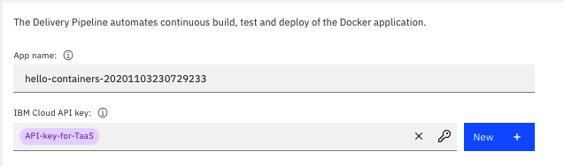
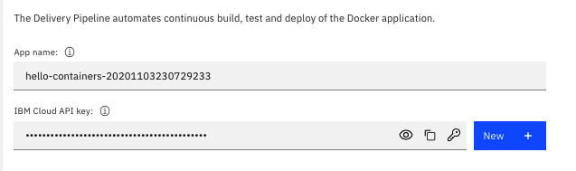
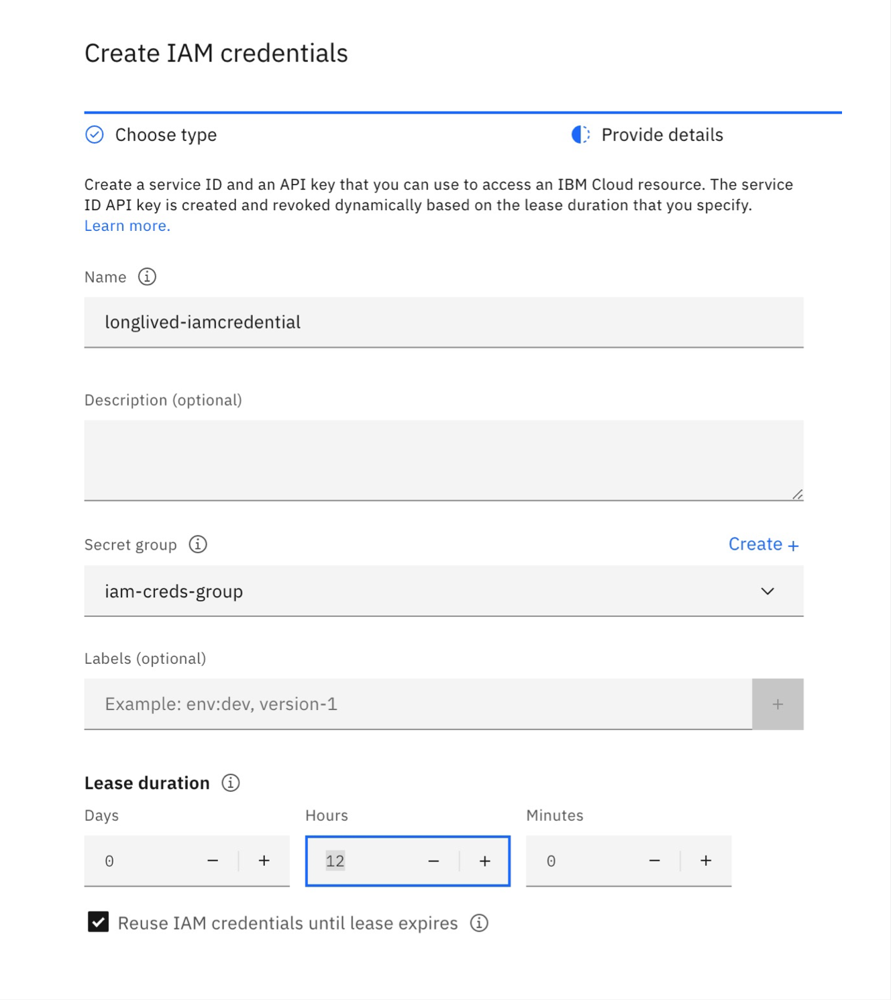
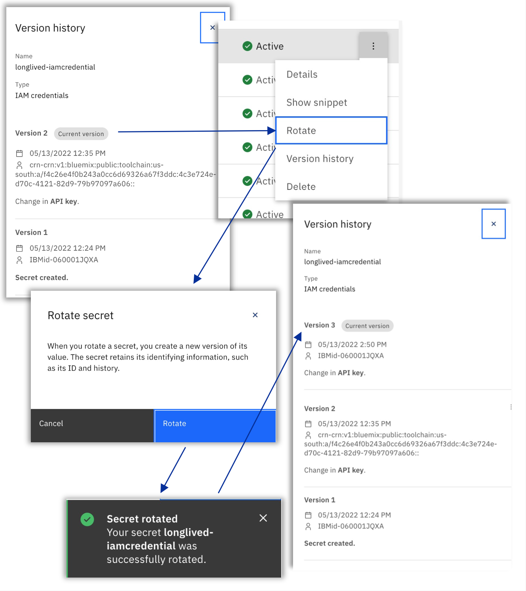

---

copyright:
  years: 2021, 2023
lastupdated: "2023-03-06"

keywords: tool integrations, IBM Cloud Public, IBM Secrets Manager

subcollection: ContinuousDelivery

---

{{site.data.keyword.attribute-definition-list}}

# Configuring {{site.data.keyword.secrets-manager_short}}
{: #secretsmanager}

{{site.data.keyword.secrets-manager_full}} helps you to securely store and apply secrets for apps across {{site.data.keyword.cloud_notm}} services.
{: shortdesc}

A *secret* is anything that provides access to sensitive information, such as an [API key](/docs/account?topic=account-manapikey). You can use the {{site.data.keyword.secrets-manager_short}} tool integration to access secrets, wherever they are required in the toolchain workflow.

Before you configure a {{site.data.keyword.secrets-manager_short}} tool integration, make sure that you [provision an instance of the {{site.data.keyword.secrets-manager_short}} service](/docs/secrets-manager?topic=secrets-manager-create-instance#create-instance-ui).
{: important}

You can configure the {{site.data.keyword.secrets-manager_short}} tool integration to identify secrets by name or by [Cloud Resource Name (CRN)](/docs/account?topic=account-crn).

## Identifying secrets by name
{: #identify_secrets_by_name}

When you configure the {{site.data.keyword.secrets-manager_short}} tool integration to identify secrets by name, your toolchain can access the following secret types:

* Identity and Access Management (IAM) credentials secrets.
* Arbitrary secrets that are stored in the {{site.data.keyword.secrets-manager_short}}.

For more information about IAM credentials secrets, and Arbitrary secrets in {{site.data.keyword.secrets-manager_short}}, see [Working with secrets of different types](/docs/secrets-manager?topic=secrets-manager-what-is-secret#secret-types).

Configure {{site.data.keyword.secrets-manager_short}} to securely manage secrets that are part of your toolchain:

1. If you are configuring this tool integration as you are creating the toolchain, in the Configurable Integrations section, click **{{site.data.keyword.secrets-manager_short}}**. If {{site.data.keyword.secrets-manager_short}} is defined as an optional tool integration, it is located under **More Tools**.
1. If you have a toolchain and are adding this tool integration to it, from the {{site.data.keyword.cloud_notm}} console, click the menu icon  and select **DevOps**. On the Toolchains page, click the toolchain to open its Overview page. Alternatively, on your app's Overview page, on the {{site.data.keyword.contdelivery_short}} card, click **View toolchain**. Then, click **Overview**.  

   a. Click **Add tool**.

   b. In the Tool Integrations section, click **{{site.data.keyword.secrets-manager_short}}**.

1. Specify a name for this instance of the {{site.data.keyword.secrets-manager_short}} tool integration to use in your toolchain. The name that you specify is used in the UI tools that select **{{site.data.keyword.secrets-manager_short}}** secrets. It is also used as part of the reference that resolves the secret values when the toolchain runs. This instance name is also displayed on the {{site.data.keyword.secrets-manager_short}} tool integration tile within the toolchain workspace.
1. Choose to identify this instance by the service instance name.
1. Review the default values for **Region** and **Resource-Group** and update, if required.
1. Select the instance of the **{{site.data.keyword.secrets-manager_short}}** service that you want to use.
1. Click **Create Integration**.

### Applying secrets
{: #secretsmanager_apply_secrets}

After your {{site.data.keyword.secrets-manager_short}} tool integration is configured, you can use it to apply secrets anywhere that they are needed by the toolchain. This tool integration and the Secrets dialog box support both the Arbitrary and the IAM credentials secret types.

You can use Arbitrary secrets to store any predefined secret value, or to store dynamically minted {{site.data.keyword.cloud_notm}} API keys by using the Secrets dialog box. You must create IAM credentials secrets directly within your {{site.data.keyword.secrets-manager_short}} service instance. After you create these secrets, you can select IAM credentials secrets to use them within your toolchain by using the Secrets dialog box on any secure field. The Secrets dialog box displays both the Arbitrary and the IAM credentials secret types, with the secret type appended to the secret name in brackets.

#### Using Arbitrary secrets that are stored in {{site.data.keyword.secrets-manager_short}}
{: #arbitrary_secrets}

You must save third-party secrets, such as a Slack webhook or an Artifactory API token, in {{site.data.keyword.secrets-manager_short}} *before* you create a new toolchain. You can mint and store IBM-managed secrets, such as {{site.data.keyword.cloud_notm}} API keys in {{site.data.keyword.secrets-manager_short}}, as Arbitrary secret types while you work with your toolchain by using the Secrets dialog. However, you must mint IAM credentials secrets directly in {{site.data.keyword.secrets-manager_short}} before you can select these types of secrets within your toolchain by using the Secrets dialog box.

The following example applies an Arbitrary secret type that is stored in {{site.data.keyword.secrets-manager_short}} to an {{site.data.keyword.cloud_notm}} API key that is required by the [{{site.data.keyword.deliverypipeline}} tool integration](/docs/ContinuousDelivery?topic=ContinuousDelivery-deliverypipeline). You can follow the same steps to apply secrets to any of the {{site.data.keyword.contdelivery_short}} tool integrations that require secret values.

1. Click the key icon to retrieve secrets from secure stores such as {{site.data.keyword.secrets-manager_short}} for the {{site.data.keyword.cloud_notm}} API key.

1. In the **Provider** field, specify the provider and the name of the {{site.data.keyword.secrets-manager_short}} tool integration that you use to manage your toolchain secrets. For example, to use the {{site.data.keyword.secrets-manager_short}} tool integration, select `Secrets Manager: ibm-secrets-manager-1`. You can use other providers to manage your toolchain secrets, such as [Hashicorp Vault](/docs/ContinuousDelivery?topic=ContinuousDelivery-hashicorpvault) and [Key Protect](/docs/ContinuousDelivery?topic=ContinuousDelivery-keyprotect).

1. Select a secret group and a secret name and click **OK** to apply the stored secret to the field that is associated with it.

   {: caption="Figure 3. Secret reference to a vault" caption-side="bottom"}

   The name of the secret that you select appears in capsule form. You cannot edit the secret name inline, but you can click  to delete the name. You can also replace the existing secret name by selecting the secret name again. If you manually type or paste a secret name into the Secrets field, it is displayed in a different format:

   {: caption="Figure 4. Secret value" caption-side="bottom"}

   The format that the secret is displayed in indicates whether the value references a secret that is stored in a backend vault or a secret that is stored in your toolchain. By using references to secrets that are managed by secret providers such as  {{site.data.keyword.secrets-manager_short}}, your secret values are centralized and stored securely in a single location. This approach resolves secrets sprawl and proliferation, and means that you can update secrets without updating your toolchain. When you use secret references, the actual secret value is resolved when the toolchain runs by dynamically retrieving it from {{site.data.keyword.secrets-manager_short}}. This approach is useful when you must rotate the value of your toolchain secrets periodically.

#### Using IAM credentials secrets
{: #iam_secrets}

The IAM credentials secret type is fully integrated with IAM. {{site.data.keyword.secrets-manager_short}} auto-manages dynamic service IDs and API keys that are associated with an IAM credentials secret. {{site.data.keyword.contdelivery_short}} and {{site.data.keyword.secrets-manager_short}} service APIs engage to resolve authorized IAM Credentials secret references in {{site.data.keyword.contdelivery_short}} toolchains and pipeline workloads.

When you create an IAM credentials secret in {{site.data.keyword.secrets-manager_short}}, make sure that you select the **Reuse IAM credentials until lease expires** checkbox. Also, specify a lease duration with a minimum of 12 hours when you use public worker agents to run your pipeline. If you use private worker agents, make sure that you set a minimum lease duration to the forced cancellation duration for a pipeline. It is recommended that you confirm these settings with your account administrator. By setting the reuse option and an appropriate lease duration, you can make sure that the dynamically managed IAM credentials service ID API key persists during your pipeline runs.
{: important}

{: caption="Figure 1. IAM credentials lease duration and reuse API key" caption-side="bottom"}

By running the Rotate action on IAM credentials from the {{site.data.keyword.secrets-manager_short}} dashboard, you can maintain the compliance posture requirements for API Key rotations that are used by your {{site.data.keyword.contdelivery_short}} pipelines. {{site.data.keyword.secrets-manager_short}} works with IAM to generate a new API Key for an IAM credentials secret and manages the versioning of the secret.

The IAM credentials secret type also helps to provide continuity of service during and after secret rotation:

* New {{site.data.keyword.contdelivery_short}} pipeline workloads use the newly rotated API Key until its lease duration expires.
* Existing {{site.data.keyword.contdelivery_short}} pipeline workloads that are running with the API Key that was issued before rotation can continue to run with the previous version until the lease duration of the previous version expires.

{: caption="Figure 2. IAM credentials secret rotation" caption-side="bottom"}

For more information about the IAM credentials secret type in {{site.data.keyword.secrets-manager_short}}, see [Creating IAM credentials](/docs/secrets-manager?topic=secrets-manager-iam-credentials).   

### Adding a {{site.data.keyword.secrets-manager_short}} tool integration to your toolchain template
{: #secretsmanager_add_toolchain_template}

You can add a {{site.data.keyword.secrets-manager_short}} tool integration to your toolchain template by adding a service definition to the `toolchain.yaml` file in your template repo. This file is the design blueprint for your toolchain and includes all of the tool integrations that are available when you create a toolchain instance based on that template. To customize an existing toolchain template to include a {{site.data.keyword.secrets-manager_short}} tool integration, insert a YAML definition. 

```yaml
  sm-compliance-secrets:
    service_id: secretsmanager
    parameters:
      name: sm-compliance-secrets
      instance-id-type: instance-name
      region: us-south
      resource-group: default
      instance-name: ffs-secrets
```

For more information about customizing toolchain templates, see [Create a template for a custom toolchain](https://www.ibm.com/cloud/architecture/tutorials/create-a-template-for-a-custom-toolchain){: external}.

## Identifying secrets by CRN
{: #identify_secrets_by_crn}

When you configure the {{site.data.keyword.secrets-manager_short}} tool integration to identify secrets by CRN, your toolchain can access arbitrary secrets that are stored in the {{site.data.keyword.secrets-manager_short}}.

For more information about arbitrary secrets in {{site.data.keyword.secrets-manager_short}}, see [Working with secrets of different types](/docs/secrets-manager?topic=secrets-manager-what-is-secret#secret-types).

Configure {{site.data.keyword.secrets-manager_short}} to securely manage secrets that are part of your toolchain:

Currently, you cannot configure a {{site.data.keyword.secrets-manager_short}} tool integration to identify secrets by CRN during toolchain creation. Instead, complete the configuration *after* you create the toolchain.
{: important}

1. If you have a toolchain and are adding this tool integration to it, from the {{site.data.keyword.cloud_notm}} console, click the menu icon  and select **DevOps**. On the Toolchains page, click the toolchain to open its Overview page. Alternatively, on your app's Overview page, on the {{site.data.keyword.contdelivery_short}} card, click **View toolchain**. Then, click **Overview**.  

   a. Click **Add tool**.

   b. In the Tool Integrations section, click **{{site.data.keyword.secrets-manager_short}}**.

1. Specify a name for this instance of the {{site.data.keyword.secrets-manager_short}} tool integration to use in your toolchain.
1. Choose to identify this instance by the service instance CRN.
1. Specify the CRN of the **{{site.data.keyword.secrets-manager_short}}** service instance where your secrets are stored. This service instance can exist in a different account if your toolchain is [authorized to access secrets](#authorizing-your-toolchain-to-access-secrets) in that account.
1. Click **Create Integration**.

### Applying secrets
{: #secretsmanager_apply_secrets}

After you configure the {{site.data.keyword.secrets-manager_short}} tool integration and [authorize your toolchain](#authorizing-your-toolchain-to-access-secrets) to access secrets in that account, you can use it to apply secrets anywhere that they are required by the toolchain. 

The Secrets dialog does not support tool integrations that are configured for **Service instance CRN**. To use an arbitrary secret in your toolchain, you must copy the CRN of the secret from the **{{site.data.keyword.secrets-manager_short}}** service instance and paste it into the edit box of secret field. The secret must reside in the **{{site.data.keyword.secrets-manager_short}}** service instance that was configured when you added the **{{site.data.keyword.secrets-manager_short}}** tool integration to your toolchain.

When fields that contain a CRN secret are displayed, the {{site.data.keyword.secrets-manager_short}} tool integration attempts to retrieve the name of the secret. To open the **{{site.data.keyword.secrets-manager_short}}** service instance where the secret resides, click the secret. In the following scenarios, the secret name cannot be retrieved and a warning icon is displayed:

* The toolchain does not contain a correctly configured **{{site.data.keyword.secrets-manager_short}}** integration.
* The toolchain authorization is incorrect.
* The field does not contain a valid CRN.

## Authorizing your toolchain to access secrets
{: #secretsmanager_authorize_secrets}

References to secrets that are stored in {{site.data.keyword.secrets-manager_short}} are dynamically resolved when the toolchain runs. To access the required secrets, you must authorize your toolchain to access the {{site.data.keyword.secrets-manager_short}} instance. If you create a toolchain that has a valid {{site.data.keyword.secrets-manager_short}} tool integration that is configured to identify secrets by name, or add this tool integration to an existing toolchain, a request is automatically issued to create the required authorization.

An authorization is not created automatically for tool integrations that are configured to identify secrets by CRN.
{: important}

To view your authorizations in {{site.data.keyword.cloud_notm}}, complete the following steps:

1. From the {{site.data.keyword.cloud_notm}} console, click **Manage** > **Access (IAM)**.
1. Click **Authorizations**.

   You can also access your authorizations on the [Manage authorizations](https://cloud.ibm.com/iam/authorizations){: external} page. 
   {: tip}

   You can create the authorization manually, if required. To successfully resolve the secret references, your toolchain instance must have both `Viewer` and `SecretsReader` access to the correct {{site.data.keyword.secrets-manager_short}} service instance. 
   
   When {{site.data.keyword.secrets-manager_short}} tool integrations that identify secrets by CRN are configured to access secrets in a different account, you must create the authorization in the account where the {{site.data.keyword.secrets-manager_short}} service instance exists.
   {: important}

## Configuring {{site.data.keyword.secrets-manager_short}} by using the API
{: #config-parameters}

The {{site.data.keyword.secrets-manager_short}} tool integration supports the following configuration parameters that you can use with the [Toolchain HTTP API and SDKs](https://cloud.ibm.com/apidocs/toolchain){: external} when you [create](https://cloud.ibm.com/apidocs/toolchain#create-tool){: external}, [read](https://cloud.ibm.com/apidocs/toolchain#get-tool-by-id){: external}, and [update](https://cloud.ibm.com/apidocs/toolchain#update-tool){: external} tool integrations.

You must specify the `tool_type_id` property in the request body with the `secretsmanager` value.
{: important}

| Parameter | Usage | Type | Terraform argument | Description |
| --- | --- | --- | --- | --- |
| name | required, updatable | String | name | The name of this tool integration. Name-based secret references include this name to identify the secrets store where the secrets reside. All of the secrets store tools that are integrated into a toolchain must have a unique name to allow secret resolution to function properly. |
| instance-id-type | required, updatable | Enum | instance_id_type | The type of service instance identifier. Accepted values are `instance-name` and `instance-crn`. By default, this value is set to `instance-name`. |
| instance-crn  | required, updatable | String | instance_crn | The CRN of the {{site.data.keyword.secrets-manager_short}} service instance. This parameter is used only when you use `instance-crn` as the `instance_id_type`. |
| region | required, updatable | String | location | The {{site.data.keyword.cloud_notm}} location where the {{site.data.keyword.secrets-manager_short}} service instance is located. This parameter is used only when you use `instance-name` as the `instance_id_type`. |
| resource-group | required, updatable | String | resource_group_name | The name of the resource group where the {{site.data.keyword.secrets-manager_short}} service instance is located. This parameter is used only when you use `instance-name` as the `instance_id_type`. |
| instance-name | required, updatable | String | instance_name | The name of the {{site.data.keyword.secrets-manager_short}} service instance. This parameter is used only when you use `instance-name` as the `instance_id_type`. |
{: caption="Table 1. {{site.data.keyword.secrets-manager_short}} tool integration parameters" caption-side="bottom"}

## Learn more about {{site.data.keyword.secrets-manager_short}}
{: #secretsmanager_learn_more}

To learn more about {{site.data.keyword.secrets-manager_short}}, see [Getting started with Secrets Manager](/docs/secrets-manager?topic=secrets-manager-getting-started).
