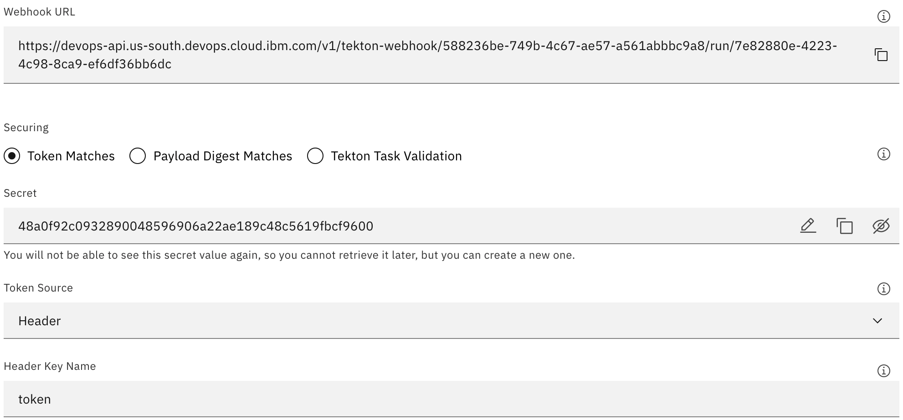

---

copyright:
  years: 2019, 2023
lastupdated: "2023-01-27"

keywords: Tekton integration, delivery pipeline, Tekton delivery pipeline

subcollection: ContinuousDelivery

---

{{site.data.keyword.attribute-definition-list}}

# Working with Tekton pipelines
{: #tekton-pipelines}

[Tekton Pipelines](https://tekton.dev/){: external} is an open source project that you can use to configure and run Continuous Integration and {{site.data.keyword.contdelivery_short}} pipelines within a Kubernetes cluster. Tekton pipelines are defined in yaml files, which are typically stored in a Git repository (repo).
{: shortdesc}

{: caption="Figure 1. Hybrid Tekton pipelines diagram" caption-side="bottom"}

Tekton provides a set of [Custom Resources](https://kubernetes.io/docs/concepts/extend-kubernetes/api-extension/custom-resources/){: external} extensions to Kubernetes to define pipelines. The following basic Tekton Pipeline resources are included in these extensions:

|Resource |Description	|
|:----------|:------------------------------|
|`Task`		|Defines a set of build steps such as compiling code, running tests, and building and deploying images.		|
|`TaskRun`		|Instantiates a Task for execution with specific inputs, outputs, and execution parameters. You can start the task on its own or as part of a pipeline.		|
|`Pipeline`		|Defines the set of tasks that compose a pipeline.		|
|`PipelineRun`		|Instantiates a Pipeline for execution with specific inputs, outputs, and execution parameters.		|
{: caption="Table 1. Tekton pipeline resources" caption-side="top"}


You can take advantage of the following features when you use Tekton Pipelines:

* **Cloud Native**: Tekton Pipelines run on Kubernetes, use Kubernetes clusters as a first class type, and use containers as their building blocks.
* **Decoupled**: You can use one pipeline to deploy to any Kubernetes cluster. You can run the tasks that comprise a pipeline in isolation. And you can switch resources (such as Git repos) between pipeline runs.
* **Typed**: You can switch implementations for specific types of resources, such as images.

The Tekton Pipelines project is a beta release. You must update your pipeline with each new version of Tekton. For more information about the latest version of Tekton, see [https://github.com/tektoncd/pipeline/releases](https://github.com/tektoncd/pipeline/releases){: external}.
{: important}

{{site.data.keyword.contdelivery_full}} provides two types of delivery pipelines that you can use to build, test, and deploy your applications.

* **Classic**: Classic delivery pipelines are created graphically, with the status embedded in the pipeline diagram. These pipelines can run on shared workers in the cloud or on private workers that run on your own Kubernetes cluster. 
* **Tekton**: Tekton delivery pipelines are created within yaml files that define pipelines as a set of Kubernetes resources. You can edit those yaml files to change the behavior of a pipeline. Tekton pipelines can run on private workers that run on your own cluster. They can also run on IBM-managed workers on the public cloud. The Tekton integration provides a dashboard that you can use to view the output of Tekton pipeline runs. It also provides mechanisms for identifying the pipeline definitions repo, the pipeline triggers, where the pipeline runs, and the storage and retrieval of properties.

Both types of pipelines isolate jobs or steps from one another by running in separate containers, and by using an image that you choose. Classic and Tekton pipelines both exist in a [toolchain](https://cloud.ibm.com/devops/toolchains){: external} and depend on that toolchain to add more tool integrations that are used in the build, test, and deployment process.
{: tip}

On 20 November 2020, Dockerhub introduced rate-limiting on anonymous image pulls. This change might impact users that are running tasks that reference Dockerhub-hosted images. It is recommended that you use an alternative registry, such as IBM Cloud Container Registry.
{: important}

## Prerequisites
{: #tekton_pipelines_prereqs}

Before you add and run a Tekton pipeline, make sure that you have the following resources in place:

* A [toolchain](https://cloud.ibm.com/devops/toolchains) that contains the following tool integrations:

   * A repo tool integration (such as the GitHub tool integration) that contains your Tekton pipeline code, including a Tekton yaml file. Find sample pipeline and task definitions on [GitHub](https://github.com/open-toolchain/hello-tekton){: external}. For more information about getting started with Tekton pipelines, see [Tekton Pipelines](https://github.com/tektoncd/pipeline/blob/master/docs/pipelines.md){: external} or take the [Develop a Kubernetes app by using Tekton delivery pipelines](https://www.ibm.com/cloud/architecture/tutorials/develop-kubernetes-app-using-tekton-delivery-pipelines){: external} tutorial.
   * Optional. If you are not using the default shared Pipeline Worker, you can use a {{site.data.keyword.deliverypipeline}} Private Worker tool integration that references your Kubernetes cluster. For more information about private workers, see [Installing Delivery Pipeline Private Workers](/docs/ContinuousDelivery?topic=ContinuousDelivery-install-private-workers).

* [{{site.data.keyword.cloud_notm}} CLI](/docs/cli?topic=cli-install-ibmcloud-cli) installed locally.
* [kubectl](https://kubernetes.io/docs/tasks/tools/install-kubectl/){: external} installed locally.
* A Kubernetes cluster (version 1.22 or higher) such as an [{{site.data.keyword.containerlong}} cluster](https://cloud.ibm.com/kubernetes/catalog/cluster){: external}.

The toolchain and the {{site.data.keyword.deliverypipeline}} Private Worker tool integration must be in the same region. 
{: important}

## Creating a {{site.data.keyword.deliverypipeline}} for Tekton by using the console
{: #create_tekton_pipeline}
{: ui}

When you configure a {{site.data.keyword.deliverypipeline}} tool integration, you can select the type of pipeline that you want to create.

1. If you don't have a toolchain, select a template to [create a toolchain](https://cloud.ibm.com/devops/create){: external}. Depending on the template that you use, different fields might be available. Review the default field values and if needed, change those settings.
1. If you have a toolchain and are adding this tool integration to it, from the {{site.data.keyword.cloud_notm}} console, click the menu icon  and select **DevOps**. On the [Toolchains page](https://cloud.ibm.com/devops/toolchains){: external}, click the toolchain to open its Overview page. Alternatively, on your app's Overview page, on the Continuous delivery card, click **View toolchain**. Then, click **Overview**.
1. Add the Delivery Pipeline integration to your toolchain:

   a. Click **Add tool**.

   b. In the Tool Integrations section, click **{{site.data.keyword.deliverypipeline}}**.

1. Specify a name for your new pipeline.
1. Select **Tekton** to create a Tekton {{site.data.keyword.deliverypipeline}}. This type of pipeline provides a dashboard that you can use to view the output of Tekton pipeline runs on a defined Kubernetes cluster, with support for configuring the pipeline definitions repos, the pipeline triggers, where the pipeline runs, and simple secrets.
1. If you plan to use your pipeline to deploy a user interface, select the **Show apps in the View app menu** checkbox. All of the apps that your pipeline creates are shown in the **View App** list on the toolchain's Overview page.
1. Click **Create Integration** to add the {{site.data.keyword.deliverypipeline}} to your toolchain.

### Configuring a {{site.data.keyword.deliverypipeline}} for Tekton by using the console
{: #configure_tekton_pipeline}
{: ui}

1. From your toolchain's Overview page, on the **Delivery pipelines** card, click the **{{site.data.keyword.deliverypipeline}}** to open the Tekton {{site.data.keyword.deliverypipeline}} dashboard.
1. In the **Definitions** section, complete the following tasks:

   a. Specify the Git repo and URL that contains the Tekton pipeline definition and related artifacts. If your repo is not available, return to the toolchain Overview page and add your repo.

   b. Select the branch within your Git repo that you want to use, or type a tag.
 
   c. Specify the path to your pipeline definition within the Git repo. You can reference a specific definition within the same repo. You can also add multiple definition repos, if they are integrated with the toolchain. 

   d. Save your changes.

   The pipeline definition is updated automatically.
   
   The computed pipeline definition size limit is 1 MB. If you encounter errors when you save or run your pipeline, you might need to reduce the size of your pipeline definition, or split it into multiple pipelines.
   {: important}
 
1. In the **Worker** section, select the IBM Managed shared worker or the private worker that you want to use to run your Tekton pipeline. For more information about private workers, see [Working with Delivery Pipeline Private Workers](/docs/ContinuousDelivery?topic=ContinuousDelivery-private-workers).

   The private worker must be defined in the same toolchain as your Tekton pipeline.
   {: important}

1. In the **Triggers** section, click **Add** to create a trigger, select the type of trigger to add, and associate the trigger with an event listener. The list of available event listeners contains the listeners that are defined in the pipeline code repo.
 
   Triggers are based on [Tekton trigger definitions](https://github.com/tektoncd/triggers){: external}. Git repo triggers use the event listener that they are mapped to to extract information from the incoming event payload and create Kubernetes resources. These resources are applied to a Tekton `PipelineRun` resource.
   {: tip}

   Triggered pipeline runs are run concurrently unless you configure the trigger to serialize runs by using the `Limit concurrent runs` option. When this option is enabled, you can limit the number of simultaneous runs that can be started by this trigger. For example, if the maximum limit is set to 1, only one pipeline run for this trigger runs at a time and any others are queued in a waiting state. A maximum of 10 runs (4 if you are using IBM Managed Workers) are queued in a waiting state before subsequent requests are automatically cancelled.
   {: tip}

   **Manual triggers** run when you click the **Run** pipeline button and select the trigger.

   **Git repository triggers** run when the specified Git event type occurs for the specified Git repo and branch.
  
   You can access the webhook payload that is delivered to a Git trigger from your Tekton pipeline resources. Although the exact fields are repo-specific, the general syntax for the webhook payload is `$(event.payloadFieldName)`. Before you can create a webhook, you must authorize Git Admin access for the corresponding Git integration. To authorize Git Admin access, [configure and save the Git integration](/docs/ContinuousDelivery?topic=ContinuousDelivery-toolchains-using#configuring_a_tool_integration) again.
   {: tip}

   **Timed triggers** run at a scheduled time that is defined by the [CRON](http://crontab.org/){: external} value. The CRON expression for **timed triggers** is based on the [UNIX crontab syntax](http://crontab.org/){: external} and is a sequence of five time and date fields: `minute`, `hour`, `day of the month`, `month`, and `day of the week`. These fields are separated by spaces in the format `X X X X X`. The maximum frequency for a timed trigger is once every five minutes. The following examples show strings that use various timed frequencies.

    * `*/5 * * * *` - The trigger runs every 5 minutes.
    * `0 * * * *` - The trigger runs at the start of every hour.
    * `0 9 * 1 MON-FRI` - The trigger runs at 9:00 AM every weekday in January.
    * `0 * * NOV,DEC 1` - The trigger runs every hour on Mondays during November and December.

   **Generic webhook triggers** run when a POST request that is configured with the secret setting goes to the generic webhook URL. Generic webhook triggers provide a unique webhook URL for POST requests. 
 
   Because the PipelineRun UI does not hide the generic webhook payload values in the event payload section, do not include sensitive data in the payload. Instead, secure any data that is required by a generic webhook by using trigger properties, such as passwords or API key secrets.
   {: important} 
 
   You can secure generic webhook triggers to work with Git, a Slack outgoing webhook, an Artifactory webhook, and more by using any of the following methods:

   * Token matches to compare the saved token and the token that is passed within the POST request. Supported token sources include a header, query, or payload. Token matches are used by GitLab webhooks and Slack outgoing webhooks.
   * Payload digest matches to compare the signature and the hash that are generated from the digested payload by using HMAC hex digest with a saved token. Supported signature sources might include a header, query, or payload. Users must specify a digest algorithm. Payload digest matches are used by GitHub webhooks.
   * Tekton task validation requires users to validate the webhook request within their Tekton tasks.

   Specify the following values to use generic webhook triggers with GitHub webhooks:
 
   * Securing: `Payload Digest Matches`
   * Signature Source: `Header`
   * Header Key Name: `X-Hub-Signature`
   * Digest Algorithm: `sha1`.  
 
   Specify the following values to use generic webhook triggers with GitLab webhooks:

   * Securing: `Token Matches`
   * Token Source: `Header`
   * Header Key Name: `X-Gitlab-Token`

   Specify the following values to use generic webhook triggers with Slack outgoing webhooks:

   * Securing: `Token Matches`
   * Token Source: `Payload`
   * JSON Property Name / Form Key: `token`

   The following example shows how to use the curl command with a generic webhook that is secured with a `Token Matches` rule:

   {: caption="Figure 2. Generic webhook example" caption-side="bottom"}

   ```text
   curl -X POST \
   https://devops-api.us-south.devops.cloud.ibm.com/v1/tekton-webhook/588236be-749b-4c67-ae57-a561abbbc9a8/run/7e82880e-4223-4c98-8ca9-ef6df36bb6dc \
   -H 'Content-Type: application/json' \
   -H 'token: 48a0f92c0932890048596906a22ae189c48c5619fbcf9600' \
   -d '{
   "somekey": "somevalue"
   }'
   ```
   {: codeblock}

   To obtain payload values in the pipeline definition, specify a Triggerbinding parameter with a value that is derived from the event:
 
   ```text
   apiVersion: tekton.dev/v1beta1
   kind: TriggerBinding
   metadata:
   name: binding
   spec:
   params:
   - name: somekey
   value: $(event.somekey)
   ```
   {: codeblock}

   Save your changes.

1. In the **Environment properties** section, click **Add** and select a property type to define your own environment property. For example, you can define an `API_KEY` property that passes an API key that is used by all of the scripts in the pipeline to access {{site.data.keyword.cloud_notm}} resources. You can add the following types of properties:

   * **Enumeration**: A property key with a value that can be selected from a user-defined list of options.
   * **Secure value**: A property key with a single-line value that is secured with AES-128 encryption. This value is displayed by using the asterisk character. Alternatively, you can click the key icon to select a secret from a vault integration (such as IBM Key Protect), if such a tool is available in your toolchain.
   * **Text value**: A property key with a text value that can either be single-line or multi-line. Previously, multi-line values were supported by a separate **Text area** property type.
   * **Tool integration**: A property key with a value that is resolved at run time from a toolchain tool integration. By default, the value is a JSON string representation of the tool integration. A specific field or subset of the object can be retrieved by providing a value for the optional JSON filter. For example, if a GitHub integration is selected and the JSON filter `parameters.repo_url` is specified, the value reflects the URL of the Git repo that is configured in the tool integration when the `PipelineRun` resource runs.
 
   You can access these properties in your Tekton pipeline resources. For more information about these properties, see [Tekton Pipelines environment and resources](/docs/ContinuousDelivery?topic=ContinuousDelivery-tekton_environment).

1. Click **Save**.

## Creating a {{site.data.keyword.deliverypipeline}} for Tekton with the API
{: #create_tekton_pipeline_api}
{: api}

1. [Obtain an IAM bearer token](https://{DomainName}/apidocs/resource-controller#authentication){: external}.
1. [Determine the region and ID of the toolchain](/docs/ContinuousDelivery?topic=ContinuousDelivery-toolchains_getting_started&interface=api#viewing-toolchain-api) to which you want to add the {{site.data.keyword.deliverypipeline}} tool integration.
1. Add the {{site.data.keyword.deliverypipeline}} tool integration to the toolchain.

   ```curl
   curl -X POST \
     https://api.{region}.devops.cloud.ibm.com/toolchain/v2/toolchains/{toolchain_id}/tools \
     -H 'Authorization: Bearer {token}' \
     -H 'Accept: application/json` \
     -H 'Content-Type: application/json' \
       -d '{
       "tool_type_id": "pipeline",
       "parameters": {
         "name":"{tool_integration_name}", "type":"tekton"
         }
     }'
   ```
   {: pre}

The following table lists and describes each of the variables that are used in the previous step.   
    
| Variable | Description |
|:---------|:------------|
| `{region}` | The region in which the toolchain resides, for example, `us-south`. |
| `{tool_integration_name}` | A name for your tool integration, for example, `ci-pipeline`.|
| `{toolchain_id}` | The ID of the toolchain to which to add the tool integration. |
| `{token}` | A valid IAM bearer token. |
{: caption="Table 2. Variables for adding the {{site.data.keyword.deliverypipeline}} tool integration with the API" caption-side="top"}

 
1. Configure the {{site.data.keyword.deliverypipeline}} to use public managed workers within the specified regions.

   ```curl
      curl -X POST \
        https://api.{region}.devops.cloud.ibm.com/pipeline/v2/tekton_pipelines \
        -H 'Authorization: Bearer {token}' \
        -H 'Accept: application/json` \
        -H 'Content-Type: application/json' \
          -d '{
          "id": "{pipeline_id}", "worker": { "id": "public" } }
        }'
   ```
   {: pre}

The following table lists and describes each of the variables that are used in the previous step.   
    
| Variable | Description |
|:---------|:------------|
| `{region}` | The region in which the toolchain resides, for example, `us-south`. |
| `{pipeline_id}` | The ID of the pipeline that is returned from the previous step where the pipeline tool integration was created. |
| `{token}` | A valid IAM bearer token. |
{: caption="Table 3. Variables for configuring the {{site.data.keyword.deliverypipeline}} with the API" caption-side="top"}

For more information about the {{site.data.keyword.deliverypipeline}} API, see the [API Docs](https://cloud.ibm.com/apidocs/tekton-pipeline){: external}.

## Creating a {{site.data.keyword.deliverypipeline}} for Tekton with Terraform
{: #create_tekton_pipeline_terraform}
{: terraform}

1. To install the Terraform CLI and configure the {{site.data.keyword.cloud_notm}} provider plug-in for Terraform, follow the tutorial for [Getting started with Terraform on {{site.data.keyword.cloud}}](/docs/ibm-cloud-provider-for-terraform?topic=ibm-cloud-provider-for-terraform-getting-started).

1. Create a Terraform configuration file that is named `main.tf`. In this file, add the configuration to create a pipeline by using the HashiCorp Configuration Language. For more information about using this configuration language, see the [Terraform documentation](https://www.terraform.io/docs/language/index.html){: external}.

   A pipeline must belong to a toolchain. You can also create toolchains by [using Terraform](/docs/ContinuousDelivery?topic=ContinuousDelivery-toolchains_getting_started&interface=terraform).
   {: tip}
   
   The following example creates a toolchain and a pipeline by using the specified Terraform resources.
  
   ```terraform
   data "ibm_resource_group" "group" {
     name = "default"
   }

   resource "ibm_cd_toolchain" "my_toolchain" {
     name              = "terraform_toolchain"
     resource_group_id = data.ibm_resource_group.group.id
   }

   resource "ibm_cd_toolchain_tool_pipeline" "my_pipeline_tool" {
     parameters {
        name = "terraform-pipeline-integration"
     }
     toolchain_id = ibm_cd_toolchain.my_toolchain.id
   }

   resource "ibm_cd_tekton_pipeline" "my_tekton_pipeline" {
    worker {
        id = "public"
    }
    pipeline_id = ibm_cd_toolchain_tool_pipeline.my_pipeline_tool.tool_id
   }
   ```
   {: codeblock}

   For more information about the [`ibm_cd_toolchain_tool_pipeline`](https://registry.terraform.io/providers/IBM-Cloud/ibm/latest/docs/resources/cd_toolchain_tool_pipeline){: external} and [`ibm_cd_tekton_pipeline`](https://registry.terraform.io/providers/IBM-Cloud/ibm/latest/docs/resources/cd_tekton_pipeline){: external} resources, see the argument reference details in the Terraform Registry Documentation.
  
1. Initialize the Terraform CLI, if required.

   ```terraform
   terraform init
   ```
   {: pre}
   
1. Create a Terraform execution plan. This plan summarizes all of the actions that must run to create a toolchain.

   ```terraform
   terraform plan
   ```
   {: pre}

1. Apply the Terraform execution plan. Terraform takes all of the required actions to create the toolchain.

   ```terraform
   terraform apply
   ```
   {: pre}

## Viewing a {{site.data.keyword.deliverypipeline}} for Tekton dashboard 
{: #view_tekton_dashboard}

You can view a pipeline by using the console UI, with the API, or with Terraform.

### Viewing a {{site.data.keyword.deliverypipeline}} by using the console
{: #viewing-pipeline-console}
{: ui}

In the **PipelineRuns** section, the Tekton {{site.data.keyword.deliverypipeline}} dashboard displays an empty table until at least one Tekton pipeline runs. After Tekton pipeline runs occur (either manually or as the result of external events), the table lists those runs and the related information such as status, trigger, and duration.

Pipeline runs can be in any of the following states:

* **Pending**: `PipelineRun` is requested.
* **Running**: `PipelineRun` is running on the cluster.
* **Succeeded**: `PipelineRun` successfully completed on the cluster.
* **Failed**: `PipelineRun` failed. Review the log file for the run to determine the cause.
* **Queued**: `PipelineRun` is accepted for processing and runs when worker capacity is available.
* **Waiting**: `PipelineRun` is waiting to be queued.
* **Cancelled**: `PipelineRun` was cancelled by the system or by the user. The system cancels `PipelineRun` when the number of waiting runs exceeds the allowed limit.
* **Error**: `PipelineRun` contains errors that prevented it from being applied on the cluster. For more information about the cause of the error, see the run details.

For detailed information about a selected run, click any row in the table to view the `Task` definition and the steps in each `PipelineRun` definition. You can also view the status, logs, and details of each `Task` definition and step, and the overall status of the `PipelineRun` definition.

The retention period for PipelineRuns and their logs depends on the plan that is selected for the {{site.data.keyword.contdelivery_short}} service instance. Tekton pipelines under the Professional plan are retained for one year. Tekton pipelines under the Lite plan are retained for 30 days. To retain any `PipelineRuns` beyond the retention period, in the PipelineRuns section, select **Actions > **Download** to download a .zip file.
{: important}

### Viewing a {{site.data.keyword.deliverypipeline}} with the API
{: #viewing-pipeline-terraform}
{: api}

1. [Obtain an IAM bearer token](https://{DomainName}/apidocs/resource-controller#authentication){: external}.
1. Get the pipeline data.
   
   ```curl
   curl -X GET \
     https://api.{region}.devops.cloud.ibm.com/pipeline/v2/tekton_pipelines/{pipeline_id} \
     -H 'Authorization: Bearer {token}' \
     -H 'Accept: application/json`
   ```
   {: pre}

The following table lists and describes each of the variables that are used in the previous step.   
    
| Variable | Description |
|:---------|:------------|
| `{region}` | The region in which the pipeline resides, for example, `us-south`. |
| `{pipeline_id}` | The ID of the pipeline that you want to view. |
| `{token}` | A valid IAM bearer token. |
{: caption="Table 4. Variables for viewing the {{site.data.keyword.deliverypipeline}} with the API" caption-side="top"}

### Viewing a {{site.data.keyword.deliverypipeline}} with Terraform
{: #viewing-pipeline-terraform}
{: terraform}

1. Locate the Terraform file (for example, `main.tf`) that contains the `resource` block for the existing pipeline.
1. Add an `output` block to the Terraform file, if it does not already contain a block.

   The `resource` in the following example describes an existing pipeline. The `output` block instructs Terraform to output the attributes of the specified resource.
  
   ```terraform
   data "ibm_resource_group" "group" {
     name = "default"
   }

   resource "ibm_cd_toolchain" "my_toolchain" {
     name              = "terraform_toolchain"
   resource_group_id = data.ibm_resource_group.group.id
   }

   resource "ibm_cd_toolchain_tool_pipeline" "my_pipeline_tool" {
     parameters {
       name = "terraform-pipeline-integration"
     }
     toolchain_id = ibm_cd_toolchain.my_toolchain.id
   }

   resource "ibm_cd_tekton_pipeline" "my_tekton_pipeline" {
     worker {
       id = "public"
     }
     pipeline_id = ibm_cd_toolchain_tool_pipeline.my_pipeline_tool.tool_id
   }

   output "my_tekton_pipeline_attributes" {
     value = ibm_cd_tekton_pipeline.my_tekton_pipeline
   }
   ```
   {: codeblock}

   For more information about the [`ibm_cd_toolchain_tool_pipeline`](https://registry.terraform.io/providers/IBM-Cloud/ibm/latest/docs/resources/cd_toolchain_tool_pipeline){: external} and [`ibm_cd_tekton_pipeline`](https://registry.terraform.io/providers/IBM-Cloud/ibm/latest/docs/resources/cd_tekton_pipeline){: external} resources, see the argument reference details in the Terraform Registry Documentation.

1. Initialize the Terraform CLI, if required.
 
   ```terraform
   terraform init
   ```
   {: pre}

1. Apply the Terraform execution plan with the `refresh-only` option. Terraform refreshes its state and displays the attributes of the pipeline resource.

   ```terraform
   terraform apply -refresh-only -auto-approve
   ```
   {: pre}

## Deleting a {{site.data.keyword.deliverypipeline}} with the API
{: #deleting-pipeline-api}
{: api}

1. [Obtain an IAM bearer token](https://{DomainName}/apidocs/resource-controller#authentication){: external}.
1. [Determine the region and ID of the toolchain](/docs/ContinuousDelivery?topic=ContinuousDelivery-toolchains_getting_started&interface=api#viewing-toolchain-api) that you want to add the {{site.data.keyword.DRA_short}} tool integration to.
1. Delete the pipeline.
   
   ```curl
   curl -X DELETE \
     https://api.{region}.devops.cloud.ibm.com/toolchain/v2/toolchains/{toolchain_id}/tools/{pipeline_id} \
     -H 'Authorization: Bearer {token}'
   ```
   {: pre}

The following table lists and describes each of the variables that are used in the previous step.   
    
| Variable | Description |
|:---------|:------------|
| `{region}` | The region in which the toolchain resides, for example, `us-south`. |
| `{toolchain_id}` | The ID of the toolchain that contains the pipeline to delete. |
| `{pipeline_id}` | The ID of the pipeline that you want to delete. |
| `{token}` | A valid IAM bearer token. |
{: caption="Table 5. Variables for deleting the {{site.data.keyword.deliverypipeline}} with the API" caption-side="top"}

## Deleting a {{site.data.keyword.deliverypipeline}} with Terraform
{: #deleting-pipeline-terraform}
{: terraform}

1. Locate the Terraform file (for example, `main.tf`) that contains the `resource` block for the existing pipeline.

   The `resource` in the following example describes an existing pipeline.

   ```terraform
   data "ibm_resource_group" "group" {
     name = "default"
   }

   resource "ibm_cd_toolchain" "my_toolchain" {
     name              = "terraform_toolchain"
     resource_group_id = data.ibm_resource_group.group.id
   }

   resource "ibm_cd_toolchain_tool_pipeline" "my_pipeline_tool" {
     parameters {
        name = "terraform-pipeline-integration"
     }
     toolchain_id = ibm_cd_toolchain.my_toolchain.id
   }

   resource "ibm_cd_tekton_pipeline" "my_tekton_pipeline" {
    worker {
        id = "public"
    }
    pipeline_id = ibm_cd_toolchain_tool_pipeline.my_pipeline_tool.tool_id
   }
   ```
   {: codeblock}

1. Remove the `ibm_cd_toolchain_tool_pipeline` and `ibm_cd_tekton_pipeline` `resource` blocks from your Terraform file.
1. Initialize the Terraform CLI, if required.

   ```terraform
   terraform init
   ```
   {: pre}

1. Create a Terraform execution plan. This plan summarizes all of the actions that must run to delete the pipeline.

   ```terraform
   terraform plan
   ```
   {: pre}

1. Apply the Terraform execution plan. Terraform takes all of the required actions to delete the pipeline.

   ```terraform
   terraform apply
   ```
   {: pre}

## Viewing details for a TaskRun pod
{: #view_pod_details}
{: ui}

To view information about the underlying Kubernetes pod for a specific `TaskRun`, click the `Task` name and then click **Pod**.

You can view the details for the pod and any related events that are reported by the worker. This information can help you to debug specific failures or to determine where time is spent during a run.

## Learn more about Tekton pipelines and resources
{: #learn_more_tekton_pipelines}

To learn more about Tekton pipelines, see the [Tekton: A Modern Approach to Continuous Delivery](https://www.ibm.com/cloud/blog/tekton-a-modern-approach-to-continuous-delivery){: external} and [IBM Cloud Continuous Delivery Tekton Pipelines Tools and Resources](https://www.ibm.com/cloud/blog/ibm-cloud-continuous-delivery-tekton-pipelines-tools-and-resources){: external} articles. You can also take this tutorial:

* [Develop a Kubernetes app by using Tekton delivery pipelines](https://www.ibm.com/cloud/architecture/tutorials/develop-kubernetes-app-using-tekton-delivery-pipelines){: external} tutorial.

To learn more about the Tekton tasks that you can reference within your pipelines, see the [Open Toolchain Tekton Catalog](https://github.com/open-toolchain/tekton-catalog/tree/master/container-registry){: external}. This GitHub repo contains a set of tasks that you can reuse in your Tekton pipelines. 
