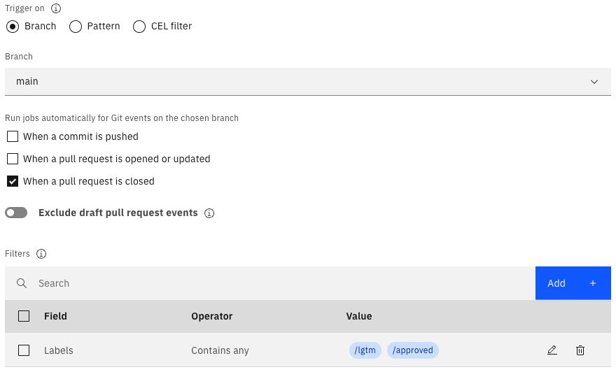
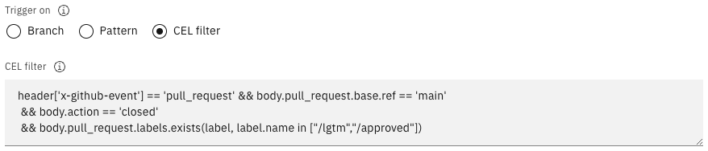
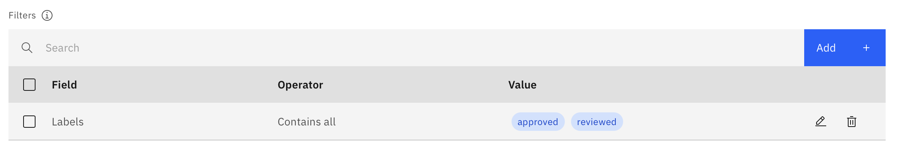

---

copyright:
  years: 2019, 2025
lastupdated: "2025-12-04"

keywords: Tekton integration, delivery pipeline, Tekton delivery pipeline

subcollection: ContinuousDelivery

---

{{site.data.keyword.attribute-definition-list}}


# Working with Tekton pipelines
{: #tekton-pipelines}

[Tekton Pipelines](https://tekton.dev/){: external} is an open source project that you can use to configure and run Continuous Integration and {{site.data.keyword.contdelivery_short}} pipelines within a Kubernetes cluster. Tekton pipelines are defined in yaml files, which are typically stored in a Git repository (repo).
{: shortdesc}

{: caption="Hybrid Tekton pipelines diagram" caption-side="bottom"}

Tekton provides a set of [Custom Resources](https://kubernetes.io/docs/concepts/extend-kubernetes/api-extension/custom-resources/){: external} extensions to Kubernetes to define pipelines. The following basic Tekton Pipeline resources are included in these extensions:

|Resource |Description	|
|:----------|:------------------------------|
|`Task`		|Defines a set of build steps such as compiling code, running tests, and building and deploying images.		|
|`TaskRun`		|Instantiates a Task for execution with specific inputs, outputs, and execution parameters. You can start the task on its own or as part of a pipeline.		|
|`Pipeline`		|Defines the set of tasks that compose a pipeline.		|
|`PipelineRun`		|Instantiates a Pipeline for execution with specific inputs, outputs, and execution parameters.		|
{: caption="Tekton pipeline resources" caption-side="top"}

You can take advantage of the following features when you use Tekton Pipelines:

* **Cloud Native**: Tekton Pipelines run on Kubernetes, use Kubernetes clusters as a first class type, and use containers as their building blocks.
* **Decoupled**: You can use one pipeline to deploy to any Kubernetes cluster. You can run the tasks that comprise a pipeline in isolation. And you can switch resources (such as Git repos) between pipeline runs.
* **Typed**: You can switch implementations for specific types of resources, such as images.

The Tekton Pipelines project is a beta release. You must update your pipeline with each new version of Tekton. For more information about the latest version of Tekton, see [https://github.com/tektoncd/pipeline/releases](https://github.com/tektoncd/pipeline/releases){: external}.
{: important}

{{site.data.keyword.contdelivery_full}} provides two types of delivery pipelines that you can use to build, test, and deploy your applications.

* **Classic**: Classic delivery pipelines are created graphically, with the status embedded in the pipeline diagram. These pipelines can run on shared workers in the cloud or on private workers that run on your own Kubernetes cluster. 
* **Tekton**: Tekton delivery pipelines are created within yaml files that define pipelines as a set of Kubernetes resources. You can edit those yaml files to change the behavior of a pipeline. Tekton pipelines can run on private workers that run on your own cluster. They can also run on IBM-managed workers on the public cloud. The Tekton integration provides a dashboard that you can use to view the status of Tekton pipeline runs and trigger new runs. It also provides mechanisms for specifying the pipeline triggers, the pipeline definitions, the worker on which the pipeline is run, and the pipeline properties.

Both types of pipelines isolate jobs or steps from one another by running in separate containers, and by using an image that you choose. Classic and Tekton pipelines both exist in a [toolchain](https://cloud.ibm.com/devops/toolchains){: external} and depend on that toolchain to add more tool integrations that are used in the build, test, and deployment process.
{: tip}

On 20 November 2020, Dockerhub introduced rate-limiting on anonymous image pulls. This change might impact users that are running tasks that reference Dockerhub-hosted images. It is recommended that you use an alternative registry, such as IBM Cloud Container Registry.
{: important}

## Prerequisites
{: #tekton_pipelines_prereqs}

Before you add and run a Tekton pipeline, make sure that you have the following resources in place:

* A [toolchain](https://cloud.ibm.com/devops/toolchains) that contains the following tool integrations:

   * A repo tool integration (such as the GitHub tool integration) that contains your Tekton pipeline code, including a Tekton yaml file. Find sample pipeline and task definitions on [GitHub](https://github.com/open-toolchain/hello-tekton){: external}. For more information about getting started with Tekton pipelines, see [Tekton Pipelines](https://github.com/tektoncd/pipeline/blob/main/docs/pipelines.md){: external}.
   * Optional. If you are not using the default shared Pipeline Worker, you can use a {{site.data.keyword.deliverypipeline}} Private Worker tool integration that references your Kubernetes cluster. For more information about private workers, see [Installing Delivery Pipeline Private Workers](/docs/ContinuousDelivery?topic=ContinuousDelivery-install-private-workers).

* [{{site.data.keyword.cloud_notm}} CLI](/docs/cli?topic=cli-install-ibmcloud-cli) installed locally.
* [kubectl](https://kubernetes.io/docs/tasks/tools/){: external} installed locally.
* A Kubernetes cluster (version 1.22 or higher) such as an [{{site.data.keyword.containerlong}} cluster](https://cloud.ibm.com/kubernetes/catalog/about){: external}.

The toolchain and the {{site.data.keyword.deliverypipeline}} Private Worker tool integration must be in the same region.
{: important}

## Creating a {{site.data.keyword.deliverypipeline}} for Tekton by using the console
{: #create_tekton_pipeline}
{: ui}

When you configure a {{site.data.keyword.deliverypipeline}} tool integration, you can select the type of pipeline that you want to create.

1. If you don't have a toolchain, select a template to [create a toolchain](https://cloud.ibm.com/devops/create){: external}. Depending on the template that you use, different fields might be available. Review the default field values and if needed, change those settings.
1. If you have a toolchain and are adding this tool integration to it, from the {{site.data.keyword.cloud_notm}} console, click the **Menu** icon  > **Platform Automation** > **Toolchains**. On the [Toolchains page](https://cloud.ibm.com/devops/toolchains){: external}, click the toolchain to open its Overview page. 
1. Add the Delivery Pipeline integration to your toolchain:

   a. Click **Add tool**.

   b. In the Tool Integrations section, click **{{site.data.keyword.deliverypipeline}}**.

1. Specify a name for your new pipeline.
1. Select **Tekton** to create a Tekton {{site.data.keyword.deliverypipeline}}. You can view the output of Tekton pipeline runs on a defined Kubernetes cluster, with support for configuring the pipeline definitions repos, the pipeline triggers, where the pipeline runs, and simple secrets.
1. If you plan to use your pipeline to deploy a user interface, select the **Show apps in the View app menu** checkbox. All of the apps that your pipeline creates are shown in the **View App** list on the toolchain's Overview page.
1. Click **Create Integration** to add the {{site.data.keyword.deliverypipeline}} to your toolchain.

### Configuring a {{site.data.keyword.deliverypipeline}} for Tekton by using the console
{: #configure_tekton_pipeline}
{: ui}

1. From your toolchain's Overview page, on the **Delivery pipelines** card, click the **{{site.data.keyword.deliverypipeline}}** to open the Tekton {{site.data.keyword.deliverypipeline}} Overview page. 
1. Click **Settings**. In the **Definitions** section, complete the following tasks:

   a. Specify the Git repo and URL that contains the Tekton pipeline definition and related artifacts. If your repo is not available, return to the toolchain Overview page and add your repo.

   b. Select the branch within your Git repo that you want to use, or type a tag.

   c. Specify the path to your pipeline definition within the Git repo. You can reference a specific definition within the same repo. You can also add multiple definition repos, if they are integrated with the toolchain. 

   d. Save your changes.

   The pipeline definition is updated automatically.

   The computed pipeline definition size limit is 1 MB. If you encounter errors when you save or run your pipeline, you might need to reduce the size of your pipeline definition, or split it into multiple pipelines.
   {: important}

1. In the **Worker** section, select the IBM Managed shared worker or the private worker that you want to use to run your Tekton pipeline. For more information about private workers, see [Working with Delivery Pipeline Private Workers](/docs/ContinuousDelivery?topic=ContinuousDelivery-private-workers).

   The private worker must be defined in the same toolchain as your Tekton pipeline.
   {: important}

1. In the **Environment properties** section, click **Add** and select a property type to define your own environment property. For example, you can define an `API_KEY` property that passes an API key that is used by all of the scripts in the pipeline to access {{site.data.keyword.cloud_notm}} resources. You can add the following types of properties:

   * **Enumeration**: A property key with a value that can be selected from a user-defined list of options.
   * **Secure value**: A property key with a single-line value that is secured with AES-128 encryption. This value is displayed by using the asterisk character. Alternatively, you can click the key icon to select a secret from a vault integration (such as IBM Key Protect), if such a tool is available in your toolchain.
   * **Text value**: A property key with a text value that can either be single-line or multi-line. Previously, multi-line values were supported by a separate **Text area** property type.
   * **Tool integration**: A property key with a value that is resolved at run time from a toolchain tool integration. By default, the value is a JSON string representation of the tool integration. A specific field or subset of the object can be retrieved by providing a value for the optional JSON filter. For example, if a GitHub integration is selected and the JSON filter `parameters.repo_url` is specified, the value reflects the URL of the Git repo that is configured in the tool integration when the `PipelineRun` resource runs.

   You can access these properties in your Tekton pipeline resources. For more information about these properties, see [Tekton Pipelines environment and resources](/docs/ContinuousDelivery?topic=ContinuousDelivery-tekton_environment).

   Properties can be locked to prevent them from being overridden. Attempting to override a locked property at runtime will result in the run request being rejected. Locked properties are not displayed by default in the run side panel but can be displayed read-only by enabling the 'Show all properties' option.

1. Click **Save**.

1. On the Pipeline Overview page, click **Add** to create a trigger, select the type of trigger to add, and associate the trigger with an event listener. The list of available event listeners contains the listeners that are defined in the pipeline code repo.

   Triggers are based on [Tekton trigger definitions](https://github.com/tektoncd/triggers){: external}. Git repo triggers use the event listener to which they are mapped, to extract information from the incoming event payload and create Kubernetes resources. These resources are applied to a Tekton `PipelineRun` resource.
   {: tip}

   Triggered pipeline runs are run concurrently unless you configure the trigger to serialize runs by using the `Limit concurrent runs` option. When this option is enabled, you can limit the number of simultaneous runs that can be started by this trigger. For example, if the maximum limit is set to 1, only one pipeline run for this trigger runs at a time and any others are queued in a "Waiting" state. A maximum of 20 runs (5 if you are using IBM Managed Workers) are queued in a waiting state before subsequent requests are automatically cancelled. By default, all Timed triggers are limited to one concurrent run when using IBM Managed Workers
   {: tip}

   When a trigger exceeds its concurrent runs limit, new pipeline runs are placed in a "Waiting" state until capacity becomes available. If desired, this behaviour can be modified so that only the most recent run can be in "Waiting" state and other such runs are automatically cancelled. This can be useful, for example, for Git triggers if you only wish to build the most recent commit when multiple runs are triggered in a short time frame. To enable this feature a "Limit to one waiting run" toggle is available in the trigger configuration panel, which can also be set via API using the `limit_waiting_runs` property ([see API docs](https://cloud.ibm.com/apidocs/tekton-pipeline#create-tekton-pipeline-trigger)). Note that this setting only applies to runs in the "Waiting" state and does not affect active runs.
   {: tip}

   **Manual triggers** run when you click the **Run** pipeline button and select the trigger.

   **Git repository triggers** run when the specified Git event type occurs for the specified Git repo and branch.
  
   You can access the webhook payload that is delivered to a Git trigger from your Tekton pipeline resources. Although the exact fields are repo-specific, the general syntax for the webhook payload is `$(event.payloadFieldName)`. Before you can create a webhook, you must authorize Git Admin access for the corresponding Git integration. To authorize Git Admin access, [configure and save the Git integration](/docs/ContinuousDelivery?topic=ContinuousDelivery-grit) again.
   {: tip}

   **Timed triggers** run at a scheduled time that is defined by the [CRON](http://crontab.org/){: external} value. The CRON expression for **timed triggers** is based on the [UNIX crontab syntax](http://crontab.org/){: external} and is a sequence of five time and date fields: `minute`, `hour`, `day of the month`, `month`, and `day of the week`. These fields are separated by spaces in the format `X X X X X`. The maximum frequency for a timed trigger is once every five minutes. The following examples show strings that use various timed frequencies.

    * `*/5 * * * *` - The trigger runs every 5 minutes.
    * `0 * * * *` - The trigger runs at the start of every hour.
    * `0 9 * 1 MON-FRI` - The trigger runs at 9:00 AM every weekday in January.
    * `0 * * NOV,DEC 1` - The trigger runs every hour on Mondays during November and December.

   **Generic webhook triggers** run when a POST request that is configured with the secret setting goes to the generic webhook URL. Generic webhook triggers provide a unique webhook URL for POST requests. 

   Because the PipelineRun UI does not hide the generic webhook payload values in the event payload section, do not include sensitive data in the payload. Instead, secure any data that is required by a generic webhook by using trigger properties, such as passwords or API key secrets.
   {: important}

   You can secure generic webhook triggers to work with Git, a Slack outgoing webhook, an Artifactory webhook, and more by using any of the following methods:

   * Token matches to compare the saved token and the token that is passed within the POST request. Supported token sources include a header, query, or payload. Token matches are used by GitLab webhooks and Slack outgoing webhooks.
   * Payload digest matches to compare the signature and the hash that are generated from the digested payload by using HMAC hex digest with a saved token. Supported signature sources might include a header, query, or payload. Users must specify a digest algorithm. Payload digest matches are used by GitHub webhooks.
   * Tekton task validation requires users to validate the webhook request within their Tekton tasks.

   Specify the following values to use generic webhook triggers with GitHub webhooks:
 
   * Securing: `Payload Digest Matches`
   * Signature Source: `Header`
   * Header Key Name: `X-Hub-Signature`
   * Digest Algorithm: `sha1`.  
 
   Specify the following values to use generic webhook triggers with GitLab webhooks:

   * Securing: `Token Matches`
   * Token Source: `Header`
   * Header Key Name: `X-Gitlab-Token`

   Specify the following values to use generic webhook triggers with Slack outgoing webhooks:

   * Securing: `Token Matches`
   * Token Source: `Payload`
   * JSON Property Name / Form Key: `token`

   The following example shows how to use the curl command with a generic webhook that is secured with a `Token Matches` rule:

   {: caption="Generic webhook example" caption-side="bottom"}

   ```text
   curl -X POST \
   https://devops-api.us-south.devops.cloud.ibm.com/v1/tekton-webhook/588236be-749b-4c67-ae57-a561abbbc9a8/run/7e82880e-4223-4c98-8ca9-ef6df36bb6dc \
   -H 'Content-Type: application/json' \
   -H 'token: 48a0f92c0932890048596906a22ae189c48c5619fbcf9600' \
   -d '{
   "somekey": "somevalue"
   }'
   ```
   {: codeblock}

   To obtain payload values in the pipeline definition, specify a Triggerbinding parameter with a value that is derived from the event:
 
   ```text
   apiVersion: tekton.dev/v1beta1
   kind: TriggerBinding
   metadata:
   name: binding
   spec:
   params:
   - name: somekey
   value: $(event.somekey)
   ```
   {: codeblock}

   Save your changes.

   In addition, generic webhook triggers support passing properties in the body of the webhook request. This allows properties to be overrided for the PipelineRun that is triggered by the webhook, or to pass in additional properties that supplement the pipeline/trigger properties used in the PipelineRun.
   
   If you require to pass in sensitive data in the payload properties, such as passwords or API key secrets, then you should use property type `SECURE` for such properties so that they are not displayed in plain text in the UI.
   {: important}

   Furthermore, an optional description can be passed in the request body that describes the PipelineRun that is triggered, and which is displayed in the UI when viewing the PipelineRun details in a browser.
   
   The following example shows how to use the curl command with a generic webhook while passing in a text property, a secure property and a description:

   ```text
   curl -X POST \
   https://devops-api.us-south.devops.cloud.ibm.com/v1/tekton-webhook/588236be-749b-4c67-ae57-a561abbbc9a8/run/7e82880e-4223-4c98-8ca9-ef6df36bb6dc \
   -H 'Content-Type: application/json' \
   -H 'token: 48a0f92c0932890048596906a22ae189c48c5619fbcf9600' \
   -d '{
     "description":"This text can be used to describe the PipelineRun that will be triggered by this request.",
     "properties":[
       {"name":"mytextprop","type":"TEXT","value":"my text value"},
       {"name":"mysecureprop","type":"SECURE","value":"mysecret"}
     ]
   }'
   ```
   {: codeblock}

### Configuring {{site.data.keyword.deliverypipeline}} triggers for Tekton pipelines
{: #configure_triggering_events}
{: ui}

You can configure triggers for Tekton pipelines based on various events in your Git repo. Filter Git triggers by using the following options:

* **Branch**: Trigger the pipeline for a specific branch of the selected repo when the specified event occurs.
* **Pattern**: Trigger the pipeline based on a glob match against tags and branch names in the selected repo when the specified event occurs.
* **CEL filter**: Trigger the pipeline when the event matches the provided Common Expression Language (CEL) filter.

Use the **Branch** and **Pattern** options to specify events such as `commit push`, `pull request opened`, `updated`, or `closed`. Also, you can specify pull request events by switching the **Include draft pull request events** option to allow or skip pipeline triggers for draft pull requests. Similarly, you can specify if you want to allow pipeline triggers for pull requests from forked repositories by using the **Include pull request events from forks** toggle. Additionally you can select the **Label filters** option to enable filtering based on pull request labels according to user-defined criteria in the filters table.

The **CEL filter** option supports more advanced use cases, such as matching against other fields in the event payload. This option supports push events, all pull request events, issues events, issue comments events, release events, and GitHub merge queue events. This option is also available as an optional feature on the Generic Webhook trigger to provide event filtering based on the webhook payload. 

#### CEL overview
{: #cel_overview}

CEL is a powerful and flexible expression language designed to evaluate conditions and perform validations in a concise and readable manner. CEL is ideally suited for use cases that require complex conditional logic, such as filtering events.

In Tekton pipeline, the CEL option is introduced to provide more powerful and flexible event filtering. The webhook payload is evaluated against the CEL expression that is provided by the user. If the CEL expression evaluates to `true`, the pipeline run is triggered. 

The following features are supported in CEL:

* Arithmetic operators (`+`, `-`, `*`, `/`, `%`)
* Comparison operators (`=`, `!=`, `<`, `>`, `<=`, `>=`)
* Logical operators (`&&`, `||`)
* String operators (`contains`, `matches`, `startsWith`, `endsWith`)
* Collection operators (`in`, `!in`)
* Variables (refer to variables directly by their names)
* Literals (support literals such as strings, numbers, booleans, and null)

CEL includes the following extensions to provide more functionality to the base CEL language:

* `Sets extension` to support advanced set operations and provide more flexibility in event filtering. For more information about this extension, see [Sets](https://github.com/google/cel-go/tree/v0.20.1/ext#sets){: external}.
* `matchesGlob` to provide compatibility when converting the existing pattern field to the new CEL filter option. The native CEL `matches` operator is recommended for more advanced regular expression matching.

For more information about CEL, see the [CEL documentation](https://github.com/google/cel-go/tree/v0.20.1/){: external}.

#### Converting to CEL
{: #converting_to_cel}

Complete the following steps to convert your existing event filtering selection to a CEL expression:

1. Edit the Git trigger that you want to convert.
1. In the **Trigger on** section, select the **CEL filter** option.

   {: caption="CEL filter option" caption-side="bottom"}
   
   The following elements are automatically converted into an equivalent CEL expression:
     
   * Branch or Pattern
   * Events, such as `commit push`, `pull request opened`, `updated`, and `closed`
   * Include draft pull request events
   * Include pull request events from forks
   * Label filters

   {: caption="CEL filter conversion" caption-side="bottom"}
   
   The generated CEL expression is written into a text area field, which you can edit as needed.

   Because no filters exist on Generic Webhook triggers for conversion, the conversion to a CEL filter applies only to Git triggers.
   {: tip}
   
   If you save the trigger with the CEL option selected, it replaces the previously selected events with the CEL expression. If you switch to the Branch or Pattern option after you saves the CEL filter option, your previous event selections are not saved. Conversion from the CEL option to the Branch or Pattern option is not supported.

#### CEL expression examples
{: #cel_examples}

The following examples are common CEL expressions for each of the supported Git types: `GitHub`, `GitLab` and `BitBucket`. You can copy and modify these examples to meet your requirements.

**GitHub examples**:
      
Run when a pull request is opened or updated against the specified branch:
         
```text
   header['x-github-event'] == 'pull_request' && 
      (body.action == 'opened' || body.action == 'synchronize') && 
      body.pull_request.base.ref == 'main'
```
{: codeblock}

Run when a commit is pushed to the specified branch:
         
```text
   header['x-github-event'] == 'push' && body.ref == 'refs/heads/main'
```
{: codeblock}

Run when a commit is pushed to the specified branch but skip it when the commit message contains a specific string:

```text
   header['x-github-event'] == 'push' && 
      body.ref == 'refs/heads/main' && 
      !body.head_commit.message.contains("skip run")
```
{: codeblock}

Run when a comment containing the specified string is added to a pull request:

```text
   header['x-github-event'] == 'issue_comment' && 
      body.action == 'created' && has(body.issue.pull_request) &&
      body.comment.body.contains('/lgtm')
```
{: codeblock}

Run when an issue is created with the specified label:

```text
   header['x-github-event'] == 'issues' && 
      body.action == 'opened' && 
      body.issue.labels.exists(label, label.name == 'urgent')
```
{: codeblock}

**GitLab examples**:

Run when a merge request is opened or updated against the specified branch:

```text
   header['x-gitlab-event'] == 'Merge Request Hook' && 
      (body.object_attributes.action == 'open' || body.object_attributes.action == 'update') && 
      body.object_attributes.target_branch == 'main'
```
{: codeblock}

Run when a commit is pushed to the specified branch:

```text
   header['x-gitlab-event'] == 'Push Hook' && body.ref == 'refs/heads/main'
```
{: codeblock}

Run when a commit is pushed to the specified branch but skip it when the commit message contains a specific string:

```text
   header['x-gitlab-event'] == 'Push Hook' && 
      body.ref == 'refs/heads/main' &&
      !body.object_attributes.last_commit.message("skip run")
```
{: codeblock}

Run when a comment containing the specified string is added to a merge request:

```text
   header['x-gitlab-event'] == 'Note Hook' && 
      body.object_attributes.noteable_type == 'MergeRequest' && 
      body.object_attributes.action == 'create' &&
      body.object_attributes.note.contains('/lgtm')
```
{: codeblock}

Run when an issue is created with the specified label:

```text
   header['x-gitlab-event'] == 'Issue Hook' && 
      (body.object_attributes.action == 'open') && 
      body.object_attributes.labels.exists(label, label.name == 'urgent')
```
{: codeblock}

**BitBucket examples**:

Run when a pull request is opened or updated against the specified branch:

```text
   (header['x-event-key'] == 'pullrequest:created' || header['x-event-key'] == 'pullrequest:updated') && 
       body.pullrequest.destination.branch.name == 'main'
```
{: codeblock}

Run when a commit is pushed to the specified branch:

```text
   header['x-event-key'] == 'repo:push' && body.push.changes[0].new.name == 'main'
```
{: codeblock}

Run when a commit is pushed to the specified branch but skip it when the commit message contains a specific string:

```text
   header['x-event-key'] == 'repo:push' && 
      body.push.changes[0].new.name == 'main' &&
      !body.push.changes[0].commits[0].message("skip run")
```
{: codeblock}

Run when a comment containing the specified string is added to a pull request:

```text
   header['x-event-key'] == 'pullrequest:comment_created' && 
      body.comment.content.raw.contains('/lgtm')
```
{: codeblock}

Run when an issue is created with the specified label:

```text
   header['x-event-key'] == 'issue:created' && 
      body.issue.kind == 'bug'
```
{: codeblock}

### Filters
{: #tekton-filters}

Filters allow users to refine pull requests based on specific criteria. The filter field currently supports specifying labels in pull requests, thereby controlling pipeline execution based on their presence or absence. However, it does not trigger a pipeline when labels are added or removed; rather, it verifies the PR's labels before permitting pipeline execution.

**How it Works**:
- If a PR event happens (like a new commit is added), the pipeline checks the labels on the PR.
- If the PR meets the label conditions (e.g., has the "approved" label), the pipeline runs.
- If the PR does not meet the label conditions, the pipeline will not execute.

**Example Configuration**:

The screenshot below shows an example where the trigger is configured for the labels "approved" and "reviewed".

- The PR pipeline will only be triggered if both labels are present.
- If either label is missing, the pipeline will not run.

{: caption="Configuring Label Filters for PR Pipeline Execution" caption-side="bottom"}

#### Checking the event payload
{: #checking_event_payload}

When you write CEL expressions for event filtering, you must understand the structure and content of the webhook payload against which the expression will be evaluated. You can inspect the payload for an existing run from the Pipeline Run details page.

To view the event payload, go to the Pipeline Run details page and click **Show context**. You can view the raw webhook payload that triggered the pipeline run and confirm the relevant fields for your CEL expressions to match the conditions that you want.
   
## Creating a {{site.data.keyword.deliverypipeline}} for Tekton with the API
{: #create_tekton_pipeline_api}
{: api}

1. [Obtain an IAM bearer token](https://{DomainName}/apidocs/tekton-pipeline#authentication){: external}. Alternatively, if you are using an SDK, [obtain an IAM API key](https://{DomainName}/iam/apikeys){: external} and set the client options by using environment variables.

   ```bash
   export CD_TEKTON_PIPELINE_APIKEY={api_key}
   ```
   {: pre}

1. [Determine the region and ID of the toolchain](/docs/ContinuousDelivery?topic=ContinuousDelivery-toolchains_getting_started&interface=api#viewing-toolchain-api) to which you want to add the {{site.data.keyword.deliverypipeline}} tool integration.
1. Add the {{site.data.keyword.deliverypipeline}} tool integration to the toolchain.

   ```curl
   curl -X POST \
     https://api.{region}.devops.cloud.ibm.com/toolchain/v2/toolchains/{toolchain_id}/tools \
     -H 'Authorization: Bearer {iam_token}' \
     -H 'Accept: application/json' \
     -H 'Content-Type: application/json' \
     -d '{
       "tool_type_id": "pipeline",
       "parameters": {
         "name": "{tool_integration_name}",
         "type" : "tekton"
       }
     }'
   ```
   {: pre}
   {: curl}

   ```javascript
   const CdToolchainV2 = require('@ibm-cloud/continuous-delivery/cd-toolchain/v2');
   ...
   (async () => { 
      const toolchainService = CdToolchainV2.newInstance();
      const pipelinePrototypeModel = {
         toolchainId: {toolchain_id},
         toolTypeId: 'pipeline',
         name: {tool_integration_name},
         type: "tekton"
      };
      const pipelineTool = await toolchainService.createTool(pipelinePrototypeModel);
   })();
   ```
   {: codeblock}
   {: node}

   ```go
   import (
	   "github.com/IBM/continuous-delivery-go-sdk/cdtoolchainv2"
   )
   ...
   toolchainClientOptions := &cdtoolchainv2.CdToolchainV2Options{}
   toolchainClient, err := cdtoolchainv2.NewCdToolchainV2UsingExternalConfig(toolchainClientOptions)
   createPipelineToolOptions := toolchainClient.NewCreateToolOptions({toolchain_id}, "pipeline")
   createPipelineToolOptions.SetName({tool_integration_name})
   createPipelineToolOptions.SetType("tekton")
   pipelineTool, response, err := toolchainClient.CreateTool(createPipelineToolOptions)
   ```
   {: codeblock}
   {: go}

   ```python
   from ibm_continuous_delivery.cd_toolchain_v2 import CdToolchainV2
   ...
   toolchain_service = CdToolchainV2.new_instance()
   pipeline_tool = toolchain_service.create_tool(
      name = {tool_integration_name},
      toolchain_id = {toolchain_id},
      tool_type_id = "pipeline",
      type = "tekton"
   )
   ```
   {: codeblock}
   {: python}

   ```java
   import com.ibm.cloud.continuous_delivery.cd_toolchain.v2.CdToolchain;
   import com.ibm.cloud.continuous_delivery.cd_toolchain.v2.model.*;
   ...
   CdToolchain toolchainService = CdToolchain.newInstance();
   CreateToolOptions createPipelineToolOptions = new CreateToolOptions.Builder()
      .name({tool_integration_name})
      .toolchainId({toolchain_id})
      .toolTypeId("pipeline")
      .type("tekton")
      .build();
   Response<ToolchainToolPost> response = toolchainService.createTool(createPipelineToolOptions).execute();
   ToolchainToolPost pipelineTool = response.getResult();
   ```
   {: codeblock}
   {: java}

   The following table lists and describes each of the variables that are used in the previous step.
   
   | Variable | Description |
   |:---------|:------------|
   | `{region}` | The region in which the toolchain resides, for example, `us-south`. |
   | `{tool_integration_name}` | A name for your tool integration, for example, `ci-pipeline`.|
   | `{toolchain_id}` | The ID of the toolchain to which to add the tool integration. |
   | `{iam_token}` | A valid IAM bearer token. |
   {: caption="Variables for adding the {{site.data.keyword.deliverypipeline}} tool integration with the API" caption-side="top"}

1. Configure the {{site.data.keyword.deliverypipeline}} to use public managed workers within the specified regions.

   ```curl
   curl -X POST \
      https://api.{region}.devops.cloud.ibm.com/pipeline/v2/tekton_pipelines \
      -H 'Authorization: Bearer {iam_token}' \
      -H 'Accept: application/json' \
      -H 'Content-Type: application/json' \
      -d '{
         "id": "{pipeline_id}",
         "worker": { "id": "public" }
      }'
   ```
   {: pre}
   {: curl}

   ```javascript
   const CdTektonPipelineV2 = require('@ibm-cloud/continuous-delivery/cd-tekton-pipeline/v2');
   ...
   (async () => { 
      const tektonService = CdTektonPipelineV2.newInstance();
      const workerIdentityModel = {
         id: 'public',
      };
      const params = {
         id: {pipeline_id},
         worker: workerIdentityModel,
      };
      const res = await tektonService.createTektonPipeline(params);
   })();
   ```
   {: codeblock}
   {: node}

   ```go
   import {
      "github.com/IBM/continuous-delivery-go-sdk/cdtektonpipelinev2"
   }
   ...
   cdTektonPipelineOptions := &cdtektonpipelinev2.CdTektonPipelineV2Options{}
   pipelineSvc, err = cdtektonpipelinev2.NewCdTektonPipelineV2UsingExternalConfig(cdTektonPipelineOptions)
   createTektonPipelineOptions := pipelineSvc.NewCreateTektonPipelineOptions(
      {pipeline_id}
   )
   workerIdentityModel := &cdtektonpipelinev2.WorkerIdentity{
      ID: core.StringPtr("public"),
   }
   createTektonPipelineOptions.SetWorker(workerIdentityModel)
   tektonPipeline, response, err := pipelineSvc.CreateTektonPipeline(createTektonPipelineOptions)
   ```
   {: codeblock}
   {: go}

   ```python
   from ibm_continuous_delivery.cd_tekton_pipeline_v2 import CdTektonPipelineV2
   ...
   pipeline_service = CdTektonPipelineV2.new_instance()
   worker_identity_model = {
      'id': 'public',
   }
   response = pipeline_service.create_tekton_pipeline(
      id = {pipeline_id},
      worker = worker_identity_model
   )
   tekton_pipeline = response.get_result()
   ```
   {: codeblock}
   {: python}

   ```java
   import com.ibm.cloud.continuous_delivery.cd_tekton_pipeline.v2.CdTektonPipeline;
   import com.ibm.cloud.continuous_delivery.cd_tekton_pipeline.v2.model.*;
   ...
   CdTektonPipeline pipelineSvc = CdTektonPipeline.newInstance();
   WorkerIdentity workerIdentityModel = new WorkerIdentity.Builder()
      .id("public")
      .build();
   CreateTektonPipelineOptions createTektonPipelineOptions = new CreateTektonPipelineOptions.Builder()
      .id({pipeline_id})
      .worker(workerIdentityModel)
      .build();
   Response<TektonPipeline> response = pipelineSvc.createTektonPipeline(createTektonPipelineOptions).execute();
   TektonPipeline tektonPipeline = response.getResult();
   ```
   {: codeblock}
   {: java}

   The following table lists and describes each of the variables that are used in the previous step.

   | Variable | Description |
   |:---------|:------------|
   | `{region}` | The region in which the toolchain resides, for example, `us-south`. |
   | `{pipeline_id}` | The ID of the pipeline that is returned from the previous step where the pipeline tool integration was created. |
   | `{iam_token}` | A valid IAM bearer token. |
   {: caption="Variables for configuring the {{site.data.keyword.deliverypipeline}} with the API" caption-side="top"}
   
For more information about the {{site.data.keyword.deliverypipeline}} API, see the [API Docs](https://cloud.ibm.com/apidocs/tekton-pipeline){: external}.

## Creating a {{site.data.keyword.deliverypipeline}} for Tekton with Terraform
{: #create_tekton_pipeline_terraform}
{: terraform}

1. To install the Terraform CLI and configure the {{site.data.keyword.cloud_notm}} provider plug-in for Terraform, follow the tutorial for [Getting started with Terraform on {{site.data.keyword.cloud}}](/docs/ibm-cloud-provider-for-terraform?topic=ibm-cloud-provider-for-terraform-getting-started).

1. Create a Terraform configuration file that is named `main.tf`. In this file, add the configuration to create a pipeline by using the HashiCorp Configuration Language. For more information about using this configuration language, see the [Terraform documentation](https://developer.hashicorp.com/terraform/language){: external}.

   A pipeline must belong to a toolchain. You can also create toolchains by [using Terraform](/docs/ContinuousDelivery?topic=ContinuousDelivery-toolchains_getting_started&interface=terraform).
   {: tip}
   
   The following example creates a toolchain and a pipeline by using the specified Terraform resources.
  
   ```terraform
   data "ibm_resource_group" "group" {
     name = "default"
   }

   resource "ibm_cd_toolchain" "my_toolchain" {
     name              = "terraform_toolchain"
     resource_group_id = data.ibm_resource_group.group.id
   }

   resource "ibm_cd_toolchain_tool_pipeline" "my_pipeline_tool" {
     parameters {
        name = "terraform-pipeline-integration"
     }
     toolchain_id = ibm_cd_toolchain.my_toolchain.id
   }

   resource "ibm_cd_tekton_pipeline" "my_tekton_pipeline" {
    worker {
        id = "public"
    }
    pipeline_id = ibm_cd_toolchain_tool_pipeline.my_pipeline_tool.tool_id
   }
   ```
   {: codeblock}

   For more information about the [`ibm_cd_toolchain_tool_pipeline`](https://registry.terraform.io/providers/IBM-Cloud/ibm/latest/docs/resources/cd_toolchain_tool_pipeline){: external} and [`ibm_cd_tekton_pipeline`](https://registry.terraform.io/providers/IBM-Cloud/ibm/latest/docs/resources/cd_tekton_pipeline){: external} resources, see the argument reference details in the Terraform Registry Documentation.
  
1. Initialize the Terraform CLI, if required.

   ```terraform
   terraform init
   ```
   {: pre}
   
1. Create a Terraform execution plan. This plan summarizes all of the actions that must run to create a toolchain.

   ```terraform
   terraform plan
   ```
   {: pre}

1. Apply the Terraform execution plan. Terraform takes all of the required actions to create the toolchain.

   ```terraform
   terraform apply
   ```
   {: pre}

## Viewing a {{site.data.keyword.deliverypipeline}} for Tekton
{: #view_tekton_dashboard}

You can view a pipeline by using the console UI, with the API, or with Terraform.

### Viewing a {{site.data.keyword.deliverypipeline}} by using the console
{: #viewing-pipeline-console}
{: ui}

The Tekton {{site.data.keyword.deliverypipeline}} Overview page displays an empty table until at least one trigger is added. After Tekton pipeline runs occur (either manually or as the result of external events), the table displays data about the recent runs that are associated with each trigger in the pipeline. Each row shows information about a single trigger and displays a graph of recent runs that are associated with that trigger. Information such as the success or failure of those runs, and the time when the most recent run occurred is also displayed. You can also perform actions for each trigger: run the trigger manually, mark it as a favorite, edit the trigger, enable or disable it, or delete it. You can also click one of the items in the graph to inspect the details of that individual `PipelineRun`. Or, you can click a trigger name to open the PipelineRuns page to every `PipelineRun` that is associated with that trigger. Related information such as the status, trigger, and duration of each `PipelineRun` is also available.

Pipeline runs can be in any of the following states:

* **Pending**: `PipelineRun` is requested.
* **Running**: `PipelineRun` is running on the cluster.
* **Succeeded**: `PipelineRun` successfully completed on the cluster.
* **Failed**: `PipelineRun` failed. Review the log file for the run to determine the cause.
* **Queued**: `PipelineRun` is accepted for processing and runs when worker capacity is available.
* **Waiting**: `PipelineRun` is waiting to be queued.
* **Cancelled**: `PipelineRun` was cancelled by the system or by the user. The system cancels a `PipelineRun` when the number of waiting runs exceeds the allowed limit.
* **Error**: `PipelineRun` contains errors that prevented it from being applied on the cluster. For more information about the cause of the error, see the run details.

For detailed information about a selected run, click any row in the table to view the `Task` definition and the steps in each `PipelineRun` definition. You can also view the status, logs, and details of each `Task` definition and step, and the overall status of the `PipelineRun` definition.

The retention period for PipelineRuns and their logs depends on the plan that is selected for the {{site.data.keyword.contdelivery_short}} service instance. Tekton pipelines under the Professional plan are retained for one year. Tekton pipelines under the Lite plan are retained for 30 days. To retain any `PipelineRuns` beyond the retention period, in the PipelineRuns section, select **Actions** > **Download** to download a .zip file.
{: important}

### Viewing a {{site.data.keyword.deliverypipeline}} with the API
{: #viewing-pipeline-api}
{: api}

1. [Obtain an IAM bearer token](https://{DomainName}/apidocs/tekton-pipeline#authentication){: external}. Alternatively, if you are using an SDK, [obtain an IAM API key](https://{DomainName}/iam/apikeys){: external} and set the client options by using environment variables.

   ```bash
   export CD_TEKTON_PIPELINE_APIKEY={api_key}
   ```
   {: pre}

1. Get the pipeline data.

   ```curl
   curl -X GET \
     https://api.{region}.devops.cloud.ibm.com/pipeline/v2/tekton_pipelines/{pipeline_id} \
     -H 'Authorization: Bearer {iam_token}' \
     -H 'Accept: application/json'
   ```
   {: pre}
   {: curl}

   ```javascript
   const CdTektonPipelineV2 = require('@ibm-cloud/continuous-delivery/cd-tekton-pipeline/v2');
   ...
   (async () => { 
      const pipelineSvc = CdTektonPipelineV2.newInstance();
      const params = {
         id: {pipeline_id},
      };
      const res = await pipelineSvc.getTektonPipeline(params);
   })();
   ```
   {: codeblock}
   {: node}

   ```go
   import {
      "github.com/IBM/continuous-delivery-go-sdk/cdtektonpipelinev2"
   }
   ...
   cdTektonPipelineOptions := &cdtektonpipelinev2.CdTektonPipelineV2Options{}
   pipelineSvc, err = cdtektonpipelinev2.NewCdTektonPipelineV2UsingExternalConfig(cdTektonPipelineOptions)
   getTektonPipelineOptions := pipelineSvc.NewGetTektonPipelineOptions(
      {pipeline_id}
   )
   tektonPipeline, response, err := pipelineSvc.GetTektonPipeline(getTektonPipelineOptions)
   ```
   {: codeblock}
   {: go}

   ```python
   from ibm_continuous_delivery.cd_tekton_pipeline_v2 import CdTektonPipelineV2
   ...
   pipeline_service = CdTektonPipelineV2.new_instance()
   response = pipeline_service.get_tekton_pipeline(
      id = {pipeline_id}
   )
   tekton_pipeline = response.get_result()
   ```
   {: codeblock}
   {: python}

   ```java
   import com.ibm.cloud.continuous_delivery.cd_tekton_pipeline.v2.CdTektonPipeline;
   import com.ibm.cloud.continuous_delivery.cd_tekton_pipeline.v2.model.*;
   ...
   CdTektonPipeline pipelineSvc = CdTektonPipeline.newInstance();
   GetTektonPipelineOptions getTektonPipelineOptions = new GetTektonPipelineOptions.Builder()
      .id({pipeline_id})
      .build();
   Response<TektonPipeline> response = pipelineSvc.getTektonPipeline(getTektonPipelineOptions).execute();
   TektonPipeline tektonPipeline = response.getResult();
   ```
   {: codeblock}
   {: java}

The following table lists and describes each of the variables that are used in the previous step.

| Variable | Description |
|:---------|:------------|
| `{region}` | The region in which the pipeline resides, for example, `us-south`. |
| `{pipeline_id}` | The ID of the pipeline that you want to view. |
| `{iam_token}` | A valid IAM bearer token. |
{: caption="Variables for viewing the {{site.data.keyword.deliverypipeline}} with the API" caption-side="top"}

### Viewing a {{site.data.keyword.deliverypipeline}} with Terraform
{: #viewing-pipeline-terraform}
{: terraform}

1. Locate the Terraform file (for example, `main.tf`) that contains the `resource` block for the existing pipeline.
1. Add an `output` block to the Terraform file, if it does not already contain a block.

   The `resource` in the following example describes an existing pipeline. The `output` block instructs Terraform to output the attributes of the specified resource.
  
   ```terraform
   data "ibm_resource_group" "group" {
     name = "default"
   }

   resource "ibm_cd_toolchain" "my_toolchain" {
     name              = "terraform_toolchain"
   resource_group_id = data.ibm_resource_group.group.id
   }

   resource "ibm_cd_toolchain_tool_pipeline" "my_pipeline_tool" {
     parameters {
       name = "terraform-pipeline-integration"
     }
     toolchain_id = ibm_cd_toolchain.my_toolchain.id
   }

   resource "ibm_cd_tekton_pipeline" "my_tekton_pipeline" {
     worker {
       id = "public"
     }
     pipeline_id = ibm_cd_toolchain_tool_pipeline.my_pipeline_tool.tool_id
   }

   output "my_tekton_pipeline_attributes" {
     value = ibm_cd_tekton_pipeline.my_tekton_pipeline
   }
   ```
   {: codeblock}

   For more information about the [`ibm_cd_toolchain_tool_pipeline`](https://registry.terraform.io/providers/IBM-Cloud/ibm/latest/docs/resources/cd_toolchain_tool_pipeline){: external} and [`ibm_cd_tekton_pipeline`](https://registry.terraform.io/providers/IBM-Cloud/ibm/latest/docs/resources/cd_tekton_pipeline){: external} resources, see the argument reference details in the Terraform Registry Documentation.

1. Initialize the Terraform CLI, if required.
 
   ```terraform
   terraform init
   ```
   {: pre}

1. Apply the Terraform execution plan with the `refresh-only` option. Terraform refreshes its state and displays the attributes of the pipeline resource.

   ```terraform
   terraform apply -refresh-only -auto-approve
   ```
   {: pre}


## Viewing logs for a {{site.data.keyword.deliverypipeline}} for Tekton 
{: #view_tekton_logs}

You can view the logs of `PipelineRuns` by using the console UI, the API, or you can download the logs. Additionally you can configure your "Continuous Delivery" service instance to route Tekton `PipelineRun` logs to an {{site.data.keyword.logs_full_notm}} instance in the same account.

### Viewing logs of a {{site.data.keyword.deliverypipeline}} run by using the console
{: #viewing-pipeline-logs-console}
{: ui}

You can view PipelineRuns logs of your Tekton pipeline by using the console UI. To access the logs for each step of a run, click on individual runs in the table on the Tekton {{site.data.keyword.deliverypipeline}} Overview page and open the **Run Details** page.

Click **Show Context** to view additional metadata about the `PipelineRun`, and click on **Agent Logs** to see logs from the worker agent that processed and executed the run. The agent log contains useful information such as the name of the cluster that the `PipelineRun` was executed on, the version number of the worker agent, details about `git` cloning operations, and other processing steps taken by the agent when preparing to execute the `PipelineRun`. These logs can also contain useful error and debugging info if the run has encountered problems.
{: tip}

On the `PipelinRun` details page you can also download a `PipelineRun` zip bundle that contains all of the logs, as well as some files containing metadata about the `PipelineRun`. This can be downloaded by clicking **Actions** > **Download** on the `PipelineRun` details page.

### Viewing logs of a {{site.data.keyword.deliverypipeline}} run in {{site.data.keyword.logs_full_notm}}
{: #viewing-pipeline-logs-icl}
{: ui}

The logs for PipelineRuns of your Tekton pipeline can be sent to an {{site.data.keyword.logs_full_notm}} instance, so that the logs can be viewed, filtered, or searched there. In order to enable this feature there are a few steps required:

1. An instance of {{site.data.keyword.logs_full_notm}} is required in the same account and resource group as your "Continuous Delivery" instance. Go to **Observability** -> **Logging** -> **Instances** to see your existing {{site.data.keyword.logs_full_notm}} instances, or to create a new {{site.data.keyword.logs_full_notm}} instance.
1. Go to **Observability** -> **Logging** -> **Routing**. Click **Set target** in the table for the region in which your Tekton pipeline(s) and Continuous Delivery service instance are located.
1. Select your {{site.data.keyword.logs_full_notm}} instance from the table listing your instances. You may need to click the "Authorize" button first before your instances are listed.
1. Open your "Continuous Delivery" service instance from the "Resources" page of IBM Cloud.
1. Go to the **Manage** page and open the **Settings** tab. Then click the toggle for "Enable Tekton pipeline platform logs".

Once you have completed the above configuration the logs for any new PipelineRuns will be forwarded to your {{site.data.keyword.logs_full_notm}} instance. To view the logs in {{site.data.keyword.logs_full_notm}}:

1. Open the **Dashboard** of your {{site.data.keyword.logs_full_notm}} instance and go to the **Logs** page.
1. In the **Filters** section click the checkbox for **ibm-platform-logs** under the **Application** filter, and **toolchain** under the **app** filter.
1. Select a date range.
1. The logs data that appears here contains metadata as well as the logs themselves. You can customize the columns that are displayed in this view to show the relevant log data, and filter based on these properties. For example:
   * `message.log` - This contains the text of a single log line.
   * `message.timestamp` - The timestamp associated with this log line.
   * `message.lineNumber` - This represents the line number of this log line within the step logs.
   * `message.pipelineId` - The ID of the pipeline that owns the run that generated this log.
   * `message.region` - The name of the region where this `PipelinRun` ran.
   * `message.regionId` - The ID of the region where this `PipelinRun` ran.
   * `message.severity` - The severity associated with this log line, e.g. `error`, `debug`, `info`.
   * `message.pipelineMetadata` contains useful data such as:
     * `accountId` - The ID of the IBM Cloud account that owns this `PipelineRun`.
     * `buildNumber` - The build number of the associated `PipelineRun`.
     * `pipelineName` - The name of the pipeline that owns this run.
     * `pipelineRunId` - The ID of the `PipelineRun` that generated this log line.
     * `stepName` - The name of the step that generated this log line.
     * `taskName` - The name of the task associated with this logv.
     * `toolchainId` - The ID of the toolchain containing the pipeline that owns the run.
     * `triggerName` - The name of the pipeline trigger that created the run that generated this log line.

### Viewing logs of a {{site.data.keyword.deliverypipeline}} run by using the API
{: #viewing-pipeline-logs-api}
{: api}

1. [Obtain an IAM bearer token](https://{DomainName}/apidocs/tekton-pipeline#authentication){: external}.

1. Get a list of log objects available for a PipelineRun.

   ```curl
   curl -X GET \
     https://api.{region}.devops.cloud.ibm.com/pipeline/v2/tekton_pipelines/{pipeline_id}/pipeline_runs/{run_id}/logs \
     -H 'Authorization: Bearer {iam_token}' \
     -H 'Accept: application/json'
   ```
   {: pre}
   {: curl}

   This API request returns an array of log objects, where each object contains details about one log entry from the PipelineRun:

   ```json
   {
      "logs": [
         {
            "name": "pipelinerun-sample/step-0",
            "id": "{sample_log_id}",
            "href": "https://api.us-south.devops.cloud.ibm.com/pipeline/v2/tekton_pipelines/{pipeline_id}/pipeline_runs/{run_id}/logs/{sample_log_id}"
         }
      ]
   }
   ```
   {: pre}

3. Each log object entry maps to a step from the PipelineRun. To fetch the step logs, make a request using the `href` value from the associated log object:

   ```curl
   curl -X GET \
     https://api.{region}.devops.cloud.ibm.com/pipeline/v2/tekton_pipelines/{pipeline_id}/pipeline_runs/{run_id}/logs/{sample_log_id} \
     -H 'Authorization: Bearer {iam_token}' \
     -H 'Accept: application/json'
   ```
   {: pre}
   {: curl}

   This request returns an object in the response, containing the logs and the log_id:

   ```json
   {
      "data": "log content",
      "id": "{sample_log_id}"
   }
   ```
   {: pre}

## Deleting a {{site.data.keyword.deliverypipeline}}
{: #deleting-pipeline}
{: ui}
{: api}
{: terraform}

You can delete a pipeline by using the console UI, the API, or with Terraform. The deletion cannot be undone.

### Deleting a toolchain by using the console UI
{: #deleting-pipeline-ui}
{: ui}

1. From the {{site.data.keyword.cloud_notm}} console, click the **Menu** icon  > **Platform Automation** > **Toolchains**.
1. On the Toolchains page, click a toolchain to open its Overview page. Alternatively, on the App details page in your app, click the toolchain name.
1. In the "Delivery Pipelines" section, find the pipeline you wish to delete.
1. Click the **Menu** icon for that pipeline and click the **Delete** option.
1. Confirm the deletion by clicking **Delete** on the dialog.

### Deleting a {{site.data.keyword.deliverypipeline}} with the API
{: #deleting-pipeline-api}
{: api}

1. [Obtain an IAM bearer token](https://{DomainName}/apidocs/tekton-pipeline#authentication){: external}. Alternatively, if you are using an SDK, [obtain an IAM API key](https://{DomainName}/iam/apikeys){: external} and set the client options by using environment variables.

   ```bash
   export CD_TEKTON_PIPELINE_APIKEY={api_key}
   ```
   {: pre}

1. [Determine the region and ID of the toolchain](/docs/ContinuousDelivery?topic=ContinuousDelivery-toolchains_getting_started&interface=api#viewing-toolchain-api) that you want to add the {{site.data.keyword.DRA_short}} tool integration to.
1. Delete the pipeline.

   ```curl
   curl -X DELETE \
     https://api.{region}.devops.cloud.ibm.com/toolchain/v2/toolchains/{toolchain_id}/tools/{pipeline_id} \
     -H 'Authorization: Bearer {iam_token}'
   ```
   {: pre}
   {: curl}

   ```javascript
   const CdTektonPipelineV2 = require('@ibm-cloud/continuous-delivery/cd-tekton-pipeline/v2');
   ...
   (async () => { 
      const pipelineSvc = CdTektonPipelineV2.newInstance();
      const params = {
         id: {pipeline_id},
      };
      const res = await pipelineSvc.deleteTektonPipeline(params);
   })();
   ```
   {: codeblock}
   {: node}

   ```go
   import {
      "github.com/IBM/continuous-delivery-go-sdk/cdtektonpipelinev2"
   }
   ...
   cdTektonPipelineOptions := &cdtektonpipelinev2.CdTektonPipelineV2Options{}
   pipelineSvc, err = cdtektonpipelinev2.NewCdTektonPipelineV2UsingExternalConfig(cdTektonPipelineOptions)
   deleteTektonPipelineOptions := pipelineSvc.NewDeleteTektonPipelineOptions(
      {pipeline_id}
   )
   response, err := pipelineSvc.DeleteTektonPipeline(deleteTektonPipelineOptions)
   ```
   {: codeblock}
   {: go}

   ```python
   from ibm_continuous_delivery.cd_tekton_pipeline_v2 import CdTektonPipelineV2
   ...
   pipeline_service = CdTektonPipelineV2.new_instance()
   response = pipeline_service.delete_tekton_pipeline(
      id={pipeline_id}
   )
   ```
   {: codeblock}
   {: python}

   ```java
   import com.ibm.cloud.continuous_delivery.cd_tekton_pipeline.v2.CdTektonPipeline;
   import com.ibm.cloud.continuous_delivery.cd_tekton_pipeline.v2.model.*;
   ...
   CdTektonPipeline pipelineSvc = CdTektonPipeline.newInstance();
   DeleteTektonPipelineOptions deleteTektonPipelineOptions = new DeleteTektonPipelineOptions.Builder()
      .id({pipeline_id})
      .build();
   Response<Void> response = pipelineSvc.deleteTektonPipeline(deleteTektonPipelineOptions).execute();
   ```
   {: codeblock}
   {: java}

The following table lists and describes each of the variables that are used in the previous step.

| Variable | Description |
|:---------|:------------|
| `{region}` | The region in which the toolchain resides, for example, `us-south`. |
| `{toolchain_id}` | The ID of the toolchain that contains the pipeline to delete. |
| `{pipeline_id}` | The ID of the pipeline that you want to delete. |
| `{iam_token}` | A valid IAM bearer token. |
{: caption="Variables for deleting the {{site.data.keyword.deliverypipeline}} with the API" caption-side="top"}

### Deleting a {{site.data.keyword.deliverypipeline}} with Terraform
{: #deleting-pipeline-terraform}
{: terraform}

1. Locate the Terraform file (for example, `main.tf`) that contains the `resource` block for the existing pipeline.

   The `resource` in the following example describes an existing pipeline.

   ```terraform
   data "ibm_resource_group" "group" {
     name = "default"
   }

   resource "ibm_cd_toolchain" "my_toolchain" {
     name              = "terraform_toolchain"
     resource_group_id = data.ibm_resource_group.group.id
   }

   resource "ibm_cd_toolchain_tool_pipeline" "my_pipeline_tool" {
     parameters {
        name = "terraform-pipeline-integration"
     }
     toolchain_id = ibm_cd_toolchain.my_toolchain.id
   }

   resource "ibm_cd_tekton_pipeline" "my_tekton_pipeline" {
    worker {
        id = "public"
    }
    pipeline_id = ibm_cd_toolchain_tool_pipeline.my_pipeline_tool.tool_id
   }
   ```
   {: codeblock}

1. Remove the `ibm_cd_toolchain_tool_pipeline` and `ibm_cd_tekton_pipeline` `resource` blocks from your Terraform file.
1. Initialize the Terraform CLI, if required.

   ```terraform
   terraform init
   ```
   {: pre}

1. Create a Terraform execution plan. This plan summarizes all of the actions that must run to delete the pipeline.

   ```terraform
   terraform plan
   ```
   {: pre}

1. Apply the Terraform execution plan. Terraform takes all of the required actions to delete the pipeline.

   ```terraform
   terraform apply
   ```
   {: pre}


## Using Triggers
{: #using-triggers}
{: api}

You can trigger pipelines using either the web UI or a command-line/API call. This is commonly used for pipelines such as [CI](/docs/devsecops?topic=devsecops-cd-devsecops-ci-pipeline), [CD](/docs/devsecops?topic=devsecops-cd-devsecops-cd-pipeline), or [CC](/docs/devsecops?topic=devsecops-devsecops-cc-pipeline) pipelines.

### Triggering the Pipeline via Command Line or API
{: #trigger-pipeline-Command}
{: api}

You can trigger a pipeline from the command line using either the IBM Cloud CLI or by making a direct API call using `curl`.

#### Using IBM Cloud CLI
{: #trigger-pipeline-CLI}
{: api}

You can trigger the pipeline using the IBM Cloud CLI. For more information about CLI commands, refer to the [IBM Cloud CLI docs](https://cloud.ibm.com/docs/cli).

1. Log in to IBM Cloud
   ```bash
   ibmcloud login --sso
   ```
1. Trigger the pipeline manually
   ```bash
   ibmcloud dev tekton-trigger run <pipeline_id> --trigger-name "<trigger_name>"
   ```

After replacing the `pipeline_id` and `trigger_name` in the command, run it to start the pipeline. If successful, the output will indicate that the pipeline has started and display details similar to the following:

Pipeline started successfully.

- Run ID : ruekhg-eifjkvr-kjf-rkvj
- Trigger : CC Manual Trigger
- Status : pending

You can then verify that your pipeline has been triggered by opening your respective toolchain in the UI.

#### Using `curl` to Trigger the Pipeline via API
{: #trigger-pipeline-API}
{: api}

You can trigger the pipeline directly via API using `curl`. For more information on how to trigger Tekton pipelines via API, see the [IBM Cloud API Docs/
CD Tekton Pipeline](https://cloud.ibm.com/apidocs/tekton-pipeline#trigger-a-pipeline-run).

**Authentication Process**
- If you don't already have an API Key, go to [IBM Cloud API Keys](https://cloud.ibm.com/iam/apikeys) to generate one.

- Once you have your API key, generate an IAM token using the following `curl` command:

  ```bash
    curl -X POST 'https://iam.cloud.ibm.com/identity/token' \
      -H 'Content-Type:application/x-www-form-urlencoded' \
      -H 'Accept:application/json' \
      -d 'grant_type=urn:ibm:params:oauth:grant-type:apikey&apikey=<API_KEY>'
- Replace <API_KEY> with your generated API Key.
- Once you have the IAM token, use it to authenticate the following request to access your pipeline:
    ```bash
    curl -L --request GET 'https://api.us-south.devops.cloud.ibm.com/pipeline/v2/tekton_pipelines/<PIPELINE_ID>' \
  --header 'Authorization: Bearer <IAM_TOKEN_VALUE>'
    ```

- After authenticating, trigger the pipeline using the following `curl` command:

    ```bash
    curl -i -X POST \
        -H "Authorization: Bearer <IAM_token>" \
        -H "Accept: application/json" \
        -H "Content-Type: application/json" \
        --data '{
            "trigger": {
                "name": "CC Manual Trigger",
                "properties": {
                    "pipeline-debug": "false"
                }
            }
        }' \
        "https://api.us-south.devops.cloud.ibm.com/pipeline/v2/tekton_pipelines/<pipeline_id>/pipeline_runs"
    ```

- The `-i` option ensures that HTTP response headers are included in the output, which helps you see the HTTP status code in case of errors.
- You can add any environment properties required for the pipeline inside the `--data` payload, To learn more about how to add properties refer to this [IBM Cloud API Docs/
CD Tekton Pipeline](https://cloud.ibm.com/apidocs/tekton-pipeline#trigger-a-pipeline-run).

- The output looks similar to the following when the pipeline is triggered:

   - The HTTP response will show a `201 Created` status, confirming that the pipeline trigger request was accepted.
   - A `location` header will point to the URL of the triggered pipeline run.
   - You'll see metadata such as:
      - `pipeline_id`
      - `status` (e.g., `"pending"`)
      - `trigger` name (e.g., `"Manual CD Trigger"`)
      - `run_id` (unique ID for the triggered run)
      - A full URL to view the run in the UI.

   - This confirms that the pipeline was successfully triggered. You can now navigate to your toolchain's pipeline section in the IBM Cloud UI to view its status and logs.
   
- When the command runs successfully, the pipeline is triggered. Once triggered, the response includes details of the pipeline run.


## Viewing details for a TaskRun pod
{: #view_pod_details}
{: ui}

To view information about the underlying Kubernetes pod for a specific `TaskRun`, click the `Task` name and then click **Pod**.

You can view the details for the pod and any related events that are reported by the worker. This information can help you to debug specific failures or to determine where time is spent during a run.

## Learn more about Tekton pipelines and resources
{: #learn_more_tekton_pipelines}

To learn more about Tekton pipelines, see the [Tekton: A Modern Approach to Continuous Delivery](https://www.ibm.com/blog/tekton-a-modern-approach-to-continuous-delivery/){: external} and [IBM Cloud Continuous Delivery Tekton Pipelines Tools and Resources](https://www.ibm.com/blog/ibm-cloud-continuous-delivery-tekton-pipelines-tools-and-resources/){: external} articles.

To learn more about the Tekton tasks that you can reference within your pipelines, see the [Open Toolchain Tekton Catalog](https://github.com/open-toolchain/tekton-catalog/tree/master/container-registry){: external}. This GitHub repo contains a set of tasks that you can reuse in your Tekton pipelines. 
