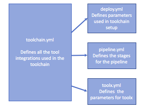

---

copyright:
  years: 2017
lastupdated: "2017-7-7"

---
{:new_window: target="_blank"}
{:shortdesc: .shortdesc}
{:screen: .screen}
{:codeblock: .codeblock}
{:pre: .pre}


# Creating custom toolchains
{: #toolchains_custom}

Improve your DevOps workflow by creating a custom toolchain. You can get started quickly with an existing toolchain template, or create a toolchain that includes just the integrations you need. You can add or remove your toolchain's integrations at any time.
{:shortdesc}

There are many ways to [create and deploy a toolchain](/docs/toolchains/toolchains_setup.html){: new_window}. After you create a custom toolchain, you can share it by using a [Deploy to {{site.data.keyword.Bluemix_notm}} button](/docs/develop/deploy_button.html){: new_window}.


## Getting started
{: #toolchains_custom_gettingstarted}

To create a custom toolchain, begin by cloning the Simple Cloud Foundry toolchain template. Cloning an existing template gives you starting point for your customized toolchain.

1. Using the Git client of your choice, enter the following command to clone the [Simple Toolchain](https://github.com/open-toolchain/simple-toolchain){: new_window} template in GitHub.

 ```
 git clone https://github.com/open-toolchain/simple-toolchain.git
 ```
 {: pre}

 This template deploys a basic Hello World application from a single GitHub repository and includes a simple toolchain that is preconfigured for continuous delivery, source control, issue tracking, and online editing.

2. If you would prefer to start with a more complex toolchain template, you can start by cloning the [Cloud-native Toolchain for Microservices](https://github.com/open-toolchain/toolchain-demo){: new_window}.

 ```
 git clone https://github.com/open-toolchain/toolchain-demo.git
 ```
 {: pre}

The microservices template deploys an online store that is composed of three microservices, each contained in their own GitHub repository. It also is a more complex toolchain that is preconfigured for:
* continuous delivery
* source control
* blue-green deployments
* functional testing
* issue tracking
* online editing
* messaging.

Regardless of which template you choose, the process for customizing the toolchain you create will generally be the same.

After you clone the template, you will have a basic GitHub repository that contains a readme file and a `.bluemix` directory. The directory contains all of the configuration files that the toolchain requires to function. At a minimum, the `.bluemix` directory must contain the following files:

* `toolchain.yml`
* `deploy.json`
* `pipeline.yml`


Each of these files is explained in the following sections. Each section contains configuration information that you can consult as your toolchain evolves.


## Understanding the configuration files
{: #toolchains_custom_config_files}


The toolchain template configuration files are comprised primarily of YAML formatted files. Each file contains metadata that describes different aspects of the toolchain. The metadata includes
* Information about the toolchain, GitHub, or Git Repo and Issue Tracking repositories.
* Details about how code is built and deployed.
* Configuration properties for the tools that are in the toolchain.

As your toolchain becomes more complex, the configuration files will grow in complexity, too.

A few guidelines to keep in mind when you work with YAML files:

* Only use spaces. Tabs are not allowed.
* All properties and lists must be indented with one or more spaces.
* All keys and properties are case-sensitive.

Pay careful attention to the YAML file's formatting to reduce your chance of encountering errors.
To check for errors, you may want to use a simple validator, like [this parser](http://wiki.ess3.net/yaml/){: new_window}.
{: tip}

## Configuring the toolchain file
{: #toolchains_custom_toolchain_yml}

The `toolchain.yml` file is the heart of your toolchain. The specifics of your toolchain, including repositories to pull in, services to include, and build details are all outlined in this file. To make sense of its contents, it can be broken up into several sections.

1\. **Introductory toolchain information:**

 This section of the file provides simple details about your toolchain that the user can see on the toolchain creation page. Include a name for your toolchain, along with a description that explains the toolchain's purpose. You can also include an image, like a logo or a visual depiction of your toolchain.

 In addition to providing introductory content for your toolchain, this section also includes a key named `required` that defines the tools that are part of the toolchain. The toolchain's creator configures these tools when they create the toolchain from your template. For each tool that can be configured on the toolchain creation page, add the tool's parent key as it is defined in the `toolchain.yml` file as a property of the `required` key.

 This snippet shows an example of this section:

 ```
 ---
template
  name: "Simple Toolchain"
  description: "This Hello World application uses Node.js and includes a toolchain that is preconfigured for continuous delivery, source control, issue tracking, and online editing.\n\nTo get started, click **Create**."
  header: ''
  icon: icon.svg
  required:
   - sample-build
   - sample-repo
  info:
    git url: >-
      [https://github.com/my-toolchain/simple-toolchain](https://github.com/open-toolchain/simple-toolchain)
    git branch: >-
      [master](https://github.com/my-toolchain/simple-toolchain/tree/master)
  ```
 {: codeblock}

In that example, the Git URL and Git branch are for a new toolchain template.

2\. **GitHub repository definitions:**

 A toolchain can provide continuous delivery for any number of GitHub repositories. This section of the `toolchain.yml` file is where each repository is defined.

 For each GitHub and Git Repo and Issue Tracking repository that is added to the toolchain, add a parent key that represents the name of your GitHub repository with the following properties:

| Item | Key/Property | Value | Description |
|------|--------------|-------|-------------|
| repo-name | key |  | Repository name. This key matches the name (sample-repo) |
| service_id | property | <`githubpublic` , `githubprivate`> | Type of GitHub repository |
| parameters: | key |  |  |
| repo_name | property |  | Pattern for repo-name. The example that follows uses the toolchain name as the repo name |
| repo_url | property |  | URL of the GitHub repository |
| type | property | <`new` , `fork` , `clone` , `link`> | How the repository is created |
| has_issues | property | <`true` , `false`> | Use GitHub Issues |
| enable_traceability | properties |  <`true` , `false`> | Determines whether to track the deployment of code changes by creating tags, labels and comments on commits, pull requests and referenced issues.|

 **Note:** If you define multiple repositories and configure them as `has_issues: true`, a single instance of GitHub Issue tracker will be added to the toolchain. The tracker follows issues for all repositories that are set to `true`.

 This snippet shows an example of this section:

 ```
 # Github repos
 services:
  sample-repo:
    service_id: githubpublic
    parameters:
      repo_name: '{{toolchain.name}}'
      repo_url: 'https://github.com/open-toolchain/node-hello-world'
      type: clone
      has_issues: true
      enable_traceability: true
 ```
 {: codeblock}

3\. **Pipeline information:**

 You can continuously deliver your project with a pipeline. This section of the file defines the configuration details that are used to build and deploy the code in each of your GitHub and Git Repo and Issue Tracking repositories.

 To start, for each repository that is defined in your toolchain, add a parent key that represents a name of its pipeline. Consider deriving this key from the name of your GitHub or Git Repo and Issue Tracking repository. Add the following properties:

| Item | Key/Property | Value | Description |
|------|--------------|-------|-------------|
| pipeline-name | key |  | Name for the pipeline (sample-build) |
| service_id | property | <`pipeline`> | Name of service to be used |
| parameters | key |  |  |
| name | property | <`repo_name`> | Same as name defined in the repos section |
| ui-pipeline | property | <`true` , `false`> |  |
| configuration | key |  |  |
| content | property | <`$ref(pipeline.yml)`> | File that defines your pipeline definition |
| env | key |  |  |
| SAMPLE_REPO | key | <`repo-name-key`> | The same name as your repository parent key |
| CF_APP_NAME |  property | <`'{{form.pipeline.parameters.prod-app-name}}'`> | Name that is used by Cloud Foundry. Consider incorporating your GitHub repository parent key name into this property. |
| PROD_SPACE_NAME | property | <`'{{form.pipeline.parameters.prod-space}}'`> | Name of {{site.data.keyword.Bluemix_notm}} space to deploy to |
| PROD_ORG_NAME | property | <`'{{form.pipeline.parameters.prod-organization}}'`> | Name of {{site.data.keyword.Bluemix_notm}} organization to deploy to |
| PROD_REGION_ID | property | <`'{{form.pipeline.parameters.prod-region}}'`> | Name of {{site.data.keyword.Bluemix_notm}} region to deploy to |
| execute | property | <`true` , `false`> | Start pipeline after creation |

<!--| services | property | <`repo-name-key`> |  GitHub repository parent key |
| hidden | property | <`[form, description]`> |  |
-->

 Information about creating a `pipeline.yml` file can be found in a [later section](#toolchains_custom_pipeline_yml).

 This snippet shows an example of this section of the file:

 ```
 # Pipelines
  sample-build:
    service_id: pipeline
    parameters:
      services:
        - sample-repo
      name: '{{services.sample-repo.parameters.repo_name}}'
      ui-pipeline: true
      configuration:
        content:
          $ref: pipeline.yml
        env:
          SAMPLE_REPO: sample-repo
          CF_APP_NAME: '{{form.pipeline.parameters.prod-app-name}}'
          PROD_SPACE_NAME: '{{form.pipeline.parameters.prod-space}}'
          PROD_ORG_NAME: '{{form.pipeline.parameters.prod-organization}}'
          PROD_REGION_ID: '{{form.pipeline.parameters.prod-region}}'
       execute: true ```
 {: codeblock}

4\. **Deployment details:** - need to verify


 As part of the continuous delivery process, you can configure a toolchain to deploy an application to any {{site.data.keyword.Bluemix_notm}} Region, Organization, or Space to which a user has access. The specific details of where to deploy your application can be selected from the toolchain creation page.

 

 This section of the `toolchain.yml` file defines the pipeline stages that are available to be configured from the toolchain creation page.

 To start, the parent key `deploy` is used to identify the deployment configuration properties. The following properties make up the rest of the section:

| Item | Key/Property | Value | Description |
|------|--------------|-------|-------------|
| deploy | key |  | Name of the deployment section |
| schema | property | <`deploy.json`> | File that defines the layout of the UI for configuring your deployment details |
| service-category | property | <`pipeline`> | Service that uses the deployment configurations |
| parameters | key |  |  |
| prod-region | property | <`"{{region}}"`> | Defines {{site.data.keyword.Bluemix_notm}} region for production stage |
| prod-organization | property | <`"{{organization}}"`> | Defines {{site.data.keyword.Bluemix_notm}} organization for production stage |
| prod-space | property | <`prod`> | Defines {{site.data.keyword.Bluemix_notm}} space for production stage |
| github-repo-name | property | <`"{{repo-name-key.parameters.repo_name}}"`> | Variable to pass the GitHub repository name to the toolchain creation page |

For more information about creating a `deploy.json` file, see [this section] (#toolchains_custom_deploy_json).

 The following example defines a single stage that deploys to a production environment.

 ```
 ## Configuring a deployment stage
 deploy:
   schema: deploy.json
   service-category: pipeline
   parameters:
 	prod-region: "{{region}}"
 	prod-organization: "{{organization}}"
 	prod-space: prod
 	hello-world-name: "{{hello-world-repo.parameters.repo_name}}"
 ```
 {: codeblock}

 The code example can be used mostly as is and requires only slight modification. To customize this section, set `github-repo-name` to be consistent with your repository's name. Details in the [`deploy.json`](#toolchains_custom_deploy_json) file will also need updated.

 To create a more complex pipeline that includes dev, QA, and Prod stages, the following properties can be substituted under the `parameters` key.

 ```
   parameters:
 	dev-region: "{{region}}"
 	qa-region: "{{region}}"
 	prod-region: "{{region}}"
 	dev-organization: "{{organization}}"
 	qa-organization: "{{organization}}"
 	prod-organization: "{{organization}}"
 	dev-space: dev
 	qa-space: qa
 	prod-space: prod
 ```
 {: codeblock}

 ## Configuring a pipeline
 {: #toolchains_custom_pipeline_yml}

 The `pipeline.yml` file contains all of the configuration details for the stages of your pipeline. You can start with an existing pipeline.yml and customize it to meet your needs.

 If your toolchain contains more than one pipeline, provide unique names for each `pipeline.yml` file.

 The following is an example of a `pipeline.yml` file:

 ```
 ---
stages:
- name: BUILD
  inputs:
  - type: git
    branch: master
    service: ${SAMPLE_REPO}
  triggers:
  - type: commit
  jobs:
  - name: Build
    type: builder
- name: DEPLOY
  inputs:
  - type: job
    stage: BUILD
    job: Build
  triggers:
  - type: stage
  properties:
  - name: CF_APP_NAME
    value: undefined
    type: text
  - name: APP_URL
    value: undefined
    type: text
  jobs:
  - name: Blue-Green Deploy
    type: deployer
    target:
      region_id: ${PROD_REGION_ID}
      organization: ${PROD_ORG_NAME}
      space: ${PROD_SPACE_NAME}
      application: ${CF_APP_NAME}
    script: |
      #!/bin/bash
      # Push app
      if ! cf app $CF_APP; then  
        cf push $CF_APP
      else
        OLD_CF_APP=${CF_APP}-OLD-$(date +"%s")
        rollback() {
          set +e  
          if cf app $OLD_CF_APP; then
            cf logs $CF_APP --recent
            cf delete $CF_APP -f
            cf rename $OLD_CF_APP $CF_APP
          fi
          exit 1
        }
        set -e
        trap rollback ERR
        cf rename $CF_APP $OLD_CF_APP
        cf push $CF_APP
        cf delete $OLD_CF_APP -f
      fi
      # Export app name and URL for use in later Pipeline jobs
      export CF_APP_NAME="$CF_APP"
      export APP_URL=http://$(cf app $CF_APP_NAME | grep urls: | awk '{print $2}')
      # View logs
      #cf logs "${CF_APP}" --recent
 ```
 {: codeblock}		


 ## Configuring the pipeline interface
 {: #toolchains_custom_deploy_json}

 On the toolchain creation page, when Delivery Pipeline is selected from the Configurable Integrations section, the section expands to display the following items:

 	* The application's name
 	* The Region, Organization, and Space that your pipeline stages deploy to.

You can configure those items for each tool.

 

 The layout of this section in the UI is defined by the `deploy.json` schema.

 Within the schema, the following properties should be updated to match the details of your application:

 	* Title
 	* Description
 	* LongDescription
 	* All instances of `hello-world-name` and associated details should be modified to match that of your application.

 The following snippet is an example of a `deploy.json` file:

 ```
 {
    "$schema": "http://json-schema.org/draft-04/schema#",
    "messages": {
        "$i18n": "locales.yml"
    },
    "title": {
        "$ref": "#/messages/deploy.title"
    },
    "description": {
        "$ref": "#/messages/deploy.description"
    },
    "longDescription": {
        "$ref": "#/messages/deploy.longDescription"
    },
    "type": "object",
    "properties": {
        "prod-region": {
            "description": "The bluemix region",
            "type": "string"
        },
        "prod-organization": {
            "description": "The bluemix org",
            "type": "string"
        },
        "prod-space": {
            "description": "The bluemix space",
            "type": "string"
        },
        "prod-app-name": {
            "description": {
                "$ref": "#/messages/deploy.appDescription"
            },
            "type": "string",
            "pattern": "\\S"
        }
    },
    "required": [
        "prod-region",
        "prod-organization",
        "prod-space",
        "prod-app-name"
    ],
    "form": [
        {
            "type": "validator",
            "url": "/devops/setup/bm-helper/helper.html"
        },
        {
            "type": "text",
            "readonly": false,
            "title": {
                "$ref": "#/messages/deploy.appName"
            },
            "key": "prod-app-name"
        },
        {
            "type": "table",
            "columnCount": 4,
            "widths": [
                "15%",
                "28%",
                "28%",
                "28%"
            ],
            "items": [
                {
                    "type": "label",
                    "title": ""
                },
                {
                    "type": "label",
                    "title": {
                        "$ref": "#/messages/region"
                    }
                },
                {
                    "type": "label",
                    "title": {
                        "$ref": "#/messages/organization"
                    }
                },
                {
                    "type": "label",
                    "title": {
                        "$ref": "#/messages/space"
                    }
                },
                {
                    "type": "label",
                    "title": {
                        "$ref": "#/messages/prodStage"
                    }
                },
                {
                    "type": "select",
                    "key": "prod-region"
                },
                {
                    "type": "select",
                    "key": "prod-organization"
                },
                {
                    "type": "select",
                    "key": "prod-space",
                    "readonly": false
                }
            ]
        }
    ]
}
 ```
 {: codeblock}


## Other tool configurations

 After you configure the core components of your toolchain, you can include other tool integrations that add additional functions to your toolchain. All additional tools require their own entry in the `toolchain.yml` file. Some tools also require that you add a separate YAML configuration file to `.bluemix` directory.

<!--  -->

To see the list of available tool integrations, see <a ref="https://github.com/open-toolchain/sdk/wiki/services.md" target="_blank">Services available in a toolchain template</a>.

<!-- The following examples show how to format additions to a toolchain YAML file.

 * **Slack**

### toolchain.yml
	```
	messaging:
	  service_id: slack
	  $ref: slack.yml
	```
	{: codeblock}

### slack.yml
	```
	---
	parameters:
	  api_token: ""
	  channel_name: ""
	```
	{: codeblock}

 * **Sauce Labs**

### toolchain.yml
	```
	test:
	  service_id: saucelabs
	  $ref: saucelabs.yml
	```
	{: codeblock}

### saucelabs.yml
	```
	---
	parameters:
	  username: ""
	  key: ""
	```
	{: codeblock}

 * **Eclipse Orion Web IDE**

###	toolchain.yml
	```
	webide:
	  service_id: orion
	```
	{: codeblock}

  -->
