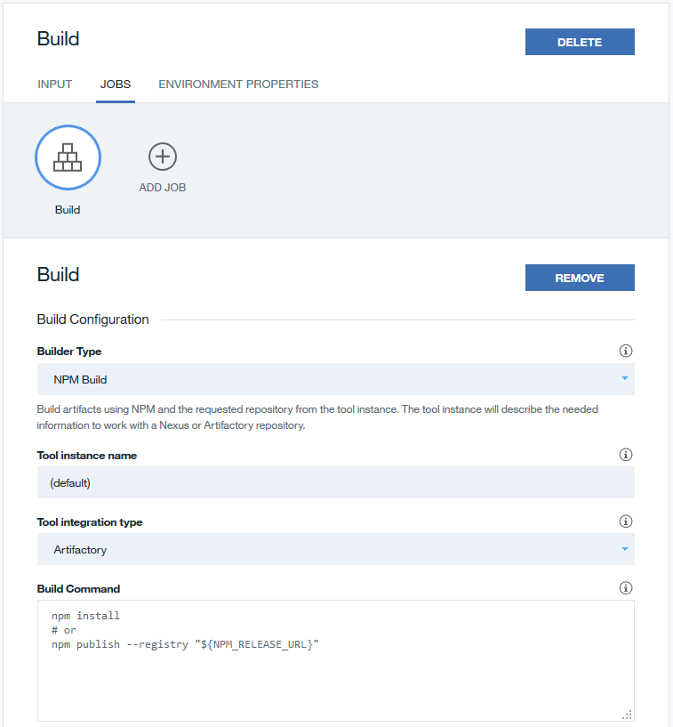
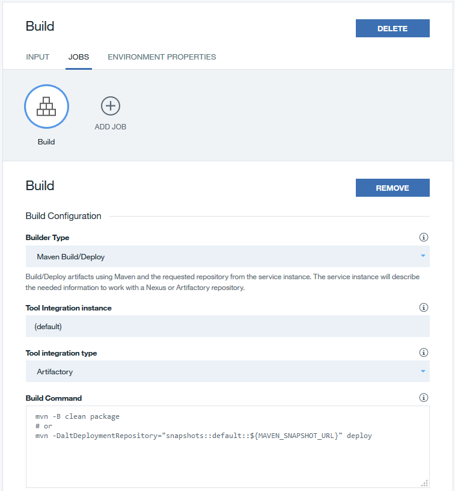
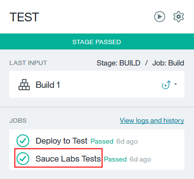
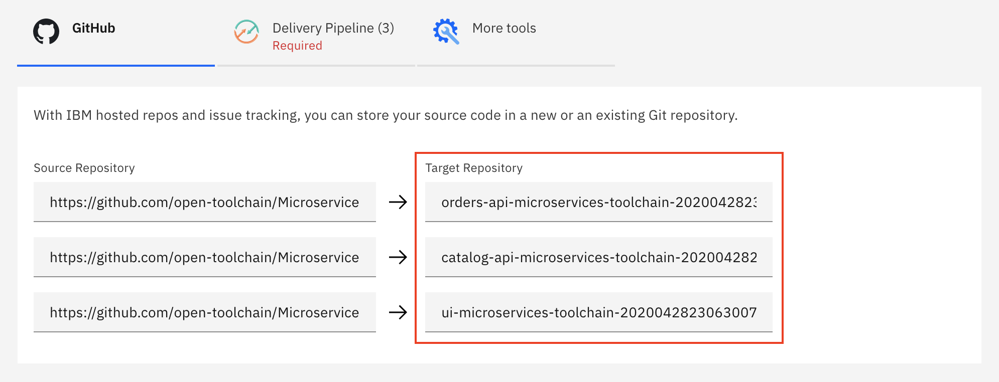
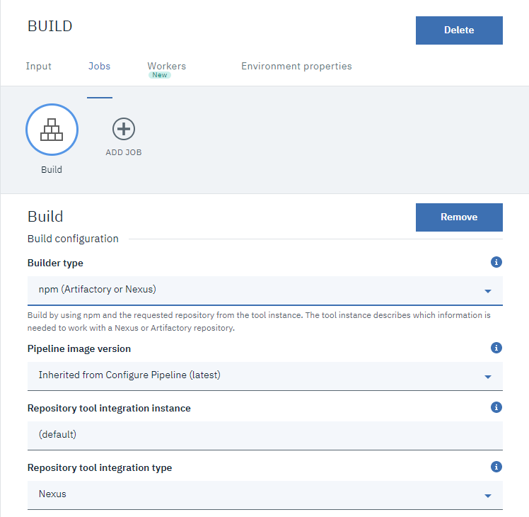
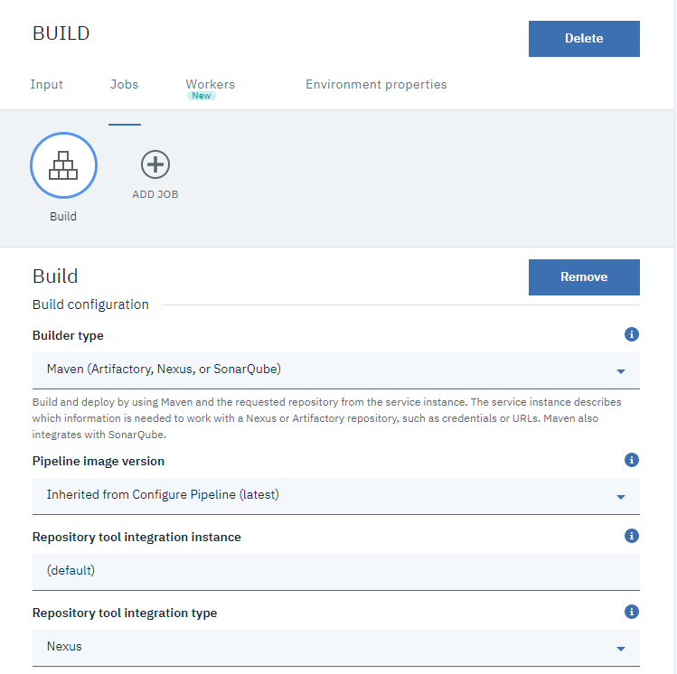

---

copyright:
  years: 2015, 2019
lastupdated: "2019-10-03"

keywords: tool integrations, IBM Cloud Public, IBM Cloud Dedicated, Alert Notification, Artifactory, Availability Monitoring, Bitbucket, Cloud Event Management, Delivery Pipeline, DevOps Insights, Delivery Pipeline Private Worker, Eclipse Orion Web IDE, Git Repos and Issue Tracking, GitHub, Dedicated GitHub Enterprise and Issues, GitLab, Jenkins, JIRA, Nexus, Custom Tool, PagerDuty, Rational Team Concert, Sauce Labs, Slack, SonarQube

subcollection: ContinuousDelivery

---

{:shortdesc: .shortdesc}
{:new_window: target="_blank"}
{:external: target="_blank" .external}
{:codeblock: .codeblock}
{:pre: .pre}
{:screen: .screen}
{:tip: .tip}
{:note: .note}
{:important: .important}
{:deprecated: .deprecated}
{:download: .download}   

# Configuring tool integrations
{: #integrations}

You can configure tool integrations that support development, deployment, and operations tasks while you create an open toolchain, or you can add and configure tool integrations to customize an existing toolchain.  
{:shortdesc}

The tool integrations that are available to add and configure for your toolchain are different depending on whether you are using toolchains on {{site.data.keyword.Bluemix_notm}} Public or {{site.data.keyword.Bluemix_notm}} Dedicated. If you are using toolchains on {{site.data.keyword.Bluemix_notm}} Public, the tool integrations that are available to you depend on the region of your toolchain and the availability of tool integrations in that region. If you are using toolchains on {{site.data.keyword.Bluemix_notm}} Dedicated, the tool integrations that are available to you depend on how {{site.data.keyword.contdelivery_full}} was set up on your specific environment.

|Tool Integration |Available on {{site.data.keyword.Bluemix_notm}} Public	|Available on {{site.data.keyword.Bluemix_notm}} Dedicated (Environment Dependent)|
|:----------|:------------------------------|:------------------|
|{{site.data.keyword.alertnotificationshort}}		|US South		|No		|
|Artifactory		|US South, US East, Germany, Tokyo, United Kingdom		|Yes		|
|Availability Monitoring		|US South		|No		|
|Bitbucket		|US South, US East, Germany, Tokyo, United Kingdom		|No		|
|Cloud Event Management		|US South		|No		|
|{{site.data.keyword.deliverypipeline}} 		|US South, US East, Germany, Tokyo, United Kingdom	   	|Yes  		|
|{{site.data.keyword.deliverypipeline}} Private Worker			|US South, US East, Germany, Tokyo, United Kingdom		|No		|
|{{site.data.keyword.DRA_short}} 		|US South, Germany, United Kingdom		|No			|
|Eclipse Orion {{site.data.keyword.webide}}		|US South, US East, Germany, Tokyo, United Kingdom		|Yes			|
|{{site.data.keyword.gitrepos}}	|US South, US East, Germany, Tokyo, United Kingdom		|No		|
|GitHub		|US South, US East, Germany, Tokyo, United Kingdom		|Yes		|
|Dedicated {{site.data.keyword.ghe_short}} and Issues			|No		|Yes		|
|GitLab		|US South, US East, Germany, Tokyo, United Kingdom		|No		|
|Jenkins		|US South, US East, Germany, Tokyo, United Kingdom		|Yes		|
|JIRA		|US South, US East, Germany, Tokyo, United Kingdom		|Yes		|
|Nexus			|US South, US East, Germany, Tokyo, United Kingdom		|Yes		|
|Other Tool			|US South, US East, Germany, Tokyo, United Kingdom		|Yes		|
|PagerDuty			|US South, US East, Germany, Tokyo, United Kingdom		|Yes		|
|Rational Team Concert			|US South, US East, Germany, Tokyo, United Kingdom		|Yes		|
|Sauce Labs		|US South, US East, Germany, Tokyo, United Kingdom		|No		|
|Slack			|US South, US East, Germany, Tokyo, United Kingdom		|Yes		|
|SonarQube			|US South, US East, Germany, Tokyo, United Kingdom		|Yes		|
{: caption="Table 1. Tool integrations available for toolchains on {{site.data.keyword.Bluemix_notm}} Public and Dedicated" caption-side="top"}

If you want to start developing with your source code on {{site.data.keyword.Bluemix_notm}} Public, configure the GitHub tool integration or the {{site.data.keyword.gitrepos}} tool integration before you configure the {{site.data.keyword.deliverypipeline}}. If you want to start developing with your code on {{site.data.keyword.Bluemix_notm}} Dedicated, configure the {{site.data.keyword.ghe_short}} tool integration or the GitHub tool integration before you configure the {{site.data.keyword.deliverypipeline}}.
{: tip}


## Configuring Alert Notification
{: #alertnotification}

The {{site.data.keyword.alertnotificationfull}} service is deprecated. As of 01 July 2019, customers with existing instances only of {{site.data.keyword.alertnotificationshort}} can use this service until 01 July 2020. For more information about the retirement of the {{site.data.keyword.alertnotificationshort}} service, see [Deprecating IBM {{site.data.keyword.alertnotificationshort}} Service](https://www.ibm.com/cloud/blog/announcements/deprecating-ibm-alert-notification-service){:external}.
{: deprecated}

{{site.data.keyword.alertnotificationshort}} is a hybrid cloud-based solution that you can use to centralize and simplify your notification strategy. It works with other cloud-based and on-premises applications. Alerts are forwarded to {{site.data.keyword.alertnotificationshort}} by using a secure RESTful API.

Configure {{site.data.keyword.alertnotificationshort}} to receive notifications about issues during your DevOps process.

### Prerequisites

1. If you don't have an {{site.data.keyword.alertnotificationshort}} account, sign up for one:

 a. Open the [IBM {{site.data.keyword.alertnotificationshort}}](https://www.ibm.com/us-en/marketplace/alert-notification){:external} page in IBM Marketplace.

 b. Either purchase a subscription or sign up for the free 90-day trial.

1. After your {{site.data.keyword.alertnotificationshort}} account is set up, open your [My IBM Dashboard](https://myibm.ibm.com/dashboard/){:external}.
1. Next to IBM {{site.data.keyword.alertnotificationshort}}, click **Launch**.
1. Click **Manage API Keys** and click **Create API Key**.
1. In the **Create API Key** field, type a description.
1. Click **Generate**. The new API Key information, including the name and password, is displayed. You need that information for the tool integration configuration, so keep the New API Key window open. For security purposes, you cannot retrieve the API key password later.

### Configuring Alert Notification

1. If you are configuring this tool integration as you are creating the toolchain, in the Configurable Integrations section, click **{{site.data.keyword.alertnotificationshort}}**.
1. If you have a toolchain and are adding this tool integration to it, on the DevOps dashboard, on the Toolchains page, click the toolchain to open its Overview page. Alternatively, on your app's Overview page, on the Continuous delivery card, click **View Toolchain**. Then, click **Overview**.  

 a. Click **Add a Tool**.

 b. In the Tool Integrations section, click **{{site.data.keyword.alertnotificationshort}}**.

1. Type the URL for the {{site.data.keyword.alertnotificationshort}} API that you want to use. You can find the URL on the Manage API Keys page of the {{site.data.keyword.alertnotificationshort}} service; for example, `https://ibmnotifybm.mybluemix.net/api/alerts/v1`.
1. Type the name of the API key for {{site.data.keyword.alertnotificationshort}}. You can find the API key name in the New API Key window.
1. Type the password that {{site.data.keyword.alertnotificationshort}} generated for the API key. You can find the API key password in the New API Key window.
1. Click **Create Integration**.
1. From your toolchain, click **{{site.data.keyword.alertnotificationshort}}**.

### Learn more about Alert Notification

To learn more about {{site.data.keyword.alertnotificationshort}}, see the [IBM {{site.data.keyword.alertnotificationshort}} article](https://www.ibm.com/cloud/garage/content/manage/tool_alert_notification/){:external} on the IBM Cloud Garage Method or take these tutorials:

  * [Add a tool integration to a toolchain](https://www.ibm.com/cloud/garage/tutorials/add-a-tool-integration-to-a-toolchain){:external}

  * [Manage your {{site.data.keyword.Bluemix_notm}} application by using {{site.data.keyword.Bluemix_notm}} Availability Monitoring and Alert Notification](https://www.ibm.com/cloud/garage/tutorials/tutorial_gm_advocate_bam_and_an){:external}


## Configuring Artifactory
{: #artifactory}

Configure the Artifactory repository manager to store build artifacts in your Artifactory repository (repo):

1. If you are configuring this tool integration as you are creating the toolchain, in the Configurable Integrations section, click **Artifactory**.
1. If you have a toolchain and are adding this tool integration to it, on the DevOps dashboard, on the Toolchains page, click the toolchain to open its Overview page. Alternatively, on your app's Overview page, on the Continuous delivery card, click **View Toolchain**. Then, click **Overview**.  

 a. Click **Add a Tool**.

 b. In the Tool Integrations section, click **Artifactory**.

1. Type the URL for the Artifactory repo that you want to open when you click the Artifactory card.
1. Select the repository type that you want to connect to.
1. If you are using an Artifactory npm registry, follow these steps:

 a. Type the email address that is associated with your registry.

 b. Type the authentication token that is associated with your registry.

 c. Type the URL for your Artifactory release repo, which is your private registry on the Artifactory server.

 d. Type the URL for the Mirror or Public registry that you use to combine multiple public and private npm registries. For example, this URL might be the URL of the virtual registry on your Artifactory server that can access both your private registry and a cache of the npm global registry.

1. If you are using an Artifactory Maven repo, follow these steps:

 a. Type the user ID that is associated with your repo.

 b. Type the password that is associated with your repo.

 c. Type the URL for your Artifactory release repo, which is your private release repo on the Artifactory server.

 d. Type the URL for your Artifactory snapshot repo, which is your private snapshot repo on the Artifactory server.

 e. Type the URL for the Mirror or Public repo that you use to combine multiple public and private Maven repos. For example, this URL might be the URL of the virtual repo on your Artifactory server that can access both your private repos and a cache of the Maven central repo.

1. Click **Create Integration**.
1. Click the card for the Artifactory repo that you want to work with. The Artifactory website opens, where you can view the contents of the repo.
1. Optional: If you are using a toolchain on {{site.data.keyword.Bluemix_notm}} Public and you want to build your app by using Artifactory with npm, configure your pipeline to add an npm build job. For instructions to configure the build job, see the [Configuring an Artifactory npm build job in your pipeline](#config_artifactory_npm) section.
1. Optional: If you are using a toolchain on {{site.data.keyword.Bluemix_notm}} Public and you want to build your app by using Artifactory with Maven, configure your pipeline to add a Maven build job. For instructions to configure the build job, see the [Configuring an Artifactory Maven build job in your pipeline](#config_artifactory_maven) section.

### Configuring an Artifactory npm build job in your pipeline
{: #config_artifactory_npm}

Before you configure an npm build job in your pipeline, you must have a working pipeline that can use your build SCM repo as input. You must also configure Artifactory for your toolchain. For instructions to configure Artifactory, see the [Artifactory](#artifactory) section.

Configure {{site.data.keyword.deliverypipeline}} to add an npm build job:

1. Create a stage and set the input to the appropriate SCM repo.
1. On the stage, add a build job.
1. Configure the build job:
  

  a. For the builder type, select **NPM Build**.

  b. If you configured multiple instances of the Artifactory tool integration, enter the name of the Artifactory tool integration that you want to configure the npm build job for.

  c. For the tool integration type, select **Artifactory**.

  d. For the build command, enter the commands to build your npm module or publish it to your registry. This example shows the commands to either build the module or publish it.
     ```
     npm install
     # or
     npm publish --registry "${NPM_RELEASE_URL}"
     ```
  You can find the URL and user credentials that you used to connect to your registry in the configuration settings for the Artifactory tool integration.
  {: tip}

  e. If your build job publishes to the Artifactory registry, and the format of your node module version is `x.y.z-SNAPSHOT.w`, select the **Increment snapshot module version** check box. The build job automatically updates the module version before the job publishes to the Artifactory registry. The job selects the highest version of the module from the npm registry and the local `package.json` file, and increments the module version by using semver. The build job does not deliver the changes to the SCM repo.

1. Click **SAVE**. Whenever your pipeline runs, this build job uses the configuration information from the Artifactory tool integration to connect to your npm registry.

### Configuring an Artifactory Maven build job in your pipeline
{: #config_artifactory_maven}

Before you configure a Maven Build job in your pipeline, you need a working pipeline that can use your build SCM repo as input, and you must configure Artifactory for your toolchain. For instructions to configure Artifactory, see the [Artifactory](#artifactory) section.

Configure the {{site.data.keyword.deliverypipeline}} to add a Maven Build job:

1. Create a stage and set the input to the appropriate SCM repo.
1. On the stage, add a build job.
1. Configure the build job:
  

  a. For the builder type, select **Maven Build**.

  b. If you configured multiple instances of the Artifactory tool integration, enter the name of the Artifactory tool integration that you want to configure the Maven Build job for.

  c. For the tool integration type, select **Artifactory**.

  d. For the build command, enter the commands to build your Maven module or publish it to your snapshot registry. This example shows the commands to either build the module or publish it to a snapshot registry.
     ```
     mvn -B clean package
     # or
     mvn -DaltDeploymentRepository="snapshots::default::${MAVEN_SNAPSHOT_URL}" deploy
     ```
  You can find the URL and user credentials that you used to connect to your registry in the configuration settings for the Artifactory tool integration.
  {: tip}

1. Click **SAVE**. Whenever your pipeline runs, this build job uses the configuration information from the Artifactory tool integration to connect to your Maven repo.

### Learn more about Artifactory

To learn more about Artifactory, see the [Artifactory article](https://www.ibm.com/cloud/garage/content/deliver/tool_artifactory/){:external} on the IBM Cloud Garage Method.


## Adding Availability Monitoring
{: #availabilitymonitoring}

{{site.data.keyword.prf_hublong}} isolates problems, identifies patterns, and improves performance before users are affected. You can test your app from locations around the world, integrate with delivery pipelines, and gain insights about how to continuously optimize your code.

This tool integration is preconfigured and does not require any configuration parameters. You cannot reconfigure this tool integration.
{: tip}

To test, monitor, and improve your app's health as you build it, add the {{site.data.keyword.prf_hubshort}} tool integration:

1. On the DevOps dashboard, on the Toolchains page, click the toolchain that you want to add {{site.data.keyword.prf_hubshort}} to. Alternatively, on the app's Overview page, on the Continuous delivery card, click **View Toolchain** and click **Overview**.

 a. Click **Add a Tool**.

 b. In the Tool Integrations section, click **{{site.data.keyword.prf_hubshort}}**.

1. Click **Create Integration**.
1. Click **{{site.data.keyword.prf_hubshort}}** to open the {{site.data.keyword.prf_hubshort}} dashboard, select an app, and configure monitoring for the app.

### Learn more about Availability Monitoring

To learn more about {{site.data.keyword.prf_hubshort}}, see the [{{site.data.keyword.prf_hublong}} article](https://www.ibm.com/cloud/garage/practices/manage/tool_bluemix_availability_monitoring/){:external} on the IBM Cloud Garage Method or take this tutorial:

  * [Manage your {{site.data.keyword.Bluemix_notm}} application by using {{site.data.keyword.Bluemix_notm}} Availability Monitoring and Alert Notification](https://www.ibm.com/cloud/garage/tutorials/tutorial_gm_advocate_bam_and_an){:external}


## Configuring Bitbucket
{: #bitbucket}

Store your source code in a new or existing repository on bitbucket.org and engage in social coding through wikis, issue tracking, and pull requests.

Configure Bitbucket to collaborate on code with your team:

1. From the DevOps dashboard, click **Toolchains**. Click the toolchain that you want to add Bitbucket to. Alternatively, on your app's Overview page, on the Continuous delivery card, click **View Toolchain** and click **Overview**.

 a. Click **Add a Tool**.

 b. In the Tool Integrations section, click **Bitbucket**.

   If you are configuring this tool integration on {{site.data.keyword.Bluemix_notm}} Public and you did not authorize {{site.data.keyword.Bluemix_notm}} to access Bitbucket, click **Authorize** to go to the Bitbucket website. If you don't have an active Bitbucket session, you are prompted to log in. Click **Grant access** to allow {{site.data.keyword.Bluemix_notm}} Toolchains to access the following parts of your Bitbucket account:
   
   * **Read your account information**. Get basic user information to populate the user interface.
   
   * **Read and modify your repositories' issues**. Allow {{site.data.keyword.contdelivery_short}} to update issues to indicate when the pipeline deploys commits that are attached to those issues. 
   
   * **Read your team's project settings and read repositories that are contained within your team's projects**. Allow {{site.data.keyword.contdelivery_short}} to integrate with repos that are owned by teams.
   
   * **Read and modify your repositories and their pull requests**. Allow {{site.data.keyword.contdelivery_short}} to push sample code into repos, when users request the code.
   
   * **Administer your repositories**. Allow {{site.data.keyword.contdelivery_short}} to create new repos, when requested by users.
   
   * **Read your team membership information**. Allow {{site.data.keyword.contdelivery_short}} to show a list of your teams in the **Owner** menu that is displayed when you create a new repo.
   
   * **Read and modify your repositories' webhooks**. Allow the pipeline to trigger builds when commits are pushed to a repo.
   {: tip}
   
   If you have an active Bitbucket session but you didn't enter your password recently, you might be prompted to enter your Bitbucket password to confirm.

1. Click the Bitbucket server that you want to use.
1. If you have a Bitbucket repo that you want to use, type the URL for the repo. For the repository type, click **Existing**.
1. If you want to use a new Bitbucket repo, type a name for the repo, type the URL for the repo that you are cloning or forking, and select the repository type:

 a. To create an empty repo, click **New**.

 b. To create a copy of a repo, click **Clone**.

 c. To fork a repo so that you can contribute changes through pull requests, click **Fork**.

1. To create a private repo on the server, select the **Make this repository private** check box.
1. To use Bitbucket Issues for issue tracking, select the **Enable Bitbucket Issues** check box.
1. To track the deployment of code changes by creating tags and comments on commits, and labels and comments on issues that are referenced by the commits, select the **Track deployment of code changes** check box. For more information, see [Track where your code is deployed with toolchains](https://www.ibm.com/cloud/blog/announcements/track-code-deployed-toolchains/){:external}.
1. Click **Create Integration**.
1. From your toolchain, click the card for the Bitbucket repo that you want to work with. The Bitbucket website opens where you can view the contents of the repo.
1. If you enabled Bitbucket Issues, click **Bitbucket Issues** to open it. You can use this instance of Bitbucket Issues for your entire toolchain, even if the toolchain contains multiple Bitbucket repos.    

If you don't have owner or master privileges for the repo that you are linking to, your integration is limited because you can't use a webhook. Webhooks are required to automatically run a pipeline when a commit is pushed to the repo. Without a webhook, you must start your pipelines manually.
{: tip}

### Learn more about Bitbucket

To learn more about Bitbucket, see the [Bitbucket article](https://www.ibm.com/cloud/garage/content/code/tool_bitbucket/){:external} on the IBM Cloud Garage Method.


## Adding Cloud Event Management
{: #cloudeventmanagement}

{{site.data.keyword.evtmgt_full}} provides a consolidated view of problems that occur with your services, applications, and infrastructure. You can set up real-time incident management to resolve the problems more efficiently.

This tool integration is preconfigured and does not require any configuration parameters. You cannot reconfigure it.
{: tip}

To help your DevOps team achieve reliable operational health, service quality, and continuous improvement goals, add Cloud Event Management to your toolchain:

1. From the DevOps dashboard, click **Toolchains**. Click the toolchain that you want to add Cloud Event Management to. Alternatively, on your app's Overview page, on the Continuous delivery card, click **View Toolchain** and click **Overview**.

 a. Click **Add a Tool**.

 b. In the Tool Integrations section, click **Cloud Event Management**.

1. Click **Create Integration**.
1. From your toolchain, click any of the following tool cards:

 * **Cloud Event Management** to get started with Cloud Event Management.

 * **{{site.data.keyword.alertnotificationshort}}** to create policies that determine when users receive incident notifications.

 * **Runbook Automation** to manage your catalog of runbooks in Cloud Event Management.

### Learn more about Cloud Event Management

To learn more about Cloud Event Management, see the [Cloud Event Management article](https://www.ibm.com/cloud/garage/content/manage/tool_cloud_event_mgt/){:external} on the IBM Cloud Garage Method.


## Configuring Delivery Pipeline
{: #deliverypipeline}

{{site.data.keyword.deliverypipeline}} automates the continuous deployment of your projects through sequences of stages that retrieve input and run jobs, such as builds, tests, and deployments.

Configure {{site.data.keyword.deliverypipeline}} to automate the continuous building, testing, and deployment of your apps:

1. If you are configuring this tool integration as you are creating the toolchain, in the Configurable Integrations section, click **{{site.data.keyword.deliverypipeline}}**. Depending on the template that you use, different fields might be available. Review the default field values and if needed, change those settings.
1. If you have a toolchain and are adding this tool integration to it, on the DevOps dashboard, on the Toolchains page, click the toolchain to open its Overview page. Alternatively, on your app's Overview page, on the Continuous delivery card, click **View Toolchain** and click **Overview**.

 a. Click **Add a Tool**.

 b. In the Tool Integrations section, click **{{site.data.keyword.deliverypipeline}}**.

1. Specify a name for your new pipeline.
1. If you plan to use your pipeline to deploy a user interface, select the **Show apps in the VIEW APP menu** check box. All of the apps that your pipeline creates are shown in the **View App** list on the toolchain's Overview page.
1. Select the type of pipeline that you want to create:

 * **Classic**: Provides an easy to use graphical user interface for defining stages and jobs that run on public shared infrastructure, with support for running individual stages on private workers.
 * **Tekton**: Provides a dashboard that you can use to view the output of [Tekton pipeline](/docs/services/ContinuousDelivery?topic=ContinuousDelivery-tekton-pipelines) runs on a defined Kubernetes cluster, with support for configuring pipeline definitions repos, the pipeline triggers, where the pipeline runs, and simple secrets.

1. Click **Create Integration** to add the {{site.data.keyword.deliverypipeline}} to your toolchain.
1. Click **{{site.data.keyword.deliverypipeline}}** to view the pipeline and configure it. To learn the basics of configuring a pipeline, see [Building and deploying pipelines](/docs/services/ContinuousDelivery?topic=ContinuousDelivery-deliverypipeline_build_deploy).

  If you want the pipeline to automatically run when a commit is pushed to your GitHub, {{site.data.keyword.ghe_short}}, or Git repository (repo), follow these steps:

   a. Configure GitHub, {{site.data.keyword.ghe_short}}, or {{site.data.keyword.gitrepos}} for your toolchain before you define the stages for your pipeline. The pipeline stages need the Git URLs for your repos. Each pipeline stage can refer to only one of the GitHub, {{site.data.keyword.ghe_short}}, or Git repos that are associated with your toolchain. For instructions to configure GitHub, see the [GitHub](#github) section. For instructions to configure Dedicated {{site.data.keyword.ghe_short}}, see [Getting started with {{site.data.keyword.ghe_long}}](/docs/services/ghededicated?topic=ghededicated-getting-started). For instructions to configure {{site.data.keyword.gitrepos}}, see the [{{site.data.keyword.gitrepos}}](#grit) section.

   b. Use a webhook. Without a webhook, you can run pipelines manually only. To use a webhook when you link to a GitHub or {{site.data.keyword.ghe_short}} repo, you need admin privileges. To link to a {{site.data.keyword.gitrepos}} repo, you need Master or Owner privileges.

1. Optional: If you are using a toolchain on {{site.data.keyword.Bluemix_notm}} Public and you want Sauce Labs to run tests on your app, configure the {{site.data.keyword.deliverypipeline}} to add a Sauce Labs test job. For instructions to configure the test job, see the [Configuring a Sauce Labs test job in your pipeline](#config_saucelabs) section.

### Configuring a Sauce Labs test job in your pipeline
{: #config_saucelabs}

Before you configure a Sauce Labs test job in your pipeline, you need a working pipeline that has stages to build and deploy your app. You must also configure Sauce Labs for your toolchain. For instructions to configure Sauce Labs, see the [Sauce Labs](#saucelabs) section.

Configure the {{site.data.keyword.deliverypipeline}} to add a Sauce Labs test job:

1. If you don't have a stage that deploys a test version of your app, create one.
1. On the stage, add a test job after the deploy job. By placing these jobs in the same stage, they can access the same set of environment properties.   
  

1. Configure the stage. On the **ENVIRONMENT PROPERTIES** tab, create the CF_APP_NAME property.

  The Sauce Labs user name and access key are available in the test job script as the SAUCE_USERNAME and SAUCE_ACCESS_KEY environment variables. When you write your tests, you must use these environment variables to authenticate with Sauce Labs.
  {: tip}

1. Configure the deploy job. In the **Deploy Script** field, include this command: `export CF_APP_NAME="$CF_APP"`. That command exports the app name as an environment property.
1. Configure the test job. 

  The **Service Instance**, **Target**, **Organization**, and **Space** fields are populated with the Sauce Labs user name, region, org, and space that you are using.
  {: tip}

  a. For the tester type, select **Sauce Labs**.

  b. For the service instance, select the Sauce Labs user name that you used when you configured Sauce Labs for your toolchain.

   To see the user name and access key that you used when you configured Sauce Labs for your toolchain, click **Configure**.
   {: tip}

  c. In the **Test Execution Command** field, enter the commands that install the dependencies that are required by your tests and then run the tests. For example, for a Node.js app, you might enter these commands:
     ```
     npm install
     node_modules/grunt-cli/bin/grunt test:sauce:parallel
     ```

    d. If you want to see your test reports in the test job logs, select the **Enable Test Report** check box, and set the Test Result File Pattern to `test/*.xml`.

1. Click **SAVE**. Whenever your pipeline runs, your Sauce Labs tests run.

### Learn more about Delivery Pipeline

To learn more about {{site.data.keyword.deliverypipeline}}, see [Working with pipelines](/docs/services/ContinuousDelivery?topic=ContinuousDelivery-pipeline-working) and the [Delivery Pipeline article](https://www.ibm.com/cloud/garage/content/deliver/tool_delivery_pipeline/){:external} on the IBM Cloud Garage Method or take these tutorials:

  * [Create a pipeline](https://www.ibm.com/cloud/garage/tutorials/create-a-pipeline){:external}

  * [Create and use your first toolchain by using the "Develop a Cloud Foundry app" toolchain](https://www.ibm.com/cloud/garage/tutorials/introduce-develop-cloud-foundry-app-toolchain){:external}


## Configuring {{site.data.keyword.deliverypipeline}} Private Worker
{: #privateworker}

{{site.data.keyword.deliverypipeline}} Private Worker connects with one or more private workers that run {{site.data.keyword.deliverypipeline}} workloads in isolation.

Configure the {{site.data.keyword.deliverypipeline}} Private Worker tool integration to make private workers available to pipelines in a toolchain:

1. If you are configuring this tool integration as you are creating the toolchain, in the Configurable Integrations section, click **{{site.data.keyword.deliverypipeline}} Private Worker**.
1. If you have a toolchain and are adding this tool integration to it, on the DevOps dashboard, on the Toolchains page, click the toolchain to open its Overview page. Alternatively, on your app's Overview page, on the Continuous delivery card, click **View Toolchain** and click **Overview**.

 a. Click **Add a Tool**.

 b. In the Tool Integrations section, click **{{site.data.keyword.deliverypipeline}} Private Worker**.

1. Type a name for the tool integration. This name identifies a pool of private workers in the **Workers** tab of the pipeline stage.
1. Type your Service ID API key to authenticate access to the work queue where one or more private workers can look for work. If you don't have a Service ID API key, click **Create** to generate one for this private worker.
1. Click **Create Integration**.
1. From your toolchain, click **{{site.data.keyword.deliverypipeline}} Private Worker** to view a list of all of the workers that are registered by using an API key that is associated with this Service ID.


## Adding DevOps Insights
{: #dra}

{{site.data.keyword.DRA_full}} collects and analyzes the results from unit tests, functional tests, and code coverage tools to determine whether your code meets predefined criteria at specified gates in your deployment process. If your code does not meet or exceed the criteria, the deployment is stopped to prevent risks from being released. You can use {{site.data.keyword.DRA_short}} as a safety net for your continuous delivery environment or as a way to implement and improve quality standards.

 This tool integration is available only on {{site.data.keyword.Bluemix_notm}} Public. It is preconfigured and does not require any configuration parameters. You cannot reconfigure this tool integration.
 {: tip}

Add {{site.data.keyword.DRA_short}} to maintain and improve the quality of your code in {{site.data.keyword.Bluemix_notm}} by monitoring your deployments to identify risks before they are released.

1. If you are configuring this tool integration as you are creating the toolchain, in the Configurable Integrations section, click **{{site.data.keyword.DRA_short}}**.
1. If you have a toolchain and are adding this tool integration to it, on the DevOps dashboard, on the Toolchains page, click the toolchain to open its Overview page. Alternatively, on the app's Overview page, on the Continuous delivery card, click **View Toolchain** and click **Overview**.

 a. Click **Add a Tool**.

 b. In the Tool Integrations section, click **{{site.data.keyword.DRA_short}}**.

1. Click **Create Integration**.
1. Click **{{site.data.keyword.DRA_short}}**, and then complete the getting started steps: create criteria, connect the criteria to the pipeline, and run the pipeline.

### Learn more about DevOps Insights

To learn more about {{site.data.keyword.DRA_short}}, see the [{{site.data.keyword.DRA_short}} article](https://www.ibm.com/cloud/garage/content/learn/tool_devops_insights/){:external} on the IBM Cloud Garage Method or take these tutorials:

  * [Use the "Develop and test a Cloud Foundry app" toolchain](https://www.ibm.com/cloud/garage/tutorials/use-develop-test-cloud-foundry-app-toolchain){:external}

  * [Use the "Develop and test microservices on Cloud Foundry" toolchain](https://www.ibm.com/cloud/garage/tutorials/use-develop-test-microservices-on-cloud-foundry-toolchain){:external}

  * [Explore {{site.data.keyword.DRA_full}}](https://www.ibm.com/cloud/garage/tutorials/explore-ibm-cloud-devops-insights){:external}


## Adding the Eclipse Orion Web IDE
{: #webide}

The Eclipse Orion {{site.data.keyword.webide}} is an integrated web-based environment where you can create, edit, run, debug, and complete source control tasks. You can seamlessly move from editing to running to submitting to deploying.

 This tool integration is preconfigured. It does not require any configuration parameters and you cannot reconfigure it.
 {: tip}

To complete source control tasks, add the Eclipse Orion {{site.data.keyword.webide}} tool integration:

1. If you are configuring this tool integration as you are creating the toolchain, in the Configurable Integrations section, click **Eclipse Orion {{site.data.keyword.webide}}**.
1. If you have a toolchain and are adding this tool integration to it, on the DevOps dashboard, on the Toolchains page, click the toolchain to open its Overview page. Alternatively, on the app's Overview page, on the Continuous delivery card, click **View Toolchain** and click **Overview**.

 a. Click **Add a Tool**.

 b. In the Tool Integrations section, click **Eclipse Orion {{site.data.keyword.webide}}**.

1. Click **Create Integration**.
1. Click **Eclipse Orion {{site.data.keyword.webide}}**. Your workspace is pre-populated with your GitHub or {{site.data.keyword.ghe_short}} repos. The repos that are associated with your current toolchain are highlighted.

### Learn more about the Eclipse Orion Web IDE

To learn more about the Eclipse Orion {{site.data.keyword.webide}}, see [Editing code with the Eclipse Orion {{site.data.keyword.webide}}](/docs/services/ContinuousDelivery?topic=ContinuousDelivery-web_ide). You can also read the [Eclipse Orion {{site.data.keyword.webide}} article](https://www.ibm.com/cloud/garage/content/code/tool_eclipse_orion_web_ide/){:external} on the IBM Cloud Garage Method. Take these tutorials to try using the Eclipse Orion {{site.data.keyword.webide}}:

  * [Create and use your first toolchain by using the "Develop a Cloud Foundry app" toolchain](https://www.ibm.com/cloud/garage/tutorials/introduce-develop-cloud-foundry-app-toolchain){:external}

  * [Use the "Develop and test microservices on Cloud Foundry" toolchain](https://www.ibm.com/cloud/garage/tutorials/use-develop-test-microservices-on-cloud-foundry-toolchain){:external}


## Configuring Git Repos and Issue Tracking
{: #grit}

The {{site.data.keyword.gitrepos}} tool integration is based on GitLab Community Edition, which is a web-based hosting service for Git repos. You can have both local and remote copies of your repos. To learn more, see [{{site.data.keyword.gitrepos}}](https://us-south.git.cloud.ibm.com/help){:external}.

If you are configuring {{site.data.keyword.gitrepos}} as you are creating the toolchain, follow these steps:    

1. In the Configurable Integrations section, click **Git Repos and Issue Tracking**.
1. Review the default target locations for the Git repos. Those repos are cloned from the sample repos. If needed, change the names of the target repos.

If you have a toolchain and want to migrate a Git repo in your toolchain to {{site.data.keyword.gitrepos}}, follow these steps:

These instructions apply to toolchains that already contain the Git repo that you want to migrate to {{site.data.keyword.gitrepos}}. For information about adding different types of Git repos to your toolchain, see the [Configuring GitHub](#github), [Configuring GitHub Enterprise and Issues on {{site.data.keyword.Bluemix_notm}} Dedicated](#configghe), and [Configuring GitLab](#gitlab) sections.
{: tip}

1. On the DevOps dashboard, on the Toolchains page, click the toolchain to open its Overview page. Alternatively, on the app's Overview page, on the Continuous delivery card, click **View Toolchain** and click **Overview**.
1. Click **Add a Tool**.
1. In the Tool Integrations section, click **Git Repos and Issue Tracking**.
1. To create a copy of the Git repo, for the repository type, click **Clone**. Type a new repo name and the URL for the source repo.
1. If you want to use Issues for issue tracking, select the **Enable Issues** check box.
1. If you want to track the deployment of code changes by creating tags and comments on commits, and labels and comments on issues that are referenced by the commits, select the **Track deployment of code changes** check box. For more information, see [Track where your code is deployed with toolchains](https://www.ibm.com/cloud/blog/announcements/track-code-deployed-toolchains/){:external}.
1. Click **Create Integration**.

After you clone the Git repo, you can remove it from your toolchain.
{: tip}

If you have a toolchain and are adding {{site.data.keyword.gitrepos}} to it, follow these steps:    

1. On the DevOps dashboard, on the Toolchains page, click the toolchain to open its Overview page. Alternatively, on the app's Overview page, on the Continuous delivery card, click **View Toolchain** and click **Overview**.
1. Click **Add a Tool**.
1. In the Tool Integrations section, click **Git Repos and Issue Tracking**.
1. Select a repository type:     

  a. To create an empty repo, for the repository type, click **New** and type a repository name.    
  b. To fork a Git repo so that you can contribute changes through merge requests, for the repository type, click **Fork**. Type the URL for the source repo.    
  c. To create a copy of a Git repo, for the repository type, click **Clone**. Type a new repo name and the URL for the source repo.     
  d. If you have a Git repo and want to use it, for the repository type, click **Existing**. Type the URL.    

1. If you want to use Issues for issue tracking, select the **Enable Issues** check box.
1. If you want to track the deployment of code changes by creating tags and comments on commits, and labels and comments on issues that are referenced by the commits, select the **Track deployment of code changes** check box. For more information, see [Track where your code is deployed with toolchains](https://www.ibm.com/cloud/blog/announcements/track-code-deployed-toolchains/){:external}.
1. Click **Create Integration**.
1. Click the card for the Git repo that you want to work with. Your project overview page opens.    

If you don't have Master or Owner privileges for the repo that you are linking to, your integration is limited because you can't use a webhook. Webhooks are required to automatically run a pipeline when a commit is pushed to the repo. Without a webhook, you must start your pipelines manually.
{: tip}

### Learn more about Git Repos and Issue Tracking

To learn more about {{site.data.keyword.gitrepos}}, see the [{{site.data.keyword.gitrepos}}: Social coding hosted by IBM article](https://www.ibm.com/cloud/garage/content/code/tool_git_repos_and_issue_tracking/){:external} on the IBM Cloud Garage Method or take this tutorial:

  * [Create and use your first toolchain by using the "Develop a Cloud Foundry app" toolchain](https://www.ibm.com/cloud/garage/tutorials/introduce-develop-cloud-foundry-app-toolchain){:external}


## Configuring GitHub
{: #github}

GitHub is a web-based hosting service for Git repos. You can have both local and remote copies of your repos, which makes it easy to collaborate.

{{site.data.keyword.ghe_short}} is an on-premises, web-based hosting service for Git repos.

GitHub Issues is a tracking tool that keeps your work and your plans all in one place. It is integrated with your development repo so that you can focus on important tasks.

You can configure GitHub as a tool integration in your toolchain so that you can manage source code in a new or existing repo on GitHub.com or your company's {{site.data.keyword.ghe_short}} instance. Engage in social coding through wikis, issue tracking, and pull requests.

If you are configuring this tool integration as you are creating the toolchain, follow these steps:

1. If you are storing your source code in a GitHub repo, in the Configurable Integrations section, click **GitHub**. If you are configuring this tool integration on {{site.data.keyword.Bluemix_notm}} Public and you did not authorize {{site.data.keyword.Bluemix_notm}} to access GitHub, click **Authorize** to go to the GitHub website. If you don't have an active GitHub session, you are prompted to log in. Click **Authorize Application** to allow {{site.data.keyword.Bluemix_notm}} to access your GitHub account. If you have an active GitHub session but you didn't enter your password recently, you might be prompted to enter your GitHub password to confirm.
1. If you are using a repo on your own {{site.data.keyword.ghe_short}} server, in the Configurable Integrations section, click **Add custom server**.

 The network must be able to access the target Git server from an {{site.data.keyword.Bluemix_notm}} Dedicated environment. If your GitHub server is not available on the public internet or the host name does not resolve on the public Domain Name Server (DNS), [open a support ticket](/docs/services/ContinuousDelivery?topic=ContinuousDelivery-cd_support#support-ticket). You can use the support ticket to submit a request to open the network routes or update the DNS settings.
 {: important}

 Type a title for your custom GitHub server and specify the root URL for the server. Enter your personal access token and then click **Save custom integration**.

  If you don't have a personal access token, you can create one:

     a. On any GitHub page, click your profile icon and then click **Settings**.

     b. On the sidebar, click **Personal access tokens**.

     c. Click **Generate new token**.

     d. Add a description for the token.

     e. Select the **repo** and **user** check boxes to define the access for the personal token.

     f. Click **Generate token**.

     g. Copy the token to a secure location or password management app. For security reasons, after you leave the page, you can no longer see the token.

1. Review the default target repo locations for the GitHub repos. Those repos are cloned from the sample repos. If needed, change the names of the target repos.
 

If you have a toolchain and are adding this tool integration to it, follow these steps:

1. On the DevOps dashboard, on the Toolchains page, click the toolchain to open its Overview page. Alternatively, on the app's Overview page, on the Continuous delivery card, click **View Toolchain** and click **Overview**.
1. Click **Add a Tool**.
1. In the Tool Integrations section, click **GitHub**.
1. Click the GitHub server that you want to use.
1. If you have a GitHub or {{site.data.keyword.ghe_short}} repo and want to use it, for the repository type, click **Existing** and type the URL.
1. If you want to use a new GitHub or {{site.data.keyword.ghe_short}} repo, type a name for the repo, type the URL for the repo that you are cloning or forking, and select the repository type:

 a. To create an empty repo, click **New**.

 b. To create a copy of a GitHub or {{site.data.keyword.ghe_short}} repo, click **Clone**.

 c. To fork a GitHub or {{site.data.keyword.ghe_short}} repo so that you can contribute changes through pull requests, click **Fork**.

1. If you are a GitHub.com user with an upgraded account, or you selected a {{site.data.keyword.ghe_short}} server and you want to make a new private repo on the server, select the **Make this repository private** check box.
1. If you want to use GitHub's Issues for issue tracking, select the **Enable GitHub Issues** check box.
1. If you want to track the deployment of code changes by creating tags and comments on commits, and labels and comments on issues that are referenced by the commits, select the **Track deployment of code changes** check box. For more information, see [Track where your code is deployed with toolchains](https://www.ibm.com/cloud/blog/announcements/track-code-deployed-toolchains/){:external}.
1. Click **Create Integration**.
1. Click the card for the GitHub or {{site.data.keyword.ghe_short}} repo that you want to work with. Depending on the repo that you selected, either the GitHub website or your company's {{site.data.keyword.ghe_short}} repo opens, where you can view the contents of the repo.

  You can use the integrated source code management tools in Eclipse Orion {{site.data.keyword.webide}} to edit the GitHub repo and deploy an app from your workspace.
  {: tip}

1. If you enabled GitHub Issues, click **GitHub Issues** to open it. You can use this instance of GitHub Issues for your entire toolchain, even if the toolchain contains multiple GitHub or {{site.data.keyword.ghe_short}} repos.    

If you don't have admin privileges for the repo that you are linking to, your integration is limited because you can't use a webhook. Webhooks are required to automatically run a pipeline when a commit is pushed to the repo. Without a webhook, you must start your pipelines manually.
{: tip}

### Learn more about GitHub

To learn more about GitHub, see the [GitHub article](https://www.ibm.com/cloud/garage/content/code/tool_github/){:external} and the [GitHub Issues article](https://www.ibm.com/cloud/garage/content/think/tool_github_issues/){:external} on the IBM Cloud Garage Method or take these tutorials:

 * [Use the "Develop and test a Cloud Foundry app" toolchain](https://www.ibm.com/cloud/garage/tutorials/use-develop-test-cloud-foundry-app-toolchain){:external}
 * [Ensure quality deployments by using the "Deployment Risk Analytics with GitHub and Jenkins" toolchain](https://www.ibm.com/cloud/garage/tutorials/ensure-quality-deployment-risk-analytics-with-github-and-jenkins-toolchain){:external}

 * [Create a custom toolchain](https://www.ibm.com/cloud/garage/tutorials/create-a-custom-toolchain){:external}


## Configuring GitHub Enterprise and Issues on {{site.data.keyword.Bluemix_notm}} Dedicated
{: #configghe}

 These instructions apply to {{site.data.keyword.Bluemix_notm}} Dedicated for {{site.data.keyword.ghe_short}}. If you are using your own managed version of {{site.data.keyword.ghe_short}}, some steps might differ depending on your internal procedures.
 {: important}

{{site.data.keyword.ghe_long}} is an on-premises, web-based hosting service for Git repos. Dedicated {{site.data.keyword.ghe_short}} is for {{site.data.keyword.Bluemix_notm}} Dedicated customers only. GitHub Issues is a tracking tool that keeps your work and your plans in one place. It is integrated with your development repo so that you can focus on important tasks. For more information about Dedicated {{site.data.keyword.ghe_short}} and GitHub Issues, see [Getting started with {{site.data.keyword.ghe_long}}](/docs/services/ghededicated?topic=ghededicated-getting-started) and the [GitHub Issues article](https://www.ibm.com/cloud/garage/content/think/tool_github_issues/){:external} on the IBM Cloud Garage Method.

You can configure {{site.data.keyword.ghe_short}} as a tool integration in your toolchain so that you can manage source code in your company's [{{site.data.keyword.Bluemix_notm}} Dedicated](/docs/dedicated?topic=dedicated-dedicated#dedicated) instance.

1. If you are configuring this tool integration as you are creating the toolchain, follow these steps:

 a. Before you log in to Dedicated {{site.data.keyword.ghe_short}} for the first time, ask your company's region administrator to add your user ID to your {{site.data.keyword.Bluemix_notm}} Dedicated instance from your company's user registry by using LDAP. For information about setting up your {{site.data.keyword.ghe_short}} account, see [Getting started with {{site.data.keyword.ghe_long}}](/docs/services/ghededicated?topic=ghededicated-getting-started).

 b. In the Configurable Integrations section, click **{{site.data.keyword.ghe_short}}**.    

 c. Review the default name for the new {{site.data.keyword.ghe_short}} repo. If needed, change the name of the new repo. The following image shows an example of a repo that is cloned from a sample repo. You can use an existing repo or a new repo. To use a new repo, you can create an empty repo, clone a repo, or fork a repo.
 

1. If you have a toolchain and are adding this tool integration to it, on the DevOps dashboard, on the Toolchains page, click the toolchain to open its Overview page. Alternatively, on your app's Overview page, on the Continuous delivery card, click **View Toolchain** and click **Overview**.

 a. Click **Add a Tool**.

 b. In the Tool Integrations section, click **{{site.data.keyword.ghe_short}}**.

1. If you have a {{site.data.keyword.ghe_short}} repo that you want to use, type the URL for the repo. For the repository type, click **Existing**.
1. If you want to use a new {{site.data.keyword.ghe_short}} repo, type a name for the repo, type the URL for the repo that you are cloning or forking, and select the repository type:

 a. To create an empty repo, click **New**.

 b. To create a copy of a repo, click **Clone**.

 c. To fork a repo so that you can contribute changes through pull requests, click **Fork**.

1. To use GitHub Issues for issue tracking, select the **Enable GitHub Issues** check box.
1. Click **Create Integration**.
1. Click the card for the {{site.data.keyword.ghe_short}} repo that you want to work with. Your company's {{site.data.keyword.ghe_short}} repo opens.

  You can use the integrated source code management tools in Eclipse Orion {{site.data.keyword.webide}} to edit the {{site.data.keyword.ghe_short}} repo and deploy an app from your workspace.
  {: tip}

1. If you enabled GitHub Issues, click **GitHub Issues**. You can use this instance of GitHub Issues for your entire toolchain, even if the toolchain contains multiple GitHub repos.    

If you don't have admin privileges for the repo that you are linking to, your integration is limited because you can't use a webhook. Webhooks are required to automatically run a pipeline when a commit is pushed to the repo. Without a webhook, you must start your pipelines manually.
{: tip}


## Configuring GitLab
{: #gitlab}

GitLab is a web-based hosting service for Git repos. You can have both local and remote copies of your repos, which makes it easy to collaborate.

You can configure GitLab as a tool integration in your toolchain so that you can manage source code in a new or existing repo on GitLab.com or your company's GitLab instance. Engage in social coding through wikis, issue tracking, and merge requests.

If you are configuring this tool integration as you are creating the toolchain, follow these steps:

1. If you are storing your source code in a GitLab repo, in the Configurable Integrations section, click **GitLab**. If you are configuring this tool integration on {{site.data.keyword.Bluemix_notm}} Public and you did not authorize {{site.data.keyword.Bluemix_notm}} to access GitLab, click **Authorize** to go to the GitLab website. If you don't have an active GitLab session, you are prompted to log in. Click **Authorize Application** to allow {{site.data.keyword.Bluemix_notm}} to access your GitLab account. If you have an active GitLab session but you didn't enter your password recently, you might be prompted to enter your GitLab password to confirm.
1. If you are using a repo on your own GitLab server, in the Configurable Integrations section, click **Add custom server**.

 The network must be able to access the target GitLab server from an {{site.data.keyword.Bluemix_notm}} Dedicated environment.
 {: tip}

 Type a title for your custom GitLab server and specify the root URL for the server. Enter your personal access token and then click **Save custom integration**.

  If you don't have a personal access token, you can create one:

     a. On any GitLab page, click your profile icon and then click **Settings**.

     b. On the Access Tokens page, type the name of the application that you want to create a personal access token for.

     c. Optional. Choose an expiry date for the access token.

     d. Select the **api** check box to define the access for the personal token.

     e. Click **Create personal access token**.

     f. Copy the token to a secure location or password management app. For security reasons, after you leave the page, you can no longer see the token.

1. Review the default target repo locations for the GitLab repos. Those repos are cloned from the sample repos. If needed, change the names of the target repos.

If you have a toolchain and are adding this tool integration to it, follow these steps:

1. On the DevOps dashboard, on the Toolchains page, click the toolchain to open its Overview page. Alternatively, on the app's Overview page, on the Continuous delivery card, click **View Toolchain** and click **Overview**.
1. Click **Add a Tool**.
1. In the Tool Integrations section, click **GitLab**.
1. Click the GitLab server that you want to use.
1. If you have a GitLab repo and want to use it, for the repository type, click **Existing** and type the URL.
1. If you want to use a new GitLab repo, type a name for the repo, type the URL for the repo that you are cloning or forking, and select the repository type:

 a. To create an empty repo, click **New**.

 b. To create a copy of a GitLab repo, click **Clone**.

 c. To fork a GitLab repo so that you can contribute changes through merge requests, click **Fork**.

1. If you want to create a public repo on the server, clear the **Make this repository private** check box.
1. If you want to use GitLab's Issues for issue tracking, select the **Enable GitLab Issues** check box.
1. If you want to track the deployment of code changes by creating tags and comments on commits, and labels and comments on issues that are referenced by the commits, select the **Track deployment of code changes** check box. For more information, see [Track where your code is deployed with toolchains](https://www.ibm.com/cloud/blog/announcements/track-code-deployed-toolchains/){:external}.
1. Click **Create Integration**.
1. Click the card for the GitLab repo that you want to work with. Depending on the repo that you selected, either the GitLab website or your company's GitLab repo opens, where you can view the contents of the repo.

  You can use the integrated source code management tools in Eclipse Orion {{site.data.keyword.webide}} to edit the GitLab repo and deploy an app from your workspace.
  {: tip}

1. If you enabled GitLab Issues, click **GitLab Issues** to open it. You can use this instance of GitLab Issues for your entire toolchain, even if the toolchain contains multiple GitLab repos.    

If you don't have owner or master privileges for the repo that you are linking to, your integration is limited because you can't use a webhook. Webhooks are required to automatically run a pipeline when a commit is pushed to the repo. Without a webhook, you must start your pipelines manually.
{: tip}

### Learn more about GitLab

To learn more about GitLab, see the [GitLab article](https://www.ibm.com/cloud/garage/content/code/tool_gitlab/){:external} on the IBM Cloud Garage Method.


## Configuring Jenkins
{: #jenkins}

Jenkins is an open source, server-based tool that builds and tests software continuously, supporting the practices of continuous integration and continuous delivery.

Before you create a Jenkins tool integration, you must have a Jenkins server.
{: important}

With the Jenkins tool integration, you can send your Jenkins job notifications to other tools in your toolchain, such as Slack and PagerDuty. To trace code in deployments, you can add deployment messages to your Git commits and your related Git or JIRA issues. You can also view your deployments on the Toolchain Connections page. You can feed test results to {{site.data.keyword.DRA_short}}, add automated quality gates, and track your deployment risk.

Configure Jenkins to automate the continuous building, testing, and deployment of your apps:

1. If you are configuring this tool integration as you are creating the toolchain, in the Configurable Integrations section, click **Jenkins**.
1. If you have a toolchain and are adding this tool integration to it, on the DevOps dashboard, on the Toolchains page, click the toolchain to open its Overview page. Alternatively, on your app's Overview page, on the Continuous delivery card, click **View Toolchain**. Then, click **Overview**.  

 a. Click **Add a Tool**.

 b. In the Tool Integrations section, click **Jenkins**.

1. Type the name that you want to display for this tool integration on the Jenkins card in your toolchain.
1. Type the URL for the Jenkins server that you want to open when you click the Jenkins card from your toolchain.
1. Copy the generated toolchain webhook.
1. In your Jenkins server, complete these steps:

 a. [Install the IBM Cloud DevOps plug-in](https://wiki.jenkins-ci.org/display/JENKINS/IBM+Cloud+DevOps+Plugin#IBMCloudDevOpsPlugin-Installingtheplugin){:external}.

 b. [Configure Jenkins to notify toolchains](https://wiki.jenkins-ci.org/display/JENKINS/IBM+Cloud+DevOps+Plugin#IBMCloudDevOpsPlugin-Notifyingtoolchains){:external}.

 c. Return to the Configure the Integration page for the Jenkins tool integration.

1. Click **Create Integration**.
1. From your toolchain, click **Jenkins** to view the Jenkins server.  

### Learn more about Jenkins

To learn more about Jenkins, see the [Jenkins article](https://www.ibm.com/cloud/garage/content/deliver/tool_jenkins/){:external} on the IBM Cloud Garage Method or take this tutorial:

  * [Ensure quality deployments by using the "Deployment Risk Analytics with GitHub and Jenkins" toolchain](https://www.ibm.com/cloud/garage/tutorials/ensure-quality-deployment-risk-analytics-with-github-and-jenkins-toolchain){:external}

## Configuring JIRA
{: #jira}

JIRA is a tool that tracks issues and bugs that are related to your software. The JIRA tool integration updates your project's issues whenever Jenkins or {{site.data.keyword.deliverypipeline}} runs a deployment. In order for the JIRA tool integration to track your issues, you must use JIRA Smart Commits in your commit messages. To learn more about JIRA Smart Commits, see [Using Smart Commits](https://confluence.atlassian.com/fisheye/using-smart-commits-298976812.html){:external}.

Configure JIRA to plan, track, and deliver quality code:

1. If you are configuring this tool integration as you are creating the toolchain, in the Configurable Integrations section, click **JIRA**.
1. If you have a toolchain and are adding this tool integration to it, on the DevOps dashboard, on the Toolchains page, click the toolchain to open its Overview page. Alternatively, on your app's Overview page, on the Continuous delivery card, click **View Toolchain**. Then, click **Overview**.  

 a. Click **Add a Tool**.

 b. In the Tool Integrations section, click **JIRA**.

1. If you have a JIRA project and want to connect to it, for the JIRA type, click **Existing**:

 a. Type the JIRA project key for the JIRA project. You can find the project key in the JIRA project's URL.

 b. Type the base API URL for your JIRA instance. You can find the API URL from the header of your JIRA instance. Click the **Administration** icon and click **System**.

 c. If you are connecting to a private JIRA instance, or you want to receive traceability information from a public JIRA instance, enter your JIRA user name and password.

 d. To track the deployment of code changes for the project by creating labels and comments for referenced issues, select the **Track deployment of code changes** check box. Make sure that you use JIRA Smart Commit to reference the JIRA issues in your GitHub commits. If you don't select this option, the JIRA tool integration ignores any commits.

1. If you want to create a JIRA project, for the JIRA type, click **New**:

 a. Type a JIRA project key to use for the new project. This key is used as a unique identifier in the project URL.

 b. Type a name for the JIRA project.

 c. Type the base API URL for your JIRA instance. You can find the API URL from the header of your JIRA instance. Click the **Administration** icon and click **System**.

 d. Type the user name for the JIRA project lead that you want to use for this project. To specify someone as the JIRA project lead, that person must have the project lead permission in JIRA.

 e. Type the administrator's user name for this instance of JIRA.

 f. Type the administrator's password for this instance of JIRA.

 g. To track the deployment of code changes for the project by creating labels and comments for referenced issues, select the **Track deployment of code changes** check box. Make sure that you use JIRA Smart Commit to reference the JIRA issues in your GitHub commits. If you don't select this option, the JIRA tool integration ignores any commits.

1. Click **Create Integration**.
1. From your toolchain, click **JIRA** to view the dashboard for the JIRA project that you connected to.

### Learn more about JIRA

To learn more about JIRA, see the [JIRA article](https://www.ibm.com/cloud/garage/content/code/tool_jira/){:external} on the IBM Cloud Garage Method or take this tutorial:

  * [Gain insights by using the "Developer Insights and Team Dynamics with GitHub and JIRA" toolchain](https://www.ibm.com/cloud/garage/tutorials/gain-insights-developer-insights-and-team-dynamics-with-github-and-jira-toolchain){:external}


## Configuring Nexus
{: #nexus}

Configure the Nexus Repository Manager to store build artifacts in your Nexus repository (repo):

1. If you are configuring this tool integration as you are creating the toolchain, in the Configurable Integrations section, click **Nexus**.
1. If you have a toolchain and are adding this tool integration to it, on the DevOps dashboard, on the Toolchains page, click the toolchain to open its Overview page. Alternatively, on your app's Overview page, on the Continuous delivery card, click **View Toolchain**. Then, click **Overview**.  

 a. Click **Add a Tool**.

 b. In the Tool Integrations section, click **Nexus**.

1. Type a name for this instance of the Nexus tool integration.
1. Type the URL for the Nexus repo that you want to open when you click the Nexus card from your toolchain.
1. Select the repository type that you want to connect to.
1. If you selected **npm registry**, follow these steps:

 a. Type the email address that is associated with your registry.

 b. Type the authentication token that is associated with your registry.

 c. Type the URL for your Nexus release repo, which is your private registry on the Nexus server.

 d. Type the URL for the Mirror or Public registry that you use to combine multiple public and private npm registries. For example, this URL might be the URL of the virtual registry on your Nexus server that can access both your private registry and a cache of the npm global registry.

1. If you selected **Maven repository**, follow these steps:

 a. Type the user ID that is associated with your repo.

 b. Type the password that is associated with your repo.

 c. Type the URL for your Nexus release repo, which is your private release repo on the Nexus server.

 d. Type the URL for your Nexus snapshot repo, which is your private snapshot repo on the Nexus server.

 e. Type the URL for the Mirror or Public repo that you use to combine multiple public and private Maven repos. For example, this URL might be the URL of the virtual repo on your Nexus server that can access both your private repos and a cache of the Maven central repo.

1. Click **Create Integration**.
1. From your toolchain, click the card for the Nexus repo that you want to work with. The Nexus website opens, where you can view the contents of the repo.
1. Optional: If you are using a toolchain on {{site.data.keyword.Bluemix_notm}} Public and you want to build your app by using Nexus with npm, configure your pipeline to add an npm build job. For instructions to configure the build job, see the [Configuring a Nexus npm build job in your pipeline](#config_nexus_npm) section.
1. Optional: If you are using a toolchain on {{site.data.keyword.Bluemix_notm}} Public and you want to build your app by using Nexus with Maven, configure your pipeline to add a Maven build job. For instructions to configure the build job, see the [Configuring a Nexus Maven build job in your pipeline](#config_nexus_maven) section.

### Configuring a Nexus npm build job in your pipeline
{: #config_nexus_npm}

Before you configure an npm build job in your pipeline, you need a working pipeline that can use your build SCM repo as input, and you must configure Nexus for your toolchain. For instructions to configure Nexus, see the [Nexus](#nexus) section.

Configure the {{site.data.keyword.deliverypipeline}} to add an npm build job:

1. Create a stage and set the input to the appropriate SCM repo.
1. On the stage, add a build job.
1. Configure the build job:
  

  a. For the builder type, select **NPM Build**.

  b. If you configured multiple instances of the Nexus tool integration, enter the name of the Nexus tool integration that you want to configure the npm build job for.

  c. For the tool integration type, select **Nexus**.

  d. For the build command, enter the commands to build your npm module or publish it to your registry. This example shows the commands to either build the module or publish it.
     ```
     npm install
     # or
     npm publish --registry "${NPM_RELEASE_URL}"
     ```
  **Tip:** You can find the URL and user credentials that you used to connect to your registry in the configuration settings for the Nexus tool integration.

  e. If your build job publishes to the Nexus registry, and the format of your node module version is `x.y.z-SNAPSHOT.w`, select the **Increment snapshot module version** check box. The build job automatically updates the module version before it publishes to the Nexus registry. The build job selects the highest version of the module from the npm registry and the local `package.json` file, and increments the module version by using semver. The build job does not deliver the changes to the SCM repo.

1. Click **SAVE**. Whenever your pipeline runs, this build job uses the configuration information from the Nexus tool integration to connect to your npm registry.

### Configuring a Nexus Maven build job in your pipeline
{: #config_nexus_maven}

Before you configure a Maven Build job in your pipeline, you need a working pipeline that can use your build SCM repo as input, and you must configure Nexus for your toolchain. For instructions to configure Nexus, see the [Nexus](#nexus) section.

Configure the {{site.data.keyword.deliverypipeline}} to add a Maven Build job:

1. Create a stage and set the input to the appropriate SCM repo.
1. On the stage, add a build job.
1. Configure the build job:
  

  a. For the builder type, select **Maven Build**.

  b. If you configured multiple instances of the Nexus tool integration, enter the name of the Nexus tool integration that you want to configure the Maven Build job for.

  c. For the tool integration type, select **Nexus**.

  d. For the build command, enter the commands to build your Maven module or publish it to your snapshot registry. This example shows the commands to either build the module or publish it.
     ```
     mvn -B clean package
     # or
     mvn -DaltDeploymentRepository="snapshots::default::${MAVEN_SNAPSHOT_URL}" deploy
     ```
  You can find the URL and user credentials that you used to connect to your registry in the configuration settings for the Nexus tool integration.
  {: tip}

1. Click **SAVE**. Whenever your pipeline runs, this build job uses the configuration information from the Nexus tool integration to connect to your Maven repo.

### Learn more about Nexus

To learn more about Nexus, see the [Nexus article](https://www.ibm.com/cloud/garage/content/deliver/tool_nexus/){:external} on the IBM Cloud Garage Method.


## Configuring a custom tool (Other Tool)
{: #othertool}

If your team uses a tool that isn't included in the toolchains integrations list, you can integrate a custom tool.

Configure a custom tool so that it works with other tools in your toolchain and is available to your team:

1. If you have a toolchain and are adding this tool integration to it, on the DevOps dashboard, on the Toolchains page, click the toolchain to open its Overview page. Alternatively, on your app's Overview page, on the Continuous delivery card, click **View Toolchain** and click **Overview**.

 a. Click **Add a Tool**.

 b. In the Tool Integrations section, click **Other Tool**.

1. Type the tool name.
1. Select the lifecycle phase that is most closely associated with the tool. This selection determines which category your tool is listed under on the Overview page.
1. Add an icon URL. The icon is shown on your tool integration's card.
1. Add a documentation URL.
1. Specify a tool instance name. For example, My Team Tool.
1. Add a tool instance URL. This URL opens whenever the tool integration's card is clicked.
1. Add a description of your tool.
1. (Advanced) Add more properties as needed. For example, list any information or attributes that are required for your tool to integrate with other tools in the toolchain.  
1. Click **Create Integration**.

### Learn more about custom tool

To learn more about the custom tool, see [Introducing custom tool integration for {{site.data.keyword.Bluemix_notm}} toolchains](https://www.ibm.com/cloud/blog/introducing-custom-tool-integration-for-bluemix-toolchains/){:external} or take this tutorial:

  * [Add a custom tool integration to a toolchain](https://www.ibm.com/cloud/garage/tutorials/add-a-custom-tool-integration-to-a-toolchain){:external}


## Configuring PagerDuty
{: #pagerduty}

PagerDuty integrates data from multiple monitoring systems into a single view. When a problem occurs, PagerDuty ensures that the team member who is best able to fix it at the time is notified. If the team member does not respond to the problem, escalations can be configured to route it to secondary representatives or operations managers.

Configure PagerDuty to send notifications when pipeline stage failures occur so that you can fix problems faster and reduce downtime:

1. If you are configuring this tool integration as you are creating the toolchain, in the Configurable Integrations section, click **PagerDuty**.
1. If you have a toolchain and are adding this tool integration to it, on the DevOps dashboard, on the Toolchains page, click the toolchain to open its Overview page. Alternatively, on your app's Overview page, on the Continuous delivery card, click **View Toolchain** and click **Overview**.

 a. Click **Add a Tool**.

 b. In the Tool Integrations section, click **PagerDuty**.

1. If you want to integrate PagerDuty at the account level by using an API key, click **Account**:

 a. Type the API access key for your PagerDuty account. If you don't have a PagerDuty account, [register for one](https://www.pagerduty.com/sign-up/){:external}. For instructions to find the key, see [Generating an API Key](https://support.pagerduty.com/hc/en-us/articles/202829310-Generating-an-API-Key){:external}.

 b. Type the name of your PagerDuty service.

 c. Type the email address for the primary PagerDuty contact.

 d. Type the phone number for the primary PagerDuty contact.

1. If you want to integrate PagerDuty at the service level by using an integration key, click **Service**:

 a. Type the URL for the PagerDuty service that you want to post alerts to.

 b. Type your PagerDuty integration key. You can find your key or create a key in the Integrations section of your PagerDuty service page.

1. Click **Create Integration**.
1. Click **PagerDuty** to go to pagerduty.com. You can view the events that are associated with the PagerDuty service that you specified when you configured this tool integration for your toolchain.

### Learn more about PagerDuty

To learn more about PagerDuty, see the [PagerDuty article](https://www.ibm.com/cloud/garage/content/manage/tool_pagerduty/){:external} on the IBM Cloud Garage Method or take this tutorial and the Garage Method advocate course:

  * [Use the "Develop and test microservices on Cloud Foundry" toolchain](https://www.ibm.com/cloud/garage/tutorials/use-develop-test-microservices-on-cloud-foundry-toolchain){:external}

  * [Become a Garage Method advocate](https://www.ibm.com/cloud/garage/content/course/gm_advocate/){:external}


## Configuring Rational Team Concert
{: #rationalteamconcert}

IBM Rational Team Concert&trade; is a team collaboration tool that integrates development tasks, including iteration planning, change management, defect tracking, source control, build automation, and reporting.

Configure Rational Team Concert to practice a DevOps approach and continuous delivery in your development environment:

1. If you are configuring this tool integration as you are creating the toolchain, in the Configurable Integrations section, click **Rational Team Concert**.
1. If you have a toolchain and are adding this tool integration to it, on the DevOps dashboard, on the Toolchains page, click the toolchain to open its Overview page. Alternatively, on your app's Overview page, on the Continuous delivery card, click **View Toolchain**. Then, click **Overview**.  

 a. Click **Add a Tool**.

 b. In the Tool Integrations section, click **Rational Team Concert**.

1. Type the URL for the Rational Team Concert server that you want to open when you click the Rational Team Concert card from your toolchain.
1. Type the user ID that you use to access the Rational Team Concert server.
1. Type the password that you use to access the Rational Team Concert server.
1. If you have a Rational Team Concert project area that you want to add to your toolchain, follow these steps:

 a. From the **Project Area type** list, select **Existing project area**.

 b. Type the name of the project area to add to your toolchain.

1. If you want to create a Rational Team Concert project area to add to your toolchain, follow these steps:

 a. From the **Project Area type** list, select **New project area**.

 b. Type a name for the new project area to add to your toolchain.

 c. Type the name of the Rational Team Concert process template to use to create the project.

1. To track the deployment of code changes for the project by creating tags and comments on work items, select the **Track deployment of code changes** check box.
1. Click **Create Integration**.
1. From your toolchain, click **Rational Team Concert** to open the Rational Team Concert dashboard that you configured.

### Learn more about Rational Team Concert

To learn more about Rational Team Concert, see the [IBM Rational Team Concert article](https://www.ibm.com/cloud/garage/content/think/tool_rtc/){:external} on the IBM Cloud Garage Method.


## Configuring Sauce Labs
{: #saucelabs}

Sauce Labs runs functional unit tests. When a Sauce Labs test suite is configured as a test job in the {{site.data.keyword.deliverypipeline}}, the test suite can run tests against your web or mobile app as part of your continuous delivery process. These tests can provide valuable flow control for your projects, acting as gates to prevent the deployment of bad code.

 This tool integration is available only on {{site.data.keyword.Bluemix_notm}} Public.
 {: tip}

Configure Sauce Labs to run automated functional tests on multiple operating systems and browsers so that you can emulate the way that a user might use a website or an application:

1. If you are configuring this tool integration as you are creating the toolchain, in the Configurable Integrations section, click **Sauce Labs**.
1. If you have a toolchain and are adding this tool integration to it, on the DevOps dashboard, on the Toolchains page, click the toolchain to open its Overview page. Alternatively, on the app's Overview page, on the Continuous delivery card, click **View Toolchain** and click **Overview**.

 a. Click **Add a Tool**.

 b. In the Tool Integrations section, click **Sauce Labs**.

1. Type the user name that is associated with your Sauce Labs account. You can [find your user name in the welcome message on your Sauce Labs account page](https://app.saucelabs.com/user-settings){:external}.
1. Type the access key for your Sauce Labs account. You can [find the key on your Sauce Labs account page](https://app.saucelabs.com/user-settings){:external}.
1. Click **Create Integration**.
1. Click **Sauce Labs** to go to saucelabs.com and view the test activity for the toolchain.

 If you added a Sauce Labs test job to the {{site.data.keyword.deliverypipeline}}, you can select the service instance. For instructions to configure a test job in your pipeline, see the [Configuring a Sauce Labs test job in your pipeline](#config_saucelabs) section.
 {: tip}

### Learn more about Sauce Labs

To learn more about Sauce Labs, see the [Sauce Labs article](https://www.ibm.com/cloud/garage/content/deliver/tool_sauce_labs/){:external} on the IBM Cloud Garage Method or take this tutorial:

  * [Use the "Develop and test microservices on Cloud Foundry" toolchain](https://www.ibm.com/cloud/garage/tutorials/use-develop-test-microservices-on-cloud-foundry-toolchain){:external}


## Configuring Slack
{: #slack}

Notifications that are posted to public Slack channels are visible to everyone on the team. You are responsible for the content that you post.
{: important}

Slack is a cloud-based, real-time messaging and notification system. Slack provides persistent chat, which is a more interactive alternative to email for team collaboration. You can communicate with your team on a dedicated channel or on a set of channels that is directly related to your work. You can also share files and images through the channels or in direct messages between two or more people. The communications in direct messages and on channels are retained so that you can search them.

Configure Slack to receive notifications about your toolchain from the tool integrations, such as test and deployment activities:

1. If you are configuring this tool integration as you are creating the toolchain, in the Configurable Integrations section, click **Slack**.
1. If you have a toolchain and are adding this tool integration to it, on the DevOps dashboard, on the Toolchains page, click the toolchain to open its Overview page. Alternatively, on your app's Overview page, on the Continuous delivery card, click **View Toolchain** and click **Overview**.

 a. Click **Add a Tool**.

 b. In the Tool Integrations section, click **Slack**.

1. Type the Slack webhook URL, which is generated by Slack as an incoming webhook. You need a Slack webhook URL for a Slack channel to receive notifications about your toolchain from the tool integrations. For instructions to create or find your webhook, see [Incoming Webhooks](https://api.slack.com/incoming-webhooks){:external}.

 If you use an API key for your Slack channel to receive notifications about your toolchain from the tool integrations, you must update your configuration to use a webhook instead.
 {: tip}

1. Type the name of the Slack channel that you want notifications to be sent to. The channel must exist and be active in your Slack team.
1. Type the URL host name for your Slack team, which is the word or phrase before `.slack.com` in your team URL. For example, if your team URL is `https://team.slack.com`, the host name is `team`.
1. Click **Create Integration**.

 If the Slack channel and team that you specified cannot be reached, the `Setup Failed` error is displayed on the Slack card. Hover over the `Setup Failed` message and click **Reconfigure**. Make sure that you are using valid configuration parameters for the Slack webhook URL, Slack channel, and URL host name for your Slack team. Update the settings as required, and click **Save Integration**.
 {: tip}

1. Click **Slack**. You can view all of the activity for your toolchain in the configured Slack channel.

### Learn more about Slack

To learn more about Slack, see the [Slack article](https://www.ibm.com/cloud/garage/content/culture/tool_slack/){:external} on the IBM Cloud Garage Method or take this tutorial and the Garage Method advocate course:

  * [Use the "Develop and test microservices on Cloud Foundry" toolchain](https://www.ibm.com/cloud/garage/tutorials/use-develop-test-microservices-on-cloud-foundry-toolchain){:external}

  * [Become a Garage Method advocate](https://www.ibm.com/cloud/garage/content/course/gm_advocate/){:external}


## Configuring SonarQube
{: #sonarqube}

SonarQube provides an overview of the overall health and quality of your source code and highlights issues that are found in new code. The code analyzers detect tricky bugs, such as null-pointer dereferences, logic errors, and resource leaks, for more than 20 coding languages.

Configure SonarQube to continuously analyze and measure the quality of your source code:

1. From the DevOps dashboard, click **Toolchains**. Click the toolchain that you want to add SonarQube to. Alternatively, on your app's Overview page, on the Continuous delivery card, click **View Toolchain**. Then, click **Overview**.  

 a. Click **Add a Tool**.

 b. In the Tool Integrations section, click **SonarQube**.

1. Type a name for this instance of the SonarQube tool integration.
1. Type the URL for the SonarQube instance that you want to open when you click the SonarQube card from your toolchain.
1. Optional: Type the user name that you use to connect to the SonarQube server.

 You need to specify a user name only if you use a password to connect to the SonarQube server. If you use an authentication token to connect, leave this field empty.
 {: tip}

1. Type the password or authentication token that you use to connect to the SonarQube server.
1. Click **Create Integration**.
1. From your toolchain, click **SonarQube** to view the dashboard for the SonarQube instance that you connected to.

### Learn more about SonarQube

To learn more about SonarQube, see the [SonarQube article](https://www.ibm.com/cloud/garage/content/learn/tool_sonarqube/){:external} on the IBM Cloud Garage Method. 
