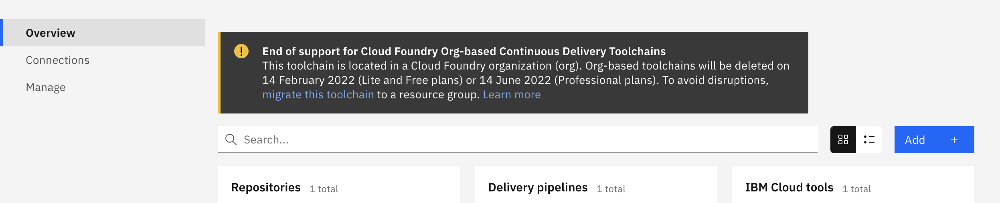

---

copyright:

  years: 2020, 2022

lastupdated: "2022-02-03"

keywords: toolchains, migrate, migrating to a resource group, migrate Cloud Foundry

subcollection: ContinuousDelivery

---

{:shortdesc: .shortdesc}
{:external: target="_blank" .external}
{:codeblock: .codeblock}
{:pre: .pre}
{:screen: .screen}
{:tip: .tip}
{:important: .important}
{:deprecated: .deprecated}
{:download: .download}   

# Migrating toolchains to a resource group
{: #migrate_toolchains}

Cloud Foundry org-based {{site.data.keyword.contdelivery_short}} service instances and toolchains are deprecated. You can no longer create Cloud Foundry org-based {{site.data.keyword.contdelivery_short}} service instances. As of 14 January 2022, you cannot create new toolchains within Cloud Foundry orgs. You can create new toolchains in resource groups. As of 14 February 2022, all toolchains within Cloud Foundry orgs that do not contain a Professional plan instance of the {{site.data.keyword.contdelivery_short}} service will be deleted. As of 14 June 2022, all toolchains within Cloud Foundry orgs that contain a Professional plan instance of the {{site.data.keyword.contdelivery_short}} service will be deleted. Before these dates, you can follow the guidance in this topic to migrate existing toolchains from Cloud Foundry orgs to resource groups.
{: deprecated}

You can use the {{site.data.keyword.contdelivery_full}} service toolchain migration wizard to migrate your toolchains from Cloud Foundry organizations (orgs) to resource groups.
{: shortdesc}

The {{site.data.keyword.contdelivery_short}} service manages the following types of toolchains:

* **Resource group-based toolchains** are Cloud resources that are organized in [resource groups](/docs/account?topic=account-resources-faq). These resources are available in all [multizone regions](/docs/overview?topic=overview-services_region#paas-services) in which the {{site.data.keyword.contdelivery_short}} service is available.
* **Cloud Foundry org-based toolchains** are organized in Cloud Foundry orgs and are available only in the Dallas, Frankfurt, and London [multizone regions](/docs/overview?topic=overview-services_region#paas-services). These toolchains lack several of the {{site.data.keyword.cloud_notm}} capabilities that are available with resource group-based toolchains.

## Why migrate?
{: #why_migrate_toolchains}

Toolchains in resource groups offer several benefits that are not available to toolchains in Cloud Foundry orgs:

* IAM provides flexible, fine-grained role and attribute-based access control. To learn more about toolchain access control, see [Managing access for toolchains in resource groups](/docs/ContinuousDelivery?topic=ContinuousDelivery-toolchains-iam-security).
* You can use the {{site.data.keyword.cloud_notm}} console resource list to readily find and manage your toolchains consistently with other resources and services.
* You can use the {{site.data.keyword.cloud_notm}} Command Line Interface (CLI) to work with toolchains within resource groups.
* You can view usage metrics by resource group for toolchains along with other resources.
* You can use the {{site.data.keyword.at_full_notm}} service to audit actions that are taken on toolchains within resource groups.
* You can use the {{site.data.keyword.mon_full_notm}} service to monitor pipeline private worker queue times for toolchains within resource groups.
* You can use the {{site.data.keyword.compliance_short}} service to manage the security and compliance characteristics of your toolchains.

## Who can migrate?
{: #whocanmigrate_toolchains}

You must have certain minimum access rights to migrate a toolchain from a Cloud Foundry org to a resource group:

* You must be an administrator of the toolchain in the Cloud Foundry org. To learn more about administrator access, see [Managing access for toolchains in Cloud Foundry orgs](/docs/ContinuousDelivery?topic=ContinuousDelivery-toolchains-cf-security) and [Cloud Foundry access](/docs/account?topic=account-cfaccess).
* You must have at least the **Editor** IAM role for the toolchain service so that the migration wizard can register the migrated toolchain resource with the {{site.data.keyword.cloud_notm}} platform. To learn more about the Editor IAM role, see [Managing access for toolchains in resource groups](/docs/ContinuousDelivery?topic=ContinuousDelivery-toolchains-iam-security).
* You must have at least the **Viewer** IAM role for the resource group to which the toolchain is migrated so that the migration wizard can add the toolchain resource to the resource group. To learn more about the Viewer IAM role, see [IAM access](/docs/account?topic=account-userroles).

To verify your access rights, from the {{site.data.keyword.cloud_notm}} console, select **Manage** > **Access (IAM)**, select **Users**, and select your name. Click **Access policies** to review your IAM roles and resource attributes. Click **Cloud Foundry access** to review your assigned Cloud Foundry roles. To view access for a specific Cloud Foundry org-based toolchain, from the Toolchain dashboard, click  **Manage**.
{: tip}

## How does migration work?
{: #how_toolchains}

The toolchain migration process updates metadata that specifies where the toolchain resides: in a Cloud Foundry org or in a resource group. The migration process does not make any other changes to the toolchain. The migration process does not change the URL of your toolchain. For example, bookmarks to your toolchain continue to work as-is after the migration. After the toolchain migration completes, the toolchain is removed from the original Cloud Foundry org. The toolchain is not visible or aliased from the Cloud Foundry org.

Toolchains are distinct from, but affiliated with, {{site.data.keyword.contdelivery_short}} service instances. The migration process operates on toolchains only. It does not migrate {{site.data.keyword.contdelivery_short}} service instances. When you migrate a toolchain, it is no longer managed by the {{site.data.keyword.contdelivery_short}} service instance in the origin Cloud Foundry org and region. The toolchain starts to be managed by the {{site.data.keyword.contdelivery_short}} service instance in the destination resource group and region. After you migrate all of the toolchains from a Cloud Foundry org and region, delete the {{site.data.keyword.contdelivery_short}} service instance from that org and region.

The migration process is constrained to the account and region of a toolchain. You cannot migrate toolchains to different regions, or to different accounts.

## Resource group considerations
{: #resource_group_considerations}

Before you migrate a toolchain to a resource group, consider the restriction that you cannot move toolchains or other resources between resource groups. Before you migrate a toolchain to a resource group, it is important to plan how you want to organize your toolchains into resource groups. You might decide to arrange resource groups similar to the arrangement of your Cloud Foundry orgs, or you might decide to arrange your resource groups differently. For more information about setting up and using resource groups, see [Best practices for organizing resources and assigning access](/docs/account?topic=account-account_setup).

Migrating a toolchain is a one direction, one time operation. You cannot roll back a migration. You cannot migrate toolchains from resource groups to Cloud Foundry orgs.

## Billing considerations
{: #billing_considerations}

{{site.data.keyword.contdelivery_short}} service billing is based on [authorized users](/docs/ContinuousDelivery?topic=ContinuousDelivery-limitations_usage#authorized_users).

In a resource group, the authorized users of a {{site.data.keyword.contdelivery_short}} service instance are determined automatically based on toolchain access and usage. Before you migrate a toolchain, review the IAM access policies within the account, region, and destination resource group to ensure that the appropriate users have the appropriate access to the toolchain. To learn more about these billing considerations, see [How are users counted for instances of Continuous Delivery in resource groups?](/docs/ContinuousDelivery?topic=ContinuousDelivery-limitations_usage#count_users_rg).

In a Cloud Foundry org, the authorized users of a {{site.data.keyword.contdelivery_short}} service instance are the members of the org, and the org membership list is managed manually. The toolchain migration process does not alter org membership. After you migrate a toolchain, review the membership list of the org and remove any users that no longer need access to the org, including access to any other toolchains that still reside in the org. To learn more about these billing considerations, see [How are users counted for instances of Continuous Delivery in orgs?](/docs/ContinuousDelivery?topic=ContinuousDelivery-limitations_usage#count_users_org).

Before you migrate a toolchain, determine whether the toolchain is required and in use. If a toolchain is no longer needed, consider deleting it instead of migrating it.
{: tip}

To stop authorized user billing for a {{site.data.keyword.contdelivery_short}} service instance, after you delete any unwanted toolchains, migrate all of the remaining toolchains within a Cloud Foundry org and region and immediately delete the instance of the {{site.data.keyword.contdelivery_short}} service in the same org and region.
{: tip}

## Migrating toolchains
{: #toolchains_migrate_steps}

Before you start the migration process, complete the following tasks:

* Check that you are an administrator of the toolchain in the origin Cloud Foundry org and region.
* Check that the tool integrations in the toolchain are in an error free, configured state.
* If a tool integration reports an error, try reconfiguring it to eliminate the error.
* Check that you have permissions to create toolchains and tool integrations in the destination resource group and region.
* Check that the toolchain name does not contain any nonalphanumeric characters other than `-`, `.`, `_`, `:`, or the space character.
* If the toolchain contains {{site.data.keyword.contdelivery_short}} entitled tools ({{site.data.keyword.gitrepos}}, {{site.data.keyword.webide}}, {{site.data.keyword.deliverypipeline}}, or {{site.data.keyword.DRA_short}}), ensure that the destination resource group and region contains an instance of the {{site.data.keyword.contdelivery_short}} service.

Toolchains are migrated one at a time. You can start the migration wizard from the **Toolchain** page in your browser.

Depending on the size of your browser window, you might need to scroll to view all of the checkboxes in the Migration wizard.
{: tip}

1. Log in to [{{site.data.keyword.cloud_notm}}](https://cloud.ibm.com/){: external}.
1. From the {{site.data.keyword.cloud_notm}} console, click the menu icon , and select **DevOps**.
1. Select the region where your toolchain resides. Only the Dallas, Frankfurt, and London regions support Cloud Foundry org-based toolchains.
1. Select the Cloud Foundry org that contains the toolchain you want to migrate.
1. Click the toolchain that you want to migrate to open the Toolchain **Overview** page.
1. A banner message appears indicating that the toolchain is eligible for migration.
1. Click **migrate this toolchain** within the banner message to launch the Migration wizard. The wizard guides you through the migration process.

   {: caption="Figure 1. Migration notification" caption-side="bottom"}

During the migration process, your toolchain is registered as a new resource with the {{site.data.keyword.cloud_notm}} platform. If you have an instance of the {{site.data.keyword.at_full_notm}} service that is provisioned in the same account and region as your toolchain, two events are recorded there:

* A **toolchain.instance.create** event represents the registration of your toolchain resource with the {{site.data.keyword.cloud_notm}} platform.
* A **toolchain.instance.update** event represents the transition of your toolchain from a Cloud Foundry org to a resource group. The **requestData** section of the event identifies the origin Cloud Foundry org and the destination resource group.

For more information about these and other events of the {{site.data.keyword.contdelivery_short}} service, see [Auditing events for Continuous Delivery](/docs/ContinuousDelivery?topic=ContinuousDelivery-cd-at-events).

## Next steps
{: #migrate_toolchains_next_steps}

After you migrate your toolchains to one or more resource groups in an account, review the access policies in IAM and make any required updates to ensure that the appropriate users have access to the appropriate toolchains. For more information about assigning access to toolchains in resource groups, see [Managing access for toolchains in resource groups](/docs/ContinuousDelivery?topic=ContinuousDelivery-toolchains-iam-security).

## Troubleshooting
{: #ts_toolchains_migration}

For problems or questions about migrating your Cloud Foundry org-based toolchains, see [Getting support](/docs/get-support?topic=get-support-using-avatar#getting-support).
