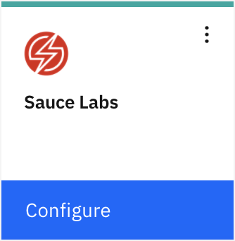
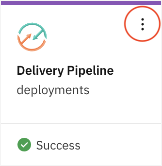

---

copyright:
  years: 2015, 2019
lastupdated: "2019-02-27"

keywords: user management function, tool integrations, Cloud Foundry org

subcollection: ContinuousDelivery

---

{:shortdesc: .shortdesc}
{:new_window: target="_blank"}
{:codeblock: .codeblock}
{:pre: .pre}
{:screen: .screen}
{:tip: .tip}
{:note: .note}
{:tip: .tip}
{:important: .important}

# Using toolchains
{: #toolchains-using}

Open toolchains are available in the Public and Dedicated environments on {{site.data.keyword.Bluemix}}. You can use a toolchain to be productive in your daily development, deployment, and operations work. After you set up a toolchain, you can add, delete, or configure tool integrations and manage access to the toolchain.
{: shortdesc}

You can manage toolchains in the US South, US East, United Kingdom, Germany, and Tokyo Public regions by using resource groups. You can use Cloud Foundry organizations (orgs) to manage toolchains in the US South, United Kingdom, and Germany Public regions. Access control and authorized user management function differently for toolchains depending on whether they are contained in a resource group or a Cloud Foundry org.
{: important}

## Configuring a tool integration
{: #configuring_a_tool_integration}

If you deferred the configuration of a tool integration when you created a toolchain, a **Configure** button is shown on its card. If you configured a tool integration when you created a toolchain, you can update the configuration settings.

1. On the DevOps dashboard, on the **Toolchains** page, click a toolchain to open its Overview page. Alternatively, on the app's Overview page, on the Continuous delivery card, click **View Toolchain**, and then click **Overview**.
1. If you need to configure a tool integration for the first time, on its card, click **Configure**.

  

 When you are finished configuring the tool integration, click **Save Integration**.

1. If you need to update a tool integration's configuration, on its card, click the menu to access the configuration options.

  

 A few of the tool integrations are preconfigured and don't require any configuration parameters. You can update the configuration settings for only the tool integrations that you configured.
 {: tip}

 When you are finished updating the settings, click **Save Integration**. For more information about configuring specific tool integrations, see [Configuring tool integrations](/docs/services/ContinuousDelivery?topic=ContinuousDelivery-integrations){: new_window}.

## Adding a tool integration
{: #adding_a_tool_integration}

You can add and configure tool integrations for your toolchain. The available tool integrations differ depending on whether you use {{site.data.keyword.Bluemix_notm}} Public or {{site.data.keyword.Bluemix_notm}} Dedicated.

1. On the DevOps dashboard, on the **Toolchains** page, click a toolchain to open its Overview page. Alternatively, on the app's Overview page, on the Continuous delivery card, click **View Toolchain**, and then click **Overview**.
1. To see a list of tool integrations to add, click **Add a Tool**.
1. Click a tool integration that you want to add.
1. Enter any required information to configure the tool integration.
1. Click **Create Integration** to add the tool integration to your toolchain.

## Deleting a tool integration
{: #deleting_a_tool_integration}

If you delete a tool integration from your toolchain, the deletion cannot be undone.

1. On the DevOps dashboard, on the **Toolchains** page, click a toolchain to open its Overview page. Alternatively, on the app's Overview page, on the Continuous delivery card, click **View Toolchain**, and then click **Overview**.
1. On the card for the tool integration that you want to delete, click the menu to access the configuration options.
1. To delete the tool integration from your toolchain, click **Delete**.
1. Confirm by clicking **Delete**.  

## Managing access to toolchains in resource groups
{: #managing_access_resource_groups}

You can use the Identity and Access Management (IAM) service to manage user access to toolchains. For more information about managing access control with IAM, see [Managing user access to toolchains with Identity and Access Management](/docs/services/ContinuousDelivery?topic=ContinuousDelivery-toolchains-iam-security){: new_window}. 

Only users who are part of the authorized users list for the selected instance of {{site.data.keyword.contdelivery_short}} can use the Delivery Pipeline, Eclipse Orion {{site.data.keyword.webide}}, and {{site.data.keyword.gitrepos}} features of {{site.data.keyword.contdelivery_short}} toolchains. You can manage authorized user entitlement from the Manage tab of the selected instance of {{site.data.keyword.contdelivery_short}}, within the specified resource group.

To access the key features of {{site.data.keyword.contdelivery_short}} in a toolchain, such as Delivery Pipeline, a user must have access to the toolchain in IAM, and the user must also be part of the Authorized Users list of the {{site.data.keyword.contdelivery_short}} instance.
{: important}

Authorized user entitlement applies to all toolchains that are contained in the same resource group as the instance of {{site.data.keyword.contdelivery_short}}.
{: tip}

## Managing access to toolchains in Cloud Foundry orgs
{: #managing_access_orgs}

You can grant users access to a toolchain by adding them to both the org that the toolchain is associated with and the access control list for the toolchain. Each toolchain is associated with a specific org, and any user that is a member of that org can be added to the access control list for any of the associated toolchains. The org that you are currently working in is displayed on the menu bar. To access a different set of toolchains, switch to a different org.

You must add users to the toolchain's org in the region where the toolchain is hosted. If the toolchain is configured to deploy apps to a different region, it will still deploy apps to that region.
{: important}

If you are using {{site.data.keyword.Bluemix_notm}} Dedicated for {{site.data.keyword.ghe_short}}, when you add users to your {{site.data.keyword.Bluemix_notm}} org and spaces, the users can log in to {{site.data.keyword.ghe_short}} by using their {{site.data.keyword.Bluemix_notm}} ID and password. When the users log in, accounts are created for them. When you add users to your {{site.data.keyword.Bluemix_notm}} org and spaces, they are not automatically added to the {{site.data.keyword.ghe_short}} repo. Someone who has admin privileges for the repo must add them. For more information, see [Using Dedicated GitHub Enterprise](/docs/services/ghededicated?topic=ghededicated-gheded_getting_started){: new_window}. If you are using your own managed version of {{site.data.keyword.ghe_short}}, follow your internal procedures.

###Tips for managing access to a toolchain

* To manage toolchain access, on the DevOps dashboard, on the **Toolchains** page, click the toolchain to manage and then click **Manage**. Alternatively, on the app's Overview page, on the Continuous delivery card, click **View Toolchain** and then click **Manage**.

* To grant access to all of the members of the toolchain's org, click **Add org**. All of the members of that org can view the toolchain.

* You can grant admin privileges to an org or a user. Admins can modify and delete the toolchain. To grant admin privileges, select the **ADMIN** check box for the org or user.

* If you select the **ADMIN** check box for an org, all of the members of that org become admins. If you add members to the org after you grant admin privileges to the org, those members are given the same access as the rest of the org.

* To grant access to a user who is a member of the toolchain's org, enter the user's ID and click **Add user**. The user can view the toolchain.

* To grant access to a user who is not a member of the toolchain's org, follow these steps:

   a. From the menu bar, click **Manage > Access (IAM)**.

   b. Click **Access starts with the user**.
   
   c. From the row for the user that you want to assign access, select the **Actions** menu, and then click **Assign access**.
   
   d. Select **Assign access by using Cloud Foundry**.

   e. Select **Assign organization**.

   f. Assign the user access:

     * Choose an organization to add the user to.

     * Assign an organization role.

     * Choose a region.

     * Choose a space.

     * Assign a role for the selected space in the organization.

     By default, org managers have full admin privileges for all of the toolchains that are associated with the org. To grant full admin privileges to the user, select the **Manager** role. The Billing Manager and Auditor roles do not affect toolchain access. You can change the roles later on the Team Directory page. For more information, see [Cloud Foundry roles](/docs/iam?topic=iam-cfaccess#cfaccess){: new_window}.
     {: tip}

   After the user is a member of the org, return to the toolchain's Manage page and add the user to the toolchain.  

## Deleting a toolchain
{: #deleting_a_toolchain}

You can delete a toolchain and specify which of the associated tool integrations you want to delete. When you delete a toolchain, the deletion cannot be undone.

1. On the DevOps dashboard, on the **Toolchains** page, click the toolchain to delete. Alternatively, on the app's Overview page, on the Continuous delivery card, click **View Toolchain**.
1. Click the **More Actions** menu, which is next to **View app**.
1. Click **Delete**. Deleting a toolchain removes all of its tool integrations, which might delete resources that are managed by those integrations.
1. Confirm the deletion by typing the name of the toolchain and clicking **Delete**.  

 When you delete a GitHub, {{site.data.keyword.ghe_short}}, or {{site.data.keyword.gitrepos}} tool integration, the associated repo is not deleted from GitHub, {{site.data.keyword.ghe_short}}, or {{site.data.keyword.gitrepos}}. You must manually remove the repo.
 {: tip}

##Take a tutorial: Using toolchains
{: #toolchain-tutorial}

Check out these tutorials on the [IBM&reg; Cloud Garage Method ](https://www.ibm.com/cloud/garage){:new_window}:

  * [Create and use your first toolchain by using the "Develop a Cloud Foundry app" toolchain ](https://www.ibm.com/cloud/garage/tutorials/introduce-develop-cloud-foundry-app-toolchain){:new_window}.

  * [Add a toolchain to an app ](https://www.ibm.com/cloud/garage/tutorials/add-a-toolchain-to-an-app?task=2){:new_window}.

  * [Use the "Develop and test microservices on Cloud Foundry" toolchain ](https://www.ibm.com/cloud/garage/tutorials/use-develop-test-microservices-on-cloud-foundry-toolchain){:new_window}.
