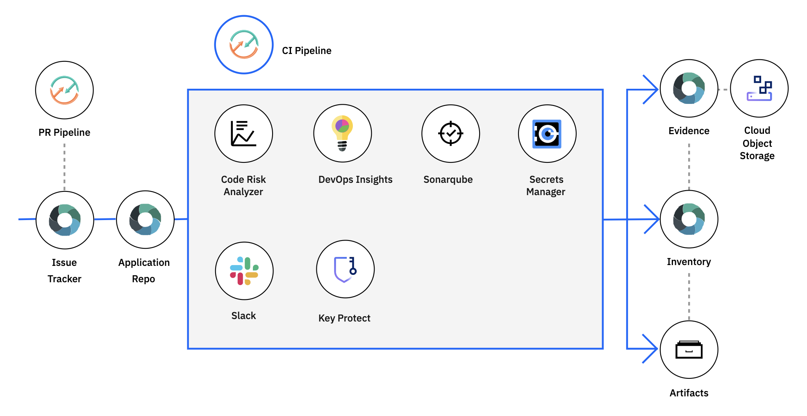

---

copyright: 
  years: 2015, [{CURRENT_YEAR}]
lastupdated: "[{LAST_UPDATED_DATE}]"

keywords: set of tool integrations, toolchains, templates, collective power of a toolchain, IBM Cloud, IAM, 

subcollection: ContinuousDelivery

---

{{site.data.keyword.attribute-definition-list}}

# Creating toolchains
{: #toolchains_getting_started}
{: help} 
{: support}

The {{site.data.keyword.cloud}} starter kits are deprecated. As of 18 February 2023, new applications cannot be created, and the starter kits will be removed from the catalog. For current users, existing apps will continue to operate and will be supported until the End of Support date on 31 March 2023. On this date, the Applications Details page will no longer be accessible, but you will still be able to access your application code and toolchains through your [{{site.data.keyword.cloud_notm}} Resource List](https://cloud.ibm.com/resources). For more information, see the [deprecation announcement](https://www.ibm.com/cloud/blog/announcements/deprecation-of-ibm-cloud-starter-kits){: external}.
{: deprecated}

A *toolchain* is a set of tool integrations that support development, deployment, and operations tasks. The collective power of a toolchain is greater than the sum of its individual tool integrations.
{: shortdesc}

Open toolchains are available on {{site.data.keyword.cloud}}. You can create a toolchain in several ways: use a template to create a toolchain, create a toolchain for an app, create a toolchain by using HTTP APIs or SDKs, or create a toolchain by using Terraform.

Each toolchain is associated with a specific resource group. Any user that has Identity and Access Management (IAM) Viewer permission for the toolchain resource or the resource group that contains it can access the toolchain. For more information about access control for toolchains in resource groups, see [Managing user access to toolchains in resource groups](/docs/ContinuousDelivery?topic=ContinuousDelivery-toolchains-iam-security).

On {{site.data.keyword.cloud_notm}} Public, depending on the template or toolchain that you use, the toolchain might include a GitHub or Git repository (repo) that is populated with app starter code and a preconfigured delivery pipeline. When you push changes to the toolchain's repo, the delivery pipeline automatically builds and deploys the app to {{site.data.keyword.cloud_notm}}.

To see which toolchains and tool integrations are available, see [Toolchain availability, templates, and tutorials](/docs/ContinuousDelivery?topic=ContinuousDelivery-cd_about).

## Creating a toolchain from a template by using the console
{: #creating_a_toolchain_from_a_template}
{: ui}

You can use a template as a starting point to [create a toolchain](https://cloud.ibm.com/devops/create){: external} that includes a specific set of tool integrations. Depending on the template that you use, you can create a toolchain that has a specific set of tool integrations or an empty toolchain that you can add tool integrations to. Learn more about how to use the templates from the [{{site.data.keyword.cloud_notm}} Garage Method](https://www.ibm.com/cloud/architecture/toolchains){: external}.

1. Log in to [{{site.data.keyword.cloud_notm}}](http://cloud.ibm.com){: external}.
1. From the {{site.data.keyword.cloud_notm}} console, click the menu icon , and select **DevOps**.
1. On the **Toolchains** page, click **Create a Toolchain**.
1. On the **Create a Toolchain** page, click a toolchain template.
1. Review the diagram of the toolchain that you are about to create. The diagram shows each tool integration in its lifecycle phase in the toolchain.

   A few of the toolchain templates have multiple instances of a tool integration. For example, the "Develop and test microservices with Kubernetes and Helm" toolchain template on {{site.data.keyword.cloud_notm}} Public contains four instances of GitHub and four instances of Delivery Pipeline.
   {: tip}

   The diagram in the following image is an example. When you create a toolchain, the diagram shows each tool integration that is part of the toolchain.

   {: caption="Figure 1. Sample Toolchain" caption-side="bottom"}

1. Review the default information for the toolchain settings:

   * The toolchain's name identifies it in {{site.data.keyword.cloud_notm}}. If you want to use a different name, change the toolchain's name.
   * The region to create the toolchain in. If you want to use a different region, select it from the list of available regions.
   * The resource group to create the toolchain in. If you want to use a different resource group, select it from the list of available resource groups.
   * The provider for your source repository, such as GitHub, GitLab, or Bitbucket. If you want to use a different source provider, select it from the list of available repos.

1. In the Tool Integrations section, select each tool integration that you want to configure for your toolchain. A few of the tool integrations do not require configuration. For more information about configuring the tool integrations, see [Configuring tool integrations](/docs/ContinuousDelivery?topic=ContinuousDelivery-integrations).

   Many of the tool integrations that comprise a toolchain require a secret to authenticate with the {{site.data.keyword.contdelivery_short}} service.
   {: tip}
 
   A secret is credentials that can be provided in the form of a password, authentication token, API key, or certificate. For example, when you add the Delivery Pipeline tool integration to your toolchain, you must provide a secret in the form of an API key. 

   a. In the Tool Integrations section, click **{{site.data.keyword.deliverypipeline}}**.

   b. Click **New** to create an {{site.data.keyword.cloud}} API Key.

   c. Click **OK** to apply your new API key.
 
   Each user can have a maximum of 20 API keys. 
   {: tip}
   
   d.  Click **OK** to create the API key without saving a secure copy of the key. 
 
   e. To securely save the API key so that you can use it again in other toolchains and starter kit workflows:
 
    * Select the **Save this key in a secrets store for reuse** checkbox to integrate with the {{site.data.keyword.keymanagementserviceshort}} or {{site.data.keyword.secrets-manager_short}} secrets store.
    * If you don't have an existing instance of {{site.data.keyword.keymanagementserviceshort}} or {{site.data.keyword.secrets-manager_short}}, specify a name for the instance and the secret.
    * Click **OK** to apply your new API key.
   
   f. To validate that your {{site.data.keyword.keymanagementserviceshort}} or {{site.data.keyword.secrets-manager_short}} instance was successfully created, go to your [{{site.data.keyword.cloud}} Resource list](https://cloud.ibm.com/resources){: external} and expand the **Services** twistie. To view your API keys, from the menu bar, click **Manage > Access (IAM)**, and select **{{site.data.keyword.cloud}} API keys**.

   g. The API key that you created and copied to Key Project is now available for use on the Create a Toolchain page. Any tool integration that requires a secret displays a key icon. Click the key icon to open a Secrets Picker dialog box to retrieve secrets from one or more {{site.data.keyword.keymanagementserviceshort}} or {{site.data.keyword.secrets-manager_short}} instances. 
 
1. Click **Create**. Several steps run automatically to set up your toolchain. The tool integrations that are set up are different depending on which toolchain template you selected. For example, when you create a "Develop and test microservices with Kubernetes and Helm" toolchain on {{site.data.keyword.cloud_notm}} Public, these steps are run:

   * The toolchain is created.
   * If you configured Delivery Pipeline, the pipelines are created and triggered.
   * If you configured Sauce Labs, the toolchain is set up to add Sauce Labs test jobs to the pipelines.
   * If you configured PagerDuty, the toolchain is set up to send alert notifications to the PagerDuty service that you specified.
   * If you configured Slack, the toolchain is set up to send notifications about deployment status to the Slack channel that you specified.
   * If you configured a source code tool integration such as GitHub, the sample GitHub repo is cloned into your GitHub account.

## Creating a toolchain from an app by using the console
{: #creating_a_toolchain_from_an_app}
{: ui}

You can create a toolchain from your app. The toolchain can support continuous development, deployment, monitoring, and more, and it is associated with your app. Each app can be associated with a toolchain. When you push changes to the toolchain's GitHub repo, the pipeline automatically builds and deploys the app.

If you created your app by using your own code repository, click **Deploy my app** on your app's details page. Then, follow the steps that are described in [Creating apps from your own code repository](/docs/apps?topic=apps-tutorial-byoc#tutorial-byoc).
{: tip}

1. If you created your app by using a starter kit, click **Deploy my app** on your app's details page. Next, select a deployment target. If you use {{site.data.keyword.cloud_notm}} Public, your app is configured for continuous delivery from a new GitHub repo that is populated with the app starter code.
1. On the toolchain configuration page, review the diagram of the toolchain that you are about to create. The diagram shows each tool integration in its lifecycle phase in the toolchain.
1. Review the default information for the toolchain settings. The toolchain's name identifies it in {{site.data.keyword.cloud_notm}}. If you want to use a different name, change the toolchain's name.
1. In the Tool Integrations section, select each tool integration that you want to configure for your toolchain. A few of the tool integrations do not require configuration. For more information about configuring the tool integrations, see [Configuring tool integrations](/docs/ContinuousDelivery?topic=ContinuousDelivery-integrations).
1. Click **Create**. Several steps run automatically to set up your toolchain. For example, when you create a toolchain from an app on {{site.data.keyword.cloud_notm}} Public, these steps are run:

   * The toolchain is created.
   * If you configured Delivery Pipeline, the pipelines are created and triggered.
   * If you configured GitHub, the sample GitHub repo is cloned into your GitHub account.

## Creating a toolchain with the API
{: #creating_a_toolchain_api}
{: api}

1. [Obtain an IAM bearer token](https://{DomainName}/apidocs/toolchain#authentication){: external}. Alternatively, if you are using an SDK, [obtain an IAM API key](https://{DomainName}/iam/apikeys){: external} and set the client options by using environment variables.
   
   ```bash
   export CD_TOOLCHAIN_AUTH_TYPE=iam && \
   export CD_TOOLCHAIN_APIKEY={iam_api_key} && \
   export CD_TOOLCHAIN_URL={base_url}
   ```
   {: pre}

2. [Look up the ID of the resource group](https://{DomainName}/apidocs/resource-controller/resource-manager#list-resource-groups){: external} in which you want to create your toolchain.

3. Choose the region in which you want to create your toolchain.

4. Create an instance of the toolchain.

   ```curl
   curl -X POST \
     "{base_url}/toolchains" \
     -H 'Authorization: Bearer {token}' \
     -H 'Content-Type: application/json' \
       -d '{
       "name": "{toolchain_name}",
       "resource_group_id": "{resource_group_id}"
     }'
   ```
   {: pre}
   {: curl}

   ```javascript
   const CdToolchainV2 = require('ibm-continuous-delivery/cd-toolchain/v2');
   const toolchainService = CdToolchainV2.newInstance();
   ...
   (async() => {
      const toolchainPrototypeModel = {
         description: {toolchain_description},
         name: {toolchain_name},
         resourceGroupId: {resource_group_id}
      };
      const response = await toolchainService.createToolchain(toolchainPrototypeModel);
   })();
   ```
   {: codeblock}
   {: node}

   ```go
   import (
	   "github.com/IBM/continuous-delivery-go-sdk/cdtoolchainv2"
   )
   ...
   toolchainClientOptions := &cdtoolchainv2.CdToolchainV2Options{}
   toolchainClient, err := cdtoolchainv2.NewCdToolchainV2UsingExternalConfig(toolchainClientOptions)
   createToolchainOptions := toolchainClient.NewCreateToolchainOptions({toolchain_name}, {resource_group_id})
   createToolchainOptions.SetDescription({toolchain_description})
   toolchain, response, err := toolchainClient.CreateToolchain(createToolchainOptions)
   ```
   {: codeblock}
   {: go}

   ```python
   from ibm_continuous_delivery.cd_toolchain_v2 import CdToolchainV2
   ...
   toolchain_service = CdToolchainV2.new_instance()
   toolchain = toolchain_service.create_toolchain(
      description = {toolchain_description},
      name = {toolchain_name},
      resource_group_id = {resource_group_id}
   )
   ```
   {: codeblock}
   {: python}

   ```java
   import com.ibm.cloud.continuous_delivery.cd_toolchain.v2.CdToolchain;
   import com.ibm.cloud.continuous_delivery.cd_toolchain.v2.model.*;
   ...
   CdToolchain toolchainService = CdToolchain.newInstance();
   CreateToolchainOptions createToolchainOptions = new CreateToolchainOptions.Builder()
      .description({toolchain_description})
      .name({toolchain_name})
      .resourceGroupId({resource_group_id})
      .build();
   Response<ToolchainPost> response = toolchainService.createToolchain(createToolchainOptions).execute();
   ToolchainPost toolchain = response.getResult();
   ```
   {: codeblock}
   {: java}

The following table lists and describes each of the variables that are used in the previous steps.
    
| Variable | Description |
|:---------|:------------|
| `{base_url}` | The Toolchain API endpoint URL, for example `https://api.us-south.devops.cloud.ibm.com/toolchain/v2`. For more information about this endpoint URL, including a list of values, see [Endpoint URL](https://{DomainName}/apidocs/toolchain#endpoint-url){: external}. |
| `{iam_api_key}` | Your IAM API key. |
| `{resource_group_id}` | The ID of the resource group in which to provision the toolchain. To find the IDs of the available resource groups, run `ibmcloud resource groups`. |
| `{token}` | A valid IAM bearer token. |
| `{toolchain_description}` | A description for your toolchain. |
| `{toolchain_name}` | A name for your toolchain. |
{: caption="Table 1. Variables for provisioning a toolchain with the API" caption-side="top"}

For more information about creating toolchains with the API, see [Create a toolchain](https://cloud.ibm.com/apidocs/toolchain#create-toolchain){: external} in the {{site.data.keyword.cloud_notm}} API Docs.

## Creating a toolchain with Terraform
{: #creating_a_toolchain_terraform}
{: terraform}

1. To install the Terraform CLI and configure the {{site.data.keyword.cloud_notm}} provider plug-in for Terraform, follow the tutorial for [Getting started with Terraform on {{site.data.keyword.cloud}}](/docs/ibm-cloud-provider-for-terraform?topic=ibm-cloud-provider-for-terraform-getting-started).

2. Create a Terraform configuration file that is named `main.tf`. In this file, add the configuration to create a toolchain by using the HashiCorp Configuration Language. For more information about using this configuration language, see the [Terraform documentation](https://www.terraform.io/docs/language/index.html){: external}.

   The following example creates a toolchain by using the `ibm_cd_toolchain` resource.
  
   ```terraform
   data "ibm_resource_group" "group" {
     name = "default"
   }

   resource "ibm_cd_toolchain" "cd_toolchain" {
     name              = "my toolchain"
     resource_group_id = data.ibm_resource_group.group.id
   }
   ```
   {: codeblock}

   For more information about `ibm_cd_toolchain`, see the argument reference details in the [Terraform Registry Documentation](https://registry.terraform.io/providers/IBM-Cloud/ibm/latest/docs/resources/cd_toolchain){: external}.
  
3. Initialize the Terraform CLI.

   ```terraform
   terraform init
   ```
   {: pre}
   
4. Create a Terraform execution plan. This plan summarizes all of the actions that must run to create a toolchain.

   ```terraform
   terraform plan
   ```
   {: pre}

5. Apply the Terraform execution plan. Terraform takes all of the required actions to create the toolchain.

   ```terraform
   terraform apply
   ```
   {: pre}

## Viewing a toolchain
{: #viewing_a_toolchain}

You can view a toolchain by using the console, from the CLI, with the API, or with Terraform.

### Viewing a toolchain by using the console
{: #viewing-toolchain-console}
{: ui}

After you configure the toolchain and its tool integrations, you can view a visual representation of the toolchain.

You can view a toolchain from an app by clicking the toolchain name from your app's Details page.
{: tip}

1. From the {{site.data.keyword.cloud_notm}} console, click the menu icon , and select **DevOps**. 
1. On the Toolchains page, select a **Resource Group** and **Location**. All of the toolchains that are contained within the selected resource group and location are displayed. Click the toolchain that you want to view to open its Overview page. Alternatively, on the App details page in your app, click the toolchain name.
1. To access a tool integration that is in your toolchain, go to the appropriate card, such as **Delivery pipelines**, and then click the tool integration.

   You can also find your toolchains within the **Developer tools** category of the [Resource list](https://cloud.ibm.com/resources){: external}. By default, the Resource list shows toolchains and other resources across multiple resource groups and locations.
   {: tip}

   If you have more than one GitHub or Git repo, you might have multiple instances of the same tool integration within the **Repositories** card because each repo is represented separately. If you have more than one pipeline, you might have multiple instances of the same tool integration because each pipeline is represented separately. For example, when you create a "Develop and test microservices with Kubernetes and Helm" toolchain, each of the microservices has its own GitHub or Git repo and its own pipeline.
   {: tip}

### Viewing a toolchain from the CLI
{: #viewing-toolchain-cli}
{: cli}

The command-line interface (CLI) toolchain view depends on the resource group that is targeted. Use the following commands to specify or change the targeted resource group.

* To view the currently targeted resource group, run the following command:

```text
ibmcloud target
```
{: codeblock}

* If no resource group is set, or if you want to change the resource group, run the following command:

```text
ibmcloud target -g [RESOURCE-GROUP]
```
{: codeblock}

* To view toolchains in the targeted resource group, run the following command:

```text
ibmcloud dev toolchains
```
{: codeblock}

* To view the details for a specific toolchain, run the following command:

```text
ibmcloud dev toolchain-get [TOOLCHAIN-NAME]
```
{: codeblock}

* To view the toolchain details in a browser, run the following command:

```text
ibmcloud dev toolchain-open [TOOLCHAIN-NAME]
```
{: codeblock}  

### Getting a toolchain with the API
{: #viewing-toolchain-api}
{: api}

1. [Obtain an IAM bearer token](https://{DomainName}/apidocs/toolchain#authentication){: external}. Alternatively, if you are using an SDK, [obtain an IAM API key](https://{DomainName}/iam/apikeys){: external} and set the client options by using environment variables.
   
   ```bash
   export CD_TOOLCHAIN_AUTH_TYPE=iam && \
   export CD_TOOLCHAIN_APIKEY={iam_api_key} && \
   export CD_TOOLCHAIN_URL={base_url}
   ```
   {: pre}

2. [Look up the ID of the resource group](https://{DomainName}/apidocs/resource-controller/resource-manager#list-resource-groups){: external} in which your toolchain resides.

3. Choose the region in which your toolchain resides.

4. Get a list of toolchains in the resource group.

   ```curl
   curl -X GET \
     "{base_url}/toolchains?resource_group_id={resource_group_id}" \
     -H 'Authorization: Bearer {token}' \
     -H 'Accept: application/json'
   ```
   {: pre}
   {: curl}

   ```javascript
   const CdToolchainV2 = require('ibm-continuous-delivery/cd-toolchain/v2');
   const toolchainService = CdToolchainV2.newInstance();
   ...
   (async() => {
      const response = await toolchainService.listToolchains({
         resourceGroupId: {resource_group_id}
      });
   })();
   ```
   {: codeblock}
   {: node}

   ```go
   import (
	   "github.com/IBM/continuous-delivery-go-sdk/cdtoolchainv2"
   )
   ...
   toolchainClientOptions := &cdtoolchainv2.CdToolchainV2Options{}
   toolchainClient, err := cdtoolchainv2.NewCdToolchainV2UsingExternalConfig(toolchainClientOptions)
   listToolchainsOptions := toolchainClient.NewListToolchainsOptions({resource_group_id})
   toolchains, response, err := toolchainClient.ListToolchains(listToolchainsOptions)
   ```
   {: codeblock}
   {: go}

   ```python
   from ibm_continuous_delivery.cd_toolchain_v2 import CdToolchainV2
   ...
   toolchainService = CdToolchainV2.new_instance()
   toolchains = toolchainService.list_toolchains(
      resource_group_id = {resource_group_id}
   )
   ```
   {: codeblock}
   {: python}

   ```java
   import com.ibm.cloud.continuous_delivery.cd_toolchain.v2.CdToolchain;
   import com.ibm.cloud.continuous_delivery.cd_toolchain.v2.model.*;
   ...
   CdToolchain toolchainService = CdToolchain.newInstance();
   ListToolchainsOptions listToolchainsOptions = new ListToolchainsOptions.Builder()
      .resourceGroupId({resource_group_id})
      .build();
   Response<ToolchainCollection> response = toolchainService.listToolchains(listToolchainsOptions).execute();
   ToolchainCollection toolchains = response.getResult();
   ```
   {: codeblock}
   {: java}

1. Get a specific toolchain.

   ```curl
   curl -X GET \
     {base_url}/toolchains/{toolchain_id} \
     -H 'Authorization: Bearer {token}' \
     -H 'Accept: application/json'
   ```
   {: pre}
   {: curl}

   ```javascript
   const CdToolchainV2 = require('ibm-continuous-delivery/cd-toolchain/v2');
   const toolchainService = CdToolchainV2.newInstance();
   ...
   (async() => {
      const response = await toolchainService.getToolchainById({
         toolchainId: {toolchain_id}
      });
   })();
   ```
   {: codeblock}
   {: node}

   ```go
   getToolchainByIDOptions := toolchainClient.NewGetToolchainByIDOptions({toolchain_id})
   toolchain, response, err := toolchainClient.GetToolchainByID(getToolchainByIDOptions)
   ```
   {: codeblock}
   {: go}

   ```python
   toolchain = toolchainService.get_toolchain_by_id(
      toolchain_id = {toolchain_id}
   )
   ```
   {: codeblock}
   {: python}

   ```java
   GetToolchainByIdOptions getToolchainByIdOptions = new GetToolchainByIdOptions.Builder()
      .toolchainId({toolchain_id})
      .build();
   Response<Toolchain> response = toolchainService.getToolchainById(getToolchainByIdOptions).execute();
   Toolchain toolchain = response.getResult();
   ```
   {: codeblock}
   {: java}

The following table lists and describes each of the variables that are used in the previous steps.
    
| Variable | Description |
|:---------|:------------|
| `{base_url}` | The Toolchain API endpoint URL, for example `https://api.us-south.devops.cloud.ibm.com/toolchain/v2`. For more information about this endpoint URL, including a list of values, see [Endpoint URL](https://{DomainName}/apidocs/toolchain#endpoint-url){: external}. |
| `{resource_group_id}` | The ID of the resource group in which the toolchain resides. To find the IDs of the available resource groups, run `ibmcloud resource groups`. |
| `{token}` | A valid IAM bearer token. |
| `{toolchain_id}` | The ID of your toolchain. |
{: caption="Table 2. Variables for viewing a toolchain with the API" caption-side="top"}

For more information about listing toolchains with the API and getting a toolchain with the API, see [Get a list of toolchains](https://cloud.ibm.com/apidocs/toolchain#list-toolchains){: external} and [Get a toolchain](https://cloud.ibm.com/apidocs/toolchain#get-toolchain-by-id){: external} in the {{site.data.keyword.cloud_notm}} API Docs.

### Viewing a toolchain with Terraform
{: #viewing-toolchain-terraform}
{: terraform}

1. Locate the Terraform file (for example, `main.tf`) that contains the `resource` block for the existing toolchain.

2. Add an `output` block to the Terraform file, if it does not already contain a block.

   The `resource` in the following example describes an existing toolchain. The `output` block instructs Terraform to output the attributes of the toolchain resource.
  
   ```terraform
   data "ibm_resource_group" "group" {
     name = "default"
   }

   resource "ibm_cd_toolchain" "cd_toolchain" {
     name              = "my toolchain"
     resource_group_id = data.ibm_resource_group.group.id
   }

   output "cd_toolchain_attributes" {
     value = ibm_cd_toolchain.cd_toolchain
   }
   ```
   {: codeblock}

   For more information about `ibm_cd_toolchain`, see the argument reference details in the [Terraform Registry Documentation](https://registry.terraform.io/providers/IBM-Cloud/ibm/latest/docs/resources/cd_toolchain){: external}.

3. Initialize the Terraform CLI.

   ```terraform
   terraform init
   ```
   {: pre}

4. Apply the Terraform execution plan with the `refresh-only` option. Terraform refreshes its state and displays the attributes of the toolchain resource.

   ```terraform
   terraform apply -refresh-only -auto-approve
   ```
   {: pre}

## Take a tutorial: Using toolchains
{: #toolchain_tutorials}

Check out the [Add a toolchain to an app](https://www.ibm.com/cloud/architecture/tutorials/add-a-toolchain-to-an-app?task=2){: external} tutorial on the [{{site.data.keyword.cloud_notm}} Garage Method](https://www.ibm.com/cloud/architecture/toolchains){: external}.
