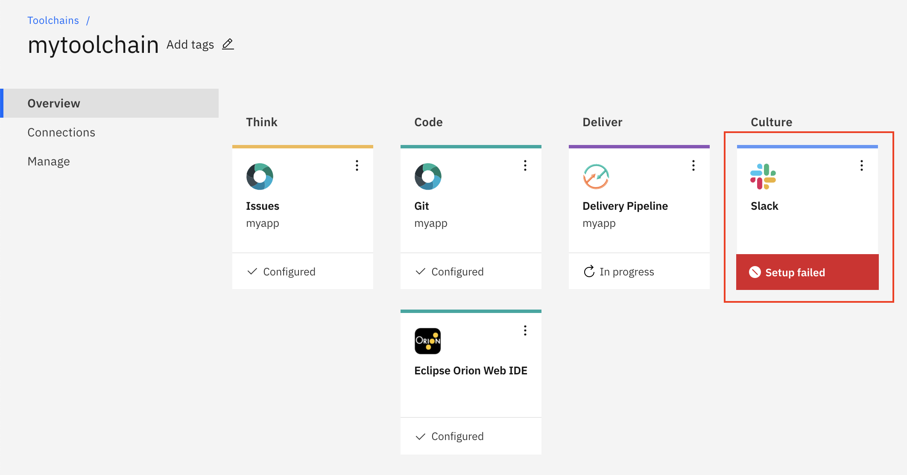
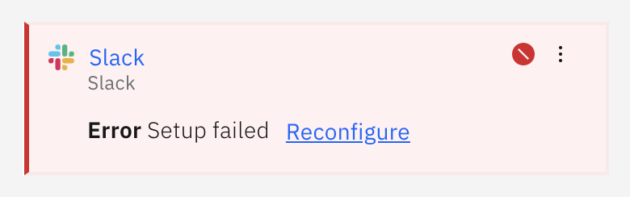

---

copyright:
  years: 2015, 2017
lastupdated: "2017-5-25"

---
<!-- Common attributes used in the template are defined as follows: -->
{:tsSymptoms: .tsSymptoms}
{:tsCauses: .tsCauses}
{:tsResolve: .tsResolve}
{:new_window: target="_blank"}
{:shortdesc: .shortdesc}

# {{site.data.keyword.contdelivery_short}} troubleshooting
{: #ts_cd}

Get answers to common troubleshooting questions about using {{site.data.keyword.contdelivery_full}}.
{:shortdesc}


## Cannot authorize with GitHub
{: #cannot_authorize_github}

You are not authorized with GitHub.
{:shortdesc}

If you have not authorized {{site.data.keyword.Bluemix_notm}} to access your GitHub account, any of these issues can occur:
{: tsSymptoms}

 * When you try to add the GitHub tool integration to your toolchain, the tool integration is not added.
 * The pipeline does not automatically run when you push changes to your GitHub or GitHub Enterprise repository.

{{site.data.keyword.Bluemix_notm}} is not authorized to access GitHub.  
{: tsCauses}

If you are configuring the GitHub tool integration while you are creating your toolchain, follow these steps:
{: tsResolve}

  1. In the Configurable Integrations section, click **GitHub**.
  1. If you are creating the toolchain on {{site.data.keyword.Bluemix_notm}} Public and you have not authorized {{site.data.keyword.Bluemix_notm}} to access GitHub, click **Authorize** to go to the GitHub website.
  1. If you don't have an active GitHub session, you are prompted to log in. Click **Authorize Application** to allow {{site.data.keyword.Bluemix_notm}} to access your GitHub account. If you have an active GitHub session but you haven't entered your password recently, you might be prompted to enter your GitHub password to confirm.

If you already have a toolchain, update the GitHub tool integration's configuration:

 1. On the DevOps dashboard, on the **Toolchains** page, click the toolchain to open its Overview page. Alternatively, on the app's Overview page, on the Continuous delivery card, click **View Toolchain**, and then click **Overview**.
 1. On the GitHub card, click the menu and click **Configure**.
 1. Update the configuration settings to authorize {{site.data.keyword.Bluemix_notm}} to access GitHub. Click **Authorize** to go to the GitHub website. If you don't have an active GitHub session, you are prompted to log in. Click **Authorize Application** to allow {{site.data.keyword.Bluemix_notm}} to access your GitHub account. If you have an active GitHub session but you haven't entered your password recently, you might be prompted to enter your GitHub password to confirm.
 1. When you are finished updating the settings, click **Save Integration**.


## Cannot create a toolchain
{: #cannot_create_toolchain}

An error is displayed when you create a toolchain.
{:shortdesc}

When you create a toolchain, you see the following error message:
{: tsSymptoms}

`This organization contains 200 toolchains, which is the maximum limit. Before you can add another toolchain, remove one or more toolchains from the organization.`

You cannot have more than 200 toolchains in an organization (org).  
{: tsCauses}

Remove one or more toolchains from your org and then create your toolchain again.
{: tsResolve}


## Org's memory limit is exceeded
{: #org_outofmemory}

You might be unable to deploy an app to {{site.data.keyword.Bluemix_notm}} if you have exceeded the memory limit of your organization. You can either reduce the memory that your apps use or increase the memory quota of your account. The maximum memory quota for a trial account is 2 GB and can only be increased by moving to a paid account.

When you deploy an app to {{site.data.keyword.Bluemix_notm}}, you see the following error message:
{: tsSymptoms}

`FAILED Server error, status code: 400, error code: 100005, message: You have exceeded your organization's memory limit.`

This error occurs when the amount of memory that is remaining for your organization is less than the amount of memory that is required by the app that you want to deploy. The maximum memory quota for a trial account is 2 GB.
{: tsCauses}

You can either increase the memory quota of your account, or reduce the memory that your apps use.
{: tsResolve}

  * To increase the memory quota of your account, convert your trial account to a pay account. For information about how to convert your trial account to a pay account, see [Pay accounts](/docs/pricing/index.html#pay-accounts).
  * To reduce the memory that your apps use, use either the {{site.data.keyword.Bluemix_notm}} console or the cf command line interface.

    If you use the {{site.data.keyword.Bluemix_notm}} console, complete the following steps:

    1. In the Apps Dashboard, select your app. The app details page opens.
    2. In the runtime pane, you can reduce the maximum memory limit or the numbers of app instances, or both, for your app.

    If you use the cf command line interface, complete the following steps:

    1. Check how much memory is being used for your apps:

	  ```
	  cf apps
	  ```

	  The cf apps command lists all the apps that you deployed in your current space. The status of each app is also displayed.

    2. To reduce the amount of memory that is used by your app, reduce the number of app instances or the maximum memory limit, or both:

	  ```
	  cf push appname -p app_path -i instance_number -m memory_limit
      ```

    3. Restart your app for the changes to take effect.

For more information about general problems with managing your apps, see [Troubleshooting for managing apps](https://console.bluemix.net/docs/troubleshoot/ts_apps.html#managingapps).


## Run bar does not show Bluemix Live Sync icons in Eclipse Orion Web IDE
{: #ts_llz_lkb_3r}

You created an app, but the IBM Bluemix Live Sync icons aren't shown in the Eclipse Orion Web IDE run bar.  You don't see the full run bar with the Live Edit icons:

   

When you edit a Node.js app in the Web IDE, the {{site.data.keyword.Bluemix_notm}} live edit, quick restart, and debug icons aren't shown in the run bar.
{: tsSymptoms}

The icons aren't available in these circumstances:
{: tsCauses}

* The `manifest.yml` file isn't stored at the top level of your project.
* Your app is stored in a subdirectory rather than root, but the path to the subdirectory isn't specified in the `manifest.yml` file.
* The app does not contain a `package.json` file.

Use one of the following methods:
{: tsResolve}

* If the `manifest.yml` file isn't stored at the root, store it there.
* If your app is stored in a subdirectory, specify the path to the subdirectory in the `manifest.yml` file.
   ```
    path: path_to_application
    ```
* Create a `package.json` file that is in the same directory as your app.


## Toolchain does not load
{: #toolchains_load}

When you click a toolchain to view its Overview page, the toolchain does not load.
{:shortdesc}

On the DevOps dashboard, on the **Toolchains** page, click the toolchain to open the its Overview page. Alternatively, on the app's overview page, on the Continuous Delivery card, click **View toolchain**. Then, click **Overview**. The Overview page for the toolchain does not open.
{: tsSymptoms}

Check the {{site.data.keyword.Bluemix_notm}} status to see if the problem is caused by an outage.
{: tsCauses}

View the {{site.data.keyword.Bluemix_notm}} Status page to determine whether there are known issues that are affecting the {{site.data.keyword.Bluemix_notm}} platform and the major services in {{site.data.keyword.Bluemix_notm}}.
{: tsResolve}

You can find the Status page by choosing either of the following options:

  * Log in to the {{site.data.keyword.Bluemix_notm}} console. From the menu bar, click **Support** and select **Status**. Check the listed resources for the  icon. This icon might indicate an outage.
  * Access it directly at [IBM {{site.data.keyword.Bluemix_notm}} - System Status ](http://ibm.biz/bluemixstatus){: new_window}.

For more information about the {{site.data.keyword.Bluemix_notm}} Status page, see [Viewing {{site.data.keyword.Bluemix_notm}} status](https://console.bluemix.net/docs/support/index.html#viewing-bluemix-status).


## Tool integration is not configured
{: #tool_integration_error}

After you configure a tool integration for your toolchain, the `Setup failed` error is displayed on its tool card.
{:shortdesc}

After you configure a tool integration, you view its tool card on the toolchain's Overview page and notice that the setup failed.
{: tsSymptoms}

 

When you add a tool integration, the toolchain communicates with the tool that is represented by the tool integration to provision any necessary resources and associate them with the toolchain. If an error occurs during the setup process or if the communication between the toolchain and the tool does not complete properly, the tool integration is put into an error state.
{: tsCauses}

Configure the tool integration again:
{: tsResolve}

1. On its tool card, hover over the `Setup failed` message and click **Reconfigure**.

 

1. Make sure that you are using valid configuration parameters. If the error was caused by an invalid configuration, an error message is displayed; for example, `The integration could not be set up. Check the settings and try again. Reason: Invalid api_key:fakeKey`. Update the settings for the tool integration and click **Save integration**.
1. If the error was caused by a communication problem, click **Save integration** to try again.


<!-- ## Pipeline job failures
{: #cannot_authorize_github}

A pipeline job failed.
{:shortdesc}

Your pipeline job failed.
{: tsSymptoms}

 * Some reasons

Many reasons  
{: tsCauses}

If you are configuring the GitHub tool integration while you are creating your toolchain, follow these steps:
{: tsResolve}

  1. In the Configurable Integrations section, click **GitHub**.
  1. If you are creating the toolchain on {{site.data.keyword.Bluemix_notm}} Public and you have not authorized {{site.data.keyword.Bluemix_notm}} to access GitHub, click **Authorize** to go to the GitHub website.
  1. If you don't have an active GitHub session, you are prompted to log in. Click **Authorize Application** to allow {{site.data.keyword.Bluemix_notm}} to access your GitHub account. If you have an active GitHub session but you haven't entered your password recently, you might be prompted to enter your GitHub password to confirm.

If you already have a toolchain, update the GitHub tool integration's configuration:

 1. On the DevOps dashboard, on the **Toolchains** page, click the toolchain to open its Overview page. Alternatively, on the app's Overview page, on the Continuous delivery card, click **View Toolchain**, and then click **Overview**.
 1. On the GitHub card, click the menu and click **Configure**.
 1. Update the configuration settings to authorize {{site.data.keyword.Bluemix_notm}} to access GitHub. Click **Authorize** to go to the GitHub website. If you don't have an active GitHub session, you are prompted to log in. Click **Authorize Application** to allow {{site.data.keyword.Bluemix_notm}} to access your GitHub account. If you have an active GitHub session but you haven't entered your password recently, you might be prompted to enter your GitHub password to confirm.
 1. When you are finished updating the settings, click **Save Integration**.  -->


<!-- This is the template for a problem topic.  -->

<!-- The short description section contains a brief description of problem. For example:  

After you create an app on the Dashboard, you click *ADD GIT* to create a Git repository, but you cannot proceed.
{:shortdesc} -->

<!-- The symptoms section contains a description of problem symptoms. For example:  
When you click ADD GIT, a window opens and one of these issues occur:
- The window hangs with a blank screen.
- A message states that a problem exists with 3rd party cookies.
{: tsSymptoms} -->

<!-- The causes section contains a brief explanation of what causes the problem. For example:  
Your browser might be configured to prevent a cookie from being set. That cookie must be set from the IBM Bluemix DevOps Services site in the hub.jazz.net internet domain from within the context of the Bluemix console.
{: tsCauses} -->

<!-- The resolve section contains steps to resolve the problem. For example:  
You can fix this problem in one of three ways:
- Follow the instructions that are in the window that opens from the Bluemix console. Click the button. Another browser window opens temporarily. In that window, DevOps Services sets the authentication cookie.
- In another browser tab, go to https://hub.jazz.net and log in. Return to the Bluemix console and refresh the page. Click ADD GIT again.
- Change your browser settings to enable 3rd party cookies and click ADD GIT again.
{: tsResolve} -->
