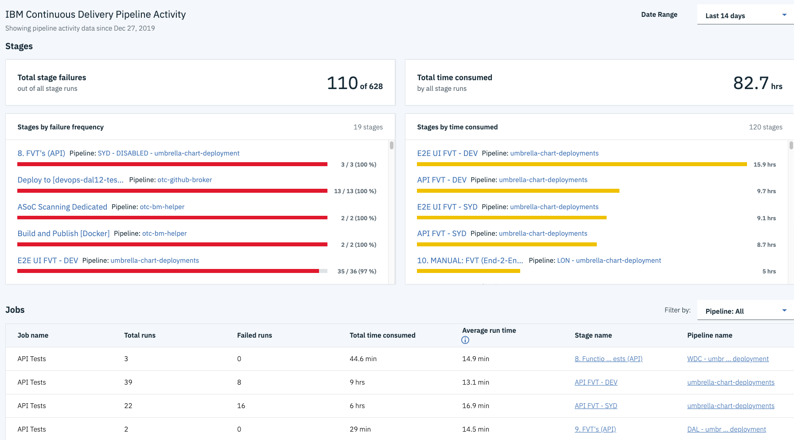

---

copyright:
  years: 2019
lastupdated: "2019-07-26"

keywords: devops insights, devops, insights, overview, pipeline data, cd pipeline

subcollection: DevOpsInsights

---

{:new_window: target="_blank"}
{:shortdesc: .shortdesc}
{:screen: .screen}
{:codeblock: .codeblock}
{:tip: .tip}
{:note: .note}
{:important: .important}
{:pre: .pre}
{:table: .aria-labeledby="caption"}

# Viewing your Delivery Pipeline activity
{: #viewing-data-overview}

The {{site.data.keyword.DRA_full}} Overview page automatically displays historical data from all of the {{site.data.keyword.contdelivery_full}} within your toolchain for the US-south and EU-gb locations. You can view data about the last two weeks for stage failures, total time that is consumed by all stage runs, and the total number of jobs. 
{:shortdesc}

 Figure 1. An example of the automatically filled data that is taken from the {{site.data.keyword.contdelivery_full}} attached to the same toolchain as this instance of the {{site.data.keyword.DRA_short}} Overview page. 

Viewing the status of your pipelines at a glance helps you to understand which jobs and stages are running into problems more often, and which runs are taking the longest time. You can troubleshoot and resolve issues with your pipelines to increase velocity for your deployments and better control of your processes.

## Before you begin
{: #prereq-overview-data}

You must have at least one {{site.data.keyword.contdelivery_full}} in your toolchain and an instance of {{site.data.keyword.DRA_short}}. For more information, see [Adding {{site.data.keyword.DRA_short}} to your toolchain](/docs/ContinuousDelivery?topic=ContinuousDelivery-add-devops-insights). 

{{site.data.keyword.DRA_short}} is free for Continuous Delivery users with Delivery Pipelines or a hosted Git. 
{: note}

## Viewing pipeline analytics
{: #viewing-analytics}

1. Click the **menu** icon , and select **DevOps**. 
2. Select your toolchain on the Toolchains page.
3. Click the **{{site.data.keyword.DRA_short}}** tile.
4. On the Overview page, you can view the following data:

  * Total stage failures: An aggregate of your pipeline's total number of stage failures and the total number of stages that you ran.  
  * Total time consumed: The total time that is used by all your stage runs.
  * Most frequently failing stages: A trend view of the top five most frequently failing stages to help you quickly identify the stages that are causing the most issues.
  * Most time-consuming stages: A trend view of the top five most time-consuming stages to help you understand where your pipeline runs are spending the most time.
  * Jobs: A granular view of all jobs. This view is helpful to isolate anomalies and directly link to the stage to investigate failures.

